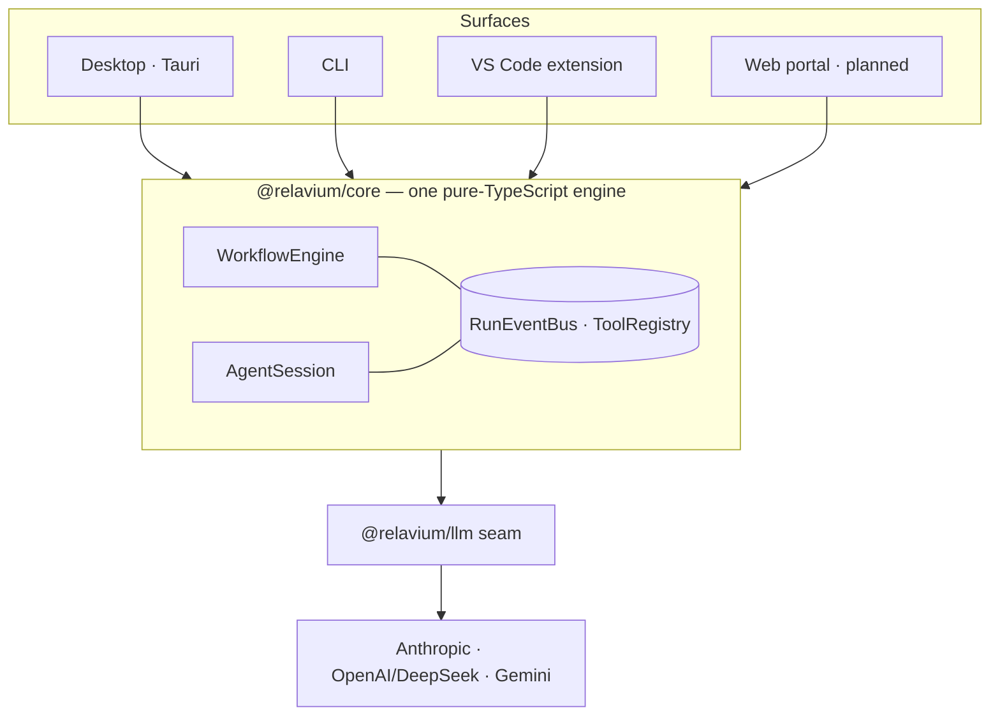

# Relavium

> **Start as an agent. Ship the workflow. Own every run.**
> A multi-surface, local-first AI agent workflow platform — a product of [HodeTech](https://github.com/HodeTech).

Relavium meets you where you already work — in conversation — and gives that
conversation somewhere to go. You **start as an agent**: a multi-turn session in your
terminal, in VS Code, or in a desktop chat panel. When a flow proves itself, you **ship
the workflow**: export the session to a git-committable, multi-agent, multi-model
`.relavium.yaml` pipeline that runs identically in your editor, your terminal, and your
CI. Or author workflows directly. Either way you **own every run** — every step
debuggable, every token and dollar tracked, every artifact yours, nothing leaving your
machine unless you choose it.

## Why Relavium?

- **Four surfaces, one engine.** Desktop (Tauri), CLI, VS Code, and (planned) the web
  portal run the _identical_ pure-TypeScript engine. No Python sidecar, no single-tool
  lock-in — every surface is a first-class execution target.
- **A chat-to-workflow continuum.** Other tools make every session ephemeral. Relavium
  sessions are persistent, resumable, and one-click exportable into a reviewed,
  committed workflow.
- **You own your LLM seam.** Multi-provider routing with fallback chains
  (`[claude → gpt-4o → gemini]`) is first-class through Relavium's own `@relavium/llm`
  abstraction over the official provider SDKs — no Vercel AI SDK, no LangChain.
- **Local-first by design.** Zero cloud, no account required. Your API keys live in your
  OS keychain — never in plaintext, never in logs. Optional managed inference and cloud
  execution are planned extensions on the same engine.
- **Workflows are git objects.** `.relavium.yaml` files are diffable, reviewable,
  PR-able, and shareable — team infrastructure, not a proprietary JSON blob or buried
  Python.
- **Multimodal, end-to-end.** Image / audio / video as input and output — including
  rule-driven media generation — flow through the same seam and engine.

## Highlights

- **Chat-to-workflow export** — turn a proven session into a reusable `.relavium.yaml`.
- **Persistent, resumable agent sessions** — no run is ever ephemeral.
- **Live execution** — tokens stream as the run progresses; parallel branches run together.
- **Multi-model fallback chains** — runs survive provider outages and rate limits.
- **Checkpoint & resume** — pause and resume at any node boundary, even across processes.
- **Human gates with timeout policy** — pause for an approve / reject / input decision.
- **Per-node cost waterfall** — token and dollar attribution per node, per model.
- **Interactive Home** — a bare `relavium` invocation opens a management center: start agents,
  monitor runs, browse history, manage providers.
- **MCP client** — agents consume tools from external MCP servers over stdio, HTTP, SSE, and
  WebSocket, with secrets in the keychain.
- **Live model catalog** — browse and switch models mid-session; per-model cost tracking.
- **Local-first, zero-install posture** — BYOK, OS keychain, no sign-up.

## Getting started

The CLI is the first usable surface. It ships as a single npm binary — `npm install -g relavium`
(the public npm publish is the final maintainer step of the **v0.1.1** release; until it lands, build from
source per [local dev setup](docs/runbooks/local-dev-setup.md)). Then **start as an agent → ship the workflow
→ own every run**:

```bash
# 1. Point Relavium at a provider — your key goes to the OS keychain, never a file
relavium provider add anthropic
echo "$ANTHROPIC_API_KEY" | relavium provider set-key anthropic   # the key is read from stdin, never argv

# 2. Start as an agent — a multi-turn session in your terminal
relavium chat
#    …converse until a flow proves itself, then run /export inside the REPL
#    to ship the session to a git-committable .relavium.yaml

# 3. Own every run — execute the workflow and stream every event (CI-friendly with --json)
relavium run ./my-workflow.relavium.yaml --json
```

Prefer to author directly? `relavium create` scaffolds an agent or a minimal single-agent workflow, and
`relavium import` / `relavium export` move them between projects. The full surface is the
[CLI command reference](docs/reference/cli/commands.md).

## Architecture



One engine, **two co-equal entry points** — `WorkflowEngine` (runs YAML pipelines) and
`AgentSession` (runs conversational chat) — sharing the same tool registry, the same
`@relavium/llm` multi-provider seam, and the same event bus. The engine has **zero
platform-specific imports**, so the same source runs in the Tauri WebView, the VS Code
host, the Node CLI, and (planned) a Bun server. Supporting packages: `@relavium/shared`
(Zod contracts), `@relavium/db` (Drizzle — SQLite locally, PostgreSQL planned), and
`@relavium/ui` (ReactFlow canvas + shadcn). See [docs/architecture/](docs/architecture/).

## Execution modes

One engine, three modes behind the one `LLMProvider` seam:

- **Local (BYOK)** — the default. Your keys, your machine, zero Relavium data.
- **Managed inference** — planned. Relavium's metered keys; the engine still runs locally.
- **Cloud execution** — planned. Run workflows on cloud workers for 24/7 automation and
  team sharing.

## Status

The engine is complete and the CLI is feature-complete (cut as **v0.1.1**, npm publish pending).
What's shipped:

- **Agent sessions** — `relavium chat` with persistent, resumable, exportable multi-turn sessions.
- **Workflow engine** — `relavium run` executes `.relavium.yaml` pipelines with live streaming,
  checkpoint/resume, multi-model fallback, cost governance, and human gates.
- **Interactive Home** — the bare `relavium` invocation opens a management center with a
  slash-command system, per-tool approval modes (ask/plan/accept-edits/auto), and context compaction.
- **MCP client** — agents consume tools from external MCP servers over stdio + network
  transports, with secrets in the OS keychain.
- **Live model catalog** — onboard with a wizard, browse models, switch mid-session, track
  per-model cost.
- **YAML authoring** — `relavium create` (wizard), `import`, and share-safe `export`.

**Next: Phase 2.6 (Conversational Authoring and the First-Class CLI)** — a full-screen
Home-managed CLI with conversational workflow authoring, management browsers, competitor-breadth
tools, settings/theming, and `en`/`tr` localization. For live status and the full roadmap, see
[docs/roadmap/current.md](docs/roadmap/current.md) and the [roadmap](docs/roadmap/README.md).

## Documentation

The canonical documentation lives in [`docs/`](docs/) — start at
[docs/README.md](docs/README.md), which is organized by _the kind of question each
section answers_.

| Start here | |
|------------|---|
| [Vision](docs/vision.md) · [Product constraints](docs/product-constraints.md) · [UVP](docs/uvp.md) | What and why |
| [Tech stack](docs/tech-stack.md) · [Project structure](docs/project-structure.md) | What it's built with |
| [Architecture](docs/architecture/) · [Decisions (ADRs)](docs/decisions/) · [Reference](docs/reference/) | How it works |
| [Roadmap](docs/roadmap/README.md) · [Standards](docs/standards/) | Where it's going, and the rules |

## License

Relavium is **proprietary software** — © 2026 HodeTech, all rights reserved. It is
**not** open source and grants no rights except as expressly stated. See
[LICENSE](LICENSE) for the full terms. For licensing inquiries, written permission, or
commercial-use agreements, contact [HodeTech](https://github.com/HodeTech).
