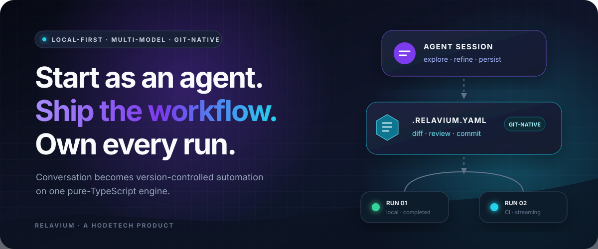
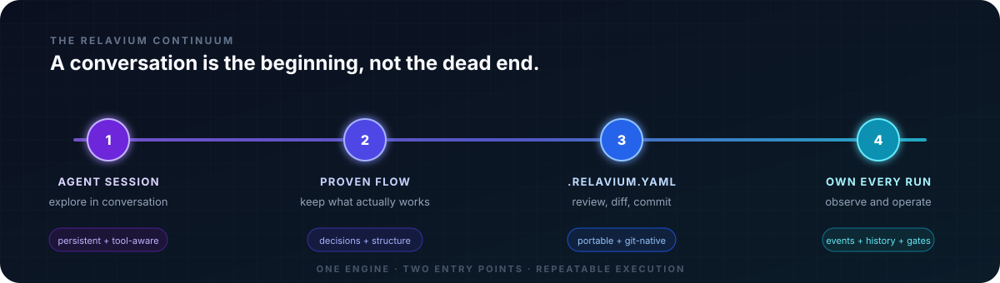
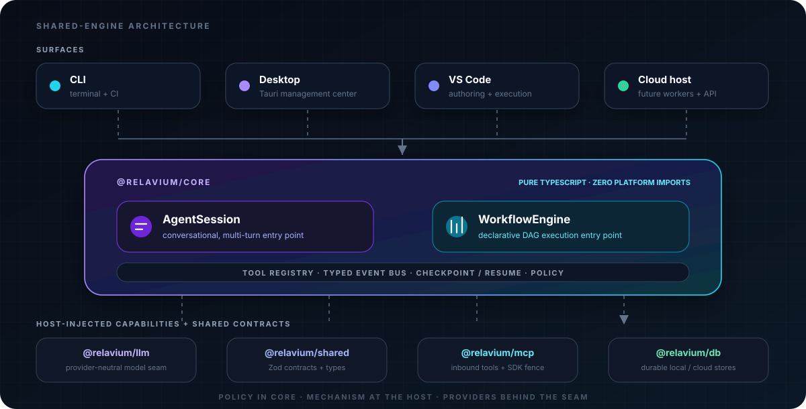

# Relavium

<p align="center">
  
</p>

<p align="center">
  <strong>Start as an agent. Ship the workflow. Own every run.</strong>
</p>

<p align="center">
  A local-first AI agent platform that turns productive conversations into<br>
  version-controlled, multi-agent workflows — on one pure-TypeScript engine.<br>
  A product of <a href="https://github.com/HodeTech">HodeTech</a>.
</p>

<p align="center">
  <a href="https://www.npmjs.com/package/relavium"></a>
  <a href="https://github.com/HodeTech/Relavium/actions/workflows/ci.yml"></a>
  
  
  
  
</p>

<p align="center">
  <a href="#get-started">Get started</a> ·
  <a href="#why-relavium">Why Relavium</a> ·
  <a href="#architecture">Architecture</a> ·
  <a href="#project-status">Status</a> ·
  <a href="docs/README.md">Documentation</a>
</p>

Relavium begins where agent work naturally begins: in conversation. Explore a task in a
persistent session, keep the flow that proves useful, and graduate it into a reviewable
`.relavium.yaml` workflow. The conversation and the workflow are not separate products —
they are two entry points into the same engine, tool registry, model seam, and event stream.

## From conversation to infrastructure

<p align="center">
  
</p>

Most agent tools make you choose between a flexible chat and an operable workflow. Relavium
treats them as a continuum:

1. **Explore in an agent session.** Work conversationally with streaming output, tools,
   model controls, persistent history, and human approval.
2. **Promote what works.** Export the proven flow into git-native YAML that can be reviewed,
   changed in a PR, and shared without embedding provider keys.
3. **Run it deliberately.** Execute locally or in CI with typed events, durable history,
   human gates, checkpoints, and cost controls.

You can also author the workflow directly; conversation is an on-ramp, not a requirement.

## Get started

The published CLI is the fastest way to use Relavium. It requires **Node.js 22 or newer**.

```bash
npm install -g relavium
```

1. Connect a provider. The key is read from stdin and stored in the OS keychain —
   never passed through argv.

```bash
relavium provider add anthropic
printf '%s\n' "$ANTHROPIC_API_KEY" | relavium provider set-key anthropic
```

2. Start as an agent.

```bash
relavium chat
```

3. Run `/export` inside the session to create a git-committable workflow. Execute it
   interactively, or stream NDJSON for CI with `--json`.

```bash
relavium run ./my-workflow.relavium.yaml --json
```

Prefer to author first? `relavium create` scaffolds an agent or a minimal workflow;
`relavium import` and `relavium export` move validated artifacts between projects. See the
[CLI command reference](docs/reference/cli/commands.md) for the complete surface and the
[local development runbook](docs/runbooks/local-dev-setup.md) to build from source.

## Why Relavium

| | |
|---|---|
| **Conversation becomes infrastructure** | A useful session can graduate into a durable workflow instead of disappearing into chat history. |
| **Git-native by construction** | Workflows are diffable `.relavium.yaml` files — reviewable in pull requests and owned by the team that runs them. |
| **Multi-model without framework lock-in** | Relavium owns its `LLMProvider` seam and routes across Anthropic, OpenAI-compatible providers, and Gemini without LangChain or the Vercel AI SDK. |
| **Local-first control** | Local BYOK is the default, no Relavium account is required, and provider keys are stored in the OS keychain rather than workflow files. |
| **Execution you can inspect** | Typed event streams, local run history, human gates, checkpoints, retries, fallback chains, and cost controls make a run observable. |
| **One engine, multiple surfaces** | `AgentSession` and `WorkflowEngine` share one platform-pure core designed for the CLI, desktop, VS Code, and future cloud workers. |

## Architecture

<p align="center">
  
</p>

The center of Relavium is `@relavium/core`, a strict TypeScript engine with **zero
platform-specific imports**. It exposes two co-equal entry points:

- **`AgentSession`** for conversational, multi-turn work.
- **`WorkflowEngine`** for declarative `.relavium.yaml` execution.

Both reuse the same `ToolRegistry`, typed event substrate, and Relavium-owned
`@relavium/llm` abstraction. Official provider SDKs are confined to thin adapters; no
vendor SDK type crosses the seam. Host packages supply persistence, MCP connections,
keychain access, files, processes, and network I/O without making the engine
platform-specific. Read the [architecture overview](docs/architecture/) or the
[decision records](docs/decisions/) for the reasoning behind those boundaries.

> The CLI is the currently published product surface. Desktop and VS Code integrations,
> plus managed inference and cloud execution, are under development or planned. The
> diagram shows the shared-engine topology, not equal release availability.

## What ships today

| Capability | Available in `relavium@0.1.1` |
|---|---|
| Conversational agents | Streaming multi-turn chat, persisted sessions, resume, model reseat, context compaction, and workflow export |
| Workflow runtime | YAML parse and validation, DAG execution, parallel branches, retries, model fallback, checkpoints, and typed live events |
| Human control | Per-tool approval modes plus durable workflow gates that can pause and resume out of process |
| Operations | Interactive Home, run status and history, event-log replay, deterministic exit codes, and NDJSON output for CI |
| Providers and tools | Anthropic, OpenAI-compatible, Gemini, an inbound MCP client, built-in tools, and a live/offline model catalog |
| Local ownership | BYOK, OS-keychain storage, project-local git artifacts, and local run/session history |

For exact command behavior and contracts, use the [reference documentation](docs/reference/)
rather than this overview.

## Local-first, precisely

- **No account is required for local BYOK.** The CLI runs the engine and stores history on
  your machine.
- **Provider keys do not belong in workflows or committed configuration.** Interactive
  setup stores them in the OS keychain; a documented environment fallback exists for
  automation.
- **Workflows remain ordinary files.** They can be reviewed, branched, reverted, and moved
  without exporting from a proprietary database.
- **Network use is explicit.** LLM requests go to the provider you configure; optional
  catalog refreshes and future managed/cloud modes are not hidden prerequisites for local
  execution.

The binding guarantees live in the [product constraints](docs/product-constraints.md) and
[security standard](docs/standards/security-review.md).

## Project status

Relavium is under active development. The **CLI is published as v0.1.1**; the pure engine,
agent-session entry point, workflow runtime, inbound MCP client, and CLI management surface
are implemented. The current engineering focus is **Phase 2.6.5 — Core Reliability
Remediation**, which hardens the execution core before the next product wave opens.

Status changes quickly, so this README intentionally stays high-level. The canonical source
for the exact active wave, completed work, and open reliability obligations is
[docs/roadmap/current.md](docs/roadmap/current.md).

## Repository map

| Path | Responsibility |
|---|---|
| [`packages/core`](packages/core/) | Platform-pure agent-session and workflow engine |
| [`packages/llm`](packages/llm/) | Relavium model seam, adapters, fallback, usage, and cost logic |
| [`packages/shared`](packages/shared/) | Zod schemas and inferred types — the contract source of truth |
| [`packages/db`](packages/db/) | Local SQLite persistence with a Postgres-compatible schema and migrations |
| [`packages/mcp`](packages/mcp/) | SDK-confined inbound MCP client and schema validation |
| [`apps/cli`](apps/cli/) | Published terminal product and integration harness |
| [`apps/desktop`](apps/desktop/) | Tauri desktop surface under development |
| [`apps/vscode-extension`](apps/vscode-extension/) | VS Code surface under development |

The full dependency graph and ownership rules live in
[docs/project-structure.md](docs/project-structure.md).

## Development

Relavium is a pnpm + Turborepo monorepo. For a first local verification:

```bash
corepack enable
pnpm install --frozen-lockfile
pnpm run ci
```

Use pnpm only — never npm or yarn for workspace development. Start with the
[local development setup](docs/runbooks/local-dev-setup.md), then read
[`CLAUDE.md`](CLAUDE.md) or [`AGENTS.md`](AGENTS.md) before making changes.

## Documentation

The canonical documentation is organized by the question you are trying to answer:

| Start here | Answers |
|---|---|
| [Vision](docs/vision.md) · [Product constraints](docs/product-constraints.md) · [UVP](docs/uvp.md) | What is Relavium, and why does it exist? |
| [Architecture](docs/architecture/) · [ADRs](docs/decisions/) | How is it built, and why these boundaries? |
| [Reference](docs/reference/) | What are the exact YAML, event, CLI, database, and integration contracts? |
| [Roadmap](docs/roadmap/README.md) · [Current state](docs/roadmap/current.md) | What is shipped, active, and next? |
| [Standards](docs/standards/) · [Runbooks](docs/runbooks/) | How should the project be changed and operated? |

## License

Relavium is **proprietary software** — © 2026 HodeTech, all rights reserved. It is
not open source and grants no rights except as expressly stated. See [LICENSE](LICENSE)
for the full terms. For licensing inquiries or commercial-use agreements, contact
[HodeTech](https://github.com/HodeTech).
