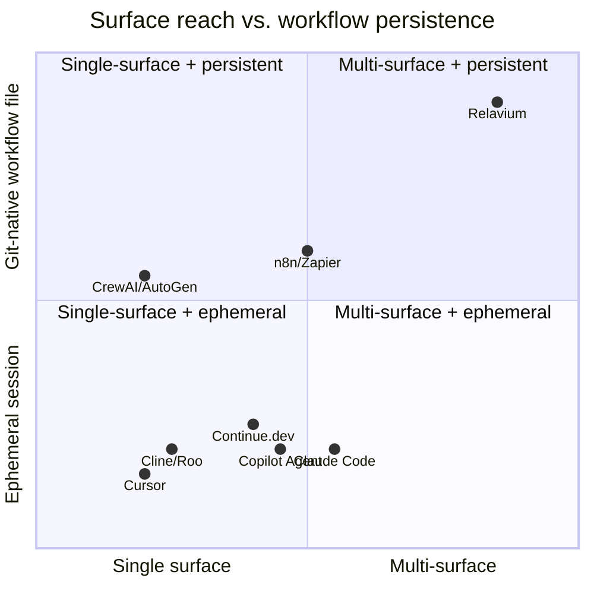

# Competitive Landscape

- **Status**: Analysis
- **Date**: 2026-06-05
- **Related**: [uvp.md](../uvp.md), [vision.md](../vision.md), [product-constraints.md](../product-constraints.md)

This is a point-in-time competitive analysis of the AI-coding / agent-workflow space as
of 2026-06-05. It maps where Relavium sits against the tools developers already use, and
where Relavium's structural differences create an advantage. It is **analysis, not a
spec** — for the canonical value proposition see [uvp.md](../uvp.md); for the product
scope it assumes see [product-constraints.md](../product-constraints.md).

It supersedes the [2026-06-03 analysis](competitive-landscape-2026-06-03.md), which
predates the agent-first pivot ([ADR-0024](../decisions/0024-agent-first-entry-point-agentsession.md),
[ADR-0026](../decisions/0026-session-export-to-workflow.md)). The earlier file is frozen
as the record of the pre-pivot market read; this one carries the **two-entry-point**
thesis.

> This document is dated. When the analysis is redone, add a new
> `competitive-landscape-YYYY-MM-DD.md` rather than overwriting this one — the dated
> trail is the record of how the market moved.

## The structural thesis

Every competitor owns **at most two surfaces** and treats AI interaction as a *session*
or a *completion*. Relavium's structural bets are different:

1. **Four surfaces, one runtime.** Desktop canvas, VS Code extension, CLI, and
   (Phase 2) web portal all run the *same* `@relavium/core` engine, so behavior is
   identical whether triggered from an editor, a terminal, the canvas, or CI.
2. **Two entry points, one engine.** The same runtime is reachable two ways: an
   **agent chat** (a multi-turn conversation — the `AgentSession` entry point) *and* a
   **workflow** (a git-committable `.relavium.yaml` DAG). Both ride one substrate
   (`ToolRegistry`, the `@relavium/llm` seam, the event bus); see
   [ADR-0024](../decisions/0024-agent-first-entry-point-agentsession.md).
3. **The workflow is a git-committable file**, not a session or a vendor database row.
   A `.relavium.yaml` is reviewable, diffable, reversible, and shareable through the same
   git workflow as code.
4. **A one-way chat → workflow continuum.** A chat session is auto-persisted and
   resumable, and can be **exported to a workflow scaffold** that is reviewed before
   commit — so Relavium sits at *both* the start (conversation) and the destination
   (committed workflow). See
   [ADR-0026](../decisions/0026-session-export-to-workflow.md) and the contract in
   [agent-session-spec.md](../reference/contracts/agent-session-spec.md).

These bets are the lens for the comparison below.

## Where Relavium fits

Relavium still sits in the top-right (multi-surface + git-native), but the agent-first
pivot moves it *along* the path most competitors live on: it now meets users where they
already are — a conversation — and then carries them up to the persistent, committable
artifact. The competitors clustered low-left have no path *off* the ephemeral session;
Relavium's chat is the same low-left starting point with a route out.

## Competitor-by-competitor

### Claude Code (Anthropic)

- **Strengths:** deep Claude integration with strong reasoning; excellent native CLI and
  terminal UX; tight VS Code editor integration; agentic file editing with bash
  execution; Anthropic's trust and safety credibility.
- **Gaps:** single-model only (no model switching or multi-model orchestration); no
  visual workflow canvas; no workflow persistence or version control; one agent per
  session, no multi-agent coordination; sessions are ephemeral with no resumable,
  committable artifact; no team sharing or org governance; no CI/CD integration path;
  CLI and extension feel like different products.
- **Relavium's advantage:** Relavium now offers **conversational parity** with Claude
  Code — an agent chat as a first-class entry point on every surface (`relavium chat`, a
  desktop Chat tab, a VS Code coding assistant) — and then adds what Claude Code lacks:
  the same conversation is **auto-persisted and resumable**, and **exports to a workflow
  scaffold** ([ADR-0026](../decisions/0026-session-export-to-workflow.md)) that becomes a
  reviewable, version-controllable `.relavium.yaml`. On top of that come multi-model
  routing, multi-agent orchestration, and visual design. A Claude Code user is no longer
  asked to leave chat behind to get value — they start in the same place and graduate
  when single-agent, single-model, ephemeral work hits its ceiling.

### Cursor

- **Strengths:** best-in-class AI-native editor; fast inline completions and multi-file
  edits; agent mode with strong codebase awareness; large loyal community; predictable
  pricing.
- **Gaps:** editor-only (no CLI, no canvas, no portal); no visual workflow builder;
  every session starts from scratch — no reuse; no multi-agent coordination; locked into
  the Cursor fork (no standard VS Code or JetBrains); no CI/CD parity; no team workflow
  library or governance.
- **Relavium's advantage:** Cursor wins on editor polish but creates vendor lock-in and
  has no workflow abstraction layer. Relavium is an orchestration layer *above* any
  editor — keep your preferred tools and gain reusable, shareable, versioned workflows,
  with a conversational entry point that, unlike Cursor's, survives the session and
  exports to a committable artifact.

### Continue.dev

- **Strengths:** fully open-source with strong community trust; genuine multi-model
  support (including local models); VS Code and JetBrains; highly configurable via
  `config.json`; bring-your-own-key, no lock-in.
- **Gaps:** no visual canvas or designer; single-agent sessions only; no
  version-controllable workflow files; no CLI for CI/CD; no desktop app; no team/
  enterprise portal; community-paced enterprise roadmap.
- **Relavium's advantage:** Relavium shares the multi-model, bring-your-own-key
  philosophy but adds the orchestration and workflow-abstraction layer above chat/
  autocomplete. Continue.dev users who want to *chain* agents and *persist* workflows are
  a natural upgrade path — and Relavium's chat carries them there directly, since the
  conversation itself exports to the workflow.

### Cline / Roo-code

- **Strengths:** highly capable agentic coding with browser and terminal access;
  open-source and extensible; strong power-user community; model-agnostic; aggressive
  agentic capabilities (filesystem, shell, browser).
- **Gaps:** purely conversational agent paradigm, no canvas; no workflow version control
  or reuse; single agent per session; no team collaboration; no CLI for CI/CD; no desktop
  or portal; high token cost per session with no optimization layer; no governance.
- **Relavium's advantage:** Cline is the power user's agentic workhorse, but every run is
  ephemeral and manual. Relavium matches the conversational paradigm Cline users live in,
  then adds the orchestration layer that makes that same execution **resumable**,
  reusable, composable, team-shareable, visually designed, and version-controlled — the
  chat is where work starts, the exported workflow is where it stops being ephemeral.

### GitHub Copilot Agent Mode

- **Strengths:** massive distribution through GitHub; deep GitHub integration (PRs,
  issues, Actions, Codespaces); Microsoft enterprise trust; familiar UX for millions;
  repo-wide context awareness.
- **Gaps:** GitHub/Microsoft ecosystem lock-in; no visual canvas or designer; no
  multi-model routing (Microsoft/OpenAI models only); no local-first execution (runs go
  through Microsoft infra); workflows are not portable, version-controllable artifacts;
  VS Code only; limited multi-agent coordination; weak for teams not on GitHub.
- **Relavium's advantage:** Copilot Agent Mode is powerful *inside the GitHub bubble* but
  deeply locked to it. Relavium is VCS-agnostic, model-agnostic, and surface-agnostic —
  the same workflow runs from VS Code, CLI, canvas, or CI regardless of git host, and the
  agent chat that produced it is owned locally rather than living in a vendor's infra.

### n8n / Zapier

- **Strengths:** mature visual workflow builders with large node libraries; strong
  non-technical adoption; n8n is self-hostable and open-core; hundreds of SaaS
  connectors; proven enterprise business model.
- **Gaps:** not AI-native (LLM nodes are bolted on, not first-class); no developer-native
  surfaces (no VS Code, no dev CLI); cannot natively run code agents or shell commands;
  no local-first model (cloud or self-hosted server); no understanding of code, repos, or
  dev workflows; no multi-agent AI primitives; no IDE integration; no conversational
  entry point at all.
- **Relavium's advantage:** n8n and Zapier own *general* automation but have no
  credibility in the developer AI-agent space. Relavium is the developer-native, AI-first
  version — with code context, IDE integration, agent orchestration, and a conversational
  on-ramp they can't replicate.

### CrewAI / AutoGen

- **Strengths:** powerful multi-agent orchestration frameworks; flexible, programmable
  agent topologies; active open-source communities; rich agent-to-agent communication;
  research and enterprise adoption for complex pipelines.
- **Gaps:** Python framework only — no IDE integration, no visual canvas; no VS Code
  extension or CLI for non-Python users; no desktop app or designer; requires Python
  expertise; no human-readable, version-controllable workflow format; no native
  local-first execution on dev machines; no portal for governance; high barrier to entry.
- **Relavium's advantage:** CrewAI and AutoGen prove multi-agent orchestration is
  valuable but demand Python expertise and produce no visual artifacts. Relavium delivers
  the same multi-agent power through a conversational entry point, a visual canvas, and
  YAML files any developer can read, edit, and share — no framework expertise required.
  (Relavium reuses the *concepts* from this space, not the Python idiom; see
  [ADR-0003](../decisions/0003-pure-ts-engine-not-langgraph-python.md).)

## Summary matrix

| Capability | Claude Code | Cursor | Continue | Cline/Roo | Copilot Agent | n8n/Zapier | CrewAI/AutoGen | **Relavium** |
|---|---|---|---|---|---|---|---|---|
| Multi-surface agent chat | partial (CLI+IDE) | ✗ (editor) | partial (IDE) | ✗ | ✗ | ✗ | ✗ | **✓** |
| Chat → workflow export | ✗ | ✗ | ✗ | ✗ | ✗ | ✗ | ✗ | **✓** |
| Multi-model routing | ✗ | ✗ | ✓ | ✓ | ✗ | partial | ✓ | **✓** |
| Multi-agent orchestration | ✗ | ✗ | ✗ | ✗ | partial | ✗ | ✓ | **✓** |
| Visual workflow canvas | ✗ | ✗ | ✗ | ✗ | ✗ | ✓ | ✗ | **✓** |
| Git-native workflow files | ✗ | ✗ | ✗ | ✗ | ✗ | ✗ (JSON blobs) | partial (code) | **✓** |
| Local-first execution | partial | partial | ✓ | ✓ | ✗ | ✗ | partial | **✓** |
| CLI for CI/CD | ✓ | ✗ | ✗ | ✗ | ✗ | partial | partial | **✓** |
| VS Code extension | ✓ | n/a (fork) | ✓ | ✓ | ✓ | ✗ | ✗ | **✓** |
| Desktop app | ✗ | ✓ (editor) | ✗ | ✗ | ✗ | ✗ (web) | ✗ | **✓** |
| No vendor lock-in | partial | ✗ | ✓ | ✓ | ✗ | partial | ✓ | **✓** |

## Strategic takeaways

- **Chat is the on-ramp.** The conversational coding assistant is the entry point users
  already reach for, and every competitor in the low-left of the quadrant lives there.
  Relavium now meets the senior developer or tech lead *in that conversation* — across
  CLI, desktop, and VS Code — instead of asking them to start with a canvas; nobody has to
  learn the workflow model to get value on day one. (The committed workflow file remains the
  go-to-market *wedge* — see [uvp.md](../uvp.md); chat is the acquisition on-ramp, the workflow is the spread.)
- **The chat → workflow continuum is the moat.** No competitor turns a conversation into
  a reviewable, committable artifact. Relavium does: a chat is auto-persisted, resumable,
  and **exports to a `.relavium.yaml` scaffold** reviewed before commit
  ([ADR-0026](../decisions/0026-session-export-to-workflow.md)). That continuum is what
  no session-based tool offers — the same work that started as throwaway chat becomes a
  versioned, shareable workflow. Relavium owns *both* ends of the lifecycle.
- **The workflow file is the viral mechanic.** A `.relavium.yaml` committed to a team
  repo — including one that *began* as a chat export — is the invite: every teammate who
  pulls the repo encounters it, installs the extension to run it, and becomes a user.
  Value compounds with team size in a way no session-based tool can match.
- **Risk — chat is the most contested surface, and we compete on the *continuum*, not parity.**
  Conversational parity with Claude Code / Cursor / Cline / Copilot is a high bar against
  deeply-resourced incumbents, and Relavium's chat surfaces arrive *after* the engine (build phases
  2–4) on a deliberately minimal `LLMProvider` seam. So the bet is made with eyes open: the defensible
  moat is **not** out-chatting the category leaders — it is the **chat → workflow continuum + the
  git-native, portable workflow artifact + local-first**, which none of them produce. Relavium wins as
  the *familiar on-ramp that graduates into something they can't*, not by winning the conversational
  surface head-on. Treating "conversational parity" as the headline would be the strategic error to avoid.
- **Local-first is a Phase-1 trust moat.** Until a competitor offers conversational entry
  + visual design + local execution + multi-model routing + multi-agent orchestration in
  one product with zero data leaving the machine, Relavium owns the security-conscious
  developer segment. Chat transcripts are persisted in the encrypted local `history.db`,
  not a vendor database.
- **Phase-2 cloud is a business-model unlock, not a feature gap.** Cloud execution,
  scheduling, and team governance are deliberately deferred (see
  [product-constraints.md](../product-constraints.md)); they are gated on real Phase-1
  demand, not built speculatively.

> Source: the 7-competitor analysis in the frozen `synthesis-raw.json` (`strategy`
> section), re-read through the agent-first pivot. See the
> [archive provenance map](_archive/README.md).
