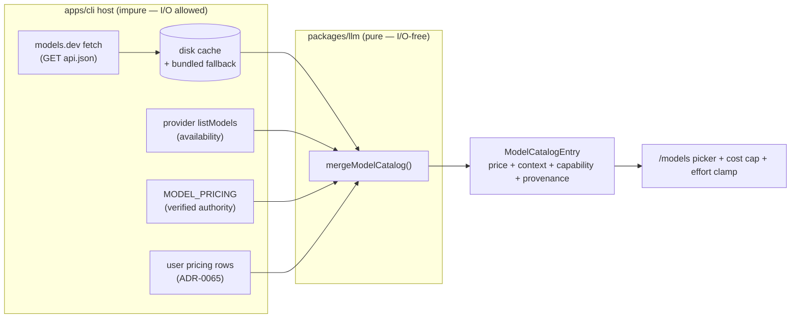

# Dynamic model-catalog enrichment from `models.dev`

- **Status**: Draft analysis (informs a future ADR; not itself binding)
- **Date**: 2026-07-11
- **Related**: [ADR-0064](../decisions/0064-live-model-catalog.md) · [ADR-0065](../decisions/0065-provider-economics-and-extensibility.md) · [ADR-0066](../decisions/0066-normalized-reasoning-effort-control.md) · [ADR-0011](../decisions/0011-internal-llm-abstraction.md) · [CLAUDE.md](../../CLAUDE.md) rules 2/5/6/8

> This is exploratory analysis, not a spec. It weighs whether — and how — Relavium should
> enrich its model catalog from the open [`models.dev`](https://models.dev) database, with
> the alternatives and their trade-offs, so the eventual decision can be recorded as an ADR
> that extends [ADR-0064](../decisions/0064-live-model-catalog.md). Concrete contracts (the
> merge shape, the DB DDL, the seam) live in their canonical homes and are linked, never
> restated.

## 1. Context — the two gaps that triggered this

Relavium's catalog today reconciles two sources ([ADR-0064](../decisions/0064-live-model-catalog.md) §6):

- **Availability** ← the provider's own live `listModels` (`/v1/models`), fetched at runtime.
- **Pricing + context** ← the **static in-code registry** `MODEL_PRICING`
  ([pricing.ts](../../packages/llm/src/pricing.ts)) — the verified, hand-maintained authority.

Two concrete gaps surfaced in practice:

1. **The pricing long tail.** A provider's live list returns *dozens* of model ids
   (`gpt-5.1`, `gpt-5.2`, `gpt-5.4`, `gpt-5.4-pro`, …), but `MODEL_PRICING` prices only the
   handful that were hand-entered. Every unpriced id has `priceKnown: false`, so the cost cap
   (`max_cost_microcents`) **does not apply** — spend runs uncapped on the models a key can
   actually reach. The static registry inevitably lags the provider catalog.
2. **The capability blind spot.** Relavium has **no per-model capability data**. The
   reasoning-effort mapping ([openai.ts](../../packages/llm/src/adapters/openai.ts)
   `OPENAI_REASONING_EFFORT`, [ADR-0066](../decisions/0066-normalized-reasoning-effort-control.md))
   is **provider-global**, and there is no record of which effort tiers a *specific* model
   accepts, nor whether it accepts a `temperature`. Sending a value a model rejects yields an
   opaque `error: validation` (a provider HTTP 400 → `bad_request` → `validation`) with the
   message suppressed on the chat surface. For example `gpt-5.4-pro` accepts only
   `medium/high/xhigh`, and `gpt-5.4-mini` rejects `temperature` entirely — facts Relavium
   cannot know today.

Both gaps have the same root: **there is no machine-readable source of model economics or
capabilities in the provider APIs themselves.** No major provider returns pricing from its
API, and only some return a context window. This is exactly the gap the community project
[`models.dev`](https://models.dev) exists to fill.

## 2. What `models.dev/api.json` is

`models.dev` is an **MIT-licensed, open-source database of AI models** maintained by the
OpenCode team (`anomalyco/models.dev`). Its shape and provenance (verified 2026-07-11):

- **Source of truth**: one **TOML file per model**, `providers/<provider>/models/<model>.toml`,
  edited by **community pull requests** plus **automated per-provider sync scripts**
  (`bun models:sync openai`) that a CI pipeline runs and opens PRs from.
- **Published artifact**: the TOML tree is compiled into a single JSON served at
  **`https://models.dev/api.json`** — a top-level object **keyed by provider id**, each with
  `{ id, name, api, doc, env, npm, models }`, and `models` keyed by model id.
- **Scale (2026-07-11)**: **159 providers**; the generated JSON is **~432 KB**.
- **Per-model fields** (the payload that matters here):

  ```json
  {
    "id": "gpt-5.4-mini",
    "name": "GPT-5.4 mini",
    "reasoning": true,
    "reasoning_options": [{ "type": "effort", "values": ["none","low","medium","high","xhigh"] }],
    "temperature": false,
    "tool_call": true,
    "structured_output": true,
    "modalities": { "input": ["text","image"], "output": ["text"] },
    "limit": { "context": 400000, "output": 128000 },
    "cost": { "input": 0.75, "output": 4.50, "cache_read": 0.075 }
  }
  ```

Its `cost` block gives us the **pricing long tail**; its `reasoning_options.values` +
`temperature` + `structured_output` + `modalities` give us the **capability matrix** — the two
things §1 said we lack. Cross-checked against `MODEL_PRICING`, the `gpt-5.4-mini` price matches
our hand-entered row exactly, which is a useful confidence signal that models.dev's economics
data is accurate for the ids we can verify.

**How the ecosystem consumes it** (evidence for the alternatives below):

- **OpenCode** fetches `api.json` at runtime, caches it to disk with a **5-minute TTL**, guards
  the cache with a cross-process file lock, and honours `OPENCODE_MODELS_URL` /
  `OPENCODE_MODELS_PATH` overrides.
- **LiteLLM** (which **CrewAI** depends on for cost) fetches its equivalent
  `model_prices_and_context_window.json` at runtime, but ships a **bundled backup** in the
  package, runs **integrity validation** (reject if the fetched map is empty, below a minimum
  model count, or shrank past a ratio vs. the backup), and exposes
  `LITELLM_LOCAL_MODEL_COST_MAP=True` to force the local copy.

Both production consumers are **remote-first with a local safety net**. That pattern is the
backbone of the recommendation in §7.

## 3. The precise design question — and a reframing

> **Question**: should Relavium pull per-model **price** and **effort/capability** values from
> `models.dev/api.json`, and if so, *dynamically at runtime* or via some less-coupled path?

One reframing is load-bearing and prevents a category error:

**"Adding a provider from models.dev" does not make the engine able to call it.** Relavium's
`ProviderId` is a **closed enum** of the four adapters the engine ships
([types.ts](../../packages/llm/src/types.ts); [ADR-0064](../decisions/0064-live-model-catalog.md)
keeps it closed deliberately). models.dev has 159 providers; none of them become callable by
appearing in `api.json`. Calling a new provider needs an **adapter** (a seam implementation —
[ADR-0011](../decisions/0011-internal-llm-abstraction.md)), or the
[ADR-0065](../decisions/0065-provider-economics-and-extensibility.md) **custom OpenAI-compatible
`base_url`** path.

Therefore the scope of this work is **enrichment, not extensibility**: attaching richer
economics + capability data to the models Relavium can **already** call (the four known
providers and any ADR-0065 custom endpoints). It is a **catalog data source**, not a new
execution surface.

## 4. Where it fits — and what it must not touch

The catalog merge is already tiered. `mergeModelCatalog`
([model-catalog.ts](../../packages/llm/src/model-catalog.ts)) is **pure and I/O-free**: the host
resolves each tier and passes plain data in. Today `Tiers = { live, registry, user }` with
pricing precedence **registry > user** (`pricingSourceOf`). A models.dev tier slots in as one
more input to that same pure function.

Three boundaries constrain *where the fetch itself lives*:

- **Engine purity ([CLAUDE.md](../../CLAUDE.md) #5).** `packages/core` and the pure parts of
  `packages/llm` take **zero** platform imports. The network fetch **cannot** live there. It
  belongs in the **CLI host** (`apps/cli`), exactly where the existing
  [`ModelRefreshService`](../../apps/cli/src/engine/model-refresh.ts) already performs the
  provider `listModels` fetch. The pure merge helper only gains a data tier.
- **The seam stays frozen ([ADR-0011](../decisions/0011-internal-llm-abstraction.md)).** This is
  **not** a provider `listModels` call — it is a separate host-side data source. The
  `LLMProvider` contract is untouched; no vendor type crosses it.
- **Secrets never leave the keychain ([CLAUDE.md](../../CLAUDE.md) #6).** Fetching a public
  static file sends **no** key, prompt, or model selection — it is an unauthenticated `GET` of a
  fixed public URL. (Privacy nuance in §6.4.)



## 5. Two separable payloads

The two gaps are independent and can ship — and be *governed* — separately. Keeping them
distinct de-risks the decision:

| Payload | Existing authority | Risk if wrong | Independence |
|---|---|---|---|
| **Pricing** (`cost.*`) | verified `MODEL_PRICING` | **High** — feeds the cost cap, a *safety* mechanism; a too-low price lets spend overrun | must never override a verified price |
| **Capability** (`reasoning_options.values`, `temperature`, `structured_output`, `modalities`) | **none today** | **Low** — worst case is an over-restrictive clamp or a still-attempted call that fails as it does now | purely additive; no authority conflict |

The **capability payload is the safer, higher-leverage half**: it has no competing authority
and it directly closes the `error: validation` bug by letting the adapter **clamp or reject**
an out-of-range effort/temperature *before* the wire call. The pricing payload is the one that
demands care around authority and trust (§6.1–6.2).

## 6. Cross-cutting concerns (apply to every alternative)

### 6.1 Pricing authority and precedence
[ADR-0064](../decisions/0064-live-model-catalog.md) §6 is explicit: the in-repo registry is the
**pricing authority**; a fetched tier must **never overwrite or zero a known price**. models.dev
is third-party community data — trustworthy but not repo-reviewed. The safe precedence therefore
keeps the verified registry on top and adds models.dev as a *fill-the-unknowns* tier below the
explicit user tier:

```text
registry (verified)  >  user (explicit override)  >  models.dev (community)  >  none
```

This needs a new `PricingSource` value (e.g. `'models-dev'`) so provenance is visible everywhere
(`priceKnown` stays true, but the picker can annotate "community price — verify", and telemetry
can distinguish a capped run priced from community data).

### 6.2 Trust and cost-cap safety
Because a wrong price silently weakens a **safety** control, any fetched pricing must be treated
as **untrusted input**: (a) verified registry always wins for a known id; (b) integrity-validate
the blob before use (§6.3); (c) never let models.dev *lower* `priceKnown` confidence for an id
the registry already prices. This mirrors LiteLLM's guardrails and is the single most important
non-negotiable if pricing is in scope.

### 6.3 Integrity validation
A corrupted or truncated `api.json` (upstream incident, MITM on a stripped connection, a bad
deploy) must not poison the catalog. Minimum guards, borrowed from LiteLLM: reject if the body is
not a well-formed object, is empty, contains fewer than a floor number of models, or shrank past
a ratio versus the last-known-good copy; on any failure, fall back to the previous good data. TLS
is mandatory (the URL is HTTPS; no plaintext fallback).

### 6.4 Privacy and third-party dependency
For a **local-first** tool, reaching `models.dev` is a new outbound dependency. It leaks *only*
the fact that a Relavium instance fetched a public file (IP + timing) — **no** key, prompt, or
model choice. Still, it (a) makes the catalog depend on a third party's uptime, and (b) is
network egress a privacy-conscious user may want to disable. Any runtime design must therefore be
**overridable and disable-able** (an env/config switch, à la `LITELLM_LOCAL_MODEL_COST_MAP`), and
must degrade to a bundled snapshot offline and on first run.

### 6.5 Id mapping
models.dev keys models by wire id (`gpt-5.4-mini`), which usually equals Relavium's `nativeId` in
`MODEL_PRICING`. Mostly 1:1 for the known providers, but the merge must map by `nativeId` and drop
a models.dev entry that collides with a *different* provider's id (the existing
cross-provider-collision guard in `buildTiers` already models this).

### 6.6 SSRF surface
The URL is a **fixed, first-party constant** (`https://models.dev/api.json`), not a user-supplied
`base_url`, so the [ADR-0065](../decisions/0065-provider-economics-and-extensibility.md) SSRF floor
that governs custom endpoints is **not** engaged. If the URL is ever made configurable
(`RELAVIUM_MODELS_URL`), that override must ride the same SSRF gate.

## 7. Alternatives

Five options, from "do nothing" to "fully dynamic", each judged against local-first (#6),
no-runtime-dep (#2), engine purity (#5), and cost-cap safety.

### Alternative A — Runtime dynamic fetch of `api.json`, cached (OpenCode pattern)
Fetch `https://models.dev/api.json` at runtime from the CLI host, cache to disk with a TTL, and
feed the parsed data into `mergeModelCatalog` alongside the existing tiers. Refreshed lazily on a
stale cache; overridable/disable-able per §6.4.

- **Pros**
  - **Freshest data** — a provider ships a model and its price/capabilities are available within
    the TTL, with zero Relavium release. Directly matches the maintainer's stated preference.
  - Reuses the existing [`ModelRefreshService`](../../apps/cli/src/engine/model-refresh.ts) egress
    plumbing and the pure merge; **no new runtime dependency** (existing HTTP client + JSON).
  - Same proven shape as OpenCode/LiteLLM — a well-trodden path.
- **Cons**
  - **Local-first tension** — introduces routine outbound egress a local-first tool otherwise
    avoids; must be explicitly disable-able to stay honest to [CLAUDE.md](../../CLAUDE.md) #6.
  - **Third-party uptime coupling** — needs a bundled/cached fallback so an outage never empties
    the catalog (so it converges toward Alternative C anyway).
  - **Trust into a safety control** — community pricing reaching the cost cap demands the full
    §6.1–6.3 guardrails; the highest verification burden of any option.
  - Requires an ADR (new data source + network posture change).

### Alternative B — Build-time vendored snapshot + explicit refresh
Vendor a pinned `api.json` snapshot into the repo (e.g. `packages/llm/src/model-catalog-data/`),
generated by a committed script. Refreshed **only** when a maintainer runs
`relavium models refresh --source models-dev` or the generator in CI. The inverse of LiteLLM's
default: local is authoritative, remote is opt-in.

- **Pros**
  - **Local-first preserved perfectly** — no runtime egress, deterministic offline builds, the
    snapshot is code-reviewed like any other change (so community data enters through review).
  - **Reproducible** — a given release always resolves the same catalog; no "it depended on when
    you launched".
  - Lowest trust risk — a human sees the diff before community prices ship.
- **Cons**
  - **Staleness** — a new model or a price change is invisible until someone regenerates and
    releases. This is the *exact* lag §1 complains about, merely relocated from hand-typing to a
    script run.
  - Adds a ~0.4 MB generated artifact and a sync script to maintain.
  - Puts the freshness burden back on the maintainer cadence.

### Alternative C — Hybrid: bundled snapshot as floor, runtime refresh on top
Ship the vendored snapshot (B) as the guaranteed offline/first-run floor **and** allow a runtime
refresh (A) to supersede it when enabled and fresh. Effectively OpenCode (disk cache) + LiteLLM
(bundled backup) combined.

- **Pros**
  - **Best of both** — always has data offline/on first run (B), and stays fresh when online (A).
  - Naturally satisfies §6.3/§6.4: the bundled snapshot *is* the integrity fallback and the
    offline default; runtime fetch is a pure upgrade.
  - Degrades gracefully through every failure mode (outage, first run, air-gapped, disabled).
- **Cons**
  - **Most implementation surface** — two code paths (bundled + fetched), a precedence rule
    between them, and cache invalidation.
  - Two things to keep coherent (the pinned snapshot and the live schema).

### Alternative D — Status quo: hand-maintained static + user pricing
Keep `MODEL_PRICING` hand-curated and rely on `relavium models pricing <model> …`
([ADR-0065](../decisions/0065-provider-economics-and-extensibility.md)) for the long tail.

- **Pros**
  - Zero new egress, zero new dependency, zero trust surface — maximally aligned with the current
    architecture and its ADRs.
  - The pricing authority stays entirely in-repo and reviewed.
- **Cons**
  - **Does not solve either gap.** The long tail stays unpriced (cost cap off) unless every user
    hand-enters prices, and the capability blind spot (the `error: validation` bug) remains
    entirely unaddressed.
  - Pushes recurring manual toil onto the maintainer and every user.

### Alternative E — Provider live `listModels` only (already shipped)
Rely solely on the existing per-provider `/v1/models` fetch.

- **Pros**: already built; authoritative for **availability**.
- **Cons**: provider APIs return **neither price nor effort/capability** (§1) — structurally
  cannot close either gap. Listed only to make explicit why the existing live tier is
  insufficient and a *second* data source is needed at all.

## 8. Comparison matrix

| Criterion | A · Runtime | B · Vendored | C · Hybrid | D · Status quo | E · Live-only |
|---|---|---|---|---|---|
| Closes pricing long tail | ✅ | ⚠️ (at refresh) | ✅ | ❌ | ❌ |
| Closes capability/`validation` gap | ✅ | ⚠️ (at refresh) | ✅ | ❌ | ❌ |
| Data freshness | ★★★ | ★ | ★★★ | ★ | n/a |
| Local-first fidelity (#6) | ★★ | ★★★ | ★★★ | ★★★ | ★★★ |
| Offline / first-run safe | ⚠️ needs fallback | ✅ | ✅ | ✅ | ✅ |
| No new runtime dep (#2) | ✅ | ✅ | ✅ | ✅ | ✅ |
| Engine purity (#5) | ✅ (host-side) | ✅ | ✅ | ✅ | ✅ |
| Cost-cap trust burden | High | Low | Med–High | None | None |
| Reproducible builds | ❌ | ✅ | ⚠️ | ✅ | ✅ |
| Implementation cost | Med | Low–Med | **High** | None | None |
| Needs an ADR | Yes | Yes | Yes | No | No |

## 9. Recommendation

**Adopt Alternative C (hybrid), framed so the runtime fetch is the freshness mechanism the
maintainer wants and the bundled snapshot is the local-first safety net** — the shape both
OpenCode and LiteLLM converged on for good reason. Concretely:

1. **Ship the capability payload first, pricing second.** The effort/`temperature`/modality matrix
   has no competing authority, directly fixes the `error: validation` bug by clamping before the
   wire call, and carries near-zero risk (§5). It can land while the pricing-authority details are
   still being settled.
2. **Runtime fetch, host-side, cached, disable-able.** Fetch `api.json` from `apps/cli` (never the
   pure packages), cache to disk with a TTL, and gate it behind a config/env switch that fully
   disables egress (default-on or default-off is itself an ADR decision — see §10). This honours
   the maintainer's "dynamic" preference while respecting §6.4.
3. **Bundle a pinned snapshot as the floor.** Guarantees offline/first-run data and *is* the
   integrity fallback (§6.3). No runtime path ever leaves the catalog empty.
4. **Never let community data outrank verified data.** Precedence `registry > user > models.dev`
   (§6.1), a distinct `'models-dev'` provenance value, and integrity validation before use
   (§6.2–6.3). The cost cap must know when it is enforcing a community price.

This captures the freshness of the maintainer's preferred runtime-dynamic option (A) while
neutralising its two real weaknesses — offline fragility and third-party coupling — with the
bundled floor, and ring-fencing the one genuine hazard (untrusted pricing into a safety control)
behind verified-authority precedence.

If minimising surface area is the priority over freshness, **B** is the honest fallback: it still
closes both gaps *at refresh time* with the least machinery, and can be upgraded to **C** later by
adding the runtime path without reworking the merge.

## 10. Open questions for the ADR

1. **Default egress posture** — is the runtime fetch **on by default** (fresh out of the box) or
   **opt-in** (local-first purist)? This is the crux of the local-first trade-off and the
   maintainer's call.
2. **Pricing in scope now, or capability-only first?** (§5 recommends capability-first.)
3. **Where does the bundled snapshot live** and **how is it regenerated** — a committed script run
   in CI, on what cadence?
4. **Catalog entry shape** — the new capability fields (accepted effort values, `temperature`
   support, `structured_output`, `modalities`) need a canonical home; likely an extension of the
   [ADR-0064](../decisions/0064-live-model-catalog.md) `ModelCatalogEntry` documented in
   [database-schema.md](../reference/shared-core/database-schema.md) if persisted.
5. **Does the adapter clamp or reject** an out-of-range effort? Clamp (coerce `max`→`xhigh`→
   nearest accepted) is friendlier; reject is more honest. (§5)
6. **TTL and refresh trigger** — reuse `ModelRefreshService`'s stale/background model, or a
   separate cadence for a static file that changes slowly?

## Appendix A — Proposed pricing precedence (unchanged verified authority)

| Id known to… | Effective price | `pricingSource` |
|---|---|---|
| `MODEL_PRICING` (registry) | registry | `registry` |
| user row only | user | `user` |
| models.dev only | models.dev | `models-dev` *(new)* |
| none | — (`priceKnown: false`) | `none` |

## Appendix B — Capability fields available from `api.json`

`reasoning` (bool) · `reasoning_options[].values` (accepted effort tiers) · `temperature` (bool) ·
`tool_call` (bool) · `structured_output` (bool) · `modalities.input/output` · `limit.context` ·
`limit.output` · `knowledge` (cutoff) · `release_date` · `last_updated`.

## References

- [`models.dev`](https://models.dev) · [`api.json`](https://models.dev/api.json) ·
  [`anomalyco/models.dev`](https://github.com/anomalyco/models.dev) (MIT)
- Ecosystem precedent:
  [OpenCode `models-dev.ts`](https://github.com/anomalyco/opencode/blob/dev/packages/core/src/models-dev.ts) ·
  [LiteLLM `get_model_cost_map.py`](https://github.com/BerriAI/litellm/blob/main/litellm/litellm_core_utils/get_model_cost_map.py)
- Internal: [ADR-0064](../decisions/0064-live-model-catalog.md) ·
  [ADR-0065](../decisions/0065-provider-economics-and-extensibility.md) ·
  [ADR-0066](../decisions/0066-normalized-reasoning-effort-control.md) ·
  [ADR-0011](../decisions/0011-internal-llm-abstraction.md) ·
  [model-catalog.ts](../../packages/llm/src/model-catalog.ts) ·
  [pricing.ts](../../packages/llm/src/pricing.ts) ·
  [model-refresh.ts](../../apps/cli/src/engine/model-refresh.ts)
