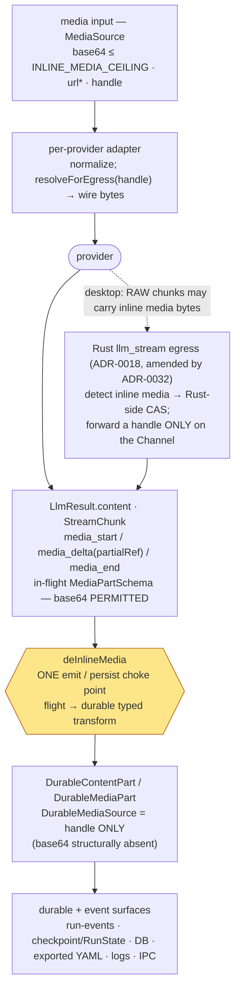

# Multimodal I/O — design analysis (first-class image / audio / video, input + output)

> Status: Reviewed and decided — finalized as [ADR-0031](../decisions/0031-llm-seam-shape-amendment-multimodal-io.md) (the seam amendment) + [ADR-0032](../decisions/0032-desktop-rust-media-de-inline-amends-0018.md) (the desktop Rust-side de-inline). This doc is the reasoning trail; the ADRs are the binding record.
>
> **Decision banner (2026-06-08).** Two independent review reports of this analysis were taken to the
> maintainer; nine decisions (A1–A9) were ruled and are now baked into ADR-0031 (see its *Maintainer
> decisions* table) and reflected inline here:
> **A1** land the **full** Phase-A shape now (not just the freeze-critical minimum — see the
> freeze-criticality note in §9); **A2** a distinct **`document`** input capability flag for PDF (§3.4);
> **A3** `partialRef` ships **reserved, host-defined** (§3.3); **A4** desktop Rust-side de-inline →
> [ADR-0032](../decisions/0032-desktop-rust-media-de-inline-amends-0018.md), must land before Phase E
> (§6.5); **A5** `generateMedia`/`pollMediaJob` ship **reserved**; the async poll/checkpoint behavior
> gets **its own ADR** at Phase D (§5.2); **A6** pre-egress **per-modality media cost estimate** added to
> the governor (§3.5/§6.7); **A7** provider-returned output URLs are fetched/re-hosted by the **engine**,
> never the adapter (§6.3/§7); **A8** `read_media` authz is a **generic scope-set** (`session` now,
> `workspace` reserved) (§6.8); **A9** exported YAML = **handle at the seam, `save_to` at the surface**
> (§6.10). The §11 open questions are updated with their resolution/defaults. The embedded ADR draft
> was finalized as the committed [ADR-0031](../decisions/0031-llm-seam-shape-amendment-multimodal-io.md) (see §12).
>
> **Y3 follow-up (2026-06-09).** A later hardening pass resolved one more seam-field question: the media
> arm's **durable** form (`DurableMediaPart`) gains an optional **`byteLength?`** + audio/video
> **`durationMs?`** (§3.2) — **no `checksum`** (the `media://sha256-<hex>` handle is the checksum),
> **`width`/`height` excluded** (render-only). Recorded as ADR-0031's dated *Amended 2026-06-09* note; must
> land in the 1.AD seam shape.

This is the definitive, revision-incorporated design for first-class multimodal I/O on the
`@relavium/llm` seam. It supersedes the earlier draft synthesis: three adversarial reviewers
(seam-fence/platform-purity, security, provider-correctness) found eight blocking design flaws,
each of which is resolved concretely below — the resolutions are summarized in §10. The base
approach is unchanged ("hybrid-capability-tiered"): media is a first-class canonical content part,
small assets may inline as base64 *in-flight*, and large assets plus **all** persistence use a
content-addressed handle into a Relavium `MediaStore` — bytes never ride run-events, logs, the DB,
IPC, or exported YAML. The change is framed as an **amendment to ADR-0011's seam shape**, exactly as
[ADR-0030](../decisions/0030-llm-seam-shape-amendment-reasoning-response-format-provider-executed.md)
amended it for reasoning. ADR-0031 (the seam amendment) and ADR-0032 are now committed; see §12.

The single most important revision the reviewers forced: **leak-freedom is NOT "by construction" on a
passive Zod refine.** It requires an *active engine-owned emit-time de-inline pass* (`deInlineMedia`)
on `LlmResult.content` and on every node output / event payload, plus a **type split** (a base64-
permitting in-flight `ContentPart` vs. a distinct handle-only durable `DurableContentPart`) so the
compiler — not a runtime hope — proves no base64 reaches a durable schema. The superRefine is a
backstop tripwire, not the primary mechanism.

---

## 1. Context & problem

### 1.1 What we are building

Relavium offers a user a choice of models behind one seam. The product promise — *"connect to any
model Relavium offers"* — must mean: **send and receive whatever that model supports.** Today the seam
is text-and-tools only. Every modality boundary is a wall:

- **Input.** `CapabilityFlags.vision` exists and is set on adapters, but there is no `ContentPart`
  arm that can carry an image, so vision is **advertised but unsendable** — and even where an adapter
  declares it, the OpenAI request path drops it on the floor (§1.4). Audio input (Gemini, gpt-4o-audio)
  and video input (Gemini native video) have no representation at all.
- **Output.** There is **no way to ask a model for a non-text artifact** and **no
  `ContentPart`/`StreamChunk` arm to carry one back.** A workflow that, by rule, must *generate an
  image, an audio file, or a video* — the explicit goal — cannot be expressed: the seam has no
  output-modality request, no media result arm, and no answer for the async long-running generators
  (Sora, Veo) whose jobs run for minutes.

This is the same maturity gap [ADR-0030](../decisions/0030-llm-seam-shape-amendment-reasoning-response-format-provider-executed.md)
closed for reasoning: a capability the product needs, with no channel to carry it, forcing a
vendor-shaped blob onto `LlmResult.raw` — the exact coupling ADR-0011 forbids.

### 1.2 Why `providerOptions`-only is insufficient

`providerOptions: Record<string, unknown>` is the seam's escape hatch and is the right home for
*single-provider quirks* (Gemini `speechConfig`/voice, `mediaResolution`, `fps`). It is the **wrong**
home for multimodal I/O, for the four reasons ADR-0030 rejected it for reasoning, plus two media-only
reasons:

1. **It is request-inbound only.** `providerOptions` rides on `LlmRequest`. There is no symmetric
   outbound channel, so a generated image/audio/video could only come back on `LlmResult.raw` /
   `StreamChunk` as a **vendor-shaped `unknown`** — re-introducing the vendor coupling ADR-0011
   exists to prevent and making the no-bytes-in-events guarantee unenforceable.
2. **Multimodal is cross-provider, not a quirk.** Image-in: Anthropic + OpenAI + Gemini. Audio-in:
   OpenAI (gpt-4o-audio) + Gemini. Video-in: Gemini. Image/audio/video-out: OpenAI + Gemini. A
   capability shared by ≥3 providers, in both directions, is a **first-class seam concern** by the
   ADR-0030 test (cross-provider → seam; single-provider → `providerOptions`).
3. **It cannot be capability-gated or fallback-routed.** `requiredCapabilities()` and the
   `FallbackChain` (1.K) narrow on `CapabilityFlags`. A media request hidden in `providerOptions` is
   invisible to them: an incapable provider is selected, the request silently fails (or flattens to
   `''` — §1.4), and fallback never triggers.
4. **Streaming has no escape hatch at all.** `StreamChunk` is a closed discriminated union with no
   `providerOptions`. A streamed generated image *cannot* be represented without a new union member —
   **breaking to add later** (every consumer's exhaustive `switch` breaks). This is exactly the
   ADR-0030 argument for landing union members before the M1 freeze.
5. **Bytes need a canonical durable form.** A media value must persist to a session, replay on re-run,
   render across CLI/desktop/VS Code, and cross the desktop IPC boundary — with the binding rule that
   **no bytes leak into events/logs/DB/exported-YAML** (security-review.md). `providerOptions: unknown`
   has no shape on which to *enforce* that.
6. **Output is a fork `providerOptions` cannot express.** Some models return media inline in the chat
   turn; others require a *separate generation endpoint* (gpt-image-1, Imagen, TTS) and some of those
   are *async long-running jobs* (Sora, Veo). The seam must model both an inline path and a job
   sub-protocol. A request-side bag of options cannot.

### 1.3 The binding Relavium invariants that constrain the design

These are hard. The design satisfies all six — but, per the security reviewer, **I3/I5 hold by an
active emit-time pass plus a type split, NOT by a passive parse-time refine** (§3.7, §6):

| #  | Invariant | Source | Consequence for media |
|----|-----------|--------|-----------------------|
| I1 | **No vendor SDK type crosses the seam.** | ADR-0011 | Media is a canonical Relavium/Zod type. A provider file id / `fileUri` / `audio.id` is **never** the canonical value — it lives only in an **ephemeral sidecar**, never on the durable part (§3.2, §6). |
| I2 | **The seam is platform-free** (`tsconfig.seam.json` `types: []`). | ADR-0011 | A media payload **cannot** be a Node `Buffer` or a browser `Blob`/`File`. It is a base64 `string`, a URL `string`, or an opaque content-addressed handle `string`. (Verified: every carrier below is a `string`.) |
| I3 | **No secrets/large bytes in run-events, logs, IPC payloads, the DB, or exported YAML.** | security-review.md; `MaskedSecret(...).strict()` | The durable / cross-boundary form is **always a handle**. Enforced by an **active `deInlineMedia` emit-time pass** (like `MaskedSecret` masking) **plus** a distinct handle-only durable type — not by a passive refine alone. |
| I4 | **The engine has zero platform imports** and runs in Node, Tauri WebView, VS Code host, Bun. | ADR-0011/0018 | The engine owns the de-inline boundary and the `MediaStore` *contract*; the *implementation* (filesystem CAS, OPFS, Rust CAS) is host-injected. |
| I5 | **Desktop egress is Rust-delegated** over a `Channel<StreamChunk>` that streams **raw provider chunks**. | ADR-0018; ipc-contract.md | Inline media bytes are inside the **raw provider response body**, so they cross IPC *before* WebView normalization. The handle-only `media_end` shape alone does **not** stop this; resolving it needs an **ADR-0018 amendment** (§6.5). |
| I6 | **Managed mode proxies egress through a gateway that is pass-through, NOT a store; counts-not-content.** | ADR-0012..0015 | Generated media materializes to the **user's local** `MediaStore`; the gateway streams provider bytes through, meters `mediaUnits` counts, stores nothing (§6.6). |

### 1.4 Two latent bugs this work must fix first

- **OpenAI vision is advertised but unsendable.** `textOf()` (openai.ts:217) flattens content to
  `content.map(p => p.type==='text' ? p.text : '').join('')`, and `toOpenAiMessages` sends
  `{ role:'user', content: textOf(...) }` (line 225). **Any non-text part is silently dropped** — a
  vision request becomes a text-only request. Phase B's first task is to *unflatten* `user` content
  to an `OpenAI.ChatCompletionContentPart[]` array.
- **The SSRF range-primitive is an unfulfilled obligation.** `assertHttpsBaseUrl` (openai.ts:~423) is
  an explicit *best-effort literal block*; its DNS-resolution and redirect re-validation are a
  documented forward obligation. security-review.md §"Network and outbound URLs (SSRF — three egress
  paths)" already mandates **one** shared range-primitive across all egress paths. A media **URL**
  carrier — input *and* provider-returned output — is a *fourth/fifth* user-or-provider-influenced
  egress surface. **Completing that shared primitive is a hard precondition of enabling the `url`
  carrier**, gated behind a feature flag that stays OFF until it lands (§6.4).

---

## 2. Provider reality table

Per provider × modality × direction: supported today, the native wire shape, and whether it rides
inline in the chat turn or needs a separate endpoint. Capability flags are data-driven from the model
catalog at runtime, so this is the *shape* reality the adapters normalize, not a frozen feature list.

### 2.1 Input (model consumes media)

| Provider | Image in | Audio in | Video in | Native input wire shape | Inline vs separate |
|----------|----------|----------|----------|-------------------------|--------------------|
| **Anthropic** | Yes | No | No (PDF/`document` only) | Content block `{ type:'image', source:{ type:'base64', media_type, data } }` **or** `{ type:'url', url }` **or** Files-API `{ type:'file', file_id }`. PDF/`application/pdf` is a first-class `document` block. | Inline (in the message) |
| **OpenAI** | Yes | Yes (gpt-4o-audio) | No | `ChatCompletionContentPart[]` — `{ type:'image_url', image_url:{ url } }` (https **or** `data:` base64 URI), `{ type:'input_audio', input_audio:{ data, format:'wav'\|'mp3' } }`, `{ type:'file', file:{ file_data\|file_id } }`. | Inline |
| **Gemini** | Yes | Yes | **Yes** | `parts[]` — `{ inlineData:{ mimeType, data(base64) } }` for small (≤~100 MB), or `{ fileData:{ mimeType, fileUri } }` from the Files API for large/video (required above the inline ceiling; `fileUri` valid ~48 h; YouTube URL allowed). | Inline (part list) |
| **DeepSeek** | No | No | No | OpenAI-compatible wire, but **no multimodal input** on current hosted chat models (v4-flash/-pro/-chat/-reasoner). All `media.*` flags `false`. | — |

### 2.2 Output (model produces media)

| Provider | Image out | Audio out | Video out | Native output mechanism | Surface |
|----------|-----------|-----------|-----------|-------------------------|---------|
| **Anthropic** | No | No | No | — (response `ContentBlock` union is text/thinking/tool only — verified in the SDK) | — |
| **OpenAI** | Yes | Yes | Yes | **(a) Inline agentic:** Responses `image_generation` **built-in tool** returns an image as a tool result *in the turn*. **(b) Inline audio:** Chat `modalities:['text','audio']` + `audio` param → `message.audio { id, data(base64), expires_at, transcript }`. **(c) Separate sync:** `gpt-image-1`/`dall-e-3` via Images; `tts-1` via Audio/Speech. **(d) Separate async:** Sora video LRO (submit → poll → fetch MP4). | `chat` (a,b) / `generative` (c,d) |
| **Gemini** | Yes | Yes | Yes | **(a) Inline:** `responseModalities:['TEXT','IMAGE']` or `['AUDIO']`(+`speechConfig`) returns media `parts` (`inlineData`) *in the chat response*. **(b) Separate sync:** Imagen `generateImages`. **(c) Separate async:** Veo `generateVideos` → LRO `operations.get` poll → fetch. | `chat` (a) / `generative` (b,c) |
| **DeepSeek** | No | No | No | — | — |

**Three structural facts drive the seam shape:**

1. **Inline vs separate-endpoint is real and per-model**, not per-provider — OpenAI and Gemini each
   have *both*. The seam needs an inline path (chat turn) **and** a separate-generation path. A
   `model_catalog.media_surface` enum (`chat` | `generative`) data-drives which one a model's output
   capability routes through, so the engine never sends an inline request to a generate-only endpoint.
2. **Inline image-out is an agentic tool result** on OpenAI (Responses `image_generation`) — which
   folds into ADR-0030's already-reserved `providerExecuted` arm. **But** `tool_result.result` is
   `z.unknown()`, so the bytes MUST be normalized by the adapter into a first-class `media` part, never
   left raw in `result` (§4.3, blocking #4).
3. **Video out is async by nature.** Sora and Veo are minute-scale LROs. An LRO **cannot be a
   synchronous `Promise<LlmResult>`** — blocking a chat call for minutes is wrong, and a streaming
   chat turn's result shape cannot hold a job lifecycle. Video-out needs a **job sub-protocol**
   (`generateMedia` → `pollMediaJob`), not the chat hot path.

---

## 3. The decided seam shape

Platform-free (string/handle only, no `Buffer`/`Blob`). The load-bearing revision is the **type
split** (blocking #1/#2): one base64-permitting *in-flight* type and one distinct handle-only
*durable* type, with `deInlineMedia` as the typed transform between them.

### 3.1 The canonical media value — `MediaSource` (three carriers, one ceiling)

```ts
// packages/shared/src/content.ts — the canonical media value. Platform-free: every carrier is a string.
export const INLINE_MEDIA_CEILING = {
  image: 256 * 1024, // 256 KB of DECODED bytes (≈ 341 KB of base64 string; the refine bounds the string)
  audio: 256 * 1024,
  video: 0,          // video is NEVER inline — always a handle (B3)
  document: 0,       // PDF is NEVER inline — large files, high leak surface; same rationale as video (A2/OQ4)
} as const;
// B3 — why video=0 even though Gemini accepts inline video ≤~100 MB (§2.1): a multi-MB base64 video on
// the IPC/event/log path is the single worst leak + amplification surface, and the inline tax (1.33×
// memory) is unjustifiable at video sizes. The safest, simplest rule is a flat "video → handle" — we
// deliberately decline Gemini's inline-video ceiling. The engine resolves a handle to fileData/inlineData
// at egress (§7) when a specific model needs inline bytes, but the SEAM/durable form is never inline video.
// document (application/pdf) is also capped at 0 — PDF files are typically large, the inline base64 value
// is low, and the leak surface is high; the same flat "always handle" rule as video applies. (A2 added the
// `document` input modality, §3.4; this ceiling entry closes the OQ4 gap, resolved 2026-06-08.)

// (1) base64 — the TINY tier, in-flight ONLY (sub-ceiling inputs / a transient adapter materialization).
//     Bounded by INLINE_MEDIA_CEILING per modality. ABSENT from the durable MediaSource union (§3.2).
const Base64SourceSchema = z.object({ kind: z.literal('base64'), data: nonEmptyString /* len refine */ });

// (2) handle — the CANONICAL DURABLE FORM. An opaque, content-addressed MediaStore ref
//     `media://sha256-<64hex>`. Self-describing, dedup-friendly, the ONLY form that may cross a
//     durable / IPC / event / DB / YAML boundary. ~70 bytes.
const HandleSourceSchema = z.object({ kind: z.literal('handle'), ref: nonEmptyString });

// (3) url — a public-HTTPS passthrough (provider-returned output URL, or a user-supplied input URL).
//     GATED behind a feature flag that stays OFF until the shared SSRF range-primitive lands (§6.4).
const UrlSourceSchema = z.object({ kind: z.literal('url'), url: nonEmptyString });

// In-flight carrier union (seam request/result content): base64 | handle | url.
export const MediaSourceSchema = z.discriminatedUnion('kind', [
  Base64SourceSchema, HandleSourceSchema, UrlSourceSchema,
]);
export type MediaSource = z.infer<typeof MediaSourceSchema>;

// Durable carrier union (persist/event/IPC/YAML content): handle ONLY. base64 is structurally absent,
// so the COMPILER proves no bytes reach a durable schema — not a runtime refine. `url` is admitted
// only once it has been re-validated/materialized (§6.4); until the SSRF primitive lands, the durable
// union is handle-only and the `url` arm is feature-flag-off everywhere.
export const DurableMediaSourceSchema = z.discriminatedUnion('kind', [HandleSourceSchema]);
export type DurableMediaSource = z.infer<typeof DurableMediaSourceSchema>;
```

**Why three carriers, not one.** Pure base64 pays a 1.33× memory/IPC tax and re-introduces a ref for
the large case anyway — kept only as the in-flight tiny tier. Pure handle forces a useless store
round-trip for a 4 KB icon — kept as the canonical durable form. URL passthrough avoids re-uploading a
provider-hosted output and lets a user pass a public image URL — kept, **gated on the SSRF primitive**.
**Binding:** base64 and url are *in-flight only*; the durable form is always a handle.

### 3.2 The media `ContentPart` arm — ONE MIME-discriminated arm, split flight vs durable

The reviewers' decisive finding: `ContentPartSchema` is the **single** type used by both the in-flight
seam path (`LlmMessage.content`, `LlmResult.content`) and the persisted path (the planned
`SessionMessage`). A refine bolted onto that dual-use base would also reject legitimate in-flight
base64. So the type **forks** — exactly as `MaskedSecret` is a *separate strict schema* substituted at
emit time, not a refine on the secret-bearing base.

```ts
// IN-FLIGHT media arm — base64 ALLOWED (sub-ceiling); used by LlmMessage / LlmResult content.
// NOTE: NO `providerRef` field here. The ephemeral provider id is an OUT-OF-BAND sidecar (below),
// never a field on the part — so it can never be persisted/replayed by accident (blocking #2).
const MediaPartSchema = z.object({
  type: z.literal('media'),
  mimeType: nonEmptyString,        // 'image/png' | 'audio/wav' | 'video/mp4' | 'application/pdf' — modality = prefix
  source: MediaSourceSchema,       // base64 | handle | url
  name: z.string().optional(),     // display/filename hint
  transcript: z.string().optional(),// e.g. OpenAI audio-out transcript (text, safe to persist)
});

// DURABLE media arm — HANDLE ONLY by construction (no base64 literal in its source union, no sidecar).
const DurableMediaPartSchema = z.object({
  type: z.literal('media'),
  mimeType: nonEmptyString,
  source: DurableMediaSourceSchema, // handle only
  name: z.string().optional(),
  transcript: z.string().optional(),
  // Y3 (resolved 2026-06-09, ADR-0031 amended) — integrity/size/duration metadata lives on the DURABLE
  // form ONLY; the host populates it at the deInlineMedia boundary (the MediaStore knows the byte count;
  // the host probes duration). Bind it to the handle-keyed durable type the MediaStore/GC already key on.
  byteLength: nonNegativeInt.optional(),  // bounds a Range/delivery request without trusting a raw file size
  durationMs: positiveInt.optional(),     // audio/video only — render/desync metadata
  // NO `checksum` field: the content-addressed `media://sha256-<hex>` handle already IS the sha256.
  // `width`/`height` EXCLUDED from Phase A: pure render concern, no failover/gating consumer.
});

// ContentPart forks: the seam re-exports the in-flight variant; persist/event/IPC schemas reference
// the durable variant. `deInlineMedia` (§3.7) is the typed transform ContentPart → DurableContentPart.
export const ContentPartSchema = z.discriminatedUnion('type', [/* text, tool_call, tool_result*, reasoning */, MediaPartSchema]);
export const DurableContentPartSchema = z.discriminatedUnion('type', [/* …durable arms… */, DurableMediaPartSchema]);
```

**The ephemeral `providerRef` sidecar (blocking #2).** A provider-hosted id/uri (Gemini `fileUri`,
OpenAI `file_id`, `message.audio.id`) is **modelled like the ADR-0030 reasoning `signature`**: it is
**structurally absent from the persisted type** and lives only in a **process-scoped, in-memory
adapter cache** keyed by `(provider, sha256)`:

```ts
// Adapter-internal, process-scoped, NEVER part of a ContentPart, NEVER checkpointed/persisted/logged.
// Reconstructed-from-the-canonical-handle on resume / FallbackChain failover: a cache miss re-uploads
// from the MediaStore bytes. Keyed by content hash so a re-sent asset reuses the prior fileUri within
// its TTL. Cleared on engine restart; the checkpoint/RunState snapshot CANNOT carry it (§6).
// TIMING (B5): on a Provider A → B failover the re-upload is AWAITED — the re-materialized ref must be
// ready BEFORE the retried request is sent. The 1.K FallbackChain waits on re-materialization rather
// than racing a half-uploaded ref; this is part of the strip-and-re-materialize-on-failover obligation.
type ProviderMediaRef = { provider: LlmProviderId; id: string; expiresAt?: number };
type ProviderRefCache = Map</* `${provider}:${sha256}` */ string, ProviderMediaRef>;
```

**Why one MIME-discriminated arm, not four.** Modality routing (which adapter wire shape, which
ceiling) is a pure function of the MIME prefix, so adding `audio/opus`, `application/pdf`, or a future
modality changes **zero** seam schema — exactly one new union member for every consumer's exhaustive
`switch` to learn, now, before the freeze. (`document`/PDF input is therefore just an `application/pdf`
MIME the same arm carries — Anthropic's PDF input needs no new arm.) Use the already-shared
`LLM_PROVIDERS` enum from `packages/shared/src/constants.ts` for `provider` to avoid implying a
`shared → llm` dependency inversion.

### 3.3 The `StreamChunk` media arms — `media_start` / `media_delta` / `media_end` (NO base64 on the normalized stream)

```ts
// Mirrors the tool_call_* / reasoning_* triads. `id` correlates deltas to the terminating media_end.
z.object({ type: z.literal('media_start'), id: nonEmptyString, mimeType: nonEmptyString }),

// PROGRESS ONLY — carries NO base64. Optional `partialRef` is a handle to a partial-write in the store
// (e.g. a progressive image preview). Keeps bytes OFF the NORMALIZED Channel<StreamChunk> and the
// run-event/SSE bus by construction.
// A3 (DECIDED): `partialRef` ships in the FROZEN triad now (so a later add is non-breaking) but is
// RESERVED — host-implementation-defined. The MediaStore contract (§4.1) defines only
// `put(completeBytes) → handle`; partial-write semantics (append vs per-delta put) are NOT specified
// here and are owned by the surface that first renders progressive previews (Phase E / 1.AH). Until
// then `partialRef` is shape-only and unset by every adapter. Tracked in deferred-tasks.md.
z.object({
  type: z.literal('media_delta'),
  id: nonEmptyString,
  progress: z.number().min(0).max(1).optional(),
  partialRef: nonEmptyString.optional(), // a handle, NEVER base64 — RESERVED shape (A3), behavior in Phase E
}),

// TERMINAL — carries the finished media as a DURABLE (handle-only) media part. The engine's de-inline
// boundary writes bytes to the store and emits the handle; the chunk never carries bytes.
z.object({ type: z.literal('media_end'), id: nonEmptyString, media: DurableMediaPartSchema /* handle-only */ }),
```

**Scope correction (blocking, security #1).** This handle-only rule governs the **normalized**
`StreamChunk`. On desktop, ADR-0018/ipc-contract route the provider's **raw** response chunks over the
Channel and normalize **WebView-side** — so an inline image-out's base64 is inside the *raw* body and
crosses IPC *before* this normalized shape exists. The handle-only `media_end` protects a boundary the
raw bytes never hit. **Do not claim "bytes never ride the Channel."** Resolve it explicitly with an
ADR-0018 amendment (§6.5).

### 3.4 The redesigned `CapabilityFlags` — per-modality input + a closed `outputCombinations` set

This is blocking #3: output capability is a per-model **combination** constraint, not a product of
independent booleans. Gemini `responseModalities` is a *closed set per model* (image-gen accepts
`['TEXT','IMAGE']` and rejects AUDIO; native-audio TTS accepts `['AUDIO']` and cannot combine it with
IMAGE). Two independent booleans (`image.output:true`, `audio.output:true`) would advertise
`['image','audio']` as composable when the wire rejects it.

```ts
// Input stays a simple per-modality boolean (composability is unconstrained on input — a turn may
// carry image + audio + text together). `document` (A2) gates application/pdf DISTINCTLY from image:
// a PDF is a separate modality with its own token/cost profile (Anthropic `document` block, OpenAI/
// Gemini file input), so folding it into `image` would mis-advertise capability. requiredCapabilities()
// requires media.input.document for any application/pdf part — the one MIME-discriminated arm still
// carries it (§3.2), the flag only advertises/gates it.
const InputModalitiesSchema = z.object({
  image: z.boolean(),
  audio: z.boolean(),
  video: z.boolean(),
  document: z.boolean(), // application/pdf (A2) — distinct from image
});

// Output is the CLOSED SET of modality-sets a model can emit in ONE turn. requiredCapabilities()
// validates the request's outputModalities is a MEMBER of this set — not that each modality is
// independently allowed. This is what drives Gemini responseModalities correctly.
const ModalitySetSchema = z.array(z.enum(['text', 'image', 'audio', 'video'])); // a single emittable set

export const CapabilityFlagsSchema = z
  .object({
    tools: z.boolean(),
    streaming: z.boolean(),
    parallelToolCalls: z.boolean(),
    promptCache: z.boolean(),
    reasoning: z.boolean(),
    media: z.object({
      input: InputModalitiesSchema,
      outputCombinations: z.array(ModalitySetSchema), // [] = no media output (Anthropic, DeepSeek)
    }),
    // TEMPORARY derived alias of media.input.image. NOT deleted (live consumers: db.supports_vision,
    // adapter supports.vision). A post-parse transform sets it; a refine asserts vision === input.image
    // so the two cannot drift. Removed in a later cleanup.
    vision: z.boolean(),
  });
```

**`outputCombinations` values per provider** (the closed set a model may emit in one turn):

| Provider / model class | `media.input` | `media.outputCombinations` |
|------------------------|---------------|----------------------------|
| **Anthropic** (all)    | `{ image:true, audio:false, video:false, document:true }` | `[]` — no media output |
| **OpenAI** gpt-4o-audio | `{ image:true, audio:true, video:false, document:true }` | `[['text'], ['text','audio']]` — inline audio via `modalities` |
| **OpenAI** image-gen (Responses tool) | `{ image:true, audio:false, video:false, document:true }` | `[['text']]` — **image-out is a built-in TOOL, not an outputModality** (§3.6) |
| **OpenAI** generative (gpt-image-1, tts, sora) | per-model input | `[['image']]` / `[['audio']]` / `[['video']]` via `generateMedia` (media_surface `generative`) |
| **Gemini** 2.x image | `{ image:true, audio:true, video:true, document:true }` | `[['text'], ['text','image']]` — rejects AUDIO in the same call |
| **Gemini** native-audio TTS | `{ image:true, audio:true, video:true, document:true }` | `[['audio']]` — cannot combine with TEXT/IMAGE |
| **Gemini** generative (Imagen, Veo) | per-model input | `[['image']]` / `[['video']]` via `generateMedia` |
| **DeepSeek** (all)     | `{ image:false, audio:false, video:false, document:false }` | `[]` |

`requiredCapabilities(req)` derives the input `(modality)` set from the request's media parts and the
requested `outputModalities`, then asserts: every input modality is `true` in `media.input`, **and**
the requested `outputModalities` tuple is a member of `media.outputCombinations` (or empty). A request
the matrix rejects **fails fast** with `unsupported_capability` and the `FallbackChain` skips that
provider — closing the silent-flatten bug (§1.4) the design indicts `providerOptions` for.

### 3.5 The `Usage` media-cost fields — a disjoint observability axis

```ts
// Media cost is NOT tokens (per-image / per-second), so it is a SEPARATE disjoint axis — mirroring the
// reasoningTokens-is-observability discipline, but WITHOUT a refine tying it to token counts (it is a
// distinct billing class). The pricing table gains per-unit media rates keyed on canonical model id.
mediaUnits: z
  .array(z.object({
    modality: z.enum(['image', 'audio', 'video']), // DELIBERATE closed media-billed set: document(PDF)/text
                                                    // bill as TOKENS, not media units, so they are not here.
                                                    // This inner enum is itself breaking-to-extend → complete now (F1).
    direction: z.enum(['input', 'output']),
    units: nonNegativeInt,          // images, audio-seconds, video-seconds — the provider's billed unit
    unit: z.enum(['count', 'second']),
  }))
  .optional(),
```

The conformance suite must assert each adapter's `mediaUnits` mapping against recorded fixtures
(mirroring the `reasoningTokens <= outputTokens` conformance), because providers bill heterogeneously
(audio per-second vs per-1k-characters; video per-second vs per-generation) and a mis-mapped unit is a
silent cost bug. `mediaUnits` doubles as the managed-mode metering record (counts-not-content, §6.6).

**A6 — the PRE-egress estimate (a distinct gap from the post-hoc `mediaUnits`).** `mediaUnits` is
measured *after* a call returns. The ADR-0028 pre-egress governor caps cost *before* each call using
`worstCaseNextEstimate(maxTokens)` — which is **token-based and cannot estimate a media-generation
call** (a Veo/Sora/gpt-image job's cost is per-image / per-second, not derivable from `maxTokens`).
Without a media estimator, the pre-egress cap silently does not cover `generateMedia` or media-output
turns. **Decided (A6 = a + b):** add a **per-modality flat media cost estimate** the governor uses
pre-egress — sourced from **(a)** a config default (`[defaults].media_cost_estimate`, a `count`/`second`
estimate per modality, the media analogue of `max_tokens_estimate`) **and (b)** a per-model rate already
in the pricing table / `model_catalog`. The governor estimates `units × rate` for a requested media
output (e.g. 1 image, or N seconds of video at the model's per-second rate) and blocks/pauses
pre-egress just as it does for tokens. This extends ADR-0028's pre-egress check to the media axis; it is
wired with the governor fold (1.AC → the media plumbing in 1.AF/1.AG).

### 3.6 The `LlmRequest` addition — `outputModalities` (and the OpenAI image-out exception)

```ts
// Request the model emit non-text output on the INLINE path (chat-surface models). For the
// SEPARATE-ENDPOINT path the engine calls generateMedia() instead (§5), routed by media_surface.
outputModalities: z.array(z.enum(['text', 'image', 'audio', 'video'])).optional(), // default ['text']
```

The symmetric mechanism to ADR-0030's `responseFormat` (`responseFormat` shapes *text* output;
`outputModalities` requests *media* output). Each adapter lowers it to the native mechanism — **but the
lowering is not uniform**, which is why the capability must be the closed-set matrix (§3.4):

- **Gemini:** `outputModalities` → `responseModalities` (validated against `outputCombinations`).
- **OpenAI audio:** `outputModalities:['text','audio']` → Chat `modalities:['text','audio']` + `audio`
  param.
- **OpenAI image-out: NOT an `outputModalities` entry.** It is the Responses `image_generation`
  **built-in tool** (an entry in the `tools` array) and returns via the `providerExecuted` `tool_result`
  arm. The engine routes "this node should produce an image with OpenAI" by adding the built-in tool,
  *not* by setting `outputModalities:['image']`. This prevents one field silently meaning three
  different wire mutations.

### 3.7 The serialization guard — active emit-time `deInlineMedia` pass + a backstop superRefine

This is the single most important security correction (blocking, security #2). The earlier draft
oversold a passive Zod refine as "by construction." The real enforcement is **active**, in two layers:



> *The flight→durable media boundary. `url` ships **feature-flag-OFF** until the shared SSRF
> range-primitive lands (§6.4); on desktop the [ADR-0018](../decisions/0018-desktop-execution-and-rust-egress.md)
> egress is amended by [ADR-0032](../decisions/0032-desktop-rust-media-de-inline-amends-0018.md) so media
> bytes never cross the WebView↔Rust channel — only a handle does (§6.5).*

**Layer 1 — the active `deInlineMedia` emit-time pass (the real mechanism).** The engine owns ONE
choke point that runs **before any serialize / event-emit / IPC / log / DB write**, on:

- `LlmResult.content` immediately at the seam return (the non-streaming inline image-out path — the
  more common of the two), and the terminal of every stream;
- **every node output and every event payload** (`node:completed.output`, `run:completed.outputs`,
  `run:failed.partialOutputs`, `run:started.inputs`, the checkpoint/`RunState` snapshot, and the
  `agent:tool_result.outputSummary` descriptor);
- **the `FallbackChain` cross-provider context transfer** — the agent state (prior turns, tool results)
  carried to the next provider on failover can itself contain in-flight media parts, so the failover
  hand-off is a de-inline target too.

**B1 — this is ONE structural boundary, not a 6-call-site discipline.** The guarantee must not rest on
"every emitter remembers to call `deInlineMedia`." Every event/output/persist/transfer leaves the engine
through **a single `emitRunEvent` / persistence wrapper**, and `deInlineMedia` runs *inside* that one
wrapper — exactly as `MaskedSecret` masking is applied at the one emit boundary. A future event type or
emit path is covered automatically because it must go through the wrapper; the bullet list above
enumerates the surfaces that flow through it today, it is not a checklist a new emitter could skip. The
backstop `superRefine` (Layer 2) is the tripwire that fires in tests if a value ever bypasses the
wrapper.

```ts
// Engine-owned. The TYPED transform from flight → durable. Walks any value, replaces every base64
// (or unresolved url) media part with a handle by writing bytes to the MediaStore. Returns the durable
// type, so the COMPILER proves the emitted value is handle-only. This is exactly how MaskedSecret is
// APPLIED at emit time (an active transform), not a passive parse-time hope.
function deInlineMedia(value: unknown, store: MediaStore): DurablySafe; // strips/rehosts in-flight bytes
```

**Why the active pass is mandatory and the refine alone is insufficient.** The leak-bearing event
fields are `z.unknown()` (`node:completed.output` run-event.ts:194, `run:completed.outputs` :236,
`run:failed.partialOutputs` :246, `run:started.inputs` :126). A Zod refine only fires on the schema
position it is attached to; it does **not** recurse into a sibling `z.unknown()` field. A media part
(or a base64 part nested in a node output) placed into a `z.unknown()` field is validated as `unknown`
and the refine **never runs**. Leak-freedom on those fields therefore requires the active emit-time
de-inline pass — it is **NOT "by construction"** on the schema.

**Layer 2 — the backstop `persistableMediaRefine` (a test-time tripwire, demoted from "the most
important deliverable").** Applied to the **typed** durable positions (the `DurableMediaPart` arm,
`media_end.media`, and any `tool_result.media` field, §4.3), it asserts the type split held:

```ts
// A BACKSTOP on TYPED media positions only — not the primary guarantee. The durable type already makes
// base64 structurally impossible; this catches a programming error that bypassed deInlineMedia.
export const persistableMediaRefine = (p: { source: { kind: string } }, ctx: z.RefinementCtx): void => {
  if (p.source.kind === 'base64') {
    ctx.addIssue({ code: 'custom', message: 'media bytes (base64) may not cross a durable/event/IPC boundary; deInlineMedia must run first' });
  }
};
```

Adapters stay **pure resolved-strings-to-strings**: the engine resolves a handle to base64/url/
provider-file *before* egress and de-inlines *after*; no adapter holds a `MediaStore` dependency on the
hot path.

---

## 4. MediaStore & media representation

### 4.1 The canonical value and where bytes physically live

- **Canonical durable form: a content-addressed handle** `media://sha256-<64hex>`. Bytes live in a
  **`MediaStore`** — a host-injected blob store the engine references only by the handle string (I4):
  - **CLI / VS Code host:** a filesystem-backed CAS under the run/session dir.
  - **Desktop:** a **Rust-side CAS**; the WebView holds only the handle. The `MediaStore` *write* is a
    Rust command, so generated bytes never transit the WebView↔Rust JSON channel as part of a chunk
    (§6.5). A bounded, **session-scoped** `read_media(ref)` Tauri command serves display, off the hot
    `Channel<StreamChunk>` (§6.8).
  - **Managed mode (Phase 2):** the gateway streams provider bytes through to the local engine, which
    materializes into the user's store form; the gateway stores nothing (§6.6).
- **`MediaStore` is a contract, not an import** (I4): `put(bytes, mime) → handle`, `get(handle) →
  bytes`, `resolveForEgress(handle, provider) → MediaSource`, `refcount`/`last_referenced_at`. The
  engine names it by the handle string at the seam; the implementation is injected per host, exactly as
  ADR-0018 injects the HTTP transport.

### 4.2 The inline↔handle boundary (the tier policy)

`INLINE_MEDIA_CEILING` (§3.1) is the **deterministic rule** selecting the base64-vs-handle tier:

- **Below ceiling (image/audio ≤ 256 KB decoded):** base64 is allowed *in-flight* (request building,
  an adapter normalizing a tiny input) — skips the store round-trip for a 4 KB icon.
- **At/above ceiling, all video, anything durable:** a handle. Video is **never** inline.
- The ceiling is a single shared constant. **The bound is on the DECODED byte count** (the schema's
  base64 length refine accounts for the 1.33× expansion: a 256 KB decoded ceiling is ~341 KB of base64
  string). Worst-case in-flight base64 string ≈ ceiling × 1.33.
- **Per-message aggregate caps land in Phase A, not Phase C** (security non-blocking, promoted): a
  per-message **count cap** and a **per-message aggregate-bytes cap** ship with the ceiling, so a
  workflow attaching hundreds of sub-ceiling 256 KB parts (each individually legal, tens of MB total)
  is rejected — the per-part ceiling alone does not catch amplification.
- **B4 — close the cap-enforcement window with a CI guard.** The cap *shape* lands in Phase A (1.AD) but
  capability-gated *enforcement* is wired in Phase C (1.AF). To prevent a cap-less intermediate state
  between Phase B (input adapters wired, 1.AE) and Phase C, a **landing-gate CI test asserts the
  aggregate-bytes + count caps are actually enforced** (a request exceeding either is rejected) — the
  caps are not "declared but un-checked" while media input is live. This mirrors the `url`-carrier
  feature-flag CI gate (§6.4).

### 4.3 `tool_result` media normalization — FORBID raw bytes in `result` (blocking #4)

`tool_result.result` is `z.unknown()`. Routing inline image-gen through it as "zero new shape" would
smuggle multi-MB base64 through an untyped field the de-inline pass and the refine cannot reach. So:

- **A provider-executed image-gen result MUST be normalized by the adapter into a first-class `media`
  `ContentPart`** (handle source) — never raw bytes in `result`. Either as a sibling `media` part in
  the same turn referenced by the tool-call id, **or** via an explicit optional typed field on the
  arm: `tool_result.media: DurableMediaPart[]`.
- `result` retains only a **descriptor** (mime + handle + name), never the payload. The
  `agent:tool_result.outputSummary` (a plain string) is likewise a descriptor, never a stringified
  payload — a concrete emit-site `deInlineMedia` must cover.
- A test asserts a base64 blob placed in `tool_result.result` is **rejected**, so the "reuse the
  unknown arm" shortcut cannot silently reintroduce the leak.

### 4.4 Content-addressing pays for itself

`sha256` content-addressing gives **free dedup** (same image referenced twice = one blob) and a stable
provider-Files-API upload cache key keyed on `(provider, sha256)` — so re-sending the same large input
to Gemini reuses the prior `fileUri` (held in the ephemeral sidecar, never durable). **Refcount is
per-distinct-reference, not per-run** (security non-blocking, promoted): GC of one run's media must not
delete another run's identical bytes.

### 4.5 Cross-surface resolution

The handle is identical across surfaces; only the `MediaStore` impl differs. A workflow authored on the
CLI, re-run on desktop, renders identically: the engine resolves the handle through whatever store the
host injected. This is the ADR-0018 "one engine, injected transport" pattern extended to bytes.

---

## 5. Output generation — inline AND separate-endpoint

Both paths live on the existing `LlmProvider` — no separate sibling `GenerativeMediaProvider` seam
(rejected: it would duplicate the id/key/capability/error/`FallbackChain` registry).

### 5.1 Inline-returning models

Gemini `responseModalities` and OpenAI agentic image-gen / inline audio return media **in the chat
turn**. The engine sets `outputModalities` (or adds the OpenAI built-in image tool, §3.6); the adapter
lowers it; the returned media arrives, **after the engine's `deInlineMedia` pass**, as:

- **Non-streaming:** a `media` `ContentPart` (handle source) in `LlmResult.content`, or — for the
  agentic image-gen tool — a `tool_result` with `providerExecuted:true` carrying a normalized `media`
  part (§4.3). De-inlined on the **same boundary** as the stream's `media_end`.
- **Streaming:** the `media_start`/`media_delta`/`media_end` triad (§3.3).

### 5.2 Separate-endpoint generators — `generateMedia` / `pollMediaJob`, OPTIONAL on `LlmProvider`

```ts
export interface LlmProvider {
  readonly id: ProviderId;
  generate(req: LlmRequest, key: string): Promise<LlmResult>;
  stream(req: LlmRequest, key: string): AsyncIterable<StreamChunk>;
  readonly supports: CapabilityFlags;

  // Separate-endpoint generation (media_surface: 'generative'). OPTIONAL — reserved at M1, wired in
  // Phase D. A sync generator (gpt-image-1, Imagen, TTS) resolves immediately; an async one (Sora, Veo)
  // resolves a Relavium-OPAQUE jobId the engine polls. No vendor job id / operation-name crosses the
  // seam verbatim (I1) — the adapter mints an opaque id, never echoing the provider's operation name.
  generateMedia?(req: MediaGenRequest, key: string): Promise<MediaGenResult>; // { media?, jobId? }
  pollMediaJob?(jobId: string, key: string): Promise<MediaJobStatus>;          // pending | done(media) | failed(LlmError)
}
```

- **Sync generator:** `generateMedia` resolves `{ media }` (handle source). One round-trip.
- **Async generator (video):** `generateMedia` resolves `{ jobId }`; **the engine owns the poll loop**
  (cancellation, checkpoint, resume — a minute-scale job survives an engine restart).
- **A5 (DECIDED) — reserved shape now, behavior + its own ADR at Phase D.** `generateMedia?`/
  `pollMediaJob?` land now as **reserved optional methods** (so a later add is non-breaking, the
  ADR-0030 `providerExecuted` precedent). The async **poll / checkpoint / resume / cancel loop** is the
  single highest-behavioral-complexity piece in this whole design — a minute-scale external job that
  must survive an engine restart, sit in the run loop (1.N) and checkpointer (1.R) without a new node
  type, and reuse the `LlmError` retryable classification. It is **NOT** freeze-gated (optional method),
  so it is deferred to **Phase D (1.AG)** and gets **its own ADR** there, written when it is wired —
  this doc/ADR-0031 only reserves the seam shape. Tracked in deferred-tasks.md so it is not lost.
- **Failure classification (blocking, correctness #4 — StopReason):** `MediaJobStatus.failed` maps onto
  the existing `LlmError` discriminant — a Veo/Sora content-policy rejection → `content_filter`, a
  timeout → the retryable `timeout` kind — so the job path reuses the existing retryable classification
  rather than inventing a second failure vocabulary.
- **Routing:** the `model_catalog.media_surface` enum (`chat` | `generative`) data-drives whether a
  model's media output means inline `generate()` or `generateMedia()`, resilient to provider lifecycle
  churn (Sora/Veo/gpt-image renames — the seam hardcodes no model id or endpoint).

### 5.3 StopReason — decision (blocking, correctness #4)

`STOP_REASONS` is the closed enum `['stop','length','tool_use','content_filter','error']` (verified
constants.ts:88). **Decision: a media-only inline turn reports `'stop'`; the signal that the turn
produced media is the presence of a `media` part in `content`. Do NOT add a new StopReason.**

Justification: a media-only turn is a *normal completion* that happens to carry a non-text part — the
same way a text turn carries a `text` part. Adding a `media` StopReason would (a) enlarge a closed enum
(breaking to extend later, like a union member), (b) not actually help consumers, who must inspect
`content` for the part regardless, and (c) leave the multi-part case (text + image) ambiguous. The
binding requirements that make `'stop'` safe: the session/FallbackChain consumers **must** treat
`content` as the source of truth, not `stopReason`, and a turn that was *requested* to emit media but
returned only text is still `'stop'` — the engine detects the missing modality by inspecting `content`
against the request's `outputModalities` and may route/retry, rather than relying on a stop reason. The
async job path does not use StopReason at all (`MediaJobStatus`, §5.2). **This is tested:** a
media-only `'stop'` turn is asserted distinguishable from an empty text turn by `content` inspection.

---

## 6. Security & persistence guardrails (binding)

These are non-negotiable. The honest framing the reviewers forced: most hold by an **active emit-time
pass plus a type split**, not by a passive refine.

1. **No media bytes in run-events, logs, DB, exported YAML — by the ACTIVE de-inline pass + the type
   split (I3).** The durable form is always a handle (the `DurableMediaPart` makes base64 structurally
   impossible — the compiler proves it). The engine-owned `deInlineMedia` choke point runs on
   `LlmResult.content`, every node output, every event payload, the checkpoint/`RunState` snapshot, and
   the `tool_result` descriptor **before any serialize/emit/IPC/log** — exactly as `MaskedSecret` is
   applied at emit time. The `persistableMediaRefine` is a **backstop tripwire** on typed positions,
   not the primary guarantee, because the leak-bearing event fields are `z.unknown()` a refine cannot
   reach.

2. **Ephemeral provider refs (I1) — structurally absent from the persisted type.** A provider-hosted
   `fileUri`/`file_id`/`audio.id` lives **only** in the process-scoped adapter sidecar cache keyed by
   `(provider, sha256)` (§3.2). It is **never** a field on a `ContentPart`, **never**
   persisted/logged/checkpointed/replayed across a provider boundary. The cache is **in-memory,
   process-scoped, NEVER checkpointed**, and **reconstructed-from-the-canonical-handle on resume /
   FallbackChain failover** (a cache miss re-uploads from MediaStore bytes) — so a resumed run never
   replays a stale (Gemini `fileUri` ~48 h) or foreign ref. **The checkpoint/`RunState` snapshot schema
   is an explicit de-inline + backstop target** (the earlier draft omitted it).

3. **SSRF on input AND output URLs — the SAME shared range-primitive (blocking, security #3).** A media
   `url` is a user-supplied egress surface on **input** *and* a provider-influenced egress surface on
   **output** (a DALL·E/CDN link, or a malicious response from a compromised OpenAI-compatible base URL
   pointing at `169.254.169.254`/loopback). **Both** the input `url` carrier and the output-URL
   materialization fetch are bound to the **one shared, completed** SSRF range-primitive: HTTPS-only, no
   creds-in-URL, block private/loopback/link-local + `169.254.169.254` + CGNAT, with DNS-resolution,
   IPv4-mapped-IPv6 decode, and **per-hop redirect re-validation**. The **host/engine** fetches, never
   the seam.
   **A7 (DECIDED) — the ENGINE fetches output URLs, never the adapter.** When a provider returns a media
   output as a CDN/file URL (e.g. a DALL·E result), the adapter returns it verbatim as a canonical `url`
   source on the `media` part and does **nothing else**; the **engine** fetches and re-hosts it to a
   handle **inside the `deInlineMedia` pass**, through the one shared SSRF primitive. Rationale: this
   keeps SSRF enforcement in exactly one place (the engine choke point), keeps adapters pure
   string→string with no `MediaStore`/network dependency (I4), and means input and output URLs share the
   identical guarded fetch. An adapter MUST NOT fetch a provider URL itself.

4. **Gate the `url` carrier behind a feature flag until the primitive lands (blocking, seam-fence #3).**
   The `url` arm may exist in the frozen Phase-A *shape*, but no adapter/engine path accepts a `url`
   source until the shared SSRF primitive is complete. The feature flag is a **hard CI/landing gate**,
   not prose: a test asserts the `url` carrier is rejected while the flag is off. **Input URLs are
   re-hosted into the store at ingest** (→ handle) so a re-run does not depend on a remote URL still
   resolving and the SSRF window collapses from "every re-run" to "one guarded fetch."

5. **Desktop Rust-IPC — resolve the contradiction, do NOT claim "by construction" (blocking, security
   #1).** ADR-0018/ipc-contract fix the desktop wiring as: Rust does ONE raw HTTPS request and streams
   the provider's **raw** chunks; the WebView adapter normalizes. An inline image-out's base64 is inside
   that raw body, so it crosses IPC *before* the handle-only `media_end` exists. **DECIDED (A4) —
   option a, now recorded as its own amendment [ADR-0032](../decisions/0032-desktop-rust-media-de-inline-amends-0018.md):
   relocate inline-media de-inlining into the privileged Rust egress command for media-output turns:**
   Rust writes inline media bytes to the Rust-side CAS and
   forwards only a **handle** on the Channel, so multi-MB base64 never transits the WebView↔Rust JSON
   channel. This **reverses** §6.2's earlier "Rust never parses/rewrites media arms" stance for the
   narrow media-output case — state that plainly: Rust gains a *bounded, audited* media-detect-and-store
   step on the egress path (it already parses the stream to frame chunks). The alternative (option b —
   accept that raw provider bytes transit the trusted Channel once, since they are a provider response
   like raw chat text, and scope the no-base64 rule to the *normalized* StreamChunk / run-event /
   persisted layers only) is weaker for large media and is **not** recommended. **The ADR-0018 amendment
   ([ADR-0032](../decisions/0032-desktop-rust-media-de-inline-amends-0018.md)) is written now and MUST
   land before any desktop media-output behavior (Phase E / 1.AH)** — not deferred to Phase E, not
   papered over at the normalized layer.

6. **Managed-mode media egress — reconciled with ADR-0015 (blocking, security #4).** ADR-0015 is
   binding: the gateway is **pass-through, NOT a store**; it meters **counts, not content**. The earlier
   draft's "the gateway persists the generated artifact" contradicts that. Corrected:
   - **(1) Generated media bytes materialize to the USER's local `MediaStore`, never the gateway.** In
     managed mode the engine runs locally (only egress is proxied) — the gateway streams provider bytes
     through to the local engine, which writes them to the user's store, exactly as it streams text
     completions through without writing them.
   - **(2) For async LRO jobs (Veo/Sora), the gateway-with-key fetches the provider poll URL / job
     handle on each poll and streams the artifact through in flight — buffering nothing at rest** beyond
     the in-flight body. No artifact is stored gateway-side across the multi-minute window.
   - **(3) Metering records `mediaUnits` COUNTS only** (image count, audio/video seconds) — never the
     artifact body — consistent with counts-not-content (ADR-0014/0015). No provider key crosses the
     seam (attached only inside the gateway on the outbound request, ADR-0013).

7. **Size/abuse caps & resource governance.** `INLINE_MEDIA_CEILING` bounds per-part in-flight base64;
   the per-message count + aggregate-bytes caps (§4.2) land in Phase A. A **per-run and per-session
   media size+count budget** feeds the existing budget-warning / budget-paused run events (ADR-0028), so
   media egress volume participates in resource governance.

8. **`read_media(ref)` authz — a generic scope-set, NOT owner-equality (A8, DECIDED).** The new bounded
   Tauri `read_media` command returns bytes to the untrusted WebView for display, so it is a new IPC
   surface: it **must validate the requesting session is in the handle's allowed-scope set** (no
   arbitrary CAS read by handle from the WebView) and bound the returned size — otherwise it is a local
   file-read primitive scoped only by "know a sha256."
   **The model is a generic `handle → allowedScopes: Set<Scope>`**, where today `Scope = { kind:
   'session', id }`. A session may read a handle **it produced OR explicitly received as input** (the
   input-transfer path — e.g. session-export-to-workflow, ADR-0026, or a sub-run — adds the receiver's
   session scope). **Owner-id equality is explicitly rejected**: it cannot even express "received as
   input," which option (a) requires. **Why a scope-set and not the simpler check:** modelling authz as
   a scope-set today makes a later widening to shared/workspace assets a **purely additive scope kind** —
   a `{ kind: 'workspace', id }` value, **reserved (documented, not implemented) now** — with **no
   handle-model migration and no re-issuance**. Doing cross-session/workspace sharing *now* was rejected
   as premature (it opens workspace-granularity, default-share, shared-asset GC-lifetime, and
   share-authoring questions with no Phase-1 consumer); content-addressing (CAS) already makes any future
   shared asset tamper-evident. So: the cheap correct model now, the door additively open. Tracked in
   deferred-tasks.md.

9. **MediaStore retention & GC.** Generated media is the **deliverable**, not a transcript — it must not
   follow the 90-day `run_events` prune. A `media_objects` table with per-distinct-reference `refcount` +
   `last_referenced_at`, GC on zero refs after a grace window. (Open question §11.)

10. **Exported YAML carries the handle or a relative `save_to` path, NEVER bytes (security non-blocking,
    promoted to a stated guardrail).** Directly implied by I3 + ADR-0009 git-native portability; the
    only open part is handle-vs-relative-path (§11), not whether bytes may inline.

---

## 7. Per-adapter normalization plan

| Provider | Input normalization | Output normalization |
|----------|---------------------|----------------------|
| **Anthropic** | `media` (image / `application/pdf`) → `{ type:'image'\|'document', source: base64\|url\|file_id }` inline block — one MIME-discriminated arm covers both. `media.input.{image,document}:true`; `outputCombinations:[]`. | None — no media out. |
| **OpenAI** | **Fix the §1.4 bug FIRST:** unflatten `user` content from `textOf()` to `ChatCompletionContentPart[]` — `{ type:'image_url' }` (handle → `data:` URI under ceiling, or re-hosted URL), `{ type:'input_audio', format:'wav'\|'mp3' }`, `{ type:'file' }`. `media.input.{image,audio,document}:true`. | Inline agentic image via Responses `image_generation` **tool** → normalized `media` `tool_result` (handle, §4.3). Inline audio via `modalities` → `media` part (+`transcript`). Separate: `generateMedia` → Images (gpt-image-1), Audio/Speech (TTS); async → Sora job. `outputCombinations` per §3.4. `audio.id`/`expires_at` → ephemeral sidecar. |
| **Gemini** | `media` → `parts[]` `inlineData` (base64, under ceiling) or `fileData{ fileUri }` (Files API, required above the inline ceiling / for video). `fileUri` cached in the `(gemini, sha256)` sidecar. `media.input.{image,audio,video,document}:true`. `speechConfig`/voice/`mediaResolution`/`fps` ride `providerOptions`. | Inline: `responseModalities` → media `parts` → `media` part / `media_*` triad. Separate: `generateMedia` → Imagen (`generateImages`); async → Veo LRO (`operations.get` poll). `outputCombinations:[['text'],['text','image']]` (image model) or `[['audio']]` (TTS model). |
| **DeepSeek** | None — `media.input.*` all `false` (no multimodal on current hosted chat models). A media request fails fast / the chain skips it. | None — `outputCombinations:[]`. |

**Shared adapter rule (preserves I4):** adapters receive **resolved strings** — the engine resolves a
handle to base64/url/provider-file *before egress* and de-inlines media in the response *after*. No
adapter imports `MediaStore`. The base64↔Buffer/Blob conversion is adapter-local (adapters legitimately
import `@types/node`, outside the seam's `types:[]` guard).

---

## 8. Workflow authoring — generate-media-by-rule

The explicit goal — *"a workflow that, by rule, generates an image/video/audio file"* — maps to two
node-level additions, no new node type:

- **On the agent node:** `output_modalities: [image]` (or `audio`/`video`) requests media output,
  validated at parse time against the selected model's `media.outputCombinations` (strict-authored-YAML,
  ADR-0023) — an incapable model, or a wire-invalid combination (e.g. `[image, audio]` on Gemini), is a
  **load-time error**, not a silent runtime drop. (For OpenAI image-gen the engine adds the built-in
  image tool rather than an `outputModalities` entry — §3.6 — transparent to the author.)
- **On the output node:** `save_to: ./assets/{{ run.id }}/cover.png` persists a produced media handle
  to a user-visible file. The engine resolves the handle through the host `MediaStore` and writes the
  bytes at the surface boundary — the handle (not the bytes) flows through the DAG and the run events.

```yaml
nodes:
  - id: cover
    type: agent
    model: gemini-2.x-image          # media_surface: chat, outputCombinations includes ['text','image']
    prompt: "A minimalist book cover for {{ inputs.title }}"
    output_modalities: [image]       # → outputModalities on the LlmRequest (validated at load time)
  - id: save
    type: output
    from: cover
    save_to: "./assets/{{ run.id }}/cover.png"   # engine resolves handle → bytes at the surface
```

The DAG edge carries the **media handle**; `save_to` is the single point where bytes touch the
filesystem. Rendering across surfaces: CLI prints the saved path; desktop renders via `read_media(ref)`
(session-scoped, §6.8); VS Code opens the saved file — all from the same handle.

---

## 9. Phased implementation plan (mapped to the roadmap)

Mirrors ADR-0030's "land the breaking union members at the M1 freeze, wire behavior incrementally."
The five phases map to the roadmap multimodal sub-spine **1.AD → 1.AE → 1.AF → 1.AG → 1.AH**
(phase-1-engine-and-llm.md), threaded into the engine workstreams and the surface phases (2–6).

> **A1 freeze-criticality (DECIDED — land the FULL shape now).** The maintainer chose to land the whole
> Phase-A shape now rather than the minimum. For the record, the genuinely **freeze-critical** elements
> (breaking to add once a consumer's exhaustive `switch` exists) are only: the `media` **`ContentPart`
> arm**, the `media_start/delta/end` **`StreamChunk` triad**, and **`CapabilityFlags.media`** (the
> adapter `supports` shape). The rest landing in Phase A — `LlmRequest.outputModalities`,
> `Usage.mediaUnits`, `tool_result.media`, and the optional `generateMedia?`/`pollMediaJob?` methods —
> is **additive** (safe to add later) but landed now for a single coherent amendment. This distinction
> is recorded so a future maintainer knows what *had* to land vs what was a deliberate cohesion choice.

- **Phase A (1.AD) — Seam amendment (the breaking part, now, post-M1 / pre-consumer).** Land all discriminated-union *members*
  and optional fields: the in-flight `media` `ContentPart` arm **and the distinct
  `DurableMediaPart`/`DurableContentPart`**; the `media_start/delta/end` `StreamChunk` triad
  (handle-only terminal); the `CapabilityFlags.media` shape with **`outputCombinations`** (+ `vision`
  derived alias); `Usage.mediaUnits`; `LlmRequest.outputModalities`; `generateMedia?`/`pollMediaJob?`
  as **optional** `LlmProvider` methods; `tool_result.media` typed field (§4.3). Ship `MediaSource` +
  `DurableMediaSource`, `INLINE_MEDIA_CEILING` + the per-message count/aggregate caps, the
  `deInlineMedia` boundary, and the backstop `persistableMediaRefine`. **The `url` carrier ships
  feature-flag-OFF** (§6.4). Pin the canonical home: `MediaSource`/`INLINE_MEDIA_CEILING`/the media arm
  live in `@relavium/shared/src/content.ts`. Update `llm-provider-seam.md`; ADR-0031 (the seam amendment)
  and ADR-0032 are already committed (see §12). **Confirm the StopReason decision (`'stop'` + content-inspection)** and test it. *No behavior
  yet — shape only.*
- **Phase B (1.AE) — Input adapters + the two bug fixes.** Fix OpenAI `textOf` flattening (unflatten to a
  content-part array) — the prerequisite for *any* OpenAI media. Wire image/audio/video **input** in
  Anthropic/OpenAI/Gemini; set the capability matrix; add conformance scenarios (image-in, audio-in,
  `mediaUnits` mapping). **Complete the shared SSRF range-primitive and flip the `url` flag on** (input
  + output binding, §6.3/6.4).
- **Phase C (1.AF) — Engine & workflow.** Wire `requiredCapabilities()` media-gating (input + `outputCombinations`
  membership) + `FallbackChain` provider-skip + ephemeral-sidecar strip/re-materialize-on-failover; the
  `MediaStore` contract + host injections; the `deInlineMedia` choke point (the one `emitRunEvent`/persist
  wrapper, §3.7-B1) on every emit path **incl. the checkpoint/`RunState` snapshot and the failover context
  transfer**; the **`read_media` scope-set authz** (A8); `output_modalities` / `save_to` node fields
  (strict-YAML validation); media budget caps + the **per-modality pre-egress media cost estimate** (A6)
  into the governance events; the `media_objects` retention/GC table.
- **Phase D (1.AG) — Output generation.** Wire inline media-out (Gemini `responseModalities`, OpenAI agentic
  image-gen via the `providerExecuted`+normalized-`media` arm, OpenAI inline audio). Wire
  `generateMedia`/`pollMediaJob` for separate-endpoint generators (gpt-image-1, Imagen, TTS sync;
  Sora/Veo async with the engine-owned poll/checkpoint loop and `LlmError` failure mapping) — **the async
  poll/checkpoint loop gets its own ADR here (A5)**. Add `model_catalog.media_surface`.
- **Phase E (1.AH) — Surfaces & managed mode.** Desktop
  **[ADR-0032](../decisions/0032-desktop-rust-media-de-inline-amends-0018.md)** (Rust-side media de-inline
  on egress, §6.5 — **must already be landed before this**) + session-scoped `read_media` command + Rust
  CAS; CLI/VS Code rendering; managed-mode gateway media materialization-to-user-store + `mediaUnits`
  metering (ADR-0015 reconciliation, §6.6). Video-output shape is reserved ahead of behavior (like
  ADR-0030's `providerExecuted`) and lit up here.

---

## 10. Resolved review issues

| # | Blocking issue (reviewer) | How this revision resolves it |
|---|---------------------------|-------------------------------|
| 1 | **Type split (seam-fence #1):** one dual-use `ContentPart` cannot both permit in-flight base64 and forbid durable base64; the refine cannot live on it. | **§3.2** forks the type: in-flight `MediaPartSchema` (base64-permitting) vs. distinct `DurableMediaPartSchema` (handle-only, base64 structurally absent). **§3.7** makes `deInlineMedia` the *typed* flight→durable transform, so the **compiler** proves no base64 reaches a durable schema. The non-streaming `LlmResult.content` path is de-inlined at the seam return (seam-fence #2). |
| 2 | **`providerRef` persistence leak (seam-fence #2 / correctness #2):** it hangs off the durable part. | **§3.2 / §6.2** remove `providerRef` from the part entirely — it is an **ephemeral, process-scoped, in-memory sidecar** keyed by `(provider, sha256)`, never persisted/checkpointed, **reconstructed-from-the-canonical-handle on resume/failover** (re-upload on cache miss). The checkpoint/`RunState` snapshot is an explicit de-inline + backstop target. |
| 3 | **Output combination constraint (correctness #1):** independent output booleans advertise wire-invalid combos (Gemini). | **§3.4** replaces `media.{modality}.output: boolean` with `media.outputCombinations: ModalitySet[]` (the closed set a model may emit in one turn); `requiredCapabilities()` validates *membership*. Values given for Anthropic (`[]`) / OpenAI / Gemini / DeepSeek. OpenAI image-out routes through the built-in tool, not `outputModalities` (§3.6). |
| 4 | **Raw bytes in `tool_result.result` (correctness #3):** `z.unknown()` bypasses the typed guard. | **§4.3** FORBIDS raw media in `result`; a provider-executed image-gen result is normalized into a first-class `media` part (handle) or a typed `tool_result.media` field; `result`/`outputSummary` carry only a descriptor; a test rejects base64 in `result`. |
| 5 | **Desktop-IPC contradiction (security #1):** raw provider chunks cross IPC *before* normalization, so handle-only `media_end` protects the wrong boundary; "by construction" is false. | **§3.3 / §6.5** state it plainly and pick a resolution: **amend ADR-0018** so Rust de-inlines inline-media bytes to the Rust-side CAS and forwards a handle on the Channel (recommended), reversing the "Rust never rewrites media arms" stance for the narrow media-output case. Explicitly flagged as needing an ADR-0018 amendment. |
| 6 | **SSRF on input + output URLs (security #3):** output-URL materialization fetch was exempt. | **§6.3** binds the **same** shared SSRF range-primitive to BOTH the input `url` carrier and the output-URL materialization fetch (HTTPS-only, block private/metadata ranges, per-hop redirect re-validation). **§6.4** gates the whole `url` carrier behind a feature flag (a hard CI gate) until the primitive lands. |
| 7 | **Managed-mode vs ADR-0015 (security #4):** "gateway persists the artifact" violates pass-through/counts-not-content. | **§6.6** corrects it: generated media materializes to the **user's local** `MediaStore`; the gateway streams provider bytes through (incl. async LRO poll-through) and **stores nothing**; metering records `mediaUnits` **counts only**, never the body. |
| 8 | **Missing StopReason for media-only turns (correctness #4):** `'stop'` is ambiguous with an empty text turn. | **§5.3** decides: a media-only inline turn reports **`'stop'`**, and the **presence of a `media` part in `content`** is the signal — **no new StopReason** (closed enum, breaking to extend, doesn't help consumers who inspect `content` anyway). Consumers treat `content` as source of truth; tested. The async job path uses `MediaJobStatus` + an `LlmError` failure mapping, not StopReason. |

**Leak-freedom framing correction (applies across #1, #4, and the `z.unknown()` event fields):**
leak-freedom is **NOT "by construction" on a passive refine.** It requires the **active emit-time
`deInlineMedia` pass** on `LlmResult.content`, every node output / event payload, and the checkpoint
snapshot — exactly as `MaskedSecret` is applied at emit time. The `superRefine` is demoted to a
backstop tripwire on typed positions (§3.7, §6.1).

---

## 11. Open questions — RESOLVED / defaulted (2026-06-08)

The maintainer ruled on the two review reports. The blocking questions are **decided** (baked into
ADR-0031/ADR-0032); the residual implementation-detail questions are given a **default** (consistent
with the design's lean) and tracked in [deferred-tasks.md](../roadmap/deferred-tasks.md) — none changes
the accepted seam shape, so they do not block ADR-0031.

1. **✅ DECIDED (A4) — ADR-0018 amendment scope (§6.5).** Option (a): Rust de-inlines inline-media bytes
   on the egress path and forwards only a handle. Recorded as
   [ADR-0032](../decisions/0032-desktop-rust-media-de-inline-amends-0018.md); must land before Phase E.
2. **◻ DEFAULT — Handle URI scheme & `MediaStore` identity.** Default: handle form `media://sha256-<64hex>`;
   `MediaStore` is a **new host-injected contract** (like the ADR-0018 HTTP transport), not an extension
   of an existing store; the `media_objects` table lands in **Phase C (1.AF)**, not Phase A. *(Confirm at
   1.AF; not seam-shape-blocking.)*
3. **◻ DEFAULT — Retention/GC policy (§6.9).** Default: per-distinct-reference `refcount` +
   `last_referenced_at` + a grace window; **diverges** from the 90-day `run_events` prune (generated media
   is the deliverable, not a transcript); GC owner is the **host** — Rust on desktop, filesystem on CLI.
   *(Detailed at 1.AF.)*
4. **◻ DEFAULT — Inline ceiling values.** Default: **256 KB decoded** for image/audio; **document (PDF)
   and video always a handle** (B3 — same large-file/high-leak rationale); **per-modality** constant (not
   one global), with the per-message count + aggregate-bytes caps. *(document=0 closed the OQ4 gap, §3.1;
   the numeric ceilings stay tunable at 1.AD — constants, not a shape.)*
5. **✅ DECIDED (A5) — `generateMedia`/`pollMediaJob` now vs deferred.** Land as **reserved optional
   methods now** (1.AD); the async poll/checkpoint **behavior + its own ADR** land at **Phase D (1.AG)**.
6. **◻ DEFAULT — `vision` alias lifecycle.** Default: **keep the derived alias now** (cheap back-compat
   for `db.supports_vision` + adapter `supports.vision`); schedule removal in a later cleanup once those
   consumers migrate to `media.input.image`.
7. **◻ DEFAULT — Provider-URL as a durable form.** Default: **"handle-only durable" is absolute** — input
   URLs are re-hosted at ingest, output URLs are materialized to handles (A7); no provider URL persists.
   *(Revisit only if a concrete stable-CDN case appears.)*
8. **✅ DECIDED (A9) — Media in exported YAML (§6.10).** At the seam the durable form is a **handle**
   (bytes in the run's `MediaStore`, not the repo); `save_to` is a **surface-level** export/render concern,
   not a seam type. Never bytes (I3 + ADR-0009).

---

## 12. The decision record (finalized)

The condensed ADR draft that previously closed this analysis has been **finalized and committed** — to
keep one canonical home per artifact (CLAUDE.md rule 8), it is no longer duplicated here:

- **[ADR-0031 — first-class multimodal I/O](../decisions/0031-llm-seam-shape-amendment-multimodal-io.md)**
  — the seam-shape amendment (the eight additions, the guardrails, the A1–A9 maintainer decisions, and
  the residual open implementation details). **Status: Accepted.**
- **[ADR-0032 — desktop Rust-side media de-inlining](../decisions/0032-desktop-rust-media-de-inline-amends-0018.md)**
  — the ADR-0018 amendment that makes invariant I3 literally true on desktop (A4). **Status: Accepted.**

This document remains the **reasoning trail** (provider reality, the three-carrier rationale, the
adversarial-review resolutions §10, the phased plan §9, and the resolved open questions §11); the two
ADRs are the **binding record**. The roadmap multimodal sub-spine **1.AD–1.AH**
([phase-1-engine-and-llm.md](../roadmap/phases/phase-1-engine-and-llm.md)) schedules the implementation.
