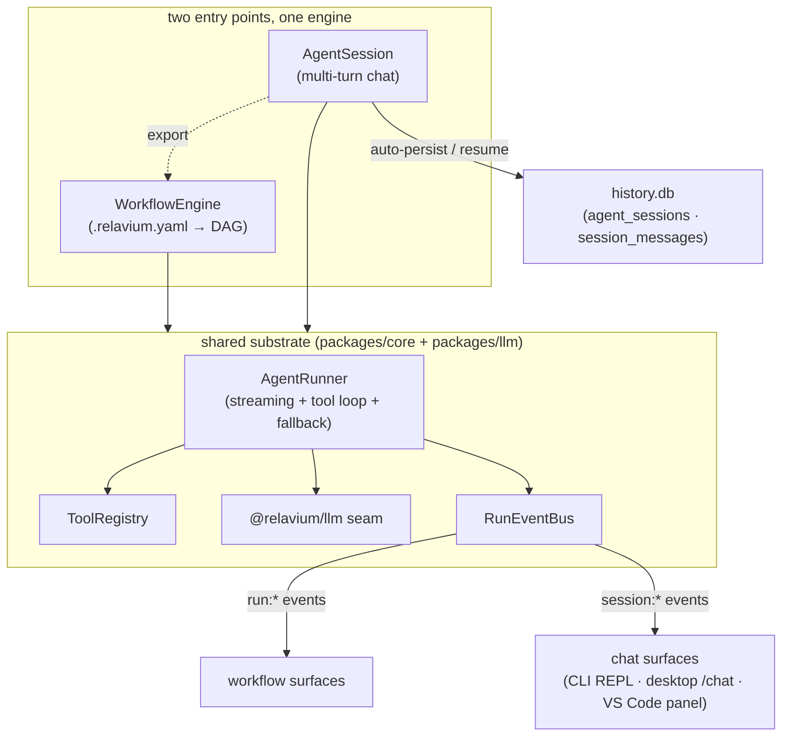

# Agent sessions

An **agent session** is Relavium's agent-first entry point: an ongoing, multi-turn
conversation between a user and a single agent, available on every surface (the CLI
`relavium chat` REPL, the desktop chat panel, the VS Code chat assistant) **alongside**
the workflow runner. A session is *not* a second engine — it is a thin wrapper, the
`AgentSession`, over the **same** substrate a workflow run uses, and it can be
**exported** to a committed `.relavium.yaml` workflow. That makes Relavium the start of
the work (chat) and its destination (a git-native workflow). This document explains how
the session entry point is built and how each surface presents it; the runtime contract
is cited from [../reference/contracts/agent-session-spec.md](../reference/contracts/agent-session-spec.md),
not restated here.

> Status: design doc for the agent-first pivot. The session lifecycle, message shape,
> context, and export mapping are the canonical property of
> [../reference/contracts/agent-session-spec.md](../reference/contracts/agent-session-spec.md);
> the `session:*` event names are owned by
> [../reference/contracts/sse-event-schema.md](../reference/contracts/sse-event-schema.md).
> This document does not re-enumerate either.

## Context

Relavium was originally framed as workflow-first — the unit of value is a committable
`.relavium.yaml`, the LLM is a node, and chat only chose which workflow to trigger. The
agent-first pivot ([ADR-0024](../decisions/0024-agent-first-entry-point-agentsession.md))
makes a conversational assistant a first-class entry point on every surface so a user can
start in chat and **graduate** a high-value conversation into a reusable workflow. The
constraint was to do this **without forking the engine** or weakening a non-negotiable.
The answer is `AgentSession`: a second entry point on the *one* engine, sharing its
substrate.

## Built on the one engine — cited, not re-told

The session reuses the engine's existing pieces wholesale — the `AgentRunner`, the
`ToolRegistry`, the `@relavium/llm` seam, and the `RunEventBus`. The unified-substrate
story (one engine, two entry points, the same hardening primitives applied once) is owned
by [shared-core-engine.md](shared-core-engine.md#why-one-engine-shared-by-all-surfaces);
this document does not retell it. The single point worth restating here is the seam
discipline: `SessionMessage` is a persistence/transcript type, **mapped** to the seam's
`LlmMessage` at call time and **never copied** — **no vendor SDK type crosses the seam**
([ADR-0011](../decisions/0011-internal-llm-abstraction.md)). Because the engine keeps
**zero platform-specific imports**, a session runs identically in Node, the Tauri WebView
([ADR-0018](../decisions/0018-desktop-execution-and-rust-egress.md)), the VS Code host,
and (Phase 2) a cloud worker.

## How `AgentSession` wraps `AgentRunner`

A session is a state machine around a single agent turn. `start(agentRef, context)`
binds **one** agent and its `fallback_chain` for the whole conversation (no mid-session
agent switching in Phase 1) and allocates a `sessionId`. Each `sendMessage(text)` runs
**one assistant turn** through the *same* `AgentRunner` a workflow `agent` node uses:

1. The persisted `session_messages` are projected into the seam's `LlmMessage` shape
   (mapped, never copied) and the bound agent + `fallback_chain` are handed to the
   `AgentRunner`.
2. The runner streams tokens and drives the tool-call loop against the `ToolRegistry`,
   walking the fallback chain on provider failure — identical to a workflow node.
3. The user, assistant, and tool messages are appended to the transcript and persisted.

The difference between a session and a workflow node is the **entry point and lifetime**,
not the execution: a session is long-lived and conversational, a node is a single
bounded step. The lifecycle (`start` / `sendMessage` / `cancel` / `resume` / `export`),
the `SessionContext`, and the `SessionMessage` shape are canonical in
[agent-session-spec.md](../reference/contracts/agent-session-spec.md).

## Checkpoint and persist to `history.db`

A session is **auto-persisted and resumable** — there is no separate "save" step and no
`sessions.db`. Sessions and their transcripts live in the existing encrypted local
`history.db` (SQLCipher) in two new tables:

- **`agent_sessions`** — one row per session: the bound `agentRef`/model, the
  `SessionContext`, and lifecycle timestamps.
- **`session_messages`** — the append-only transcript, monotonic `sequenceNumber` per
  session.

The DDL is canonical in
[../reference/desktop/database-schema.md](../reference/desktop/database-schema.md). These
tables are **bound to a session**, deliberately distinct from the per-step run `messages`
table (bound to a `step_executions` row inside a workflow run); the two share a shape
family but must not be merged — that relationship is documented in the spec and the DB
schema to prevent shape-drift. Persistence is append-only and message-by-message, so
`resume` simply reloads the rows and continues — the same checkpoint-at-every-boundary
discipline the engine uses for runs, applied to conversation turns. A session is **not**
a run and **does not** appear in run history; the bridge between the two is export.

## The session context

`SessionContext` is the workspace situation a session runs against — the working
directory, the active file/selection, the git ref (for provenance), the FS-scope tier,
and session-scoped `{{ctx.*}}` variables. It is **auto-detected from the launching
surface and overridable** by the user. The session reuses the **same** filesystem-scope
tiers and the **same** `allowedCommands` policy a workflow uses — `fs_scope = sandboxed`
and an empty-by-default command allowlist are the teeth that keep chat honest. The
chat-mode defaults (`fs_scope`, the command allowlist, `default_model`, `max_messages`)
live in the `[chat]` block of [../reference/contracts/config-spec.md](../reference/contracts/config-spec.md),
which references those canonical homes rather than forking them. The full `SessionContext`
shape is owned by [agent-session-spec.md](../reference/contracts/agent-session-spec.md#session-context).

The same tool-policy hardening applies as for workflows
([ADR-0029](../decisions/0029-tool-policy-hardening.md)): a session may only **narrow**
the agent's tools (never escalate), a `secret`-typed value is **never** interpolated into
a prompt or tool text, and `http_request`/MCP egress obeys the same SSRF policy. A user's
own conversational content is the user's data — persisted in the encrypted `history.db`,
not treated as a managed secret; that boundary is stated in
[../standards/security-review.md](../standards/security-review.md).

## Export to workflow — the graduation path

A session can be **explicitly exported** to a `.relavium.yaml` workflow
([ADR-0026](../decisions/0026-session-export-to-workflow.md)). The export is the technical
form of the chat-to-workflow continuum, and it is honest about its fidelity: it produces a
**human-reviewed scaffold**, not an auto-inferred optimal graph.

- The session's assistant turns become a **linear chain of `agent` nodes**, in order,
  carrying the agent binding, the resolved prompts, and the tools that were used.
- The **full transcript is preserved as YAML comments/metadata** so the file is
  self-documenting — with secrets already excluded by the no-interpolation rule above.
- Parallel / conditional / loop structure is **not** auto-inferred; the author adds it on
  the canvas. Export is user-initiated and presented for review before commit — never
  silent, never an auto-commit.

The export **produces** the format owned by
[../reference/contracts/workflow-yaml-spec.md](../reference/contracts/workflow-yaml-spec.md);
the **mapping** (session turn → `agent` node, transcript → metadata) is the contract
owned by [agent-session-spec.md](../reference/contracts/agent-session-spec.md#export-to-workflow).
The desktop "Export to Canvas" affordance and the CLI `relavium chat-export` both drive
this one contract, and because the output is git-native YAML
([ADR-0009](../decisions/0009-git-native-workflow-yaml.md)) it is reviewable and diffable
like any authored workflow.

## Per-surface UI

The same `AgentSession` drives three surface presentations. Session events are produced
and consumed **in-process** on every surface exactly like run events — the `session:*`
namespace is disjoint from `run:*` and consumers route purely on the `type` discriminant
(the namespace is owned by
[../reference/contracts/sse-event-schema.md](../reference/contracts/sse-event-schema.md#session-event-namespace);
this doc does not list event names).

### CLI — the `relavium chat` REPL

The CLI is the engine's first real consumer, so it is also the first session surface. A
`relavium chat` REPL drives one `AgentSession`: each prompt is a `sendMessage`, ink
re-renders the streaming assistant turn and tool-call activity live, and the session
auto-persists so `chat-resume` continues it, `chat-list` enumerates saved sessions, and
`chat-export` runs the export. The command surface is canonical in
[../reference/cli/commands.md](../reference/cli/commands.md) and
[../reference/cli/chat-session.md](../reference/cli/chat-session.md).

### Desktop — the `/chat` panel as a co-equal tab

On the desktop, **Chat and Canvas are co-equal top-level tabs** — but the default landing
stays the neutral/operational home, and the **canvas remains the product's signature
surface**; agent-first is expressed by Chat being a one-click peer tab, *not* by
force-opening the app into Chat
([ADR-0025](../decisions/0025-agent-surface-refines-desktop-scope.md)). A chat panel is an
**agent capability, not an IDE feature**: the user converses with an agent that edits
files through the same allowlisted, FS-scope-tiered tools a workflow agent uses, so the
desktop never becomes a code editor — ADR-0025 refines, and never reverses, ADR-0007's
no-editor / no-file-tree / no-terminal boundary. The chat panel is a transcript + input +
tool-call visualization; sessions are **DB-first** (history.db), so there is no sixth
Zustand store — the active session id lives in `uiStore` and the transcript is read from
`history.db`. The routes (`/chat`, `/chat/:sessionId`) and tab reconciliation are
canonical in [../reference/desktop/routes-and-screens.md](../reference/desktop/routes-and-screens.md).

### VS Code — a chat panel that survives a reload

The VS Code extension presents the session as a chat-assistant WebviewPanel, the
code-adjacent counterpart to the desktop tab. There is intentionally **no separate
`vscode` session document**: the persistence model is the load-bearing reason and it lives
here. A VS Code WebviewPanel's webview state is **disposed when the panel is hidden or the
window reloads**, so a chat that lived only in webview memory would be lost on a reload —
unacceptable for a multi-turn assistant. Because `AgentSession` **auto-persists to
`history.db`**, the panel is a *view* over durable state: on reactivation it resumes the
session by `sessionId` and replays the transcript from the database rather than relying on
webview retention. This is the same persistence guarantee the CLI and desktop get, which
is exactly why a session must be DB-backed and not surface-local. The extension commands
(`relavium.openChat`, `exportChatSession`) are canonical in
[../reference/vscode/extension-api.md](../reference/vscode/extension-api.md).

## The steering channel

Beyond starting a fresh session, a user will want to **"whisper to" a running agent** —
nudge a workflow `agent` node (or a long session turn) mid-flight the way they converse in
a session: "also check the tests", "stop, that's the wrong file". This **steering channel**
is the conceptual bridge between the two entry points — chatting *into* a run — and this
document is its home; it has no canonical contract elsewhere because in Phase 1 it ships
only as **reserved events**, with no behavior.

The reserved steering events live in the event schema as declared-but-unemitted types
([sse-event-schema.md](../reference/contracts/sse-event-schema.md#workflow-governance-and-reserved-events)):

- **`agent:directive_injected`** — a user directive was applied to the in-flight agent.
- **`agent:context_compacted`** — the agent's working context was compacted in response.
- **`agent:context_cleared`** — the agent's working context was cleared.

The **security envelope** is part of the design from day one, even while the channel is
reserved:

- **Running or paused only.** A directive may be applied **only** to an agent that is
  currently running or paused; completed nodes are immutable, so steering can never rewrite
  finished work.
- **Length, not content, on the wire.** The `agent:directive_injected` event carries
  **`directiveLength`, never the directive text** (and a `mode: 'non_blocking' | 'blocking'`
  flag), so no user content, secret, or PII enters the event stream — the same secret-free
  discipline every other event payload follows.

Phase 1 reserves the events and pins the envelope so that when steering is implemented it
cannot widen the trust boundary by accident. The desktop steering affordance over a
running node is explicitly an **agent capability**, on the in-scope side of ADR-0025's
agent-capability-vs-IDE-shell line.

## Related documents

- [shared-core-engine.md](shared-core-engine.md) — the one engine and the unified substrate (cited above, not retold).
- [execution-model.md](execution-model.md) — how a single workflow run executes; a session turn reuses the same `AgentRunner` path.
- [../decisions/0024-agent-first-entry-point-agentsession.md](../decisions/0024-agent-first-entry-point-agentsession.md) — the agent-first decision.
- [../decisions/0025-agent-surface-refines-desktop-scope.md](../decisions/0025-agent-surface-refines-desktop-scope.md) — the agent-capability-vs-IDE-shell boundary.
- [../decisions/0026-session-export-to-workflow.md](../decisions/0026-session-export-to-workflow.md) — the chat-to-workflow export.
- [../reference/contracts/agent-session-spec.md](../reference/contracts/agent-session-spec.md) — the session runtime contract (canonical).
- [../reference/contracts/sse-event-schema.md](../reference/contracts/sse-event-schema.md) — the `session:*` and reserved steering events (canonical).
