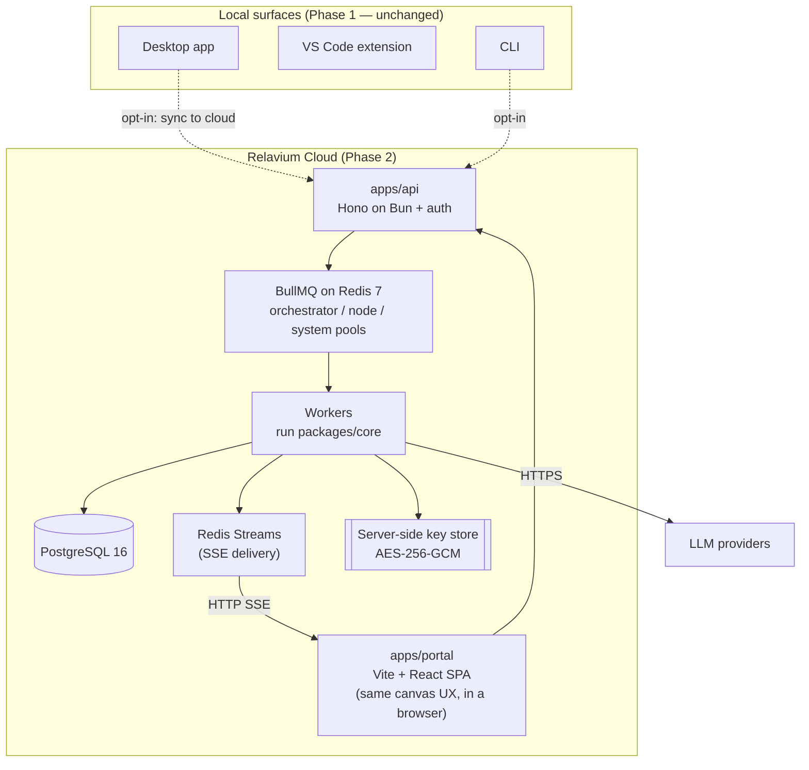

# Cloud execution and the web portal (Phase 2)

> **Phase 2 — not shipped in Phase 1.** Everything in this document describes a
> planned cloud layer. None of it exists in the local-first Phase 1 product. It is
> documented now only to prove the architecture is designed for it, and to keep
> the Phase-1 surfaces from baking in assumptions that would block it. Do not read
> any behavior here as currently available.

Phase 2 adds an optional **cloud execution layer** and a **web portal** *on top of*
the local-first product — it never replaces or breaks the Phase-1 surfaces. The
core idea: the same `packages/core` engine that runs in the Tauri WebView, the
VS Code extension host, and the CLI can also be invoked by a cloud API through a
job queue, enabling 24/7 automation, team sharing, cloud triggers (webhooks,
schedules), and a browser-based canvas. A user can link a Relavium Cloud account
and choose, **per workflow**, whether to run locally or in the cloud — and can keep
running entirely locally with no account forever.

> Status: draft — to be expanded. This is a forward-looking sketch grounded in the
> architecture-decisions cloud rows and the pivot `phase2Architecture` source.
> Concrete cloud DDL, API routes, and the portal API are the canonical property of
> [../reference/](../reference/) and are cited, not restated, here.

## Context

The phasing is a hard product decision
([ADR-0008](../decisions/0008-local-first-phase-1-cloud-phase-2.md) and
[../product-constraints.md](../product-constraints.md)): **Phase 1 is local-first
with zero cloud dependency and no account**, and **cloud execution is Phase 2**.
The engine must support both modes behind a clean interface switch, but Phase 1
must never *require* the cloud. The dual-database story —
[SQLite local, PostgreSQL cloud](../decisions/0005-sqlite-drizzle-local-postgres-cloud.md) —
is designed for exactly this transition, with one Drizzle schema targeting both.

## What stays the same

The whole point is that the engine does not change. `packages/core` and
`packages/llm` run in cloud workers exactly as they run on a user's machine
(see [shared-core-engine.md](shared-core-engine.md) and
[multi-llm-providers.md](multi-llm-providers.md)). Surfaces call
`engine.run()` and consume the same `RunEvent` objects regardless of mode — they do
not branch on local-versus-cloud. The workflow YAML, the node-type catalog, the
checkpoint shape, fallback chains, and cost accounting are all identical.

## What the cloud layer adds

| Component | Role |
|-----------|------|
| **`apps/api`** | A **Hono** REST API on Bun that wraps `packages/core` with job dispatch, multi-tenant auth, and cloud state. It does not re-implement execution — it enqueues it. |
| **`apps/portal`** | A **Vite + React SPA** with the same canvas UX as the desktop app, running in a browser instead of a Tauri WebView. This is a *control plane* (usage, quota, team, runs, gates), not a new execution engine. |
| **PostgreSQL 16** | Replaces SQLite for cloud runs. The Drizzle schema is ~90% shared with the local SQLite schema; see [../reference/desktop/database-schema.md](../reference/desktop/database-schema.md) and the SQLite-vs-Postgres differences it records. |
| **Redis 7 + BullMQ** | Job queues (orchestrator / node / system worker pools) plus Redis Streams for SSE log delivery and a sliding-window rate limiter. |
| **Cloud workers** | Worker processes that pull jobs and run `packages/core`, one worker thread per agent node. |
| **Server-side key store** | API keys for cloud runs are held in an AES-256-GCM-encrypted store instead of the OS keychain. |
| **Object storage** | Large run-output artifacts (generated files) for cloud runs. |

## What changes between Phase 1 and Phase 2

These are the *only* substitutions; everything else is shared:

- **Execution location.** In-process worker threads on the user's machine become
  BullMQ jobs dispatched by `apps/api` to a worker pool, enabling multi-server
  scaling and 24/7 runs.
- **State store.** Local SQLite becomes PostgreSQL 16 with multi-tenancy (an
  `org_id` column and row-level security), so workflows and runs can be shared
  within a team.
- **Event transport.** Run events that were delivered over Tauri IPC / WebView
  `postMessage` are delivered over **HTTP SSE backed by Redis Streams**, consumed
  by the portal's `EventSource` with `Last-Event-ID` resumption. The event *shape*
  is still the [SSE event schema](../reference/contracts/sse-event-schema.md) — the
  same schema the desktop app delivers over IPC.
- **Key storage.** OS keychain (local) becomes the server-side encrypted store
  (cloud). Local runs continue to use the OS keychain.
- **Triggers.** Webhook and schedule triggers — which need an always-on listener —
  become functional in the cloud (a webhook endpoint enqueues a run; cron is BullMQ
  repeat jobs). These are out of scope locally; see
  [../ideas/scheduled-and-webhook-triggers.md](../ideas/scheduled-and-webhook-triggers.md).
- **Human-gate notifications.** Gates gain email/Slack delivery for assignees who
  are not actively watching the portal.
- **Cost tracking.** Per-node cost gains org-level aggregate views, budget alerts,
  and export.

## The transparent local→cloud switch

The engine exposes an **identical interface regardless of mode**; surfaces never
check the mode. Mode is resolved once, at engine creation time, in this order:

1. An explicit `executionMode` config override.
2. The presence of a valid cloud auth token (implies cloud mode).
3. A stored user preference.
4. Default: **local**.

The migration path is gradual and opt-in: a user starts local, signs up on the
portal, gets a token, and the desktop app detects it and offers to run in the cloud
for persistence, sharing, and no local key management. Opting in recreates the
engine in cloud mode; the CLI and VS Code pick up the same preference on next
init — **no surface code changes**. Two safety rules are non-negotiable, both
flowing from [local-first-and-security.md](local-first-and-security.md):

- The engine **never silently falls back from cloud to local**. If cloud is
  unreachable in cloud mode it raises an explicit error suggesting a switch —
  silent fallback could leak credentials or bypass enterprise controls.
- Full LLM **transcripts are never synced**, in any tier or mode. The cloud is a
  control and execution plane, not a transcript archive.

## The portal is a control plane, not the execution plane

The web portal is where teams *manage* — usage, quota, run history, pending gates,
team membership, audit, billing. It is explicitly **not** where local workflows
run. Its API surface is canonical in
[../reference/portal/api-reference.md](../reference/portal/api-reference.md). The
browser never calls LLM providers directly; all cloud LLM calls go through the
workers, so no API key ever appears in a browser network tab.

## Key-security note for Phase 2

The single most dangerous data in the cloud layer is provider keys. The Phase-1
controls (keys never in payloads, never serialized into job/checkpoint/log data,
stripped from exported YAML) carry forward, plus: cloud keys are encrypted at rest
with AES-256-GCM, and a lint rule bans serializing keys into worker job payloads. A
pre-release security audit must target the four leak surfaces — at-rest store, job
payloads, exported YAML, and the browser network tab — before Phase 2 ships. See
[local-first-and-security.md](local-first-and-security.md) for the cross-cutting
secret-handling rules.

## Related documents

- [overview.md](overview.md) — where the cloud layer sits relative to the local surfaces.
- [local-first-and-security.md](local-first-and-security.md) — the secret-handling rules that carry into Phase 2.
- [shared-core-engine.md](shared-core-engine.md) · [multi-llm-providers.md](multi-llm-providers.md) — the engine and provider layer the workers run unchanged.
- [../reference/portal/api-reference.md](../reference/portal/api-reference.md) — the portal/cloud API surface.
- [ADR-0008](../decisions/0008-local-first-phase-1-cloud-phase-2.md) · [ADR-0005](../decisions/0005-sqlite-drizzle-local-postgres-cloud.md) — the phasing and dual-DB decisions.
