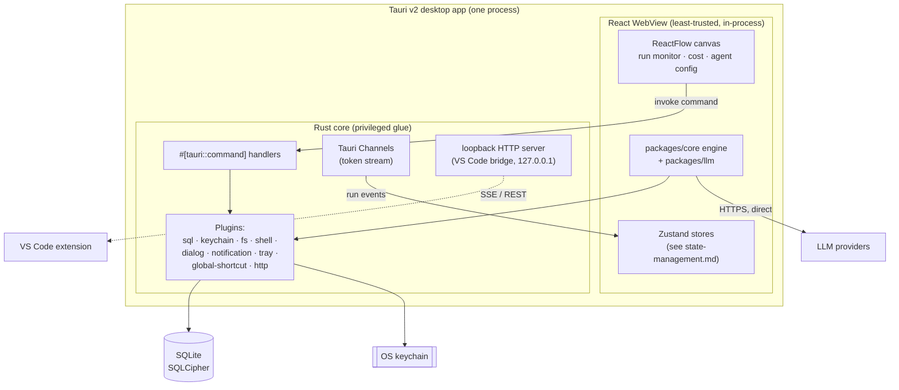

# Desktop architecture (Tauri v2)

> Last updated: 2026-06-03

The desktop app is Relavium's primary surface and an **agent-management center** —
a visual workflow canvas, agent configuration, run monitoring, and cost tracking.
It is explicitly **not** an IDE: no code editor, no file browser, no terminal.
Architecturally it is a Tauri v2 application: a small **Rust core** that owns all
privileged, system-level work, and a **React WebView** that renders the UI and
runs the shared engine. The two halves talk over a three-primitive IPC bridge.
This document explains that split, the IPC model, and the plugin surface; the
concrete IPC message contract and the plugin inventory are canonical in
[../reference/](../reference/) and cited here rather than restated.

> Status: draft — to be expanded. The Rust/WebView split, IPC primitives, and
> plugin set are grounded in the architecture-decisions and pivot sources;
> per-command signatures and the full plugin manifest are the canonical property
> of [../reference/desktop/](../reference/desktop/) and
> [../reference/contracts/ipc-contract.md](../reference/contracts/ipc-contract.md).

## Context

The desktop framework is **Tauri v2**, decided in
[ADR-0001](../decisions/0001-tauri-v2-over-electron.md): a 2–5 MB bundle (OS-native
WebView) versus Electron's 85–120 MB (bundled Chromium), with every required
capability — SQLite, OS keychain, scoped filesystem, child-process shell, system
tray, global shortcut, notifications — available as a first-class Tauri plugin.
The scope of the app is fixed by
[ADR-0007](../decisions/0007-desktop-is-not-an-ide.md) and
[../product-constraints.md](../product-constraints.md): agent management only.

The trade-off Tauri imposes is that the WebView is OS-native (WKWebView on macOS,
WebView2 on Windows, WebKitGTK on Linux), so rendering can differ subtly across
platforms — which is why cross-platform canvas rendering is a tracked top risk
(see [overview.md](overview.md)) with a Playwright-based per-platform test suite as
the mitigation.

## The two halves: Rust core vs React WebView

Tauri splits the app into a privileged native side and an unprivileged web side.
Relavium maps responsibilities across that line deliberately:

| Concern | Lives in | Why |
|---------|----------|-----|
| ReactFlow canvas, agent config UI, run monitor | **WebView (React)** | Pure UI; identical to a browser environment, no native integration needed |
| The workflow engine (`packages/core` + `packages/llm`) | **WebView** | The engine is pure TypeScript and runs in the WebView's JS runtime; LLM calls go out over `fetch` directly to providers |
| Zustand stores, token double-buffer | **WebView** | Frontend state; see [state-management.md](state-management.md) |
| SQLite reads/writes | **Rust core** (`tauri-plugin-sql`) | DB access is a privileged plugin; the WebView calls it via commands |
| Keychain access | **Rust core** (keychain plugin) | Keys must never enter the WebView; see [local-first-and-security.md](local-first-and-security.md) |
| Scoped filesystem, shell tool execution | **Rust core** (fs / shell plugins) | Privileged, capability-gated operations |
| System tray, global shortcut, native notifications, file dialogs | **Rust core** (respective plugins) | OS-level integration |
| Loopback HTTP server for the VS Code bridge | **Rust core** (async server in the Tauri runtime) | A local endpoint other surfaces can reach |

The guiding rule is the trust boundary from
[local-first-and-security.md](local-first-and-security.md): the **WebView is the
least-trusted in-process component** because it renders untrusted model output.
Anything privileged — secrets, filesystem writes, command execution — happens in
the Rust core behind an explicit command and a declared capability, never in the
WebView.

Note that the engine itself runs **in the WebView**, not in Rust. Rust does not
re-implement workflow execution; it provides system services (DB, keychain, FS,
shell, tray) that the engine and UI invoke. This keeps `packages/core` identical
across all four surfaces (see [shared-core-engine.md](shared-core-engine.md)).

## The IPC bridge: three primitives

Communication between the WebView and the Rust core uses three Tauri primitives,
each for a different traffic pattern. The concrete message shapes are canonical in
[../reference/contracts/ipc-contract.md](../reference/contracts/ipc-contract.md);
the roles are:

1. **Commands** (`#[tauri::command]`) — request/response. The WebView calls
   `invoke('command_name', args)` and awaits a result. Used for: loading and saving
   workflow/agent files, starting and cancelling runs, reading run history from
   SQLite, fetching the configured-provider list, and resolving a human gate.
2. **Channels** (`tauri::ipc::Channel`) — ordered, high-throughput, backpressure-
   aware streams. Used for the **token stream** and other run events: a channel is
   created when a run starts and its events are routed to the matching ReactFlow
   node by `nodeId`. Channels are preferred over broadcast events here because they
   avoid string-serialization overhead and naturally throttle when the renderer
   falls behind. The event payloads are the
   [SSE event schema](../reference/contracts/sse-event-schema.md).
3. **Events** (`emit` / `listen`) — loose-coupling broadcasts for signals not tied
   to one run: active-run count (for the tray badge), update availability, MCP
   server health changes.

Because the engine runs inside the WebView, many run events do not need to cross
the IPC boundary at all in the desktop case — the engine's `RunEventBus` is in the
same JS runtime as the stores that consume it. IPC is used where the WebView needs
a privileged service (DB, keychain, FS) and where the Rust core needs to push
system-level signals into the UI. How the frontend renders the resulting event
stream is covered in [state-management.md](state-management.md).

## Plugins and capabilities

Tauri v2 exposes native functionality through plugins, and v2's **capability
system** requires every plugin API the WebView may call to be explicitly declared
in the capabilities manifest — an undeclared call fails silently, so capabilities
are added incrementally and tested per plugin. The full inventory and the
capability declarations are canonical in
[../reference/desktop/tauri-plugins.md](../reference/desktop/tauri-plugins.md). The
plugins Relavium depends on, at a glance:

- `tauri-plugin-sql` — local SQLite with SQLCipher
  ([database-schema.md](../reference/desktop/database-schema.md)).
- keychain plugin — OS keychain for API keys
  ([keychain-and-secrets.md](../reference/desktop/keychain-and-secrets.md)).
- `tauri-plugin-fs` — **scoped** filesystem access (sandboxed to the workspace by
  default; wider scopes need explicit user approval).
- `tauri-plugin-shell` — child-process execution for shell tools, gated by an
  explicit per-workflow command allowlist.
- `tauri-plugin-dialog` — native file pickers.
- `tauri-plugin-notification` — native desktop notifications (run complete,
  failure, human gate awaiting).
- `tauri-plugin-tray` — system tray for monitoring active runs.
- `tauri-plugin-global-shortcut` — a global hotkey to trigger a workflow from
  anywhere.
- HTTP plugin — outbound HTTP for the `http_request` built-in tool
  ([built-in-tools.md](../reference/shared-core/built-in-tools.md)).

## The VS Code bridge

The Rust core runs a small HTTP server bound to **loopback only** (`127.0.0.1`, a
dynamic port) so a running VS Code extension can discover and talk to the desktop
app. This is an *optional enhancement*: the VS Code extension bundles its own copy
of the engine and works fully standalone, but when the desktop app is detected it
unlocks "open in designer" and live run-status sync. The connection is
authenticated with a per-session bearer token written to a local file with
owner-only permissions, and the extension makes its **own** LLM calls — it never
proxies them through the desktop app, so no API key transits this channel. The wire
protocol is the [IPC contract](../reference/contracts/ipc-contract.md); the trust
properties are in [local-first-and-security.md](local-first-and-security.md).

## What this app deliberately is not

To keep the agent-management scope honest
([ADR-0007](../decisions/0007-desktop-is-not-an-ide.md)): the desktop app has **no
code editor, no file tree, no integrated terminal**. Code-adjacent work — editing a
file, reviewing a diff, running a workflow on the file you are looking at — is the
VS Code extension's job. The desktop app designs, configures, runs, and observes;
it does not edit code. The screens it does ship are catalogued in
[../reference/desktop/routes-and-screens.md](../reference/desktop/routes-and-screens.md).

## Related documents

- [overview.md](overview.md) — where the desktop app sits among the four surfaces.
- [state-management.md](state-management.md) — how the WebView renders run events.
- [local-first-and-security.md](local-first-and-security.md) — the WebView/Rust trust boundary.
- [../reference/contracts/ipc-contract.md](../reference/contracts/ipc-contract.md) — the IPC message contract.
- [../reference/desktop/tauri-plugins.md](../reference/desktop/tauri-plugins.md) — the plugin inventory and capabilities.
- [ADR-0001](../decisions/0001-tauri-v2-over-electron.md) · [ADR-0007](../decisions/0007-desktop-is-not-an-ide.md) — the framing decisions.
