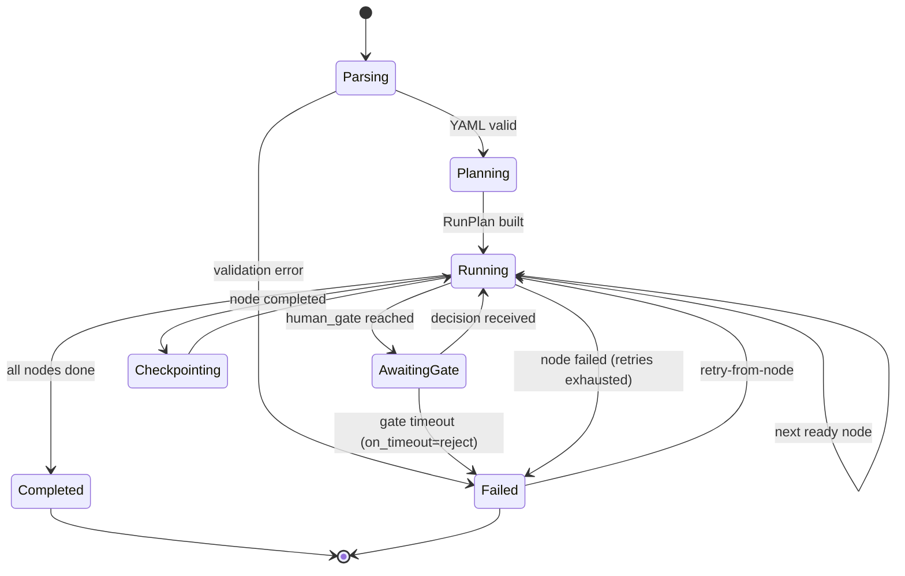

# Execution model

This document traces how a single run executes **locally** in Phase 1: how the
node DAG is walked, how tokens stream from a provider to a node face, how a human
gate suspends and resumes a run, and how each node boundary is checkpointed. It is
the runtime companion to [shared-core-engine.md](shared-core-engine.md), which
covers the engine's structure. Concrete contracts (the event schema, the YAML
format, the IPC surface) are cited from [../reference/](../reference/) rather than
restated here.

> **Scope.** This document covers a **workflow run** (the `WorkflowEngine` entry
> point). A *chat session* — the engine's other entry point — runs on the same node,
> tool, and streaming machinery but has its own lifecycle; it is detailed in
> [agent-sessions.md](agent-sessions.md).

> Status: design sourced from the synthesis `dataFlow` trace and the engine
> sources. Event payloads and field names are the canonical property of
> [../reference/contracts/sse-event-schema.md](../reference/contracts/sse-event-schema.md).

## The trigger

A run is started identically from any surface — the only difference is the entry
point and how events are painted:

- **Desktop**: the canvas Run button starts the engine, which runs **in the WebView's
  JS runtime** ([ADR-0018](../decisions/0018-desktop-execution-and-rust-egress.md)).
  Only the authenticated LLM egress is delegated to a Rust command.
- **CLI**: `relavium run <workflow>` calls the engine directly and renders with ink.
- **VS Code**: a right-click / command runs the engine in the extension host.

All three call `WorkflowEngine.start(workflowId, input)`. A chat session instead
enters through the `AgentSession` entry point, which shares the same node, tool,
and streaming machinery described below (see [agent-sessions.md](agent-sessions.md)).
There is no Relavium server involved in Phase 1.

## Phases of a run

### 1. Parse and plan

The engine validates the workflow YAML and compiles it into a DAG run plan
(topological order via Kahn's algorithm), resolving each node's inputs from
`{{ node.output }}` interpolation against upstream nodes. See
[shared-core-engine.md](shared-core-engine.md#yaml--dag-compilation). The accepted
file format is the
[workflow YAML spec](../reference/contracts/workflow-yaml-spec.md); the node types
are catalogued in
[../reference/shared-core/node-types.md](../reference/shared-core/node-types.md).

### 2. Walk the DAG

Right after `run:started`, before any node runs, the engine resolves the workflow
`context:` map **once** into the immutable `ctx.*` namespace (the spec's eager-once
context — `resolveContext`) and threads the frozen result to every node
(`NodeExecContext.ctx`), so a bare `ctx.key` read in a `condition` / `transform` /
`merge_fn` expression and in an agent prompt sees the real value. A context value may
itself interpolate `{{ inputs.* }}` (and `read_file`, via an injected resolver
capability); a resolution failure closes the run with `run:failed` (`validation`)
rather than running nodes against a partial context. On a cross-process resume `ctx`
is **re-resolved** (it is deliberately not carried in the checkpoint).

The engine then dispatches every node whose dependencies are satisfied. Independent
branches run concurrently:

- **Sequential spine** — nodes run in dependency order, each receiving upstream
  outputs.
- **Parallel fan-out** — a FanOut node spreads input across N branches that run
  at once; an Aggregator/merge node joins them with a configured strategy
  (all-required, first-wins, quorum-of-N, best-of).
- **Conditional branches** — a Condition node evaluates its expression and
  activates exactly one downstream path.

Each agent node is handled by the `AgentRunner`, which streams from
`packages/llm` (see [multi-llm-providers.md](multi-llm-providers.md)).

### 3. Stream tokens to the node face

As the provider streams tokens back, the `AgentRunner` emits them on the
`RunEventBus`. The transport differs per surface but the event shape is the same
[SSE event schema](../reference/contracts/sse-event-schema.md) — the canonical
`RunEvent` union (`node:started`, `agent:token`, `node:completed`, `node:failed`,
`human_gate:paused`/`human_gate:resumed`, `cost:updated`, `run:completed`,
`run:failed`, …), each carrying a `nodeId` and a monotonically increasing
`sequenceNumber`. The event names and payloads are defined there, not restated
here:

- **Desktop** — the engine and its `RunEventBus` run **WebView-side**, so run events
  are produced and consumed in the same JS runtime and routed to the matching
  ReactFlow node by `nodeId` **without crossing IPC**. The only Rust→WebView channel
  on the LLM hot path is the delegated egress's `Channel<StreamChunk>`, which the
  WebView adapter folds into `agent:token` events on that bus
  ([ADR-0018](../decisions/0018-desktop-execution-and-rust-egress.md)). The IPC
  surface is defined in
  [../reference/contracts/ipc-contract.md](../reference/contracts/ipc-contract.md).
- **VS Code** — events are posted to the WebviewPanel via `postMessage`.
- **CLI** — ink re-renders the live node status and token stream in the terminal.

The `sequenceNumber` lets a surface detect a gap and request a resync, and lets the
desktop renderer batch high-frequency token events without dropping any. The frontend's
token-rendering performance model (the double-buffer that caps re-renders at
60fps) is described in [state-management.md](state-management.md).

### 4. Human gate

A `human_gate` node suspends the run until a human approves, rejects, or edits the
pending decision. While suspended the engine emits `human_gate:paused`, persists
the gate state to the checkpoint, and waits. The gate is resolved from any surface
that can reach the run:

- Desktop: a `HumanGateOverlay` rendered at the root layout.
- VS Code: a sidebar / status-bar prompt and a WebviewPanel card.
- CLI: a terminal prompt (`relavium gate`).

When a decision arrives — `approved`, `rejected`, or `input_provided` — the engine emits
`human_gate:resumed` and the run **continues**: the gate node completes with the decision as its
output, so the author routes on it with a downstream `condition` (a `rejected` decision does not
itself fail the run). Because the gate state is checkpointed, resolving it is idempotent across a
reconnect — re-delivering the same decision does not advance the run twice. **Parallel branches may
each reach a gate, so multiple gates can be pending at once** — each resolves independently with its
own timeout (a `run:paused` aggregate reflects that ≥1 gate is pending). A gate may carry a timeout
with an `on_timeout` policy (`reject` / `approve`; `escalate` is **reserved** in v1.0 — authored in
YAML as `timeout_action`; see
[workflow-yaml-spec.md](../reference/contracts/workflow-yaml-spec.md#human_gate-node)), armed as a
one-shot timer from the injected clock when the gate parks. The two timeout outcomes differ from a
human decision: `approve` **auto-resolves** the gate as approved (`decidedBy: 'timeout'`, the run
continues); `reject` **fails** the run with `run_timeout` (the `AwaitingGate → Failed` edge above) —
this is what stops a forgotten gate from blocking a run forever. A decision that arrives first
disarms the timer.

The gate event/decision shapes are part of the
[SSE event schema](../reference/contracts/sse-event-schema.md) and the
[IPC contract](../reference/contracts/ipc-contract.md).

### 5. Checkpoint each node boundary

After every node completes, the engine writes a checkpoint to local SQLite — run
status, per-node states, completed and pending node IDs, and (for an orchestrator)
its message history. This is the foundation for resume and retry; see
[shared-core-engine.md](shared-core-engine.md#checkpoint-and-resume). There is **no separate
checkpoint table** — the checkpoint is reconstructed (by a `Checkpointer`) from `step_executions`,
`run_events` (and `messages` for an orchestrator's history), all defined in
[../reference/desktop/database-schema.md](../reference/desktop/database-schema.md).

Three run-loop substrate rules make this reliable ([ADR-0036](../decisions/0036-run-loop-substrate-event-bus-and-execution-host.md)):
a node-boundary / terminal event is **persisted before it is delivered** to consumers, so a crash
between emit and write can never re-run a completed node or lose its output; the
**monotonic, gap-free `sequenceNumber` is assigned at a single producer-side point** (one counter per
run/session), so concurrent fan-out branches cannot duplicate or invert numbers; and gate / run
`timeout_ms` deadlines are armed as **one-shot timers from an injected clock — not a sleep/poll loop**,
so the completion-driven scheduler stays event-driven.

### 6. Finish

On the last node the engine writes the final output and a cost record to SQLite,
then emits `run:completed` (or `run:failed` if the run failed). Per-node token counts
and per-run cost accumulate as `cost:updated` events during the run (payload
`{ nodeId, model, inputTokens, outputTokens, costMicrocents, cumulativeCostMicrocents }`) and are
persisted at the end — the source of the per-node cost waterfall in the UI. Cost
accounting is computed in `packages/llm`; see
[multi-llm-providers.md](multi-llm-providers.md).

## Failure and recovery

- **Node failure** — a failing node retries within its budget (with backoff,
  optionally adjusting inputs). A required node is never silently skipped.
- **Provider failure** — `packages/llm` walks the agent's fallback chain before
  the node is considered failed.
- **Crash recovery** — on startup the host reconciles in-flight runs from their
  last checkpoint rather than losing them.
- **Retry-from-node** — a user can re-run from any node; the stable idempotency
  key (`runId + nodeId + retryCount`) prevents double-applied side effects.
  *Forward-compatibility:* Phase 1 is DAG-only, so a node executes at most once per
  run. When loops land (a future ADR), a node may execute multiple times within one
  run, so the key gains an `iterationIndex` to keep each iteration's side effects
  distinct.

## Local vs cloud execution

Everything above describes **local** execution (Phase 1): the engine runs in the
host process (the WebView's JS runtime on the desktop) and LLM calls go from the
machine to the provider — directly on the Node-style surfaces, and via the
Rust-delegated egress on the desktop
([ADR-0018](../decisions/0018-desktop-execution-and-rust-egress.md)).

The two Phase-2 modes switch at **different seams**, which is the key framing:

- **Cloud** mode switches the **`ExecutionHost`**: the *whole engine relocates* to a
  cloud worker, and events stream over HTTP SSE instead of the in-process bus — the
  surfaces see identical `RunEvent` objects either way. The transparent switch is
  described in [cloud-phase-2.md](cloud-phase-2.md).
- **Managed** mode does **not** move the engine; it keeps the engine running locally
  and switches only behind the **`LLMProvider` seam**, redirecting the LLM egress
  through the Relavium gateway (an egress-only proxy on Relavium's key). The run
  lifecycle above is unchanged
  ([ADR-0012](../decisions/0012-managed-inference-dual-mode.md),
  [ADR-0018](../decisions/0018-desktop-execution-and-rust-egress.md),
  [managed-inference.md](managed-inference.md)).

In short: `cloud` is an `ExecutionHost` switch (engine relocates); `local` and
`managed` are selected behind the `LLMProvider` seam (engine stays put).

## Related documents

- [shared-core-engine.md](shared-core-engine.md) — engine structure and the run plan.
- [state-management.md](state-management.md) — how the desktop frontend renders streaming events.
- [../reference/contracts/sse-event-schema.md](../reference/contracts/sse-event-schema.md) — the event contract.
- [../reference/contracts/ipc-contract.md](../reference/contracts/ipc-contract.md) — the desktop IPC surface.
