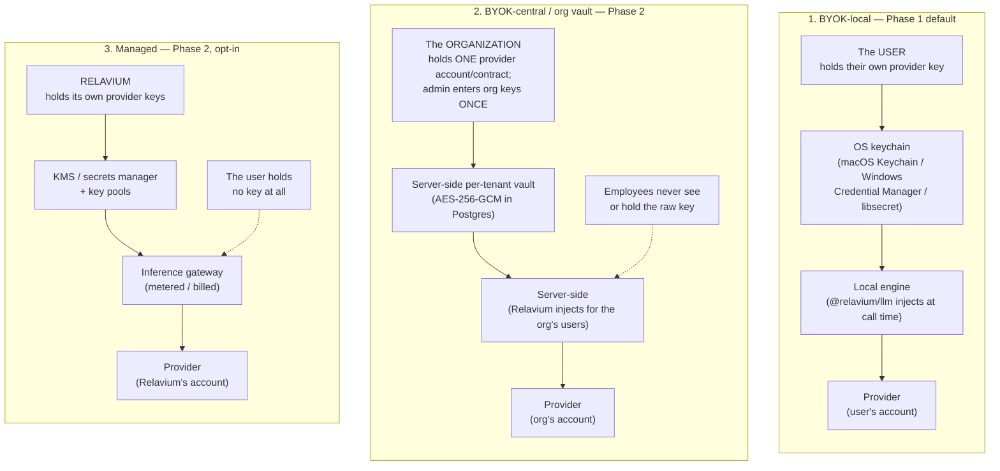
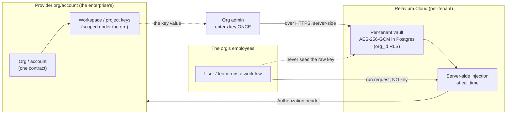

# Key management across Relavium's modes

> Status: canonical — this is the single home for **how API keys are managed**
> across every Relavium mode. The local-keychain mechanics are owned by
> [../reference/desktop/keychain-and-secrets.md](../reference/desktop/keychain-and-secrets.md)
> and the managed key vault by [managed-inference.md](managed-inference.md); this
> document unifies the three custody models and is cited, not restated, by them.
> Phase-2 parts are marked explicitly and **do not exist in the local-first
> Phase 1 product**.

**Related**: [../decisions/0006-os-keychain-for-api-keys.md](../decisions/0006-os-keychain-for-api-keys.md) ·
[../decisions/0012-managed-inference-dual-mode.md](../decisions/0012-managed-inference-dual-mode.md) ·
[../decisions/0013-managed-key-vault-and-pools.md](../decisions/0013-managed-key-vault-and-pools.md) ·
[managed-inference.md](managed-inference.md) ·
[cloud-phase-2.md](cloud-phase-2.md) ·
[local-first-and-security.md](local-first-and-security.md) ·
[../reference/desktop/keychain-and-secrets.md](../reference/desktop/keychain-and-secrets.md)

A Relavium provider API key can live in three different places, owned by three
different parties, and be injected by three different components — one per
execution mode. The scattered story across [ADR-0006](../decisions/0006-os-keychain-for-api-keys.md),
[managed-inference.md](managed-inference.md), and [cloud-phase-2.md](cloud-phase-2.md)
comes together here in one question, asked for three customer shapes:

> **For an individual, a small team, and a 300-person enterprise — whose key is
> it, where does it live, and who injects it at call time?**

The answer is **not** "one model for everyone." It is **three custody models**,
and the right one depends on who you are. The diagram below is the whole story in
one frame; the rest of this document elaborates it.

The providers are the reason there are three models and not one. **Provider keys
are issued at the org/account level, not per end-user** — an Anthropic Console
organization, an OpenAI organization, a Google Cloud project. You do not get "one
key per employee" from a provider; you get keys scoped to an account you control.
Every custody model below is a different answer to "what do we do with an
account-level secret," and that is exactly why distributing one raw key to 300
keychains is the wrong move for an enterprise (see
[Why not a shared key in 300 keychains](#why-not-a-shared-key-in-300-keychains)).

## The three custody models

| Model | Whose key | Storage | Who injects | Per-user attribution | Best for | Phase |
|-------|-----------|---------|-------------|----------------------|----------|-------|
| **BYOK-local** | the **user's** own provider key | the user's **OS keychain** (Keychain / Credential Manager / libsecret) | the **local engine** (`@relavium/llm`), reading the keychain at call time | none — it's one person's key on one machine | **individuals & small teams** | Phase 1 (default) |
| **BYOK-central** (org vault) | the **organization's** account/workspace/project key | a **server-side per-tenant encrypted vault** (AES-256-GCM in Postgres) | **Relavium, server-side**, on behalf of the org's users | **yes** — every call is attributed to a user/team under the org | **a 300-person enterprise** | Phase 2 |
| **Managed** | **Relavium's** own provider keys | a **KMS / secrets manager with key pools** | the **Relavium inference gateway** | yes (metered/billed per tenant) | **zero-setup convenience**, funnel on-ramp | Phase 2 (opt-in) |

The three differ on every axis that matters — owner, store, injector, trust
posture — and they are deliberately kept separate:

### 1. BYOK-local (Phase 1 default)

The user obtains their own provider key and pastes it into Relavium once. It is
stored in the **OS-native secret store** — macOS Keychain (hardware-backed on
Apple Silicon via the Secure Enclave), Windows Credential Manager, or libsecret /
GNOME Keyring on Linux. The local engine reads it **at LLM-call time** from the
Tauri Rust backend and sets the outbound `Authorization` header; **no Relavium
server is in the path**, and the key never reaches the WebView/frontend.

There is **no account and no server** — this is the local-first promise of
[ADR-0008](../decisions/0008-local-first-phase-1-cloud-phase-2.md). It is the
right model for individuals and small teams: setup is a one-time paste, privacy
is a real feature (egress goes straight from your machine to the provider on your
key), and there is nothing for Relavium to operate. The full mechanics —
per-platform backends, entry naming, the encrypted-file fallback for headless/CI,
the SQLCipher passphrase — are owned by
[../reference/desktop/keychain-and-secrets.md](../reference/desktop/keychain-and-secrets.md)
and recorded in [ADR-0006](../decisions/0006-os-keychain-for-api-keys.md). This
document links to that spec and does not restate it.

The limit is exactly its strength inverted: a key on one person's machine has no
central control, no shared rotation, and no per-user attribution. That is fine for
one person and untenable for an enterprise — which is what the next model solves.

### 2. BYOK-central / org vault (Phase 2 — the enterprise BYOK answer)

> **Phase 2 — not shipped in Phase 1.** This is the BYOK-cloud key path from
> [cloud-phase-2.md](cloud-phase-2.md), made explicit as the enterprise key-custody
> model. It does not exist in the local-first product.

This is the answer for a 300-person organization that wants to use **its own**
provider contract while keeping employees out of the raw secret entirely. The
**organization holds one provider account/contract** and creates org-, workspace-,
or project-scoped keys under it. An **admin enters the org key(s) once** into
Relavium's **server-side per-tenant encrypted vault** — AES-256-GCM in PostgreSQL,
the same server-side encrypted store the Phase-2 cloud design uses
([cloud-phase-2.md](cloud-phase-2.md)). At call time **Relavium injects the key
server-side** for that org's users.

The defining property: **employees never see or hold the raw key.** They run
workflows; the org's key is resolved behind the server boundary and applied to
egress. This unlocks everything an enterprise needs and BYOK-local cannot give:

- **Central rotation** — replace the org key in one vault entry; every user picks
  up the new key, no 300-machine re-paste.
- **Per-user / per-team usage attribution** — every call is tagged to a user and
  team under the org, so spend is observable by who and by what.
- **Spend budgets** — per-user and per-team caps enforced server-side.
- **RBAC and SSO** — who may use which workspace key is an org policy decision, not
  a function of who happened to be handed a secret.
- **Blast-radius control** — scope keys per workspace/project so a leak or a
  revoke takes down **one** workspace, not the whole org. Revoke one workspace key
  and the rest keep running.

This is the right model for the 300-person org. It is **BYOK** — the customer's
own keys, the customer's own provider bill, the customer's own data posture — but
managed centrally instead of distributed. See
[Enterprise BYOK central vault in detail](#enterprise-byok-central-vault-in-detail).

### 3. Managed (Phase 2 — opt-in)

> **Phase 2 — not shipped in Phase 1, opt-in.** This is the managed-inference
> mode; the gateway and key vault are owned by [managed-inference.md](managed-inference.md)
> and [ADR-0013](../decisions/0013-managed-key-vault-and-pools.md). Cited here, not
> restated.

In managed mode **Relavium uses its own provider keys** and sells metered model
usage by license tier ([ADR-0012](../decisions/0012-managed-inference-dual-mode.md)).
Relavium's keys live in a **KMS / secrets manager with key pools**
([ADR-0013](../decisions/0013-managed-key-vault-and-pools.md)) — multiple keys per
provider so aggregate throughput exceeds any one org's rate/spend limit, with
zero-downtime rotation, 429-cooldown, and cross-provider fallback. The **inference
gateway** draws a key from the pool at call time and meters what each tenant
consumes.

**The user holds no key at all.** This removes the setup tax entirely — it is the
zero-setup convenience on-ramp that widens the funnel. It is strictly opt-in, and
BYOK stays the first-class pressure valve alongside it.

## BYOK-central vs managed: different stores, different owners, different trust

These two Phase-2 models both put a key on Relavium's servers, and they are
constantly confused — so the distinction is load-bearing:

| | BYOK-central (org vault) | Managed (gateway) |
|---|---|---|
| **Whose key** | the **customer's** | **Relavium's** |
| **Store** | per-tenant **AES-256-GCM in Postgres** (encrypted column) | a dedicated **KMS / secrets manager** with key pools |
| **Isolation** | tenant-isolated per org (`org_id` row-level security) | org-level master secrets, pooled across all managed traffic |
| **Trust posture** | customer trusts Relavium to **hold their key**; customer's provider bill | customer trusts Relavium to **meter honestly**; Relavium's provider bill |
| **Billed by Relavium** | no (customer pays the provider directly) | **yes** (metered usage) |
| **Governed by** | [cloud-phase-2.md](cloud-phase-2.md) | [ADR-0013](../decisions/0013-managed-key-vault-and-pools.md), [managed-inference.md](managed-inference.md) |

They are **different stores with different owners and different blast radii**. A
compromise of the per-tenant vault exposes one customer's keys (a customer-scoped
event); a compromise of the managed KMS is a Relavium-wide financial and trust
event ([ADR-0013](../decisions/0013-managed-key-vault-and-pools.md)). They never
share a store or an access policy — exactly the trust-tier separation ADR-0013
insists on. BYOK-central uses the **customer's** keys under tenant isolation;
managed uses **Relavium's** keys in a pooled vault.

## Enterprise BYOK central vault in detail

> **Phase 2.** The full server-side key store and worker-injection mechanics are
> owned by [cloud-phase-2.md](cloud-phase-2.md); this section is the key-custody
> view of them.

The end-to-end shape for an enterprise on its own keys:

1. **Org account → workspace/project keys.** The enterprise owns one provider
   account/contract and mints **scoped** keys under it — one per workspace or
   project. Scoping is what gives per-team isolation and surgical revocation.
2. **Central vault.** An admin enters those key(s) **once** into the per-tenant
   AES-256-GCM vault. Entry is a server-side operation over HTTPS; the key value
   is never echoed back to a browser.
3. **Server-side injection.** When any of the org's users runs a workflow, the
   key is resolved **behind the server boundary** and applied to provider egress.
   The user's request carries **no key**.
4. **Rotation / attribution / RBAC.** Because the key lives in one place and every
   call passes through one injection point, rotation is a single vault update,
   attribution is per-user/per-team, and access is governed by org RBAC + SSO with
   server-side budgets.

### How it maps to provider org structures

Because keys are issued at the org level, BYOK-central maps cleanly onto each
provider's own org hierarchy — Relavium scopes a vault entry per provider
construct:

| Provider | Org construct | Scoped key unit | What scoping buys the enterprise |
|----------|---------------|-----------------|----------------------------------|
| **Anthropic** | Console **organization** | **workspace**-scoped keys | per-workspace spend limits, per-workspace revoke, isolated blast radius |
| **OpenAI** | **organization** | **project**-scoped keys | per-project budgets and rate limits, per-project revoke |
| **Google (Gemini)** | Google Cloud **project** (Vertex AI) | project/service-account credentials | IAM-scoped, project-level isolation |

The mapping is the point: a workspace/project key in the vault is the **unit of
revocation and attribution**, so an enterprise gets per-team budgets and one-key
blast radius without ever issuing a per-employee secret the provider would not
mint anyway.

### Why not a shared key in 300 keychains

The naive alternative — take the org's one provider key and paste it into all 300
employees' OS keychains (BYOK-local, scaled by copy-paste) — fails on every axis
the enterprise cares about:

- **Key sprawl.** One secret copied to 300 machines is 300 leak surfaces and 300
  places to scrub when an employee leaves. There is no inventory of where it is.
- **No per-user attribution.** Every call hits the provider as the same key; you
  cannot tell who spent what, so budgets and chargeback are impossible.
- **Painful rotation.** Rotating the key means re-pasting it on 300 machines; in
  practice it never happens, so the key ages indefinitely.
- **Large blast radius.** A single leak from any one of 300 machines compromises
  the **whole org's** key. There is no per-team containment and no surgical
  revoke.

Central-vault BYOK inverts all four: **one** copy of the key (encrypted, tenant
-isolated), full per-user attribution, **one-update** rotation, and
workspace-scoped blast radius. That is why the enterprise answer is the org vault,
not 300 keychains.

## Security invariants (all three models)

Every custody model obeys the same non-negotiable secret-handling rules
([CLAUDE.md](../../CLAUDE.md) rule 6, [ADR-0006](../decisions/0006-os-keychain-for-api-keys.md),
[local-first-and-security.md](local-first-and-security.md)):

- **Keys never reach the frontend.** The WebView/browser learns only that a key
  *exists* (a non-sensitive hint, e.g. last 4 chars) — never its value.
- **Keys are never stored in plaintext.** OS keychain (BYOK-local), AES-256-GCM
  per-tenant store (BYOK-central), or KMS/secrets-manager (managed) — never a flat
  file or config in the clear.
- **Keys never appear in logs, job payloads, checkpoints, or exported YAML.**
  Tool inputs are sanitized before persistence; exported workflows carry a
  keychain/vault **reference**, never the secret.
- **Resolved at call time.** The key is read at the moment of the provider call by
  the component that owns it (Rust backend / cloud worker / gateway) and applied to
  the `Authorization` header; it is not held long-lived in application memory or
  threaded through the engine.
- **Never hand-roll crypto.** Use the OS keychain, vetted AES-256-GCM, and a KMS —
  wrap vetted infrastructure, never invent it ([CLAUDE.md](../../CLAUDE.md) rule 3).

The database stores a **reference**, never a secret, in all modes: the local
`llm_providers` table stores an `api_key_keychain_ref`, and the managed
`provider_key_pool` rows point at a KMS key id — never the key value.

## Decision guidance: which model for whom

| You are… | Use | Why |
|----------|-----|-----|
| **An individual** | **BYOK-local** (Phase 1) | One-time paste, no account, no server, full privacy; your key on your machine. |
| **A small team** | **BYOK-local** (Phase 1) | Same — each member holds their own key locally; central control isn't worth the cloud yet. |
| **A 300-person enterprise** | **BYOK-central / org vault** (Phase 2) | Your own provider contract, but central rotation, per-user attribution, spend budgets, RBAC/SSO, and workspace-scoped blast radius — **not** a raw key on 300 keychains. |
| **Anyone wanting zero setup** | **Managed** (Phase 2, opt-in) | No key at all; metered usage on Relavium's keys. The convenience on-ramp; BYOK stays the unlimited/private escape hatch. |

BYOK-local stays first-class forever — it is the privacy mode and the heavy-user
pressure valve ([ADR-0012](../decisions/0012-managed-inference-dual-mode.md)). The
two Phase-2 models are additive: BYOK-central scales BYOK to the enterprise without
abandoning "your key, your bill," and managed removes the key entirely for those
who prefer convenience over custody.

## Related documents

- [../reference/desktop/keychain-and-secrets.md](../reference/desktop/keychain-and-secrets.md) — the canonical local-keychain spec for BYOK-local (per-platform backends, entry naming, encrypted-file fallback). Linked, not restated.
- [managed-inference.md](managed-inference.md) — the managed gateway, key vault (KMS), and key pools that hold Relavium's own keys.
- [cloud-phase-2.md](cloud-phase-2.md) — the Phase-2 cloud plane and the server-side per-tenant AES-256-GCM store that BYOK-central uses.
- [local-first-and-security.md](local-first-and-security.md) — the cross-cutting secret-handling rules these invariants flow from.
- [ADR-0006](../decisions/0006-os-keychain-for-api-keys.md) — BYOK-local: the user's keys in the OS keychain.
- [ADR-0012](../decisions/0012-managed-inference-dual-mode.md) — dual-mode inference: the three execution modes and where keys live in each.
- [ADR-0013](../decisions/0013-managed-key-vault-and-pools.md) — managed: Relavium's own keys in a KMS with key pools.
