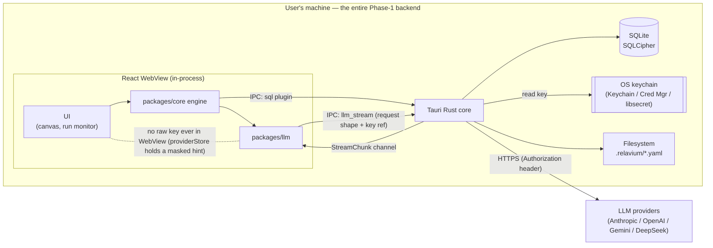

# Local-first architecture and security

> Last updated: 2026-06-03

Relavium is **local-first** in Phase 1: the product runs entirely on the user's
machine, with no account, no Relavium server, and no cloud dependency. The only
network traffic Relavium originates is the LLM API call, which goes **directly**
from the machine to the provider. API keys are stored in the OS keychain, never in
plaintext and never sent to the frontend. This document explains the data flow,
the secret-handling model, and the trust boundaries that make "privacy is a
feature" true. The concrete keychain mechanics are canonical in
[../reference/desktop/keychain-and-secrets.md](../reference/desktop/keychain-and-secrets.md).

The engine (`packages/core` + `packages/llm`) runs in the WebView on the desktop,
exactly as on every other surface. On the desktop, though, the adapters do **not**
make the network call themselves: the authenticated streaming HTTPS request is
**delegated to a Rust command** (`llm_stream`). The WebView hands Rust the request
shape and a key *reference*; Rust reads the actual key from the OS keychain, sets
the `Authorization` header, performs the request, and streams chunks back over a
channel. So the raw key value **never enters the WebView** — only the keychain
read and the egress live in Rust (see
[desktop-architecture.md](desktop-architecture.md) and the
[IPC contract](../reference/contracts/ipc-contract.md#rust-delegated-llm-egress)).
On the Node-style surfaces (CLI, VS Code extension host, Phase-2 Bun API) the same
adapters use a direct `fetch`/SDK transport inside their one trusted process, with
the key resolved at call time.

## Context

Local-first Phase 1 is a hard product constraint
([../product-constraints.md](../product-constraints.md)): "No cloud dependency. No
account required to use the product. Agents run on the user's machine, API calls
go directly to LLM providers. Privacy is a feature." The architecture must also
not bake in any assumption that prevents the Phase-2 cloud layer
([cloud-phase-2.md](cloud-phase-2.md)) from being added cleanly later.

## What stays on the machine

In Phase 1 the user's machine *is* the backend. Nothing leaves it except the LLM
API calls:

| Data | Where it lives | Notes |
|------|----------------|-------|
| Workflow definitions | `.relavium/*.relavium.yaml` on disk | git-committable; see [workflow-yaml-spec.md](../reference/contracts/workflow-yaml-spec.md) |
| Agent definitions | `*.agent.yaml` on disk | git-committable; see [agent-yaml-spec.md](../reference/contracts/agent-yaml-spec.md) |
| Run history, events, outputs | local SQLite — **CLI: unencrypted** (`0600`/`0700` owner-only perms + keychain; no credentials at rest); **desktop: SQLCipher** | DDL + at-rest posture in [database-schema.md](../reference/shared-core/database-schema.md); [ADR-0050](../decisions/0050-cli-history-db-at-rest-posture.md) |
| Cost records | local SQLite | per-node and per-run |
| API keys | OS keychain | never on disk in plaintext, never in the DB |
| Global config | `~/.relavium/` | global preferences, MCP registrations |
| Per-project config | `.relavium/` | committed to git (minus secrets); see [config-spec.md](../reference/contracts/config-spec.md) |

Run transcripts (the actual prompts and model outputs) never leave the machine.
This guarantee carries into Phase 2: even with cloud sync enabled, full LLM
transcripts are never uploaded.

## Secret handling

API keys are the most sensitive data in the system, and the design keeps them out
of every place they could leak. The mechanics — the keychain service/account
naming, the platform backends, and the headless/CI fallback — are canonical in
[../reference/desktop/keychain-and-secrets.md](../reference/desktop/keychain-and-secrets.md).
The architectural rules are:

1. **Keys live only in the OS keychain.** macOS Keychain (hardware-backed via the
   Secure Enclave on Apple Silicon), Windows Credential Manager, or libsecret on
   Linux. Never in SQLite, never in a config file, never in a workflow YAML.
2. **Keys are read at call time, by Rust, never by the WebView.** On the desktop,
   `packages/llm` invokes the Rust `llm_stream` command with a key *reference*;
   Rust reads the actual key from the OS keychain, sets the `Authorization` header,
   and uses it for that one HTTPS request. The raw key value is resolved inside
   Rust and is never serialized into checkpoints, run events, or log lines. (On the
   Node-style surfaces the key is likewise resolved at call time inside the one
   trusted process, never persisted or logged.)
3. **The WebView never holds a raw key.** Because the desktop egress is
   Rust-delegated, the raw key value never crosses into the WebView's JS runtime at
   all — `providerStore` holds only provider config and a masked hint, never the
   raw key — and the key is never persisted, checkpointed, or logged.
4. **Exported workflows are scrubbed.** When a workflow YAML is exported or
   committed, secret references are replaced with placeholder tokens so a key
   cannot leak through a shared `.relavium.yaml`.

## Trust model and boundaries

Local-first removes whole categories of cloud risk (there is no central database
to breach, no shared multi-tenant key store, no server-side auth to bypass), but
it introduces machine-local boundaries that still matter:

- **WebView ↔ Rust core.** The React WebView is treated as the least-trusted
  in-process component — it renders untrusted model output. Privileged operations
  (keychain access, filesystem writes, shell tool execution) happen in the Rust
  core behind explicit Tauri commands and capabilities, not in the WebView. See
  [desktop-architecture.md](desktop-architecture.md).
- **Filesystem scope.** Agent file operations are confined by a configurable scope
  (sandboxed to the workspace by default; expanded scopes require explicit user
  approval). This is enforced by Tauri's scoped FS plugin / capability system, not
  by ad-hoc path checks.
- **Shell tool execution.** Tools that run commands use an explicit per-workflow
  allowlist; unlisted commands are never executed. Built-in tools and their
  permission model are in
  [../reference/shared-core/built-in-tools.md](../reference/shared-core/built-in-tools.md).
- **Prompt injection.** Because agents act on untrusted content (web pages, files,
  PRs), system instructions and untrusted message content are kept separate, and
  any tool with side effects (e.g. committing code) can be gated behind a
  `human_gate` node.
- **Local IPC for VS Code.** When the VS Code extension connects to a running
  desktop app it does so over loopback (`127.0.0.1`) only, authenticated with a
  per-session bearer token stored with owner-only file permissions. The protocol
  is the [IPC contract](../reference/contracts/ipc-contract.md). Note that the
  VS Code extension does **not** proxy LLM calls through the desktop app — it makes
  them directly, so no key transits the IPC channel.

## Local-first first, cloud later — by design

The engine exposes one interface regardless of where it runs. Local execution is
the default and the only Phase-1 mode. The Phase-2 cloud layer wraps the same
engine and *adds* a server-side key store and HTTP transport for users who opt in;
it never replaces the local path, and it never silently falls back from cloud to
local (which could leak credentials or bypass enterprise controls). See
[cloud-phase-2.md](cloud-phase-2.md).

## Related documents

- [../reference/desktop/keychain-and-secrets.md](../reference/desktop/keychain-and-secrets.md) — canonical keychain mechanics.
- [desktop-architecture.md](desktop-architecture.md) — the WebView/Rust trust boundary.
- [overview.md](overview.md) — where local storage sits in the whole system.
- [../product-constraints.md](../product-constraints.md) — the local-first constraint.
