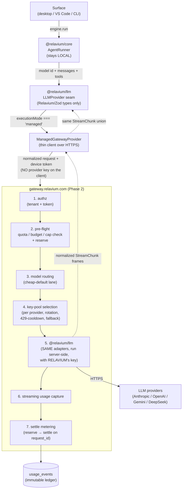

# Managed inference and the Relavium gateway (Phase 2)

> **Phase 2 — not shipped in Phase 1.** Everything in this document describes a
> planned **managed-inference** layer. None of it exists in the local-first
> Phase 1 product, where every LLM call goes directly from the user's machine to
> the provider on the user's own key. Managed inference is the **first Phase-2
> deliverable** (Option B in
> [../analysis/managed-inference-business-model-2026-06-03.md](../analysis/managed-inference-business-model-2026-06-03.md)),
> shipped **ahead of and decoupled from** the heavier cloud-execution plane in
> [cloud-phase-2.md](cloud-phase-2.md). Do not read any behavior here as
> currently available.

Managed inference adds a **third execution mode** in which Relavium holds the
provider API key and sells metered model usage by license tier. It is a new
`ManagedGatewayProvider` behind the **same immovable `LLMProvider` seam** — the
engine (`@relavium/core`) and the seam **types** do not change. This is the
clean validation of [ADR-0011](../decisions/0011-internal-llm-abstraction.md):
because nothing vendor-shaped crosses the seam, a wholly new implementation
(this time one that calls *across the network to a Relavium gateway* instead of
straight to a provider) slots in behind the same contract.

> Status: design — grounded in the dual-mode managed-inference decision. The
> seam types are the canonical property of
> [../reference/shared-core/llm-provider-seam.md](../reference/shared-core/llm-provider-seam.md)
> and are cited, not restated, here. The managed Postgres tables are canonical in
> [../reference/shared-core/database-schema.md](../reference/shared-core/database-schema.md);
> the gateway endpoints and tier model are canonical in
> [../reference/portal/api-reference.md](../reference/portal/api-reference.md).
> The decisions are recorded in
> [ADR-0012](../decisions/0012-managed-inference-dual-mode.md),
> [ADR-0013](../decisions/0013-managed-key-vault-and-pools.md),
> [ADR-0014](../decisions/0014-managed-metering-quota-and-billing.md), and
> [ADR-0015](../decisions/0015-managed-mode-data-handling-and-compliance.md).

## Context

Phase 1 is BYOK and local-first: the user supplies their own provider key, it
lives in the OS keychain, and `@relavium/llm` calls the provider **directly**
from the user's machine — no Relavium server is in the request path (see
[multi-llm-providers.md](multi-llm-providers.md) and
[local-first-and-security.md](local-first-and-security.md)). Managed inference
removes the per-user key-setup friction by putting **Relavium's** key in the
path and metering what each tenant consumes, monetized by license tier
([ADR-0012](../decisions/0012-managed-inference-dual-mode.md)). It is offered as
an **opt-in convenience mode** alongside — never replacing — BYOK, which stays the
only default and first-class as the heavy-user pressure valve, the enterprise
path, and the trust proof.

The architectural cost is deliberately small. The factory that selects an
`LLMProvider` implementation already keys off execution mode; managed inference
extends that mode set and adds one implementation behind the existing seam. The
**hard** parts are operational, not architectural: holding keys safely, metering
honestly, and not losing money to heavy users — covered below and in
[ADR-0013](../decisions/0013-managed-key-vault-and-pools.md),
[ADR-0014](../decisions/0014-managed-metering-quota-and-billing.md), and
[ADR-0015](../decisions/0015-managed-mode-data-handling-and-compliance.md).

## The three execution modes

`executionMode` extends from `'local' | 'cloud'` to
`'local' | 'cloud' | 'managed'`. The factory resolves an `LLMProvider`
implementation per mode; the engine and the seam types are identical across all
three.

| Mode | Whose key | Who calls the provider | Where the engine runs | Metered / billed | In docs before this |
|------|-----------|------------------------|------------------------|------------------|---------------------|
| `local` (BYOK) | user's, in the OS keychain | the user's machine | the user's machine | no | yes — Phase 1 |
| `cloud` (BYOK-cloud) | user's, in the server-side encrypted store | a cloud worker | a cloud worker | no | yes — Phase 2, [cloud-phase-2.md](cloud-phase-2.md) |
| **`managed`** (new) | **Relavium's, in the gateway key vault (KMS)** | **the Relavium gateway** | **the user's machine (engine stays local)** | **yes** | **no — this document** |

The crucial, non-obvious row is the last one: in `managed` mode the **engine
still runs locally**. Only the LLM egress is redirected from "direct to
provider" to "to the gateway, which calls the provider on Relavium's key." This
is what makes managed inference cheap to ship.

> **Canonical homes.** The `executionMode` enum and the whose-key-is-billed rule
> are defined by [ADR-0012](../decisions/0012-managed-inference-dual-mode.md); this
> document owns the **gateway mechanics**; per-mode secret handling is owned by
> [key-management.md](key-management.md).

## Managed inference is not cloud execution

These are two different planes and must not be conflated:

| | Managed **inference** (this doc) | Cloud **execution** ([cloud-phase-2.md](cloud-phase-2.md)) |
|---|---|---|
| What moves to the cloud | Only the **LLM egress** | The **whole engine run** |
| Where `@relavium/core` runs | The user's machine | A BullMQ-dispatched cloud worker |
| What the cloud component is | A **thin proxy gateway** (`gateway.relavium.com`) | A heavy execution plane (`apps/api` + Redis + workers) |
| Whose key | Relavium's | The user's (server-side encrypted store) |
| Enables | Zero-setup metered usage | 24/7 runs, webhooks, schedules, team runs |
| Phase-2 order | **First** Phase-2 deliverable | Later Phase-2 |

A user can be in `managed` mode (Relavium's key) while their workflow still
executes entirely on their own machine. Cloud execution (someone else's machine
runs the engine) is a separate, later step. The two compose — a cloud-executed
run could itself use managed inference — but neither requires the other, and
managed inference ships first precisely because it does **not** drag in the
execution plane.

## The gateway: control plane vs data plane

`gateway.relavium.com` is intentionally minimal: it terminates a managed request,
authorizes it, checks budget, picks a key, replays the request through the
**same** `@relavium/llm` adapters with Relavium's key, streams the response back,
and records what was used. It is a **data-plane proxy** — it is in the request
path for every managed token. It is deliberately *not* the portal.

- **Control plane** — `apps/api` + `apps/portal` (see
  [../reference/portal/api-reference.md](../reference/portal/api-reference.md)):
  identity, tier/subscription state, quota *policy*, usage dashboards, billing.
  It answers *who may spend how much*, and it owns the durable
  `quota_policies` / `subscriptions` records.
- **Data plane** — the gateway: authz → pre-flight quota/budget check (reads the
  policy, **reserves** against it) → model routing → key-pool selection →
  `@relavium/llm` call → streaming usage capture → metering **settle**. It
  answers *let this specific request through and record exactly what it cost*.

Keeping the gateway thin matters for latency (it sits in front of every token)
and for blast radius (the most dangerous secret — Relavium's provider keys —
lives behind one small, audited surface, not scattered through the execution
plane). The gateway reuses the same battle-tested adapters, tool normalization,
fallback, and cost logic the engine already uses locally — it does not
re-implement the provider layer.

## Key vault and key pools

The single most dangerous data in managed mode is **Relavium's own** provider
keys ([ADR-0013](../decisions/0013-managed-key-vault-and-pools.md)). They never
touch a client, a job payload, a checkpoint, or a log line — and unlike BYOK
they are never on the user's machine at all.

- **Key vault (KMS).** Provider keys are held in a KMS; the gateway requests a
  decryption/use operation per call rather than holding plaintext keys in
  application memory long-term. The database stores a **reference** to the vault
  entry (`provider_key_pool` rows point at a KMS key id), **never the key
  value** — the same "reference, not secret" discipline the local schema uses
  for the keychain (see
  [../reference/desktop/keychain-and-secrets.md](../reference/desktop/keychain-and-secrets.md)).
- **Key pools.** Each provider has a **pool of multiple keys**, not one, so a
  single org/account rate limit does not throttle all managed traffic. Pool
  behavior:
  - **Rotation** — keys rotate with zero downtime; a rotating key drains
    in-flight requests before retirement.
  - **429-cooldown** — a key that returns a rate-limit error is put on a
    short cooldown and skipped; the request is retried on the next key in the
    pool.
  - **Cross-provider fallback** — if a whole provider is saturated or down, the
    gateway can fall back to another provider for the same canonical model
    request, reusing the engine's existing fallback policy (see
    [multi-llm-providers.md](multi-llm-providers.md#fallback-chains)). In managed
    mode this fallback can run **gateway-side**, because the gateway holds keys
    for every provider in the pool.
  - **Segregation** — keys are segregated per provider (and, where relevant, per
    region) so an abuse incident that risks a key-ban is contained to one
    provider's pool rather than taking down all managed traffic.

## Streaming usage capture and reconciliation

Metering is only as honest as the token counts behind it, so the gateway must
capture usage from a **streamed** response — including when the stream is
interrupted. The capture rules extend the seam's existing usage normalization
(see
[../reference/shared-core/llm-provider-seam.md](../reference/shared-core/llm-provider-seam.md#6-usage));
the gateway adds three things on top:

- **Force usage emission.** For OpenAI and DeepSeek the gateway **forces**
  `stream_options: { include_usage: true }` on every managed request so a final
  usage chunk is emitted (the local default leaves this to caller config; managed
  cannot meter without it). For **Anthropic**, usage is accumulated from
  `message_start` (input tokens) and `message_delta` (running output tokens). For
  **Gemini**, usage is read from the `usageMetadata` on the final chunk.
- **Estimate on interruption.** If the client disconnects or the stream is
  aborted before a final usage frame arrives, the gateway **estimates** usage
  from the tokens actually streamed (output) plus the known request (input) and
  records the event as estimated, never silently dropping a billable request.
- **Nightly reconciliation.** A nightly job reconciles recorded `usage_events`
  against the providers' own usage/invoice data and corrects drift (estimated
  rows, rounding, provider-side adjustments). Reconciliation is what keeps
  `provider_cost` (COGS) accurate over time and lets disputed billed amounts be
  audited.

Each captured event records both the **provider cost** (Relavium's COGS, derived
from the canonical pricing table — `costMicrocents` stays *ours*, never read from a
provider field, exactly as on the seam) and the **billed cost** (what the tenant
is charged), so margin is observable per request.

## Metering, quota, and budgets: reserve → settle

Metering is **idempotent** and two-phase, keyed on a UNIQUE `request_id`
([ADR-0014](../decisions/0014-managed-metering-quota-and-billing.md)):

1. **Reserve** (pre-flight, before the provider call). The gateway checks the
   tenant's quota/budget policy and **reserves** an estimated cost against it.
   This is where the included-usage **hard cap** and the **per-user/day budget**
   are enforced — a request that would exceed the cap is rejected (or routed to
   overage/BYOK per policy) *before* any provider cost is incurred. Prepaid
   credits are debited here.
2. **Settle** (post-flight, on the captured usage). Once usage capture completes
   (or is estimated on interruption), the reservation is **settled** to the
   actual amount and written as one immutable `usage_event` row. The UNIQUE
   `request_id` makes a retried settle a no-op, so a network retry can never
   double-bill or double-count.

Because reservation precedes the provider call and is keyed on a unique id, a
runaway agent loop is bounded by the per-day budget (a `−$5,000` event becomes a
`−$150` event), and a duplicate delivery cannot inflate the ledger. Quota
enforcement is graduated — warn → throttle → hard-stop — with the policy living
in `quota_policies` (control plane) and the enforcement happening at reserve time
(data plane).

### Billing topology

Metering and money collection are deliberately separate concerns. A
**merchant-of-record (Paddle / Lemon Squeezy) is the legal seller-of-record**: it
owns the checkout, VAT/sales-tax calculation and remittance, and chargebacks.
Relavium's internal `usage_events` ledger only **meters** managed consumption; it
is the input that feeds invoicing through the MoR, not a payment processor itself.
A direct Stripe integration is an **alternative** billing rail — used only if
Relavium does not adopt an MoR — and is **never** layered in front of or behind
the MoR (no double rail). Which model the gateway bills against is fixed by
[ADR-0014](../decisions/0014-managed-metering-quota-and-billing.md).

## Abuse and fraud

Because managed traffic runs under **Relavium's** provider account, one abuser
can get Relavium's key banned, not just rack up cost. Controls
([ADR-0013](../decisions/0013-managed-key-vault-and-pools.md),
[ADR-0015](../decisions/0015-managed-mode-data-handling-and-compliance.md)):

- An acceptable-use policy plus content moderation on managed egress (a duty the
  providers impose on products built on their APIs).
- Per-account and per-day caps (the same budget machinery as above) so no single
  account can drain a key pool.
- Per-provider/region key segregation and a **kill switch** to quarantine a
  tenant or a key pool instantly.
- Multi-provider redundancy so a precautionary ban on one provider does not stop
  all managed traffic.

## Data handling: no prompt logging by default

Managed mode puts Relavium in the data path, so the privacy posture is explicit
([ADR-0015](../decisions/0015-managed-mode-data-handling-and-compliance.md)):
**the gateway meters token counts, not content.** Prompts and completions are
**not logged by default** — a `usage_event` stores token counts, the canonical
model id, cost figures, and the pool-key reference, but **not** the request or
response bodies. This is the managed-mode extension of the platform-wide
guarantee that full LLM transcripts are never stored server-side (see
[cloud-phase-2.md](cloud-phase-2.md) and
[../reference/portal/api-reference.md](../reference/portal/api-reference.md#sync-model-opt-in-metadata-only)).
The data plane is multi-tenant with Postgres row-level security on `org_id`
(see the managed tables in
[../reference/shared-core/database-schema.md](../reference/shared-core/database-schema.md#managed-inference-tables-phase-2));
providers become Relavium's sub-processors and are disclosed accordingly.

## Dual-mode coexistence: no silent mode crossing

Managed and BYOK coexist as first-class peers, and the mode boundary is hard:

- **Mode is resolved explicitly**, the same way local/cloud is resolved at engine
  creation (see [cloud-phase-2.md](cloud-phase-2.md#the-transparent-localcloud-switch)).
  A managed request never silently falls back to BYOK-local, and a BYOK request
  never silently routes through the gateway. Silent crossing would either bill a
  user who chose to pay their own provider, or send a privacy-mode user's egress
  through Relavium — both are unacceptable.
- **BYOK stays the pressure valve.** Heavy users and privacy-sensitive teams use
  BYOK; managed is the zero-setup convenience mode. The product is identical
  in both — same engine, same seam, same workflows — only the egress path and the
  billing differ.
- **Same seam, different implementation.** `local`/`cloud` use the direct
  provider adapters; `managed` uses `ManagedGatewayProvider`. All three satisfy
  the one `LLMProvider` contract, so `@relavium/core` cannot tell them apart and
  needs no branching.

## Related documents

- [../reference/shared-core/llm-provider-seam.md](../reference/shared-core/llm-provider-seam.md) — the canonical `LLMProvider` seam types (unchanged) and the usage-capture rules the gateway extends.
- [multi-llm-providers.md](multi-llm-providers.md) — the provider layer; the factory's per-mode selection and gateway-side fallback.
- [cloud-phase-2.md](cloud-phase-2.md) — the separate cloud-execution plane and the mode-resolution rules managed inference reuses.
- [../reference/shared-core/database-schema.md](../reference/shared-core/database-schema.md) — the canonical managed Postgres tables (`usage_events`, `quota_policies`, `subscriptions`, `provider_key_pool`, …).
- [../reference/portal/api-reference.md](../reference/portal/api-reference.md) — the gateway endpoints, the tier redesign, and the data-handling guarantee.
- [../analysis/managed-inference-business-model-2026-06-03.md](../analysis/managed-inference-business-model-2026-06-03.md) — the decision analysis (legality, unit economics, Option B).
- [ADR-0011](../decisions/0011-internal-llm-abstraction.md) — the seam this validates · [ADR-0012](../decisions/0012-managed-inference-dual-mode.md) · [ADR-0013](../decisions/0013-managed-key-vault-and-pools.md) · [ADR-0014](../decisions/0014-managed-metering-quota-and-billing.md) · [ADR-0015](../decisions/0015-managed-mode-data-handling-and-compliance.md).
