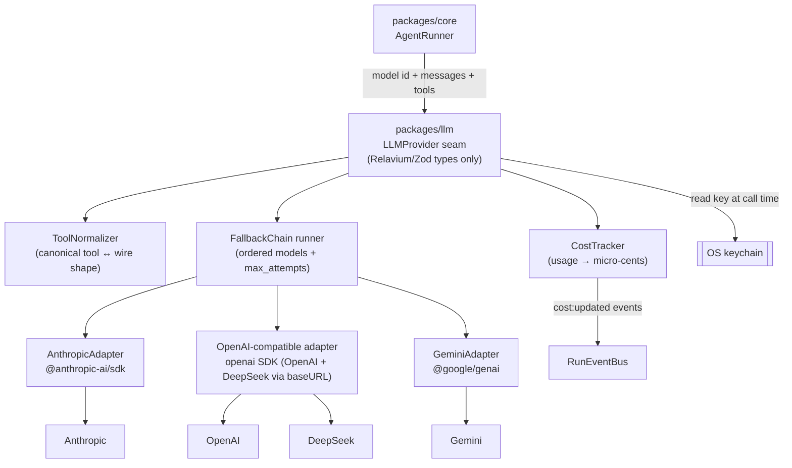
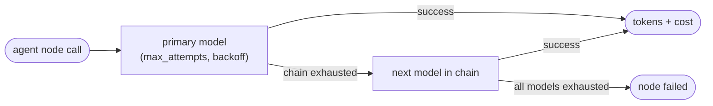

# Multi-LLM providers (`packages/llm`)

`packages/llm` (`@relavium/llm`) is the provider layer the engine calls whenever a
node needs a model. It is **Relavium's own, in-house abstraction** over each
provider's official TypeScript SDK — not a 3rd-party framework. It gives
`packages/core` a single, provider-agnostic interface for Anthropic, OpenAI,
Gemini, and DeepSeek: one streaming API, one tool-schema shape, fallback across
models, and cost accounting on every call. The engine never knows which provider
it is talking to — it asks for a model by id, streams normalized chunks, and gets a
cost record back.

The load-bearing idea is a single owned seam: an `LLMProvider` interface expressed
**only in Relavium/Zod types**. **No vendor SDK type — message shape, content
block, streaming event, tool-call representation, or usage field — ever crosses
that seam.** The seam is the immovable contract; the adapter implementation behind
it is deliberately reversible. This document explains how that abstraction is built
and why; the canonical home for the seam types is
[../reference/shared-core/llm-provider-seam.md](../reference/shared-core/llm-provider-seam.md),
and the model catalog and key mechanics are canonical in
[../reference/](../reference/).



> Status: design — the multi-LLM choice is the internal `@relavium/llm`
> abstraction per [ADR-0011](../decisions/0011-internal-llm-abstraction.md)
> (which supersedes the earlier Vercel AI SDK decision). The seam types, the
> per-provider adapters over the official SDKs, fallback chains, and cost tracking
> are grounded in that decision. Exact seam signatures are the canonical property
> of [../reference/shared-core/llm-provider-seam.md](../reference/shared-core/llm-provider-seam.md);
> the model-pricing catalog is canonical in
> [../reference/desktop/database-schema.md](../reference/desktop/database-schema.md).
> Both are cited, not restated, here.

## Context

The multi-LLM strategy is settled by
[ADR-0011](../decisions/0011-internal-llm-abstraction.md): Relavium builds its **own
provider-agnostic abstraction in TypeScript** rather than adopting a 3rd-party
framework. Thin hand-rolled adapters sit over each provider's official SDK, so there
is **no Python sidecar, no LiteLLM, and no multi-LLM framework** in the path. This
keeps the whole engine in one language (see
[shared-core-engine.md](shared-core-engine.md)) and one process — the LLM layer is
just another TypeScript package the engine imports. In Phase 1 the calls go
**directly** from the user's machine to the provider (see
[local-first-and-security.md](local-first-and-security.md)); there is no Relavium
server in the request path.

The provider set is small (four) and well documented, and three of the four
(OpenAI, DeepSeek, Gemini) are reachable over an OpenAI-compatible wire format. That
makes an owned abstraction realistic: the happy path per provider is small, and the
real cost is the *normalization tax* (tool schemas, streaming events, stop reasons,
usage fields) plus ongoing provider drift — a bounded cost we contain rather than
rent from a framework.

## The seam

`AgentRunner` (in `packages/core`) hands `packages/llm` a model id, a message list,
and a set of tools, and receives a normalized chunk stream plus a cost record.
Everything provider-specific is hidden behind the `LLMProvider` interface. In
outline (the canonical, full definition lives in
[../reference/shared-core/llm-provider-seam.md](../reference/shared-core/llm-provider-seam.md)):

- **`LLMRequest` in** — `{ model, messages, tools, temperature?, maxTokens?, ... }`,
  expressed entirely in Relavium types. The `system` prompt is a single top-level
  field; each adapter routes it to the right place (Anthropic top-level `system`,
  OpenAI/DeepSeek a prepended `system` message, Gemini `systemInstruction`).
- **A normalized chunk stream out** — a discriminated union, the same shape for
  every provider: `text` (delta) · `tool_call` (`{ id, name, argsDelta }`) ·
  `usage` (`{ input, output }`) · `finish` (`{ reason }`). Each adapter folds its
  native event stream into this one union.
- **A cost record** — computed by our own `CostTracker` from normalized usage and
  the model-pricing catalog, not taken from a provider field that may or may not
  exist.

The interface is intentionally narrow — `id` plus `stream(req, signal)` — and is the
only thing `packages/core` depends on. Provider selection is a factory keyed by the
agent's `provider` string (a plain string in the Zod schema, not a vendor enum).

## What the adapters abstract

Each adapter is a thin, ~200-line translation layer that turns one provider's wire
behavior into the seam's shape. The normalization is performed by **our adapters**,
not delegated to a framework:

- **Streaming** — each adapter folds its provider's native event stream into the one
  `text`/`tool_call`/`usage`/`finish` chunk union. Token chunks are re-emitted by
  `AgentRunner` on the engine's `RunEventBus` as `agent:token` events
  ([SSE event schema](../reference/contracts/sse-event-schema.md)), which drives the
  live token rendering on each canvas node face
  ([state-management.md](state-management.md)).
- **Tool schemas** — see [Tool normalization](#tool-normalization) below.
- **Auth** — the API key is fetched from the OS keychain at call time and attached by
  the adapter; it never enters the WebView, a checkpoint, or a log line
  ([keychain-and-secrets.md](../reference/desktop/keychain-and-secrets.md)).
- **Cancellation** — every call is guarded by an `AbortSignal` threaded through the
  seam. Because the adapters are just `fetch` + async iterators (via the official
  SDKs), cancellation works identically in a Node worker and inside the Tauri
  WebView's `fetch` — there is no Node-only or browser-only assumption across the
  seam (matching `packages/core`'s zero-platform-specific-imports rule).

The adapter inventory is three implementations, not four: a dedicated
**`AnthropicAdapter`** (`@anthropic-ai/sdk`), a dedicated **`GeminiAdapter`**
(`@google/genai`), and **one shared OpenAI-compatible adapter** (the `openai` SDK)
serving both OpenAI and DeepSeek — DeepSeek via a custom `baseURL`.

The set of supported models, their context windows, and their per-token pricing live
in the model catalog (canonical in
[../reference/desktop/database-schema.md](../reference/desktop/database-schema.md)
and surfaced to the UI via `providerStore`).

## Capabilities and the escape hatch

The seam exposes a **capability-gated lowest-common-denominator** interface: text +
tools + streaming + usage, which all four providers support uniformly. Provider-
specific features — Anthropic prompt caching and extended thinking, OpenAI tool-call
streaming deltas, Gemini safety settings, parallel tool calls, vision, reasoning
traces — are deliberately **out of the common path**. They are reachable only through
a typed `providerOptions` escape hatch on the request (and a `raw` passthrough on the
result for debugging). This keeps the common interface stable and prevents scope
creep into a "second product"; escape-hatch usage stays out of `packages/core` and is
confined to opt-in agent config.

## Tool normalization

The four providers describe tool/function calling differently — Anthropic uses
`input_schema`, OpenAI/DeepSeek use `function.parameters`, Gemini uses
`functionDeclarations` with a restricted OpenAPI-subset schema. A workflow author
should never have to care. The **`ToolNormalizer`** (in `packages/llm`, on the
Relavium side of the seam) takes the single canonical tool definition Relavium uses
(built-in tools and MCP tools alike — see
[../reference/shared-core/built-in-tools.md](../reference/shared-core/built-in-tools.md)
and [../reference/shared-core/mcp-integration.md](../reference/shared-core/mcp-integration.md))
and translates it into each provider's required shape on the way out, then normalizes
the provider's tool-call response back into one shape on the way in. (The engine-side
`ToolRegistry` and tool dispatch live in `packages/core`; the canonical-tool↔wire
translation lives here.) The result is that the same agent definition, with the same
tools, runs unchanged against any provider — which is also what makes fallback chains
across providers possible.

## Fallback chains

Fallback policy lives **outside the adapters**, in a small runner on the Relavium side
of the seam. Adapters stay dumb — they translate one provider and nothing else; the
chain is policy the engine controls. Each agent node declares an **ordered list of
models with per-model attempt budgets**, for example a primary Claude model, then
GPT, then Gemini. The canonical field shapes are defined in the
[agent YAML spec](../reference/contracts/agent-yaml-spec.md) — each entry carries a
`model`, a `provider`, and a `max_attempts`:

```yaml
fallback_chain:
  - { model: claude-sonnet-4-6, provider: anthropic, max_attempts: 3 }
  - { model: gpt-4o,            provider: openai,     max_attempts: 2 }
  - { model: gemini-2.5-pro,    provider: gemini,     max_attempts: 1 }
```

If the primary model errors or is rate-limited, the runner exhausts its
`max_attempts` (with backoff) on a classified-retryable error, then walks to the next
model in the chain — without user intervention and without failing the node. Per-
attempt usage is surfaced so cost accounting stays accurate even on failover. Because
tool schemas are normalized (above), switching providers mid-chain does not require
re-authoring the agent's tools. This is what keeps a production workflow running
through a single provider's outage, and it is one of Relavium's headline features. The
node-level retry budget sits *above* the fallback chain: the engine considers a node
failed only after the whole chain is exhausted (see
[shared-core-engine.md](shared-core-engine.md#retry-and-fallback)).



## Cost tracking

Every provider response carries token usage, which each adapter normalizes into the
seam's `usage` chunk. The **`CostTracker`** multiplies input/output token counts by
the model's per-token price (from the model catalog) and produces a cost figure per
call — cost is **our** computation from **our** pricing table keyed on the canonical
model id, never a number we trust a provider to return. Costs are accumulated and
emitted as `cost:updated` events during the run (payload `{ nodeId, model,
inputTokens, outputTokens, costUsd, cumulativeCostUsd }`) and persisted to SQLite at
the end ([execution-model.md](execution-model.md#6-finish)). Because cost is
attributed **per node and per model**, the run history can show a per-node cost
waterfall — the user sees exactly which agent (and which model) drove spend, and can
swap that one node to a cheaper model. To avoid losing precision, costs are stored as
integer **micro-cents** rather than floats (the SQLite type-mapping detail is in
[database-schema.md](../reference/desktop/database-schema.md)).

## Conformance and drift

Owning the abstraction means owning provider drift: every new model id, param,
streaming-event change, or usage-field shift is our ticket rather than a framework's.
The mechanism that contains that tax is a **per-provider conformance test suite** —
one shared spec run against every adapter (streams text, calls a tool, returns usage,
maps stop reasons, handles fallback). It runs against **recorded fixtures on every
PR** and against the **live provider APIs nightly in CI**. This converts most drift
from a production incident into a red CI run, which is the single biggest leverage
point for keeping the adapters honest. New modalities (vision, audio, files, reasoning
traces) are project-sized work gated behind capability flags, not routine
maintenance.

## Migration stance

The stance is **internal-first**. Relavium does not adopt a multi-LLM framework, and
explicitly **never the Vercel AI SDK**. Because nothing SDK-shaped crosses the seam,
the implementation behind it is reversible: a thin 3rd-party TS library may be slotted
behind the **same** `LLMProvider` seam **only on a named trigger** — sustained
provider-drift maintenance cost exceeding the framework's coupling cost, or a must-have
capability that is not economically hand-rollable. Such a trigger fires a follow-up
ADR; it never silently changes the seam. See
[ADR-0011](../decisions/0011-internal-llm-abstraction.md) for the full decision and
trigger policy.

## Local vs cloud

In Phase 1 `packages/llm` runs inside the surface process (Tauri WebView, VS Code
extension host, or Node CLI) and calls providers directly. In Phase 2 the **same
package** runs inside cloud workers; the only change is *where* the key comes from (an
encrypted server-side store instead of the OS keychain) and *where* the process runs.
The seam, the adapters, tool normalization, fallback, and cost logic are identical in
both modes — see [cloud-phase-2.md](cloud-phase-2.md).

## Related documents

- [../reference/shared-core/llm-provider-seam.md](../reference/shared-core/llm-provider-seam.md) — the canonical `LLMProvider` seam types.
- [shared-core-engine.md](shared-core-engine.md) — the engine that calls this layer.
- [execution-model.md](execution-model.md) — how token and cost events flow during a run.
- [../reference/shared-core/built-in-tools.md](../reference/shared-core/built-in-tools.md) · [../reference/shared-core/mcp-integration.md](../reference/shared-core/mcp-integration.md) — the tools the normalizer maps.
- [../reference/contracts/agent-yaml-spec.md](../reference/contracts/agent-yaml-spec.md) — where the fallback chain is declared.
- [ADR-0011](../decisions/0011-internal-llm-abstraction.md) — the internal `@relavium/llm` abstraction decision (supersedes the earlier Vercel AI SDK decision).
