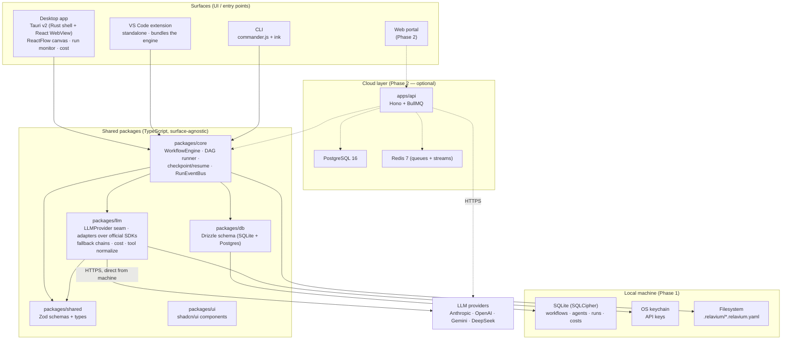
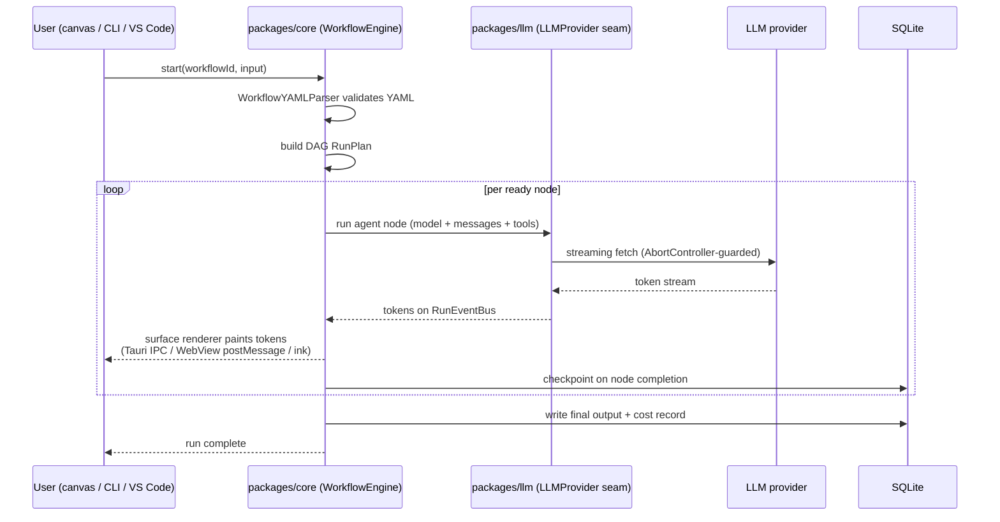

# Architecture overview

Relavium is a multi-surface, local-first AI agent workflow platform. Four
surfaces — a Tauri v2 **desktop app**, a **VS Code extension**, a **CLI**, and a
Phase-2 **web portal** — all drive the *same* pure-TypeScript execution engine
(`packages/core`) talking to the *same* multi-LLM provider layer
(`packages/llm`). Workflows and agents are git-committable YAML files; in Phase 1
everything runs on the user's machine with no account, no server, and no cloud
dependency. This document is the system map every other `docs/architecture/`
document elaborates one piece of.

## Context

The shape of Relavium is fixed by a small set of decisions, recorded as ADRs and
summarized in [../tech-stack.md](../tech-stack.md):

- The desktop app is **Tauri v2**, not Electron — see
  [ADR-0001](../decisions/0001-tauri-v2-over-electron.md). It is an agent
  *management* center, not an IDE (see
  [../product-constraints.md](../product-constraints.md)).
- All frontends are **Vite + React 19 + TanStack Router**, not Next.js, because
  SSE streaming and the ReactFlow canvas are incompatible with RSC/edge runtime.
- The workflow engine is a **pure-TypeScript** package (`packages/core`), not a
  Python/LangGraph service and not a Hono/Next.js executor.
- Multi-LLM access goes through Relavium's own **`@relavium/llm`** abstraction in
  `packages/llm` — thin hand-rolled adapters over each provider's official TS SDK
  behind one owned, provider-agnostic seam, with no 3rd-party framework.
- Local data is **SQLite + Drizzle**; API keys live in the **OS keychain**.

These constraints leave a clear structure: one shared engine, several thin
surfaces, local-first storage, and a Phase-2 cloud layer that wraps — never
replaces — the engine.

## The four surfaces

Each surface is a thin client over the shared engine. None of them re-implements
execution logic; a bug in any surface is treated as a bug in `packages/core`.

| Surface | Shell | How it runs the engine | Role |
|---------|-------|------------------------|------|
| **Desktop app** | Tauri v2 (Rust + React WebView) | Engine runs in-process; results stream to the canvas over Tauri IPC | Primary surface — visual canvas, agent config, run monitoring, cost tracking. See [desktop-architecture.md](desktop-architecture.md). |
| **VS Code extension** | VS Code Extension Host (Node) | Engine bundled in-process; no desktop app required | Inline triggering (right-click a file → run), status-bar monitor, sidebar panels. |
| **CLI** | Node + commander.js + ink | Engine called directly; ink renders the live TUI | `relavium run` / `list` / `create` / `logs` / `gate`; CI/CD and scripting. Doubles as the canonical engine integration-test harness. |
| **Web portal** | Vite + React SPA (browser) | **Phase 2 only** — talks to `apps/api` over HTTPS; engine runs in cloud workers | Usage, quota, team sharing, cloud-triggered runs. Not where local workflows run. |

## The shared packages

The monorepo (Turborepo + pnpm) centers on a few surface-agnostic packages —
canonical definitions and per-package purpose are in
[../project-structure.md](../project-structure.md):

- **`packages/core`** — the single most important package. It parses workflow
  YAML, builds the DAG run plan, executes nodes (including the
  orchestrator-as-node), checkpoints state, and emits run events on a
  `RunEventBus`. It has **zero platform-specific imports**, so it runs identically
  in the Tauri WebView, the VS Code extension host, the Node CLI, and a Bun cloud
  worker. See [shared-core-engine.md](shared-core-engine.md).
- **`packages/llm`** — Relavium's own provider abstraction: a provider-agnostic
  `LLMProvider` seam implemented by thin adapters over each provider's official TS
  SDK (Anthropic and Gemini dedicated; OpenAI and DeepSeek share one
  OpenAI-compatible adapter), giving unified streaming for Anthropic / OpenAI /
  Gemini / DeepSeek plus fallback chains, tool-schema normalization, and cost
  accounting — no 3rd-party framework, and no vendor type crosses the seam. See
  [multi-llm-providers.md](multi-llm-providers.md).
- **`packages/shared`** — the Zod schemas and TypeScript types every package
  imports (workflow, agent, run, node, edge, run-event, cost-event). The schema
  shapes are documented under [../reference/contracts/](../reference/contracts/).
- **`packages/db`** — Drizzle schema and migrations, with one set of table
  definitions that targets SQLite locally and Postgres in the cloud. See
  [../reference/desktop/database-schema.md](../reference/desktop/database-schema.md).
- **`packages/ui`** — the shared shadcn/ui component library.

## Local data (Phase 1)

In Phase 1 the user's machine is the entire backend:

- **SQLite** (via `tauri-plugin-sql`, with SQLCipher) stores workflows, agents,
  run history, run events, and cost records. DDL lives in
  [../reference/desktop/database-schema.md](../reference/desktop/database-schema.md).
- **OS keychain** (macOS Keychain / Windows Credential Manager / libsecret)
  stores provider API keys. They are never written to disk in plaintext and never
  sent to the frontend. See
  [local-first-and-security.md](local-first-and-security.md) and
  [../reference/desktop/keychain-and-secrets.md](../reference/desktop/keychain-and-secrets.md).
- **The filesystem** holds the git-committable `.relavium/*.relavium.yaml`
  workflow files and `*.agent.yaml` agent files — the
  [workflow-yaml-spec.md](../reference/contracts/workflow-yaml-spec.md) and
  [agent-yaml-spec.md](../reference/contracts/agent-yaml-spec.md) define them.

## End-to-end data flow

A run follows the same path no matter which surface starts it (sourced from the
synthesis `dataFlow` trace):

Key points:

- Surfaces subscribe to the engine's `RunEventBus` and render events the same way;
  the event contract is the [SSE event schema](../reference/contracts/sse-event-schema.md)
  (delivered over Tauri IPC locally, over HTTP SSE in the cloud).
- LLM calls go **directly** from the user's machine to the provider in Phase 1 —
  there is no Relavium server in the path.
- State is checkpointed to SQLite at each node boundary, which is what makes
  resume-after-crash and retry-from-node possible. See
  [execution-model.md](execution-model.md).

## The Phase-2 cloud layer (preview)

> Phase 2 is **not shipped in Phase 1**. It is included here only to show that the
> architecture is designed for it.

Phase 2 adds `apps/api` (Hono on Bun) and `apps/portal` without replacing the
local surfaces. The same `packages/core` engine is invoked through BullMQ jobs on
Redis instead of direct function calls, state moves to PostgreSQL, and run events
stream over HTTP SSE via Redis Streams. A user can link a cloud account and choose
*per workflow* whether to run locally or in the cloud — the engine exposes an
identical interface in both modes. Details and the transparent switch are in
[cloud-phase-2.md](cloud-phase-2.md).

## Where to go next

- [shared-core-engine.md](shared-core-engine.md) — the engine internals.
- [execution-model.md](execution-model.md) — how one run executes locally.
- [local-first-and-security.md](local-first-and-security.md) — the trust model.
- [../project-structure.md](../project-structure.md) — the full monorepo layout.
