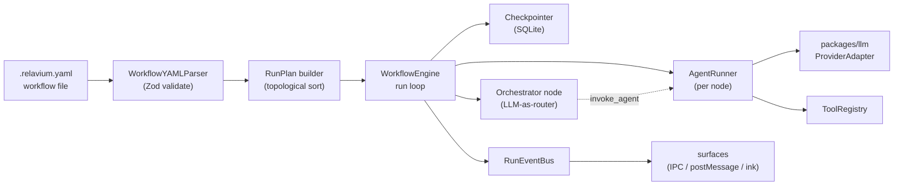

# Shared core engine (`packages/core`)

`packages/core` is the pure-TypeScript execution engine that every surface drives.
It parses a workflow YAML file, compiles it into a directed acyclic graph (DAG),
runs the nodes in dependency order, streams events as it goes, and checkpoints
state so a run can be resumed or retried. It has **zero platform-specific
imports**, which is the property that lets the desktop app, the VS Code extension,
the CLI, and (Phase 2) a cloud worker all behave identically. This document
explains how the engine is structured and why; the concrete contracts it consumes
and emits live in [../reference/](../reference/).

> Status: this document describes the engine design from the synthesis and
> master-plan sources. Implementation-level interface signatures are the
> canonical property of [../reference/](../reference/); see the cross-links below.

## Context

The engine choice is settled by [../tech-stack.md](../tech-stack.md): a
**pure-TypeScript** engine, **not** a Python/LangGraph service and **not** a
Next.js/Hono request handler acting as an executor. The adversarial review behind
that decision found two things: (1) a long-running agent run (minutes to tens of
minutes) does not fit a serverless/HTTP request lifecycle, and (2) LangGraph adds
more failure surface than it removes for this workload — a plain topological
plan plus a dispatch table covers the great majority of cases, with durable
execution deferred to Phase 2. The result is one library that any host process
can call directly.

The build order reflects how central this package is: `packages/shared` +
`packages/llm` + `packages/core` are built first, then the CLI proves the engine
end-to-end before any UI is added (see
[../project-structure.md](../project-structure.md)).

## What the engine exports

`packages/core` exposes a small, surface-agnostic API surface — summarized here as
its canonical home (every surface binds to `WorkflowEngine.start` / `resume` /
`cancel`). The artifact contracts it consumes and produces live in
[../reference/contracts/](../reference/contracts/): the
[workflow YAML spec](../reference/contracts/workflow-yaml-spec.md), the
[run-event schema](../reference/contracts/sse-event-schema.md), and the
[IPC contract](../reference/contracts/ipc-contract.md).

- **`WorkflowEngine`** — `start(workflowId, input)` / resume / cancel. Parses the
  workflow, builds the run plan, executes nodes, and owns checkpointing.
- **`WorkflowYAMLParser`** — parses and validates a `.relavium.yaml` file against
  the Zod schema from `packages/shared`. The accepted shape is the
  [workflow YAML spec](../reference/contracts/workflow-yaml-spec.md).
- **`AgentRunner`** — executes a single agent node: assembles the prompt, calls
  the provider via `packages/llm`, handles tool calls, and applies retry/fallback.
- **`ToolRegistry`** — the engine-side registry and dispatcher for built-in and MCP
  tools. (The canonical-tool ↔ provider-wire reshape is the **`ToolNormalizer`**, which
  lives in `packages/llm` behind the seam, not in the engine — see
  [multi-llm-providers.md](multi-llm-providers.md) and
  [../standards/architectural-principles.md](../standards/architectural-principles.md).) See
  [../reference/shared-core/built-in-tools.md](../reference/shared-core/built-in-tools.md)
  and [../reference/shared-core/mcp-integration.md](../reference/shared-core/mcp-integration.md).
- **`RunEventBus`** — an `EventEmitter` that carries the typed run events
  surfaces subscribe to. The event contract is the
  [SSE event schema](../reference/contracts/sse-event-schema.md).

## YAML → DAG compilation

A run begins by turning a declarative workflow file into an executable plan:

1. **Parse + validate.** `WorkflowYAMLParser` loads the file and validates it with
   the Zod `WorkflowSchema`. Validation failures are surfaced before any LLM call
   is made — this is also what powers the VS Code language-server diagnostics.
2. **Build the DAG.** Nodes declare dependencies (`dependsOn` / edges). The
   builder resolves them into a DAG and computes a topological order
   (Kahn's algorithm). Cycles are a hard error.
3. **Build the RunPlan.** The plan records, for each node, its inputs (resolved
   from `{{ node.output }}` interpolation against upstream results), its type, and
   its retry/fallback config.

The node-type catalog the DAG is built from is canonical in
[../reference/shared-core/node-types.md](../reference/shared-core/node-types.md),
which reconciles the authored YAML `type`s, the canvas components, and the engine
enum (this doc does not re-enumerate them). Note that `loop` and `subworkflow`
are **reserved (forward-compat; not executable/authorable in v1.0)** — they exist
in the engine enum as forward-compat slots but have no v1.0 YAML `type` and no
Phase-1 engine handler.

## The run loop

The `WorkflowEngine` walks the plan, dispatching every node whose dependencies are
satisfied. Independent branches run concurrently; the engine fans out parallel
nodes and joins them at aggregator/merge points. Each node type maps to a handler:

- **Agent nodes** delegate to `AgentRunner`, which streams from `packages/llm`.
- **Condition nodes** evaluate their expression and select the live branch.
- **FanOut / Aggregator** spread one input across N branches and merge the results
  (with strategies such as all-required / first-wins / quorum).
- **HumanGate** suspends the run and waits for an external decision (below).
- **Tool / Input / Output** run built-in tools and bind workflow I/O.

How a single run progresses node-by-node — including streaming and the human gate
— is covered in [execution-model.md](execution-model.md).

## The orchestrator-as-node concept

Relavium supports two complementary control styles in the *same* engine:

- **Static DAG** — the author wires nodes explicitly. Execution order is fixed by
  the edges. This is the default and is fully deterministic.
- **Orchestrator node** — a special agent node that acts as an LLM-driven router.
  Instead of (or alongside) static edges, it decides at runtime which agent to
  invoke next, using an `invoke_agent` tool to dispatch sub-tasks dynamically.
  Agents are registered to the orchestrator as tools (each with a structured
  "use this agent when / do NOT use for" description) so the model can pick the
  right one.

The reconciled design is **hybrid**: a static topological pre-plan handles the
linear and unconditional-parallel spine of a workflow, and dynamic LLM
re-evaluation happens only at conditional, fan-out, and human-gate boundaries.
This keeps most of a run cheap and deterministic while still allowing dynamic
delegation where it adds value. The orchestrator's prompt structure, agent-as-tool
schema, and selection rules are reference material;
the engine treats the orchestrator as just another node type that happens to emit
`invoke_agent` tool calls.

## Checkpoint and resume

State is persisted at every node boundary, not just at the end of a run. After
each node completes, the engine writes a checkpoint capturing run status, per-node
states, completed/pending node IDs, and (for an orchestrator) its message history.
This is what enables:

- **Resume after crash** — on startup the host reconciles in-flight runs from the
  last checkpoint instead of losing them.
- **Retry-from-node** — a user can re-run from any node without replaying the
  whole workflow.
- **Idempotency** — re-executing a node uses a stable idempotency key derived from
  `runId + nodeId + retryCount`, so a retry never double-applies side effects.

In Phase 1 checkpoints land in local SQLite (schema in
[../reference/desktop/database-schema.md](../reference/desktop/database-schema.md)).
The same checkpoint shape is what the Phase-2 cloud layer uses for durable
execution — see [cloud-phase-2.md](cloud-phase-2.md).

## Retry and fallback

Reliability is layered:

- **Node-level retry** — each node carries a retry budget; on a transient failure
  the engine retries with backoff, optionally adjusting inputs, and never silently
  skips a failed required node.
- **Provider fallback chains** — an agent can declare an ordered list of models
  (e.g. a primary Claude model, then GPT, then Gemini). If the primary provider
  errors or is rate-limited, `packages/llm` walks the chain. The fallback
  mechanism and cost accounting live in
  [multi-llm-providers.md](multi-llm-providers.md).

Known failure modes (infinite retry, wrong-agent selection, context overflow,
parallel deadlock, human-gate starvation) and their mitigations are catalogued in
the analysis sources and should be treated as a checklist when extending the
engine.

## Why one engine, shared by all surfaces

The single biggest correctness lever is that there is exactly **one** engine
package. The risk it guards against — surface drift, where the CLI behaves
differently from the desktop app, or VS Code runs a stale engine — is mitigated by:
zero platform-specific imports in `packages/core`, a single pinned version
imported by every surface, Turborepo rebuilds when core changes, and integration
tests that exercise core directly (not through any UI). Any surface-specific
workaround is a bug in core, not a surface patch.

## Related documents

- [execution-model.md](execution-model.md) — the run lifecycle in detail.
- [multi-llm-providers.md](multi-llm-providers.md) — the provider layer the runner calls.
- [../reference/contracts/workflow-yaml-spec.md](../reference/contracts/workflow-yaml-spec.md) — the input format.
- [../reference/contracts/sse-event-schema.md](../reference/contracts/sse-event-schema.md) — the event contract.
- [../reference/shared-core/node-types.md](../reference/shared-core/node-types.md) — the node catalog.
