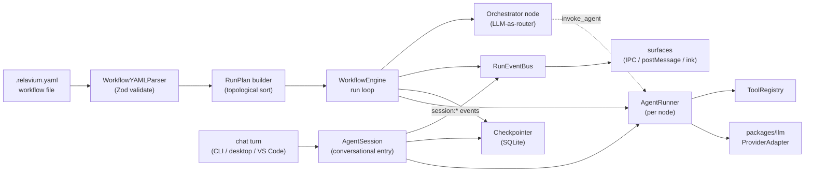

# Shared core engine (`packages/core`)

`packages/core` is the pure-TypeScript execution engine that every surface drives.
It parses a workflow YAML file, compiles it into a directed acyclic graph (DAG),
runs the nodes in dependency order, streams events as it goes, and checkpoints
state so a run can be resumed or retried. It has **zero platform-specific
imports**, which is the property that lets the desktop app, the VS Code extension,
the CLI, and (Phase 2) a cloud worker all behave identically. This document
explains how the engine is structured and why; the concrete contracts it consumes
and emits live in [../reference/](../reference/).

```mermaid
flowchart LR
    YAML[".relavium.yaml<br/>workflow file"] --> Parser["WorkflowYAMLParser<br/>(Zod validate)"]
    Parser --> Plan["RunPlan builder<br/>(topological sort)"]
    Plan --> Runner["WorkflowEngine<br/>run loop"]
    Chat["chat turn<br/>(CLI / desktop / VS Code)"] --> Session["AgentSession<br/>(conversational entry)"]
    Runner --> AR["AgentRunner<br/>(per node)"]
    Session --> AR
    AR --> LLM["packages/llm<br/>ProviderAdapter"]
    AR --> Tools["ToolRegistry"]
    Runner --> CP["Checkpointer<br/>(SQLite)"]
    Session --> CP
    Runner --> Bus["RunEventBus"]
    Session -->|session:* events| Bus
    Bus --> Surfaces["surfaces<br/>(IPC / postMessage / ink)"]
    Orchestrator["Orchestrator node<br/>(LLM-as-router)"] -.->|invoke_agent| AR
    Runner --> Orchestrator
```

> Status: this document describes the engine design from the synthesis and
> master-plan sources. Implementation-level interface signatures are the
> canonical property of [../reference/](../reference/); see the cross-links below.

## Context

The engine choice is settled by [../tech-stack.md](../tech-stack.md): a
**pure-TypeScript** engine, **not** a Python/LangGraph service and **not** a
Next.js/Hono request handler acting as an executor. The adversarial review behind
that decision found two things: (1) a long-running agent run (minutes to tens of
minutes) does not fit a serverless/HTTP request lifecycle, and (2) LangGraph adds
more failure surface than it removes for this workload — a plain topological
plan plus a dispatch table covers the great majority of cases, with durable
execution deferred to Phase 2. The result is one library that any host process
can call directly.

The build order reflects how central this package is: `packages/shared` +
`packages/llm` + `packages/core` are built first, then the CLI proves the engine
end-to-end before any UI is added (see
[../project-structure.md](../project-structure.md)).

## What the engine exports

`packages/core` exposes a small, surface-agnostic API surface — summarized here as
its canonical home. It has **two** entry points: every surface binds either to
`WorkflowEngine.start` / `resume` / `cancel` (the DAG runner) or to
`AgentSession.start` / `resume` / `cancel` (the conversational entry point). Both
drive the *same* substrate — see [Why one engine, shared by all surfaces](#why-one-engine-shared-by-all-surfaces).
The artifact contracts it consumes and produces live in
[../reference/contracts/](../reference/contracts/): the
[workflow YAML spec](../reference/contracts/workflow-yaml-spec.md), the
[run-event schema](../reference/contracts/sse-event-schema.md), the
[IPC contract](../reference/contracts/ipc-contract.md), and the
[AgentSession spec](../reference/contracts/agent-session-spec.md).

- **`WorkflowEngine`** — `start(workflowId, input)` / resume / cancel. Parses the
  workflow, builds the run plan, executes nodes, and owns checkpointing.
- **`AgentSession`** — the second, co-equal entry point: `start` / `resume` /
  `cancel` for a multi-turn conversation. It wraps the same `AgentRunner` and reuses
  `ToolRegistry`, the `packages/llm` seam, and `RunEventBus` (on a separate
  `session:*` namespace), auto-persisting to `history.db` and resumable from it. Its
  runtime contract — including `SessionMessage` and the one-way export-to-workflow
  scaffold — is canonical in the
  [AgentSession spec](../reference/contracts/agent-session-spec.md) (see also
  [ADR-0024](../decisions/0024-agent-first-entry-point-agentsession.md)).
- **`WorkflowYAMLParser`** — parses and validates a `.relavium.yaml` file against
  the Zod schema from `packages/shared`. The accepted shape is the
  [workflow YAML spec](../reference/contracts/workflow-yaml-spec.md).
- **`AgentRunner`** — executes a single agent node: assembles the prompt, calls
  the provider via `packages/llm`, handles tool calls, and applies retry/fallback.
- **`ToolRegistry`** — the engine-side registry and dispatcher for built-in and MCP
  tools. (The canonical-tool ↔ provider-wire reshape is the **`ToolNormalizer`**, which
  lives in `packages/llm` behind the seam, not in the engine — see
  [multi-llm-providers.md](multi-llm-providers.md) and
  [../standards/architectural-principles.md](../standards/architectural-principles.md).) See
  [../reference/shared-core/built-in-tools.md](../reference/shared-core/built-in-tools.md)
  and [../reference/shared-core/mcp-integration.md](../reference/shared-core/mcp-integration.md).
- **`RunEventBus`** — an in-house, **platform-free** typed event bus (pub/sub) over the `RunEvent`
  union that surfaces subscribe to. It is built in `packages/core`, **not** Node's `node:events` (the
  engine has zero platform imports — [ADR-0036](../decisions/0036-run-loop-substrate-event-bus-and-execution-host.md)).
  The event contract is the [SSE event schema](../reference/contracts/sse-event-schema.md).

## YAML → DAG compilation

A run begins by turning a declarative workflow file into an executable plan:

1. **Parse + validate.** `WorkflowYAMLParser` loads the file and validates it with
   the Zod `WorkflowSchema`. Validation failures are surfaced before any LLM call
   is made — this is also what powers the VS Code language-server diagnostics.
2. **Build the DAG.** Nodes declare dependencies (`dependsOn` / edges). The
   builder resolves them into a DAG and computes a topological order
   (Kahn's algorithm). Cycles are a hard error.
3. **Build the RunPlan.** The plan records, for each node, its inputs (resolved
   from `{{ node.output }}` interpolation against upstream results), its type, and
   its retry/fallback config.

The node-type catalog the DAG is built from is canonical in
[../reference/shared-core/node-types.md](../reference/shared-core/node-types.md),
which reconciles the authored YAML `type`s, the canvas components, and the engine
enum (this doc does not re-enumerate them). Note that `loop` and `subworkflow`
are **reserved (forward-compat; not executable/authorable in v1.0)** — they exist
in the engine enum as forward-compat slots but have no v1.0 YAML `type` and no
Phase-1 engine handler.

## The run loop

The `WorkflowEngine` walks the plan, dispatching every node whose dependencies are
satisfied. Independent branches run concurrently; the engine fans out parallel
nodes and joins them at aggregator/merge points. Each node type maps to a handler:

- **Agent nodes** delegate to `AgentRunner`, which streams from `packages/llm`.
- **Condition nodes** evaluate their expression and select the live branch.
- **FanOut / Aggregator** spread one input across N branches and merge the results
  (with strategies such as all-required / first-wins / quorum).
- **HumanGate** suspends the run and waits for an external decision (below).
- **Tool / Input / Output** run built-in tools and bind workflow I/O.

How a single run progresses node-by-node — including streaming and the human gate
— is covered in [execution-model.md](execution-model.md).

### Internal departure foundations (ADR-0103)

The first internal increment of
[ADR-0103](../decisions/0103-a-paused-run-hands-off-its-local-producers-before-its-host-closes.md)
adds primary-delivery observation and a platform-free host-work lifetime registry. The subsequent
scoped integration registers exact raw executor and prepared-executor promises, entered host
operations and structured receipt children. `RunHandle.depart()`, complete actor retirement,
original parked-node clocks, final receipt disposition and CLI host-close acknowledgement remain
unimplemented; this receipt increment is not a host-safe departure certificate.

Each run handle's existing primary queue privately counts actual publications before offering them
to a waiting pull or buffer. Delivery advances synchronously only when a buffered pull or waiting
handoff returns an event. Internal construction wiring supplies a read-only snapshot reader; passive
subscribers, empty `next()` calls, closure and iterator return cannot acknowledge delivery. Queue
refusal is a sticky gap, and early consumer return is a distinct sticky abandonment observation.
Draining the remaining buffer clears neither condition. Counts cover only this execution's actual
publications, including when durable sequence numbering starts above zero. This observation adds
no replay, replacement spool or public acknowledgement, and does not repair the existing
[never-pulled overflow defect](../decisions/0087-consumed-streams-size-bounds-and-run-retention.md).

The internal `HostWorkRegistry` registers an invocation before calling its factory and observes the
exact raw returned Promise, separately from any abort/grace race. Settlement or a synchronous throw
ends that scope's future-entry authority when observed by the registry; already entered operations and independently registered
children remain joined. An ended scope refuses entry or child transfer through the nondurable
`EngineStateError` code `receipt_scope_ended`. The scope itself grants no host capabilities.
Joining waits for actual completion notifications and rechecks quiescence; idle work resolves
immediately, while a never-settling raw invocation or child intentionally keeps the join pending.
Joining does not seal new root admission, certify persistence or delay terminal publication.

Fresh run startup also registers its complete continuation before workflow-id lookup, initial
ownership acquisition or context resolution. A terminal can remain visible while that work is
pending; retirement keeps an already held exact fence and its heartbeat until the root finishes.
An acquisition entered before cancellation still owes release of its returned exact fence.
After each startup await, a stopped execution refuses fresh start publication, acquisition,
context entry or scheduling. Synchronous initial clock and timer callbacks are also cancellation
boundaries: startup rechecks before its next entry, and timeout setup disposes a disarm receipt
returned after cancellation rather than installing a timer after the terminal sweep.
A noncooperative context read can finish, but cancellation is
checked before another filter or resolved-text delivery, including a second `read_file` in
the same reference. This covers fresh startup, not the still-open pre-handle resume and
complete scheduler/timer actor integration.

The scheduler's node-boundary consumer readiness has a separately registered raw lifetime.
Only its wait is raced against execution abort, so cancellation can progress while an
uncooperative readiness Promise still retains host retirement. A claimed vertex that has
not entered `node:started` returns to pending when the scheduler leaves that batch; it
must not masquerade as an in-flight executor and force the run to wait for grace. A live
readiness fault uses a fixed internal error. Method acquisition is followed by another
stopped-state check before invocation; a live call preserves the handle as its receiver.
Controlled public-port tests establish these
mechanics; complete scheduler/dispatch roots and public departure are still open.

Settlement observation uses the captured native Promise intrinsic rather than a caller-overridden
`then`. A constructor/species failure while attaching that observer is not settlement: the exact raw
Promise and its slot/authority remain retained, with a sticky content-free `observationFailed`
diagnosis. Without a trustworthy settlement observation, the registry cannot certify host release
even if another observer later sees that Promise finish; graceful joining remains pending. An
operation factory's synchronous throw still ends its scope through the ordinary rejection path.
The boundary is observable native settlement, not synchronous introspection of Promise state:
an earlier attached reaction may enter work before the registry's completion reaction, and that
entered work remains joined. This cannot detect dishonest untransferred background intent.

`WorkflowEngine` supplies `NodeExecContext.continueReceipt()` for each executor dispatch. The field
is optional in the TypeScript interface for standalone context implementations and test doubles;
an engine dispatch always supplies it. Register before invoking a child. Its `NodeReceiptContext`
has only money record/join, effect settle/discard, quiet cost updates and further receipt-child
registration. It grants no provider/key access, prepare, admission, media operation or ordinary
event publication. Raw or child settlement ends that scope's future entry; already entered
operations and independently transferred children remain joined. There is no implicit transfer
for fire-and-forget work. Shipping transitive provider, iterator and media-poll lifetimes still
require subsequent complete producer integration.

After a terminal acknowledgement, the execution retains its exact fence and heartbeat while
registered raw/child work, entered host operations or receipt writes remain. Once these are quiet,
retirement revokes future entry, disarms the heartbeat, joins exact lease release and notifies the
engine's existing settled-retention policy. This does not wait for raw settlement before publishing
the bounded terminal. Ordinary
post-terminal publication stays refused; permitted late incurred ledger appends use the same
ordered writer, whose acknowledgement rules live in [execution-model.md](execution-model.md#5-checkpoint-each-node-boundary).
An ended scope cannot reacquire ownership lost to a successor, including after that successor
releases its own lease. A native synchronous retention callback is observed synchronously;
Promise-returning work stays joined to its real completion.

This increment does not close the paused-finalization lifecycle finding. Integration still owes
all accepted actors and transitive producers, the final pause/cursor claim, final money/effect
disposition, parked-node timing and CLI input-release/primary-reader/host-close acceptance.
Primary observation still grants no public departure API. Session lifecycle remains unchanged.

## Inbound MCP connection lifecycle

The engine consumes external MCP servers' tools, but it never owns the connection — the
**host** does (the CLI/VS Code Node process, or the desktop Rust backend), so `packages/core`
stays platform-pure and never imports the SDK or `node:child_process`
([ADR-0052](../decisions/0052-inbound-mcp-client-package-lifecycle-registration.md) §1).
The lifecycle, as shipped in 2.R:

- **Connect (host, at session/run start).** The host resolves each declared server, then
  connects them **concurrently** and **fail-loud** (a failed spawn or `tools/list` fails the
  whole start — never a silent capability loss; a partial connect tears down everything
  opened). It namespaces the discovered tools as `mcp_{server}_{tool}`, narrows by any
  `tools_allowlist`, fails a post-namespace collision closed, and hands the engine the
  assembled `ToolDef`s + an `McpCapability` it routes through.
- **Keep-alive (for the session/run duration).** Connections stay open; the engine routes
  each tool call through `host.mcp.call`. There is **no cross-invocation pool or tool-list
  cache yet** (each process re-runs discovery on connect) and the registration `autostart`
  field is **reserved, not acted on** — a referenced server connects on demand.
- **Teardown (at the terminal).** The host closes the connections after the session/run's
  sole terminal — idempotent, best-effort, and never allowed to mask the run outcome (the
  CLI's force-quit path also tears them down so a spawned stdio child is never orphaned).
  The manager joins retained transport work and removes each PID only after positive native-close
  acknowledgement; bounded caller rejection is separate from that join. Complete acknowledged
  host departure remains an open ADR-0103 integration obligation.

The full contract (the `McpServerRef` shape, the SSRF floor, named secrets, the transport
vocabulary) lives in its canonical home,
[../reference/shared-core/mcp-integration.md](../reference/shared-core/mcp-integration.md);
this section is only the connection-lifecycle narrative that page points back to.

## The orchestrator-as-node concept

Relavium supports two complementary control styles in the *same* engine:

- **Static DAG** — the author wires nodes explicitly. Execution order is fixed by
  the edges. This is the default and is fully deterministic.
- **Orchestrator node** — a special agent node that acts as an LLM-driven router.
  Instead of (or alongside) static edges, it decides at runtime which agent to
  invoke next, using an `invoke_agent` tool to dispatch sub-tasks dynamically.
  Agents are registered to the orchestrator as tools (each with a structured
  "use this agent when / do NOT use for" description) so the model can pick the
  right one.

The reconciled design is **hybrid**: a static topological pre-plan handles the
linear and unconditional-parallel spine of a workflow, and dynamic LLM
re-evaluation happens only at conditional, fan-out, and human-gate boundaries.
This keeps most of a run cheap and deterministic while still allowing dynamic
delegation where it adds value. The orchestrator's prompt structure, agent-as-tool
schema, and selection rules are reference material;
the engine treats the orchestrator as just another node type that happens to emit
`invoke_agent` tool calls.

## Checkpoint and resume

State is persisted at every node boundary, not just at the end of a run. After
each node completes, the engine writes a checkpoint capturing run status, per-node
states, completed/pending node IDs, and (for an orchestrator) its message history.
This is what enables:

- **Resume after crash** — on startup the host reconciles in-flight runs from the
  last checkpoint instead of losing them.
- **Retry-from-node** — a user can re-run from any node without replaying the
  whole workflow.
- **Idempotency** — re-executing a node uses a stable idempotency key derived from
  the tiered effect contract ([effect-journal.md](../reference/shared-core/effect-journal.md)): a durable journal brackets every effectful dispatch with a `prepare` before the call and a `settle` after it, and a failure past the prepare is never node-retried. Every effect that ships today is tier 3. On resume the gate reads those records and refuses to re-run a node whose prior attempt left one unresolved; a committed row whose result was retained is re-delivered instead of re-executed.

In Phase 1 there is **no separate checkpoint table**: the checkpoint is **reconstructed** by a
`Checkpointer` (`load(runId) → CheckpointState`) by folding the ordered, replayable `run_events` log
alone — each node's output/error rides its `node:completed` / `node:failed` event, so the stream is a
sufficient source. The persistence layer *also* denormalizes per-node state into `step_executions` and an
orchestrator's history into `messages` (schema in
[../reference/shared-core/database-schema.md](../reference/shared-core/database-schema.md)) for the run-trace UI
and fast querying — the same per-node truth, not an extra input the fold requires.
`CheckpointState` is **derived**, never a stored blob: a pure fold over the ordered event stream
(`reconstructCheckpointState(events)`) captures run status, the surrogate `workflowId`, per-node
settled/paused states (with a `condition`'s selected branch from `node:completed.selected` and dimmed
branches from `node:skipped`), pending and already-resolved gate ids, the last `sequenceNumber`, and the
running token/cost tallies. The exact field set is the `CheckpointState` interface in
[`packages/core/src/engine/checkpoint.ts`](../../packages/core/src/engine/checkpoint.ts) — the one
authoritative shape; this section does not restate it. The same derivation is what the Phase-2 cloud
layer uses for durable execution — see [cloud-phase-2.md](cloud-phase-2.md).

**Reconstruction is deterministic and refuses contradictory authoritative state** (same valid events
→ same state — the basis of idempotent resume). The derived checkpoint uses schema version 2; the
engine refuses an unsupported derivation and releases its acquired lease. This is an in-process
checkpoint contract, not a database migration or new log-version mechanism.

The checkpoint and both stores' interrupted-run discovery share one ordered suspension reducer.
Budget authority restores a frozen pending gate independently of its companions; approval makes the
agent pending without inventing an output or restoring an allowance, and a recorded rejection stays
fatal when an eligible sibling or resolved-gate kick resumes the run. Ordinary human-gate output
semantics remain unchanged. Identified historical duplicates cannot resolve a later gate or overwrite
a real node result; contradictory/missing/ambiguous joins refuse. The exact durable protocol is in
[sse-event-schema.md](../reference/contracts/sse-event-schema.md#durable-budget-authorization).

A node that emitted `node:started` but no terminal event (it was running when the process
died) is simply **absent** from `nodeStates`, so the rehydrating engine seeds it `pending` and re-runs
it. The effect journal records every effectful dispatch and refuses to retry a node past one, and the resume gate refuses the RE-RUN when a prior attempt's effect is unresolved ([effect-journal.md](../reference/shared-core/effect-journal.md) §4). What is
**not** in the checkpoint: the eager-once resolved `context` (`ctx.*`) is **re-resolved at run start**,
not reconstructed — and if a later change makes it part of a transported checkpoint it MUST cross that
boundary via `structuredClone`, never `JSON.stringify`→`parse` (which would re-materialise a `__proto__`
key as a real setter; the standing note lives at
[`interpolation/resolve.ts`](../../packages/core/src/interpolation/resolve.ts)).

A run suspended at a gate resumes in **two ways**: in the same process, `engine.resume(runId, gateId,
decision)`; across a restart, `engine.resumeFromCheckpoint({ runId, workflow, gateId, decision })`
rehydrates a fresh `RunExecution` from the reconstructed state (seeding node states, pending gates,
tallies, and the `sequenceNumber` so post-resume events continue gap-free — no `run:started` is
re-emitted) and returns a `RunHandle` for the rest of the run. An **identity guard** refuses a resume
whose workflow is not the one the run started on: it compares the surrogate `workflowId` reconstructed from
`run:started` (a different workflow → a typed `workflow_mismatch`), and then the frozen
`runs.workflow_definition_snapshot` ([../reference/shared-core/database-schema.md](../reference/shared-core/database-schema.md))
by deep structural equality, which is what catches a *same-slug, edited-content* workflow
(`workflow_content_mismatch`; an unreadable snapshot is `admission_record_unreadable`). A store that keeps no
frozen definition answers `undefined` and content verification is skipped.

The guard extends past the graph: `inputs` and `executionMode` are **reconstructed from `run:started`** and
the caller's copies are verified against them rather than used, so a resume cannot continue the run under a
state its own start never recorded ([ADR-0083](../decisions/0083-input-admission-and-a-resume-that-verifies-its-own-identity.md)
§5). A `secret` input is the one thing the record cannot hold — it is persisted as a masked placeholder — so
the caller re-supplies it by name or the resume is refused; §6 states exactly what that proves. Every one of
these refusals attempts to release the exact lease it acquired; a cleanup fault retains its
bounded TTL and preserves the primary safe refusal. **Idempotent re-delivery** never advances a run twice: re-delivering a decision to an
already-terminal run is a no-op (a closed handle, nothing re-emitted or re-persisted); re-delivering an
already-resolved gate on a still-running run drives the remaining work without re-applying the decision.
This holds within a process and across processes once the durable decision is recorded. The engine
acquires its cross-process lease **before** reading the checkpoint; a competing live owner is refused,
and ordered writes carry that owner/generation fence ([ADR-0079](../decisions/0079-cross-process-run-ownership-lease-and-fencing-token.md)).
An in-flight passive resume is also excluded from the same engine's reconciliation claims. This closes
the concurrent read/claim window on the current substrate. After all passive context/effect/request
awaits, the engine atomically renews the exact acquired fence before registration or activation,
including a refused admission's settlement. If ownership changed or cannot be confirmed, it refuses
with transient `run_owned_elsewhere`, abandons passive state and releases only its original claim.
Aggregate gate pause waits until every sibling pause publication is acknowledged before lease
handoff. A claimed gate retains ownership while its decision work is in flight; human-gate
payload preparation remains visible to the scheduler until its vertex can complete. Completion also
rechecks the run and vertex after asynchronous pinning; the ordinary decision's cutoff and media
retention scope are defined in the [event contract](../reference/contracts/sse-event-schema.md#human-gate-suspendresume-across-the-stream).
Run media references follow the append acknowledgement; a fenced write cannot recreate retention
after a successor's terminal sweep. An owned terminal awaiting the outbox retains its media.
Renewal confirms the store operation; an unbounded asynchronous ACK
can outlive its TTL, so the existing liveness and append fences still govern later loss.
The canonical resume contract is in [agent-runner.md](../reference/shared-core/agent-runner.md).

## Retry and fallback

Reliability is layered:

- **Node-level retry** — each node carries a retry budget; on a transient failure
  the engine retries with backoff, optionally adjusting inputs, and never silently
  skips a failed required node.
- **Provider fallback chains** — an agent can declare an ordered list of models
  (e.g. a primary Claude model, then GPT, then Gemini). If the primary provider
  errors or is rate-limited, `packages/llm` walks the chain. The fallback
  mechanism and cost accounting live in
  [multi-llm-providers.md](multi-llm-providers.md).

Known failure modes (infinite retry, wrong-agent selection, context overflow,
parallel deadlock, human-gate starvation) and their mitigations are catalogued in
the analysis sources and should be treated as a checklist when extending the
engine.

## Why one engine, shared by all surfaces

The single biggest correctness lever is that there is exactly **one** engine
package. The risk it guards against — surface drift, where the CLI behaves
differently from the desktop app, or VS Code runs a stale engine — is mitigated by:
zero platform-specific imports in `packages/core`, a single pinned version
imported by every surface, Turborepo rebuilds when core changes, and integration
tests that exercise core directly (not through any UI). Any surface-specific
workaround is a bug in core, not a surface patch.

### One substrate, two entry points

The same lever applies *across* the two entry points. `WorkflowEngine` (the DAG
runner) and `AgentSession` (the conversational entry,
[ADR-0024](../decisions/0024-agent-first-entry-point-agentsession.md)) are not two
engines — they are two front doors onto **one** substrate:

- **`AgentRunner`** — the single unit that assembles a prompt, calls a provider, and
  resolves tool calls. A workflow agent node and a chat turn run *the same* runner.
- **`packages/llm` seam** — both entry points reach every model through the one
  `LLMProvider` contract, with the same fallback chain and cost accounting.
- **`ToolRegistry`** — one registry and dispatcher of built-in and MCP tools, shared
  by both. A tool wired for a workflow node behaves identically when a session calls
  it.
- **`RunEventBus`** — one typed bus; the DAG runner emits `run:*`/`node:*` and a
  session emits `session:*` (one events spec, two namespaces — see the
  [SSE event schema](../reference/contracts/sse-event-schema.md)).
- **`Checkpointer`** — one persistence shape; workflow runs checkpoint per node,
  sessions auto-persist per turn and resume the same way.

This is the platform's core economy: **harden the substrate once, and both entry
points inherit it.** Three shared primitives, decided in this pass, sit *inside* the
substrate rather than at either entry point, so neither chat nor a workflow can route
around them:

- **Expression sandbox** ([ADR-0027](../decisions/0027-expression-sandbox.md)) —
  `condition` / `transform` / `merge_fn` expressions execute in a deterministic,
  capped, ambient-globals-free sandbox (no `new Function()`/`eval`), preserving the
  zero-platform-imports purity above.
- **Resource governance** ([ADR-0028](../decisions/0028-workflow-resource-governance.md)) —
  a pre-egress, estimate-and-block budget gate plus a run timeout and a parallel
  concurrency cap, applied before every provider call regardless of which entry point
  triggered it.
- **Tool-policy hardening** ([ADR-0029](../decisions/0029-tool-policy-hardening.md)) —
  command match, node tool-narrowing, secret-interpolation rejection, and SSRF
  defenses live in the shared `ToolRegistry` path, so both a chat turn and a workflow
  node get the same guarantees.

Because the substrate is the single home for execution, the LLM seam, tools, events,
checkpointing, and these three primitives, adding the conversational entry point
*widened the front door without forking the engine*. The narrative of how a session
layers its steering channel and per-surface UI on top of this substrate lives in
[agent-sessions.md](agent-sessions.md), which cites this section rather than
restating it.

## Related documents

- [execution-model.md](execution-model.md) — the run lifecycle in detail.
- [agent-sessions.md](agent-sessions.md) — the conversational entry point on this substrate (steering channel + per-surface UI).
- [multi-llm-providers.md](multi-llm-providers.md) — the provider layer the runner calls.
- [../decisions/0024-agent-first-entry-point-agentsession.md](../decisions/0024-agent-first-entry-point-agentsession.md) — why `AgentSession` is a second engine entry point.
- [../reference/contracts/agent-session-spec.md](../reference/contracts/agent-session-spec.md) — the AgentSession runtime contract.
- [../reference/contracts/workflow-yaml-spec.md](../reference/contracts/workflow-yaml-spec.md) — the input format.
- [../reference/contracts/sse-event-schema.md](../reference/contracts/sse-event-schema.md) — the event contract.
- [../reference/shared-core/node-types.md](../reference/shared-core/node-types.md) — the node catalog.
