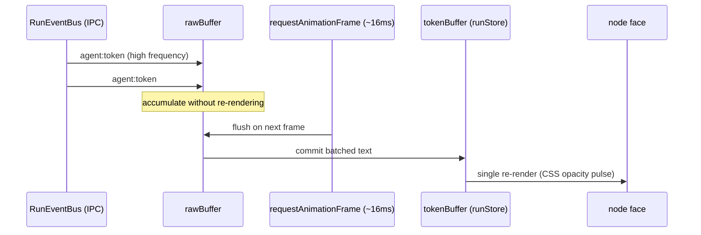

# State management (desktop frontend)

This document explains how the desktop app's React frontend holds and updates
state during workflow editing and live runs. The central tension is performance:
a ReactFlow canvas with dozens of nodes, each receiving a stream of tokens at high
frequency, will jank badly under naïve React state. Relavium's answer is three
deliberate choices — **Zustand stores instead of React Context**, **direct
per-node subscriptions** into those stores, and a **token double-buffer** that
caps re-renders at the display refresh rate. The Zustand store *shapes* are
canonical in
[../reference/shared-core/store-shapes.md](../reference/shared-core/store-shapes.md);
this document explains why the model is built the way it is.

```mermaid
flowchart TB
    Engine["packages/core RunEventBus<br/>(via Tauri IPC)"] --> SM["SseManager<br/>(singleton, non-React)"]
    SM -->|agent:token, batched| RB["rawBuffer"]
    RB -->|16ms RAF flush| TB["tokenBuffer<br/>(runStore)"]
    SM -->|node:started / node:completed / cost:updated| RunStore["runStore<br/>(per-run, per-node status)"]
    subgraph Stores["Zustand stores"]
        ProviderStore["providerStore"]
        AgentStore["agentStore"]
        WorkflowStore["workflowStore"]
        UiStore["uiStore"]
        RunStore
    end
    RunStore -->|useRunNodeStatus(id)<br/>memoized selector| Node["AgentNode #id<br/>(React.memo)"]
    TB --> Node
    WorkflowStore --> Canvas["ReactFlow canvas"]
    Node --- Canvas
```

> Status: this document is grounded in the still-true frontend findings of the
> deep analysis (Zustand + ReactFlow direct subscriptions, the token double-buffer,
> canvasStore/runStore separation). The exact store `Shape:{}` definitions are the
> canonical property of
> [../reference/shared-core/store-shapes.md](../reference/shared-core/store-shapes.md).

## Context

The decision to put ReactFlow node state in **direct Zustand subscriptions**
rather than React Context is recorded in
[ADR-0010](../decisions/0010-zustand-direct-subscriptions-for-reactflow.md). The
adversarial review of the original design found that holding canvas node state in a
`CanvasContext` caused **O(n) re-renders**: a single streaming token would change
the context value and re-render *every* node, not just the one receiving the token.
At 9 node types, dozens of nodes, and a token every few milliseconds, that is
unworkable. Zustand with per-node selectors fixes it because a component only
re-renders when the specific slice it subscribes to changes.

## The stores

State is split into focused Zustand stores (Zustand v5 + immer). The complete
`Shape:{}` for each is in
[../reference/shared-core/store-shapes.md](../reference/shared-core/store-shapes.md);
in summary:

| Store | Holds | Notes |
|-------|-------|-------|
| `providerStore` | configured providers, model catalog | keys themselves never live here — only references; see [local-first-and-security.md](local-first-and-security.md) |
| `agentStore` | agent definitions, test-chat state | mirrors `*.agent.yaml` files |
| `workflowStore` | the open workflow, undo/redo history | serialized to YAML on save |
| `uiStore` | panel open/closed, theme, selection | pure view state |
| `runStore` | live run status, per-node status, token buffers, cost | the hot path during a run |

### The critical separation: canvas state vs run state

The single most important decision is keeping **canvas structure** (which nodes
and edges exist, their positions) separate from **run state** (per-node live
status and streaming tokens):

- **Canvas structure** uses ReactFlow's `useNodesState`/`useEdgesState`, isolated
  in a canvas-scoped store and serialized to YAML on save. It changes when the
  *author* edits the graph.
- **Run state** lives in `runStore`. It changes constantly during a run.

If these were one store, every token would invalidate canvas structure and force a
full graph re-layout. Keeping them apart means a streaming token only touches
`runStore`, and only the one node subscribed to that node's slice re-renders.

## Direct per-node subscriptions

Each custom node component subscribes to *only its own* slice of `runStore` via a
memoized selector — for example a `useRunNodeStatus(id)` hook keyed by `nodeId`,
compared with a shallow-equality function so a node re-renders only when its own
status or token text actually changes. Combined with `React.memo` on the node
components and a **stable `nodeTypes` reference** (a common ReactFlow footgun — an
inline `nodeTypes` object remounts every node on each render), this keeps the cost
of a streaming run proportional to the *active* nodes, not the whole graph.

## The token double-buffer

LLM token events arrive faster than the screen can usefully repaint. Rendering
each token immediately would re-render a node hundreds of times per second for no
visual benefit and would starve the rest of the UI. Relavium uses a
double-buffer driven by `requestAnimationFrame`:



Incoming `agent:token` events accumulate in a `rawBuffer` **without** touching
React state. On each animation frame (~16ms) the buffer is flushed into the
`tokenBuffer` in `runStore`, which triggers exactly one re-render of the affected
node. This caps token re-renders at roughly 60fps regardless of how fast tokens
arrive. A subtle but important correctness note from the review: the buffer must be
**keyed per node**, not a single shared buffer — a single global token buffer
corrupts output when multiple agent nodes stream in parallel.

## The realtime pipeline

A non-React **`SseManager` singleton** owns the connection to the engine's event
stream and routes events into the stores. Keeping it outside React means
reconnection logic and gap detection do not depend on component lifecycles:

- Events carry a `sequenceNumber`; the manager detects gaps and re-syncs (in the
  local desktop case this is a state refetch; over HTTP in Phase 2 it is SSE
  `Last-Event-ID` resumption).
- `agent:token` events go through the double-buffer; status and cost events
  (`node:started`, `node:completed`, `cost:updated`, `run:completed`, `run:error`,
  `human_gate:pending`) update `runStore` directly.
- A `human_gate:pending` event raises the root-level `HumanGateOverlay`; resolving
  it is idempotent on reconnect (see
  [execution-model.md](execution-model.md#4-human-gate)).

The event shapes are the
[SSE event schema](../reference/contracts/sse-event-schema.md); locally they are
delivered over the [IPC contract](../reference/contracts/ipc-contract.md).

## Editing-time state: undo/redo

Workflow editing keeps a bounded undo/redo history (a snapshot stack of the
workflow graph) in `workflowStore`. Snapshots are debounced so a drag does not
push dozens of entries, and history capture is disabled while a run is active to
avoid mutating the graph mid-execution.

## Related documents

- [execution-model.md](execution-model.md) — what produces the events this layer renders.
- [desktop-architecture.md](desktop-architecture.md) — the Tauri shell that delivers events to the WebView.
- [ADR-0010](../decisions/0010-zustand-direct-subscriptions-for-reactflow.md) — why Zustand direct subscriptions over Context.
- [../reference/shared-core/store-shapes.md](../reference/shared-core/store-shapes.md) — the canonical store shapes.
