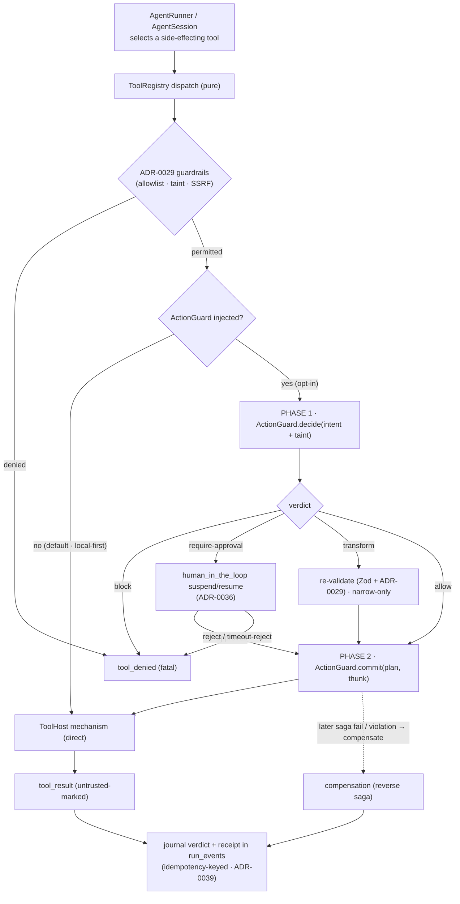

# ADR-0041: External action-governance seam — the optional, host-injected `ActionGuard` over side-effecting tool actions

- **Status**: Proposed
- **Date**: 2026-06-17
- **Related**: [ADR-0003](0003-pure-ts-engine-not-langgraph-python.md), [ADR-0008](0008-local-first-phase-1-cloud-phase-2.md), [ADR-0012](0012-managed-inference-dual-mode.md), [ADR-0015](0015-managed-mode-data-handling-and-compliance.md), [ADR-0018](0018-desktop-execution-and-rust-egress.md), [ADR-0028](0028-workflow-resource-governance.md), [ADR-0029](0029-tool-policy-hardening.md), [ADR-0034](0034-mcp-client-sdk-dependency.md), [ADR-0036](0036-run-loop-substrate-event-bus-and-execution-host.md), [ADR-0037](0037-engine-tool-execution-boundary.md), [ADR-0039](0039-same-provider-reasoning-replay.md), [tool-registry.md](../reference/shared-core/tool-registry.md), [security-review.md](../standards/security-review.md), [error-handling.md](../standards/error-handling.md), [sse-event-schema.md](../reference/contracts/sse-event-schema.md), [shared-core-engine.md](../architecture/shared-core-engine.md), [product-constraints.md](../product-constraints.md), [architectural-principles.md](../standards/architectural-principles.md)

<!--
DRAFT for discussion. This ADR is Proposed (not Accepted): it records the integration
boundary for an EXTERNAL action-governance control plane (working name: Provna) so that
the still-fresh ToolHost boundary (ADR-0037) is not foreclosed and so each surface does
not invent a divergent hook. No code is implied by this ADR landing; it pins the seam.
-->

## Context

[ADR-0037](0037-engine-tool-execution-boundary.md) pinned the `ToolHost` boundary: the engine's `ToolRegistry` owns all tool **policy + dispatch** as pure code in `packages/core`, and every side-effecting **mechanism** is host-injected. [ADR-0029](0029-tool-policy-hardening.md) hardened the engine-side guardrails on that boundary — exact-command match, node-tools narrow-only, no secret interpolation (taint-tracked), one SSRF primitive over three egress paths, `git_commit` behind a human gate. Those guardrails are **static allow/deny + an injection-resistant data/instruction posture**: fail-closed, but coarse-grained and authored.

A **distinct, deeper class of guarantee** is increasingly a precondition for the regulated/enterprise adopters who let agents **write to systems of record** (payments, ERP rows, ticket state, infra). It is four properties Relavium deliberately does **not** provide today, and should not, because they are a *different product's* concern, not this local-first runtime's identity:

1. **Transactional action safety** — idempotency on a *semantic* effect key, a dry-run/preview before commit, and a *compensating rollback* of external side effects. Note the gap precisely: the derived `Checkpointer` ([ADR-0003](0003-pure-ts-engine-not-langgraph-python.md)) and `resumeFromCheckpoint` ([ADR-0036](0036-run-loop-substrate-event-bus-and-execution-host.md)) make a run *replay*; they do **not** *undo* an external `POST` that already committed. Node retry ([ADR-0040](0040-node-retry-budget-above-the-chain.md)) re-dispatches, it does not compensate.
2. **Provable information-flow control** — beyond the untrusted-content-as-data structural boundary ([security-review.md §Prompt-injection](../standards/security-review.md), binding on workstreams 1.T/1.O per [ADR-0037](0037-engine-tool-execution-boundary.md)), capability/sink-policy IFC (the CaMeL/FIDES research class) that *proves* untrusted data cannot reach a sensitive sink.
3. **Per-action, delegation/attenuation-aware authorization** — beyond the static `allowedCommands` / `allowedDomains` allowlists, a runtime PDP decision over `agent ∩ user ∩ delegation ∩ intent`.
4. **Tamper-evident, regulator-grade audit** — beyond the `run_events` log and the Phase-2 SOC 2 audit trail ([cloud-phase-2.md](../architecture/cloud-phase-2.md)), hash-chained / Merkle-witnessed evidence mapped to external regimes (e.g. EU AI Act Art. 12/14).

These four are the concern of an **external action-governance / assurance control plane** (working name **Provna**) that wraps *any* agent runtime, not only Relavium. The question this ADR settles is the **integration boundary**: *where and how does such a governor attach, without breaking the things that make Relavium Relavium?* The framing constraints are non-negotiable:

- **Engine purity** (rule 5, [ADR-0003](0003-pure-ts-engine-not-langgraph-python.md)): calling an external governor is network/process I/O — it cannot live in `packages/core`.
- **Local-first, no cloud dependency** ([product-constraints.md](../product-constraints.md), [ADR-0008](0008-local-first-phase-1-cloud-phase-2.md)): Relavium must not acquire a *required* external dependency; an external enterprise control plane can only ever be **opt-in**, in the spirit of managed inference ([ADR-0012](0012-managed-inference-dual-mode.md)) being an additive Phase-2 opt-in that is never a paywall in front of the BYOK/local path.
- **Seam-abstraction discipline** (the `LLMProvider` and `ToolHost` precedent): the boundary must be **vendor-neutral** — no single governance vendor's type may define it.

Getting this wrong has two failure modes: baking the four properties *into* the engine (scope creep that contradicts desktop-is-not-an-IDE / local-first and couples a local runtime to an enterprise plane), or letting each surface bolt on a different hook (the surface-drift risk [shared-core-engine.md](../architecture/shared-core-engine.md) exists to kill).

## Decision

**We will define an optional, host-injected `ActionGuard` seam at the side-effecting tool-execution boundary, OFF BY DEFAULT, through which an external action-governance control plane (Provna as the reference implementation) governs side-effecting tool actions — adding transactional safety, information-flow control, per-action authorization, and tamper-evident audit. The engine pins the *seam, the invocation point, and the composition rules* as pure types in `packages/core`; the *mechanism* (the call to the external governor and the wrapped side-effect execution) is host-injected exactly as the `ToolHost` ([ADR-0037](0037-engine-tool-execution-boundary.md)) and the Rust egress ([ADR-0018](0018-desktop-execution-and-rust-egress.md)) are. The `ActionGuard` COMPOSES WITH — never replaces — the [ADR-0029](0029-tool-policy-hardening.md) guardrails and the `human_in_the_loop` gate; it is a defense-in-depth, opt-in enterprise layer, not Relavium's baseline.**

Naming note: this is the `ActionGuard` seam, deliberately **distinct from** [ADR-0028](0028-workflow-resource-governance.md)'s pre-egress *budget* governor (which caps token/cost before LLM egress). Different concern, different lifecycle — kept a sibling seam for the same reason [ADR-0037](0037-engine-tool-execution-boundary.md) keeps `ToolHost` separate from [ADR-0036](0036-run-loop-substrate-event-bus-and-execution-host.md)'s `ExecutionHost`.

The split, by concern (the [ADR-0037](0037-engine-tool-execution-boundary.md) policy/mechanism precedent):

- **Engine-pure (`packages/core`):** the `ActionGuard` **interface** (a typed port) and the **invocation point** in the `ToolRegistry` dispatch path — placed **after** the [ADR-0029](0029-tool-policy-hardening.md) guardrails pass and **around** the side-effecting `ToolHost` mechanism. The engine passes the governor the structured intent (tool id, the **effective validated args** — model args + `input_mapping` + config, [ADR-0037](0037-engine-tool-execution-boundary.md) — the existing **untrusted / secret taint markers**, node/agent identity, and the run/session correlation id) and interprets the governor's verdict — a discriminated union `allow | block | require-approval | transform` — into the engine's *existing* control flow:
  - `block` → **`tool_denied`** (fatal, never retried — the [ADR-0037](0037-engine-tool-execution-boundary.md) error taxonomy, no new code).
  - `require-approval` → reuse the durable **`human_in_the_loop`** suspend/resume (the [ADR-0036](0036-run-loop-substrate-event-bus-and-execution-host.md) `ExecutionHost` persistence + one-shot timeout port) — **not** a new suspend mechanism.
  - `transform` → re-validate the narrowed args against the **same** Zod + [ADR-0029](0029-tool-policy-hardening.md) checks; a governor may only **narrow, never widen** (symmetry with node-tools narrow-only, [ADR-0029](0029-tool-policy-hardening.md)(b)).
  - `allow` → proceed.
- **Host-injected (the `ActionGuard` implementation):** the network/process I/O to the external control plane; the **idempotent, compensable execution wrap** of the side effect (when a governor is present it owns invoking the `ToolHost` mechanism, so it can bind an idempotency key, record a compensation, and emit the tamper-evident audit record); and, on failure or a later policy violation, **triggering compensation**. On the desktop this is a Tauri command ([ADR-0018](0018-desktop-execution-and-rust-egress.md) generalized beyond `llm_stream`); on the Node surfaces an in-process client; in Phase-2 cloud the relocated `ExecutionHost` provides it. **Absent (the default), the engine calls the `ToolHost` directly, exactly as today** — no external call, no behavior change.

Composition rules this ADR pins:

- **Off by default; never a required dependency.** With no `ActionGuard` injected, behavior is byte-identical to today — the [product-constraints.md](../product-constraints.md) / [ADR-0008](0008-local-first-phase-1-cloud-phase-2.md) local-first, zero-egress guarantee is untouched. The governor is an enterprise opt-in, the [ADR-0012](0012-managed-inference-dual-mode.md)/[ADR-0015](0015-managed-mode-data-handling-and-compliance.md) opt-in posture applied to governance.
- **Side-effecting tools and egress — including read-only egress such as `web_search` — are governed.** Local read-only tools (`read_file`, `git_status`, clipboard, …) and `invoke_agent` (already *not* a `ToolHost` capability — [ADR-0037](0037-engine-tool-execution-boundary.md)) bypass the governor. Egress is governed *even when read-only* because it is an exfiltration sink for the information-flow pillar (the query is the lethal-trifecta channel). The governor sees every write / process-spawn / egress (classified by `ActionClass` — see [action-guard-seam.md](../reference/shared-core/action-guard-seam.md)), where transactionality, authz, audit, and — for egress — exfiltration control matter.
- **`fs-write` needs an additive `ToolPolicyClass.fsWrite` flag.** The existing `fsScoped` ([tool-registry.md](../reference/shared-core/tool-registry.md)) is `true` for reads and writes alike, so it cannot key the `fs-write` class; this ADR proposes a minimal, backward-compatible additive `fsWrite?: boolean` that lands with the seam (until then, an implementation must not govern fs reads).
- **Composes after, never replaces.** The [ADR-0029](0029-tool-policy-hardening.md) guardrails run **first** (fail-closed allowlists, secret-taint, SSRF); only calls the engine already permits reach the governor, which can **further restrict or wrap, never re-grant**. A hallucinated / injected `tool_call` for a tool the node was not granted is already dead at the registry ([ADR-0037](0037-engine-tool-execution-boundary.md)) before the governor is consulted.
- **Host-internal spill mechanisms are orthogonal.** Mechanisms such as the `outputStore` spill-to-file path are internal `ToolHost` bookkeeping, not tool calls; they remain governed by the host and the existing [ADR-0029](0029-tool-policy-hardening.md) / [ADR-0037](0037-engine-tool-execution-boundary.md) boundaries, not by the optional `ActionGuard`.
- **Deterministic replay.** The governor's verdict and the external side-effect result are journaled as side effects in `run_events`, keyed by the governor's idempotency key — the LLM-call journaling precedent ([ADR-0039](0039-same-provider-reasoning-replay.md) / [ADR-0003](0003-pure-ts-engine-not-langgraph-python.md) derived checkpointer) — so cross-process resume ([ADR-0036](0036-run-loop-substrate-event-bus-and-execution-host.md)) **re-delivers rather than re-executes**; a resumed run will never double-post.
- **Taint handoff.** The governor **consumes** the engine's untrusted / secret markers ([ADR-0037](0037-engine-tool-execution-boundary.md) / [ADR-0029](0029-tool-policy-hardening.md)(c)) as inputs to its IFC decision and **returns** its result still marked untrusted — the unsafe-path-unrepresentable type boundary holds end to end.
- **Vendor-neutral seam.** The interface names no vendor; Provna is *a* reference implementation, as Anthropic/OpenAI/Gemini are implementations behind `LLMProvider`. No external-governor SDK type crosses the seam.

This ADR pins the principle + seam + invocation point + composition rules; the exhaustive `ActionGuard` interface (the verdict union, the intent payload, the compensation/audit handles) lands in its one canonical home, a new [action-guard-seam.md](../reference/shared-core/action-guard-seam.md) (rule 8), following the [ADR-0037](0037-engine-tool-execution-boundary.md) → [tool-registry.md](../reference/shared-core/tool-registry.md) precedent.

Considered alternatives:

- **Build action-governance into `packages/core`** (rejected) — the governor is network I/O; it breaks engine purity (rule 5, [ADR-0003](0003-pure-ts-engine-not-langgraph-python.md)) and the ESLint / `tsconfig.purity.json` fences, and it bloats the local-first runtime with a different product's concern.
- **Make the seam vendor-specific (a "Provna seam")** (rejected) — couples Relavium to one governance vendor, violating the abstraction discipline that governs the `LLMProvider` and `ToolHost` seams. The interface must be vendor-neutral with Provna as one implementation.
- **On by default / required** (rejected) — breaks the no-cloud-dependency guarantee ([product-constraints.md](../product-constraints.md), [ADR-0008](0008-local-first-phase-1-cloud-phase-2.md)); an external VPC control plane is not something a solo BYOK-local user runs.
- **Fold it into the existing `ToolHost`** ([ADR-0037](0037-engine-tool-execution-boundary.md)) (rejected) — the governor has a distinct lifecycle (a pre-execution *decision*, an execution *wrap* for idempotency + compensation, a post-hoc *compensation*, an async *approval* path); folding it into the per-tool I/O mechanism re-merges the policy/mechanism split [ADR-0037](0037-engine-tool-execution-boundary.md) keeps, and compensation/audit is cross-cutting, not per-mechanism.
- **Express it only as authored `human_gate` nodes** (rejected) — the gate is coarse and authored per-workflow; the governor must transparently intercept *every* side-effecting action the agent chooses at runtime, including MCP tool calls ([ADR-0034](0034-mcp-client-sdk-dependency.md)), not only the gates an author placed.
- **Reuse [ADR-0028](0028-workflow-resource-governance.md)'s budget governor** (rejected) — different concern and lifecycle (token/cost ceiling pre-LLM-egress vs. governance of side-effecting tool actions). Two minimal sibling seams beat one god-interface — the [ADR-0037](0037-engine-tool-execution-boundary.md) `ToolHost`-vs-`ExecutionHost` reasoning.

## Consequences

### Positive

- **Local-first preserved.** Off by default, no external call, behavior identical to today — the guarantee stays a guarantee, and the seam is unit-testable against a stub `ActionGuard` with zero real I/O (the `ToolHost` testing posture).
- **Enterprise adopters get the deep guarantees without forking the engine.** Transactional safety + IFC + per-action authz + tamper-evident audit attach at one injected seam; the engine stays pure, the surfaces wire it once (the [ADR-0018](0018-desktop-execution-and-rust-egress.md)/[ADR-0037](0037-engine-tool-execution-boundary.md) pattern).
- **Vendor-neutral.** Provna is the reference implementation; the seam admits others — the `LLMProvider`/`ToolHost` discipline extended to governance.
- **Defense-in-depth with no new machinery.** The governor composes *after* [ADR-0029](0029-tool-policy-hardening.md), reuses the durable `human_in_the_loop` gate ([ADR-0036](0036-run-loop-substrate-event-bus-and-execution-host.md)) for approvals and the `run_events` journal ([ADR-0003](0003-pure-ts-engine-not-langgraph-python.md)/[ADR-0039](0039-same-provider-reasoning-replay.md)) for deterministic replay.
- **Boundary pinned while [ADR-0037](0037-engine-tool-execution-boundary.md) is fresh**, so Phase-1 tool work doesn't foreclose it and no surface invents a divergent hook.
- **Clean two-product story.** Relavium runs agents; the external governor governs their actions at this seam — adjacent layers, not a merge that would dilute either.

### Negative

- **Another host-injected seam to wire per surface** (Tauri command on desktop, in-process client on Node) — mitigated: it is the already-accepted [ADR-0018](0018-desktop-execution-and-rust-egress.md)/[ADR-0037](0037-engine-tool-execution-boundary.md) injection pattern, and the engine half is surface-agnostic and tested once against a stub.
- **The governor sits in the hot path of side-effecting actions** — added latency and an availability dependency that, for a regulated action, must fail-closed. Mitigated: scoped to the side-effecting subset only, bounded/timed, and a fail-closed *indeterminate* verdict is precisely what the governor's own dry-run + compensation makes safe (the deferral/reversibility is the point, not an outage).
- **Replay must journal the governor's verdict + external result as side effects** (idempotency-keyed) — added event-log/resume complexity, mitigated by reusing the LLM-call journaling precedent ([ADR-0039](0039-same-provider-reasoning-replay.md)/[ADR-0003](0003-pure-ts-engine-not-langgraph-python.md)) rather than inventing a mechanism.
- **Cross-product version coupling** (the Relavium `ActionGuard` seam vs. the external governor's API) — a real maintenance surface; mitigated by versioning the seam in its canonical reference doc (rule 8) and keeping it vendor-neutral, so it evolves on Relavium's cadence, not one vendor's.
- **The deepest guarantees are not Relavium's baseline** (they live in the external product) — recorded as a *deliberate boundary*, not a gap: baking provable IFC, transactional rollback, and regulator-grade audit into the local-first runtime would be scope creep against the desktop-is-not-an-IDE / local-first discipline. Relavium's own [ADR-0029](0029-tool-policy-hardening.md) guardrails remain the always-on, fail-closed floor.
- **Session entry-point scope (Phase 1).** `require-approval` (durable suspend) and automatic `compensate` (saga unwind) rely on `WorkflowEngine` machinery an `AgentSession` ([ADR-0024](0024-agent-first-entry-point-agentsession.md)) lacks; in Phase 1 they are **run-only**. A session turn still gets IFC + authz + audit + idempotency; its transactional / approval guarantees land with the session unwinder + persistence (1.X/1.Y). A deliberate scope boundary, recorded so it is not mistaken for a seam gap.
- **Proposed, not Accepted.** This pins a boundary for a product that does not yet exist; if the external-governor direction is abandoned, the ADR is marked **Deprecated** (it is not *Superseded* — no later ADR replaces it; the direction is simply dropped) and the seam never lands — no Phase-1 commitment is created by recording it.
