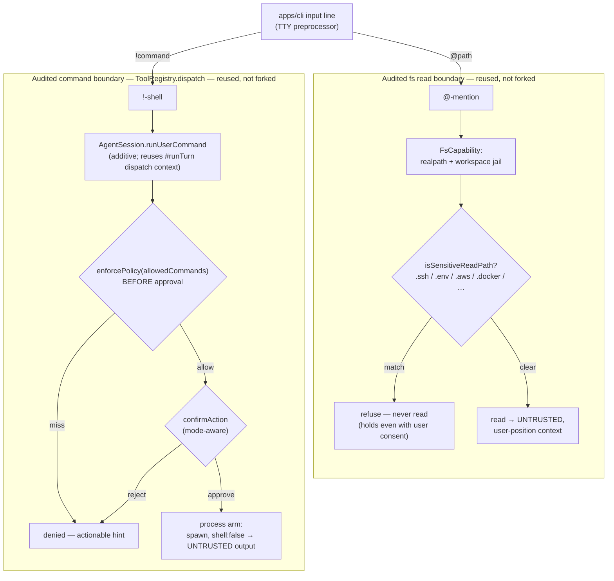

# ADR-0061: CLI chat input-layer file-injection (`@`-mention) and shell-escape (`!`-shell) security model

- **Status**: Accepted
- **Date**: 2026-07-03 (Accepted after a two-round maintainer security review; the mandatory adversarial security review runs inside the 2.5.D step-4/5 opus+sonnet review loops and the final PR review)
- **Related**: [ADR-0024](0024-agent-first-entry-point-agentsession.md), [ADR-0029](0029-tool-policy-hardening.md), [ADR-0037](0037-engine-tool-execution-boundary.md), [ADR-0043](0043-media-egress-failover-rematerialization-ssrf.md), [ADR-0055](0055-cli-host-capability-seam-tool-environment-factory.md), [ADR-0057](0057-cli-chat-modes-and-per-tool-approval.md), [phase-2.5-cli-consolidation.md](../roadmap/phases/phase-2.5-cli-consolidation.md) (2.5.D), [chat-session.md](../reference/cli/chat-session.md), [home.md](../reference/cli/home.md), [config-spec.md](../reference/contracts/config-spec.md), [built-in-tools.md](../reference/shared-core/built-in-tools.md), [tool-registry.md](../reference/shared-core/tool-registry.md), [security-review.md](../standards/security-review.md)

> **Accepted (2.5.D, the two security-bearing input features).** Drafted before implementation and settled after
> a **two-round maintainer security review** that (a) **reversed** the initial "curated default" `!`-allowlist —
> it reopened, default-on, the very confidential-exfiltration vector `@`-mention closes, because `run_command`
> has **no** file/argument confidentiality floor (only the `fs` capability does) — and (b) **corrected** the
> confidentiality-floor member set and **expanded** it to `.env*` / `.aws` / `.docker`. The pure-ergonomics half
> of 2.5.D (`Ctrl+J` multiline, cursor / word motions, `↑/↓` history, `Ctrl+R` reverse-search) is **out of
> scope** — it changes no security boundary and needs only the [chat-session.md](../reference/cli/chat-session.md)
> / [home.md](../reference/cli/home.md) keymap update. The **mandatory adversarial security review** runs as a
> dedicated pass inside the 2.5.D step-4/5 opus+sonnet review loops + the maintainer's final PR review (the same
> rigor ADR-0057 used, sequenced into the implementation loop rather than strictly before Accept).

## Context

Phase 2.5.D ([phase-2.5-cli-consolidation.md](../roadmap/phases/phase-2.5-cli-consolidation.md) §2.5.D) upgrades
the chat prompt with two affordances that are **not** keystroke ergonomics — they move data across a trust
boundary from the terminal input line:

- **`@`-mention** — the user types `@path` and the file's bytes are injected into the user message as explicit
  context, so the model sees the file without a tool round-trip. This is a **read that egresses to the
  provider** (and into the durable `history.db` transcript, [ADR-0050](0050-cli-history-db-at-rest-posture.md)) —
  the exact sink the `read_file` host reader guards with its jail + a sensitive-path confidentiality floor
  ([ADR-0055](0055-cli-host-capability-seam-tool-environment-factory.md), [built-in-tools.md](../reference/shared-core/built-in-tools.md)).
- **`!`-shell** — the user types `!command` and a shell command runs. This is **command execution**, the exact
  side-effect the `run_command` tool guards with the `allowedCommands` allowlist + the hardened process arm
  ([ADR-0055](0055-cli-host-capability-seam-tool-environment-factory.md)) + the mode-aware `confirmAction`
  approval floor ([ADR-0057](0057-cli-chat-modes-and-per-tool-approval.md)).

The structural risk is that **both features are `apps/cli` input-layer preprocessors that run *outside*
`ToolRegistry.dispatch`** — the one place where [ADR-0029](0029-tool-policy-hardening.md)'s guardrails,
ADR-0055's host jail, and ADR-0057's approval floor are physically enforced. `@`-mention never enters
`dispatch` at all; `!`-shell *could* be given its own execution path in `apps/cli`. If either re-implements or
sidesteps those boundaries, the CLI grows a **second** file-read path / a **second** command sandbox that can
diverge from the audited one. A third, subtler fact bounds the design: **the two boundaries are asymmetric.**
The `fs` capability carries a **file-content confidentiality floor** (`isSensitiveReadPath`, `fs.ts`) that
refuses to read a credential store; `run_command` has **no** analogue — it matches the **command string**
against the allowlist and never inspects the command's **file-path arguments**. So a `!cat <path>` reads
whatever `cat` can read, un-floored. Two concrete attacks frame the stakes:

1. **Confused-deputy-via-human exfiltration.** A model, or a file already injected from the workspace or the
   web, can socially-engineer the user into typing `@~/.ssh/id_rsa`, `@.env`, or `!cat ~/.ssh/id_rsa` /
   `!cat .env`. For `@`-mention the **confidentiality floor** is the control (it refuses the read regardless of
   the user's consent, because a manipulated human is exactly the threat). For `!`-shell there is **no arg
   floor** — so the **command allowlist is the only control**, and a permissive allowlist (or a permissive
   *default*) reopens this exfil vector via `cat` / `grep` / `git show`, which are read-only yet
   confidentiality-*un*safe.
2. **Allowlist / approval fork.** If `!`-shell checks the allowlist or the mode in `apps/cli` — or runs the
   approval prompt *before* the allowlist check — a bug (or `auto` mode) can run a command the one audited
   boundary would have refused.

The phase doc's 2.5.D acceptance line reads *"REPL-only; no engine/seam change."* That is the right instinct
for the ergonomics half, but it is in genuine tension with implementing `!`-shell **correctly**: the CLI has no
way to dispatch a single tool outside a model turn, so the only safe vehicle reuses engine machinery. This ADR
unwinds that tension explicitly rather than letting it drive an unsafe `apps/cli`-side re-implementation.

## Decision

**We will bind both input-layer features to the *existing* audited boundaries — reusing, never forking, the
`read_file` file-read jail and the `run_command` command-execution boundary — keep both features
secure-by-default, and treat the one small engine addition `!`-shell requires as a bounded, pure, documented
exception to 2.5.D's "no engine change" line, not a license to relax any guarantee.**

Both `apps/cli` input preprocessors **re-enter** the audited boundary for their side, rather than growing a second
file-read path / command sandbox — the "reuse, never fork" flow at a glance:

The asymmetry the diagram makes visible: for `@`-mention the human typing `@path` replaces the `confirmAction`
prompt but **never** the confidentiality floor (a manipulated human is the threat); for `!`-shell
`enforcePolicy` runs **before** `confirmAction`, so the allowlist is the mode-independent floor even in `auto`.

### `@`-mention reads through the `read_file` jail + confidentiality floor (which this ADR expands)

An `@`-mention read goes through the **same** host `fs` capability the `read_file` tool uses — the
`realpath` + common-path jail, the `isSensitiveReadPath` confidentiality floor, the `O_NOFOLLOW` single-fd read
that rejects directories / FIFOs / devices, and the same size cap — **never a raw `node:fs` read**, and **never
a scope wider than `read_file`'s workspace-clamped tier** ([ADR-0055](0055-cli-host-capability-seam-tool-environment-factory.md),
[built-in-tools.md](../reference/shared-core/built-in-tools.md)). The **only** difference from a model
`read_file` call is that the human typing `@path` **replaces the `confirmAction` prompt** — a person naming a
path at their own prompt is a stronger, more specific consent signal than answering `[y]` to a model-chosen
path. Consent replaces the *prompt*; it **never** relaxes the confidentiality floor, the binary fail-close, or
the size cap — that is what closes attack (1) for `@`. Further:

- **The confidentiality floor, stated precisely, and expanded here.** The existing `isSensitiveReadPath`
  (`apps/cli/src/engine/tool-host/fs.ts`) refuses a `.ssh` / `.relavium` **directory** segment, a repo `.git/config`
  and git's XDG `credentials`, and the credential dotfiles `.gitconfig` / `.git-credentials` / `.netrc` /
  `.npmrc` / `.pypirc` / `.pgpass`; paths **outside** the workspace (`~/.ssh`, `~/.aws/credentials`) are already
  closed by the jail-clamp ([built-in-tools.md](../reference/shared-core/built-in-tools.md), the `full`→project
  clamp). It did **not** cover a **workspace-internal `.env`** or an `.aws/` directory — the two most common
  in-repo secret stores. Because `@`-mention makes reading them a single keystroke, **this ADR expands
  `isSensitiveReadPath`** to also refuse `.env` / `.env.*`, an `.aws` directory segment, and `.docker/config.json`
  (registry auth). The expansion is a **shared-`fs` hardening** — it strengthens the model's `read_file` on
  **every** surface (defense in depth), so its canonical home is [built-in-tools.md](../reference/shared-core/built-in-tools.md)
  (the read-floor list) + `fs.ts`, reconciled when step 4 lands. **Behavior-change note:** a workflow/agent that
  legitimately `read_file`s a `.env` will now be refused (secure-by-default; the app still loads env vars via the
  process environment — the model just cannot read the secret file into its context). This is the deliberate,
  reviewed cost of the expansion.
- **Injected bytes are USER-position, untrusted content.** The snapshot is spliced into the user message at
  compose time, never the system / instruction position; a `secret`-typed value is still never interpolated
  ([ADR-0029](0029-tool-policy-hardening.md)), and any `--json` / observability field passes
  `redactSecretShapedText` ([ADR-0029](0029-tool-policy-hardening.md)(c), the one redaction primitive).
- **First-class, directory-navigable completion — with the floor applied to the *listing* too.** Typing `@`
  opens a Tab-completion overlay that lists **both directories** (navigable — selecting one descends into it)
  and **files** (selecting one injects it), so the affordance matches and exceeds the competitor `@`-mention UX.
  The candidate list applies **two** filters: (i) the **confidentiality floor** — a sensitive directory / file
  (`.ssh`, `.aws`, `.env`, credential dotfiles, …) is **neither listed nor read**, so the picker cannot even
  **disclose the existence** of `~/.ssh/` / `.env` to a shoulder-surfer or screen-capture observer (a
  **listing-gate** distinct from the read-gate); and (ii) an **advisory** `.gitignore` / `.relavium` trim (a UX
  nicety — do not offer `node_modules`), enforced with an **in-house, ReDoS-safe** matcher (no new `ignore`
  dependency, per [CLAUDE.md](../../CLAUDE.md) #2). The ignore trim is **not** a security boundary — the
  confidentiality floor above holds regardless of whether an ignore rule happens to cover a path. (Directory /
  glob **expansion** — `@src/`, `@**/*.ts` injecting many files — is a deferred follow-up,
  [deferred-tasks.md](../roadmap/deferred-tasks.md); 2.5.D ships single-file injection with full directory
  *navigation* in the picker.)
- **Binary fail-close + a byte-heuristic token warning.** A NUL-probe refuses binary content (media input, D12,
  is a separate security-reviewed follow-up — [chat-session.md](../reference/cli/chat-session.md)); the
  token-limit warning is a **byte heuristic** (`utf8ByteLength`, ~4 bytes/token), **no tokenizer and no new
  dependency**.
- **TTY-interactive only.** The `@` picker is a TTY affordance; in plain non-TTY / `--json` a leading `@` is
  **literal message text**, not an expansion (see the `!`-shell non-TTY note — the same rule).

*Considered:* a raw `node:fs` read for speed (rejected — reopens attack (1), bypasses the floor); a friendlier
dedicated "user-context" scope broader than the fs tier (rejected — relaxes the confidentiality floor the whole
point is to keep); making `.gitignore` the boundary (rejected — ignore is UX, not security; a non-ignored
secret would leak); leaving the floor as-is and only correcting the ADR's over-claim (weighed — honest, and a
workspace `.env` would stay readable exactly as `read_file` reads it today, i.e. no regression — but rejected in
favour of the expansion because `@`-mention makes `.env`/`.aws` exfil a one-keystroke affordance and the
expansion strengthens `read_file` on every surface).

### `!`-shell routes through the one `run_command` boundary via an additive `AgentSession` method

`!command` is dispatched as a **user-initiated `run_command`** through the **exact** boundary a model tool call
uses — `enforcePolicy(allowedCommands)` (enforced **before** the approval floor) → the mode-aware
`confirmAction` gate → the hardened process arm: **`spawn` with `shell:false`** (never `child_process.exec`),
ambient-PATH resolution, the declared-env denylist, a workspace-jailed cwd, byte-bounded output buffers, and
process-group `SIGKILL` ([ADR-0055](0055-cli-host-capability-seam-tool-environment-factory.md),
[ADR-0057](0057-cli-chat-modes-and-per-tool-approval.md), `apps/cli/src/engine/tool-host/process.ts`). The
execution vehicle is a **new, additive `AgentSession.runUserCommand()`** that **reuses `#runTurn`'s
dispatch-context construction verbatim** — the approval regime (`confirmAction`), the `toolPolicy`, the
`fsScope`, and `gateApproved: false` — **never a dispatch context re-assembled in `apps/cli`**. This is the
bounded engine exception named in Context; it is **pure** (no platform-specific import, no vendor type across
the `@relavium/llm` seam — [CLAUDE.md](../../CLAUDE.md) #4/#5 hold) and runs identically on every surface.

- **Allowlist matching = exact full-command-string + opt-in globs.** `commandAllowed` (`registry.ts`) matches
  the **resolved command string** (the binary + args joined, e.g. `git status`, `ls -la`) **exactly** against
  `allowedCommands`, plus opt-in `allowedCommandGlobs`; `git` never authorizes `git push --force`. So a bare
  `cat` entry is inert without args, and a broad glob (`cat *`) is what would let `!cat ~/.ssh/id_rsa` /
  `!cat .env` bypass the confidentiality floor (there is no arg floor on `run_command`) — which is why the
  default (below) ships neither.
- **Secure-by-default: the `[chat].allowed_commands` allowlist is EMPTY by default.** This is a deliberate,
  standard-mandated reversal of an earlier "curated read-only default": [security-review.md](../standards/security-review.md)
  (the chat clause) binds `[chat]` to the run-time checklist *"with no chat-specific exception … `run_command`
  uses the same `allowedCommands` allowlist … A chat-only relaxation of any rule here is a security violation,
  not a feature,"* and pins the `empty ⇒ disabled` symmetry. A **non-empty** chat default is exactly such a
  relaxation, and — because `run_command` has no arg floor — a curated set of *read-only* commands
  (`cat`, `grep`, `git show`, `git diff`) is **not** confidentiality-safe: it would reopen attack (1) default-on
  (`!cat .env` → provider + transcript). So this ADR adds an explicit **`[chat].allowed_commands`** field with a
  **default of `[]`** (⇒ `!`-shell inert until the user opts in), preserving the symmetry and secure-by-default
  ([CLAUDE.md](../../CLAUDE.md) #6). **`!`-shell stays first-class via a first-class *opt-in*, not a permissive
  default:** (a) the user lists exact commands (or globs) in `[chat].allowed_commands`; (b) the 2.5.G onboarding
  wizard offers a **reviewed** safe-command seed the user accepts once (so a fresh setup can enable `!git status`
  et al. with an explicit, informed choice — not a silent default); and (c) a non-allowlisted `!cmd` gets an
  **actionable, secret-free hint** showing the exact `[chat].allowed_commands` line to add — never a dead
  "denied." Editing chat `allowedCommands` is a [security-review.md](../standards/security-review.md) trigger.
- **Mode-aware over that allowlist.** Denied in `ask` / `plan`; `[y]`/`[a]`/`[n]`-gated in `accept-edits`;
  auto-approved in `auto` — but `enforcePolicy` runs **before** `confirmAction`, so **even `auto` never runs a
  command absent from `allowedCommands`.** The allowlist is the mode-independent floor; the mode only decides
  whether an *allowed* command still prompts.
- **Output is injected as untrusted, doubly-bounded, pending context.** `!cmd` stdout/stderr is buffered as
  **pending context that rides the next `sendMessage`** (not an immediate model turn — no per-`!` token cost),
  carrying the **same untrusted brand** `run_command` output already carries (never a trusted instruction) and
  redacted on any observability field. It cannot silently blow the model's context window: it rides the same
  **two** existing bounds as a tool result — the host `BoundedBuffer(maxBufferBytes)` **per stream** (append to
  the cap, then drop + mark `truncated`, `process.ts`) and `applyOutputBounding`'s head+tail **preview + explicit
  truncation marker + spill reference** (`bounding.ts`, [ADR-0055](0055-cli-host-capability-seam-tool-environment-factory.md)).
- **Non-TTY contract — `@`/`!` are TTY-interactive affordances.** `confirmAction` needs an interactive
  approver; in plain non-TTY / `--json` there is none. Rather than invent a headless-approval path, a leading
  `@` / `!` in plain / `--json` mode is treated as **literal message text** (not expanded / executed), so no
  `confirmAction`-without-replier code path exists and the [ADR-0049](0049-cli-machine-output-contract.md)
  machine-output contract is untouched. On the interactive surface, the `!cmd` + its (bounded) output persist to
  the transcript so a `chat-resume` stays coherent.

*Considered:* an `apps/cli`-side re-implementation of the allowlist + approval (rejected — forks the one command
boundary; a divergence, or an approval-before-allowlist ordering bug, is a security regression, exactly attack
(2)); a separate `!`-shell execution path outside `run_command` (rejected — a second command sandbox); a
**non-empty curated default** allowlist for out-of-the-box use (rejected — a chat-specific relaxation forbidden
by [security-review.md](../standards/security-review.md), and, since `run_command` has no arg floor, its
read-only commands (`cat`/`grep`/`git show`) reopen attack (1) default-on); **full competitor parity — relaxing
the `enforcePolicy`-before-`confirmAction` ordering so *any* command is runtime-approvable, or an interactive
"add any command to the allowlist with one keystroke"** (rejected — it dissolves the `empty ⇒ disabled` floor,
and it reintroduces the `@`/`!` inconsistency: `!cat .env` approved once while `@.env` is refused outright, so
the human-consent-alone path the `@` floor deliberately distrusts would be back); user-only output display
(rejected — inconsistent with the `@`-mention sibling and reduces `!` to "a worse terminal"); **holding the "no
engine change" line strictly and deferring `!`-shell execution** (weighed as the honest fallback — steps 1–4
still ship a full editor + history + `@`-mention — but rejected because the additive method preserves the *real*
invariants and leaves no half-built feature).

### Config surface: `[chat].allowed_commands` resolution semantics

`[chat].allowed_commands` (snake_case, mapping to the engine's camelCase `allowedCommands`, per the existing
config convention) is spec'd in [config-spec.md](../reference/contracts/config-spec.md) when step 5 lands — the
canonical home, which today states `[chat]` *"does not define its own command allowlist"*; this ADR is the
decision that changes that. It resolves **per field, last-writer-wins** (project → workspace), like the other
`[chat]` keys, and **replaces** rather than merges — so a project layer fully overrides the inherited value,
including **setting it back to `[]` to opt out**. The default is `[]` (⇒ disabled). An optional
`allowed_command_globs` mirrors the engine's `allowedCommandGlobs`.

### Relationship to ADR-0055 and ADR-0057 (this is the input-layer sibling)

ADR-0055 is the **host-capability seam** (the `fs` / `process` / `egress` arms); ADR-0057 is the
**registry-dispatch approval floor** (`confirmAction`, the governed classes). Both enforce at
`ToolRegistry.dispatch`. ADR-0061 is a **new mechanism at a different layer** — the `apps/cli` **input line** —
so it is a **sibling ADR, not an amendment** to either (per the [README](README.md) convention: a new mechanism
gets its own ADR). Its whole job is to guarantee that the two input-layer features **re-enter** those audited
boundaries rather than bypass them: `@`-mention reuses (and hardens) ADR-0055's `fs` read jail + floor;
`!`-shell reuses ADR-0055's `process` arm + ADR-0057's `confirmAction` floor via the additive `runUserCommand`.
It supersedes nothing; it **strengthens** ADR-0055's read floor (the `.env`/`.aws`/`.docker` expansion) and is
reconciled into [built-in-tools.md](../reference/shared-core/built-in-tools.md) and
[config-spec.md](../reference/contracts/config-spec.md) when the respective steps land.

## Consequences

### Positive

- One file-read jail and one command-execution boundary, shared by the model's tools **and** the user's input
  line — no second sandbox, no divergence surface. Attack (1) is closed by construction: for `@` the
  confidentiality floor holds regardless of consent or ignore rules (and now covers `.env`/`.aws`/`.docker`);
  for `!` the empty-by-default allowlist means no confidentiality-unsafe command runs without an explicit,
  reviewed opt-in.
- Secure-by-default and standard-compliant end to end: `[chat].allowed_commands` defaults `[]` (the
  `empty ⇒ disabled` symmetry security-review.md pins), with **no chat-specific relaxation** of the
  `run_command` rule. `!`-shell is still first-class via a first-class opt-in (config + onboarding seed +
  actionable deny hint), not via a permissive default.
- The floor expansion strengthens `read_file` on **every** surface (desktop / VS Code / CLI), not just the CLI
  `@`-mention path — a net defense-in-depth gain beyond 2.5.D.
- The engine touch is a single additive, pure method reusing existing machinery — the real CLAUDE.md #5
  invariants (platform-free engine, untouched seam, identical on every surface) are preserved even though the
  phase doc's literal "no engine change" line gets a documented exception.
- `@`-injected content and `!`-output are both branded untrusted and doubly output-bounded, keeping the
  prompt-injection + context-window trust model consistent with existing tool output.

### Negative

- The 2.5.D "no engine change" acceptance line now carries a **documented exception** (`AgentSession.runUserCommand`).
  Mitigated by scoping it to one additive, pure method that reuses `#runTurn`'s dispatch context verbatim; the
  phase-doc §2.5.D + Engine-amendments-appendix reconciliation this ADR drives is a tracked doc obligation.
- The floor expansion is a **behavior change to a shared surface**: a workflow/agent that `read_file`s a `.env`
  now gets a fatal `tool_denied`. Mitigated by it being the secure-by-default direction (env vars still load via
  the process environment; only reading the secret *file into model context* is refused), by the canonical-home
  reconciliation, and by the mandatory security review.
- `!`-shell is **not** zero-config like the surveyed competitors — it needs a one-time opt-in. This is a
  deliberate secure-by-default posture (the `allowedCommands` differentiator), mitigated for UX by the onboarding
  seed (2.5.G) and the actionable deny hint; the feature itself (a shell escape with mode-gated approval) is at
  parity, only its **default** is locked down.
- `@`-mention adds a **user-consent path that skips the `confirmAction` prompt** for a file read. Mitigated by
  keeping the confidentiality floor, binary fail-close, and size cap non-negotiable — consent replaces only the
  prompt, never the floor.
- The input line grows keyboard-owning submodes (the `@` completion overlay; and, for the ergonomics half, the
  `Ctrl+R` search) that must not collide with the `/` palette, a pending approval, or the running-turn gate.
  Mitigated by reusing the palette precedence pattern (render inside the one ink tree, mutually exclusive with
  the palette, always yield to a pending approval) and per-combination reducer tests.
- The **mandatory adversarial security review** (folded into the step-4/5 review loops + the PR review) must
  cover: the `@`-mention read path (jail + expanded-floor reuse, the listing-gate, binary fail-close, ANSI/OSC
  injection via a crafted filename or file content, observability redaction); and the `!`-shell path (the empty
  default + `empty ⇒ disabled`, the allowlist-before-approval ordering, the reused-not-forked dispatch context,
  the `spawn`/`shell:false` process-arm envelope, untrusted-brand + double-bounding on injected output, and the
  TTY-only literal behavior in `--json`).

### Deferred at implementation (2.5.D step-4 review, 2026-07-03)

The `@`-mention design above ships with these bounded pieces deferred (each additive; none weakens the
confidentiality floor, the jail, the listing-gate, or the injection framing). Tracked in
[deferred-tasks.md](../roadmap/deferred-tasks.md) §"Phase 2.5.D follow-ups":

- The **advisory `.gitignore` / `.relaviumignore` completion trim** ("(ii)" of the candidate-list design) ships as
  a **fixed `NOISE_DIRS` set** in v1; the in-house ReDoS-safe ignore-file matcher is the deferred follow-up. This
  is an advisory UX trim only — the confidentiality floor + listing-gate remain the security control.
- **`@`-glob / whole-directory expansion**, and **`@`-mention of a binary/media file** (durable media-handle path,
  ADR-0031), are deferred — v1 injects a single text file.
- Injection hardening added during the review beyond the drafted design: the `<file>` frame is fenced with a
  **per-injection random nonce** on both tags (a file's bytes cannot forge `</file>`); the injected content is
  **byte- AND line-bounded** (head+tail+marker, surrogate-safe) so a large / many-line file cannot freeze the
  editor; the path strips **Unicode bidi/format controls** (extending the shared display sanitizer is a deferred
  general hardening); and the async accept carries a **submit-generation guard** so a slow read cannot inject into
  the next message. The read floor additionally covers `.envrc` / `.dockercfg` and `.env` as a **directory**
  segment (not just a file basename).

### Refined at implementation — the pending-attachment (chip) presentation (2.5.D PR #64 review, 2026-07-03)

The step-4/5 opus+sonnet review loop replaced the drafted **inline-editor injection** (splicing the framed
`<file>…</file>` / `<command>…</command>` bytes directly into the compose buffer) with a **pending-attachment
(chip) model** — a **presentation refinement that changes no security boundary**. The canonical pure module is
`apps/cli/src/render/tui/attachments.ts` (shared by both interactive surfaces — the standalone `ChatApp` and the
bare-invocation Home, kept at parity):

- **`@`-mention** now inserts a compact **`@path` marker** at the cursor and queues the file's (already-read,
  floored, bounded) content as a **pending chip**; the framed `<file>` block is expanded into the outbound
  message **only at submit**, and **only if the `@path` marker is still present** in the prose (a
  whitespace-bounded token scan — deleting the marker deterministically drops the file, so an email `me@path`
  never matches and editing the prose can't strand an attachment).
- **`!`-shell** output is shown **read-only** as a bounded transcript preview (the `notice` channel) and queued
  as a pending chip that **rides the next `sendMessage`** — exactly the "pending context that rides the next
  message" the Decision already specifies; the chip only changes how it is surfaced (a clean prompt + a visible
  chip bar, not raw frame bytes in the editor).
- **Invariants preserved, byte-for-byte.** At submit each consumed chip expands through the **same**
  `frameUntrusted` nonce-fenced frame (`injection.ts`), so the model receives **byte-identical** untrusted,
  user-position, doubly-bounded context at the same position as the drafted design. The confidentiality floor,
  the jail, the listing-gate, the allowlist-before-approval ordering, the untrusted brand, the double output
  bound, the submit-generation guard, and the **TTY-only** rule (a non-TTY `@`/`!` stays literal) are all
  unchanged. `history.db` still records the **full expanded message** — byte-identical to what the model received
  ([ADR-0050](0050-cli-history-db-at-rest-posture.md) at-rest posture; injected file/command content IS persisted
  there, in full, for resume fidelity); only the **live/compact transcript** shows the prose plus a `[📎 …]` note
  for carried command outputs, and the in-memory `↑`/`↓` recall keeps the prose the user typed.
- **Why.** Raw frames in the editor flooded the compose buffer and the transcript, let a user accidentally edit
  *inside* a frame, and made a large paste unreadable. The chip bar keeps the prompt clean, makes the queued
  context explicit, gives a deterministic removal affordance (delete the `@marker`; **`Esc` at an idle prompt
  discards all pending chips**), and labels the in-flight `!`-command busy indicator with an honest **`Esc` to
  cancel** (Esc aborts the command, keeping the session; Ctrl-C's `/cancel` would end it).
- **Allowlist resolution is COUPLED, not per-field.** A review found that resolving `allowed_commands` and
  `allowed_command_globs` independently (each last-writer-wins) reopened the very inheritance the override
  guarantees against: a project narrowing `allowed_commands` to `git status` while leaving globs unset would
  **inherit the workspace's broader `allowed_command_globs` (e.g. `git *`)** and still run `git push`. The two
  arrays are now a **coupled unit** — a project that sets **either** owns the whole allowlist and inherits
  **neither** array from the workspace; both fall through only when the project sets neither. Canonical home:
  [config-spec.md](../reference/contracts/config-spec.md) (`resolveChat`, `apps/cli/src/config/resolve.ts`).
