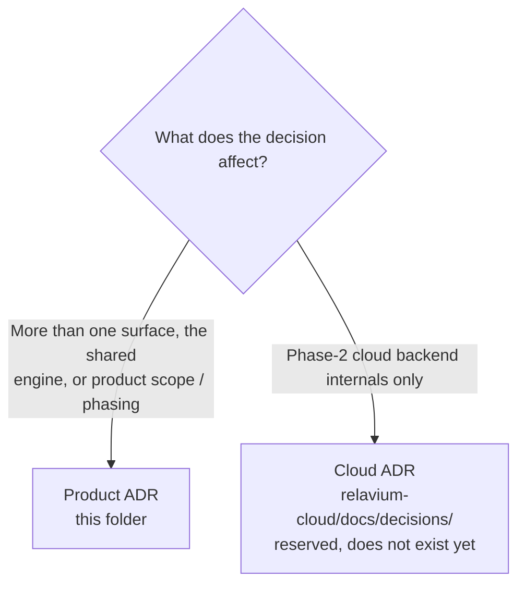

# Architecture Decision Records

Every non-trivial architectural, product, or process decision in Relavium is recorded here as an **ADR** (Architecture Decision Record) using a lightweight **MADR** (Markdown Architectural Decision Records) style.

## Why ADRs

- They preserve the **why**, not just the **what**. The reasoning behind a choice is the information that decays fastest and is most expensive to re-derive later.
- They make the evolution of the project readable: you can follow the numbered history and see how the design language developed, including the options that were rejected.
- They give future contributors (human or AI) a way to disagree with a decision by writing a *new* ADR that supersedes an old one, rather than silently changing code or docs.

Concrete specifications (workflow/agent YAML, the SSE event schema, the IPC contract, store shapes, DB DDL) live in their canonical [reference/](../reference/README.md) files. ADRs cite those by relative link and never restate them; they capture the *decision and its drivers*, not the spec.

## Format

Every ADR is a single file named `NNNN-short-kebab-slug.md`, where `NNNN` is a zero-padded four-digit sequence number. Each one opens with an H1 title and bold metadata lines, then four sections:

- **Context** — the situation, the problem, the constraints that applied.
- **Decision** — the option chosen, the alternatives considered, and the drivers that connected them.
- **Consequences** — split into **Positive** and **Negative** effects, with mitigations where relevant.

Pinned tool and library versions are *not* restated in ADRs; they live in [tech-stack.md](../tech-stack.md) and are referenced from there.

## Two ADR spaces

Relavium will ship as more than one git repository. To avoid renumbering pain across repos, there are **two independent ADR number spaces** — one for this meta repo, one reserved for the Phase-2 cloud repo.

| Space | Location | Scope | Numbering |
|-------|----------|-------|-----------|
| **Product / cross-cutting ADR** | this repo `docs/decisions/` (this folder) | Decisions that touch more than one surface (desktop, CLI, VS Code, portal), the shared engine, or product scope / phasing | Independent `ADR-0001..` |
| **Cloud backend ADR** *(Phase 2)* | reserved `relavium-cloud/docs/decisions/` | Decisions internal to the Phase-2 cloud execution backend only (worker orchestration, queue tuning, secrets injection, VPC peering) | Independent `ADR-0001..` |

The two spaces are **deliberately separate**; a collision (e.g. two `ADR-0005`s) is expected and is not a problem — the files live in different repos. Renumbering would touch every cross-reference (high risk, no value), so it is never done. Citation convention: **"Product ADR-00NN"** (this folder) vs **"Cloud ADR-00NN"** (`relavium-cloud/docs/decisions/`).

The cloud repo and its ADR space do not exist yet — they are a Phase-2 carry-forward. See [ADR-0008](0008-local-first-phase-1-cloud-phase-2.md) for the phasing decision that creates this split, and the (Phase 2) [cloud architecture doc](../architecture/cloud-phase-2.md).

## Index

| # | Title | Status | Date |
|---|-------|--------|------|
| 0001 | [Tauri v2 over Electron for the desktop app](0001-tauri-v2-over-electron.md) | Accepted | 2026-06-03 |
| 0002 | [Vite + React 19 + TanStack Router, not Next.js](0002-vite-react-tanstack-not-nextjs.md) | Accepted | 2026-06-03 |
| 0003 | [Pure TypeScript workflow engine, not LangGraph-Python](0003-pure-ts-engine-not-langgraph-python.md) | Accepted | 2026-06-03 |
| 0004 | [Vercel AI SDK for multi-LLM](0004-vercel-ai-sdk-multi-llm.md) | Superseded by 0011 | 2026-06-03 |
| 0005 | [SQLite + Drizzle local, PostgreSQL cloud](0005-sqlite-drizzle-local-postgres-cloud.md) | Accepted | 2026-06-03 |
| 0006 | [OS keychain for API keys](0006-os-keychain-for-api-keys.md) | Accepted | 2026-06-03 |
| 0007 | [The desktop app is not an IDE](0007-desktop-is-not-an-ide.md) | Accepted | 2026-06-03 |
| 0008 | [Local-first Phase 1, cloud Phase 2](0008-local-first-phase-1-cloud-phase-2.md) | Accepted | 2026-06-03 |
| 0009 | [Git-native workflow and agent YAML](0009-git-native-workflow-yaml.md) | Accepted | 2026-06-03 |
| 0010 | [Zustand direct subscriptions for ReactFlow](0010-zustand-direct-subscriptions-for-reactflow.md) | Accepted | 2026-06-03 |
| 0011 | [Internal multi-LLM abstraction (@relavium/llm)](0011-internal-llm-abstraction.md) | Accepted | 2026-06-03 |
| 0012 | [Dual-mode inference — managed inference as an opt-in third execution mode](0012-managed-inference-dual-mode.md) | Accepted | 2026-06-03 |
| 0013 | [Managed-mode provider-key vault and key pools](0013-managed-key-vault-and-pools.md) | Accepted | 2026-06-03 |
| 0014 | [Managed-mode metering, quota, and billing](0014-managed-metering-quota-and-billing.md) | Accepted | 2026-06-03 |
| 0015 | [Managed-mode data handling and compliance posture](0015-managed-mode-data-handling-and-compliance.md) | Accepted | 2026-06-03 |
| 0016 | [Hono as the `apps/api` framework](0016-api-framework-hono.md) | Accepted | 2026-06-04 |
| 0017 | [Bun as the `apps/api` runtime](0017-cloud-runtime-bun.md) | Accepted | 2026-06-04 |
| 0018 | [Desktop execution model — engine in WebView, Rust-delegated LLM egress](0018-desktop-execution-and-rust-egress.md) | Accepted | 2026-06-04 |
| 0019 | [Node-side OS-keychain access for the CLI — a maintained library, not the archived keytar](0019-cli-node-keychain-library.md) | Accepted | 2026-06-04 |
| 0020 | [Zod as the runtime schema and validation library](0020-zod-runtime-schema-library.md) | Accepted | 2026-06-04 |
| 0021 | [better-sqlite3 as the Node-side SQLite driver for `@relavium/db`](0021-node-sqlite-driver-better-sqlite3.md) | Superseded by [0067](0067-node-supported-floor-22-reaffirm-better-sqlite3.md) | 2026-06-04 |
| 0022 | [Run records reference the workflow by surrogate UUID, not the authored slug](0022-run-references-workflow-by-uuid.md) | Accepted | 2026-06-04 |
| 0023 | [Authored workflow/agent YAML is strictly validated — unknown keys rejected](0023-strict-authored-yaml-validation.md) | Accepted | 2026-06-04 |
| 0024 | [Agent-first entry point — `AgentSession` alongside `WorkflowEngine`](0024-agent-first-entry-point-agentsession.md) | Accepted | 2026-06-05 |
| 0025 | [The conversational agent surface — a refinement of ADR-0007's desktop scope](0025-agent-surface-refines-desktop-scope.md) | Accepted | 2026-06-05 |
| 0026 | [Session export to workflow YAML — the chat-to-workflow continuum](0026-session-export-to-workflow.md) | Accepted | 2026-06-05 |
| 0027 | [Expression sandbox for `condition` / `transform` / `merge_fn`](0027-expression-sandbox.md) | Accepted | 2026-06-05 |
| 0028 | [Workflow resource governance — pre-egress budget, run timeout, concurrency cap](0028-workflow-resource-governance.md) | Accepted | 2026-06-05 |
| 0029 | [Tool-policy hardening — command match, tool narrowing, secret interpolation, SSRF](0029-tool-policy-hardening.md) | Accepted | 2026-06-05 |
| 0030 | [`@relavium/llm` seam-shape amendment — reasoning channel, responseFormat, providerExecuted](0030-llm-seam-shape-amendment-reasoning-response-format-provider-executed.md) | Accepted | 2026-06-07 |
| 0031 | [`@relavium/llm` seam-shape amendment — first-class multimodal I/O](0031-llm-seam-shape-amendment-multimodal-io.md) | Accepted | 2026-06-08 |
| 0032 | [Desktop Rust-side media de-inlining on the egress path (amends 0018)](0032-desktop-rust-media-de-inline-amends-0018.md) | Accepted | 2026-06-08 |
| 0033 | [Local config files are strictly validated too (amends 0023)](0033-strict-config-files-amends-0023.md) | Accepted | 2026-06-09 |
| 0034 | [MCP client implementation — the official TypeScript SDK, scheduled in build phase 2](0034-mcp-client-sdk-dependency.md) | Accepted | 2026-06-10 |
| 0035 | [YAML parser for the engine — the `yaml` package, confined to `@relavium/core`](0035-yaml-parser-dependency.md) | Accepted | 2026-06-11 |
| 0036 | [Run-loop substrate — in-house `RunEventBus`, the `ExecutionHost` seam, and the exactly-one-terminal-event invariant](0036-run-loop-substrate-event-bus-and-execution-host.md) | Accepted | 2026-06-13 |
| 0037 | [Engine-side tool-execution boundary — the `ToolHost` capability seam, policy/mechanism split, bounded results](0037-engine-tool-execution-boundary.md) | Accepted | 2026-06-13 |
| 0038 | [AgentRunner LLM-call boundary — host-injected provider resolution, the per-node-execution `FallbackChain`, and the credential discipline](0038-agentrunner-llm-call-boundary.md) | Accepted | 2026-06-14 |
| 0039 | [Same-provider signed-reasoning replay — a behavioral amendment to ADR-0030](0039-same-provider-reasoning-replay.md) | Accepted | 2026-06-14 |
| 0040 | [Node-level retry budget above the provider fallback chain (1.S) — amends ADR-0038](0040-node-retry-budget-above-the-chain.md) | Accepted | 2026-06-15 |
| 0041 | [External action-governance seam — the optional, host-injected `ActionGuard` over side-effecting tool actions](0041-external-action-governance-seam.md) | Accepted | 2026-06-18 |
| 0042 | [Engine media storage substrate — the `MediaStore` host port, the `deInlineMedia` choke-point ordering, and the `media_objects` retention/GC store (amends 0036)](0042-engine-media-storage-substrate-mediastore-deinline-retention.md) | Accepted | 2026-06-18 |
| 0043 | [Media egress — the binary media-egress capability, the `FallbackChain`↔`MediaStore` re-materialization contract, and the SSRF mechanism half (amends 0031)](0043-media-egress-failover-rematerialization-ssrf.md) | Accepted | 2026-06-18 |
| 0044 | [Media access & spend governance — `read_media` scope-set authz, the byte-delivery gate, the `save_to` write port, and the per-modality media cost (amends 0028 and 0029)](0044-media-access-governance-read-media-save-to-cost.md) | Accepted | 2026-06-18 |
| 0045 | [Engine-owned async media-job loop (1.AG/A5) — the `generateMedia`/`pollMediaJob` poll/checkpoint/resume/cancel LRO, the `media_job:submitted` derived state, inline-vs-generative routing, and media-cost realization (amends 0031, 0036, 0040)](0045-async-media-job-loop-poll-checkpoint-resume-cancel.md) | Accepted | 2026-06-20 |
| 0046 | [Inline media-out routes through `generate()`; the streaming media triad is host-deferred (amends 0031, 0038)](0046-inline-media-out-via-generate-streaming-triad-deferred.md) | Accepted | 2026-06-20 |
| 0047 | [CLI framework — `commander` + `ink` + `@clack/prompts`, confined to `apps/cli`](0047-cli-framework-commander-ink-clack.md) | Accepted | 2026-06-22 |
| 0048 | [TOML parser for config files — `smol-toml`, confined to the `apps/cli` config loader](0048-toml-config-parser.md) | Accepted | 2026-06-22 |
| 0049 | [CLI machine-output contract (`--json` NDJSON stream + stderr diagnostics)](0049-cli-machine-output-contract.md) | Accepted | 2026-06-22 |
| 0050 | [CLI run-history `history.db` is unencrypted at rest, guarded by OS file permissions (refines 0005/0008 for the Node/CLI surface)](0050-cli-history-db-at-rest-posture.md) | Accepted | 2026-06-23 |
| 0051 | [CLI distribution — an engine-inlined ESM bundle that externalizes every third-party dependency (finalizes 0047's bundle boundary)](0051-cli-distribution-thin-bundle-private-engine.md) | Accepted | 2026-06-24 |
| 0052 | [Inbound MCP client — the `@relavium/mcp` package boundary, host-injected connection lifecycle, host-side tool registration, a dependency-free schema→validator compiler, and the agent↔config reference linkage (implements 0034)](0052-inbound-mcp-client-package-lifecycle-registration.md) | Accepted | 2026-06-26 |
| 0053 | [MCP network-transport (`sse`/`websocket`) egress security — SSRF enforcement on the one shared primitive, and the explicit per-server local-endpoint opt-in](0053-mcp-network-transport-egress-security.md) | Accepted | 2026-06-26 |
| 0054 | [Bare `relavium` invocation opens an interactive Home (TTY only), preserving the meta-op contract](0054-cli-bare-invocation-interactive-home.md) | Accepted | 2026-06-29 |
| 0055 | [Shared CLI tool-environment factory — `ToolHost`, `ToolPolicy`, and dispatch context as separate channels](0055-cli-host-capability-seam-tool-environment-factory.md) | Accepted | 2026-06-28 |
| 0056 | [In-app slash command system driven by a single command manifest](0056-cli-in-app-slash-command-system-and-manifest.md) | Accepted | 2026-06-29 |
| 0057 | [Reseat-less chat modes and per-tool approval (with mid-turn abort)](0057-cli-chat-modes-and-per-tool-approval.md) | Accepted | 2026-06-28 |
| 0058 | [`@relavium/authoring` package and the conversational-authoring pre-flight contract](0058-relavium-authoring-package-and-conversational-authoring.md) | Proposed | 2026-06-28 |
| 0059 | [Mid-session model switching via host-side reseat (refines ADR-0024)](0059-cli-mid-session-model-reseat.md) | Accepted | 2026-07-06 |
| 0060 | [Session `{{ctx.*}}` prompt interpolation](0060-session-ctx-prompt-interpolation.md) | Proposed | 2026-06-28 |
| 0061 | [CLI chat input-layer file-injection (`@`-mention) and shell-escape (`!`-shell) security model](0061-cli-input-layer-file-injection-and-shell-escape.md) | Accepted | 2026-07-03 |
| 0062 | [Context compaction — append-only conversation summarization and the CLI history commands (`/clear` · `/trim` · `/compact`)](0062-context-compaction-and-cli-history-commands.md) | Accepted | 2026-07-04 |
| 0063 | [CLI config-write contract — the first on-disk config writer, the global `[preferences].default_model` target, and the `resolveChat` global fallback](0063-cli-config-write-contract.md) | Accepted | 2026-07-05 |
| 0064 | [Live model catalog — the `listModels?` seam capability, the `kind` protocol abstraction, the `model_catalog` live cache, the refresh lifecycle, and the static/live merge](0064-live-model-catalog.md) | Accepted | 2026-07-05 |
| 0065 | [Provider economics and extensibility — user-supplied pricing, the cost-path pricing-injection seam, pricing-reference capture, and custom OpenAI-compatible endpoints](0065-provider-economics-and-extensibility.md) | Accepted | 2026-07-05 |
| 0066 | [Normalized reasoning-effort control — a provider-agnostic tier, per-adapter native mapping, and a per-model capability](0066-normalized-reasoning-effort-control.md) | Accepted | 2026-07-06 |
| 0067 | [Node supported-floor `>=22` and re-affirmed `better-sqlite3` (supersedes ADR-0021)](0067-node-supported-floor-22-reaffirm-better-sqlite3.md) | Accepted | 2026-07-09 |
| 0068 | [Full-screen TUI renderer, `ink` 7, and the CLI component test harness (refines ADR-0047)](0068-full-screen-tui-renderer-ink7-harness.md) | Accepted | 2026-07-09 |
| 0069 | [`string-width` for the CLI renderer's display-width measurement](0069-string-width-for-the-cli-renderer.md) | Proposed | 2026-07-10 |

## Creating a new ADR

1. Copy the structure of an existing ADR to the next available number: `NNNN-your-slug.md`.
2. Fill in the H1, bold **Status** / **Date** / **Related** lines, then `## Context`, `## Decision`, `## Consequences` (`### Positive` / `### Negative` with mitigations / optionally `### Neutral` for scope notes, non-reversals, and forward pointers).
3. Start at status `Accepted` once the decision is settled; cross-link sibling ADRs and reference [tech-stack.md](../tech-stack.md) for versions.
4. If a later ADR overrides this one, mark the old one `Superseded by NNNN` and link forward. Do **not** delete or rewrite the old ADR — the historical reasoning is the point.
5. To **refine, clarify, or reconcile** an Accepted ADR *without reversing it* (e.g. a later ADR refines its mechanism), amend it **in place** with a dated `> Amended YYYY-MM-DD: …` note that points to the driving ADR — never a silent rewrite. Reversing a decision is a supersession (step 4), not an amendment. The rule is in [documentation-style.md](../standards/documentation-style.md) §7.
