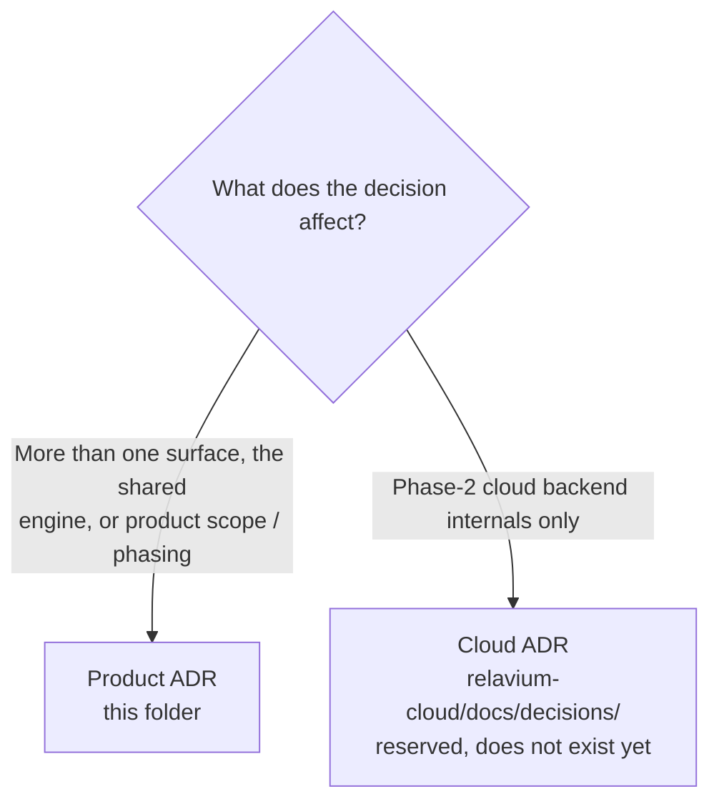

# Architecture Decision Records

Every non-trivial architectural, product, or process decision in Relavium is recorded here as an **ADR** (Architecture Decision Record) using a lightweight **MADR** (Markdown Architectural Decision Records) style.

## Why ADRs

- They preserve the **why**, not just the **what**. The reasoning behind a choice is the information that decays fastest and is most expensive to re-derive later.
- They make the evolution of the project readable: you can follow the numbered history and see how the design language developed, including the options that were rejected.
- They give future contributors (human or AI) a way to disagree with a decision by writing a *new* ADR that supersedes an old one, rather than silently changing code or docs.

Concrete specifications (workflow/agent YAML, the SSE event schema, the IPC contract, store shapes, DB DDL) live in their canonical [reference/](../reference/README.md) files. ADRs cite those by relative link and never restate them; they capture the *decision and its drivers*, not the spec.

## Format

Every ADR is a single file named `NNNN-short-kebab-slug.md`, where `NNNN` is a zero-padded four-digit sequence number. Each one opens with an H1 title and bold metadata lines, then four sections:

- **Context** — the situation, the problem, the constraints that applied.
- **Decision** — the option chosen, the alternatives considered, and the drivers that connected them.
- **Consequences** — split into **Positive** and **Negative** effects, with mitigations where relevant.

Pinned tool and library versions are *not* restated in ADRs; they live in [tech-stack.md](../tech-stack.md) and are referenced from there.

## Two ADR spaces

Relavium will ship as more than one git repository. To avoid renumbering pain across repos, there are **two independent ADR number spaces** — one for this meta repo, one reserved for the Phase-2 cloud repo.

| Space | Location | Scope | Numbering |
|-------|----------|-------|-----------|
| **Product / cross-cutting ADR** | this repo `docs/decisions/` (this folder) | Decisions that touch more than one surface (desktop, CLI, VS Code, portal), the shared engine, or product scope / phasing | Independent `ADR-0001..` |
| **Cloud backend ADR** *(Phase 2)* | reserved `relavium-cloud/docs/decisions/` | Decisions internal to the Phase-2 cloud execution backend only (worker orchestration, queue tuning, secrets injection, VPC peering) | Independent `ADR-0001..` |

The two spaces are **deliberately separate**; a collision (e.g. two `ADR-0005`s) is expected and is not a problem — the files live in different repos. Renumbering would touch every cross-reference (high risk, no value), so it is never done. Citation convention: **"Product ADR-00NN"** (this folder) vs **"Cloud ADR-00NN"** (`relavium-cloud/docs/decisions/`).

The cloud repo and its ADR space do not exist yet — they are a Phase-2 carry-forward. See [ADR-0008](0008-local-first-phase-1-cloud-phase-2.md) for the phasing decision that creates this split, and the (Phase 2) [cloud architecture doc](../architecture/cloud-phase-2.md).

## Index

| # | Title | Status | Date |
|---|-------|--------|------|
| 0001 | [Tauri v2 over Electron for the desktop app](0001-tauri-v2-over-electron.md) | Accepted | 2026-06-03 |
| 0002 | [Vite + React 19 + TanStack Router, not Next.js](0002-vite-react-tanstack-not-nextjs.md) | Accepted | 2026-06-03 |
| 0003 | [Pure TypeScript workflow engine, not LangGraph-Python](0003-pure-ts-engine-not-langgraph-python.md) | Accepted | 2026-06-03 |
| 0004 | [Vercel AI SDK for multi-LLM](0004-vercel-ai-sdk-multi-llm.md) | Superseded by 0011 | 2026-06-03 |
| 0005 | [SQLite + Drizzle local, PostgreSQL cloud](0005-sqlite-drizzle-local-postgres-cloud.md) | Accepted | 2026-06-03 |
| 0006 | [OS keychain for API keys](0006-os-keychain-for-api-keys.md) | Accepted | 2026-06-03 |
| 0007 | [The desktop app is not an IDE](0007-desktop-is-not-an-ide.md) | Accepted | 2026-06-03 |
| 0008 | [Local-first Phase 1, cloud Phase 2](0008-local-first-phase-1-cloud-phase-2.md) | Accepted | 2026-06-03 |
| 0009 | [Git-native workflow and agent YAML](0009-git-native-workflow-yaml.md) | Accepted | 2026-06-03 |
| 0010 | [Zustand direct subscriptions for ReactFlow](0010-zustand-direct-subscriptions-for-reactflow.md) | Accepted | 2026-06-03 |
| 0011 | [Internal multi-LLM abstraction (@relavium/llm)](0011-internal-llm-abstraction.md) | Accepted | 2026-06-03 |
| 0012 | [Dual-mode inference — managed inference as an opt-in third execution mode](0012-managed-inference-dual-mode.md) | Accepted | 2026-06-03 |
| 0013 | [Managed-mode provider-key vault and key pools](0013-managed-key-vault-and-pools.md) | Accepted | 2026-06-03 |
| 0014 | [Managed-mode metering, quota, and billing](0014-managed-metering-quota-and-billing.md) | Accepted | 2026-06-03 |
| 0015 | [Managed-mode data handling and compliance posture](0015-managed-mode-data-handling-and-compliance.md) | Accepted | 2026-06-03 |
| 0016 | [Hono as the `apps/api` framework](0016-api-framework-hono.md) | Accepted | 2026-06-04 |
| 0017 | [Bun as the `apps/api` runtime](0017-cloud-runtime-bun.md) | Accepted | 2026-06-04 |
| 0018 | [Desktop execution model — engine in WebView, Rust-delegated LLM egress](0018-desktop-execution-and-rust-egress.md) | Accepted | 2026-06-04 |
| 0019 | [Node-side OS-keychain access for the CLI — a maintained library, not the archived keytar](0019-cli-node-keychain-library.md) | Accepted | 2026-06-04 |
| 0020 | [Zod as the runtime schema and validation library](0020-zod-runtime-schema-library.md) | Accepted | 2026-06-04 |

## Creating a new ADR

1. Copy the structure of an existing ADR to the next available number: `NNNN-your-slug.md`.
2. Fill in the H1, bold **Status** / **Date** / **Related** lines, then `## Context`, `## Decision`, `## Consequences` (`### Positive` / `### Negative`).
3. Start at status `Accepted` once the decision is settled; cross-link sibling ADRs and reference [tech-stack.md](../tech-stack.md) for versions.
4. If a later ADR overrides this one, mark the old one `Superseded by NNNN` and link forward. Do **not** delete or rewrite the old ADR — the historical reasoning is the point.
5. To **refine, clarify, or reconcile** an Accepted ADR *without reversing it* (e.g. a later ADR refines its mechanism), amend it **in place** with a dated `> Amended YYYY-MM-DD: …` note that points to the driving ADR — never a silent rewrite. Reversing a decision is a supersession (step 4), not an amendment. The rule is in [documentation-style.md](../standards/documentation-style.md) §7.
