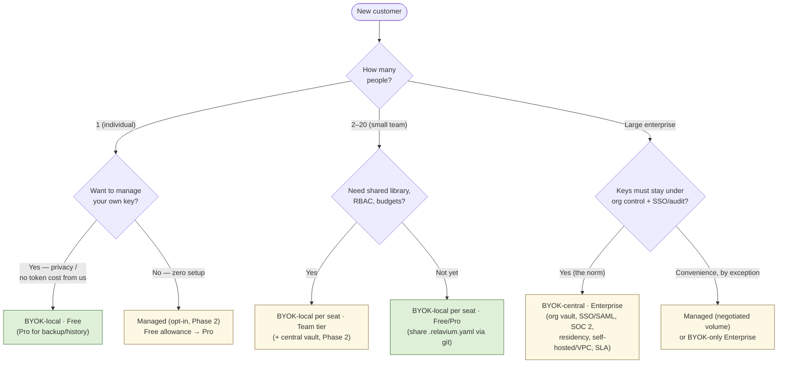

# Deployment models — how each customer segment adopts Relavium

- **Status**: Accepted
- **Related**: [vision.md](vision.md), [product-constraints.md](product-constraints.md), [uvp.md](uvp.md), [decisions/0012-managed-inference-dual-mode.md](decisions/0012-managed-inference-dual-mode.md), [decisions/0008-local-first-phase-1-cloud-phase-2.md](decisions/0008-local-first-phase-1-cloud-phase-2.md), [architecture/key-management.md](architecture/key-management.md), [reference/portal/api-reference.md](reference/portal/api-reference.md), [analysis/managed-inference-business-model-2026-06-03.md](analysis/managed-inference-business-model-2026-06-03.md)

This document is the end-to-end map of **how each customer segment adopts and runs
Relavium** — which execution mode they use, who holds the LLM key and where, which
licensing tier fits, who pays for tokens, how they onboard, what governance they
need, and how they graduate to the next segment. It joins three already-decided
pieces into one customer-facing narrative: the **three execution modes** (the
[dual-mode decision, ADR-0012](decisions/0012-managed-inference-dual-mode.md)), the
**local-first phasing** ([ADR-0008](decisions/0008-local-first-phase-1-cloud-phase-2.md)),
and the **licensing tiers** (canonical in
[reference/portal/api-reference.md](reference/portal/api-reference.md#licensing-tiers)).

This is a routing/strategy doc — it **cites** the canonical homes for modes, keys,
tiers, and economics rather than restating them. For the secret-handling mechanics
behind each key model, see [architecture/key-management.md](architecture/key-management.md).

## The two axes every segment is placed on

A deployment model is just a point chosen on two independent axes:

- **Execution mode** — *where the LLM key lives and who calls the provider.* Three
  values behind the one `LLMProvider` seam, defined in
  [ADR-0012](decisions/0012-managed-inference-dual-mode.md):
  - **BYOK-local** (`local`) — the user's own key in the **OS keychain**, calls go
    **direct** from the user's machine to the provider. The Phase-1 default; ~90%+
    software gross margin; the zero-egress privacy guarantee. **Available first.**
  - **BYOK-central** (`cloud`, *a.k.a. BYOK-cloud*) — the **org's** keys held in a
    **central server-side vault** and **injected server-side** by a cloud worker.
    The user (org) still pays the provider directly; Relavium never meters tokens.
    The enterprise key model. *(Phase 2.)*
  - **Managed** (`managed`) — **Relavium's** keys, **metered and billed**; only LLM
    egress is proxied through Relavium's gateway (the **engine still runs locally**).
    The opt-in convenience mode for those who would rather not manage a key.
    *(Phase 2.)*
- **Licensing tier** — *what collaboration, governance, and managed-usage envelope
  the customer pays for.* The canonical tier matrix lives in
  [reference/portal/api-reference.md](reference/portal/api-reference.md#licensing-tiers);
  numbers below are **illustrative**, locked with the merchant-of-record before
  launch.

The load-bearing rule, from [product-constraints.md](product-constraints.md): **no
segment is forced into managed.** BYOK stays a complete, first-class, non-degraded
path for every segment in every phase. Managed is *additive convenience*, never a
replacement and never a paywall in front of BYOK.

## At-a-glance: segment → deployment model

| Segment | Recommended mode | Key model (who holds it / where / who injects) | Recommended tier | Who pays for tokens | Governance | Phase available |
|---------|------------------|------------------------------------------------|------------------|---------------------|------------|-----------------|
| **Individual developer** | **BYOK-local** (default); **managed** opt-in if they don't want to manage a key | User's own key, **OS keychain**, injected **on the user's machine** | **Free** (BYOK, $0); **Pro** for backup/history/analytics | The **user** pays the provider directly (managed: prepaid credits to Relavium) | Personal — none required | **Phase 1** (BYOK-local). Managed/Pro: Phase 2 |
| **Small team (2–20)** | **BYOK-local** per seat (default); **managed** opt-in per seat | Each member's own key in their **OS keychain**; *(Phase 2)* optional **central key vault** for shared keys | **Team** (shared library, RBAC, budgets; **default key model BYOK-local-per-seat**, central key vault an optional Phase-2 add-on) | Each member pays their provider (or one org provider account); managed billed to the team | Shared agent library, RBAC, per-seat/team budgets | **Phase 1** for BYOK-local + git-shared YAML. Team tier (RBAC, budgets, optional central vault): Phase 2 |
| **Large enterprise (e.g. 300 employees)** | **BYOK-central** (org keys, server-side); BYOK-local still available; managed only by negotiated exception | **Org-level** provider keys in a **central server-side vault**, **injected server-side** by the cloud worker — **never issued per-employee** | **Enterprise** (custom annual/seat) | The **enterprise** pays its own provider under its **own provider contract** | SSO/SAML, SOC 2 audit, central key mgmt + rotation, data residency, self-hosted/VPC, SLA | **Phase 2** (central vault + SSO/audit). BYOK-local usable in Phase 1 for pilots |

Mode definitions and the metered/billed column are canonical in
[ADR-0012](decisions/0012-managed-inference-dual-mode.md#decision); the tier columns
are canonical in
[reference/portal/api-reference.md](reference/portal/api-reference.md#licensing-tiers).

## Decision guide — picking a mode and tier

Green = available in **Phase 1**; amber = **Phase 2** capabilities. The two questions
that actually move a customer between modes are **privacy/control** (keep keys under
your own roof → BYOK) and **convenience** (don't want to manage a key → managed) —
*size* only decides the governance tier on top.

---

## Individual developer

**End-to-end: discovery → first run on their own key, locally, in minutes.**

- **Recommended mode.** **BYOK-local** is the default and the whole point of Phase 1:
  install, paste a provider key, run — no account, no server, no data leaving the
  machine. A developer who would rather not obtain a key can opt into **managed**
  *(Phase 2)* and run on a small included allowance with zero key setup.
- **Key model.** The developer's **own** provider key lives in their **OS keychain**
  and is injected **on their own machine**; calls go **straight to the provider**.
  Nothing transits Relavium. Mechanics: [architecture/key-management.md](architecture/key-management.md);
  keychain handling: [reference/desktop/keychain-and-secrets.md](reference/desktop/keychain-and-secrets.md).
- **Recommended tier.** **Free** ($0) for unlimited BYOK on every surface; **Pro**
  *(~$20/seat, Phase 2, illustrative)* adds cloud backup, full run history, and usage
  analytics. Tiers: [reference/portal/api-reference.md](reference/portal/api-reference.md#licensing-tiers).
- **Who pays for tokens.** The **developer pays the provider directly** under their
  own account — Relavium carries **zero token COGS** in BYOK (the ~90%+ software
  margin). In managed, they prepay credits to Relavium against a hard cap (no
  surprise bill); economics in
  [analysis/managed-inference-business-model-2026-06-03.md](analysis/managed-inference-business-model-2026-06-03.md).
- **Onboarding flow.** *Discovery* (a shared `.relavium.yaml`, the VS Code
  marketplace, or the CLI) → *install* the desktop app / extension / `npm i -g`
  the CLI (**no sign-in required**) → *key setup* (paste a provider key into the
  keychain) → *first run* (Run button, `relavium run`, or VS Code right-click;
  target install-to-value under 3 minutes per [vision.md](vision.md)).
- **Collaboration / governance.** None required — this is a single user. Sharing a
  `.relavium.yaml` over git is the only "collaboration," and it is free.
- **How they graduate.** The moment a teammate runs their shared workflow, they have
  become a **small team** — see below. The upgrade trigger is *people*, not
  capability: shared library, roles, or a shared budget pulls them to the **Team**
  tier.
- **Support / SLA.** Community + docs; no SLA. (SLAs attach to Enterprise.)

## Small team (2–20)

**End-to-end: BYOK-local per seat, workflows shared as git-committed YAML, governance added as the team grows.**

- **Recommended mode.** **BYOK-local per seat** — every member keeps their own key
  in their own keychain and runs locally; the team's shared asset is the
  **git-committed `.relavium.yaml`** (the viral wedge in [uvp.md](uvp.md)). A team
  that prefers not to hand each member a key can adopt **managed** per seat, or
  *(Phase 2)* a shared **central key vault** so a few org keys back the whole team.
- **Key model.** Default: each member's **own** key in **their** OS keychain,
  injected locally. *(Phase 2)* optional **central vault** holding shared org keys,
  injected server-side — the same mechanism the enterprise uses, scoped to a small
  team. Keys are **org/workspace/project-scoped, never per-employee**.
  See [architecture/key-management.md](architecture/key-management.md).
- **Recommended tier.** **Team** *(~$30–40/seat, Phase 2, illustrative)* — shared
  agent library, **RBAC**, and per-seat/team **budgets**. The Team tier's **default
  key model is BYOK-local-per-seat** (each member's own key in their own keychain,
  workflows shared as git-committed YAML); the **central org key vault** is an
  **optional Phase-2 add-on** for teams that prefer a few shared org keys — *not* the
  tier default. Before any of this is needed, the team can run on **Free/Pro** and
  share via git. The tier matrix (and this default-BYOK-local / optional-vault model)
  is canonical in
  [reference/portal/api-reference.md](reference/portal/api-reference.md#licensing-tiers).
- **Who pays for tokens.** Each member pays their provider directly (BYOK), **or**
  one **org provider account** is billed for the shared keys; in managed, usage is
  billed to the team against the tier's included cap + overage. Provider keys are
  **org-level**, not issued per employee.
- **Onboarding flow.** *Discovery* (a teammate's workflow file) → *install* per
  member → *key setup* (each member's own key, or pull shared org keys from the
  central vault in Phase 2) → *first run* of the shared workflow → *governance opt-in*
  (sign in on the portal to enable the shared library, RBAC, and budgets).
- **Collaboration / governance.** Shared/published **agent library**, **RBAC**
  (viewer / runner / editor / admin), per-seat and team **budgets/quota**, and a
  unified human-gate inbox. These gate on **scale**, not capability — capability is
  never paywalled.
- **How they graduate.** Triggers to **Enterprise**: a need for **SSO/SAML**, a
  **SOC 2 audit trail**, **centrally-managed key rotation**, **data residency**, or
  a **self-hosted/VPC** deployment — i.e. when *who-can-do-what* must be enforced and
  proven, not just configured.
- **Support / SLA.** Standard support; no contractual SLA until Enterprise.

## Large enterprise (e.g. 300 employees)

**End-to-end: org keys in a central server-side vault, injected server-side, behind SSO/SAML and SOC 2 audit, with the enterprise's own provider contract.**

- **Recommended mode.** **BYOK-central** (`cloud` / BYOK-cloud) is the enterprise key
  model: the org's provider keys live in a **central server-side vault** and are
  **injected server-side** by the cloud worker, so no key ever touches an employee's
  machine. **BYOK-local stays available** for pilots and high-trust individuals, and
  is the recommended path to run an evaluation in Phase 1 before the Phase-2 controls
  land. **Managed** is offered only by **negotiated exception** (committed volume) for
  orgs that explicitly want it; many enterprises stay **BYOK-only** so the key never
  leaves their control.
- **Key model.** **Org-level** keys (org / workspace / project scoped) in the
  **central vault**, injected **server-side**, **never issued per-employee**. The
  enterprise holds its **own provider contract**, so spend, rate limits, and data
  terms are theirs. Rotation is centrally managed. Vault and pool mechanics:
  [architecture/key-management.md](architecture/key-management.md) and
  [ADR-0013](decisions/0013-managed-key-vault-and-pools.md) (the analogous
  Relavium-held pool design).
- **Recommended tier.** **Enterprise** — custom annual/per-seat. Adds **SSO/SAML
  (OIDC)**, **SOC 2 audit logs + retention**, **central key management + rotation**,
  **data residency**, **self-hosted / VPC** deployment, and an **SLA**. Tiers:
  [reference/portal/api-reference.md](reference/portal/api-reference.md#licensing-tiers).
- **Who pays for tokens.** The **enterprise pays its own LLM provider directly**
  under its own contract (BYOK) — Relavium sells the **software + governance**
  per-seat, not the tokens. If a managed exception is negotiated, it is committed-use
  pricing, separately metered.
- **Onboarding flow.** *Discovery* (often a bottom-up BYOK-local pilot by an
  individual or a team) → *procurement / security review* (SOC 2, DPA, residency) →
  *SSO/SAML setup* + tenant provisioning → *central key setup* (org keys loaded into
  the vault, rotation policy set — keys never sent to employees) → *RBAC + budgets*
  → *first governed run* with audit logging on.
- **Collaboration / governance.** The full control plane: SSO/SAML identity, team
  workspaces + RBAC, immutable **audit** for SOC 2, enforced **quota/budgets**, data
  residency, and self-hosted/VPC options. The portal is a **control plane, not an
  execution plane** ([architecture/cloud-phase-2.md](architecture/cloud-phase-2.md)).
- **How they graduate / scale within.** Scaling here is *within* the segment: more
  seats, more workspaces, VPC peering, dedicated cloud execution, regional residency
  — all on the same engine and the same BYOK-central key model.
- **Support / SLA.** Contractual **SLA**, dedicated support, and a security/compliance
  posture (SOC 2 trajectory, DPA, sub-processor list) — see
  [compliance/](compliance/).

---

## Phase availability — what each segment can do today vs. Phase 2

| Capability | BYOK-local | BYOK-central | Managed | Phase |
|------------|:----------:|:------------:|:-------:|-------|
| Individual runs on own key, no account | yes | — | — | **Phase 1** |
| Small-team git-shared workflows | yes | — | — | **Phase 1** |
| Shared agent library, RBAC, budgets (Team) | yes (BYOK keys) | optional shared vault | optional | **Phase 2** |
| Central server-side key vault + rotation | — | yes | n/a (Relavium's keys) | **Phase 2** |
| SSO/SAML, SOC 2 audit, residency, self-hosted/VPC (Enterprise) | with BYOK keys | yes | by exception | **Phase 2** |
| Zero-setup metered inference (no key) | — | — | yes | **Phase 2** (first Phase-2 deliverable) |

Per [ADR-0012](decisions/0012-managed-inference-dual-mode.md) and
[ADR-0008](decisions/0008-local-first-phase-1-cloud-phase-2.md): **BYOK-local ships
first and unchanged**; managed inference is the **first Phase-2 deliverable** (a thin
gateway, engine stays local) and is **decoupled from** the cloud-execution +
central-vault plane that BYOK-central and the Enterprise tier depend on. Managed mode
is additionally gated behind the launch-blocking preconditions (provider-ToS R1,
merchant-of-record, KVKK/GDPR posture) in
[product-constraints.md](product-constraints.md#phase-2-preconditions-for-managed-inference).

## The through-line

- **Individuals and small teams thrive on BYOK-local** — Phase 1, available first,
  ~90%+ software margin, zero token risk, the zero-egress privacy guarantee.
- **Enterprises need the Phase-2 central key vault + SSO/audit** — BYOK-central keeps
  org keys under the org's roof and injects them server-side, never per-employee.
- **Managed is the opt-in convenience tier** for anyone who would rather not manage a
  key — metered and billed, never forced on any segment.

BYOK stays first-class for **all** segments; the customer chooses control (BYOK) or
convenience (managed), and the tier only layers on the governance their size demands.
