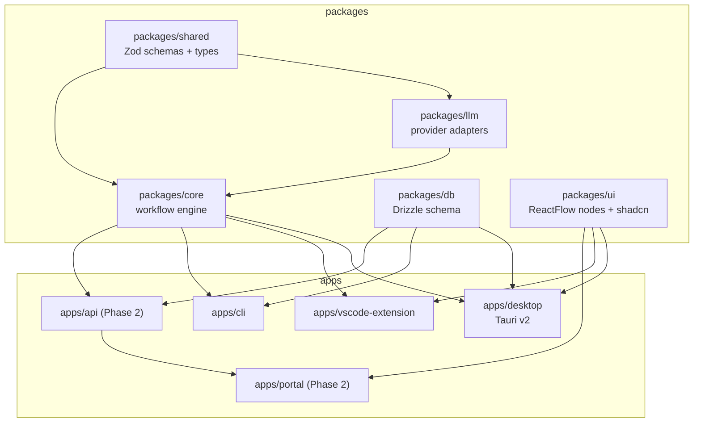

# Project Structure

- **Status**: Accepted
- **Related**: [tech-stack.md](tech-stack.md), [roadmap/README.md](roadmap/README.md), [architecture/shared-core-engine.md](architecture/shared-core-engine.md)

Relavium is a **Turborepo monorepo with pnpm workspaces**. Every package is
TypeScript with shared `tsconfig` bases, a single root `package.json` for tooling
(ESLint, Prettier, Vitest), and Turborepo remote cache for CI. There are five app
surfaces and five shared packages.

## Layout

## Apps

| Path | Role |
|------|------|
| `apps/desktop` | Tauri v2 desktop app. `src-tauri/` holds Rust commands + plugin config; `src/` holds the React + Vite frontend (canvas, ReactFlow nodes, Zustand stores, run UI). Calls `@relavium/core` via Tauri IPC, OS APIs (keychain, fs, tray) via Tauri plugins. |
| `apps/vscode-extension` | VS Code extension. `src/extension.ts` is the activation entry; `src/engine/` bundles the in-process engine (imports `@relavium/core`); `src/panels/` holds WebviewPanel React UIs. Published as `relavium.relavium`. |
| `apps/cli` | Terminal CLI. `commander.js` entry with `run / list / create / import / export / status / logs / gate` subcommands; `ink` for streaming TUI. Installed via `npm i -g relavium`. |
| `apps/portal` | **Phase 2.** Cloud web portal — Vite + React SPA, TanStack Router routes, shares `packages/ui` canvas. Calls `apps/api` over HTTPS. |
| `apps/api` | **Phase 2.** Cloud backend — Hono on Bun, wraps `@relavium/core` with BullMQ dispatch + Redis-stream SSE, Postgres via Drizzle. Holds BullMQ worker pools. |

## Packages

| Path | Role |
|------|------|
| `packages/core` | **`@relavium/core`** — the shared execution engine and the single most important package. Exports `WorkflowEngine`, `AgentRunner`, `WorkflowYAMLParser`, `ToolNormalizer`, `RunEventBus`. **Zero platform-specific imports** — runs identically in the Tauri WebView, VS Code extension host, Node.js CLI, and Bun API. See [architecture/shared-core-engine.md](architecture/shared-core-engine.md). |
| `packages/shared` | **`@relavium/shared`** — Zod schemas, TypeScript types, constants used everywhere (`WorkflowSchema`, `AgentSchema`, `RunSchema`, `NodeSchema`, `EdgeSchema`, `RunEvent`, `CostEvent`, `HumanGateEvent`). No runtime deps except zod. |
| `packages/llm` | **`@relavium/llm`** — provider adapters (`AnthropicAdapter`, `GeminiAdapter`, and a shared OpenAI-compatible adapter serving both OpenAI and DeepSeek via a custom `baseURL`) normalizing streaming, tool calls, and usage tokens to the canonical format. Houses `ToolNormalizer`, `CostTracker`, `FallbackChain`. Three adapters, per [tech-stack.md](tech-stack.md) and ADR-0011. |
| `packages/db` | **`@relavium/db`** — Drizzle schema + migrations. Same table names and column types for SQLite (local) and Postgres (cloud), different driver. See [reference/desktop/database-schema.md](reference/desktop/database-schema.md). |
| `packages/ui` | **`@relavium/ui`** — shared React component library. All ReactFlow custom node types (Agent, Condition, FanOut, Aggregator, Loop, HumanGate, Input, Output, Tool) and edges, plus shadcn/ui base + Tailwind config. Imported by desktop, VS Code panels, and portal for visual consistency. |

## Build Order

The engine is the critical path; surfaces are built only after it is proven.
The full sequencing rationale, milestones, and week targets live in
[roadmap/README.md](roadmap/README.md). In short:

1. `packages/shared` + `packages/llm` + `packages/core` — engine first.
2. `apps/cli` — proves the engine; fastest to ship; becomes the test harness.
3. `apps/desktop` (Tauri) + `packages/ui` — the main surface.
4. `apps/vscode-extension` — developer-workflow integration.
5. `apps/api` + `apps/portal` — **Phase 2** cloud layer.

> Never build surface code before the core engine is tested. The CLI exists in
> part to validate the engine API ergonomics before UI complexity is introduced.
