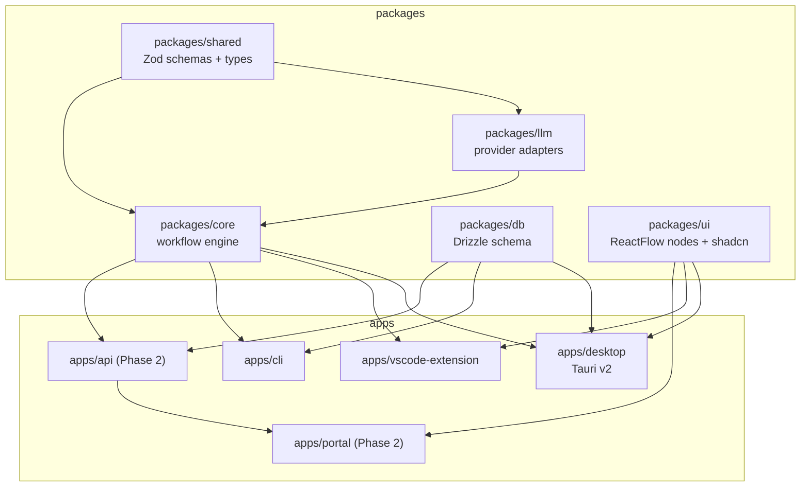

# Project Structure

- **Status**: Accepted
- **Related**: [tech-stack.md](tech-stack.md), [roadmap/README.md](roadmap/README.md), [architecture/shared-core-engine.md](architecture/shared-core-engine.md)

Relavium is a **Turborepo monorepo with pnpm workspaces**. Every package is
TypeScript with shared `tsconfig` bases, a single root `package.json` for tooling
(ESLint, Prettier, Vitest), and Turborepo remote cache for CI. There are **four
product surfaces** (desktop, VS Code, CLI, portal) plus a Phase-2 backend
(`apps/api`, infrastructure rather than a product surface), and five shared packages.

Every product surface exposes **both entry points of the one shared engine**: a
**conversational agent** (chat session) *and* a **workflow interface** (the runner
plus authoring), both backed by the same `@relavium/core` package. See the two
co-equal engine entry points in the `packages/core` row below.

## Layout

## Apps

| Path | Role |
|------|------|
| `apps/desktop` | Tauri v2 desktop app. `src-tauri/` holds Rust commands + plugin config; `src/` holds the React + Vite frontend (canvas, ReactFlow nodes, Zustand stores, run UI). Calls `@relavium/core` via Tauri IPC, OS APIs (keychain, fs, tray) via Tauri plugins. |
| `apps/vscode-extension` | VS Code extension. `src/extension.ts` is the activation entry; `src/engine/` bundles the in-process engine (imports `@relavium/core`); `src/panels/` holds WebviewPanel React UIs. Published as `relavium.relavium`. |
| `apps/cli` | Terminal CLI. `commander.js` entry with `run / list / create / import / export / status / logs / gate` (and `chat / chat-resume / chat-list / chat-export` *(build phase 2 — still Product Phase 1)*) subcommands; `ink` for streaming TUI. Installed via `npm i -g relavium`. |
| `apps/portal` | **Phase 2.** Cloud web portal — Vite + React SPA, TanStack Router routes. A **control plane** (dashboards, usage, quota, governance, run history, gate inbox); it uses `packages/ui` components but **not** the workflow-designer canvas — workflow authoring stays on the desktop/VS Code surfaces. Calls `apps/api` over HTTPS. |
| `apps/api` | **Phase 2.** Cloud backend — Hono on Bun, wraps `@relavium/core` with BullMQ dispatch + Redis-stream SSE, Postgres via Drizzle. Holds BullMQ worker pools. |

## Packages

| Path | Role |
|------|------|
| `packages/core` | **`@relavium/core`** — the shared execution engine and the single most important package. Exports **two co-equal entry points** — `WorkflowEngine` (the workflow runner) and `AgentSession` (the conversational agent entry point) — plus `AgentRunner`, `WorkflowYAMLParser`, `ToolRegistry`, `RunEventBus` (the `ToolNormalizer` lives in `packages/llm`, behind the seam — see the row below). Both entries share the `ToolRegistry`, the `@relavium/llm` seam, and the event bus. **Zero platform-specific imports** — runs identically in the Tauri WebView, VS Code extension host, Node.js CLI, and Bun API. See [architecture/shared-core-engine.md](architecture/shared-core-engine.md) and the [AgentSession contract](reference/contracts/agent-session-spec.md). |
| `packages/shared` | **`@relavium/shared`** — Zod schemas, TypeScript types, constants used everywhere (`WorkflowSchema`, `AgentSchema`, `RunSchema`, `NodeSchema`, `EdgeSchema`, `RunEvent`, `CostEvent`, `HumanGateEvent`). No runtime deps except zod. |
| `packages/llm` | **`@relavium/llm`** — provider adapters (`AnthropicAdapter`, `GeminiAdapter`, and a shared OpenAI-compatible adapter serving both OpenAI and DeepSeek via a custom `baseURL`) normalizing streaming, tool calls, and usage tokens to the canonical format. Houses `ToolNormalizer`, `CostTracker`, `FallbackChain`. Three adapters, per [tech-stack.md](tech-stack.md) and ADR-0011. |
| `packages/db` | **`@relavium/db`** — Drizzle schema + migrations. Same table names and column types for SQLite (local) and Postgres (cloud), different driver. See [reference/shared-core/database-schema.md](reference/shared-core/database-schema.md). |
| `packages/ui` | **`@relavium/ui`** — shared React component library. All ReactFlow custom node types (Agent, Condition, FanOut, Aggregator, Loop, HumanGate, Input, Output, Tool) and edges, plus shadcn/ui base + Tailwind config. The canvas node types are imported by desktop and VS Code panels; the portal imports only the shadcn/ui base + Tailwind layer for visual consistency (it is a control plane, not a canvas surface). |

## Build Order

The engine is the critical path; surfaces are built only after it is proven.
The full sequencing rationale, milestones, and week targets live in
[roadmap/README.md](roadmap/README.md). In short:

1. `packages/shared` + `packages/llm` + `packages/core` — engine first.
2. `apps/cli` — proves the engine; fastest to ship; becomes the test harness.
3. `apps/desktop` (Tauri) + `packages/ui` — the main surface.
4. `apps/vscode-extension` — developer-workflow integration.
5. `apps/api` + `apps/portal` — **Phase 2** cloud layer.

> Never build surface code before the core engine is tested. The CLI exists in
> part to validate the engine API ergonomics before UI complexity is introduced.
