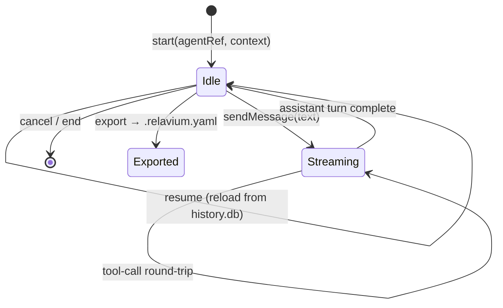

# Agent Session Specification

- **Status**: Stable
- **Validated by**: the `AgentSessionSchema` / `SessionMessageSchema` / `SessionContextSchema` Zod definitions in `@relavium/shared` — `SessionContextSchema` lands with the event union (1.L.0); `SessionMessageSchema` / `AgentSessionSchema` land with the agent-first sub-spine (1.V/1.X), as they reference the shared-owned `ContentPart`
- **Canonical home**: the runtime contract for an `AgentSession` — its lifecycle, message shape, context, and export-to-workflow contract
- **Related**: [workflow-yaml-spec.md](workflow-yaml-spec.md), [agent-yaml-spec.md](agent-yaml-spec.md), [config-spec.md](config-spec.md), [sse-event-schema.md](sse-event-schema.md) (the `session:*` event namespace), [../shared-core/llm-provider-seam.md](../shared-core/llm-provider-seam.md) (the `LlmMessage` runtime type this maps to), [../shared-core/built-in-tools.md](../shared-core/built-in-tools.md), [../desktop/database-schema.md](../desktop/database-schema.md) (the `agent_sessions` / `session_messages` tables), [../../architecture/agent-sessions.md](../../architecture/agent-sessions.md), [../../decisions/0024-agent-first-entry-point-agentsession.md](../../decisions/0024-agent-first-entry-point-agentsession.md), [../../decisions/0026-session-export-to-workflow.md](../../decisions/0026-session-export-to-workflow.md)

An **agent session** is an ongoing, multi-turn conversation between a user and a single agent. It is
Relavium's **agent-first entry point** — a first-class peer of a workflow run that **reuses the same
engine substrate** (the `AgentRunner`, the `ToolRegistry`, the `@relavium/llm` seam, and the event
bus) rather than a parallel implementation; see
[ADR-0024](../../decisions/0024-agent-first-entry-point-agentsession.md) for the decision and
[agent-sessions.md](../../architecture/agent-sessions.md) for how it is built. This document is the
**one canonical home** for the session *contract*; it **cites** the event schema, the DB schema, and
the seam rather than restating them.

> **Enforced source of truth.** The TypeScript shapes below are **illustrative**. The runtime-validated
> source of truth is the Zod schema set in `@relavium/shared`, from which the types are inferred
> ([ADR-0020](../../decisions/0020-zod-runtime-schema-library.md)). This document is the canonical
> human-readable contract; if the two diverge, this spec wins and the schema is corrected to it.

## What a session is (and is not)

- A session **binds one agent** (an `.agent.yaml`, [agent-yaml-spec.md](agent-yaml-spec.md)) and its
  `fallback_chain` for the whole conversation. There is **no mid-session agent switching** in Phase 1;
  multi-agent orchestration remains a *workflow* concern.
- A session is **multi-turn and stateful**: each user message produces an assistant turn that may
  include tool-call round-trips, exactly like a workflow `agent` node — the difference is the *entry
  point and lifetime*, not the execution.
- A session is **auto-persisted and resumable** (below); it is **not** a workflow run and does not
  appear in run history. It can be **exported** to a workflow ([export](#export-to-workflow)).

## Lifecycle



| Operation | Meaning |
| --- | --- |
| **start** | Open a session for an `agentRef` with an initial [`SessionContext`](#session-context). Allocates a `sessionId` and persists the session row. |
| **sendMessage** | Append a user [`SessionMessage`](#session-messages), run one assistant turn through the `AgentRunner` (streaming + tool-call loop), and append the assistant + tool messages. |
| **cancel** | Abort the in-flight turn via `AbortSignal`; the session stays resumable. |
| **resume** | Reload a persisted session (messages + context) and continue. |
| **export** | Serialize the session to a `.relavium.yaml` scaffold ([export](#export-to-workflow)). |

The turn loop, tool dispatch, streaming, and fallback are the **same** code paths a workflow `agent`
node uses; the session is a thin wrapper over the `AgentRunner` that manages conversation state and
context. The lifecycle emits the `session:*` event namespace — defined, with the run namespace, in
[sse-event-schema.md](sse-event-schema.md#session-event-namespace) (this spec does not enumerate event
names).

## Session context

`SessionContext` is the workspace situation a session runs against, auto-detected from the launching
surface and overridable by the user.

```ts
interface SessionContext {
  workingDir: string;        // workspace root (auto-detected; overridable)
  activeFile?: string;       // the surface's active file, if any
  selection?: { file: string; startLine: number; endLine: number };
  gitRef?: string;           // current branch / commit, for provenance
  fsScopeTier: 'sandboxed' | 'project' | 'full';  // same tiers as workflows; default sandboxed
  variables?: Record<string, string>;             // session-scoped {{ctx.*}} values
}
```

`fsScopeTier` and the command allowlist are the **same** filesystem-scope tiers and `allowedCommands`
policy a workflow uses (see [built-in-tools.md](../shared-core/built-in-tools.md#filesystem-permission-tiers)
and [workflow-yaml-spec.md](workflow-yaml-spec.md#tool-policy-spectools)); the chat-mode **defaults**
(`fs_scope`, the command allowlist, `default_model`, `max_messages`, and an optional pre-egress cost
cap `max_cost_microcents` / `on_exceed` — the same [ADR-0028](../../decisions/0028-workflow-resource-governance.md)
governor a workflow budget uses) live in the `[chat]` block of [config-spec.md](config-spec.md) and
reference those canonical homes — they are not re-declared here.

## Session messages

`SessionMessage` is the **persistence / transcript** type for a turn. It is **append-only** (mirroring
the run-event log): messages are never edited or deleted, only appended.

```ts
interface SessionMessage {
  id: string;
  sessionId: string;
  sequenceNumber: number;                 // monotonic per session
  role: 'system' | 'user' | 'assistant' | 'tool';
  content: DurableContentPart[];          // the PERSISTED content union (ADR-0031): handle-only media, signature-less reasoning
  modelId?: string;                       // canonical model id for an assistant turn (fallback-aware; mirrors session_messages.model_id)
  timestamp: string;                      // ISO 8601
}
```

> **Amended 2026-06-10 (ADR-0031 / 1.AD).** A persisted position references the **durable**
> content union, not the in-flight `ContentPart`: `DurableContentPart` (owned by
> `@relavium/shared`, see [llm-provider-seam.md](../shared-core/llm-provider-seam.md)
> §"Seam-shape amendments (ADR-0031)") makes media handle-only and drops the reasoning
> `signature` structurally — the engine's `deInlineMedia` pass is the in-flight→durable
> transform. Binding on the session-persistence implementation (1.X).

`SessionMessage` is **mapped to the seam's `LlmMessage` at call time, never copied** — when the
session calls a provider, the `AgentRunner` projects the persisted messages into the `LlmMessage`
shape owned by [llm-provider-seam.md](../shared-core/llm-provider-seam.md). **No vendor SDK type
crosses the seam** ([ADR-0011](../../decisions/0011-internal-llm-abstraction.md)); the
`DurableContentPart`/`ContentPart` unions are the same Relavium types the seam uses — the
projection resolves durable handles for egress, it never invents a new shape.

> **Relationship to the run `messages` table.** A session's messages are persisted in
> **`session_messages`**, bound to a **session** — distinct from the existing per-step run `messages`
> table, which is bound to a **`step_executions`** row within a workflow run. The two are deliberately
> separate (different lifecycle and FK parent); see the table definitions in
> [database-schema.md](../desktop/database-schema.md). They share a shape family but must not be
> merged, to avoid coupling the session and run persistence stories.

## Tools, secrets, and security scope

A session uses the **same** tool surface as a workflow agent: the built-in `ToolRegistry`
([built-in-tools.md](../shared-core/built-in-tools.md)), the same FS-scope tiers, and the same
mandatory guardrails (`run_command` allowlist; `git_commit` behind approval). Per
[ADR-0029](../../decisions/0029-tool-policy-hardening.md):

- a session inherits the agent's tools and may only **narrow** them, never escalate;
- a `secret`-typed value is **never interpolated** into a prompt or tool text;
- `http_request` / MCP egress is subject to the same SSRF policy as a workflow.

The user's own **conversational content** typed into a session is the user's data: it is persisted in
the **encrypted** `history.db` and is *not* a managed secret — this boundary is stated in
[security-review.md](../../standards/security-review.md).

## Events

A session emits on the **`session:*` namespace** — its single canonical home is
[sse-event-schema.md](sse-event-schema.md#session-event-namespace), which defines the `SessionEvent`
union, the shared base envelope, and `sequenceNumber` gap-detection. The **steering** events
(`agent:directive_injected` / `agent:context_compacted` / `agent:context_cleared`) are **reserved**
in Phase 1; the steering channel narrative lives in
[agent-sessions.md](../../architecture/agent-sessions.md).

## Export to workflow

Per [ADR-0026](../../decisions/0026-session-export-to-workflow.md), a session exports to a
`.relavium.yaml` **scaffold** that the author reviews before committing:

- the session's assistant turns become a **linear chain of `agent` nodes**, in order, carrying the
  agent binding, resolved prompts, and the tools used;
- the **full transcript is preserved in the workflow's durable `metadata` field** — a schema field that survives parse → serialize round-trips (not fragile comments), with secrets already excluded by
  the no-interpolation rule above);
- parallel / conditional / loop structure is **not** auto-inferred — the author adds it on the canvas.

The export **produces** the format owned by [workflow-yaml-spec.md](workflow-yaml-spec.md); the
**mapping** (session turn → `agent` node, transcript → metadata) is the contract owned here. The
desktop "Export to Canvas" affordance and the CLI `relavium chat-export` both drive this one contract.

## Validation and persistence

- Validated against `AgentSessionSchema` / `SessionMessageSchema` / `SessionContextSchema` (Zod, in
  `@relavium/shared`) — invalid input fails fast, like every other authored/runtime contract
  ([ADR-0023](../../decisions/0023-strict-authored-yaml-validation.md)).
- Persisted in the global encrypted `history.db` (`agent_sessions` + `session_messages`); the DDL is
  canonical in [database-schema.md](../desktop/database-schema.md). API keys never appear in a session
  row, a message, or an event payload (see [keychain-and-secrets.md](../desktop/keychain-and-secrets.md)).
