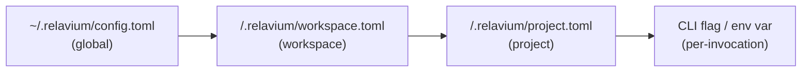

# Configuration Specification

- **Status**: Stable
- **Scope**: Where Relavium reads configuration from, and how global and per-project settings are merged.
- **Related**: [workflow-yaml-spec.md](workflow-yaml-spec.md), [agent-yaml-spec.md](agent-yaml-spec.md), [../desktop/keychain-and-secrets.md](../desktop/keychain-and-secrets.md), [../cli/commands.md](../cli/commands.md), [../../architecture/local-first-and-security.md](../../architecture/local-first-and-security.md)

Relavium uses a two-level configuration model that mirrors VS Code's **user vs. workspace** split: a **global** config in the user's home directory, and a **per-project** config committed alongside the code. The per-project layer overrides the global layer. A directory the user opens *is* the workspace — there is no separate "project" concept; the filesystem directory is the unit of organization, which makes git integration trivial.

Config files are **TOML 1.0**. They are decoded to plain objects by the surface that reads them (the CLI in build phase 2 — [ADR-0048](../../decisions/0048-toml-config-parser.md)), then validated against the strict `@relavium/shared` config schemas ([ADR-0033](../../decisions/0033-strict-config-files-amends-0023.md)); the engine never reads config files itself.

## Locations

### Global — `~/.relavium/`

Created on first launch. Holds user-wide preferences and the registry of MCP servers.

```
~/.relavium/
  config.toml        # global preferences, MCP server registrations, update channel
  ipc.json           # desktop loopback server discovery (port, authToken, pid) — see ipc-contract.md
  history.db         # cross-project run history (SQLite; desktop: SQLCipher, CLI: unencrypted + 0600/0700 OS perms — ADR-0050) — see desktop/database-schema.md
  secrets.enc        # RESERVED encrypted-file key fallback (deferred past v1.0; Argon2id KDF) — see keychain-and-secrets.md
  tmp/               # scratch space agents may write to under the sandbox tier
```

> API keys are **not** stored in `config.toml`. They live in the OS keychain; the CLI's headless/CI fallback is the env var `RELAVIUM_<PROVIDER>_API_KEY`. The `secrets.enc` encrypted-file fallback is **deferred past v1.0** (it needs a proper Argon2id KDF). See [../desktop/keychain-and-secrets.md](../desktop/keychain-and-secrets.md).

### Per-project — `<projectRoot>/.relavium/`

Committed to git (minus secrets) so a team shares the same workflows and agents.

```
<projectRoot>/.relavium/
  project.toml                       # project-level defaults and overrides
  workspace.toml                     # OPTIONAL shared variables (default model, shared tool configs)
  workflows/*.relavium.yaml          # workflow definitions
  agents/*.agent.yaml                # agent definitions
  runs.db                            # OPTIONAL project run metadata (summaries only, no event logs)
  .relaviumignore                    # which .relavium/ files git should ignore (e.g. secrets, runs.db)
```

Opening a workspace loads every `*.relavium.yaml` and `*.agent.yaml` under `<projectRoot>/.relavium/`. An optional `workspace.toml` can declare shared variables (default model, shared tool configs) inherited by all workflows in that workspace.

## Resolution order

For any single setting, the **last writer wins**, evaluated in this order:



1. **Global** (`~/.relavium/config.toml`) — lowest precedence; user defaults.
2. **Workspace** (`workspace.toml`) — shared, committed variables for everything in the directory.
3. **Project** (`project.toml`) — project-specific overrides.
4. **Per-invocation** — a CLI flag or environment variable for a single run; highest precedence. See [../cli/commands.md](../cli/commands.md).

MCP server registrations follow the same merge: globally registered servers (`config.toml`) plus any project-scoped servers. See [../shared-core/mcp-integration.md](../shared-core/mcp-integration.md).

## `config.toml` (global) — keys

```toml
update_channel = "stable"          # stable | beta

[preferences]
default_model = "claude-sonnet-4-6"
reasoning_effort = "medium"        # ADR-0066 §6: the GLOBAL default reasoning-effort tier — off | low | medium | high | max; the fallback BELOW any [chat].reasoning_effort. Written by the /models picker's effort sub-step. Absent ⇒ no reasoning control (the provider default).
theme = "dark"

[[mcp_servers]]                    # repeatable — an agent references one by name via `ref:` (ADR-0052 §5)
name = "filesystem"
transport = "stdio"                # stdio | http | websocket
command = "npx -y @modelcontextprotocol/server-filesystem"
args = ["--root", "~/projects"]
autostart = true                   # accepted, reserved for a future always-on pool — NOT acted on in 2.R (a server connects on demand)
# url = "https://host/mcp"         # for transport = http (Streamable HTTP); a `websocket` server uses wss://
# env = { TOKEN = "{{secrets.github_token}}" }   # stdio only — resolved from the isolated mcp-secret:* keychain, injected into the spawned child; rejected on a network transport (header-auth is a follow-up)
# allow_local_endpoint = true      # opt into a private/loopback url (network transports only, ADR-0053 §3)
```

A `transport = "http"` / `"websocket"` registration requires a `url` (`http(s)` for `http`, `ws(s)` for
`websocket`); the url is SSRF-guarded (a private/loopback host is rejected unless `allow_local_endpoint` is set;
a remote host must be `https`/`wss`) and must not embed credentials. A registration's transport is
**`stdio | http | websocket`**, plus the deprecated **`sse`** alias of `http` (accepted for older servers, same
`http(s)` url) — symmetric with an inline `agent.mcp_servers` entry; prefer `http` for new servers. The
stdio-only fields (`command`/`args`/`env`) are rejected on a network registration, and the network-only fields
(`url`/`allow_local_endpoint`) on a stdio one. An agent consumes a registration with `- ref: filesystem` (see
[../shared-core/mcp-integration.md](../shared-core/mcp-integration.md)).

> **Writing the global config** ([ADR-0063](../../decisions/0063-cli-config-write-contract.md)). Config is
> almost entirely **read-only** (hand-edited, git-committed). The one write path is the CLI persisting a chosen
> default: `/models` and the 2.5.G onboarding wizard set **`[preferences].default_model`**, and (ADR-0066 §6) the
> `/models` picker's **effort sub-step** additionally sets **`[preferences].reasoning_effort`** for a reasoning
> model — **only** those two `[preferences]` keys, and only through a **typed setter** (never a generic key/value
> writer), so a secret can never be written by construction (there is no `api_key` field in the schema; keys live
> only in the OS keychain, [ADR-0006](../../decisions/0006-os-keychain-for-api-keys.md)). A partial write leaves
> the other key unchanged (a model-only pick never clears a prior effort default).
> The write is **atomic + durable** (a `0600` temp file in the `0700` `~/.relavium/`, `fsync` the file, `rename`
> over the target, then `fsync` the parent directory so the rename itself survives a crash) and it both
> re-validates the merged object against the strict `GlobalConfigSchema` AND re-parses the emitted TOML back
> through the schema before the rename — so "the file always re-parses on the next load" is a **verified**
> guarantee, and on any failure `config.toml` is left untouched. Two documented tradeoffs: re-serialization
> **drops comments and key ordering** in `config.toml` (the global file is a preference store, not a
> hand-curated artifact — project/workspace files are never written by the tool); and there is **no lock**, so
> two concurrent writes resolve **last-writer-wins** (a lost update, never a torn file) — acceptable for a
> single-user, rarely-written preference store.

## `project.toml` / `workspace.toml` (project) — keys

```toml
[defaults]
model = "claude-sonnet-4-6"        # default model for agents that omit one
fs_scope = "sandboxed"             # sandboxed | project | full (see filesystem tiers)
max_tokens_estimate = 4096         # per-call output-token estimate the pre-egress budget governor uses when a node/session omits maxTokens (ADR-0028) — not the model's absolute max, which would over-block
media_job_poll_initial_ms = 5000   # async media-job (generateMedia LRO) first-poll delay + backoff base (1.AG/ADR-0045 §7)
media_job_poll_max_ms = 30000      # backoff cap: poll interval = min(initial × 2^(n-1), max), no jitter
media_job_deadline_ms = 1800000    # abandon a job past this (from submit) as a retryable timeout (30 min)
media_gc_grace_days = 7            # grace (in DAYS, minimum 1 — the schema rejects 0) before a zero-reference media handle's CAS bytes are reclaimed by the host media GC (P4/D11, ADR-0042 §4c). Resolved by the CLI (DAYS → ms) and threaded into the run-end GC's grace window; omit ⇒ the built-in 7-day default (DEFAULT_MEDIA_GC_GRACE_MS).

[defaults.media_cost_estimate]     # per-modality media-output UNIT-COUNT default for the pre-egress media cost estimate (1.AF/D17, ADR-0044 §3) — a COUNT, not a price; the per-unit price lives in the model catalog. Used when a media-output turn declares no volume. Omit the table for text-only workflows.
image = 1                          # assumed images per media-output turn
audio = 60                         # assumed audio-SECONDS per media-output turn
video = 10                         # assumed video-SECONDS per media-output turn

[variables]                        # available to all workflows in this workspace
focus_area = "security and type safety"

[chat]                             # agent-session (chat-mode) defaults — see contracts/agent-session-spec.md
default_model = "claude-sonnet-4-6"   # model for a chat session that names none; absent at every [chat] layer ⇒ falls back to global [preferences].default_model (ADR-0063)
reasoning_effort = "medium"        # ADR-0066: reasoning-effort tier baked onto the DEFAULT chat agent — off | low | medium | high | max; absent ⇒ no reasoning control (the provider default). Ignored on a model without a controllable reasoning tier.
fs_scope = "sandboxed"             # SAME tier enum as [defaults].fs_scope above (not re-listed here)
max_turns = 50                     # hard session TURN cap → SessionDeps.maxTurns (DoS fail-safe; absent ⇒ engine default 50; positiveInt — 0 is rejected here) — DISTINCT from max_messages
max_messages = 200                 # history-trim threshold — consumed by `/trim` + auto-compaction (ADR-0062); older turns trimmed/summarized
auto_compact = true                # ADR-0062: auto-compact when a turn's real input tokens exceed compact_threshold × the model's context window (absent ⇒ true)
compact_threshold = 0.8            # ADR-0062: the context-window fraction that triggers auto-compaction; a fraction in (0, 1] (absent ⇒ 0.8)
max_cost_microcents = 0            # 0 = unbounded; >0 = per-session pre-egress cost cap (the same governor as a workflow budget — ADR-0028)
on_exceed = "pause_for_approval"   # fail | pause_for_approval | warn — when a session hits its cap
allowed_commands = []              # !-shell allowlist (ADR-0061): EXACT full-command-string match; EMPTY/absent ⇒ !-shell disabled
allowed_command_globs = []         # opt-in glob form of the !-shell allowlist (riskier); empty/absent ⇒ none
```

> **Project-scoped MCP servers.** `project.toml` / `workspace.toml` may also declare
> `[[mcp_servers]]` entries (the same shape as the global block above); they merge with the
> global registrations per the [resolution order](#resolution-order) — a project server
> overrides a global one with the same `name`. (Schema: `ProjectConfigSchema.mcp_servers`.)

> The `[chat]` block sets defaults for the **agent-first** chat entry point
> ([agent-session-spec.md](agent-session-spec.md), [ADR-0024](../../decisions/0024-agent-first-entry-point-agentsession.md)),
> distinct from `[defaults]` (which governs **workflow** runs). Its `allowed_commands` /
> `allowed_command_globs` keys (the 2.5.D `!`-shell allowlist, detailed below) **map to the SAME engine
> `allowedCommands` / `allowedCommandGlobs` policy** a workflow `run_command` uses (canonical home
> [workflow-yaml-spec.md](workflow-yaml-spec.md#tool-policy-spectools); empty/absent ⇒ `run_command` disabled) —
> a chat surface over the **one** command allowlist, never a chat-specific fork of it. Session history persists
> in the existing `history.db` — there is no separate `sessions.db`. A chat session may carry its own **pre-egress cost cap** (`max_cost_microcents` + `on_exceed`), enforced by the **same** governor as a workflow `budget` ([ADR-0028](../../decisions/0028-workflow-resource-governance.md)) — so an open-ended chat that loops on tool calls fails safe, and "both entry points inherit resource governance" holds literally.
>
> `max_turns` is the surface-mapped form of the engine **hard turn cap** (`SessionDeps.maxTurns`, [agent-session-spec.md](agent-session-spec.md#hard-turn-cap)) — a finite DoS fail-safe (engine default **50**; absent ⇒ that default — a `positiveInt`, so `0` is rejected at the config layer and never reaches the engine's own `<= 0 ⇒ default` arm). It is **distinct** from `max_messages` (a history-**trim** threshold that *silently continues*) and the within-turn `maxToolTurns` tool-loop guard: a `sendMessage` past `max_turns` ends **loudly** (`session:turn_completed` with `error.code: 'turn_limit'`, no egress).
>
> `max_messages` (revived in 2.5.F) is the bound `/trim` enforces (keep the last N messages, no LLM call) and the deterministic fallback if a summarization fails. `auto_compact` + `compact_threshold` ([ADR-0062](../../decisions/0062-context-compaction-and-cli-history-commands.md)) drive **automatic** model-summarised compaction: after a turn completes, if its **real** input tokens exceed `compact_threshold` (default `0.8`, a fraction in (0, 1]) × the serving model's context window, the session compacts before the next turn. `auto_compact` absent ⇒ enabled; a model with no known context window (a custom base-URL id) skips auto-compaction, but manual `/compact` still works. The summarization spend is accounted to the session budget and surfaced, never silent.
>
> `reasoning_effort` ([ADR-0066](../../decisions/0066-normalized-reasoning-effort-control.md)) is the normalized reasoning-effort tier — `off | low | medium | high | max` — baked onto the **built-in default chat agent** only (an explicit `--agent` owns its own `reasoning_effort` in its YAML). It resolves per-field project → workspace, and (ADR-0066 §6) — like `default_model` — additionally falls back to the global **`[preferences].reasoning_effort`** below both `[chat]` layers. Each adapter maps the tier to its provider's **native** control; a model with no controllable reasoning tier ignores it (the engine gates on the model's capability). Absent ⇒ no reasoning control (the provider default). Interactively, the `/effort` command and a **live chat**'s `/models` effort sub-step set the tier as a **per-turn session override** (no reseat) without editing config; the **bare-Home** `/models` effort sub-step instead writes the `[preferences].reasoning_effort` default for the next session. The active tier shows in the footer.
>
> The `[chat]` block resolves **per field** (each key independently, last-writer-wins project → workspace) — a project that sets only `max_turns` still inherits `default_model`/`max_messages` from the workspace layer. (Contrast `[defaults].media_cost_estimate`, which resolves **whole-object**: the highest layer present replaces the table outright.) **`default_model` and `reasoning_effort` each have one extra fallback**: absent at both `[chat]` layers, each falls through to its global **`[preferences]`** counterpart (`default_model` per [ADR-0063](../../decisions/0063-cli-config-write-contract.md) §1; `reasoning_effort` per [ADR-0066](../../decisions/0066-normalized-reasoning-effort-control.md) §6) — the write targets of `/models` (model + its effort sub-step) and the wizard — so a user's "preferred model / effort everywhere" governs chat too, exactly as `[preferences].default_model` already governs a workflow's `[defaults].model`. Full precedence for each: `[chat].<key>` (project → workspace) → `[preferences].<key>` (global). No OTHER `[chat]` field reads the global layer. The `!`-shell allowlist is the **one exception**: `allowed_commands` (exact) + `allowed_command_globs` (globs) are a **coupled unit**, so a project that sets **either** array owns the **whole** allowlist and does **not** inherit the other array from the workspace. Otherwise a project narrowing `allowed_commands` would silently keep the workspace's broader globs — lock to `git status`, yet still allow `git push` via an inherited `git *`. Only when a project sets **neither** allowlist array do both fall through to the workspace; a present array otherwise REPLACES (never merges) the lower layer's. This is what guarantees a narrower project can never inherit a broader workspace entry.
>
> `allowed_commands` / `allowed_command_globs` gate the **`!`-shell escape** (2.5.D, [ADR-0061](../../decisions/0061-cli-input-layer-file-injection-and-shell-escape.md)) — a chat user typing `!command` runs it through the **one** `run_command` boundary (they map to the engine's camelCase `allowedCommands` / `allowedCommandGlobs`, the SAME allowlist a workflow `run_command` uses). `allowed_commands` is **exact full-command-string** match (`git status`, `ls -la` — `git` never authorizes `git push --force`); `allowed_command_globs` is the opt-in, riskier pattern form. **Both default to EMPTY ⇒ `!`-shell is disabled** — the `empty ⇒ disabled` symmetry [security-review.md](../../standards/security-review.md) pins, with **no chat-specific relaxation** (there is no curated default: `run_command` has no argument/file confidentiality floor, so even a "read-only" default set — `cat`, `grep` — would reopen `!cat .env` → provider). `!`-shell is first-class via a first-class **opt-in** (the user lists commands, or the 2.5.G onboarding offers a reviewed seed), and a non-allowlisted `!cmd` gets an **actionable, secret-free deny hint** naming the exact line to add. `enforcePolicy(allowedCommands)` runs **before** the mode-aware `confirmAction`, so even `auto` mode never runs a command absent from the allowlist. Editing chat `allowed_commands` is a [security-review.md](../../standards/security-review.md) trigger.

## Secrets are out of band

No config file contains plaintext secrets. Keys resolve at call time from:

- **Desktop** — OS keychain (`tauri-plugin-keychain`), with an optional `secrets.enc` fallback.
- **CLI** — OS keychain via `@napi-rs/keyring` (not the archived `keytar`; see [ADR-0019](../../decisions/0019-cli-node-keychain-library.md)).
- **VS Code** — `vscode.SecretStorage`.

Non-key secrets (e.g. an MCP server's `GITHUB_TOKEN`) are stored the same way and referenced
from workflow/agent/MCP-server fields by name with **`{{secrets.<name>}}`** interpolation,
resolved from the store at run time — never written into the workflow file, a checkpoint, or
any event payload (see [../shared-core/mcp-integration.md](../shared-core/mcp-integration.md)
and the masking rule in [sse-event-schema.md](sse-event-schema.md)).

This is covered in full in [../desktop/keychain-and-secrets.md](../desktop/keychain-and-secrets.md) and [../../architecture/local-first-and-security.md](../../architecture/local-first-and-security.md).

## Schema versioning

The workflow and agent files inside `.relavium/` carry their own `schema_version` (see [workflow-yaml-spec.md](workflow-yaml-spec.md)). Because the entire `.relavium/` directory is committed and shared, both the config files and the workflow/agent files are treated as stable, versioned, public formats — breaking changes require a migration path, never a silent reinterpretation of existing keys.
