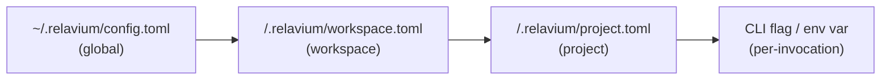

# Configuration Specification

- **Status**: Stable
- **Scope**: Where Relavium reads configuration from, and how global and per-project settings are merged.
- **Related**: [workflow-yaml-spec.md](workflow-yaml-spec.md), [agent-yaml-spec.md](agent-yaml-spec.md), [../desktop/keychain-and-secrets.md](../desktop/keychain-and-secrets.md), [../cli/commands.md](../cli/commands.md), [../../architecture/local-first-and-security.md](../../architecture/local-first-and-security.md)

Relavium uses a two-level configuration model that mirrors VS Code's **user vs. workspace** split: a **global** config in the user's home directory, and a **per-project** config committed alongside the code. The per-project layer overrides the global layer. A directory the user opens *is* the workspace — there is no separate "project" concept; the filesystem directory is the unit of organization, which makes git integration trivial.

Config files are **TOML 1.0**. They are decoded to plain objects by the surface that reads them (the CLI in build phase 2 — [ADR-0048](../../decisions/0048-toml-config-parser.md)), then validated against the strict `@relavium/shared` config schemas ([ADR-0033](../../decisions/0033-strict-config-files-amends-0023.md)); the engine never reads config files itself.

## Locations

### Global — `~/.relavium/`

Created on first launch. Holds user-wide preferences and the registry of MCP servers.

```
~/.relavium/
  config.toml        # global preferences, MCP server registrations, update channel
  ipc.json           # desktop loopback server discovery (port, authToken, pid) — see ipc-contract.md
  history.db         # cross-project run history (SQLite; desktop: SQLCipher, CLI: unencrypted + 0600/0700 OS perms — ADR-0050) — see desktop/database-schema.md
  secrets.enc        # RESERVED encrypted-file key fallback (deferred past v1.0; Argon2id KDF) — see keychain-and-secrets.md
  tmp/               # scratch space agents may write to under the sandbox tier
```

> API keys are **not** stored in `config.toml`. They live in the OS keychain; the CLI's headless/CI fallback is the env var `RELAVIUM_<PROVIDER>_API_KEY`. The `secrets.enc` encrypted-file fallback is **deferred past v1.0** (it needs a proper Argon2id KDF). See [../desktop/keychain-and-secrets.md](../desktop/keychain-and-secrets.md).

### Per-project — `<projectRoot>/.relavium/`

Committed to git (minus secrets) so a team shares the same workflows and agents.

```
<projectRoot>/.relavium/
  project.toml                       # project-level defaults and overrides
  workspace.toml                     # OPTIONAL shared variables (default model, shared tool configs)
  workflows/*.relavium.yaml          # workflow definitions
  agents/*.agent.yaml                # agent definitions
  runs.db                            # OPTIONAL project run metadata (summaries only, no event logs)
  .relaviumignore                    # which .relavium/ files git should ignore (e.g. secrets, runs.db)
```

Opening a workspace loads every `*.relavium.yaml` and `*.agent.yaml` under `<projectRoot>/.relavium/`. An optional `workspace.toml` can declare shared variables (default model, shared tool configs) inherited by all workflows in that workspace.

## Resolution order

For any single setting, the **last writer wins**, evaluated in this order:



1. **Global** (`~/.relavium/config.toml`) — lowest precedence; user defaults.
2. **Workspace** (`workspace.toml`) — shared, committed variables for everything in the directory.
3. **Project** (`project.toml`) — project-specific overrides.
4. **Per-invocation** — a CLI flag or environment variable for a single run; highest precedence. See [../cli/commands.md](../cli/commands.md).

MCP server registrations follow the same merge: globally registered servers (`config.toml`) plus any project-scoped servers. See [../shared-core/mcp-integration.md](../shared-core/mcp-integration.md).

## `config.toml` (global) — keys

```toml
update_channel = "stable"          # stable | beta

[preferences]
default_model = "claude-sonnet-4-6"
theme = "dark"

[[mcp_servers]]                    # repeatable
name = "filesystem"
transport = "stdio"                # stdio | http
command = "npx -y @modelcontextprotocol/server-filesystem"
args = ["--root", "~/projects"]
autostart = true
# url = "http://localhost:4000"    # for transport = http
# env = { TOKEN = "..." }
```

## `project.toml` / `workspace.toml` (project) — keys

```toml
[defaults]
model = "claude-sonnet-4-6"        # default model for agents that omit one
fs_scope = "sandboxed"             # sandboxed | project | full (see filesystem tiers)
max_tokens_estimate = 4096         # per-call output-token estimate the pre-egress budget governor uses when a node/session omits maxTokens (ADR-0028) — not the model's absolute max, which would over-block
media_job_poll_initial_ms = 5000   # async media-job (generateMedia LRO) first-poll delay + backoff base (1.AG/ADR-0045 §7)
media_job_poll_max_ms = 30000      # backoff cap: poll interval = min(initial × 2^(n-1), max), no jitter
media_job_deadline_ms = 1800000    # abandon a job past this (from submit) as a retryable timeout (30 min)
media_gc_grace_days = 7            # FORWARD-DECLARED (P4/D11, ADR-0042 §4c) — grace before a zero-reference media handle's CAS bytes are reclaimed by the host media GC. NOT YET WIRED: the 2.S host GC uses a built-in 7-day default (DEFAULT_MEDIA_GC_GRACE_MS) until this key is read; see deferred-tasks.md.

[defaults.media_cost_estimate]     # per-modality media-output UNIT-COUNT default for the pre-egress media cost estimate (1.AF/D17, ADR-0044 §3) — a COUNT, not a price; the per-unit price lives in the model catalog. Used when a media-output turn declares no volume. Omit the table for text-only workflows.
image = 1                          # assumed images per media-output turn
audio = 60                         # assumed audio-SECONDS per media-output turn
video = 10                         # assumed video-SECONDS per media-output turn

[variables]                        # available to all workflows in this workspace
focus_area = "security and type safety"

[chat]                             # agent-session (chat-mode) defaults — see contracts/agent-session-spec.md
default_model = "claude-sonnet-4-6"   # model for a chat session that names none
fs_scope = "sandboxed"             # SAME tier enum as [defaults].fs_scope above (not re-listed here)
max_messages = 200                 # session-history cap before older turns are trimmed/summarized
max_cost_microcents = 0            # 0 = unbounded; >0 = per-session pre-egress cost cap (the same governor as a workflow budget — ADR-0028)
on_exceed = "pause_for_approval"   # fail | pause_for_approval | warn — when a session hits its cap
```

> **Project-scoped MCP servers.** `project.toml` / `workspace.toml` may also declare
> `[[mcp_servers]]` entries (the same shape as the global block above); they merge with the
> global registrations per the [resolution order](#resolution-order) — a project server
> overrides a global one with the same `name`. (Schema: `ProjectConfigSchema.mcp_servers`.)

> The `[chat]` block sets defaults for the **agent-first** chat entry point
> ([agent-session-spec.md](agent-session-spec.md), [ADR-0024](../../decisions/0024-agent-first-entry-point-agentsession.md)),
> distinct from `[defaults]` (which governs **workflow** runs). It does **not** define its own command
> allowlist: a chat session reuses the workflow `allowedCommands` policy whose canonical home is
> [workflow-yaml-spec.md](workflow-yaml-spec.md#tool-policy-spectools) (empty/absent ⇒ `run_command`
> disabled). Session history persists in the existing `history.db` — there is no separate `sessions.db`. A chat session may carry its own **pre-egress cost cap** (`max_cost_microcents` + `on_exceed`), enforced by the **same** governor as a workflow `budget` ([ADR-0028](../../decisions/0028-workflow-resource-governance.md)) — so an open-ended chat that loops on tool calls fails safe, and "both entry points inherit resource governance" holds literally.

## Secrets are out of band

No config file contains plaintext secrets. Keys resolve at call time from:

- **Desktop** — OS keychain (`tauri-plugin-keychain`), with an optional `secrets.enc` fallback.
- **CLI** — OS keychain via `@napi-rs/keyring` (not the archived `keytar`; see [ADR-0019](../../decisions/0019-cli-node-keychain-library.md)).
- **VS Code** — `vscode.SecretStorage`.

Non-key secrets (e.g. an MCP server's `GITHUB_TOKEN`) are stored the same way and referenced
from workflow/agent/MCP-server fields by name with **`{{secrets.<name>}}`** interpolation,
resolved from the store at run time — never written into the workflow file, a checkpoint, or
any event payload (see [../shared-core/mcp-integration.md](../shared-core/mcp-integration.md)
and the masking rule in [sse-event-schema.md](sse-event-schema.md)).

This is covered in full in [../desktop/keychain-and-secrets.md](../desktop/keychain-and-secrets.md) and [../../architecture/local-first-and-security.md](../../architecture/local-first-and-security.md).

## Schema versioning

The workflow and agent files inside `.relavium/` carry their own `schema_version` (see [workflow-yaml-spec.md](workflow-yaml-spec.md)). Because the entire `.relavium/` directory is committed and shared, both the config files and the workflow/agent files are treated as stable, versioned, public formats — breaking changes require a migration path, never a silent reinterpretation of existing keys.
