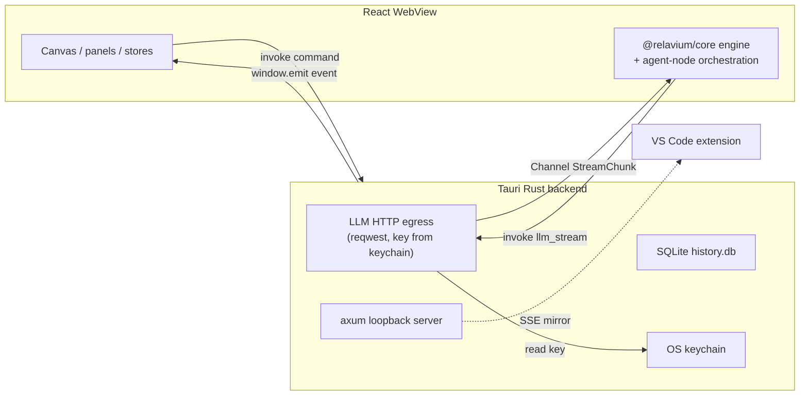

# Desktop IPC Contract

- **Status**: Stable
- **Scope**: The boundary between the Tauri v2 **Rust backend** and the **React WebView** in the desktop app.
- **Related**: [sse-event-schema.md](sse-event-schema.md), [../desktop/tauri-plugins.md](../desktop/tauri-plugins.md), [../desktop/database-schema.md](../desktop/database-schema.md), [../desktop/keychain-and-secrets.md](../desktop/keychain-and-secrets.md), [../../architecture/desktop-architecture.md](../../architecture/desktop-architecture.md)

The desktop app is split across a Tauri boundary: the Rust backend owns the filesystem, the OS keychain, SQLite, child processes, the system tray, and the per-call authenticated **LLM HTTP egress**; the React WebView owns the ReactFlow canvas, all UI, **and the `@relavium/core` engine plus agent-node orchestration** (the engine is pure TypeScript and runs in the WebView's JS runtime, identically to every other surface). They communicate only by message passing — every value crossing the boundary is JSON-serializable. This document is the canonical list of that surface.



## Three IPC primitives

Tauri v2 offers three primitives; Relavium uses each for a distinct job.

| Primitive | Direction | Use |
| --- | --- | --- |
| **Commands** (`#[tauri::command]`) | WebView → Rust, request/response | Load/save workflows and agents, start/cancel runs, read run history, manage keys. The frontend calls `invoke('cmd', {args})` and gets a `Promise<Result>`. |
| **Channels** (`tauri::ipc::Channel`) | Rust → WebView, ordered high-throughput stream | Stream `RunEvent`s (tokens, node status, cost) for a single run. Typed, backpressure-aware, no per-message string-serialization overhead. |
| **Events** (`window.emit` / `listen`) | Rust → WebView, broadcast | Loose-coupling system signals: active-run-count change (tray badge), update availability, MCP server health changes. |

Commands and channels are the primary surfaces; events handle UI elements not tied to a specific run.

## Commands (WebView → Rust)

All commands return a `Result`; the WebView receives a resolved value or a typed error.

| Command | Args | Returns | Purpose |
| --- | --- | --- | --- |
| `list_workflows` | `{ workspaceRoot }` | `WorkflowMeta[]` | Enumerate `.relavium/` workflow files. |
| `load_workflow` | `{ path }` | `WorkflowDefinition` | Parse + validate a workflow file. |
| `save_workflow` | `{ path, definition }` | `{ path }` | Serialize a workflow back to YAML. |
| `list_agents` | `{ workspaceRoot }` | `AgentConfig[]` | Enumerate `.agent.yaml` files. |
| `save_agent` | `{ path, agent }` | `{ path }` | Persist an agent file. |
| `start_run` | `{ workflowPath, inputs, options? }` | `{ runId, channelId }` | Begin a run; returns the id of the `Channel` to subscribe to. |
| `cancel_run` | `{ runId }` | `void` | Cancel an in-flight run (interrupts agent calls). |
| `resume_run` | `{ runId, gateId, decision }` | `void` | Resolve a paused human gate (see [sse-event-schema.md](sse-event-schema.md)). |
| `list_runs` | `{ filter? }` | `RunSummary[]` | Read run history from SQLite. |
| `get_run_state` | `{ runId }` | `RunState` | Durable run snapshot (used for resync). |
| `pick_file` | `{ filters, multiple }` | `string[]` | Native file picker (`tauri-plugin-dialog`). |
| `set_provider_key` | `{ providerId, keyId, secret }` | `void` | Store a key in the OS keychain (secret never echoed back). |
| `get_key_status` | `{ providerId }` | `'valid' \| 'invalid' \| 'unchecked'` | Key presence/health — never the key itself. |
| `list_mcp_servers` | — | `McpServerConfig[]` | Read configured MCP servers. |
| `llm_stream` | `{ providerId, keyId, endpoint, headers, body }` + a `Channel<StreamChunk>` | `void` (chunks arrive on the channel) | Perform one authenticated streaming LLM HTTPS request on behalf of the WebView-resident engine. Rust reads the provider key from the OS keychain, sets the `Authorization` header, issues the request (`reqwest`), and streams raw provider chunks back. **The raw key value never enters the WebView.** See [Rust-delegated LLM egress](#rust-delegated-llm-egress). |

> Secrets cross the boundary **only inbound** (`set_provider_key`) — and never even inbound for `llm_stream`, which names the key by `{ providerId, keyId }` and lets Rust resolve it at call time. No key value is ever returned to the WebView. See [../desktop/keychain-and-secrets.md](../desktop/keychain-and-secrets.md).

## Rust-delegated LLM egress

The `@relavium/core` engine and its agent-node orchestration run **in the WebView's JS runtime**, identically to the CLI, the VS Code extension host, and the Phase-2 Bun API — Rust does **not** re-implement workflow execution. The engine and the `@relavium/llm` adapters are pure TypeScript and depend on an **injected HTTP transport**. On Node-style surfaces (CLI, extension host, Bun API) that transport is a direct `fetch`/SDK call inside the one trusted process, with the key resolved at call time and never persisted or logged.

On the **desktop**, the injected transport is the `llm_stream` command above: the WebView-resident adapter hands Rust the request (provider id + key id, endpoint, headers, JSON body) and a `Channel`; Rust reads the key from the OS keychain, sets the `Authorization` header, performs the streaming HTTPS request with `reqwest`, and streams the provider's raw chunks back over the channel. The adapter (still in the WebView) folds those chunks into the normalized `StreamChunk` union. This is the **only** part of the LLM path that is a Rust command — engine orchestration, normalization, fallback, and cost accounting all stay in the WebView. The benefit is that the raw key value **never enters the WebView's JS/renderer**; only a non-sensitive key *reference* does. See [../desktop/keychain-and-secrets.md](../desktop/keychain-and-secrets.md) and [../../architecture/local-first-and-security.md](../../architecture/local-first-and-security.md).

## Channel: streaming run events (Rust → WebView)

Two kinds of `Channel` carry streams across the boundary: the `Channel<StreamChunk>` for `llm_stream` egress (above), and the `Channel<RunEvent>` for run events. The latter is created and consumed entirely on the WebView side for the desktop case — because the engine runs in the WebView, its `RunEventBus` and the consuming stores share one JS runtime, so most `RunEvent`s never cross the IPC boundary at all. A run-event channel is still surfaced through `start_run` for symmetry with the other surfaces and for events that originate from a Rust service:

```ts
import { Channel } from '@tauri-apps/api/core';

const channel = new Channel<RunEvent>();
channel.onmessage = (event) => runStore.handleRunEvent(event);
const { runId } = await invoke('start_run', {
  workflowPath, inputs, onEvent: channel,
});
```

LLM tokens reach the engine over the `llm_stream` `Channel<StreamChunk>`; the engine re-emits them on its in-WebView `RunEventBus` as `RunEvent`s, which the stores consume directly. The channel is closed when its stream terminates.

- **Event shape**: the full `RunEvent` discriminated union — defined once in [sse-event-schema.md](sse-event-schema.md).
- **Backpressure**: if the WebView render lags, a channel's internal buffer fills and the sender awaits, throttling without dropping events — true for both the `StreamChunk` egress channel and the `RunEvent` channel.
- **Routing**: the frontend dispatches each event into `runStore` by `nodeId`, deliberately kept out of the canvas store so ReactFlow does not re-render per token (see [../shared-core/store-shapes.md](../shared-core/store-shapes.md)).

## Events (Rust → WebView, broadcast)

| Event name | Payload | Consumer |
| --- | --- | --- |
| `active-runs-changed` | `{ count, awaitingGate }` | Tray badge + status indicators. |
| `mcp-health-changed` | `{ serverName, status }` | MCP server status UI. |
| `update-available` | `{ version }` | Update prompt. |

## VS Code mirror (loopback HTTP)

For the VS Code extension's optional desktop-enhancement mode, the Rust backend also runs an `axum` HTTP server bound to `127.0.0.1:{dynamic_port}` inside the same tokio runtime (no extra process). It writes `~/.relavium/ipc.json` (`{ port, authToken, pid, startedAt }`) and **mirrors the same `RunEvent` stream** over HTTP SSE. The extension reads that file to discover the port and bearer token.

- Binds **loopback only** (never `0.0.0.0`); `ipc.json` is written with `0600` permissions; `authToken` is a 256-bit hex string valid for the app process lifetime.
- The HTTP protocol is framework-decoupled — the extension would work the same against any future backend. Details and the extension side live in [../vscode/extension-api.md](../vscode/extension-api.md); the event shape is the shared [sse-event-schema.md](sse-event-schema.md).

## Design rules

- Everything crossing the boundary is JSON-serializable; raw streams are carried by channels, not passed directly.
- Commands are request/response; never use a command to push streaming data — use a channel.
- The Rust side enforces the Tauri v2 capability manifest; any plugin API the WebView calls must be declared, or it fails silently at runtime. See [../desktop/tauri-plugins.md](../desktop/tauri-plugins.md).
