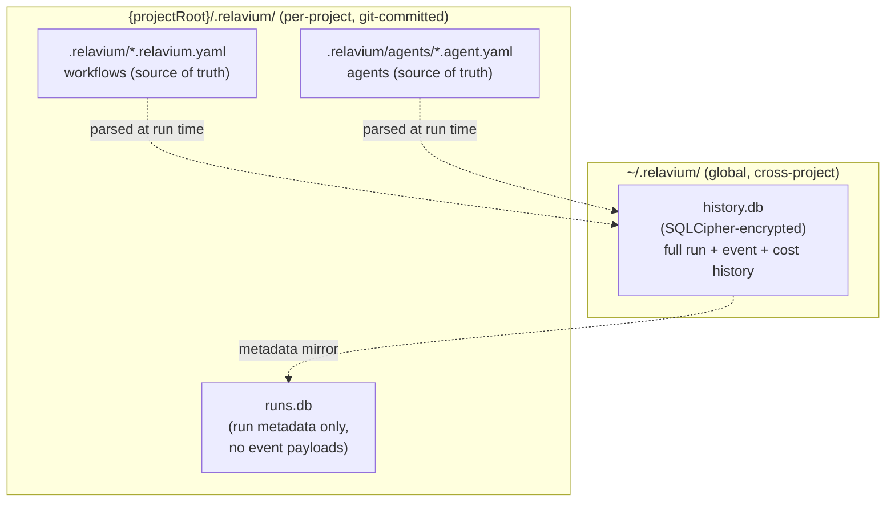

# Desktop Database Schema (Local SQLite)

> Last updated: 2026-06-03

- **Status**: Reference
- **Surface**: Desktop (Tauri v2)
- **Scope**: Phase 1, local-first. SQLite via `tauri-plugin-sql`, schema managed by Drizzle ORM in `packages/db` (see [project-structure.md](../../project-structure.md)).
- **Related**: [keychain-and-secrets.md](keychain-and-secrets.md), [tauri-plugins.md](tauri-plugins.md), [../contracts/workflow-yaml-spec.md](../contracts/workflow-yaml-spec.md), [../contracts/sse-event-schema.md](../contracts/sse-event-schema.md), [../../architecture/cloud-phase-2.md](../../architecture/cloud-phase-2.md), [../../architecture/managed-inference.md](../../architecture/managed-inference.md), [../../architecture/local-first-and-security.md](../../architecture/local-first-and-security.md)

This is the canonical reference for the **local** run-history and catalog database that the desktop app persists on the user's machine. There is no cloud, no account, and no server in Phase 1 — every table below lives in a single encrypted SQLite file. The Phase-2 PostgreSQL divergences are described at the end and detailed in [../../architecture/cloud-phase-2.md](../../architecture/cloud-phase-2.md).

## Storage layout



Two SQLite databases exist:

| Database | Path | Encryption | Contents | Git |
|----------|------|-----------|----------|-----|
| Global history | `~/.relavium/history.db` | SQLCipher (key from OS keychain) | Full runs, every event, every cost row, the catalog tables | Never committed |
| Project history | `{projectRoot}/.relavium/runs.db` | None | Run **metadata only** (no event payloads) so teammates see historical run summaries after a `git pull` | Committed |

The database is opened with `PRAGMA journal_mode = WAL` for concurrent read performance and `PRAGMA foreign_keys = ON` per connection (SQLite does **not** enforce foreign keys by default). Run events in `history.db` are pruned after 90 days by a background job that runs on app launch.

> Workflows and agents are **not** the database's source of truth. The git-committable YAML files (`.relavium.yaml` / `.agent.yaml`) are authoritative; see [../contracts/workflow-yaml-spec.md](../contracts/workflow-yaml-spec.md) and [../contracts/agent-yaml-spec.md](../contracts/agent-yaml-spec.md). The catalog tables below cache and snapshot them for fast querying, run reproducibility, and offline browsing.

## SQLite type conventions

Because this schema is adapted from a Postgres-first design (see [../../analysis/_archive/](../../analysis/_archive/)), the following local-first conventions apply consistently across every table:

| Concept | Postgres (Phase 2) | SQLite (Phase 1, here) |
|---------|--------------------|------------------------|
| Primary key | `UUID DEFAULT gen_random_uuid()` | `TEXT` UUID generated in application code (Drizzle) |
| Structured blob | `JSONB` | `TEXT` (JSON string); query with `json_extract()` |
| String array (tags) | `TEXT[]` | `TEXT` (JSON array, e.g. `["review","ci"]`); query with `json_each()` |
| Timestamp | `TIMESTAMPTZ` | `INTEGER` (Unix epoch ms) for reliable ordering; timezone handled in app code |
| Money / cost | `NUMERIC(14,8)` | `INTEGER` **micro-cents** (USD x 100,000,000, i.e. cents x 1,000,000 — one micro-cent = 1e-8 USD = 1e-6 cent) to avoid IEEE-754 rounding. The `NUMERIC(14,8)` Postgres form is consistent: 8 fractional digits = 1e-8 USD = one micro-cent. Canonical unit definition: [../shared-core/llm-provider-seam.md](../shared-core/llm-provider-seam.md#6-usage). |
| Enum | `CREATE TYPE ... AS ENUM` | `TEXT` with a `CHECK` constraint |
| Soft delete | `deleted_at TIMESTAMPTZ` partial index | `deleted_at INTEGER NULL`; partial indexes supported since SQLite 3.8.9 |

A full 14-item porting table lives in [../../architecture/cloud-phase-2.md](../../architecture/cloud-phase-2.md).

## Tables

The local schema is the Postgres 13-table design reduced to what a single-user, local-first app needs. The two LangGraph checkpoint tables are **dropped** (the engine is pure TypeScript — no LangGraph; see [decision 0003](../../decisions/0003-pure-ts-engine-not-langgraph-python.md)). `workflow_schedules` is **Phase 2 only** (schedule/webhook triggers require a cloud listener; see [../../ideas/scheduled-and-webhook-triggers.md](../../ideas/scheduled-and-webhook-triggers.md)). The `*_versions` tables are unnecessary locally because version history is provided by git on the YAML files.

### Catalog tables

#### `llm_providers`

Registered LLM providers. The actual API key never lives here — only a reference; the key is stored in the OS keychain (see [keychain-and-secrets.md](keychain-and-secrets.md)).

| Column | Type | Constraints |
|--------|------|-------------|
| `id` | TEXT | PRIMARY KEY (UUID) |
| `name` | TEXT | NOT NULL UNIQUE (e.g. `anthropic`, `openai`) |
| `display_name` | TEXT | NOT NULL |
| `base_url` | TEXT | NOT NULL |
| `api_key_keychain_ref` | TEXT | NULL — keychain `account` identifier, not the key itself |
| `default_headers` | TEXT (JSON) | NOT NULL DEFAULT `'{}'` |
| `is_active` | INTEGER (bool) | NOT NULL DEFAULT 1 |
| `deleted_at` | INTEGER | NULL |
| `created_at` | INTEGER | NOT NULL |
| `updated_at` | INTEGER | NOT NULL |

```sql
CREATE UNIQUE INDEX idx_llm_providers_name ON llm_providers (name) WHERE deleted_at IS NULL;
```

#### `model_catalog`

Models offered by each provider, including pricing used for local cost tracking. The `*_per_mtok_microcents` columns are price **per million tokens, in integer micro-cents** (one micro-cent = 1e-8 USD = cents x 1,000,000; see the [money/cost convention](#sqlite-type-conventions)).

| Column | Type | Constraints |
|--------|------|-------------|
| `id` | TEXT | PRIMARY KEY (UUID) |
| `provider_id` | TEXT | NOT NULL REFERENCES `llm_providers(id)` |
| `model_id` | TEXT | NOT NULL (e.g. `claude-sonnet-4-6`) |
| `display_name` | TEXT | NOT NULL |
| `context_window_tokens` | INTEGER | NOT NULL |
| `max_output_tokens` | INTEGER | NOT NULL |
| `input_cost_per_mtok_microcents` | INTEGER | NOT NULL DEFAULT 0 |
| `output_cost_per_mtok_microcents` | INTEGER | NOT NULL DEFAULT 0 |
| `cached_input_cost_per_mtok_microcents` | INTEGER | NOT NULL DEFAULT 0 |
| `supports_tool_calling` | INTEGER (bool) | NOT NULL DEFAULT 0 |
| `supports_vision` | INTEGER (bool) | NOT NULL DEFAULT 0 |
| `supports_streaming` | INTEGER (bool) | NOT NULL DEFAULT 1 |
| `supports_json_mode` | INTEGER (bool) | NOT NULL DEFAULT 0 |
| `capabilities` | TEXT (JSON) | NOT NULL DEFAULT `'{}'` |
| `deprecation_date` | INTEGER | NULL |
| `is_active` | INTEGER (bool) | NOT NULL DEFAULT 1 |
| `deleted_at` | INTEGER | NULL |
| `created_at` | INTEGER | NOT NULL |
| `updated_at` | INTEGER | NOT NULL |

```sql
CREATE UNIQUE INDEX idx_model_catalog_provider_model ON model_catalog (provider_id, model_id) WHERE deleted_at IS NULL;
CREATE INDEX idx_model_catalog_provider ON model_catalog (provider_id);
CREATE INDEX idx_model_catalog_active   ON model_catalog (is_active) WHERE deleted_at IS NULL;
```

#### `agents`

A cached/snapshot copy of agent definitions for fast catalog browsing and run reproducibility. The `.agent.yaml` file remains authoritative.

| Column | Type | Constraints |
|--------|------|-------------|
| `id` | TEXT | PRIMARY KEY (UUID) |
| `name` | TEXT | NOT NULL |
| `slug` | TEXT | NOT NULL UNIQUE |
| `description` | TEXT | NULL |
| `model_id` | TEXT | NOT NULL REFERENCES `model_catalog(id)` |
| `system_prompt` | TEXT | NOT NULL DEFAULT `''` |
| `tools` | TEXT (JSON) | NOT NULL DEFAULT `'[]'` |
| `config` | TEXT (JSON) | NOT NULL DEFAULT `'{}'` (temperature, max_tokens, fallback_chain) |
| `input_schema` | TEXT (JSON) | NULL |
| `output_schema` | TEXT (JSON) | NULL |
| `tags` | TEXT (JSON array) | NOT NULL DEFAULT `'[]'` |
| `source_path` | TEXT | NULL — workspace-relative path to the `.agent.yaml` file |
| `is_active` | INTEGER (bool) | NOT NULL DEFAULT 1 |
| `deleted_at` | INTEGER | NULL |
| `created_at` | INTEGER | NOT NULL |
| `updated_at` | INTEGER | NOT NULL |

```sql
CREATE UNIQUE INDEX idx_agents_slug   ON agents (slug) WHERE deleted_at IS NULL;
CREATE INDEX idx_agents_model         ON agents (model_id);
CREATE INDEX idx_agents_active        ON agents (is_active, created_at DESC) WHERE deleted_at IS NULL;
-- tags are queried with json_each(); SQLite has no GIN index (see cloud-phase-2.md)
```

> Postgres `version INTEGER` + the separate `agent_versions` table are dropped locally — git history on the YAML file is the version record.

#### `workflows`

Cached/snapshot copy of workflow definitions. The `definition` column holds the parsed workflow graph (the canonical format is [../contracts/workflow-yaml-spec.md](../contracts/workflow-yaml-spec.md)).

| Column | Type | Constraints |
|--------|------|-------------|
| `id` | TEXT | PRIMARY KEY (UUID) |
| `name` | TEXT | NOT NULL |
| `slug` | TEXT | NOT NULL UNIQUE |
| `description` | TEXT | NULL |
| `definition` | TEXT (JSON) | NOT NULL — parsed graph (nodes, edges, agents, context) |
| `input_schema` | TEXT (JSON) | NULL |
| `tags` | TEXT (JSON array) | NOT NULL DEFAULT `'[]'` |
| `source_path` | TEXT | NULL — workspace-relative path to the `.relavium.yaml` file |
| `is_active` | INTEGER (bool) | NOT NULL DEFAULT 1 |
| `deleted_at` | INTEGER | NULL |
| `created_at` | INTEGER | NOT NULL |
| `updated_at` | INTEGER | NOT NULL |

```sql
CREATE UNIQUE INDEX idx_workflows_slug ON workflows (slug) WHERE deleted_at IS NULL;
CREATE INDEX idx_workflows_active      ON workflows (is_active, updated_at DESC) WHERE deleted_at IS NULL;
```

### Run-history tables

#### `runs`

One row per workflow execution. `workflow_definition_snapshot` freezes the exact graph that ran, so a run can be replayed or inspected even after the YAML file changes. Cost is stored as integer micro-cents.

> **Logical `Run` vs persisted `RunRow`.** `@relavium/shared` exports `RunSchema` — the **narrow, engine-/surface-facing** view of a run (status, trigger, inputs/outputs, token + cost totals, timestamps). This `runs` table is the **persistence** shape and carries additional columns that are a database concern, modeled by `@relavium/db` as a distinct `RunRow` mirroring the DDL below: `workflow_definition_snapshot` (the frozen graph for replay/resume), `trigger_metadata`, `workflow_path`/`project_root`, and the `deleted_at` soft-delete cursor. Those are intentionally absent from the logical `RunSchema`; a consumer that needs them reads the `RunRow`. The split keeps the engine view free of storage details while `@relavium/db` owns the row ↔ column mapping.

| Column | Type | Constraints |
|--------|------|-------------|
| `id` | TEXT | PRIMARY KEY (UUID) |
| `workflow_id` | TEXT | NOT NULL REFERENCES `workflows(id)` — the surrogate **UUID** PK, **not** the authored kebab id (that lives in `workflows.slug`). `RunSchema.workflowId` mirrors this UUID FK ([ADR-0022](../../decisions/0022-run-references-workflow-by-uuid.md)). |
| `workflow_path` | TEXT | NULL — source `.relavium.yaml` path |
| `project_root` | TEXT | NULL — workspace that owned the run |
| `workflow_definition_snapshot` | TEXT (JSON) | NOT NULL |
| `status` | TEXT | NOT NULL DEFAULT `'pending'` — `CHECK (status IN ('pending','running','paused','completed','failed','cancelled'))` |
| `execution_mode` | TEXT | NOT NULL DEFAULT `'local'` — `CHECK (execution_mode IN ('local','cloud','managed'))`; which mode the run used (cost/billing attribution + history) |
| `trigger_type` | TEXT | NOT NULL DEFAULT `'manual'` (`manual`, `file_change`, `mcp_call`; `webhook`/`schedule` are Phase 2) |
| `trigger_metadata` | TEXT (JSON) | NOT NULL DEFAULT `'{}'` |
| `input_json` | TEXT (JSON) | NOT NULL DEFAULT `'{}'` |
| `output_json` | TEXT (JSON) | NULL |
| `error_json` | TEXT (JSON) | NULL |
| `started_at` | INTEGER | NULL |
| `completed_at` | INTEGER | NULL |
| `total_input_tokens` | INTEGER | NOT NULL DEFAULT 0 |
| `total_output_tokens` | INTEGER | NOT NULL DEFAULT 0 |
| `total_cost_microcents` | INTEGER | NOT NULL DEFAULT 0 |
| `deleted_at` | INTEGER | NULL |
| `created_at` | INTEGER | NOT NULL |
| `updated_at` | INTEGER | NOT NULL |

```sql
CREATE INDEX idx_runs_workflow      ON runs (workflow_id, created_at DESC);
CREATE INDEX idx_runs_status        ON runs (status, created_at DESC) WHERE deleted_at IS NULL;
CREATE INDEX idx_runs_cost          ON runs (workflow_id, created_at, total_cost_microcents) WHERE deleted_at IS NULL;
```

#### `step_executions`

One row per node attempt within a run. This is what drives the per-node run trace, the Gantt timeline, retry-from-node, and per-node cost attribution. `agent_snapshot` freezes the agent config that executed the node.

| Column | Type | Constraints |
|--------|------|-------------|
| `id` | TEXT | PRIMARY KEY (UUID) |
| `run_id` | TEXT | NOT NULL REFERENCES `runs(id)` ON DELETE CASCADE |
| `node_id` | TEXT | NOT NULL — graph node id |
| `node_type` | TEXT | NOT NULL — one of the engine node-type enum values, since this column records what the engine executed (see [../shared-core/node-types.md](../shared-core/node-types.md)) |
| `agent_id` | TEXT | NULL REFERENCES `agents(id)` |
| `agent_snapshot` | TEXT (JSON) | NULL |
| `model_id` | TEXT | NULL REFERENCES `model_catalog(id)` |
| `attempt_number` | INTEGER | NOT NULL DEFAULT 1 |
| `status` | TEXT | NOT NULL DEFAULT `'pending'` — `CHECK (status IN ('pending','running','completed','failed','skipped'))` |
| `input_json` | TEXT (JSON) | NOT NULL DEFAULT `'{}'` |
| `output_json` | TEXT (JSON) | NULL |
| `error_json` | TEXT (JSON) | NULL |
| `started_at` | INTEGER | NULL |
| `completed_at` | INTEGER | NULL |
| `duration_ms` | INTEGER | NULL |
| `input_tokens` | INTEGER | NOT NULL DEFAULT 0 |
| `output_tokens` | INTEGER | NOT NULL DEFAULT 0 |
| `cached_tokens` | INTEGER | NOT NULL DEFAULT 0 |
| `cost_microcents` | INTEGER | NOT NULL DEFAULT 0 |
| `created_at` | INTEGER | NOT NULL |
| `updated_at` | INTEGER | NOT NULL |

```sql
CREATE INDEX idx_step_exec_run       ON step_executions (run_id, created_at ASC);
CREATE INDEX idx_step_exec_run_node  ON step_executions (run_id, node_id, attempt_number);
CREATE INDEX idx_step_exec_agent     ON step_executions (agent_id, created_at DESC) WHERE agent_id IS NOT NULL;
CREATE INDEX idx_step_exec_model     ON step_executions (model_id, created_at DESC) WHERE model_id IS NOT NULL;
CREATE INDEX idx_step_exec_cost      ON step_executions (model_id, created_at, cost_microcents) WHERE model_id IS NOT NULL;
```

#### `messages`

The LLM conversation for each agent step (prompt, completion, tool calls). Cascades from `step_executions`. Used for run inspection and to seed retry-from-node.

| Column | Type | Constraints |
|--------|------|-------------|
| `id` | TEXT | PRIMARY KEY (UUID) |
| `step_execution_id` | TEXT | NOT NULL REFERENCES `step_executions(id)` ON DELETE CASCADE |
| `run_id` | TEXT | NOT NULL |
| `sequence_number` | INTEGER | NOT NULL |
| `role` | TEXT | NOT NULL (`system`, `user`, `assistant`, `tool`) |
| `content` | TEXT | NULL |
| `content_parts` | TEXT (JSON) | NULL — multimodal/structured parts |
| `tool_calls` | TEXT (JSON) | NULL |
| `tool_call_id` | TEXT | NULL |
| `name` | TEXT | NULL |
| `finish_reason` | TEXT | NULL |
| `created_at` | INTEGER | NOT NULL |

```sql
CREATE INDEX idx_messages_step ON messages (step_execution_id, sequence_number ASC);
CREATE INDEX idx_messages_run  ON messages (run_id, created_at ASC);
```

#### `run_events`

The append-only event log for a run — the persistent record of the [SSE/RunEvent stream](../contracts/sse-event-schema.md). This is what the run-detail log drawer replays and what powers reconnect/resync. `seq` is monotonic per run and is used for gap detection.

| Column | Type | Constraints |
|--------|------|-------------|
| `id` | TEXT | PRIMARY KEY (UUID) |
| `run_id` | TEXT | NOT NULL REFERENCES `runs(id)` ON DELETE CASCADE |
| `step_execution_id` | TEXT | NULL |
| `seq` | INTEGER | NOT NULL — monotonic per run |
| `event_type` | TEXT | NOT NULL — e.g. `node:started`, `agent:token`, `human_gate:paused` |
| `level` | TEXT | NOT NULL DEFAULT `'info'` |
| `node_id` | TEXT | NULL |
| `payload_json` | TEXT (JSON) | NOT NULL DEFAULT `'{}'` |
| `ts` | INTEGER | NOT NULL |

```sql
CREATE UNIQUE INDEX idx_run_events_run_seq ON run_events (run_id, seq ASC);  -- seq is monotonic per run: (run_id, seq) is unique
CREATE INDEX idx_run_events_step        ON run_events (step_execution_id, ts ASC) WHERE step_execution_id IS NOT NULL;
CREATE INDEX idx_run_events_run_type    ON run_events (run_id, event_type, ts ASC);
```

> `token`-level events are high volume. They are stored to support full replay but are the primary target of the 90-day pruning job; `runs`/`step_executions` metadata is retained longer.

> **Timestamp unit at the persistence boundary.** The wire `RunEvent.timestamp` is an **ISO-8601 string** ([sse-event-schema.md](../contracts/sse-event-schema.md) envelope), but it is persisted here as `run_events.ts` = **epoch-milliseconds `INTEGER`** (the table convention, for reliable ordering). The conversion ISO ↔ epoch-ms happens at the `@relavium/db` write/read boundary; the logical `RunSchema` timestamps (`createdAt`/`startedAt`/…) are already epoch-ms and pass through unchanged.

#### `run_costs`

Denormalized per-node cost rows for fast cost-waterfall rendering without re-aggregating `step_executions`. Stored as integer micro-cents.

| Column | Type | Constraints |
|--------|------|-------------|
| `id` | TEXT | PRIMARY KEY (UUID) |
| `run_id` | TEXT | NOT NULL REFERENCES `runs(id)` ON DELETE CASCADE |
| `node_id` | TEXT | NOT NULL |
| `model_id` | TEXT | NULL REFERENCES `model_catalog(id)` |
| `input_tokens` | INTEGER | NOT NULL DEFAULT 0 |
| `output_tokens` | INTEGER | NOT NULL DEFAULT 0 |
| `cost_microcents` | INTEGER | NOT NULL DEFAULT 0 |
| `created_at` | INTEGER | NOT NULL |

```sql
CREATE INDEX idx_run_costs_run ON run_costs (run_id);
```

### Agent-session tables

These two tables persist **agent sessions** (the agent-first chat entry point —
[ADR-0024](../../decisions/0024-agent-first-entry-point-agentsession.md),
[agent-session-spec.md](../contracts/agent-session-spec.md)). They live in the **same
`~/.relavium/history.db`** (SQLCipher-encrypted) as run history — there is **no** separate
`sessions.db`. They are **bound to a session**, deliberately **distinct** from the per-step run
[`messages`](#messages) table (which is bound to `step_executions` within a workflow run); the two
share a shape family but must not be merged, because a session and a run have different lifecycles.

#### `agent_sessions`

One row per chat session. `context_json` freezes the `SessionContext` (active file, selection,
session variables); `agent_snapshot` freezes the agent config the session ran against.

| Column | Type | Constraints |
|--------|------|-------------|
| `id` | TEXT | PRIMARY KEY (UUID) |
| `agent_id` | TEXT | NULL REFERENCES `agents(id)` |
| `agent_slug` | TEXT | NOT NULL — the authored `agent_ref` the session is bound to |
| `agent_snapshot` | TEXT (JSON) | NULL — frozen agent config for reproducibility |
| `title` | TEXT | NULL — display title (derived from the first message or user-set) |
| `model_id` | TEXT | NULL REFERENCES `model_catalog(id)` — the resolved model |
| `working_dir` | TEXT | NULL — session-context workspace root |
| `git_ref` | TEXT | NULL — branch/commit at session start, for provenance |
| `fs_scope_tier` | TEXT | NOT NULL DEFAULT `'sandboxed'` — `CHECK (fs_scope_tier IN ('sandboxed','project','full'))` (the same tier enum as workflows; see [built-in-tools.md](../shared-core/built-in-tools.md#filesystem-permission-tiers)) |
| `status` | TEXT | NOT NULL DEFAULT `'active'` — `CHECK (status IN ('active','idle','exported','ended'))` |
| `context_json` | TEXT (JSON) | NOT NULL DEFAULT `'{}'` — the frozen `SessionContext` |
| `total_input_tokens` | INTEGER | NOT NULL DEFAULT 0 |
| `total_output_tokens` | INTEGER | NOT NULL DEFAULT 0 |
| `total_cost_microcents` | INTEGER | NOT NULL DEFAULT 0 |
| `exported_workflow_path` | TEXT | NULL — set when the session is exported to a `.relavium.yaml` |
| `deleted_at` | INTEGER | NULL |
| `created_at` | INTEGER | NOT NULL |
| `updated_at` | INTEGER | NOT NULL |

```sql
CREATE INDEX idx_agent_sessions_status ON agent_sessions (status, updated_at DESC) WHERE deleted_at IS NULL;
CREATE INDEX idx_agent_sessions_agent  ON agent_sessions (agent_id, created_at DESC) WHERE agent_id IS NOT NULL;
```

#### `session_messages`

The **append-only** conversation transcript for a session — the session-scoped counterpart of the
run `messages` table. Never updated or deleted in normal operation (mirrors the run-event-log
pattern). Cascades from `agent_sessions`.

| Column | Type | Constraints |
|--------|------|-------------|
| `id` | TEXT | PRIMARY KEY (UUID) |
| `session_id` | TEXT | NOT NULL REFERENCES `agent_sessions(id)` ON DELETE CASCADE |
| `sequence_number` | INTEGER | NOT NULL — monotonic per session (append-only) |
| `role` | TEXT | NOT NULL (`system`, `user`, `assistant`, `tool`) |
| `content` | TEXT | NULL |
| `content_parts` | TEXT (JSON) | NULL — multimodal/structured parts |
| `tool_calls` | TEXT (JSON) | NULL |
| `tool_call_id` | TEXT | NULL |
| `name` | TEXT | NULL |
| `finish_reason` | TEXT | NULL |
| `input_tokens` | INTEGER | NOT NULL DEFAULT 0 |
| `output_tokens` | INTEGER | NOT NULL DEFAULT 0 |
| `cost_microcents` | INTEGER | NOT NULL DEFAULT 0 |
| `created_at` | INTEGER | NOT NULL |

```sql
CREATE UNIQUE INDEX idx_session_messages_seq ON session_messages (session_id, sequence_number);
CREATE INDEX idx_session_messages_session    ON session_messages (session_id, created_at ASC);
```

> A `secret`-typed value is never persisted into `session_messages` — per
> [ADR-0029](../../decisions/0029-tool-policy-hardening.md) secrets are rejected from prompt/tool text
> at parse, so they never reach a message body. The user's own conversational content is stored here
> and is protected by `history.db`'s SQLCipher encryption at rest.

## Common query patterns

| Pattern | Where it's used | Index relied on |
|---------|-----------------|-----------------|
| Replay a run's event stream in order | Run-detail log drawer | `idx_run_events_run_seq` |
| Resume a paused run from its last checkpoint | Human-gate resume | `idx_step_exec_run`, `idx_run_events_run_seq` |
| Cost analytics grouped by workflow/model | Cost tracking screen | `idx_runs_cost`, `idx_step_exec_cost` |
| List workflows with their last-run status | Workflows list screen | `idx_workflows_active` + a `ROW_NUMBER()` subquery (SQLite has no `DISTINCT ON`) |

> Postgres `DISTINCT ON (workflow_id)` for "latest run per workflow" is **not** supported in SQLite. Use `ROW_NUMBER() OVER (PARTITION BY workflow_id ORDER BY created_at DESC)` instead — it works identically in both engines, easing the Phase-2 port.

## Encryption at rest

`history.db` is opened with SQLCipher. The passphrase is derived from a stable machine secret (combined with the OS keychain entry) so the database opens on restart without prompting the user; see [keychain-and-secrets.md](keychain-and-secrets.md). The per-project `runs.db` is **not** encrypted because it is intentionally git-committed and contains only non-sensitive run metadata (no prompts, completions, or tokens).

## Phase 2 (PostgreSQL) divergences

> The following applies only to **Phase 2 cloud execution**. None of it ships in Phase 1. See [../../architecture/cloud-phase-2.md](../../architecture/cloud-phase-2.md) for the full design and the complete 14-item SQLite-vs-Postgres porting table.

Drizzle ORM is used for both engines, so table and column names are identical and only the driver changes. The notable divergences:

- **Types restored to native Postgres**: `TEXT` UUIDs → `UUID DEFAULT gen_random_uuid()`; JSON `TEXT` → `JSONB` (with GIN indexes on `tags`, `definition`); epoch `INTEGER` → `TIMESTAMPTZ`; micro-cent `INTEGER` → `NUMERIC(14,8)`; `CHECK`-string statuses → native enums.
- **Multi-tenancy**: an `org_id` column is added to every table with Postgres row-level security and team-level sharing permissions.
- **`run_events` partitioning**: the unbounded event log uses Postgres declarative `RANGE`-by-month partitioning (or a TimescaleDB hypertable) with `pg_cron` retention `DROP TABLE`. SQLite has no partitioning, hence the local 90-day archive/prune job.
- **Concurrency**: Postgres MVCC supports many concurrent writers; SQLite's single-writer WAL lock is adequate locally but would bottleneck cloud-scale parallel runs.
- **Reintroduced tables**: `workflow_schedules` (cron/interval triggers) becomes functional in Phase 2; `*_versions` tables may return if portal-managed (non-git) versioning is needed.

### Managed-inference tables (Phase 2)

> These tables exist **only in the Phase-2 managed-inference gateway** and have **no SQLite/local counterpart** — managed inference is a cloud capability (Relavium holds the provider key and meters usage; see [../../architecture/managed-inference.md](../../architecture/managed-inference.md)). They are Postgres-native and follow the same Phase-2 conventions as every other cloud table: integer **micro-cents** for money, an `org_id` column with **row-level security**, `TIMESTAMPTZ` timestamps, and `JSONB` blobs. They are governed by [ADR-0013](../../decisions/0013-managed-key-vault-and-pools.md) (key vault/pools), [ADR-0014](../../decisions/0014-managed-metering-quota-and-billing.md) (metering/quota/billing), and [ADR-0015](../../decisions/0015-managed-mode-data-handling-and-compliance.md) (data handling).

#### `provider_key_pool`

The pool of **Relavium's own** provider keys the gateway draws from, one row per key. The **key value is never stored here** — only a reference to the KMS entry that holds it, mirroring the local "keychain ref, not the key" rule for `llm_providers.api_key_keychain_ref`. Multiple rows per provider give per-provider rate-limit headroom, rotation, and 429-cooldown.

| Column | Type | Constraints |
|--------|------|-------------|
| `id` | UUID | PRIMARY KEY DEFAULT `gen_random_uuid()` |
| `org_id` | UUID | NOT NULL — RLS tenant (platform-org for the shared pool) |
| `provider` | TEXT | NOT NULL — `anthropic` / `openai` / `gemini` / `deepseek` |
| `region` | TEXT | NULL — segregation key for residency/ban containment |
| `kms_key_ref` | TEXT | NOT NULL — **reference to the KMS entry; never the key value** |
| `status` | TEXT | NOT NULL DEFAULT `'active'` — enum `('active','cooldown','rotating','retired','quarantined')` |
| `cooldown_until` | TIMESTAMPTZ | NULL — set on a 429; key skipped until then |
| `last_used_at` | TIMESTAMPTZ | NULL |
| `created_at` | TIMESTAMPTZ | NOT NULL DEFAULT `now()` |
| `updated_at` | TIMESTAMPTZ | NOT NULL DEFAULT `now()` |

```sql
CREATE INDEX idx_pkp_provider_status ON provider_key_pool (provider, status) WHERE status = 'active';
ALTER TABLE provider_key_pool ENABLE ROW LEVEL SECURITY;
```

#### `subscriptions`

A **mirror of the billing provider's subscription state** — the control plane's source of truth for "what tier is this org on, and is it current." Synced from **billing-provider webhooks** (the merchant-of-record is the primary rail; a direct Stripe integration is the mutually-exclusive alternative — [ADR-0014](../../decisions/0014-managed-metering-quota-and-billing.md), [tech-stack.md](../../tech-stack.md)); never authoritative over the billing provider. The columns are **provider-neutral**: `billing_provider` records which rail issued the ids, and `billing_customer_id` / `billing_subscription_id` hold that rail's identifiers.

| Column | Type | Constraints |
|--------|------|-------------|
| `id` | UUID | PRIMARY KEY DEFAULT `gen_random_uuid()` |
| `org_id` | UUID | NOT NULL UNIQUE — RLS tenant |
| `billing_provider` | TEXT | NOT NULL — `paddle` / `lemonsqueezy` / `stripe` (MoR primary; Stripe is the alternative rail) |
| `billing_customer_id` | TEXT | NOT NULL — customer id in the configured billing provider |
| `billing_subscription_id` | TEXT | NULL — subscription id in the configured billing provider |
| `tier` | TEXT | NOT NULL — `free` / `pro` / `team` / `enterprise` (see [../portal/api-reference.md](../portal/api-reference.md#licensing-tiers)) |
| `status` | TEXT | NOT NULL — mirrors the billing provider (`active`,`past_due`,`canceled`,`trialing`,…) |
| `included_usage_microcents` | INTEGER | NOT NULL DEFAULT 0 — the **hard included-usage cap** for the period |
| `prepaid_credit_microcents` | INTEGER | NOT NULL DEFAULT 0 — remaining prepaid balance |
| `current_period_start` | TIMESTAMPTZ | NULL |
| `current_period_end` | TIMESTAMPTZ | NULL |
| `created_at` | TIMESTAMPTZ | NOT NULL DEFAULT `now()` |
| `updated_at` | TIMESTAMPTZ | NOT NULL DEFAULT `now()` |

```sql
CREATE UNIQUE INDEX idx_subscriptions_org ON subscriptions (org_id);
ALTER TABLE subscriptions ENABLE ROW LEVEL SECURITY;
```

#### `quota_policies`

The enforceable budget/quota **policy** per org (the control-plane record the gateway reads at reserve time). Separate from `subscriptions` so a tier can carry several policies (per-day, per-model) and so enterprise can set custom limits.

| Column | Type | Constraints |
|--------|------|-------------|
| `id` | UUID | PRIMARY KEY DEFAULT `gen_random_uuid()` |
| `org_id` | UUID | NOT NULL — RLS tenant |
| `scope` | TEXT | NOT NULL — `org` / `user` / `model` |
| `scope_ref` | TEXT | NULL — user id or canonical model id when scoped |
| `period` | TEXT | NOT NULL — `day` / `month` |
| `budget_microcents` | INTEGER | NOT NULL — the cap for the period |
| `enforcement` | TEXT | NOT NULL DEFAULT `'hard_stop'` — `warn` / `throttle` / `hard_stop` |
| `warn_threshold_pct` | INTEGER | NOT NULL DEFAULT 80 |
| `is_active` | BOOLEAN | NOT NULL DEFAULT true |
| `created_at` | TIMESTAMPTZ | NOT NULL DEFAULT `now()` |
| `updated_at` | TIMESTAMPTZ | NOT NULL DEFAULT `now()` |

```sql
CREATE INDEX idx_quota_policies_org_scope ON quota_policies (org_id, scope, period) WHERE is_active;
ALTER TABLE quota_policies ENABLE ROW LEVEL SECURITY;
```

#### `usage_events`

The **immutable, append-only billing ledger** — one row per metered managed request, written when the gateway **settles** the reserve→settle metering (see [../../architecture/managed-inference.md](../../architecture/managed-inference.md#metering-quota-and-budgets-reserve--settle)). **No prompt or completion bodies are stored** — only counts and costs (meter content, not text; [ADR-0015](../../decisions/0015-managed-mode-data-handling-and-compliance.md)). The UNIQUE `request_id` is what makes settle **idempotent**: a retried settle is a no-op, so a delivery retry can never double-bill. Because it is unbounded and time-ordered, it uses the same **`RANGE`-by-month partitioning** as `run_events`.

| Column | Type | Constraints |
|--------|------|-------------|
| `id` | UUID | PRIMARY KEY DEFAULT `gen_random_uuid()` |
| `org_id` | UUID | NOT NULL — RLS tenant |
| `request_id` | TEXT | NOT NULL **UNIQUE** — idempotency key for reserve→settle |
| `user_id` | UUID | NULL — the member who incurred the usage |
| `provider` | TEXT | NOT NULL — `anthropic` / `openai` / `gemini` / `deepseek` |
| `model_id` | TEXT | NOT NULL — canonical model id (the pricing key) |
| `pool_key_id` | UUID | NOT NULL REFERENCES `provider_key_pool(id)` — which Relavium key served it |
| `input_tokens` | INTEGER | NOT NULL DEFAULT 0 |
| `output_tokens` | INTEGER | NOT NULL DEFAULT 0 |
| `cache_read_tokens` | INTEGER | NOT NULL DEFAULT 0 |
| `cache_write_tokens` | INTEGER | NOT NULL DEFAULT 0 |
| `usage_source` | TEXT | NOT NULL DEFAULT `'streamed'` — `streamed` / `estimated` / `reconciled` (how the counts were obtained) |
| `provider_cost_microcents` | INTEGER | NOT NULL — **COGS**: Relavium's cost from the canonical pricing table |
| `billed_cost_microcents` | INTEGER | NOT NULL — what the tenant is charged (margin = billed − provider) |
| `occurred_at` | TIMESTAMPTZ | NOT NULL — partition key |
| `created_at` | TIMESTAMPTZ | NOT NULL DEFAULT `now()` |

```sql
-- immutable ledger: append-only, no UPDATE/DELETE in normal operation
CREATE UNIQUE INDEX idx_usage_events_request ON usage_events (request_id);
CREATE INDEX idx_usage_events_org_time ON usage_events (org_id, occurred_at DESC);
CREATE INDEX idx_usage_events_org_model ON usage_events (org_id, model_id, occurred_at DESC);
-- PARTITION BY RANGE (occurred_at) — monthly partitions, pg_cron retention, as for run_events
ALTER TABLE usage_events ENABLE ROW LEVEL SECURITY;
```

#### `usage_aggregates_daily`

A pre-rolled **daily rollup** of `usage_events` per org (and per model) so the portal's usage/quota dashboards and the reserve-time per-day budget check do not scan the raw ledger. Rebuilt by the nightly reconciliation job, so it is the **reconciled** view of spend.

| Column | Type | Constraints |
|--------|------|-------------|
| `id` | UUID | PRIMARY KEY DEFAULT `gen_random_uuid()` |
| `org_id` | UUID | NOT NULL — RLS tenant |
| `day` | DATE | NOT NULL |
| `model_id` | TEXT | NULL — NULL row = all-models total for the day |
| `input_tokens` | BIGINT | NOT NULL DEFAULT 0 |
| `output_tokens` | BIGINT | NOT NULL DEFAULT 0 |
| `request_count` | INTEGER | NOT NULL DEFAULT 0 |
| `provider_cost_microcents` | BIGINT | NOT NULL DEFAULT 0 |
| `billed_cost_microcents` | BIGINT | NOT NULL DEFAULT 0 |
| `updated_at` | TIMESTAMPTZ | NOT NULL DEFAULT `now()` |

```sql
CREATE UNIQUE INDEX idx_usage_agg_daily_org_day_model ON usage_aggregates_daily (org_id, day, COALESCE(model_id, ''));
CREATE INDEX idx_usage_agg_daily_org_day ON usage_aggregates_daily (org_id, day DESC);
ALTER TABLE usage_aggregates_daily ENABLE ROW LEVEL SECURITY;
```
