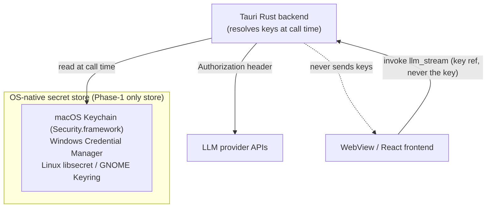

# Desktop Keychain & Secrets

> Last updated: 2026-06-03

- **Status**: Reference
- **Surface**: Desktop (Tauri v2)
- **Scope**: Phase 1, local-first. API-key and passphrase storage. No key ever leaves the machine except in outbound LLM API calls.
- **Related**: [tauri-plugins.md](tauri-plugins.md), [database-schema.md](database-schema.md), [../../architecture/local-first-and-security.md](../../architecture/local-first-and-security.md), [decision 0006](../../decisions/0006-os-keychain-for-api-keys.md), [../../runbooks/add-a-provider-key.md](../../runbooks/add-a-provider-key.md)

This is the canonical reference for how the desktop app stores LLM provider API keys and the database passphrase. The governing principle: **secrets are never written to disk in plaintext, never sent to the WebView/frontend, and never serialized into workflow YAML, run records, logs, or IPC payloads.**

## Storage model

API keys are read **at LLM-call time** by the Rust backend (via the `llm_stream` command — the WebView passes only a key *reference*), used to set the request `Authorization` header, and never round-tripped to the frontend. The WebView only ever sees a non-sensitive **key hint** (e.g. last 4 characters) for display. The command shape is canonical in [../contracts/ipc-contract.md](../contracts/ipc-contract.md#rust-delegated-llm-egress).

## The key store — OS keychain (the only Phase-1 store)

In Phase 1 the OS-native secret manager is the **only** key store, accessed via `tauri-plugin-keychain` (the keyring/keychain plugin; see [tauri-plugins.md](tauri-plugins.md)). The plugin dispatches to the platform backend:

| Platform | Backend | Notes |
|----------|---------|-------|
| macOS | Security.framework (Keychain Services) | Hardware-backed on Apple Silicon (Secure Enclave); integrates with the OS lock screen |
| Windows | Windows Credential Manager | Per-user credential vault |
| Linux | libsecret (GNOME Keyring / KWallet via Secret Service API) | Requires a running Secret Service provider |

### Entry naming

Each secret is stored as a **separate** keychain entry so individual keys can be rotated or revoked independently:

- `service` = `relavium`
- `account` = `{providerId}:{keyId}` (e.g. `anthropic:default`, `openai:work`)

The built-in web-search tool stores its key the same way under `account = search-provider` (see [../shared-core/built-in-tools.md](../shared-core/built-in-tools.md)).

**Inbound MCP named secrets** (2.R, [ADR-0052](../../decisions/0052-inbound-mcp-client-package-lifecycle-registration.md) §6) live in a **separate, isolated namespace**:

- `account` = `mcp-secret:<name>` (e.g. `mcp-secret:github-token`)
- env-var fallback = `RELAVIUM_MCP_<NAME>` (the name upper-cased, non-`[A-Z0-9]` → `_`), mirroring the provider `RELAVIUM_<PROVIDER>_API_KEY` chain. **The env-var mapping is lossy** — two secret names differing only in separators (`gh-api` vs `gh.api`) collapse to the same `RELAVIUM_MCP_GH_API`, so the env-var fallback can serve one name's value for the other. The **keychain** account (`mcp-secret:<name>`) is the exact, lossless source; the collision is confined to the isolated namespace (it can never reach a provider key) and never surfaces a value, but for the headless env-only path keep secret names charset-distinct in `[A-Z0-9_]`.

A `{{secrets.<name>}}` placeholder in an MCP server's `env` resolves **only** within this `mcp-secret:*` namespace (keychain → env var → fail-closed) and is injected **only** into the spawned server's child environment — never a committed YAML, a log, an event, or a `--json` line. The isolation is load-bearing: `{{secrets.*}}` can **never** reach a provider-key account (`{providerId}:{keyId}`) or `search-provider`, so a hostile imported workflow naming a *provider* key resolves an unrelated (normally-empty) `mcp-secret:*` account instead of the real key — closing the exfiltration path under the "a shared/imported workflow is the invite" distribution model.

The `llm_providers` table stores only an `api_key_keychain_ref` (the `account` identifier) — **never the key value** (see [database-schema.md](database-schema.md)).

## Encrypted-file fallback — deferred past v1.0

There is **no** encrypted-file key store in v1.0. A headless/CI fallback for environments without an OS keychain is **reserved** for a later release, and when it lands it must use a **proper KDF** (e.g. Argon2id over a user passphrase) — Relavium does **not** hand-roll key derivation, so the earlier machine-secret-XOR scheme is explicitly off the table. For v1.0 the OS keychain is the only key store; where no Secret Service / keychain is available, the app surfaces an error rather than falling back to a hand-rolled file format (see [No silent plaintext fallback](#operational-notes)).

## Database passphrase (SQLCipher)

The global run-history database (`~/.relavium/history.db`) is encrypted with SQLCipher **on the desktop** (see [database-schema.md](database-schema.md)). Its passphrase is derived from the same stable machine secret combined with a keychain entry, so the database opens automatically on restart without prompting the user. The passphrase is set in the Rust `setup()` hook **before** the SQL plugin initializes — if it is not present when the database is opened, the open fails.

The **Phase-2 CLI does not use SQLCipher**: it opens the same `history.db` with `better-sqlite3` **unencrypted**, guarded by `0600`/`0700` OS file permissions ([ADR-0050](../../decisions/0050-cli-history-db-at-rest-posture.md)). This is safe because the file holds **no credentials** — provider keys stay here in the OS keychain, and the engine masks `secret`-typed inputs and tool I/O before they are persisted. The two at-rest postures cannot share one file at the same path; reconciling cross-surface coexistence is a named Phase-3 follow-on (ADR-0050).

## What never holds a secret

| Surface | Guarantee |
|---------|-----------|
| Frontend / WebView | Receives only a key hint (last 4 chars). Never the key. |
| Workflow YAML (`.relavium.yaml`) | Tools reference secrets by env-var name / keychain ref, never inline. Export strips/placeholders any secret reference. |
| Run records, `messages`, `run_events` | Tool inputs are sanitized before persistence; no `Authorization` value is ever logged. |
| VS Code IPC (desktop-enhanced mode) | The VS Code extension is **standalone** and keeps its own keys in `vscode.SecretStorage`; the loopback desktop↔extension channel **never carries a raw key in either direction**. The handshake (dynamic port + bearer token) is canonical in [../contracts/ipc-contract.md](../contracts/ipc-contract.md#vs-code-mirror-loopback-http). |
| Tray / notifications | Never include secret material. |

## Operational notes

- **SQLCipher passphrase must be set before plugin init.** Derive it from a stable machine secret (not hardcoded) so restarts do not require a user prompt.
- **Capability gating.** Every keychain plugin call the frontend can trigger must be declared in the Tauri v2 capabilities manifest (`src-tauri/capabilities/`); a missing capability surfaces as a silent "not allowed" runtime error.
- **Linux dependency.** libsecret requires a Secret Service provider to be running; if none is present in v1.0, key storage is unavailable and the app surfaces an error (the KDF-based file fallback is deferred — see [Encrypted-file fallback — deferred past v1.0](#encrypted-file-fallback--deferred-past-v10)).
- **No silent plaintext fallback.** If the OS keychain cannot be used, the app surfaces an error rather than writing a key in the clear; it never hand-rolls an alternative key store. _(The CLI's run-time key resolver additionally falls through to the `RELAVIUM_<PROVIDER>_API_KEY` env var when the keychain is absent or unavailable — an env var is not an on-disk plaintext store, so this is not a plaintext fallback; the `provider set-key` **write** path still surfaces an unavailable keychain as a clean error.)_

## Phase 2 divergence

> Applies only to **Phase 2 cloud execution**. See [../../architecture/cloud-phase-2.md](../../architecture/cloud-phase-2.md).

In cloud mode, provider keys for cloud-executed runs move from the OS keychain to an AES-256-GCM-encrypted column in PostgreSQL, with the encryption key sourced from a server-side secret manager. Keys are decrypted in-process at call time, never logged, and never placed in queue (BullMQ/Redis) job payloads. Local-mode runs continue to use the OS keychain exactly as described above. The CLI and VS Code extension use their own platform stores (`@napi-rs/keyring` — not the archived `keytar`, see [ADR-0019](../../decisions/0019-cli-node-keychain-library.md) — and `vscode.SecretStorage` respectively); see [../cli/commands.md](../cli/commands.md) and [../vscode/extension-api.md](../vscode/extension-api.md).
