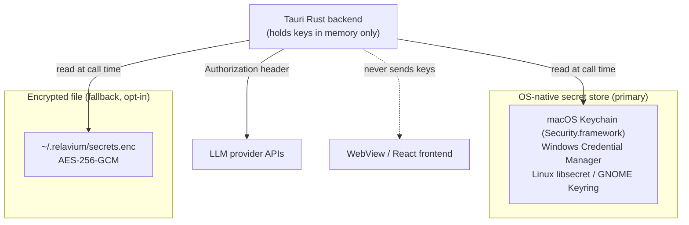

# Desktop Keychain & Secrets

> Last updated: 2026-06-03

- **Status**: Reference
- **Surface**: Desktop (Tauri v2)
- **Scope**: Phase 1, local-first. API-key and passphrase storage. No key ever leaves the machine except in outbound LLM API calls.
- **Related**: [tauri-plugins.md](tauri-plugins.md), [database-schema.md](database-schema.md), [../../architecture/local-first-and-security.md](../../architecture/local-first-and-security.md), [decision 0006](../../decisions/0006-os-keychain-for-api-keys.md), [../../runbooks/add-a-provider-key.md](../../runbooks/add-a-provider-key.md)

This is the canonical reference for how the desktop app stores LLM provider API keys and the database passphrase. The governing principle: **secrets are never written to disk in plaintext, never sent to the WebView/frontend, and never serialized into workflow YAML, run records, logs, or IPC payloads.**

## Storage model

API keys are read **at LLM-call time** by the Rust backend, used to set the request `Authorization` header, and never round-tripped to the frontend. The WebView only ever sees a non-sensitive **key hint** (e.g. last 4 characters) for display.

## Layer 1 — OS keychain (default)

The primary store is the OS-native secret manager, accessed via `tauri-plugin-keychain` (the keyring/keychain plugin; see [tauri-plugins.md](tauri-plugins.md)). The plugin dispatches to the platform backend:

| Platform | Backend | Notes |
|----------|---------|-------|
| macOS | Security.framework (Keychain Services) | Hardware-backed on Apple Silicon (Secure Enclave); integrates with the OS lock screen |
| Windows | Windows Credential Manager | Per-user credential vault |
| Linux | libsecret (GNOME Keyring / KWallet via Secret Service API) | Requires a running Secret Service provider |

### Entry naming

Each secret is stored as a **separate** keychain entry so individual keys can be rotated or revoked independently:

- `service` = `relavium`
- `account` = `{providerId}:{keyId}` (e.g. `anthropic:default`, `openai:work`)

The built-in web-search tool stores its key the same way under `account = search-provider` (see [../shared-core/built-in-tools.md](../shared-core/built-in-tools.md)).

The `llm_providers` table stores only an `api_key_keychain_ref` (the `account` identifier) — **never the key value** (see [database-schema.md](database-schema.md)).

## Layer 2 — AES-256-GCM encrypted file (fallback, opt-in)

For headless or CI environments where no OS keychain is available, an opt-in file fallback is used:

- **Location**: `~/.relavium/secrets.enc`
- **Cipher**: AES-256-GCM (authenticated encryption — detects tampering)
- **Key derivation**: a machine-specific secret **XOR'd** with a user-set master passphrase
  - macOS: `IOPlatformUUID`
  - Windows: `MachineGuid`
  - Linux: `/etc/machine-id`
- **Master passphrase**: prompted at launch, held in process memory only, and **never stored**. Losing it means the file cannot be decrypted (by design).

The keychain approach is the default; the file fallback is enabled explicitly via config (see [../contracts/config-spec.md](../contracts/config-spec.md)).

## Database passphrase (SQLCipher)

The global run-history database (`~/.relavium/history.db`) is encrypted with SQLCipher (see [database-schema.md](database-schema.md)). Its passphrase is derived from the same stable machine secret combined with a keychain entry, so the database opens automatically on restart without prompting the user. The passphrase is set in the Rust `setup()` hook **before** the SQL plugin initializes — if it is not present when the database is opened, the open fails.

## What never holds a secret

| Surface | Guarantee |
|---------|-----------|
| Frontend / WebView | Receives only a key hint (last 4 chars). Never the key. |
| Workflow YAML (`.relavium.yaml`) | Tools reference secrets by env-var name / keychain ref, never inline. Export strips/placeholders any secret reference. |
| Run records, `messages`, `run_events` | Tool inputs are sanitized before persistence; no `Authorization` value is ever logged. |
| VS Code IPC (hybrid mode) | When the desktop app is running, it returns a key to the VS Code extension only over the authenticated loopback IPC after verifying the shared `.ipc-token`; see [../contracts/ipc-contract.md](../contracts/ipc-contract.md). |
| Tray / notifications | Never include secret material. |

## Operational notes

- **SQLCipher passphrase must be set before plugin init.** Derive it from a stable machine secret (not hardcoded) so restarts do not require a user prompt.
- **Capability gating.** Every keychain plugin call the frontend can trigger must be declared in the Tauri v2 capabilities manifest (`src-tauri/capabilities/`); a missing capability surfaces as a silent "not allowed" runtime error.
- **Linux dependency.** libsecret requires a Secret Service provider to be running; if none is present, the app falls back to the encrypted-file layer.
- **No silent plaintext fallback.** If neither the keychain nor the file fallback can be used, the app surfaces an error rather than writing a key in the clear.

## Phase 2 divergence

> Applies only to **Phase 2 cloud execution**. See [../../architecture/cloud-phase-2.md](../../architecture/cloud-phase-2.md).

In cloud mode, provider keys for cloud-executed runs move from the OS keychain to an AES-256-GCM-encrypted column in PostgreSQL, with the encryption key sourced from a server-side secret manager. Keys are decrypted in-process at call time, never logged, and never placed in queue (BullMQ/Redis) job payloads. Local-mode runs continue to use the OS keychain exactly as described above. The CLI and VS Code extension use their own platform stores (`keytar` and `vscode.SecretStorage` respectively); see [../cli/commands.md](../cli/commands.md) and [../vscode/extension-api.md](../vscode/extension-api.md).
