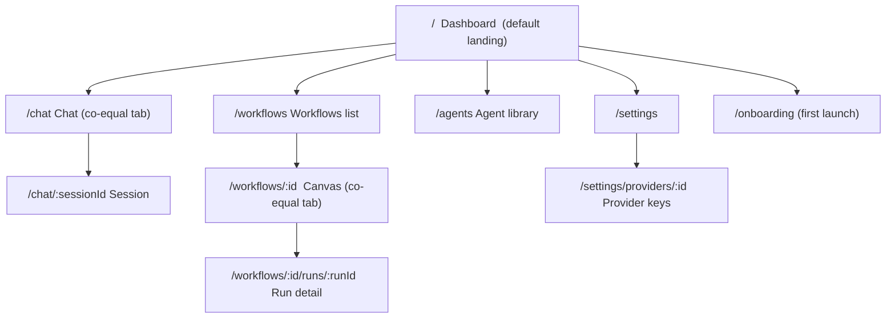

# Desktop Routes & Screens

> Last updated: 2026-06-03

- **Status**: Reference
- **Surface**: Desktop (Tauri v2 + Vite + React 19 + TanStack Router)
- **Scope**: Phase 1, local-first. The desktop app's route table and what each screen is for.
- **Related**: [tauri-plugins.md](tauri-plugins.md), [database-schema.md](../shared-core/database-schema.md), [keychain-and-secrets.md](keychain-and-secrets.md), [../shared-core/store-shapes.md](../shared-core/store-shapes.md), [../shared-core/node-types.md](../shared-core/node-types.md), [../contracts/sse-event-schema.md](../contracts/sse-event-schema.md), [../contracts/agent-session-spec.md](../contracts/agent-session-spec.md), [../../architecture/desktop-architecture.md](../../architecture/desktop-architecture.md), [decision 0007](../../decisions/0007-desktop-is-not-an-ide.md), [decision 0025](../../decisions/0025-agent-surface-refines-desktop-scope.md)

This is the canonical reference for the desktop app's screens. The desktop app is an **agent-management center** — a workflow canvas, a conversational agent surface, agent configuration, run monitoring, and cost tracking. It is **not** an IDE, **not** a code editor, and **not** a terminal (see [decision 0007](../../decisions/0007-desktop-is-not-an-ide.md), refined by [decision 0025](../../decisions/0025-agent-surface-refines-desktop-scope.md)). Code-adjacent work happens in the [VS Code extension](../vscode/extension-api.md), not here.

Routing uses TanStack Router (typed, file-based). The route tree below adapts the original frontend plan to the agent-management framing. **Chat and Canvas are co-equal top-level surfaces** ([ADR-0025](../../decisions/0025-agent-surface-refines-desktop-scope.md)): conversing with an agent (Chat) and designing/running a workflow (Canvas) are peers reachable in one click, while the neutral operational home (Dashboard) stays the default landing.

## Route map

A persistent app shell wraps every route: top bar (workspace switcher, global Run/Command-palette trigger), left nav (Dashboard / Chat / Workflows / Agents / Settings), and a root-level human-gate overlay that can surface over any screen when a run pauses for approval. **Chat and Canvas are co-equal top-level tabs** ([ADR-0025](../../decisions/0025-agent-surface-refines-desktop-scope.md)); the neutral Dashboard remains the default landing screen — the app does **not** force-open to Chat.

## Routes

| Route | Screen | Purpose |
|-------|--------|---------|
| `/` | **Dashboard** | The neutral operational home and **default landing screen** (the app does not force-open to Chat). Recent runs, active runs, quick cost snapshot, starter-template gallery, and the single first-run CTA ("Connect your first API key"). |
| `/chat` | **Chat** | A **co-equal top-level tab** alongside Canvas ([ADR-0025](../../decisions/0025-agent-surface-refines-desktop-scope.md)). The agent-first entry point: pick an agent, give it context, and converse with a streamed [agent session](../contracts/agent-session-spec.md) ([ADR-0024](../../decisions/0024-agent-first-entry-point-agentsession.md)). Lists resumable past sessions; new sessions start here. |
| `/chat/:sessionId` | **Session** | One open [agent session](../contracts/agent-session-spec.md): the live transcript with tool-call annotations, streaming, the steering input, and the **Export-to-Canvas** affordance ([ADR-0026](../../decisions/0026-session-export-to-workflow.md)). Auto-persisted and resumable. |
| `/onboarding` | **Onboarding** | First-launch flow: add an API key, create a first agent, open a starter template. Shown until at least one provider key exists. |
| `/workflows` | **Workflows list** | Browse all `.relavium.yaml` workflows in the open workspace, grouped by tag, each showing last-run status. Create / import / duplicate / delete. |
| `/workflows/:id` | **Canvas** | The ReactFlow workflow editor — the product's signature surface, **co-equal with Chat** ([ADR-0025](../../decisions/0025-agent-surface-refines-desktop-scope.md)). Design the graph, configure nodes in the right-hand panel, and watch live execution on the node faces. |
| `/workflows/:id/runs/:runId` | **Run detail** | Per-run inspection: node-by-node trace, Gantt timeline, streamed event log, per-node cost waterfall, retry-from-node, and replay. |
| `/agents` | **Agent library** | Browse and manage agents (`.agent.yaml`): model, system prompt, tools, fallback chain. Includes inline test chat. |
| `/settings` | **Settings** | App preferences, providers list, MCP server registrations, keychain/secrets options, update channel. |
| `/settings/providers/:id` | **Provider detail** | Configure one provider: add/rotate the API key (stored in the OS keychain), view its model catalog with pricing. |

## Screen details

### Dashboard (`/`)
The neutral operational home and the **default landing screen** — agent-first does not mean force-opening to Chat; Dashboard stays the launch surface and both Chat and Canvas are one click away ([ADR-0025](../../decisions/0025-agent-surface-refines-desktop-scope.md)). Surfaces what ran recently and what is running now, a small cost snapshot, and a curated set of starter templates (3–5 bundled at install). On a fresh install the canvas-adjacent UI is dimmed and a single CTA points the user to add an API key. Data comes from the `runs` / `run_costs` tables (see [database-schema.md](../shared-core/database-schema.md)).

### Chat (`/chat`)
The agent-first conversational entry point and a **co-equal top-level tab** with Canvas ([ADR-0024](../../decisions/0024-agent-first-entry-point-agentsession.md), [ADR-0025](../../decisions/0025-agent-surface-refines-desktop-scope.md)). The screen has two jobs:

- **Start a session.** Pick an agent (`.agent.yaml`) and model — one agent/model per session, with the same fallback chain workflows use — give it initial context (the auto-detected workspace root / active file / git branch, each overridable), and begin. Starting a session creates an [agent session](../contracts/agent-session-spec.md) on the engine.
- **Resume a session.** Lists past sessions read from `agent_sessions` (see [database-schema.md](../shared-core/database-schema.md)); selecting one opens `/chat/:sessionId`. Sessions are auto-persisted and resumable.

### Session (`/chat/:sessionId`)
One open [agent session](../contracts/agent-session-spec.md). The live transcript renders streamed assistant tokens and **tool-call annotations** (each tool invocation and its result shown inline, the same allowlisted, FS-scope-tiered tools a workflow agent uses), driven by the `session:*` events in [sse-event-schema.md](../contracts/sse-event-schema.md). Key behaviors:

- **Context input + steering.** A message composer drives the conversation; messages are append-only.
- **Export-to-Canvas.** A one-click affordance serializes the session to a reviewed `.relavium.yaml` **scaffold** — a linear agent-node chain plus the transcript as YAML metadata — then opens it on the Canvas for review before commit ([ADR-0026](../../decisions/0026-session-export-to-workflow.md)). It is an explicit action, separate from auto-persistence; parallel/condition/loop structure is not auto-extracted.
- **Persistence.** The transcript persists to `agent_sessions` / `session_messages` in the encrypted local `history.db` (see [database-schema.md](../shared-core/database-schema.md)); the session is resumable after relaunch and replayable only after export.

### Workflows list (`/workflows`)
Lists every workflow file discovered in the open workspace's `.relavium/` directory, grouped by tag, each row showing its last-run status icon. Workflows are the git-committable source of truth ([../contracts/workflow-yaml-spec.md](../contracts/workflow-yaml-spec.md)); the list is a view over them. Actions: New, Import (open a `.relavium.yaml`), Duplicate, Delete. "Latest run per workflow" is computed with a `ROW_NUMBER()` query (see [database-schema.md](../shared-core/database-schema.md)).

### Canvas (`/workflows/:id`)
The ReactFlow editor and the product's signature surface — co-equal with [Chat](#chat-chat) as a top-level tab ([ADR-0025](../../decisions/0025-agent-surface-refines-desktop-scope.md)): token streaming renders **inside individual node faces** as the workflow executes ("live execution theater"). It is also the review target for a session exported via [Export-to-Canvas](#session-chatsessionid). Key behaviors:

- **Node configuration** uses a right-hand side panel, never modal dialogs.
- All 9 canvas components are present (AgentNode, ConditionNode, FanOutNode, AggregatorNode, **LoopNode** *(reserved — forward-compat palette slot, not executable/authorable in v1.0)*, HumanGateNode, InputNode, OutputNode, ToolNode); see [../shared-core/node-types.md](../shared-core/node-types.md).
- Canvas state (nodes/edges) is held in a ReactFlow-local context and serialized on save; per-node run status is read via direct Zustand subscriptions to avoid O(n) re-renders during streaming (see [../shared-core/store-shapes.md](../shared-core/store-shapes.md) and [decision 0010](../../decisions/0010-zustand-direct-subscriptions-for-reactflow.md)).
- During an active run the graph is locked (no accidental mutations); the Run/Stop controls live in the canvas toolbar.
- File-typed input nodes open a native file picker (`tauri-plugin-dialog`); files can also be dropped onto the canvas (see [tauri-plugins.md](tauri-plugins.md)).

### Run detail (`/workflows/:id/runs/:runId`)
A read-only inspection view of one execution. Replays the persisted event stream (`run_events`, in [RunEvent](../contracts/sse-event-schema.md) order), shows a per-node trace and Gantt timeline, and renders the per-node cost waterfall from `run_costs`. Supports **retry-from-node** (replays from a checkpoint reusing completed upstream outputs) and full replay.

### Agent library (`/agents`)
Manage agents independently of any workflow. Each agent (`.agent.yaml`, see [../contracts/agent-yaml-spec.md](../contracts/agent-yaml-spec.md)) declares a model, system prompt, tools, temperature/limits, and an optional multi-model fallback chain. An inline **test chat** lets the user exercise an agent (streamed) before wiring it into a workflow. This screen embodies the "agents are first-class" decision — agents are reusable assets, not anonymous nodes.

### Settings (`/settings`)
App-level configuration: general preferences, the providers list, MCP server registrations (see [../shared-core/mcp-integration.md](../shared-core/mcp-integration.md)), keychain/secrets options (see [keychain-and-secrets.md](keychain-and-secrets.md)), and the update channel. Global vs per-project config split is defined in [../contracts/config-spec.md](../contracts/config-spec.md).

### Provider detail (`/settings/providers/:id`)
Configure a single provider. Add or rotate its API key — stored in the OS keychain, never on disk in plaintext, and surfaced in the UI only as a last-4-char hint (see [keychain-and-secrets.md](keychain-and-secrets.md)). Shows the provider's model catalog with context windows and per-token pricing from `model_catalog` (see [database-schema.md](../shared-core/database-schema.md)). To add a key step-by-step, see [../../runbooks/add-a-provider-key.md](../../runbooks/add-a-provider-key.md).

## Cross-cutting UI

- **Human-gate overlay.** Mounted at the root layout so a pending [`human_gate:paused`](../contracts/sse-event-schema.md) event can surface an approval prompt over any screen. The same gate is reachable from the system tray (attention state) — see [tauri-plugins.md](tauri-plugins.md).
- **Command palette.** Opened by the global hotkey; lists recent workflows for instant run without surfacing the main window.
- **Cost is always visible.** Per-run and per-node cost is a persistent element of the run-related screens, not buried in a separate billing page.

## Not present (by design)

The boundary is **agent capabilities (in scope) vs. an IDE shell (out of scope)** — [decision 0025](../../decisions/0025-agent-surface-refines-desktop-scope.md) refines [decision 0007](../../decisions/0007-desktop-is-not-an-ide.md) without reversing it. The Chat tab is an **agent** capability — converse with an agent that itself edits files through the same allowlisted, FS-scope-tiered tools a workflow agent uses — so it is **allowed**. The **IDE shell remains forbidden**: the desktop app deliberately has **no** code editor / syntax-highlighted text buffer, **no** integrated terminal, and **no** file-tree/IDE chrome. There is no `/editor` route. Inline diff review of agent-proposed file changes is a **VS Code extension** capability (see [../vscode/extension-api.md](../vscode/extension-api.md)), not a desktop screen.

## Phase 2 note

> The web portal (`apps/portal`) is a separate Phase-2 SPA with its own route set (control-plane pages: usage, quota, runs, gates, team, audit). It is **not** where workflows are designed or run. See [../portal/api-reference.md](../portal/api-reference.md) and [../../architecture/cloud-phase-2.md](../../architecture/cloud-phase-2.md).
