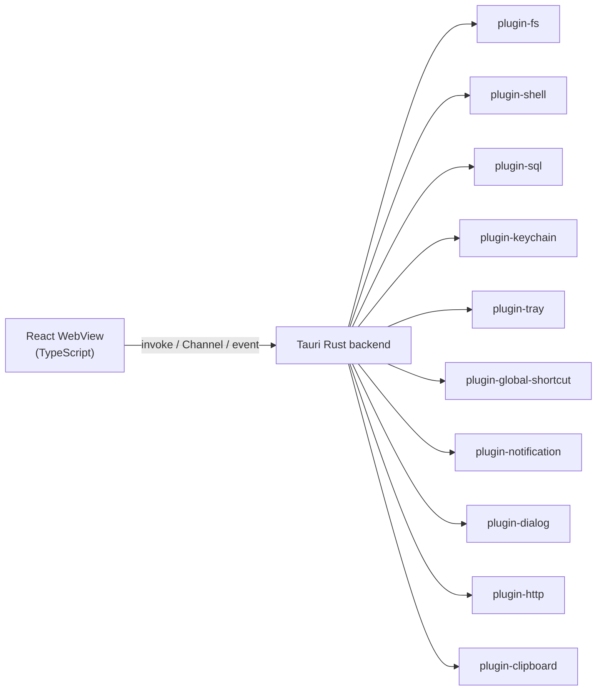

# Desktop Tauri v2 Plugins

> Last updated: 2026-06-03

- **Status**: Reference
- **Surface**: Desktop (Tauri v2)
- **Scope**: Phase 1, local-first. The Tauri v2 plugin set the desktop app depends on and what each enables.
- **Related**: [keychain-and-secrets.md](keychain-and-secrets.md), [database-schema.md](../shared-core/database-schema.md), [routes-and-screens.md](routes-and-screens.md), [../contracts/ipc-contract.md](../contracts/ipc-contract.md), [../../architecture/desktop-architecture.md](../../architecture/desktop-architecture.md), [decision 0001](../../decisions/0001-tauri-v2-over-electron.md)

The desktop app is built on [Tauri v2](https://v2.tauri.app/). The Rust backend is kept thin — system-level glue only — while all business logic stays in TypeScript in the WebView. Every system capability the app needs is provided by a first-class Tauri v2 plugin, which is the decisive reason Tauri was chosen over Electron and Wails (see [decision 0001](../../decisions/0001-tauri-v2-over-electron.md)).

## Plugin set

| Plugin | Enables | Used by |
|--------|---------|---------|
| `tauri-plugin-fs` | Scoped filesystem read/write. Path access is validated against a configured scope before any syscall. | Loading/saving `.relavium.yaml` & `.agent.yaml`; the `read_file` / `write_file` / `list_directory` built-in tools |
| `tauri-plugin-shell` | Spawning OS child processes from an explicit allowlist. | The `run_command` / `git_status` / `git_commit` built-in tools; stdio MCP server processes |
| `tauri-plugin-sql` | SQLite access, with the **SQLCipher** feature for encryption at rest. | The desktop `history.db` (SQLCipher-encrypted at rest); the per-project `runs.db` is intentionally **unencrypted** (git-committed metadata) — see [database-schema.md](../shared-core/database-schema.md) |
| `tauri-plugin-keychain` | OS-native secret storage (macOS Keychain / Windows Credential Manager / Linux libsecret). | API-key and DB-passphrase storage — see [keychain-and-secrets.md](keychain-and-secrets.md) |
| `tauri-plugin-tray` | System tray icon, menu, and badge. | Active-run monitor, awaiting-gate badge, "New Run" quick menu |
| `tauri-plugin-global-shortcut` | OS-level global hotkeys. | Command-palette hotkey (`Cmd/Ctrl+Shift+A`) and "run on selection" (`Cmd/Ctrl+Shift+R`) |
| `tauri-plugin-notification` | Native desktop notifications with action buttons. | Run completed / failed / human-gate-waiting alerts |
| `tauri-plugin-dialog` | Native file pickers (`NSOpenPanel` / `IFileOpenDialog` / GTK `FileChooserDialog`). | File-typed workflow input nodes; tool path parameters |
| `tauri-plugin-http` | Outbound HTTP/HTTPS with streaming, per-workflow domain allowlist. | The `http_request` / `web_search` built-in tools |
| `tauri-plugin-clipboard` | Read clipboard contents. | The `read_clipboard` built-in tool; "run on current selection" |

The built-in tools referenced above are specified in [../shared-core/built-in-tools.md](../shared-core/built-in-tools.md).

## Where plugins back desktop UX features

| Desktop feature | Plugin(s) |
|-----------------|-----------|
| Global-hotkey command palette | `global-shortcut` + a frameless always-on-top WebView window |
| System-tray run monitor (idle / active / attention) | `tray` + `notification` |
| Native file picker for `file` input nodes | `dialog` + `fs` (scope validation) |
| Drag-and-drop files onto the canvas | Tauri window drag-drop events + `fs` |
| Completion / failure / gate notifications | `notification` |

These features are surfaced across the app screens documented in [routes-and-screens.md](routes-and-screens.md).

## IPC primitives (not plugins, but core to the backend)

Tauri v2's three IPC primitives carry data between the Rust backend and the React frontend. They are documented in full in [../contracts/ipc-contract.md](../contracts/ipc-contract.md); summarized here for context:

- **Commands** (`tauri::command`) — request/response: load workflows, save files, start/cancel runs, query run history.
- **Channels** (`tauri::ipc::Channel`) — ordered, backpressure-aware, high-throughput streams: token chunks, node-status changes, cost updates (the [RunEvent](../contracts/sse-event-schema.md) stream). Channels are preferred over events for streaming because they avoid string-serialization overhead and naturally throttle when the frontend renders slowly.
- **Events** (`window.emit` / `listen`) — broadcast notifications for loosely-coupled UI: active-run count (tray badge), update availability, MCP server health.

The VS Code extension does not use Tauri IPC; in hybrid mode it connects over a loopback HTTP server (axum) the backend runs inside the same tokio runtime — see [../contracts/ipc-contract.md](../contracts/ipc-contract.md).

## Operational notes

- **Capabilities are mandatory.** Tauri v2 replaces v1's allowlist with a capabilities manifest in `src-tauri/capabilities/`. Every plugin API the frontend can call must be explicitly declared, or the call fails silently at runtime as "not allowed." Add capabilities incrementally and test each plugin surface during development.
- **WebView2 on Windows.** `tauri-plugin-sql` and the WebView require the WebView2 Runtime. The NSIS/WiX installer bootstraps it automatically, but the app will not launch on Windows 10 machines without it (pre-installed on Windows 11). Validate the installer on a clean Windows 10 VM before shipping.
- **SQLCipher passphrase ordering.** The passphrase must be derived and set in the Rust `setup()` hook **before** `plugin-sql` initializes — see [keychain-and-secrets.md](keychain-and-secrets.md).
- **Loopback-only HTTP + token perms.** The axum server for VS Code connectivity must bind to `127.0.0.1` only (never `0.0.0.0`), and the auth token file must be `0600`. On macOS, declare `com.apple.security.network.server` in the entitlements plist or the binding is silently blocked by the sandbox.
- **`reqwest` keepalive.** LLM streaming calls from Rust set a request timeout (~120s) and TCP keepalive (~30s); without keepalive, idle streaming connections on macOS are dropped by the OS TCP stack after ~60s.

## Phase 2 note

> The cloud surfaces (`apps/api`, `apps/portal`) are **not** Tauri apps and use none of these plugins — they run on Node/Bun with PostgreSQL, Redis, and BullMQ. See [../../architecture/cloud-phase-2.md](../../architecture/cloud-phase-2.md).
