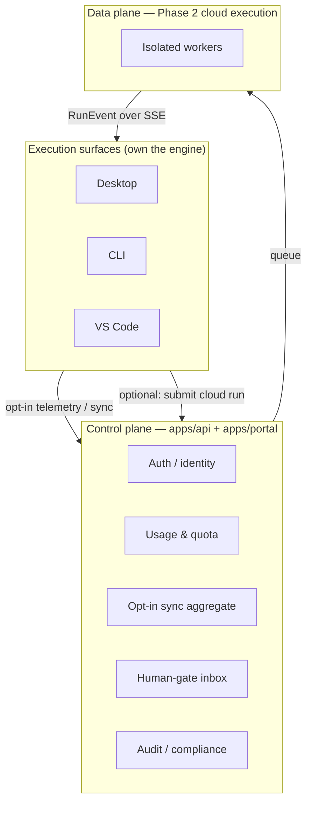

# Portal API Reference (Phase 2)

> Status: draft — Phase 2

- **Status**: Draft (Phase 2 — cloud/control-plane; **not** part of the shipped Phase-1 local-first product)
- **Surface**: Web portal + cloud control plane (`apps/portal` + `apps/api`)
- **Scope**: The intended control-plane API for identity, usage/quota, licensing, sync, human-gate fulfillment, and cloud-run submission. Nothing here exists or is required in Phase 1.
- **Related**: [../../architecture/cloud-phase-2.md](../../architecture/cloud-phase-2.md), [../../architecture/managed-inference.md](../../architecture/managed-inference.md), [../shared-core/llm-provider-seam.md](../shared-core/llm-provider-seam.md), [../desktop/database-schema.md](../desktop/database-schema.md), [../contracts/sse-event-schema.md](../contracts/sse-event-schema.md), [../contracts/workflow-yaml-spec.md](../contracts/workflow-yaml-spec.md), [../cli/commands.md](../cli/commands.md), [../vscode/extension-api.md](../vscode/extension-api.md), [../desktop/keychain-and-secrets.md](../desktop/keychain-and-secrets.md)

> **Phase 2 only.** Relavium Phase 1 is fully local-first with no account and no cloud (see [product-constraints.md](../../product-constraints.md) and [vision.md](../../vision.md)). The portal is a **control plane, not an execution plane** — workflows are never designed or run here; that happens in the [desktop app](../desktop/routes-and-screens.md), [VS Code extension](../vscode/extension-api.md), or [CLI](../cli/commands.md). The portal answers a different set of questions: *who is running what, how much does it cost, who has access, and is it compliant?* This file is a forward-looking scaffold; concrete request/response schemas, error codes, and pagination will be specified as Phase 2 is built. Do not treat any shape below as final.

## What the portal is (and is not)

- **Is:** identity/SSO, usage analytics, quota and budgets, licensing/tiers, opt-in sync of metadata, a unified human-gate inbox, audit logs, and (for cloud-mode runs) run submission + event streaming.
- **Is not:** a workflow designer, a canvas, or the place execution happens. The same `@relavium/core` engine runs in workers in cloud mode — there is no portal-specific engine.

## Authentication

Auth uses **OAuth Device Flow (RFC 8628)** for interactive surfaces, plus long-lived **API tokens** for CI/CD. Device flow lets the desktop app and CLI start auth with a single command, lets the user authenticate in any browser (including corporate SSO), issues short-lived access tokens with refresh tokens (enabling revocation), and gives each device its own token. Access tokens are stored in the OS keychain, never in plaintext files (see [keychain-and-secrets.md](../desktop/keychain-and-secrets.md)).

Sketch of the device-flow exchange (shapes illustrative, not final):

| Step | Call | Result |
|------|------|--------|
| 1 | `POST /auth/device` | `{ device_code, user_code, verification_uri }` |
| 2 | Surface prints `verification_uri` + `user_code` | User opens browser, signs in (password / Google / SAML / OIDC), enters the code |
| 3 | `POST /auth/device/token` (poll, ~5 s) | On success: `{ access_token (≈1 h TTL), refresh_token (≈90 d TTL) }` |

- CLI: `relavium auth login` runs the full flow in ~10 s; `relavium auth login --with-token` reads a token from the environment for CI/CD and skips the device flow.
- The engine sets `EngineConfig.cloudAuthToken` to the access token; refresh happens transparently before API calls.

> Endpoint paths above are indicative. The exact auth surface (token introspection, revocation, refresh) is to be specified in Phase 2.

## Sync model (opt-in, metadata-only)

Nothing syncs by default. Sync is enabled **per data category** by the user (e.g. `relavium config set sync.run_history true`), is encrypted in transit (TLS 1.3) and at rest (AES-256), and is eventually consistent. The portal is a **read-only aggregate** of what surfaces choose to report — it is never the source of truth for local execution.

| Category | What syncs | Trigger |
|----------|-----------|---------|
| Usage telemetry | Token counts per model/agent/run (compact events at run completion) — drives the quota dashboard | Opt-in |
| Run metadata | `runId`, `workflowId`, status, duration, timestamps, tags — **no outputs** | Opt-in |
| Workflow definitions | YAML/JSON | Explicit backup / team-share action only |
| Agent library | Team-level publish/pull | Explicit |
| Audit events | Structured compliance records (who ran what, who fulfilled which gate) | Enterprise, at run completion |

> **Privacy guarantee (load-bearing):** full LLM prompt/response **transcripts are NEVER synced or stored server-side** in any tier or mode — **including `managed` mode**. They stay on the user's machine (local mode) or in an isolated worker's ephemeral storage (cloud mode, deleted after the run). In **managed** mode the gateway sits in the data path but **meters token counts, not content**: a `usage_events` row stores counts, the canonical model id, cost figures, and a pool-key reference — **never the request or response body** (no prompt logging by default; [ADR-0015](../../decisions/0015-managed-mode-data-handling-and-compliance.md)). The portal and the gateway see only structured metadata and aggregate token counts. This is what makes the platform viable for security-conscious teams — and the BYOK modes remain available for those who want no Relavium server in the path at all. See [../../architecture/managed-inference.md](../../architecture/managed-inference.md#data-handling-no-prompt-logging-by-default).

## Intended API surface

The portal/control-plane API is expected to cover the areas below. These are **planned** groupings, not finalized endpoints — paths, verbs, and bodies will be locked during Phase 2.

| Area | Purpose | Indicative operations |
|------|---------|-----------------------|
| **Auth** | Device flow, token lifecycle, API tokens, SSO | `POST /auth/device`, `POST /auth/device/token`, token refresh/revoke, API-token CRUD |
| **Usage** | Token/cost analytics aggregated from telemetry | Query usage by model / workflow / agent over a date range |
| **Quota** | Budgets, alert thresholds, enforcement policy (Pro+) | Get/set monthly budget per model; alert config (80 %/100 %); enforcement action (warn / pause / hard-stop) |
| **Runs** | Read-only run-history aggregate across surfaces | List/filter runs (workflow, surface, status, tag, date); run-metadata detail; CSV export |
| **Gates** | Unified human-gate inbox | List pending gates; **decide** a gate (`POST /runs/{runId}/gates/{gateId}/decide`) from any surface; gate history |
| **Cloud execution** | Submit and stream cloud-mode runs (see below) | `POST /runs`, `GET /runs/{runId}`, `GET /runs/{runId}/events` (SSE) |
| **Sync** | Push opt-in metadata; team backup/share | Per-category sync of metadata, workflow defs, agent library |
| **Team / RBAC** | Workspaces, membership, roles (Team+) | Members + roles (viewer / runner / editor / admin); invites; shared library |
| **Audit** | SOC 2-style immutable event log (Enterprise) | Query/filter events; CSV/JSON export for SIEM |

## Cloud execution endpoints (Phase 2 data plane)

When a surface runs in `executionMode: 'cloud'`, the engine becomes a thin client over the control plane. The same [`RunEvent`](../contracts/sse-event-schema.md) types are returned — surfaces are unaware of the execution location.

| Operation | Purpose |
|-----------|---------|
| `POST /runs` | Submit `workflow + inputs + identity`; queues a job, returns a `runId`. |
| `GET /runs/{runId}` | Current state, outputs, and an events replay. |
| `GET /runs/{runId}/events` | Real-time `text/event-stream` (SSE) of `RunEvent`s for an active run; reconnect via `Last-Event-ID` and replay missed events. |
| `POST /runs/{runId}/gates/{gateId}/decide` | Fulfill a human gate from any surface; idempotent — first valid decision wins. |

Behind these endpoints, the data plane runs each workflow as an isolated worker that executes the **same** `@relavium/core` engine, with egress restricted to allowed LLM providers and declared MCP servers, and ephemeral storage wiped on completion. The full topology (control plane vs data plane, key handling, gate fan-out, reconnection) is specified in [../../architecture/cloud-phase-2.md](../../architecture/cloud-phase-2.md).

## Managed-inference endpoints (Phase 2 gateway data plane)

> Distinct from cloud execution above. In `executionMode: 'managed'` the **engine stays on the user's machine** and only the LLM call is proxied to the Relavium gateway, which runs the provider call on **Relavium's** key and meters it. This is the thin gateway, not the heavy worker plane. Full design: [../../architecture/managed-inference.md](../../architecture/managed-inference.md).

The `ManagedGatewayProvider` (the `'managed'` implementation of the `LLMProvider` seam — see [../shared-core/llm-provider-seam.md](../shared-core/llm-provider-seam.md)) calls these gateway endpoints in place of a direct provider SDK call. The client sends a **normalized request** and its device token; it **never sends a provider key** (Relavium holds it). Responses are normalized **`StreamChunk` frames** — the same discriminated union the seam defines, so `@relavium/core` is unaware it is talking to a gateway rather than a local adapter.

| Operation | Purpose |
|-----------|---------|
| `POST /v1/inference/stream` | Stream a single managed model call. Request: a normalized `LlmRequest` (model id, messages, tools, …) + idempotency `request_id`. Response: `text/event-stream` of normalized **`StreamChunk`** frames (`text_delta`, `tool_call_*`, `stop` carrying final `usage`). The gateway forces `include_usage` so a final usage frame is always emitted. |
| `POST /v1/inference/generate` | Non-streaming equivalent; returns one normalized `LlmResult` (`content`, `stopReason`, `usage`). |

Each request flows through the gateway pipeline: **authz** (tenant + token) → **pre-flight quota/budget check + reserve** (rejects or routes to overage *before* any provider cost; enforces the hard cap and per-day budget from `quota_policies`) → **model routing** (cheap-default lane) → **key-pool selection** (rotation, 429-cooldown, cross-provider fallback) → the **same `@relavium/llm` adapter** with Relavium's key → **streaming usage capture** → **settle** the reservation into one immutable `usage_events` row keyed on the UNIQUE `request_id`. Idempotency means a retried `request_id` returns the prior settlement rather than billing twice. The endpoint paths and frame shapes above are indicative; they will be locked during Phase 2.

## Portal pages

The portal SPA (`apps/portal`, Vite + React + TanStack Router — not Next.js) presents the control plane. Pages and their primary purpose:

| Page | Purpose |
|------|---------|
| `/dashboard` | Health/activity snapshot across surfaces: usage-vs-quota, active runs (incl. gates awaiting action), 7-day success rate, top workflows by spend, recent activity. |
| `/usage` | Deep-dive token/cost analytics by model, workflow, and agent; input/output token ratios; estimated USD cost. |
| `/quota` | Budget configuration and alert thresholds (Pro+; per-seat/team budgets at Team+); usage-only view for Free. |
| `/runs` | Searchable run-history browser (metadata only) with filters and CSV export. |
| `/gates` | Human-gate inbox — all pending approvals across surfaces, with approve/reject/provide-input and gate history. |
| `/team` | Team workspace management (Team+): members, roles, shared agent library and templates. |
| `/audit` | SOC 2 / compliance audit log (Enterprise): immutable event table, filtering, SIEM export. |
| `/settings/auth` | Active device sessions, API tokens, SSO setup (Enterprise), MFA. |

## Licensing tiers

> Tier features are a Phase-2 business-model sketch; the canonical pricing/positioning lives in the product strategy docs, not here. The tiers below are **redesigned for dual-mode managed inference** per [ADR-0012](../../decisions/0012-managed-inference-dual-mode.md) and [ADR-0014](../../decisions/0014-managed-metering-quota-and-billing.md); the numbers are indicative and will be locked with the merchant-of-record before launch.

### Reconciling "gate on scale, not capability" with metered inference

The earlier philosophy — *gate on collaboration and scale, never on capability; local execution stays free forever* — was written for a **pure BYOK** world where every token a user spends is billed by the provider to the **user**, so Relavium carries **zero token COGS**. That premise breaks the moment Relavium sells **managed inference**, because then Relavium pays the provider and a flat, uncapped plan loses money on heavy users (the unit economics are in [../../analysis/managed-inference-business-model-2026-06-03.md](../../analysis/managed-inference-business-model-2026-06-03.md)). The reconciliation keeps the spirit and fixes the mechanism:

- **BYOK stays free-forever and unlimited, on every surface.** When the user brings their own key — `local` or `cloud` mode — Relavium carries no token cost, so the original "local free forever, gate only on scale/collaboration" rule is **preserved unchanged** for BYOK. This is also the heavy-user pressure valve and the privacy/enterprise path.
- **Managed inference is metered, because Relavium pays for it.** When the user opts into `managed` mode (Relavium's key), usage is **metered** against a **hard included-usage cap**, with **metered overage** beyond it. This is not "gating capability" — every model and feature is still available in BYOK at no usage charge; managed mode simply prices the convenience of not bringing a key, at COGS-plus-margin. The cap is non-negotiable: it moves the base case from a loss-making 13% to a healthy ~71% gross margin.
- **The gate is now: BYOK (capability, unlimited, your cost) vs managed (convenience, metered, our cost).** Collaboration/scale features (teams, SSO, audit, enforced quota) still gate by tier as before. Capability is never gated; only *managed token spend* is.

### Tiers

| Tier | Indicative price | Managed inference | BYOK (`local`/`cloud`) | Collaboration / scale |
|------|------------------|-------------------|------------------------|-----------------------|
| **Free** | $0/mo | A **small included managed allowance** (cheap-default model lane) to try it without a key; hard-capped, no overage. | **Unlimited** — user pays their own LLM bills, all surfaces. | 30-day usage dashboard, single workspace, community agent library. |
| **Pro** | ~$20/seat/mo | **Included managed usage up to a hard cap** (dollar-denominated, learnable), then **metered overage** at cost×markup; prepaid credits; cheap-default routing. | **Unlimited** — the heavy-user lane; whales are steered here. | Full usage history + quota management, email/Slack gate notifications, cloud run-hours, API tokens. |
| **Team** | ~$30–40/seat/mo | **Team-pooled included usage** across seats, then **metered overage** at cost×markup. | **Unlimited** — the team pays its own providers via a central BYOK key vault (org key vault). | Shared/published agent + workflow library, team workspaces, RBAC (viewer / runner / editor / admin), central BYOK key vault (org key vault), per-seat/team budgets, unified human-gate inbox. |
| **Enterprise** | Custom (annual) | Negotiated managed volume + committed-use pricing, **or** BYOK-only with no managed path (key never leaves their control). | **Unlimited**, with VPC/residency options. | Everything in Team, plus the enterprise delta: SAML/OIDC SSO, SOC 2 audit logs + retention, enforced quota, central key management + rotation at scale, data residency, dedicated cloud execution / VPC peering, self-hosted portal, SLA. |

The included-usage cap is **dollar-denominated and visible** (never a silently devalued opaque quota — the explicit lesson from Cursor/Copilot in the analysis). The `subscriptions` and `quota_policies` tables that back these tiers are canonical in [../desktop/database-schema.md](../desktop/database-schema.md#managed-inference-tables-phase-2), and enforcement happens at gateway **reserve** time (see [Managed-inference endpoints](#managed-inference-endpoints-phase-2-gateway-data-plane)).

## Relationship to the local product

The control plane is intentionally additive. A user can run the entire product locally forever without ever touching the portal; signing in only unlocks aggregation, sharing, quota, and (optionally) cloud execution. The migration is gradual and per-surface/per-workflow — see the phase-transition narrative in [../../architecture/cloud-phase-2.md](../../architecture/cloud-phase-2.md). The engine never silently falls back from cloud to local (that could leak credentials or bypass enterprise controls); an unreachable cloud surfaces an explicit error.
