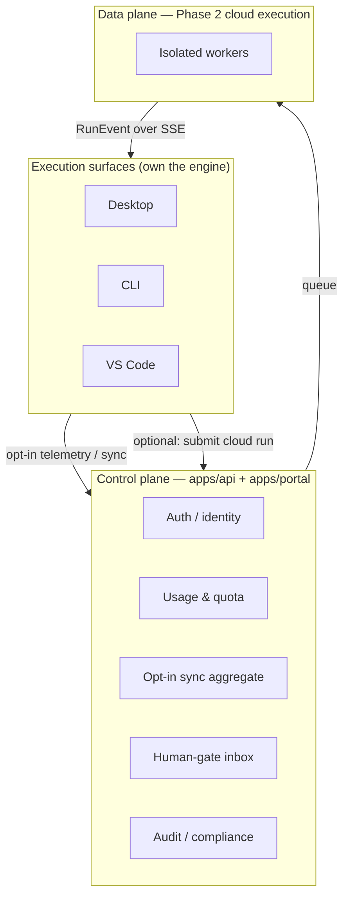

# Portal API Reference (Phase 2)

> Status: draft — Phase 2

- **Status**: Draft (Phase 2 — cloud/control-plane; **not** part of the shipped Phase-1 local-first product)
- **Surface**: Web portal + cloud control plane (`apps/portal` + `apps/api`)
- **Scope**: The intended control-plane API for identity, usage/quota, licensing, sync, human-gate fulfillment, and cloud-run submission. Nothing here exists or is required in Phase 1.
- **Related**: [../../architecture/cloud-phase-2.md](../../architecture/cloud-phase-2.md), [../contracts/sse-event-schema.md](../contracts/sse-event-schema.md), [../contracts/workflow-yaml-spec.md](../contracts/workflow-yaml-spec.md), [../cli/commands.md](../cli/commands.md), [../vscode/extension-api.md](../vscode/extension-api.md), [../desktop/keychain-and-secrets.md](../desktop/keychain-and-secrets.md)

> **Phase 2 only.** Relavium Phase 1 is fully local-first with no account and no cloud (see [product-constraints.md](../../product-constraints.md) and [vision.md](../../vision.md)). The portal is a **control plane, not an execution plane** — workflows are never designed or run here; that happens in the [desktop app](../desktop/routes-and-screens.md), [VS Code extension](../vscode/extension-api.md), or [CLI](../cli/commands.md). The portal answers a different set of questions: *who is running what, how much does it cost, who has access, and is it compliant?* This file is a forward-looking scaffold; concrete request/response schemas, error codes, and pagination will be specified as Phase 2 is built. Do not treat any shape below as final.

## What the portal is (and is not)

- **Is:** identity/SSO, usage analytics, quota and budgets, licensing/tiers, opt-in sync of metadata, a unified human-gate inbox, audit logs, and (for cloud-mode runs) run submission + event streaming.
- **Is not:** a workflow designer, a canvas, or the place execution happens. The same `@relavium/core` engine runs in workers in cloud mode — there is no portal-specific engine.

## Authentication

Auth uses **OAuth Device Flow (RFC 8628)** for interactive surfaces, plus long-lived **API tokens** for CI/CD. Device flow lets the desktop app and CLI start auth with a single command, lets the user authenticate in any browser (including corporate SSO), issues short-lived access tokens with refresh tokens (enabling revocation), and gives each device its own token. Access tokens are stored in the OS keychain, never in plaintext files (see [keychain-and-secrets.md](../desktop/keychain-and-secrets.md)).

Sketch of the device-flow exchange (shapes illustrative, not final):

| Step | Call | Result |
|------|------|--------|
| 1 | `POST /auth/device` | `{ device_code, user_code, verification_uri }` |
| 2 | Surface prints `verification_uri` + `user_code` | User opens browser, signs in (password / Google / SAML / OIDC), enters the code |
| 3 | `POST /auth/device/token` (poll, ~5 s) | On success: `{ access_token (≈1 h TTL), refresh_token (≈90 d TTL) }` |

- CLI: `relavium auth login` runs the full flow in ~10 s; `relavium auth login --with-token` reads a token from the environment for CI/CD and skips the device flow.
- The engine sets `EngineConfig.cloudAuthToken` to the access token; refresh happens transparently before API calls.

> Endpoint paths above are indicative. The exact auth surface (token introspection, revocation, refresh) is to be specified in Phase 2.

## Sync model (opt-in, metadata-only)

Nothing syncs by default. Sync is enabled **per data category** by the user (e.g. `relavium config set sync.run_history true`), is encrypted in transit (TLS 1.3) and at rest (AES-256), and is eventually consistent. The portal is a **read-only aggregate** of what surfaces choose to report — it is never the source of truth for local execution.

| Category | What syncs | Trigger |
|----------|-----------|---------|
| Usage telemetry | Token counts per model/agent/run (compact events at run completion) — drives the quota dashboard | Opt-in |
| Run metadata | `runId`, `workflowId`, status, duration, timestamps, tags — **no outputs** | Opt-in |
| Workflow definitions | YAML/JSON | Explicit backup / team-share action only |
| Agent library | Team-level publish/pull | Explicit |
| Audit events | Structured compliance records (who ran what, who fulfilled which gate) | Enterprise, at run completion |

> **Privacy guarantee (load-bearing):** full LLM prompt/response **transcripts are NEVER synced** to the portal in any tier or mode. They stay on the user's machine (local mode) or in an isolated worker's ephemeral storage (cloud mode, deleted after the run). The portal sees only structured metadata and aggregate token counts. This is what makes the platform viable for security-conscious teams.

## Intended API surface

The portal/control-plane API is expected to cover the areas below. These are **planned** groupings, not finalized endpoints — paths, verbs, and bodies will be locked during Phase 2.

| Area | Purpose | Indicative operations |
|------|---------|-----------------------|
| **Auth** | Device flow, token lifecycle, API tokens, SSO | `POST /auth/device`, `POST /auth/device/token`, token refresh/revoke, API-token CRUD |
| **Usage** | Token/cost analytics aggregated from telemetry | Query usage by model / workflow / agent over a date range |
| **Quota** | Budgets, alert thresholds, enforcement policy (Pro+) | Get/set monthly budget per model; alert config (80 %/100 %); enforcement action (warn / pause / hard-stop) |
| **Runs** | Read-only run-history aggregate across surfaces | List/filter runs (workflow, surface, status, tag, date); run-metadata detail; CSV export |
| **Gates** | Unified human-gate inbox | List pending gates; **decide** a gate (`POST /runs/{runId}/gates/{gateId}/decide`) from any surface; gate history |
| **Cloud execution** | Submit and stream cloud-mode runs (see below) | `POST /runs`, `GET /runs/{runId}`, `GET /runs/{runId}/events` (SSE) |
| **Sync** | Push opt-in metadata; team backup/share | Per-category sync of metadata, workflow defs, agent library |
| **Team / RBAC** | Workspaces, membership, roles (Enterprise) | Members + roles (viewer / runner / editor / admin); invites; shared library |
| **Audit** | SOC 2-style immutable event log (Enterprise) | Query/filter events; CSV/JSON export for SIEM |

## Cloud execution endpoints (Phase 2 data plane)

When a surface runs in `executionMode: 'cloud'`, the engine becomes a thin client over the control plane. The same [`RunEvent`](../contracts/sse-event-schema.md) types are returned — surfaces are unaware of the execution location.

| Operation | Purpose |
|-----------|---------|
| `POST /runs` | Submit `workflow + inputs + identity`; queues a job, returns a `runId`. |
| `GET /runs/{runId}` | Current state, outputs, and an events replay. |
| `GET /runs/{runId}/events` | Real-time `text/event-stream` (SSE) of `RunEvent`s for an active run; reconnect via `Last-Event-ID` and replay missed events. |
| `POST /runs/{runId}/gates/{gateId}/decide` | Fulfill a human gate from any surface; idempotent — first valid decision wins. |

Behind these endpoints, the data plane runs each workflow as an isolated worker that executes the **same** `@relavium/core` engine, with egress restricted to allowed LLM providers and declared MCP servers, and ephemeral storage wiped on completion. The full topology (control plane vs data plane, key handling, gate fan-out, reconnection) is specified in [../../architecture/cloud-phase-2.md](../../architecture/cloud-phase-2.md).

## Portal pages

The portal SPA (`apps/portal`, Vite + React + TanStack Router — not Next.js) presents the control plane. Pages and their primary purpose:

| Page | Purpose |
|------|---------|
| `/dashboard` | Health/activity snapshot across surfaces: usage-vs-quota, active runs (incl. gates awaiting action), 7-day success rate, top workflows by spend, recent activity. |
| `/usage` | Deep-dive token/cost analytics by model, workflow, and agent; input/output token ratios; estimated USD cost. |
| `/quota` | Budget configuration and alert thresholds (Pro+); usage-only view for Free. |
| `/runs` | Searchable run-history browser (metadata only) with filters and CSV export. |
| `/gates` | Human-gate inbox — all pending approvals across surfaces, with approve/reject/provide-input and gate history. |
| `/team` | Team workspace management (Enterprise): members, roles, shared agent library and templates. |
| `/audit` | SOC 2 / compliance audit log (Enterprise): immutable event table, filtering, SIEM export. |
| `/settings/auth` | Active device sessions, API tokens, SSO setup (Enterprise), MFA. |

## Licensing tiers

> Tier features are a Phase-2 business-model sketch; the canonical pricing/positioning lives in the product strategy docs, not here. Two early tier sketches existed (a 3-tier and a 4-tier model) and **must be reconciled** before launch.

| Tier | Indicative price | Gist |
|------|------------------|------|
| **Free** | $0/mo | Unlimited **local** execution (user pays their own LLM bills), limited cloud backup, 30-day usage dashboard, single workspace, community agent library, all surfaces. |
| **Pro** | ~$19/seat/mo | Everything in Free + unlimited cloud backup, full usage history + quota management, email/Slack gate notifications, Phase-2 cloud run-hours, API tokens. |
| **Enterprise** | Custom (annual) | Everything in Pro + SAML/OIDC SSO, team workspaces + RBAC, SOC 2 audit logs + retention, enforced quota, dedicated cloud execution / VPC peering / data residency, self-hosted portal option. |

The pricing model gates on **collaboration and scale, not capability** — local execution stays free forever.

## Relationship to the local product

The control plane is intentionally additive. A user can run the entire product locally forever without ever touching the portal; signing in only unlocks aggregation, sharing, quota, and (optionally) cloud execution. The migration is gradual and per-surface/per-workflow — see the phase-transition narrative in [../../architecture/cloud-phase-2.md](../../architecture/cloud-phase-2.md). The engine never silently falls back from cloud to local (that could leak credentials or bypass enterprise controls); an unreachable cloud surfaces an explicit error.
