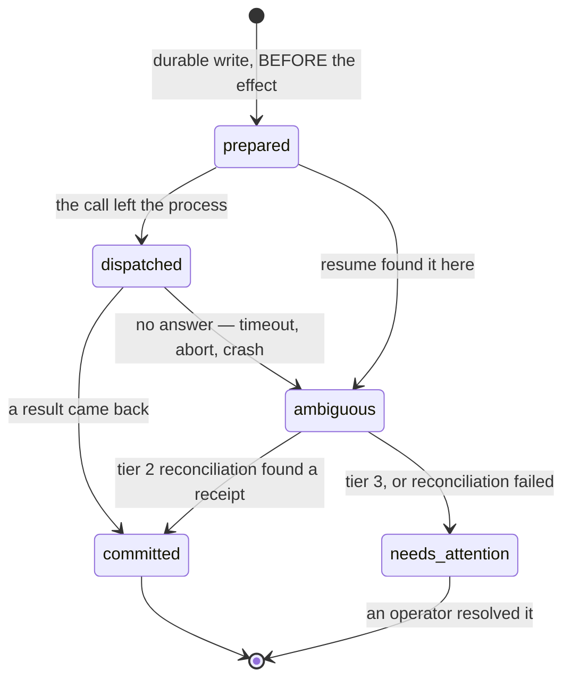

# The effect journal and the tiered effect contract

- **Status**: Canonical
- **Owner ADR**: [ADR-0080](../../decisions/0080-durable-effect-journal-and-the-tiered-effect-contract.md)
- **Surface**: Shared — the engine (`packages/core`), the run store (`packages/db`), and both dispatch producers.

This is the one canonical home for **what the engine promises about external side effects**, the identities it
uses to say it, the journal's state machine, and what a resumed run or session does with what it finds. The
table's DDL is **not** here — `run_effects` lives in [database-schema.md](database-schema.md) with every other
table, and this document links to it rather than restating it.

## 1. The contract, in one paragraph

An effectful tool dispatch is bracketed by a durable **prepare** before the effect and a durable **settle**
after it. The guarantee the engine makes depends on what the *target* supports, so it is tiered, and only
tier 1 may use the words "exactly once".

| tier | precondition | guarantee | claimed by, today |
|------|--------------|-----------|-------------------|
| 1 | the target honours a caller-supplied idempotency key | safe retry under the same key — effectively exactly-once | **nothing** |
| 2 | the target's outcome is queryable after the fact | exactly-once after reconciliation from a receipt | **nothing** |
| 3 | opaque, non-idempotent, no receipt | **at-most-once dispatch _attempt_**, never auto-retried | every effectful tool that ships |

Tiers 1 and 2 are **reserved and specified, not occupied**. No shipping capability offers a receipt lookup and
no tool injects an idempotency key. A document that says otherwise is wrong, not aspirational.

## 2. The five identities, and why none of them is "the key"

Collapsing any two of these is how this design goes wrong — the phase document's original single key did it and
became unimplementable. They are separate concepts with separate lifetimes.

### `EffectCorrelation`

Which run/node or session/turn an effect belongs to. A discriminated union, mirroring the invariant the run-event
envelope already enforces at runtime (exactly one of `runId`/`sessionId`):

```ts
type EffectCorrelation =
  | { readonly kind: 'run'; readonly runId: string; readonly nodeId: string; readonly attempt: number }
  | { readonly kind: 'session'; readonly sessionId: string; readonly turn: number };
```

The `attempt` is the **node-retry** attempt ([ADR-0040](../../decisions/0040-node-retry-budget-above-the-chain.md)),
carried for audit only. It is deliberately **not** part of the gate lookup — see §4.

### `EffectSlot`

Which effect *within* one correlation. A zero-based ordinal over the tool calls in a single model response, in
the order the provider returned them. It disambiguates two effects in one turn, which correlation alone cannot.

It is stable only **within one model response**. A replay that regenerates the response may produce a different
number of calls in a different order, so a slot from before a crash is not comparable to one after it. That is
why the gate is at node granularity (§4) and not at slot granularity.

### `EffectIdentity`

`EffectCorrelation` **with `attempt` dropped**, plus `EffectSlot`, plus `toolId`. This is the table's UNIQUE
constraint. Its job is **concurrency**, not replay: two processes preparing the same effect collide on it, so one
loses and learns another attempt exists. It is *not* claimed to be reproducible after a model replay.

### `EffectAttemptId`

The audit identity of one occurrence: the node-retry attempt, the provider failover attempt, the provider's
`toolCallId`, and the owning `(ownerId, generation)` fence from
[ADR-0079](../../decisions/0079-cross-process-run-ownership-lease-and-fencing-token.md). Never used for dedup —
it is deliberately unstable, because its question is "which occurrence was this?".

### The target idempotency key

Tier 1 only. **Supplied to the target**, generated once at prepare and stored on the row so a retry reuses it
verbatim. Never derived from model output, because model output is what a replay changes.

## 3. What is journaled

A dispatch is journaled when it can change state outside this process **and** duplication of it is not benign.

```
journaled  ⇔  toolPerformsExternalMutation(def, validatedArgs, resolvedTarget)  ∧  ¬def.duplicationBenign
```

Three rules make this precise:

1. **It is a predicate over the resolved call, not a policy class.** `governedAction` is a *security*
   classification and is deliberately wider — a read-only egress and a clipboard read are governed but mutate
   nothing. Journaling those would put two durable writes on every web search and halt a run on a crashed GET.
2. **Two tools decide per dispatch, not per definition.** `http_request` is journaled for a non-GET method and
   not for a GET; `write_file` is journaled when `append: true` (appends compose) and not for a whole-file
   overwrite (naturally idempotent — the file *is* the receipt).
3. **`duplicationBenign` is a trust-bearing declaration and may only be set by first-party code.** It is a
   property of a built-in `ToolDef` in this repository. It may **never** be set from MCP tool metadata, a
   discovered tool descriptor, or any other bytes originating outside the engine — the same rule that keeps MCP
   annotations from raising a tier (§5). Today its only member is `notify`.

Local-filesystem writes are journaled: "external" means outside this process, not outside this machine.

## 4. The resume gate

On resume, for a correlation with **no terminal node record**, the engine reads every prior non-benign effect
record for that correlation and resolves each by tier before the node may run again.

**The lookup key is the correlation with `attempt` dropped.** The node-retry attempt resets to 1 both on a
crash-resume and on a budget approval, so an attempt-scoped lookup would miss the very row it exists to find.

| record state | tier | behaviour |
|---|---|---|
| `committed`, result retained | any | re-deliver the stored result; do **not** re-execute |
| `committed`, result not retained | 1 | retry under the stored target idempotency key |
| `committed`, result not retained | 2 | reconcile from a receipt lookup, then decide |
| `committed`, result not retained | 3 | `needs_attention` |
| `prepared` / `dispatched` / `ambiguous` | 1 or 2 | reconcile, then decide |
| `prepared` / `dispatched` / `ambiguous` | 3 | `needs_attention` |

**A `committed` row is not a green light.** If the journal did not retain enough to re-deliver the result, it
blocks the node exactly as an unresolved row does. This is the window an earlier draft of ADR-0080 left open:
settle succeeds, the process dies before `node:completed` persists, and a gate that only examined *unresolved*
rows would wave the re-run through.

## 5. Why MCP is permanently tier 3

Discovered MCP tools carry no usable annotations, and any that existed would be attacker-controlled bytes from
the very server the hostile-MCP class defends against. **An annotation may never raise trust.** Tier 3 is not a
temporary state pending better metadata; it is the correct terminal answer for a tool whose semantics are
declared by an untrusted party. The same rule governs `duplicationBenign` (§3.3).

## 6. The state machine



`prepared` and the settle (`committed` | `ambiguous`) are the **two durable writes**. `dispatched` is a derived
reading of `prepared` when no settle followed — it is not a third write, because a write between the prepare and
the call would be a second crash window rather than fewer.

## 7. Ordering, and what happens when each step fails

The order is fixed, and every failure after the prepare is kept off the node-retry path — a retryable failure
after an effect has left the process is the duplicate this document exists to prevent.

| # | step | failure ⇒ |
|---|------|-----------|
| 1 | validate args, enforce policy, resolve approval | ordinary refusal; nothing journaled |
| 2 | **durable prepare** (fenced, its own `BEGIN IMMEDIATE`) | refuse the dispatch; the effect never happens |
| 3 | dispatch to the target | settle `ambiguous`; **never node-retryable** |
| 4 | **durable settle** immediately | the row stays `prepared`; the run stops with `needs_attention` — never retried |
| 5 | output mapping, result bounding, event emission | the effect stands; settle already landed; the node fails **non-retryably** |

Step 5 matters as much as step 3: a post-dispatch abort, an output-mapping error, a bounding/spill failure or an
`ActionGuard` receipt error all occur *after* the effect. Classifying any of them as retryable reopens the hole.

## 8. `needs_attention`

An unresolved tier-3 effect is surfaced, never retried. The two surfaces differ deliberately.

**A run** terminates as `run:failed` carrying a dedicated `ErrorCode` of `effect_needs_attention`, and reports
`durability: 'uncertain'` on its handle. Three shapes were weighed and two rejected:

- a **new terminal event** — rejected for the reason ADR-0079 §5 rejected `run:fenced`: it widens ADR-0036's
  exactly-one-terminal set and forces every surface, schema and checkpoint fold to handle a new variant;
- a **new `RunStatus`** — rejected because `runs.status` is a derived projection the event fold writes, so the
  status would have to be invented in `applyDerived` rather than carried by the event that causes it;
- a **typed `ErrorCode` on the existing terminal** — chosen. It reuses the closed error taxonomy every surface
  already switches on, and `run:failed` is honest: the run did not complete.

The CLI maps that code to a distinct exit code recorded in [commands.md](../cli/commands.md), for the reason
ADR-0079 took one — a caller must be able to tell "a human must look at this" from an ordinary failure, and
from the transient "another process owns this" of exit 6. The run is **not** resumable past the unresolved
effect; resuming it re-enters the gate in §4 and stops again.

**A session discloses once and does not block.** A chat has no operator queue and no run to pause, so
`chat-resume` reads its unresolved rows, renders them, and continues. Tier 3's actual guarantee — never
auto-retried, because nothing re-dispatches them — is unchanged; what changes is that the fact reaches the one
person who can act on it instead of halting a conversation.

An operator resolves a row as **accepted** (the effect landed; treat it as committed) or **discarded** (it did
not; the node may run again). The resolution is written to the row with the actor and a timestamp. The CLI
command that performs it is a named follow-up, not part of this contract's first landing — the journal must
exist before anything can resolve rows.

## 9. Retention

- **Unresolved rows** (`prepared`, `dispatched`, `ambiguous`, `needs_attention`) are **never** swept by age.
  They are the record an operator needs, and they outlive their run deliberately — the row carries no foreign
  key to `runs`, because a purge is exactly when the record matters most.
- **`committed` rows** are swept only once their correlation can no longer be resumed. Sweeping a committed row
  while its run is still resumable would delete the evidence the gate in §4 reads, reintroducing the duplicate.
- **Growth is bounded by resolution, not by time.** Unresolved rows accumulate until an operator clears them;
  that is a deliberate trade against silently discarding an ambiguous external effect, and the quota/archive
  mechanism for a neglected queue is a named follow-up.

## 10. Durability scope

**Process-crash durability, not power-loss.** `history.db` runs `synchronous = NORMAL`
([database-schema.md](database-schema.md)), which survives a process death but not an OS crash or a power cut.
CR-12's failure statement is process death; claiming more by silence is the class of overclaim this contract
exists to remove.

## 11. Secrets: what a row may hold

A journal row **never stores argument bytes**. It stores a digest of a **redacted projection** of the effective
args — every key named in `secretArgKeys` is excluded before hashing, not hashed and hidden.

The reason is that a digest is a permanent equality oracle. A low-entropy secret (a short token, a URL with an
embedded key) is recoverable from its digest by dictionary attack, and on the CLI path `history.db` may be
unencrypted at rest. "A digest, not the bytes" is therefore not by itself a sufficient argument, and this
contract does not make it. The hash is SHA-256 over a canonical JSON serialization (sorted keys, no insignificant
whitespace) of the redacted projection, using a vetted implementation — never a hand-rolled one.

## 12. The crash matrix this contract must be tested against

Each is an acceptance point, not a suggestion:

1. kill before the prepare commits · 2. after the prepare, before the target call · 3. after the target
completes, before the settle · 4. after the settle, before the tool-result event · 5. after the tool result,
before `node:completed` · 6. two effects in one node · 7. two processes preparing the same identity ·
8. a settle write that fails · 9. tier 1 retry, tier 2 reconcile, tier 3 attention · 10. session
disclosure-once and a concurrent `chat-resume` · 11. the committed-retention sweep boundary.

## 13. Known limitations

- **The session path has no ownership guarantee.** ADR-0079 is runs-only, so two `chat-resume` processes on one
  session can both dispatch. The UNIQUE prepare detects the collision but cannot distinguish a live prepare from
  a dead one; the loser refuses rather than taking over. Trigger to revisit: the first supported concurrent-resume
  flow.
- **A credential rotation changes the redacted projection**, so an effect whose args reference a rotated
  credential gets a fresh identity and degrades to tier-3 behaviour for that occurrence.
- **`EffectSlot` is not stable across a model replay**, which is why the gate is at node granularity. A design
  that later needs slot-granular resume needs a durable record of the model response, which is CR-95's long-term
  continuation checkpoint, not this.
