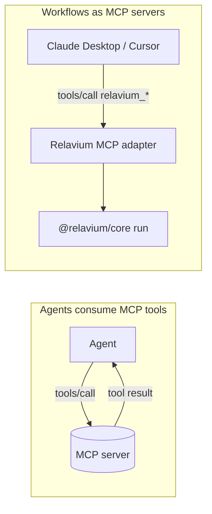

# MCP Integration

- **Status**: Stable
- **Canonical home**: how Relavium integrates the Model Context Protocol (MCP) — in both directions
- **Related**: [built-in-tools.md](built-in-tools.md), [../contracts/agent-yaml-spec.md](../contracts/agent-yaml-spec.md), [../contracts/workflow-yaml-spec.md](../contracts/workflow-yaml-spec.md), [../contracts/config-spec.md](../contracts/config-spec.md), [../../architecture/shared-core-engine.md](../../architecture/shared-core-engine.md)

Relavium integrates [MCP](https://modelcontextprotocol.io) **bidirectionally**:

1. **Agents consuming MCP tools** (inbound) — an agent declares MCP servers and the engine exposes their tools to the LLM.
2. **Agents as MCP servers** (outbound) — a Relavium workflow is itself published as an MCP tool that external clients (Claude Desktop, Cursor, other MCP hosts) can invoke.



## Agents consuming MCP tools (inbound)

An agent declares the MCP servers it uses in its `mcp_servers` list (see [../contracts/agent-yaml-spec.md](../contracts/agent-yaml-spec.md)). Connection is **host-side assembly** ([ADR-0052](../../decisions/0052-inbound-mcp-client-package-lifecycle-registration.md) §1): the **host** (the CLI/VS Code Node process, or the desktop Rust backend) owns the MCP client and the SDK + child processes — the engine (`packages/core`) stays platform-pure and never imports the SDK or `node:child_process`. At session/run startup the host:

1. **Spawns** (stdio transport) or **connects to** (Streamable HTTP / WebSocket) each declared MCP server, **fail-loud** — a failed spawn or `tools/list` fails the whole start, never a silent capability loss.
2. Calls `tools/list` on each server and shapes the discovered tools into namespaced Relavium `ToolDef`s — `mcp_{server_id}_{tool_name}` — assembling them plus an `McpCapability` it hands to the engine's tool registry.
3. The engine routes any tool call the agent makes through that `McpCapability` (`host.mcp.call`) to the correct server — it never touches the SDK.
4. Results stream back as `agent:tool_result` events (see [../contracts/sse-event-schema.md](../contracts/sse-event-schema.md)).
5. The host keeps the MCP server connections alive for the session/run duration, then tears them down.

The `mcp_call` built-in tool is the lower-level path for invoking a registered server's tool by name directly from a `tool` node (see [built-in-tools.md](built-in-tools.md)).

### `McpServerRef` shape

In an **agent** declaration (`agent.mcp_servers`), each entry is an `McpServerRef` — one of two mutually-exclusive forms ([ADR-0052](../../decisions/0052-inbound-mcp-client-package-lifecycle-registration.md) §5):

```yaml
mcp_servers:
  # 1. INLINE — self-contained
  - id: github
    transport: stdio              # stdio | http | websocket   (sse = deprecated alias of http)
    command: npx                  # stdio: the server binary
    args: ['-y', '@modelcontextprotocol/server-github']
    env:                          # env vars injected into the server process
      GITHUB_TOKEN: '{{secrets.github_token}}'   # resolved from the isolated mcp-secret:* keychain (§6)
  - id: docs
    transport: http               # http (Streamable HTTP) / websocket use `url` instead of `command`
    url: 'https://docs.example/mcp'   # remote ⇒ must be https/wss
  - id: local-dev
    transport: http
    url: 'http://localhost:4000/mcp'
    allow_local_endpoint: true    # opt into a private/loopback url (relaxes the SSRF block + plaintext for it)
  # 2. BY-NAME `ref` — identity + connection come from a [[mcp_servers]] registration
  - ref: shared-fs                # mutually exclusive with id/transport/command/url/env
    tools_allowlist: [read_file]  # the only field allowed alongside `ref`
```

The **transport vocabulary** is reconciled to the current MCP spec: `http` is the **Streamable HTTP** transport (the SDK's `StreamableHTTPClientTransport`); `sse` is a **deprecated alias** of `http` (the legacy HTTP+SSE transport, accepted for older servers); `websocket` uses a `wss://` url. A network `url` is SSRF-guarded (below).

Server **registrations** also live globally in `~/.relavium/config.toml` under repeatable `[[mcp_servers]]` entries, so a server can be registered once and referenced **by name** (`ref:`) from many agents. A referenced server connects **on demand** when an agent that uses it starts; the registration's `autostart` field is accepted by the schema but reserved for a future always-on pool (not acted on in 2.R). The merge of global and project-scoped servers follows the normal config resolution order — see [../contracts/config-spec.md](../contracts/config-spec.md).

### Tool discovery

| Mode | When | Behavior |
| --- | --- | --- |
| **Dynamic** | no `tools_allowlist` | the host calls `tools/list` at connect and admits every discovered tool. |
| **Allowlisted** | a `tools_allowlist` is declared on the server entry | the host still calls `tools/list`, then **narrows** the admitted set to the named tools (the rest are skipped + surfaced) — deterministic in *which* tools an agent may call. |
| **Conflict resolution** | two servers expose the same tool name | the host namespaces every tool as `mcp_{server}_{tool}` (`mcp_github_create_issue` vs `mcp_jira_create_issue`), which disambiguates the collision; a residual collision *after* namespacing **fails closed** (the colliding tool is skipped, never silently shadowing another). |
| **Schema validation** | every call | the host compiles the server-reported JSON Schema into a validator at discovery — an `inputSchema` outside the supported subset **drops the tool** (fail-closed, never admitted unvalidated) — and each call's args are validated against it before dispatch. |

> **Not yet shipped (2.R):** tool-list **caching** (re-spawn avoidance via a `(command, args)` hash) is a tracked follow-up — 2.R re-runs `tools/list` on each connect. There is no curated catalog of "built-in" servers either; any server is declared explicitly (a `command: npx …` entry is fetched on first spawn by `npx` itself, not by Relavium). Common choices: `@modelcontextprotocol/server-filesystem`, `…-github`, `…-postgres`, `…-brave-search`, `…-puppeteer`.

On the desktop, stdio MCP servers are managed as child processes by the Rust backend, which owns their lifecycle (start on demand, keep alive for the session, restart on crash). In the CLI and VS Code surfaces the same servers are spawned by the Node.js host. The pooling/lifecycle design narrative is in [../../architecture/shared-core-engine.md](../../architecture/shared-core-engine.md).

## Agents as MCP servers (outbound)

Any loaded workflow can be **exposed as an MCP server** so external MCP clients can invoke your agents as tools. The engine ships an MCP adapter:

```ts
import { createMcpAdapter } from '@relavium/core/mcp';

const adapter = createMcpAdapter(engine, {
  workflows: ['security-review', 'refactor-agent'],
  transport: 'stdio',   // or 'http' / 'websocket' (outbound is a later workstream)
});
adapter.listen();        // registers each workflow as an MCP tool
```

- Each workflow appears as an MCP tool named `relavium_{workflow_id}`.
- The tool's `inputSchema` is derived from the workflow's `inputs[]` declarations (see [../contracts/workflow-yaml-spec.md](../contracts/workflow-yaml-spec.md)).
- The MCP tool call blocks until the run emits `run:completed`, then returns the workflow `outputs`.
- A **human gate** inside the workflow emits a special MCP notification asking the client to prompt the user — this bridges MCP's request/response model with Relavium's suspend/resume gates (see [../contracts/sse-event-schema.md](../contracts/sse-event-schema.md)).

This is also how the `mcp_call` workflow **trigger** works: a workflow with `trigger.type: mcp_call` is one made invocable by external MCP clients through the adapter. See the trigger table in [../contracts/workflow-yaml-spec.md](../contracts/workflow-yaml-spec.md#triggers).

## Security

- **MCP server URLs are SSRF-guarded ([ADR-0029](../../decisions/0029-tool-policy-hardening.md)).** A declared MCP `url` is validated against the **same** vetted range-block as a provider base URL and the `http_request` tool — private/loopback/link-local/metadata ranges (`127.0.0.0/8`, `::1`, `10/8`, `172.16/12`, `192.168/16`, `169.254/16`) are rejected, and remote hosts must use `https`/`wss`, **unless the user explicitly opts into a local endpoint** (the per-server `allow_local_endpoint` flag). A `http://localhost`/loopback `url` is exactly such a local endpoint and requires that explicit opt-in; the opt-in permits exactly the **authored `host:port`** (and plaintext for it). 2.R ships this as a **pre-connect floor** validating the authored host — a hostname that DNS-resolves to a private IP, or a redirect to one, is the residual window the connect-by-validated-IP dialer (per-hop re-validation against the authored `host:port`) closes; tracked in [../../roadmap/deferred-tasks.md](../../roadmap/deferred-tasks.md) ([ADR-0053](../../decisions/0053-mcp-network-transport-egress-security.md) §2). The one SSRF primitive is reused, never re-implemented — see [security-review.md](../../standards/security-review.md).
- MCP server credentials are injected from the secret store via the server's `env` (e.g. `{{secrets.github_token}}`) and are **never** written into the workflow file or any event payload. See [../desktop/keychain-and-secrets.md](../desktop/keychain-and-secrets.md).
- Outbound (workflow-as-MCP) exposure is opt-in per workflow (only those listed in the adapter config are published).
- All inbound MCP tool calls are schema-validated before dispatch, and tool inputs in events are sanitized — see [built-in-tools.md](built-in-tools.md) and [../contracts/sse-event-schema.md](../contracts/sse-event-schema.md).
