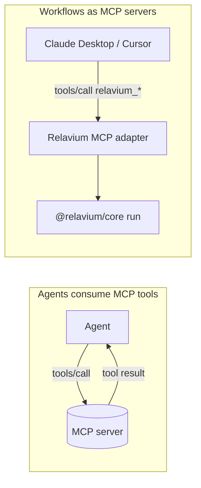

# MCP Integration

- **Status**: Stable
- **Canonical home**: how Relavium integrates the Model Context Protocol (MCP) — in both directions
- **Related**: [built-in-tools.md](built-in-tools.md), [../contracts/agent-yaml-spec.md](../contracts/agent-yaml-spec.md), [../contracts/workflow-yaml-spec.md](../contracts/workflow-yaml-spec.md), [../contracts/config-spec.md](../contracts/config-spec.md), [../../architecture/shared-core-engine.md](../../architecture/shared-core-engine.md)

Relavium integrates [MCP](https://modelcontextprotocol.io) **bidirectionally**:

1. **Agents consuming MCP tools** (inbound) — an agent declares MCP servers and the engine exposes their tools to the LLM.
2. **Agents as MCP servers** (outbound) — a Relavium workflow is itself published as an MCP tool that external clients (Claude Desktop, Cursor, other MCP hosts) can invoke.



## Agents consuming MCP tools (inbound)

An agent declares the MCP servers it uses in its `mcp_servers` list (see [../contracts/agent-yaml-spec.md](../contracts/agent-yaml-spec.md)). At agent startup the engine:

1. **Spawns** (stdio transport) or **connects to** (SSE / WebSocket) each declared MCP server.
2. Calls `tools/list` on each server and registers the discovered tools into the agent's tool namespace as `mcp_{server_id}_{tool_name}`.
3. Routes any tool call the agent makes to the correct MCP server using that registered mapping.
4. Streams results back as `agent:tool_result` events (see [../contracts/sse-event-schema.md](../contracts/sse-event-schema.md)).
5. Keeps the MCP server processes alive for the run duration, then tears them down.

The `mcp_call` built-in tool is the lower-level path for invoking a registered server's tool by name directly from a `tool` node (see [built-in-tools.md](built-in-tools.md)).

### `McpServerRef` shape

In an agent (or workflow) declaration, each entry is an `McpServerRef`:

```yaml
mcp_servers:
  - id: github
    transport: stdio              # stdio | sse | websocket
    command: npx                  # stdio: the server binary
    args: ['-y', '@modelcontextprotocol/server-github']
    env:                          # env vars injected into the server process
      GITHUB_TOKEN: '{{secrets.github_token}}'
  - id: docs
    transport: sse                # sse / websocket use url instead of command
    url: 'http://localhost:4000/mcp'
```

Server **registrations** also live globally in `~/.relavium/config.toml` under repeatable `[[mcp_servers]]` entries (with `autostart`), so a server can be registered once and referenced by id from many agents. The merge of global and project-scoped servers follows the normal config resolution order — see [../contracts/config-spec.md](../contracts/config-spec.md).

### Tool discovery

| Mode | When | Behavior |
| --- | --- | --- |
| **Static** | a `tools_allowlist` is declared on the server entry | tools are pre-resolved at workflow load time — fast, deterministic. |
| **Dynamic** | no allowlist | the engine calls `tools/list` at agent init and registers every available tool. |
| **Caching** | always | tool lists are cached per `(server_command, args)` hash for ~1 hour to avoid re-spawning. |
| **Conflict resolution** | two servers expose the same tool name | the engine prefixes with the server id (`mcp_github_create_issue` vs `mcp_jira_create_issue`) — the same `mcp_{server}_{tool}` namespacing used everywhere, which is what disambiguates the collision. |
| **Schema validation** | every call | the engine validates each MCP tool call against the server-reported JSON Schema before sending — malformed calls are rejected early. |

### Built-in MCP servers

These are available out of the box and auto-installed on first use (via `npx`):

| Server | Capability |
| --- | --- |
| `@modelcontextprotocol/server-filesystem` | read/write local files |
| `@modelcontextprotocol/server-brave-search` | web search |
| `@modelcontextprotocol/server-puppeteer` | browser automation |
| `@modelcontextprotocol/server-github` | GitHub API |
| `@modelcontextprotocol/server-postgres` | database access |

On the desktop, stdio MCP servers are managed as child processes by the Rust backend, which owns their lifecycle (start on demand, keep alive for the session, restart on crash). In the CLI and VS Code surfaces the same servers are spawned by the Node.js host. The pooling/lifecycle design narrative is in [../../architecture/shared-core-engine.md](../../architecture/shared-core-engine.md).

## Agents as MCP servers (outbound)

Any loaded workflow can be **exposed as an MCP server** so external MCP clients can invoke your agents as tools. The engine ships an MCP adapter:

```ts
import { createMcpAdapter } from '@relavium/core/mcp';

const adapter = createMcpAdapter(engine, {
  workflows: ['security-review', 'refactor-agent'],
  transport: 'stdio',   // or 'sse'
});
adapter.listen();        // registers each workflow as an MCP tool
```

- Each workflow appears as an MCP tool named `relavium_{workflow_id}`.
- The tool's `inputSchema` is derived from the workflow's `inputs[]` declarations (see [../contracts/workflow-yaml-spec.md](../contracts/workflow-yaml-spec.md)).
- The MCP tool call blocks until the run emits `run:completed`, then returns the workflow `outputs`.
- A **human gate** inside the workflow emits a special MCP notification asking the client to prompt the user — this bridges MCP's request/response model with Relavium's suspend/resume gates (see [../contracts/sse-event-schema.md](../contracts/sse-event-schema.md)).

This is also how the `mcp_call` workflow **trigger** works: a workflow with `trigger.type: mcp_call` is one made invocable by external MCP clients through the adapter. See the trigger table in [../contracts/workflow-yaml-spec.md](../contracts/workflow-yaml-spec.md#triggers).

## Security

- **MCP server URLs are SSRF-guarded ([ADR-0029](../../decisions/0029-tool-policy-hardening.md)).** A declared MCP `url` is validated against the **same** vetted range-block as a provider base URL and the `http_request` tool — private/loopback/link-local/metadata ranges (`127.0.0.0/8`, `::1`, `10/8`, `172.16/12`, `192.168/16`, `169.254/16`) are rejected, and remote hosts must use `https`/`wss`, **unless the user explicitly opts into a local endpoint**. The `http://localhost:4000` examples in this doc are exactly such a local endpoint and require that explicit opt-in. The one SSRF primitive is reused, never re-implemented — see [security-review.md](../../standards/security-review.md).
- MCP server credentials are injected from the secret store via the server's `env` (e.g. `{{secrets.github_token}}`) and are **never** written into the workflow file or any event payload. See [../desktop/keychain-and-secrets.md](../desktop/keychain-and-secrets.md).
- Outbound (workflow-as-MCP) exposure is opt-in per workflow (only those listed in the adapter config are published).
- All inbound MCP tool calls are schema-validated before dispatch, and tool inputs in events are sanitized — see [built-in-tools.md](built-in-tools.md) and [../contracts/sse-event-schema.md](../contracts/sse-event-schema.md).
