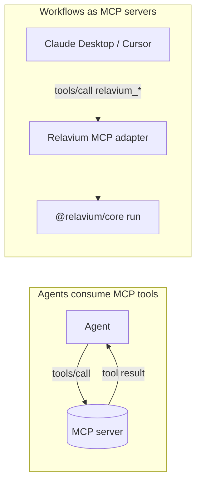

# MCP Integration

- **Status**: Stable
- **Canonical home**: how Relavium integrates the Model Context Protocol (MCP) — in both directions
- **Related**: [built-in-tools.md](built-in-tools.md), [../contracts/agent-yaml-spec.md](../contracts/agent-yaml-spec.md), [../contracts/workflow-yaml-spec.md](../contracts/workflow-yaml-spec.md), [../contracts/config-spec.md](../contracts/config-spec.md), [../../architecture/shared-core-engine.md](../../architecture/shared-core-engine.md)

Relavium integrates [MCP](https://modelcontextprotocol.io) **bidirectionally**:

1. **Agents consuming MCP tools** (inbound) — an agent declares MCP servers and the engine exposes their tools to the LLM.
2. **Agents as MCP servers** (outbound) — a Relavium workflow is itself published as an MCP tool that external clients (Claude Desktop, Cursor, other MCP hosts) can invoke.


```mermaid
flowchart LR
  subgraph Inbound["Agents consume MCP tools"]
    A[Agent] -->|tools/call| MS[(MCP server)]
    MS -->|tool result| A
  end
  subgraph Outbound["Workflows as MCP servers"]
    EXT[Claude Desktop / Cursor] -->|tools/call relavium_*| AD[Relavium MCP adapter]
    AD --> ENG["@relavium/core run"]
  end
```

## Agents consuming MCP tools (inbound)

An agent declares the MCP servers it uses in its `mcp_servers` list (see [../contracts/agent-yaml-spec.md](../contracts/agent-yaml-spec.md)). Connection is **host-side assembly** ([ADR-0052](../../decisions/0052-inbound-mcp-client-package-lifecycle-registration.md) §1): the **host** (the CLI/VS Code Node process, or the desktop Rust backend) owns the MCP client and the SDK + child processes — the engine (`packages/core`) stays platform-pure and never imports the SDK or `node:child_process`. At session/run startup the host:

1. **Spawns** (stdio transport) or **connects to** (Streamable HTTP / WebSocket) each declared MCP server, **fail-loud** — a failed spawn or `tools/list` fails the whole start, never a silent capability loss.
2. Calls `tools/list` on each server and shapes the discovered tools into namespaced Relavium `ToolDef`s — `mcp_{server_id}_{tool_name}` — assembling them plus an `McpCapability` it hands to the engine's tool registry.
3. The engine routes any tool call the agent makes through that `McpCapability` (`host.mcp.call`) to the correct server — it never touches the SDK.
4. Results stream back as `agent:tool_result` events (see [../contracts/sse-event-schema.md](../contracts/sse-event-schema.md)).
5. The host keeps the MCP server connections alive for the session/run duration, then tears them down.

The `mcp_call` built-in tool is the lower-level path for invoking a registered server's tool by name (see [built-in-tools.md](built-in-tools.md)). In Phase-1/2 it is reached as a granted built-in **inside an agent node**; the dedicated `tool`-node form is an engine-internal node type, not yet an authorable workflow node (see [../contracts/workflow-yaml-spec.md](../contracts/workflow-yaml-spec.md#node-types)).

### `McpServerRef` shape

In an **agent** declaration (`agent.mcp_servers`), each entry is an `McpServerRef` — one of two mutually-exclusive forms ([ADR-0052](../../decisions/0052-inbound-mcp-client-package-lifecycle-registration.md) §5):

```yaml
mcp_servers:
  # 1. INLINE — self-contained
  - id: github
    transport: stdio              # stdio | http | websocket   (sse = deprecated alias of http)
    command: npx                  # stdio: the server binary
    args: ['-y', '@modelcontextprotocol/server-github']
    env:                          # stdio only: env vars injected into the spawned server process
      GITHUB_TOKEN: '{{secrets.github_token}}'   # resolved from the isolated mcp-secret:* keychain (§6)
  - id: docs
    transport: http               # http (Streamable HTTP) / websocket use `url` instead of `command`
    url: 'https://docs.example/mcp'   # remote ⇒ must be https/wss
  - id: local-dev
    transport: http
    url: 'http://localhost:4000/mcp'
    allow_local_endpoint: true    # opt into a private/loopback url (relaxes the SSRF block + plaintext for it)
  - id: slow-start
    transport: stdio
    command: npx
    args: ['-y', '@acme/big-server']
    connect_timeout_ms: 300000    # raise the connect deadline (any transport; max 600000, ADR-0088 §1.4)
  # 2. BY-NAME `ref` — identity + connection come from a [[mcp_servers]] registration
  - ref: shared-fs                # mutually exclusive with id/transport/command/args/env/url/
                                  # allow_local_endpoint/connect_timeout_ms
    tools_allowlist: [read_file]  # the only field allowed alongside `ref`
```

The **transport vocabulary** is reconciled to the current MCP spec: `http` is the **Streamable HTTP** transport (the SDK's `StreamableHTTPClientTransport`); `sse` is a **deprecated alias** of `http` (the legacy HTTP+SSE transport, accepted for older servers, same `http(s)` url); `websocket` is **local-only** — see the Security section. A network `url` is SSRF-guarded (below). The vocabulary is the **same on both surfaces** — an inline `agent.mcp_servers` entry and a `[[mcp_servers]]` config registration both accept `stdio | http | websocket` plus the `sse` alias (prefer `http` for new servers). The stdio-only fields (`command`/`args`/`env`) are rejected on a network transport, and the network-only fields (`url`/`allow_local_endpoint`) on stdio — symmetric across both schemas.

Server **registrations** also live globally in `~/.relavium/config.toml` under repeatable `[[mcp_servers]]` entries, so a server can be registered once and referenced **by name** (`ref:`) from many agents. A referenced server connects **on demand** when an agent that uses it starts; the registration's `autostart` field is accepted by the schema but reserved for a future always-on pool (not acted on in 2.R). The merge of global and project-scoped servers follows the normal config resolution order — see [../contracts/config-spec.md](../contracts/config-spec.md).

### Connect and call deadlines

Every MCP interaction is bounded, and the bound is Relavium's rather than the SDK's
([ADR-0088](../../decisions/0088-the-mcp-boundary-is-hostile.md) §1). The connect bound covers the transport's
own start — the spawn or the dial — not only the `initialize` request that follows it, because that is where an
unbounded wait actually lives.

| Phase | Default | Raise it with |
| --- | --- | --- |
| `stdio` connect — spawn through `initialize` | **120 000 ms** | `connect_timeout_ms` |
| network connect — dial through `initialize` | **30 000 ms** | `connect_timeout_ms` |
| `tools/list` discovery — the WHOLE paged walk, not one page | **60 000 ms** | — |
| `tools/call` | **60 000 ms** | — |

`stdio` gets the longest window because the canonical authored example is `command: npx`, and a cold resolution
routinely outruns a tighter one before the child speaks MCP at all. The discovery bound covers the whole walk
so a server that answers each page slowly cannot outlive its deadline by paginating.

**A run or turn cancel reaches the server.** The engine's signal is threaded through `tools/call` and the
discovery walk to the SDK request, so a cancelled call is cancelled at the server rather than merely abandoned
by the caller. A deadline and a cancellation are distinct typed failures: a user who pressed Esc is not told
the server was slow, and precedence is decided when the failure is classified rather than by which timer the
runtime happened to fire first.

**A signalled one-shot command reaps its children.** `relavium run` and `relavium agent run` tear their MCP
connections down on `SIGINT`/`SIGTERM`/`SIGHUP`/`SIGQUIT`, and a synchronous last-resort reap covers the exit
paths that cannot await a teardown. `run` keeps its documented cancel contract — the run still drains to
`run:cancelled` and exits `1`; the teardown does not take the exit code from it.

### Discovery and result ingress bounds

A server's own output is untrusted input, and it is bounded
([ADR-0088](../../decisions/0088-the-mcp-boundary-is-hostile.md) §5). Before these bounds a server returning
100 pages of 500 tools with 1 MiB descriptions was admitted whole — 50 000 tools and 52 GB of description
text, re-sent to the provider on every subsequent turn of the session.

| What | Bound | Level |
| --- | --- | --- |
| Tools admitted per server (across all `tools/list` pages) | **256** | application |
| One tool's `description` | **8 KiB** | application |
| One server's whole discovery payload (names + descriptions + schemas) | **1 MiB** | application |
| One string literal or `enum` member inside a schema | **4 KiB** | application |
| One schema property name | **256 B** | application |
| One `tools/call` result's text, summed across parts | **1 MiB** | application |
| One message on an `http`/`sse` transport | **4 MiB** | transport |

**The two levels are different promises, and the distinction is deliberate.** An *application* bound runs on
an already-parsed value, so it bounds what is **admitted** — what reaches the prompt, the workflow state and
the tool registry — and **not** what was allocated to get there. A *transport* bound runs on raw bytes before
anything parses them, so it bounds **peak memory**; it exists only where the byte path is ours, which is the
host-injected `fetch` of `http`/`sse`. `stdio` and a local `websocket` therefore have the application bounds
only, and their memory story is the consent gate's and the author's own opt-in — see the Security section.

The transport bound is **per message, not per body**: a Streamable HTTP session's server-to-client stream
stays open for the whole session, so a body cap would fire on a healthy one. The counter resets at each SSE
event boundary — a blank line, terminated by `\n`, `\r\n` or a lone `\r`.

Every bound counts **UTF-8 bytes**, and a schema is measured as its canonical JSON serialization — the form
that actually travels. An over-bound **tool** is dropped and reported through the same `SkippedTool` channel
an unsupported `inputSchema` uses, so the server stays usable; an over-bound **result or message fails the
call**, because half a tool result reaching the model is a wrong answer that looks like a right one. Once a
server's aggregate budget is spent the remaining tools are refused too, in declaration order, so the same
catalogue always yields the same tool set.

### Tool discovery

| Mode | When | Behavior |
| --- | --- | --- |
| **Dynamic** | no `tools_allowlist` | the host calls `tools/list` at connect and admits every discovered tool. |
| **Allowlisted** | a `tools_allowlist` is declared on the server entry | the host still calls `tools/list`, then **narrows** the admitted set to the named tools (the rest are skipped + surfaced) — deterministic in *which* tools an agent may call. |
| **Conflict resolution** | two servers expose the same tool name | the host namespaces every tool as `mcp_{server}_{tool}` (`mcp_github_create_issue` vs `mcp_jira_create_issue`), which disambiguates the collision; a residual collision *after* namespacing **fails closed** (the colliding tool is skipped, never silently shadowing another). |
| **Schema validation** | every call | the host compiles the server-reported JSON Schema into a validator at discovery — an `inputSchema` outside the supported subset **drops the tool** (fail-closed, never admitted unvalidated) — and each call's args are validated against it before dispatch. |

> **Not yet shipped (2.R):** tool-list **caching** (re-spawn avoidance via a `(command, args)` hash) is a tracked follow-up — 2.R re-runs `tools/list` on each connect. There is no curated catalog of "built-in" servers either; any server is declared explicitly (a `command: npx …` entry is fetched on first spawn by `npx` itself, not by Relavium). Common choices: `@modelcontextprotocol/server-filesystem`, `…-github`, `…-postgres`, `…-brave-search`, `…-puppeteer`.

On the desktop, stdio MCP servers are managed as child processes by the Rust backend, which owns their lifecycle (start on demand, keep alive for the session, restart on crash) — and therefore owes the [consent contract](#consent-before-a-local-stdio-spawn-cross-surface-contract) below, which the Node hosts implement today and the Rust one must implement against the same file and the same golden vectors. In the CLI and VS Code surfaces the same servers are spawned by the Node.js host. The host-side connection-lifecycle narrative (concurrent fail-loud connect, keep-alive, teardown, and the no-pool/no-cache 2.R reality) is in [../../architecture/shared-core-engine.md](../../architecture/shared-core-engine.md#inbound-mcp-connection-lifecycle).

## Agents as MCP servers (outbound)

Any loaded workflow can be **exposed as an MCP server** so external MCP clients can invoke your agents as tools. The engine ships an MCP adapter:

```ts
import { createMcpAdapter } from '@relavium/core/mcp';

const adapter = createMcpAdapter(engine, {
  workflows: ['security-review', 'refactor-agent'],
  transport: 'stdio',   // or 'http' / 'websocket' (outbound is a later workstream)
});
adapter.listen();        // registers each workflow as an MCP tool
```

- Each workflow appears as an MCP tool named `relavium_{workflow_id}`.
- The tool's `inputSchema` is derived from the workflow's `inputs[]` declarations (see [../contracts/workflow-yaml-spec.md](../contracts/workflow-yaml-spec.md)).
- The MCP tool call blocks until the run emits `run:completed`, then returns the workflow `outputs`.
- A **human gate** inside the workflow emits a special MCP notification asking the client to prompt the user — this bridges MCP's request/response model with Relavium's suspend/resume gates (see [../contracts/sse-event-schema.md](../contracts/sse-event-schema.md)).

This is also how the `mcp_call` workflow **trigger** works: a workflow with `trigger.type: mcp_call` is one made invocable by external MCP clients through the adapter. See the trigger table in [../contracts/workflow-yaml-spec.md](../contracts/workflow-yaml-spec.md#triggers).

## Consent before a local stdio spawn (cross-surface contract)

A `stdio` MCP server is a **local program the artifact chooses**. Before any surface spawns one, the user must
have consented to that exact program on that machine ([ADR-0084](../../decisions/0084-consent-before-a-local-mcp-spawn.md)).
Network transports need no consent — there is no local process — and this is a **host** decision at one
chokepoint, never an engine one: `packages/core` neither knows nor asks.

This section is the contract, not one surface's implementation. The Node hosts (CLI, VS Code) implement it
today; the line above naming the **desktop Rust backend** as the owner of stdio child processes means that
backend must implement the same contract against the same file before it spawns — a second reading of this
page, verified against the golden vectors below, not a second design.

### What identifies "the same server I approved"

The **fingerprint** is `v1:` + lowercase-hex SHA-256 over the UTF-8 bytes of the canonical JSON of exactly
these five fields, and nothing else:

| Field | Value |
|-------|-------|
| `transport` | the literal `"stdio"` |
| `command` | the **resolved absolute path**, not the authored word (see below) |
| `args` | the authored array, in order; an absent one is `[]` |
| `env` | each authored name mapped to a **type-tagged** entry (below); an absent one is `{}` |
| `cwd` | the absolute directory the child will be spawned in |

Canonicalization is `canonicalJson` from [`@relavium/shared`](llm-provider-seam.md): object keys sorted by
**UTF-16 code-unit ordinal** comparison (never `localeCompare`, which is locale-dependent), no insignificant
whitespace, ECMAScript `JSON.stringify` string escaping. A value with no faithful JSON form — a non-finite
number, an `undefined` property, a `Date`, a class instance — is **refused**, as is a **lone surrogate** in any
string or key: it has no UTF-8 encoding at all, so a non-JavaScript implementation could not hold it, let alone
reproduce the bytes.

Each `env` value is tagged rather than digested raw:

- a value that is **solely** a `{{secrets.NAME}}` reference → `{"kind":"secret-ref","name":"NAME"}` — the
  credential never enters the digest, and swapping `{{secrets.a}}` for `{{secrets.b}}` still re-prompts;
- anything else → `{"kind":"literal","value":"<the authored text>"}`.

The tag is load-bearing: a flat `secret:NAME` marker collided with the literal string of the same text, so an
approved literal could later become a real credential reference with no re-prompt.

**The command is resolved before the decision and spawned after it.** An authored `npx` is walked on the
ambient `PATH` (a declared `PATH` is refused outright, below) to an absolute path that must be a regular file
with the execute bit; that path is what the digest names and what is later spawned. Otherwise a grant would
name a *word*, and a `PATH` change between the approval and the spawn would run a different program under an
approved fingerprint. A relative `command` resolves against `cwd` — which is why `cwd` is in the digest:
`node server.js` in two directories is two programs.

The `v1:` prefix is what makes a future change to any of the above fail **closed** — a `v2:` reader recognises
no `v1:` grant, so the machine re-prompts rather than matching under rules it no longer follows.

### Golden vectors

A second implementation is verified against these, not against a second reading of the paragraph above. Each
row is a resolved declaration and the digest it must produce; they are executed by
`apps/cli/src/engine/mcp-consent.test.ts`.

| `command` | `args` | `env` | `cwd` | digest |
|-----------|--------|-------|-------|--------|
| `/bin/x` | `[]` | `{}` | `/w` | `v1:50264fc33efd1056148d3d6642a98fcb74e03b214ed9c380feddb92f7e1714c2` |
| `/bin/é☃` | `["ünïcode"]` | `{}` | `/w/é` | `v1:fcf2ed9b8fd9d97d5c948cbddbc105319c78c2e3b486e5c7e9d89d5d8661e220` |
| `/bin/x` | two args, `a"b` and `c\d` | `{}` | `/w` | `v1:8b7c2b426792b5ca2364dc74e4c8b73c386aada84fb4745513b2a826ab92ed43` |
| `/bin/x` | `[]` | `{"A":"{{secrets.k}}","B":"secret:k"}` | `/w` | `v1:0a178265ba8310190e1cfe4e6e53e4797a4ffdea6768b8faa8ab70331f58431d` |

The fourth row is the collision case: `A` digests as a `secret-ref` and `B` as a `literal`, so the two entries
are distinguishable despite naming the same text.

### The grant store

`~/.relavium/mcp-consent.ndjson`, one JSON object per line, **append-only with tombstones** — never rewritten,
because a rewrite that is interrupted loses grants, and losing a *revocation* is the failure that matters.
The file is created `0600` inside a `0700` directory, and a **symlink at that path is refused** rather than
written through.

| Line | Shape |
|------|-------|
| grant | `{"v":1,"digest":"v1:…","command":"…","args":[…],"envNames":[…],"cwd":"…","grantedAt":"<ISO-8601>"}` |
| revocation | `{"v":1,"revokes":"v1:…","revokedAt":"<ISO-8601>"}` |

`command`, `args`, `envNames` and `cwd` are **comparison metadata for the prompt only** — never inputs to the
digest — and are length-bounded on write. `envNames` carries names, never values: no credential is written.

A reader folds the file in order, a revocation removing an earlier grant. **Any unparseable line fails the
whole fold closed** — the store reads as *no grants* and every server is asked about again — because a
truncated final line may be a revocation, and a reader that skipped it would resurrect revoked trust. The fold
failure is reported, never silent: a user re-approving everything is owed the reason.

### The environment denylist

Both local-process hosts — `run_command` and the MCP stdio spawn — share **one** denylist of declared
environment names that redirect an interpreter, the dynamic loader, or a tool's configuration
(`LD_PRELOAD`, `DYLD_*`, `NODE_OPTIONS`, `PATH`, `ZDOTDIR`, `NPM_CONFIG_*`, `BASH_FUNC_*`, and the rest). It
lives in `@relavium/shared` so neither host can drift from the other, and it is an **authored-error rule**:
the declaration is refused at parse, not silently dropped at spawn. See
[../contracts/agent-yaml-spec.md](../contracts/agent-yaml-spec.md) and
[../contracts/config-spec.md](../contracts/config-spec.md).

### When there is no one to ask

A prompt requires **all four** of: a TTY stdout, a TTY stdin, no `--json`, and no CI environment. Without
them the invocation **refuses** (exit 2) and prints each unapproved server's digest, which is a hash of the
declaration and not a secret — so a CI author can pass `--allow-mcp-stdio <digest>` per server after reviewing
it. See [../cli/commands.md](../cli/commands.md).

## Security

- **MCP server URLs are SSRF-guarded ([ADR-0029](../../decisions/0029-tool-policy-hardening.md)).** A declared MCP `url` is validated against the **same** vetted range-block as a provider base URL and the `http_request` tool — private/loopback/link-local/metadata ranges (`127.0.0.0/8`, `::1`, `10/8`, `172.16/12`, `192.168/16`, `169.254/16`) are rejected, and remote hosts must use `https`/`wss`, **unless the user explicitly opts into a local endpoint** (the per-server `allow_local_endpoint` flag). A `http://localhost`/loopback `url` is exactly such a local endpoint and requires that explicit opt-in. The one SSRF primitive is reused, never re-implemented — see [security-review.md](../../standards/security-review.md).
- **`http` and `sse` connect by validated, pinned IP** ([ADR-0088](../../decisions/0088-the-mcp-boundary-is-hostile.md) §2.1). Every request on those transports — the `initialize` POST, each `tools/call`, and the long-lived server-to-client stream — goes through the host's validated hop: resolve DNS → range-block **every** resolved address → connect **pinned** to the validated IP, with the hostname kept as SNI so TLS verification stays on. This closes the DNS-rebind window the pre-connect check alone could not see: a name that resolves public at validation time and private at connect time is refused at the dial.
- **A redirect is refused, not followed** ([ADR-0088](../../decisions/0088-the-mcp-boundary-is-hostile.md) §3). A `3xx` on an MCP endpoint is a typed connect failure naming the redirect; the remedy is to declare the final `url`. An MCP server is identified by the exact url its author wrote, and no range-block expresses "and it is still the server the user chose" — so a redirect to a perfectly public host is refused too.
- **The local-endpoint opt-in is scoped to the authored `host:port`, and it narrows only** ([ADR-0088](../../decisions/0088-the-mcp-boundary-is-hostile.md) §4). The private-range block and the plaintext permission lift **together, and only** for a target that matches that `host:port` exactly *and* actually resolves to a private address. So an opt-in for `localhost:4000` cannot reach `localhost:6379`, `:5432`, `:22` or a container socket (`SEC-EGRESS-3`), and a server declared local that resolves to a **public** address is refused rather than silently downgraded to plaintext.
- **A remote `websocket` server is refused at admission** ([ADR-0088](../../decisions/0088-the-mcp-boundary-is-hostile.md) §2.3). The SDK's WebSocket transport accepts a `URL` and nothing else — no `fetch`, no dialer — and parses each frame before any Relavium code sees a byte, so it can carry neither the pin above nor a byte bound. Declaring one is an authored error (exit `2`) naming `http` (Streamable HTTP) as the transport that carries the same server safely. A `websocket` server **with `allow_local_endpoint`** still connects: an unbounded transport must be local and explicitly admitted, which is the same line `stdio` sits on.
- MCP server credentials are injected from the secret store via a **stdio** server's `env` (e.g. `{{secrets.github_token}}`, resolved from the isolated `mcp-secret:*` namespace) and are **never** written into the workflow file or any event payload. See [../desktop/keychain-and-secrets.md](../desktop/keychain-and-secrets.md). `env` applies to the spawned stdio child only — a network (`http`, its deprecated `sse` alias, or `websocket`) transport has no process to inject into, so `env` is **rejected at parse** there (header-based auth for network MCP servers is a tracked follow-up, [../../roadmap/deferred-tasks.md](../../roadmap/deferred-tasks.md)).
- **A server's tool DEFINITIONS are untrusted content** ([ADR-0088](../../decisions/0088-the-mcp-boundary-is-hostile.md) §7). The engine's `Untrusted<T>` brand covers tool *results*; a `description` and an `inputSchema` are equally attacker-controlled and reach the model in the tool spec itself, which is the channel real "MCP tool poisoning" uses. They are **not** routed through that brand — its guarantee is that a value cannot reach prompt assembly without an explicit unwrap, and a tool definition's whole purpose is to reach the model, so a brand there would imply a property that does not exist. What holds instead: **presentation text is sanitized at discovery** (terminal-control and Trojan-Source bidi bytes are stripped from a `description` before it can reach a render, an approval prompt, a log or the provider), and a **semantic field is never rewritten** — a property name, a `const`/`enum` value or a `required` entry is simultaneously the model-visible schema, the compiled validator's expectation and the wire contract, so one carrying such a byte **drops the tool**, fail-closed. The mitigation is advisory where the model itself is what is being steered; that limit is stated rather than papered over.
- **A local stdio spawn requires the user's consent on that machine** ([ADR-0084](../../decisions/0084-consent-before-a-local-mcp-spawn.md)) — an artifact chooses the program, so the decision cannot belong to the artifact. The fingerprint, the grant store and the shared environment denylist are specified above as a cross-surface contract; a host that spawns without consulting it is the bypass. No credential enters the digest or the grant line.
- Outbound (workflow-as-MCP) exposure is opt-in per workflow (only those listed in the adapter config are published).
- All inbound MCP tool calls are schema-validated before dispatch, and tool inputs in events are sanitized — see [built-in-tools.md](built-in-tools.md) and [../contracts/sse-event-schema.md](../contracts/sse-event-schema.md).
