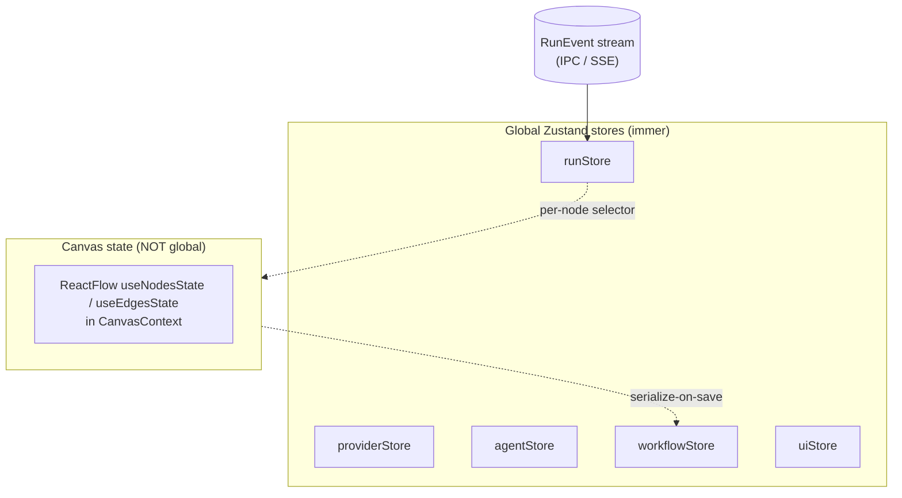

# Zustand Store Shapes

- **Status**: Stable
- **State library**: Zustand v5 with the `immer` middleware
- **Canonical home**: the frontend state contract shared by the desktop WebView and the Phase-2 portal
- **Related**: [node-types.md](node-types.md), [../contracts/sse-event-schema.md](../contracts/sse-event-schema.md), [../desktop/routes-and-screens.md](../desktop/routes-and-screens.md), [../../architecture/state-management.md](../../architecture/state-management.md)

Relavium's UI state is split across **five global Zustand stores** plus a deliberately **non-global canvas state**. The single most important rule here is the **canvas/run separation**: ReactFlow's nodes/edges live in their own context, and live run updates land in a separate `runStore`, so a flood of streaming token events never re-renders the canvas. This is the decision that keeps the live-execution canvas at 60fps. See [../../architecture/state-management.md](../../architecture/state-management.md) for the full rationale.



## The five stores

### `providerStore`

LLM provider state and per-provider key **status** (never the raw key). Holds no raw secret longer than a single API call needs it; on the desktop, keys live in the OS keychain and only their status crosses into the UI. See [../desktop/keychain-and-secrets.md](../desktop/keychain-and-secrets.md).

```ts
interface ProviderStore {
  providers: Record<ProviderId, ProviderConfig>;
  keyStatus: Record<ProviderId, 'valid' | 'invalid' | 'unchecked'>;
}
```

### `agentStore`

Every named agent and its configuration. Mirrors the on-disk `.agent.yaml` files (see [../contracts/agent-yaml-spec.md](../contracts/agent-yaml-spec.md)); persisted locally for fast load.

```ts
interface AgentStore {
  agents: Record<AgentId, AgentConfig>;   // id, name, modelId, providerId, systemPrompt, temperature, maxTokens, ...
  selectedAgentId: string | null;
}
```

### `workflowStore`

The list of saved workflows as **metadata only** — full workflow JSON is lazy-loaded per workflow when the canvas opens it, and serialized back on save (see canvas state below).

```ts
interface WorkflowStore {
  workflows: WorkflowMeta[];               // id, name, createdAt, updatedAt, nodeCount
  activeWorkflowId: string | null;
}
```

### `uiStore`

Global, run-independent UI chrome: sidebar, active tab, theme, the modal stack, and the toast queue. `TabId` is a **closed** union — Chat and Canvas are co-equal top-level tabs (see [ADR-0025](../../decisions/0025-agent-surface-refines-desktop-scope.md) and [../desktop/routes-and-screens.md](../desktop/routes-and-screens.md)). `activeSessionId` is the **only** session state held in a global store — the transient handle to the open chat session; the session itself is DB-first, living in `history.db` (see [../shared-core/database-schema.md](../shared-core/database-schema.md)) and contracted by [../contracts/agent-session-spec.md](../contracts/agent-session-spec.md).

```ts
type TabId = 'dashboard' | 'canvas' | 'chat' | 'runs' | 'settings';

interface UiStore {
  sidebarOpen: boolean;
  activeTab: TabId;
  activeSessionId: string | null;          // transient handle only; the session is DB-first (history.db)
  modals: ModalEntry[];                    // stack of open modal ids + their props
  toasts: Toast[];
}
```

### `runStore`

All **execution** state for the active run, fed directly by the `RunEvent` stream. **Deliberately separate from the canvas** so that SSE/IPC updates never trigger a ReactFlow re-render.

```ts
interface RunStore {
  runId: string | null;
  status: RunStatus;
  nodeStatuses: Record<NodeId, NodeRunStatus>;
  tokenBuffers: Record<NodeId, string>;    // per-node streaming buffers — a single global buffer corrupts output when parallel agent nodes stream at once (see state-management.md)
  costAccumulator: CostBreakdown;
  sseState: 'connecting' | 'open' | 'closed' | 'error';
}
```

`runStore` exposes a synchronous `handleRunEvent(event)` (desktop) / `handleSseEvent(event)` (portal) reducer that the IPC channel or `SseManager` calls per event — a plain function call, not a React `setState`. Events are routed by `nodeId` into `nodeStatuses`. For the event shape and the per-node routing pattern, see [../contracts/sse-event-schema.md](../contracts/sse-event-schema.md).

## Canvas state (not a global store)

ReactFlow nodes and edges are held in `useNodesState` / `useEdgesState` inside a `CanvasContext`, **not** in a global store. The canvas serializes to a `WorkflowDefinition` on save and writes it back through `workflowStore`. Per-node live status is read via a memoized selector hook (e.g. `useRunNodeStatus(nodeId)`) that subscribes only to that node's slice of `runStore`, so a token event for node A does not re-render node B.

| Concern | Where it lives | Why |
| --- | --- | --- |
| Node/edge geometry, selection | `CanvasContext` (ReactFlow local state) | High-frequency drag/zoom mutations must not touch global state. |
| Per-node run status, tokens, cost | `runStore` | Streamed from the engine; isolated from the canvas to protect render performance. |
| Saved workflow JSON | `workflowStore` (lazy) | Persisted, git-committable form is the `.relavium.yaml` file (see [../contracts/workflow-yaml-spec.md](../contracts/workflow-yaml-spec.md)). |

> **Performance footgun.** Routing run events into the canvas store (rather than `runStore`) causes O(n) re-renders during streaming and was the single biggest pitfall flagged in design review. Keep canvas geometry and run status apart; subscribe per-node with shallow-equal selectors.

## Persistence

- `agentStore` and `workflowStore` (metadata) persist locally between sessions; the source of truth on disk is the `.relavium/` files (see [../contracts/config-spec.md](../contracts/config-spec.md)).
- `runStore` is ephemeral per run; durable run history is the SQLite database, queried via IPC, not held entirely in the store. See [../shared-core/database-schema.md](../shared-core/database-schema.md).
- `providerStore` holds only key **status**; raw keys are never persisted to web storage.
- **Chat sessions are DB-first, not a store.** A session is auto-persisted and resumable in `history.db` (the `agent_sessions`/`session_messages` tables; see [../shared-core/database-schema.md](../shared-core/database-schema.md)); transcripts are queried via IPC, not held entirely in memory. The only session state in a global store is `uiStore.activeSessionId` — there is **no** sixth store. The runtime contract is [../contracts/agent-session-spec.md](../contracts/agent-session-spec.md).

## Phase 2 note

The portal (Phase 2) reuses these same store shapes; only the transport feeding `runStore` changes from a Tauri IPC channel to HTTP SSE. The store contract is surface- and phase-agnostic. See [../portal/api-reference.md](../portal/api-reference.md).
