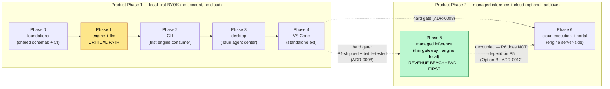
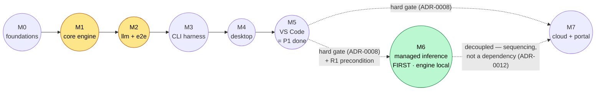

# Roadmap

> Status: Living

- **Related**: [current.md](current.md), [../product-constraints.md](../product-constraints.md), [../project-structure.md](../project-structure.md), [../tech-stack.md](../tech-stack.md), [../vision.md](../vision.md), [../decisions/README.md](../decisions/README.md), [../standards/README.md](../standards/README.md)

This directory is the **central map** for building **Relavium** — a multi-surface,
local-first AI agent workflow platform under the HodeTech org
(`github.com/HodeTech/Relavium`). It is the team's primary navigation aid: start
here to see the whole shape of the work, then follow a link into a single phase
file for the granular, ordered breakdown.

The roadmap is split into one file per phase so each phase carries its own scope,
ordered workstreams, acceptance criteria, in-phase milestones, and go/no-go gate
without the others churning. This README never duplicates that detail — it maps it:
the phase dependency graph, the phase index, the global milestone spine, the
critical path, and the cross-phase invariants that hold across every phase.

- **[current.md](current.md)** — what is active **right now** and the immediate
  next concrete actions. Read this first to know where the project actually stands.
- **[phases/](phases/)** — one file per phase; each is a self-contained unit of
  work with an H1, a `> Status:` line, a goal, scope (in / explicitly out), an
  ordered work breakdown with per-workstream acceptance, in-phase milestones,
  dependencies, an exit gate, and risks.

## How this roadmap is organized

### Two senses of "phase" — never conflate them

- **Product Phase 1 (local-first)** — the shippable product with **zero cloud
  dependency**: no account, no subscription, no server. Agents run on the user's
  machine; API calls go directly to LLM providers; privacy is a feature. Product
  Phase 1 spans **build phases 0 → 4** below
  ([product-constraints.md](../product-constraints.md)).
- **Product Phase 2 (managed inference + cloud)** — optional, opt-in capabilities
  added *alongside*, never replacing, the local-first BYOK surfaces. It spans **build
  phases 5 → 6**, every part marked explicitly as Product Phase 2, and is hard-gated
  on all of Product Phase 1 being shipped and battle-tested by real users
  ([ADR-0008](../decisions/0008-local-first-phase-1-cloud-phase-2.md)). Per the
  **Option-B** decision ([ADR-0012](../decisions/0012-managed-inference-dual-mode.md)),
  Product Phase 2 is split so that **managed inference (build phase 5) ships first,
  decoupled from and ahead of cloud execution (build phase 6)**:
  - **Build phase 5 — managed inference** is the revenue beachhead: a **thin
    gateway** where the engine stays **local** and only LLM egress is proxied through
    Relavium's gateway behind a new `ManagedGatewayProvider`. It is additionally
    gated on the **R1 precondition** (provider-ToS confirmation + a merchant-of-record
    + DPA/KVKK/GDPR posture).
  - **Build phase 6 — cloud execution + web portal** is the heavy plane: cloud
    workers running the engine server-side, the control-plane portal, team/RBAC, and
    enterprise. It is sequenced after — and does **not** block — managed inference.

  Throughout Product Phase 2, **BYOK stays first-class**: managed never deprecates
  BYOK, and no mode crosses silently
  ([ADR-0012](../decisions/0012-managed-inference-dual-mode.md)).

Milestones are **phase-relative**, never calendar dates. A phase begins only when
the prior phase's exit gate passes.

### Engine-first build order

The engine is the critical path. Surfaces are built only after the engine is
proven, and the cloud layer only after Product Phase 1 is battle-tested. The
canonical dependency order is:

**`packages/shared` → `@relavium/llm` → `@relavium/core` → CLI → desktop → vscode → managed inference → cloud**

This mirrors [../project-structure.md](../project-structure.md) and the architecture
decisions. No surface code begins before the engine milestones (Phase 1 exit) are
met; the CLI exists in part to validate the engine API ergonomics — as the first
real consumer and the engine's regression harness — before UI complexity is
introduced. The two Product Phase 2 steps both sit behind the **same immovable
`LLMProvider`/`ExecutionHost` seams**: managed inference adds a new
`ManagedGatewayProvider` (engine stays local), and cloud execution adds a
`CloudExecutionHost` (engine runs server-side) — neither forks `@relavium/core`.

## Phase dependency graph

The graph shows the strictly sequential engine-first critical path through Product
Phase 1, then the hard gate into Product Phase 2 — where, per **Option B**
([ADR-0012](../decisions/0012-managed-inference-dual-mode.md)), **managed inference
(Phase 5) is the first Phase-2 deliverable, decoupled from and ahead of cloud
execution (Phase 6)**.

Both Phase 5 and Phase 6 hard-gate on Product Phase 1; Phase 5 additionally gates on
the **R1 precondition** (provider ToS + merchant-of-record + DPA/KVKK/GDPR). The
dotted P5→P6 edge is **sequencing, not a dependency** — cloud execution does not
require managed inference, and managed inference ships without the cloud plane.

The engine packages (`@relavium/llm` + `@relavium/core`, Phase 1) are the single
critical-path node: every surface depends on them, and they have no surface above
them to lean on. Phase 0 exists only to make Phase 1 safe to start against a frozen
contract and a green CI gate.

## Phase index

| Phase | Objective | Depends on | Exit gate (one line) | Link |
|-------|-----------|------------|----------------------|------|
| **0** | Stand up the Turborepo + pnpm monorepo, land `packages/shared` (the Zod schemas + inferred types that are the single source of truth), and wire the tooling/CI/docs spine every later phase builds on. | — (build-order step 1) | Clean `pnpm install` + green `pnpm turbo run lint typecheck test` across all workspaces in CI; `@relavium/shared` round-trips the reference YAML with no drift; the `RunEvent` union matches the canonical colon-namespaced schema (type-level + runtime test); seam lint fence live. | [phases/phase-0-foundations.md](phases/phase-0-foundations.md) |
| **1** | Build the two engine packages everything depends on — `@relavium/llm` (the provider-agnostic `LLMProvider` seam, 3 adapters, fallback runner, cost) and `@relavium/core` (YAML→DAG, runner, checkpoint/resume, retry) — proven end-to-end from a Node harness. **The critical path.** | Phase 0 | A Node harness runs a 3-node workflow end-to-end with live streaming, canonical events, checkpoint/resume, retry, and provider fallback; all 3 adapters pass conformance (fixtures on PR, live nightly); no vendor type crosses the seam; zero platform imports. | [phases/phase-1-engine-and-llm.md](phases/phase-1-engine-and-llm.md) |
| **2** | Ship the `relavium` CLI as the **first real engine consumer** and the engine's **regression harness** — `run / list / logs / gate / status`, an `ink` TUI, and a deterministic `--json` CI mode. | Phase 1 | A 3-node workflow runs via `relavium run` with the live TUI; durable history powers `list`/`logs`/`status`; human-gate pause/resume works interactively and via `relavium gate`; `--json` NDJSON is asserted by a green no-TTY CI regression harness; keys live only in the keychain (or documented fallback); `npm i -g relavium` verified on macOS/Linux/Windows. | [phases/phase-2-cli.md](phases/phase-2-cli.md) |
| **3** | Ship the Tauri v2 desktop **agent-management center**: ReactFlow canvas, live run monitoring, local SQLite history, OS keychain — offline, no account. **NOT an IDE** ([ADR-0007](../decisions/0007-desktop-is-not-an-ide.md)). | Phase 2 | Signed builds on macOS/Windows/Linux launch to a working agent center; build + run a 3-node workflow on the canvas with live streaming and per-node cost — all offline; SQLite history supports trace/Gantt/replay/retry-from-node; gates pause/resume; no secret crosses into the WebView; ADR-0010 perf gate passes; per-platform Playwright e2e green. | [phases/phase-3-desktop.md](phases/phase-3-desktop.md) |
| **4** | Ship the standalone VS Code extension that **bundles `@relavium/core` in-process**: right-click run, sidebar + status-bar monitor, human-gate webview — with **no desktop app required**. Closes Product Phase 1. | Phase 3 | With only the extension installed: right-click a file → pick a workflow → watch streaming in the sidebar/status bar → approve a gate in a webview → run completes; same canonical events + same local SQLite history as CLI/desktop; keys only in `SecretStorage`; import-zone check passes; `relavium.relavium` published and installs on macOS/Windows/Linux. | [phases/phase-4-vscode.md](phases/phase-4-vscode.md) |
| **5** | **Product Phase 2 — managed inference (the first Phase-2 deliverable, Option B).** The opt-in `managed` execution mode: the engine stays **local**, only LLM egress is proxied through Relavium's gateway behind a new `ManagedGatewayProvider`, calling providers with Relavium's own keys and selling metered usage. Accounts/device-flow auth, key vault + pools, real-time metering (reserve→settle, UNIQUE `request_id`), quota/budget caps, Stripe prepaid+overage billing, cheap-default routing, abuse controls, no-prompt-logging, usage dashboard. **BYOK stays first-class.** | All of Phase 1 (0–4), shipped + battle-tested ([ADR-0008](../decisions/0008-local-first-phase-1-cloud-phase-2.md)); **plus R1**: provider-ToS confirmation + merchant-of-record + DPA/KVKK/GDPR ([ADR-0012](../decisions/0012-managed-inference-dual-mode.md)) | R1 gate met; a user logs in via device flow, **explicitly** opts into managed, and a workflow runs in `managed` mode with the engine still local and only egress proxied (no silent mode crossing); `ManagedGatewayProvider` is behind the unchanged seam (engine/types untouched); metering is idempotent (UNIQUE `request_id`) + nightly-reconciled; quota/hard-cap + Stripe billing fire; no prompt logging by default; **BYOK unchanged and first-class.** | [phases/phase-5-managed-inference.md](phases/phase-5-managed-inference.md) |
| **6** | **Product Phase 2 — cloud execution + web portal (decoupled from, sequenced after Phase 5).** Optional cloud **execution** (BullMQ/Redis/Postgres) + the web portal (usage/quota/license/enterprise), with a **transparent local→cloud switch** behind the engine's `ExecutionHost` interface, so the *same* `@relavium/core` runs in both modes with no fork; BYOK-cloud mode and team/RBAC/enterprise. | All of Phase 1 (0–4), shipped + battle-tested ([ADR-0008](../decisions/0008-local-first-phase-1-cloud-phase-2.md)); **does not depend on Phase 5** ([ADR-0012](../decisions/0012-managed-inference-dual-mode.md)) | A team runs a workflow in the cloud, shares a run-replay URL, and approves a gate via an email link — same engine, no fork (mode flag via `ExecutionHost`); SSE delivers canonical events with lossless reconnection; multi-tenancy is provably isolated and the four-key-leak security audit passes; quota enforcement fires; transcripts are never synced; **all Phase 1 surfaces still run fully locally with no account, unchanged.** | [phases/phase-6-cloud-execution-portal.md](phases/phase-6-cloud-execution-portal.md) |

## Global milestone spine

The milestones are the cross-phase checkpoints the whole plan is anchored on. Each
is achieved by specific workstreams inside one phase (the workstream ids are local
to that phase's work breakdown).

| ID | Milestone | Product phase | Achieved by (phase · workstreams) |
|----|-----------|---------------|-----------------------------------|
| **M0** | **Foundations green** — monorepo + tooling + CI are green on a clean checkout; `@relavium/shared` exports the full Zod schema set and round-trips the reference YAML with no drift; the canonical `RunEvent` union (`sequenceNumber`, `cost:updated`) is pinned by a type-level + runtime test; the no-vendor-type seam fence is live. | 1 | Phase 0 · 0.E (schemas), 0.G (CI), 0.F + 0.H (fence + docs) |
| **M1** | **Core engine proven** — `@relavium/core` parses YAML→DAG and runs it: the `WorkflowEngine` + `AgentRunner` over all node types, emitting canonical events through the `RunEventBus`, with checkpoint/resume and retry. Zero platform-specific imports. | 1 | Phase 1 · parser + runner + checkpoint/resume + retry |
| **M2** | **LLM seam + end-to-end engine** — `@relavium/llm` (the `LLMProvider` seam, 3 adapters, fallback runner, cost tracker) wired into the engine; the Node harness runs a workflow end-to-end with live streaming, retry, and a provider fallback; conformance suite green (fixtures on PR, live nightly); no vendor SDK type crosses the seam. | 1 | Phase 1 · LLM seam + adapters + fallback + cost + Node harness |
| **M3** | **CLI + engine regression harness** — the `relavium` CLI drives the engine end-to-end with a live `ink` TUI and a deterministic `--json` CI mode; a small fixture suite runs in CI on every engine change as the agreed regression gate for Phases 3–6. | 1 | Phase 2 · 2.D (run wiring), 2.F (`--json` / CI mode), 2.K (regression harness) |
| **M4** | **Desktop agent-management center** — a signed, offline, no-account Tauri v2 app: ReactFlow canvas with all node types, live execution theater, gate overlay, local SQLite history (trace/Gantt/replay/retry-from-node), OS keychain; ADR-0010 perf gate + per-platform e2e green. | 1 | Phase 3 · 3.K (packaging), 3.L (e2e + perf gate), 3.N (sign-off) |
| **M5** | **Product Phase 1 complete** — the standalone VS Code extension is shipped to the Marketplace: right-click run, live monitoring, human-gate webview, **no desktop app required**, same engine + events + SQLite history as the other surfaces. | 1 | Phase 4 · 4.E (right-click run), 4.H (gate webview), 4.K (Marketplace publish) |
| **M6** | **Managed inference shipped (the first Phase-2 deliverable, Option B)** — the opt-in `managed` execution mode behind the unchanged `LLMProvider` seam: the engine stays **local** and only LLM egress is proxied through Relavium's gateway (`ManagedGatewayProvider`); accounts + device-flow auth, key vault + pools, idempotent real-time metering (reserve→settle, UNIQUE `request_id`) + nightly reconciliation, quota/hard-cap + per-day budget, Stripe prepaid+overage billing, cheap-default routing, abuse controls + kill switch, no-prompt-logging, usage dashboard. R1 (provider-ToS + merchant-of-record + DPA/KVKK/GDPR) cleared; **BYOK unchanged and first-class, no silent mode crossing.** | **2** | Phase 5 · 5.C (gateway + `ManagedGatewayProvider`), 5.E (metering), 5.K (launch) |
| **M7** | **Cloud execution + portal shipped** — cloud execution + the control-plane portal with a transparent local→cloud switch (one engine, no fork): accounts + multi-tenancy, lossless SSE, triggers + gate notifications, quota enforcement, enterprise (SSO/RBAC/audit); the multi-tenant security audit passes and Phase 1 local-first is regression-green. Decoupled from and sequenced after M6. | **2** | Phase 6 · 6.G (auth + tenancy), 6.J (portal), 6.K (enterprise) |

## Critical path

> **The critical path is the engine: Phase 1 (`@relavium/llm` + `@relavium/core`).**
> Phase 0 only de-risks it; every surface (Phases 2–4) and both Product Phase 2
> layers — managed inference (Phase 5) and cloud execution (Phase 6) — sit on top of
> it. A slip in Phase 1 slips everything. This is why the build order is engine-first
> and why the CLI (Phase 2) follows immediately as the first real consumer and
> regression harness — to prove the engine API ergonomics before any UI complexity,
> and to keep the engine green through every later phase. The two Phase-2 layers both
> attach behind existing seams and **do not depend on each other**: per Option B
> ([ADR-0012](../decisions/0012-managed-inference-dual-mode.md)), managed inference
> (M6) ships first and decoupled from cloud execution (M7).

## Cross-phase invariants

These hold in **every** phase; each phase's exit gate re-verifies the ones it
touches. They are the contract that lets all seven phases (0–6) share one engine
without drift.

1. **One engine, no fork.** `@relavium/core` + `@relavium/llm` are the only execution
   engine. Every surface (CLI, desktop, VS Code) and both Product Phase 2 layers
   *consume* the same engine: managed inference attaches a new `ManagedGatewayProvider`
   behind the `LLMProvider` seam with the engine **local** (Phase 5,
   [ADR-0012](../decisions/0012-managed-inference-dual-mode.md)), and cloud-only
   behavior lives behind the `ExecutionHost` seam (Phase 6) — never in a parallel
   engine ([ADR-0008](../decisions/0008-local-first-phase-1-cloud-phase-2.md)).
2. **No vendor type crosses the LLM seam.** Only Relavium/Zod types cross the
   `LLMProvider` seam; provider SDK imports are confined to
   `packages/llm/src/adapters/*`. The import-zone lint fence is scaffolded in
   Phase 0 and enforced from Phase 1's first adapter import
   ([ADR-0011](../decisions/0011-internal-llm-abstraction.md),
   [code-style-typescript.md](../standards/code-style-typescript.md)).
3. **Zero platform-specific imports in the engine.** `@relavium/core` runs identically
   in Node, the Tauri WebView, the VS Code extension host, and (Phase 6) the Bun API
   — verified since Phase 1, relied on for bundling in Phase 4 and cloud hosting in
   Phase 6. (Managed inference in Phase 5 keeps the engine local — only LLM egress is
   proxied — so it adds no new host.)
4. **One canonical `RunEvent` union.** The colon-namespaced events with `sequenceNumber`
   and the `cost:updated` payload are encoded once in `@relavium/shared` (Phase 0).
   Every surface and both transports (in-process/IPC and HTTP SSE) emit the *same*
   union ([sse-event-schema.md](../reference/contracts/sse-event-schema.md)).
5. **One Drizzle schema, two dialects.** A single Drizzle schema targets local SQLite
   (Phases 2–4) and cloud Postgres (Phase 6) with no fork; cost is always stored as
   integer micro-cents, never floats ([ADR-0005](../decisions/0005-sqlite-drizzle-local-postgres-cloud.md),
   [database-schema.md](../reference/desktop/database-schema.md)).
6. **Secrets never leak across a boundary.** API keys live only in the OS keychain
   (or the documented headless/`SecretStorage` equivalent), are resolved at call time,
   and never appear in the WebView, logs, `--json`/SSE event payloads, run records, or
   exported YAML ([ADR-0006](../decisions/0006-os-keychain-for-api-keys.md),
   [local-first-and-security.md](../architecture/local-first-and-security.md)).
7. **Local-first BYOK, no account, through Phase 1.** Phases 0–4 require no cloud, no
   account, no server. Both Product Phase 2 layers (managed inference, Phase 5; cloud
   execution, Phase 6) are additive and must never break this — each phase's exit gate
   re-verifies that every Phase 1 surface still runs fully locally, unchanged. **BYOK
   stays first-class:** managed inference never deprecates BYOK, and no mode crosses
   silently — a BYOK user is never billed without an explicit managed opt-in
   ([product-constraints.md](../product-constraints.md),
   [ADR-0012](../decisions/0012-managed-inference-dual-mode.md)).
8. **The desktop is an agent-management center, not an IDE.** No code editor, file
   browser, or terminal; inline code review belongs to the VS Code extension. A
   scope-regression e2e guards this in Phase 3
   ([ADR-0007](../decisions/0007-desktop-is-not-an-ide.md)).
9. **Workflow files are git-native.** `.relavium/*.relavium.yaml` and `.agent.yaml`
   are first-class artifacts designed to be committed, PR'd, and reviewed; every
   surface round-trips them and strips secret references on export
   ([ADR-0009](../decisions/0009-git-native-workflow-yaml.md)).
10. **Engine gaps fold back, never get papered over.** Any engine ergonomics gap a
    surface discovers is filed as a Phase 1 amendment and re-tested in the CLI
    regression harness — never patched as a surface-only workaround.

## Conventions for this roadmap

- No YAML front-matter. Each file leads with an H1 and a `> Status:` line, then
  bold **Related** links, then the body. Headings are sentence case.
- File and link names are kebab-case; internal links are **relative** so they
  resolve on GitHub. Reference, architecture, and decision docs are cited by link —
  this roadmap maps them, it does not duplicate them (one canonical home per artifact).
- Milestones are **phase-relative** (no calendar dates); ISO dates are used only for
  the `> Last updated:` line in [current.md](current.md).
- Mermaid is used where a graph or sequence clarifies a dependency.
- Product Phase 2 content is marked explicitly so it is never mistaken for shipped
  Phase 1 behavior.
