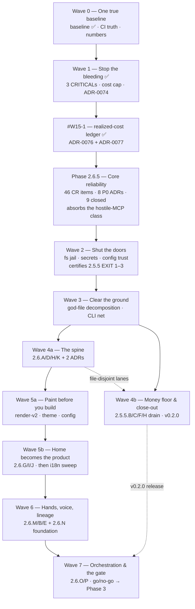

# Current state

> Status: Living
>
> Last updated: 2026-08-11

- **Related**: [README.md](README.md), [phases/phase-2.5-cli-consolidation.md](phases/phase-2.5-cli-consolidation.md), [phases/phase-2.5.5-hardening-and-remediation.md](phases/phase-2.5.5-hardening-and-remediation.md), [phases/phase-2-cli.md](phases/phase-2-cli.md), [deferred-tasks.md](deferred-tasks.md), [../project-structure.md](../project-structure.md), [../tech-stack.md](../tech-stack.md)

> **Authority (until Phase 2.5.5 and Phase 2.6 close):** This file is canonical for
> live progress and execution order; the phase documents stay canonical for scope and acceptance. Ordering
> differences between the two are deliberate. `current.md` may override recommended ordering — it may **not**
> redefine a security boundary, a scope line, or a milestone acceptance criterion.

This page tracks what is active **right now** and the immediate next concrete actions.
The full phase plan and the global milestone spine are in [README.md](README.md).
**Phase 2.5 (CLI Consolidation) is complete** (milestone **M2.5-4**, PR #69, 2026-07-08) — its
breakdown, now historical, is in
[phases/phase-2.5-cli-consolidation.md](phases/phase-2.5-cli-consolidation.md).
A 2026-07-19 full-project code review then opened **Phase 2.5.5 (Hardening and Remediation)**, an
interstitial phase holding the review's verified findings against the pre-2.6 codebase; it runs
**concurrently with Phase 2.6, not before it** — see
[phases/phase-2.5.5-hardening-and-remediation.md](phases/phase-2.5.5-hardening-and-remediation.md)
and [Active now](#what-is-active-now).
**Phase 2.6 — Conversational Authoring and the First-Class CLI** is **in progress** (re-scoped
2026-07-08); its plan is in
[phases/phase-2.6-conversational-authoring.md](phases/phase-2.6-conversational-authoring.md).
Workstream **2.6.F (platform floor + the full-screen TUI renderer)** is **merged to `main`**
(PR #74, 2026-07-11), and so is **2.6.C** (the reseat transcript-carry + the `/cost` per-model breakdown,
PR #75, 2026-07-13) — see [Active now](#what-is-active-now). **2.6.Q** (dynamic model-catalog
enrichment) is **no longer blocked**: [ADR-0071](../decisions/0071-models-dev-as-the-model-metadata-source.md)
and [ADR-0072](../decisions/0072-model-metadata-in-the-db-behind-a-generated-offline-floor.md) are both
**Accepted**, resolving the six open maintainer questions the phase file had cited, and the P1–P5
implementation steps are **merged to `main`** (PR #76, 2026-07-26). P6 and the `/settings` → `/models`
visibility toggle remain open; the bundled offline snapshot was **regenerated** in PR #79 after the D3
price ruling.

**The unified build order across both phases is in
[Execution order — Phase 2.5.5 + Phase 2.6](#execution-order--phase-255--phase-26-temporary) below** — a
temporary section, deleted when both phases close. Its baseline step is discharged (PRs #76 and #77 merged)
and **Wave 0's CI-truth PR is in flight on `development` (PR #80)**.

## Execution order — Phase 2.5.5 + Phase 2.6 (temporary)

> **Temporary section — delete it when both phases close.** It owns **ordering only**. Every item's
> definition, size, file list and finding ids live in its phase file —
> [phase-2.5.5](phases/phase-2.5.5-hardening-and-remediation.md) (176 work items, sub-streams A–I) and
> [phase-2.6](phases/phase-2.6-conversational-authoring.md) (15 open workstreams) — and nothing below
> restates them. Items are cited as `<sub-stream> · <the bullet's bold lead-in> (<finding ids>)`, which
> greps directly against the phase file.
>
> Derived 2026-07-26 from a full pass over both phase files, their own sequencing sections, and the live
> tree. Where it departs from a phase file's own prose, see [Departures](#departures-from-the-phase-files-own-sequencing).

### Ordering root — one baseline ✅ **discharged 2026-07-26**

The plan opened on a divergence neither phase file modelled: Phase 2.5.5's whole backlog is written against
`f88b0e8`, which existed only on `development` behind PR #76, so every `file:line` citation in it resolved
against a tree nobody was branching from. **PR #76 and #77 are both merged** — `f88b0e8` is on `origin/main`,
`origin/development` and `origin/main` held identical trees with no open PRs as of 2026-07-26. Every
citation in this plan now resolves. (PR #79 and PR #80 have opened since.)

One consequence survives and is worth keeping until the phases close:

> **Branch from `origin/development`, never from a local `main`.** A long-lived `development` merged into
> `main` by merge commit leaves a stale local `main` behind after every PR, silently and without conflict.
> Run `git fetch` and cut from `origin/development`.

Also settled while discharging this: `main` now carries branch protection (PR required, `lint · typecheck ·
test` required, force-push and deletion blocked) and a `v*` tag ruleset restricting tag creation to the
maintain/admin roles — closing the Phase-0 obligation that made `ci.yml`'s own "REQUIRED status check"
comment untrue. `release.yml` asserts its ref is reachable from `main` before `pack`, so **2.5.5.H's `G26`
is closed ahead of Wave 0**.

### The three axes this order is built on

1. **Irreversibility** — a defect whose damage a later fix cannot undo jumps every queue. That is Wave 1:
   a credential already written into a durable `--json`-visible row, a billed turn lost after the reply
   rendered, model-controlled ANSI inside the consent card, and the states where the cost cap is silently off.
2. **File ownership** — whoever edits a file next inherits everyone else's rebase. Every god-file
   decomposition and naming/convention ruling lands *before* the 2.6 workstream that piles onto it, and
   eleven items are pulled across the phase line because they edit the exact function another item restructures.
3. **Certification** — a wave that discharges a phase obligation certifies it while the evidence is fresh,
   which is why 2.5.5's exit criteria 1–3 close in Wave 2 rather than at the end.

Waves are readable single-branch sequences. Concurrency is expressed as *"these queues are file-disjoint,
any order"* — never as headcount.

### Wave 0 — One true baseline

Collapse the divergence, make the required gate execute the artifact it ships, and fix the review
checklists before ~30 security-gated PRs are reviewed against them.

1. ✅ **Merge PR #76** (2.6.Q P1–P5, ADR-0071/0072, the three picker bugs, the param self-heal) — **done
   2026-07-26**, along with #77 (this plan + the Phase-2.5.5 opening + `release.yml`'s `G26` ancestry gate).
2. ✅ **Reserve numbers** — **done**, recorded here: migrations end at `0012` and ADRs at `0072` (verified),
   so `0013` = **ADR-0074 §4's conservative money columns** (`agent_sessions.total_conservative_microcents` + `session_costs.conservative_microcents`) — the number was freed when D8 ruled against the approval-preview scrub and is RE-USED here rather than left as a hole · `0014` = 2.5.5.C's enum CHECKs (#101) · `0015` = 2.6.H ·
   `0016` = 2.6.G's pins · `0017` = 2.6.N lineage; **ADR-0075+** for the nine unwritten 2.6 ADRs (`0073` = the history.db migration lock, `0074` = durable conservative budget commitments — both landed in Wave 1).
3. ✅ **One `ci.yml`/`turbo.json`/`tsup.config.ts` PR** — **done 2026-07-29 (PR #80)**, all eight items:
   2.5.5.H · the required gate never runs the compiled binary + undeclared `drizzle` output (#294, #315) →
   local `pnpm run ci` vs `ci.yml` divergence (#312 — and `pnpm ci` is shadowed by a pnpm builtin, so the
   script was unreachable by the name everyone types) → the coverage-floor **ruling and its implementation**
   (#296, #152) → the `(advisory)` labels (#320) → `THIRD_PARTY_EXTERNAL` (G27, #248) → bundle-closure
   single-chunk assert (#314) → `sync:models:check` (#317). *(`release.yml`'s ancestry check, `G26`, landed in
   #77; its tag-protection half is configured.)* The PR also closed the four blockers from the 2026-07-29
   roadmap review, and its own CI caught two real defects in it — a TS4111 that `turbo run typecheck` does not
   cover, and `pnpm ci` being unreachable because pnpm reserves `ci` as a builtin.
4. ✅ **2.5.5.F · three skills' hardcoded foreign-project paths** (#162) — **done 2026-07-29.** Filed as docs,
   actually a functional bug: they pointed at `/Users/dev/…/Agent-Organizer/`, so `add-package`'s `mkdir -p`
   would have created a tree outside the repo. All three now anchor on `$(git rev-parse --show-toplevel)`.
5. ✅ **One markdown PR** — **done 2026-07-29**: `packages/mcp` added to all five inventory sites (#128, #129,
   #153, #163, #254), the reviewer agent's secrets item extended to the shipped CLI floor (#164), the
   security-review skill's SSRF step now requires reusing the shared guard rather than re-deriving one (#167),
   and the i18n clause settled by the D5 ruling (#74, #260, #134).
6. ✅ **The locale-bar amendment** (D5, `en`+`tr`) and the **snapshot regen** (D3) — **done**, propagated to
   all seven locale sites and merged as PR #79 (two price rises taken, nine retirements accepted).

> ✅ **Wave 0 is COMPLETE (2026-07-29).** The required gate now executes the binary it ships,
> `apps/cli/drizzle/**` is a declared turbo output, and `lint · typecheck · test` +
> `engine coverage floor (llm, mcp)` are both required checks under branch protection. In phase terms this
> closes **8 of 2.5.5.H's 14** tasks and **3 of 2.5.5.F's 20**. **Wave 1 followed and is also complete
> (2026-07-30, PR #81) — see below; Wave 2 is next.**

### Wave 1 — Stop the bleeding

All three CRITICALs, plus the states where `max_cost_microcents` is silently not a cap. Four file-disjoint
lanes, any order between them, plus the money hole they left open.

**✅ Wave 1 is COMPLETE — lanes (a)–(d) on 2026-07-30 (PR #81), lane (e) on 2026-08-09 (`#W15-3`).**

> **Superseded 2026-08-09 — kept because the correction is the record.** Lane (e) closed with `#W15-3`:
> `/cost --release` makes §1's escape hatch reachable, and `/cost` renders the durability state. The
> retraction below was accurate when written and is no longer; it stays so the history of the false
> completion claim is not quietly erased.
>
> **Retraction (2026-07-30).** This section previously said Wave 1 was complete and ADR-0074 fully implemented.
> That was wrong on lane (e) and I am correcting it rather than leaving it: **§1's release escape hatch is
> exposed on `GovernorWiring` but reachable from no command, REPL action or Home affordance**, and `/cost` never
> renders `conservativeDurabilityBroken`. §1 names this exact state as forbidden — "a single usage-less response
> would permanently shrink a long-lived chat's cap with no way out" — and this PR REMOVED the accidental escape
> a restart used to provide. A section whose compensating bound is unreachable is not implemented, and marking
> it done made four other documents inherit the error. Two independent reviews flagged it; both were right.
>
> Lane (e)'s remaining work, and two defects it exposed that ADR-0074 does not cover, are tracked in
> **[PR #81's closing list](#pr-81s-closing-list-and-the-two-items-that-need-an-adr)** below. Every lane below is verified against the shipped code, not
against its own task text — the check for each is stated inline. Two gaps are recorded rather than closed; both
are named in their lane and marked in the source, and neither is a shipped defect:

1. the engine-level composition test for ADR-0074 §3's abort-breakable media-job hold (`engine.ts`, at the abort
   listener) — the governor's own state machine is mutation-verified, the composition with `#countRunning`'s
   termination gate is not;
2. the CLI-layer test that `restoreConservativeCost` is wired through `buildSessionRuntime` → `GovernorWiring`
   (`session-host.test.ts`) — `AgentSession.resume` calling the hook IS mutation-verified in `packages/core`;
   only the spread that supplies it is unproven.

- ✅ **(a) `registry.ts`** — 2.5.5.A · **redact tool-approval previews like `sanitizeInput()` already does**
  (#91). *(The originally-planned migration 0013 scrubbing already-persisted previews was ruled OUT — see D8.)* *Closed: `previewFor()` now scrubs the DISPLAY copy while `rawPreviewFor()` keeps an
  `unredactedPreview` for in-process classification — splitting the two uses, because a whole-string scrub
  flipped the protected-path decision and a per-segment one reopened the leak. Verified: `registry.ts` and
  `tools/types.ts` both carry `unredactedPreview`.*
- ✅ **(b) `packages/db` chain, strict** — 2.5.5.C · `SQLITE_BUSY_SNAPSHOT` (#100) → async backoff replacing
  the blocking `Atomics.wait` (#226) → **the chat-persister safety net** (#228, CRITICAL) →
  serialize `runMigrations` (#99) co-landed with the unconditional 0600 self-heal (#28, #33) →
  `createClient` typed error + PRAGMA docstring (#104, #105). `deprecationDate` crash guard (G1) is a
  standalone one-liner, droppable anywhere.
- ✅ **(c) render/signals** — 2.5.5.I · **terminal-control sanitization to the four boundaries it never
  reached** (G34, G44, #56, #57, CRITICAL — one PR at the shared helper, its own security review) →
  `SIGTSTP`/`SIGCONT` + onboarding signal-registration ordering (G0, #50). *Closed at all four boundaries the register names, verified by call count:
  `RunApp.tsx` (#56) 9, `final-summary.ts` (#57) 6, `render-error.ts` (G34) 4, `clack-prompter.ts` (G44) 4. G0's
  run/gate `SIGTSTP`/`SIGCONT` is `render/run-job-control.ts`; #50 is closed by ordering —
  `drive-home.tsx` subscribes signals at `:808`, before `runOnboardingWizard` at `:855`.*
- ✅ **(d) money, split across two PRs** — `budget-governor.ts` only: 2.5.5.A · reservation ledger under
  `max_parallel` (G38) → re-armed `budget:warning` + projected `thresholdPct` (G39, G47, G49) → **2.6.Q's
  strict-cap half**. Then `fallback-chain.ts`/`cost-tracker.ts` only: 2.5.5.B · `maxRetries: 0` + jitter +
  `Retry-After` (#276, #279) → narrowed `#emitSuccess` catch + `CostTracker` bounds (#194, #198) +
  **2.6.Q's realized-cost half**.

- 🔶 **(e) ADR-0074 — durable conservative budget commitments (§2–§5 shipped; §1 INCOMPLETE)** · the money hole the other four lanes leave open:
  a bounded estimate retained when a provider may already have billed but returned no trustworthy usage was
  kept only in memory, so a crash or a resume reopened a strict cap against money that may already be owed.
  §5 (a forward-compatible stored-event READ, the precondition for emitting anything new) → §2 (the
  `budget:estimate_committed` contract, the governor's durability barrier, the checkpoint fold and the resume
  restore) → §3 (freeze an async media job's accepted units + price) → §4 (the session's conservative
  aggregate + per-model attribution + migration + transactional persister write).

> 2.6.Q's cost-cap item is **split**: its task text spans both `budget-governor.ts` and `fallback-chain.ts`'s
> `#emitSuccess` — the same catch 2.5.5.B narrows. The two halves join two different PRs, not one.
> **Closes M2.5.5-1.**
>
> **Outstanding inside lane (e) — restated at close, because §4 changed the facts.** ADR-0074 §1 ties a
> commitment's release to the surface that renders it.
>
> **Rendering: done on all three surfaces.** The run TUI and `relavium logs` shipped with §2; `/cost` shipped
> with §4's fold and reads *estimated, possibly billed*, with `(no completed call)` for a model that has one
> without a completed call. All three are mutation-verified.
>
> **Release: reachable, as of `#W15-3` (2026-08-09).** `/cost --release` on the chat surface — the one that
> renders the amount, which is what §1 ties it to — clears the durable per-model and aggregate columns first
> and the live governor second, so a released commitment does not return on the next `chat-resume`. `/cost`
> also renders the durability state. This note previously said no affordance called it; that was true and no
> longer is.
>
> The reserved `budget:estimate_released` event stays **reserved and unemitted**, and that is a decision, not
> an omission: the session path restores its conservative total from COLUMNS rather than by replaying events,
> so zeroing them is what makes the release durable there. The event is needed only by a workflow-run release
> surface, which does not exist — a run is not long-lived, and `on_exceed: pause_for_approval`'s per-node
> bypass or raising the YAML cap are §1's own analogy. §1's dated note in
> [ADR-0074](../decisions/0074-durable-conservative-budget-commitments.md) carries the same statement.

### PR #81's closing list, and the two items that need an ADR

Two independent adversarial reviews of PR #81 (2026-07-30) found that the cap's core safety claim does not yet
hold across a process boundary.

**Almost all of this belongs to PR #81 itself, not to a later wave** — a first framing filed it as one, which
was wrong. The test is simple: this PR either ADDED the code a finding is in (`background-failure.ts`), or
claimed to have closed the area it sits in (the terminal-safety boundaries, ADR-0074 §1), or REMOVED a
protection without replacing it (§1's escape hatch, which a restart used to provide). Shipping a regression and
deferring its fix is not a schedule decision.

**Only §A is genuinely separable.** Both of its items need an append-only ADR before any code — one changes what
"spent" means across a crash, the other supersedes a decision ADR-0074 §5 already recorded. Those earn their own
PRs. Everything from §B down is #81's to close.

Ordered by whether the repo currently states something untrue, then by blast radius.

**Every item names the check that would close it, not just the defect.**

> **Status — 24 of 24 closed and MERGED, across two PRs.** Everything marked ✅ below is fixed and
> break-verified with the mutation confirmed applied; the two PRs are recorded separately because the closure
> dates differ:
>
> - **23 items merged to `main` via PR #81** (2026-08-09).
> - **`#W15-1`, the last one, closed 2026-08-10** behind ADR-0076 + ADR-0077 (see §A) and **merged to `main`
>   via PR #82** (2026-08-11), together with the first Phase 2.6.5 batch.
>
> §E's six coverage gaps are all closed — `#W15-16`'s composition test fails by TIMING OUT when the abort
> listener is removed, which is the unkillable run reproduced exactly rather than an assertion standing in
> for it.
>
> **`#W15-2` closed 2026-08-09** as [ADR-0075](../decisions/0075-fail-closed-resume-on-an-unreadable-event-log.md),
> amending ADR-0074 §5: a read that feeds a REPLAY refuses when any row was skipped, a read that feeds a
> DISPLAY stays tolerant. It landed first on purpose — `#W15-1` adds a new durable event type, and an older
> binary reading it falls straight into §5's skip path, so this decision governs how that event degrades.
>
> **One gap this closing deliberately left open**, named here rather than implied: ADR-0075's refusal is
> pinned at `gate.ts`'s own catch (where the blocker was) and at `toUserFacing`, but NOT through
> `dispatch.ts` / `specs.ts` to the process exit. A re-wrapping `try/catch` added in either layer reproduces
> the same blocker and leaves both tests green. Closing it needs a `run(argv, io)` drive with a redirected
> HOME and a seeded on-disk `history.db`; no such harness exists for `gate` yet, and the marker sits at the
> test it concerns.
>
> **`#W15-1` is what remains, and its DECISION is now made**:
> [ADR-0076](../decisions/0076-durable-per-attempt-realized-cost-ledger.md) (Accepted 2026-08-09) — an
> additive durable run event recording one settled provider attempt, emitted through ADR-0074 §2's barrier and
> folded into a `run_costs` row at persist time. It landed after ADR-0075 on purpose: a new durable event type
> is exactly the input that decision governs.
>
> **The implementation is staged, and starts here.** In order, because each step is a precondition for the
> next:
>
> 1. `packages/shared/src/run-event.ts` — `cost:attempt_settled`'s schema, its union arm, and
>    `parseStoredRunEvent`. Until this lands nothing else compiles.
> 2. `docs/reference/contracts/sse-event-schema.md` — the canonical shape + which of the two cost events is
>    authoritative (ADR-0076's last Negative names that drift risk).
> 3. `packages/db/src/run-history-store.ts` — the `applyDerived` arm writing the `run_costs` row in the SAME
>    transaction as its event. The `node:completed` delta then telescopes to zero on its own; a test must pin
>    that `SUM(run_costs) == runs.total_cost_microcents` still holds, since that is the invariant carrying the
>    no-double-count claim.
> 4. The attempt boundary and its barriers — **corrected by
>    [ADR-0077](../decisions/0077-realized-cost-ledger-uses-the-conservative-commitment-barrier.md)**. ADR-0076
>    §1 asked for an `await` at the settle point; there is no `await` to be had there. The seam's observer is
>    `onAttempt?: (record) => void` — synchronous, void — and BOTH money events are emitted from that one
>    callback a few lines apart, which `budget-governor.ts` already states outright ("which cannot await"). So
>    the ledger takes ADR-0074 §2's shape: **start** the write at the settle instant on a chained in-flight
>    promise, **join** it at three barriers — before the next egress admission, **before tool dispatch**
>    (`agent-turn.ts`'s `await dispatchToolCalls(...)`, the barrier this adds beyond §2), and at the turn/node
>    terminal. Every barrier awaits AND observes the failure, because `#emitDurable` is total for store faults
>    and resolves.
> 5. `packages/core/src/engine/checkpoint.ts` — **corrected during implementation**. The instruction here was
>    "fold it as a SUM of deltas", borrowing ADR-0074 §2's reasoning, and the wrong half of that cost two
>    rewrites. Summing into the realized total double-counts (a node terminal's snapshot already contains its
>    attempts); summing into a separate accumulator and maxing the two families UNDER-counts (a media node
>    writes a snapshot and emits no attempt row, so every attempt after the last boundary vanishes). What is
>    correct is the fold already two arms above it: `Math.max` over every durable ABSOLUTE total. §2's
>    rejection of `Math.max` does not carry — it was rejected there only because a release can DECREASE a
>    conservative total, and realized spend is monotonic.
>
> **STATUS: all five steps are landed** (`8d7ffcf` … `50c60bd`), each with an Opus and a Sonnet round folded.
> The break-verify that matters most was step 4's ordering, and it now holds: with the tests draining to
> quiescence before asserting, deleting B2 reddens the tool-dispatch test and deleting B3 reddens the node-
> terminal test. B1 is masked by B2 on the current fixture (the second egress only comes after the tool), so
> it is covered by construction rather than by a red — named rather than implied.
>
> **This is now the prerequisite of Phase 2.6.5, not a parallel track.** Its five steps touch the same four
> files `CR-10` (ordered append tail) and `CR-12` (effect journal) restructure, so it lands first — see the
> 2.6.5 section below.
>
> **What ADR-0076 explicitly does NOT close**, so it is not read as more than it is: the cost of a TOOL EFFECT.
> A resumed run can still re-execute an `http_request` POST, a `run_command` or an MCP mutation — the
> duplicate EFFECT is the harm, and no cost bookkeeping prevents it. That needs a durable effect journal with
> a prepare/receipt pair, which is a different decision about a different failure and earns its own ADR. It is
> the natural next one after this chain (forward-compatibility → conservative commitment → realized cost).
>
> Two decisions inside the closed set are worth surfacing here rather than leaving in a commit message.
> `#W15-4` **changed a previously-tested behaviour**: #228 pinned that a session survives a failed durable
> write and the next turn is clean; it now stops instead, because continuing to spend above a transcript that
> has fallen behind is the defect. And `#W15-23` is scoped to `run-history-store` only — the other
> `packages/db` stores share the same outer-`db`-inside-a-transaction convention, which remains open, is
> stated here rather than implied closed, and has its own PR queued after this one.

#### A. Needs an ADR first — the only part that is NOT PR #81's to close

- ✅ **`#W15-1` (blocker) — a workflow's REALIZED cost is not durable at the provider-attempt boundary.**
  *Closed 2026-08-10 by ADR-0076 + ADR-0077 and the five staged steps; the barrier is a chain-and-join, not
  the inline await ADR-0076 §1 first specified. See the staged plan below for what each step landed and the
  three carried-forward gaps.*
  `engine.ts` folds `cost:updated` into memory and streams it; the store documents that it is never persisted,
  and the checkpoint can only recover cost from a LATER `node:completed`/gate snapshot. So: a paid call
  succeeds → the model asks for a tool → the process dies during the tool → the realized cost is gone and the
  resumed node re-runs the same paid call, against a cap that has forgotten the first one. ADR-0074 makes only
  the CONSERVATIVE commitment durable; a call that returned trustworthy usage has no equivalent barrier.
  *Needs an ADR: an idempotent per-attempt durable ledger, written before the next tool side-effect, the next
  egress and the turn/node terminal. Not a local fix — it changes what "spent" means across a crash.*
- ✅ **`#W15-2` (blocker) — a tolerant read is fail-OPEN on the resume path.** ADR-0074 §5 drops an event whose
  `type` an older binary does not know, and `checkpointer.ts` builds resumable state from what remains. An
  older binary cannot know whether the dropped row was a node terminal, a job submission, a gate decision or a
  cost commitment — so it may re-run completed or already-submitted work. Preserving the sequence high-water
  mark prevents a UNIQUE collision; it does not restore lost state. Tolerance is right for `logs`/`status`
  (read-only); it is wrong for a replay that changes the world.
  *Needs a superseding ADR (§5 is append-only): fail closed on the resume path with "a newer Relavium is
  required" when any row was skipped, while read-only surfaces stay tolerant — or classify events as
  state-bearing vs not, and tolerate only the latter.*

#### B. PR #81 — ADR-0074 §1, the half that makes the rest safe

- ✅ **`#W15-3`** (blocker) — the release is exposed but unreachable, and nothing renders `durabilityBroken`.
  `GovernorWiring.releaseConservativeCommitments` and `conservativeState()` exist and are tested; no command,
  REPL action or Home affordance calls either. §1 requires the surface that RENDERS the amount to also expose
  clearing it, and this PR removed the accidental escape a restart used to provide.
  *Closed by `/cost --release`: `/cost` renders the durability state, and the release clears the per-model AND
  aggregate columns before the live governor, so it survives `chat-resume`. The durable
  `budget:estimate_released` named here was NOT needed — the session path restores from columns, not from an
  event replay — so it stays reserved; see the lane-(e) note above.*

#### C. PR #81 — data integrity, each with a concrete failure

- ✅ **`#W15-4`** (blocker) — session persistence failures are invisible to the producer. `RunEventBus` isolates
  listener errors by design, so a persister that cannot write still lets the turn complete. Two consequences:
  `persister.ts` advances the in-memory cost total BEFORE the DB write, so a failed `recordSessionCost` leaves
  the durable total low and a resume restores a cap that has forgotten real spend; and a failed `commitTurn`
  leaves the staged turn uncleared, so the next `beginUserTurn` overwrites the previous user message and the
  durable transcript loses an exchange the in-memory session still has.
  *Closes when: cost and transcript persistence move to an awaited durability port (UI subscribers may stay
  passive), and a persistent write failure puts the session in a durability-degraded state that refuses new
  egress rather than reporting success.*
- ✅ **`#W15-5`** (high) — stored payloads are not checked against the authoritative columns. `readEventLog`
  selects `seq`/`event_type` alongside the payload but never compares them to the parsed event's own `runId`,
  `sequenceNumber` and `type`. A row with `seq = 2` carrying `sequenceNumber: 1` is accepted, leaving the
  high-water mark wrong and the resume colliding on the next write.
  *Closes when: every denormalized projection is compared after parse and any mismatch is a
  `CorruptRunEventError`.*
- ✅ **`#W15-6`** (high) — terminal cost snapshots on failed/cancelled runs are dropped by the read models.
  `node:failed`, `run:failed` and `run:cancelled` all carry cost in the shared schema, but the store folds
  none of them, the checkpoint folds none, and the run TUI's summary ignores the terminal figure. A sibling's
  paid media cleanup after a root failure exists ONLY on `run:failed.cumulativeCostMicrocents`, so replay and
  history lose it. Pre-dates this PR, but the PR touches all three files and claims cost safety.
- ✅ **`#W15-7`** (medium) — `media_job:submitted` accepts a half-frozen basis. `units` and
  `acceptedCostMicrocents` are independently optional, so a row with a frozen cost and no frozen units resumes
  with the old reservation and a re-derived volume. The invariant is not "both or neither" (the approved-bypass
  case legitimately has units only) but **`acceptedCostMicrocents` present ⇒ `units` required**.

#### D. PR #81 — security and correctness

- ✅ **`#W15-8`** (high) — the new failure-reporting paths can leak credentials. `background-failure.ts` prints an
  arbitrary rejection message and, under `RELAVIUM_DEBUG`, a raw stack; `sanitize.ts` strips ANSI/control/bidi
  but performs no secret redaction. Same class in the session listener notice, `render-error.ts`'s verbose
  stack and `index.ts`'s fatal debug stack. The rejection can be an MCP error, a provider response body or a
  tool result — all of which carry keys, `Bearer` headers or credentialed URLs. Existing tests plant ANSI, never
  a secret.
  *Closes when: the shared secret-shape redactor runs BEFORE terminal sanitization on every one of those paths
  (stacks included), with tests planting `sk-*`, `Bearer`, `Basic`, credentialed URLs, query tokens and PEM.*
- ✅ **`#W15-9`** (high) — the stream path can throw out of a contract that says it never throws.
  `#runStreamAttempt` calls `#emitSuccess` OUTSIDE its try/catch (the `generate()` path has it inside), so a
  provider returning non-integer usage makes `assertAccountableUsage` throw raw out of the async generator —
  and `streamOneTurn`'s `for await` has no try/catch, so it crashes the turn unclassified, AFTER the content was
  produced and paid for.
- ✅ **`#W15-10`** (high) — `--json` output is not sanitized. `status --json` / `gate list --json` carry
  model-controlled text; `JSON.stringify` does not escape Unicode bidi overrides (CVE-2021-42574). The human
  render path is sanitized; the JSON branch is not. `createJsonRenderer` is the same gap on the NDJSON path.
- ✅ **`#W15-11`** (high) — `createPlainRenderer` sanitizes AFTER splitting on newlines, so an embedded newline
  still forges a line. Every other boundary this PR touched sanitizes first; `renderer.ts` is the exception.
- ✅ **`#W15-12`** (high) — `isBlankPreview` treats a fully-redacted preview as informative (`chat-mode.ts`), so a
  user pressing "always" on `Approve write to [redacted]?` auto-approves every `write_file`/`run_command`/
  `http_request` for the session, having been shown nothing.
- ✅ **`#W15-13`** (medium) — the config reader chmods PROJECT configs to 0600. `reassertOwnerOnly` runs on every
  layer, but `config-spec.md` says project files are committed and shared. Reading a config mutates repo file
  permissions, and `statSync`/`chmodSync` follow symlinks. Self-heal belongs to the canonical global config
  only.
- ✅ **`#W15-14`** (medium) — a provider `Retry-After` sleep is not abort-aware. `fallback-chain.ts` passes the
  delay straight to an injected `sleep` with no signal, and the real hosts use a plain `setTimeout`. A cancel
  during a 60 s clamped wait hangs until the timer fires. The existing abort test resolves `sleep` immediately,
  so the window is untested. The docblock also says an oversized value becomes `undefined`; the code clamps.
- ✅ **`#W15-15`** (medium) — corruption is reported to a multi-run view as "no data". `readPerRunOrDegrade`
  returns only the fallback, so `gate list` can print "No pending human gates." for a run whose gates were lost
  to corruption. It must return the degradation alongside the value, with a warning in human output and a
  machine-readable marker under `--json`.

#### E. PR #81 — coverage gaps it shipped knowingly

All six are now CLOSED and their in-source markers removed. None had been a shipped defect — each had
mutation-verified coverage one layer down — but closing them surfaced one that was: `onLegacyMediaJobHold`
reached `WorkflowEngine` from a real `gate.ts` sentence and the constructor never read it, so ADR-0074 §3's
hold notice was dead and a `relavium gate` resume of a legacy parked media job stalled silently. Found by
the review of `#W15-16`, fixed with it, and now the signal that test drives.

- ✅ **`#W15-16`** — the engine-level composition test for §3's abort-breakable media-job hold; deleting the abort
  listener leaves the whole suite green.
- ✅ **`#W15-17`** — the CLI-layer test that `restoreConservativeCost` is wired through `buildSessionRuntime`.
- ✅ **`#W15-18`** — the `coalesce` backfill of `session_costs.model_catalog_id` (needs a `model_catalog` FK row
  the block does not seed).
- ✅ **`#W15-19`** — that a chat turn's terminal is emitted only AFTER `flushBudgetCommitments` resolves.
- ✅ **`#W15-20`** — the H3 approved-bypass `acceptedCostMicrocents` omission; reverting it leaves the suite green.
- ✅ **`#W15-21`** — `agent-run.ts`'s `attachConservativeWriter`; deleting it silently breaks every capped
  `agent run`.

#### F. PR #81 — standards and documentation drift

- ✅ **`#W15-22`** (low) — the PR's "no unsafe `as`" conformance claim is false. Two assertions in new production
  code: `shared.ts`'s `readRetryAfter` casts an arbitrary `headers.get`, and `openai.ts`'s `mapOpenAiApiError`
  casts a `headers` field back onto a parameter type that lacks it. A structural `headers?:` plus runtime
  narrowing removes both.
- ✅ **`#W15-23`** (medium) — `persistEvent`'s `applyDerived` uses the outer `db`, not the transaction handle.
  Harmless under `better-sqlite3`, but it breaks ADR-0005's Postgres-portability promise on the highest-volume
  money write.
- ✅ **`#W15-24`** (low) — canonical docs describe code that was not shipped. `tool-registry.md` says path
  redaction is per-segment (it is whole-string, and the same file says so correctly three paragraphs later);
  `llm-provider-seam.md` still claims model-discovery/media-poll keep a small SDK retry; ADR-0028's amendment
  note still says ADR-0074 §2–§5 have not landed. Each could send a future reader back toward a #91-class hole.

### Phase 2.6.5 — Core reliability remediation (between Wave 1 and Wave 2)

Three independent core reviews of the post-Wave-1 tree converged — independently — on the **same seven blocking
gaps**: effect journal, stdio MCP consent-before-spawn, run lease, compaction trust elevation, stream grammar,
input admission, event-log ordering. Three separate reviews landing on the same seven points is not opinion.

The full, self-contained work list is
[phase-2.6.5-core-reliability-remediation.md](phases/phase-2.6.5-core-reliability-remediation.md) — **46 items**
(`CR-01`…`CR-95`) with evidence, fix, acceptance criteria and a decision/ADR/gate register, written so the work
can be done from that document alone. An adversarial plan review on 2026-08-10 corrected the phase boundary,
the exit rule and the execution order, and added two items (`CR-17` resume identity, `CR-63` `input_schema`
docs-only).

> **Live status — 6 of 46 closed, merged 2026-08-11 (PR #82).** The prerequisite (`#W15-1`), the oracle
> (`CR-90`, `CR-91`) and all of `W0` (`CR-01`–`CR-03`). `CR-64` was added in the same batch and is open.
> **Next is the durability spine — `CR-10` first**, and it is ADR-first: no code until the decision is
> recorded. Per-item history and the carried-forward gaps live in the phase document.

**This is the corrected execution order, and it is what the graph above shows:**

1. **`#W15-1` first.** Its five staged steps touch `run-event.ts`, `engine.ts`, `checkpoint.ts` and
   `run-history-store.ts` — the same four files `CR-10` and `CR-12` restructure. Landing it after the durability
   spine means writing its barrier against a persistence path that is about to change.
2. **Then Phase 2.6.5, closing before Wave 2 opens.** Which is only true if the work Wave 2 would block on
   lives there — so **the hostile-MCP threat class moves into 2.6.5**: `CR-16` (consent before a stdio spawn)
   plus `CR-40`–`CR-42` (transport cancellation, DNS/redirect SSRF, ingress bounds). Wave 2's queue item 2 is
   **executed as 2.6.5's `W4`**; the 2.5.5 finding ids keep their home in the 2.5.5 phase doc and certify from
   there. Wave 2 keeps the MCP name-collision/tool-poisoning trust items, the fs jail, the secrets layer,
   persistence-security and the certification.
3. **Within 2.6.5, the oracle comes before the spine.** `CR-90`/`CR-91` (crash + durable-truth harness) land
   first because they are the instrument `CR-10 → CR-11 → CR-92 → CR-12` is proven with; `CR-92` moved out of
   the harness group into the spine, since an API returning `completed` while history says `failed` is a
   runtime defect, not a test concern.

Two rules that changed with the plan review:

- **Fourteen items are non-deferrable** — every W0/W1 item plus `CR-50`, `CR-55`, `CR-73`, `CR-80`, `CR-92` and
  `CR-95`'s short-term fix. Each has a cheap fail-closed option (refuse, remove, narrow the claim), so "too big
  to fix now" argues for the cheap option, never for deferral. The previous exit criterion permitted deferring
  all 43 items and declaring the phase complete.
- **The gate is `pnpm run ci` AND `pnpm coverage`.** `coverage` is a separate required CI check and is not
  inside the `ci` script; this phase edits `packages/core` heavily, and the CI coverage job does not block on
  `core`.

`CR-01`–`CR-03` were half-closed by Wave 1 and finished right after the oracle — **all three are closed as of
2026-08-11** (PR #82). `CR-03` was a propagation gap from `#W15-10`'s own fix: the finding named three `--json`
paths that never got the safe serializer, and closing it found **five**, which is why the call-site half is now
an ESLint selector rather than a list.

### Wave 2 — Shut the doors

The two named live security holes, one unified filesystem jail, the secrets layer under test — then
certify while the reviews are still booked.

1. 2.5.5.D · **project-layer MCP name collision redirecting a global secret** (G19), then **MCP tool-definition
   poisoning** (#202).
2. **MCP queue, strict — EXECUTED AS PHASE 2.6.5 `W4`, not here.** Connect-phase timeouts on every transport
   (#35, G32, #205) → transport/discovery/result size bounds against a hostile server (G33, #201, #209, #288) →
   structured `serverId`/`reason` discriminants (#203, #204) → the two fail-loud violations (#206, #207) →
   per-file transport-adapter tests (#297) → `CLIENT_INFO.version` (#208). These finding ids keep their home in
   [phases/phase-2.5.5-hardening-and-remediation.md](phases/phase-2.5.5-hardening-and-remediation.md) and
   certify from there in step 6 below; the *work* happens in 2.6.5 alongside `CR-16` (consent before a stdio
   spawn) and `CR-41` (the DNS/redirect SSRF hole), because they are the same code and the same security
   sitting. Splitting them across two phases would book the hostile-MCP reviewer twice.
3. **The fs jail, ONE reviewed change set** — 2.5.5.D · sensitive-credential floor for `.kube`/`.azure`/gcloud
   (#36, #39) → extract `deepestExistingReal` to `packages/shared` (#235) → **2.6.M's `project`-tier
   `extraRoots`** and **2.6.N's fs-floor home-anchoring**, both *pulled forward*. `~/.relavium/tmp/` (G21)
   is resolved under the same general predicate (decision D12) — otherwise `fs.ts` takes two security reviews.
4. `discoverCatalog` realpath containment (#1); the secrets-layer test pair — OS-keychain bridge (#27) and
   `readSecretFromStdin` + stdin cap (#31, #293); secret-typed `run --input` rejection (#25); the unredacted
   workflow-snapshot doc + lint (#30); 2.5.5.B · `scrubSecrets` param-name broadening (#196).
5. Persistence-security: 2.5.5.C · `assertRelativePath`'s Windows drive-relative form (#113), media-store
   hardening (#111, #108, #112), media `mimeType` verification (#107, #109, #110), the masking fixture (#115,
   after decision D15). 2.5.5.A · chat-export redaction (#80, #81, #83, after D14) and `analyzeSecretTaint`'s
   context sites (G22). 2.5.5.D · `default_headers` (G20, after D13).
6. **Certify 2.5.5 exit criteria 1, 2 and 3** + the sub-stream D acceptance sign-off. **Closes M2.5.5-2 (D half).**

> Book **four security-review sittings by threat class** (fs/path-jail · secrets-at-rest · secrets-input ·
> config-trust), not ~30 per-PR passes. The **hostile-MCP** sitting moved to Phase 2.6.5 with the queue-2 work;
> it covers `CR-16` and `CR-40`–`CR-42` there. Reviewer availability, not code, is this wave's critical path.

### Wave 3 — Clear the ground

Decompose, guard and normalize every hot file a 2.6 workstream is about to land on. **The multi-file queue
runs first and is serialized against the rest**; the remaining queues are file-disjoint, any order.

Two orderings here are not this plan's invention — they are the intra-phase serializations
[2.5.5 records under Positioning](phases/phase-2.5.5-hardening-and-remediation.md#positioning): **E before I**
on `home-controller.ts`/`chat-ink.tsx` (the decomposition moves already-guarded code), and **C before E** on
`packages/db/src/client.ts` (C types the error path in Wave 1; E's `openLocalDb` rewrite lands last, here).

- **Multi-file (strict, first)** — 2.5.5.E · `closeQuietly()` to its four siblings (#22) → `displayPath`
  discipline to `resolve.ts`/`catalog.ts`/`chat-export.ts` (#4, G11) → `const exhaustive: never` across the
  six sites (#300, #301, G3, which also makes `relavium run` render `agent:reasoning`).
- **`chat.ts` (strict)** — 2.5.5.G · the four money/token reimplementations (#236, #237, #242, #307) →
  `swapAgentModel` → `reseatAgentModel` (#218) → 2.5.5.E · SIGINT actually calling `session.abort()` (#21, #23)
  → `budgetWarningText` → **2.5.5.I · decompose `chat.ts`** (#220, #244). Then **2.6.M's `allowedDomains`
  chat gap (G30)**, pulled forward into `session-host.ts`.
- **`home-controller.ts` (strict)** — 2.5.5.E · `selectGatePrompter` test (G37) → the swallowed palette
  rejection (#281) → **2.5.5.I · decompose `createHomeController` + the overlay discriminated union**
  (#215, #243) → 2.5.5.G · the `Capability`/`Port` vocabulary split (#217, #222) → 2.5.5.F · Home's
  `showCost` no-op (#125, after D26).
- **`chat-ink.tsx`** — 1,795 lines, larger than `home-controller.ts`, decomposed by **neither** phase doc.
  **Recommendation: decline** a new decomposition (decision D18); take only the exhaustiveness guard and the
  min-terminal-size guard (#63), and hand restructuring to 2.6.M's render-v2 in Wave 5a.
- **Viewport (strict)** — 2.5.5.I · share the ADR-0069 grapheme segmenter (#58, #62, G40, G51) →
  2.5.5.G · tab expansion before width measurement (#65) → per-cluster width cache + resize debounce
  (#64, #66). Alt-screen word-wrap (#61) is **formally re-deferred**.
- **`packages/shared` (strict)** — the `.code` ruling (G50, D10) → `findDuplicates`/`superRefine` at all seven
  remaining schema sites (#89, #90, G16, G17, G18, #210, #211, #212) → `BaseEventSchema` disposition (#213) →
  the `RelaviumError` base class (#219). *The ruling must precede the base class, or it is baked in permanently.*
- **`registry.ts` / `builtins.ts` / `engine.ts`** — `ctx.secretArgKeys` producer (#92) → `ctx.fsScope` (#93) →
  `ok`/`success` (#216, #221) → identifier-sort `localeCompare` pinning (#258, #259) → the `git_commit`
  denial copy (#308); then the four schema length caps (#95), the `llmVisibleParams` rewrite (#96, #98),
  stale doc comments (#78, #97, #214); then `#armRunTimeout` (#75), `#dispatch` dead branch (#79),
  `AbortSignal` into `resolvePrompt` + the human-gate recheck (#76, G9).
- **Process/CLI boundary (strict head)** — 2.5.5.E · the five crash/signal net gaps (#40, #41, #42, #224,
  #269) → the `--help`/`--version` ~400 ms tax (#43, #44, #271); then the flag-system ruling (#45, #264,
  #265, #268), the exit-code and `--help --json` rulings (G35, #13), `logs` coalescing (G15), the `--input`
  namespace ruling (#18, #310). **`openLocalDb` wrap-and-redact (#278, #280) lands LAST** — it touches 8+
  call sites the other queues are still moving.
- Then the tails of 2.5.5.A, E, G and I in any order; sub-stream **A, E and G acceptance sign-offs**;
  and record the **EXIT:4 reading** (decision D22). **Closes M2.5.5-3.**

### Wave 4a — The spine

The four Day-1-independent 2.6 workstreams everything downstream sits on — and nothing else.

1. **ADR-0058** and **ADR-0060** flipped Proposed → Accepted (0060 with its mandatory security review);
   **ADR row 6 drafted when 2.6.H starts, not when 2.6.G starts** as the doc says — H must land before G.
2. 2.6.A · **`nodeCatalogIssue` never resolves the agent's own model** (#88) — ungated pre-existing bug, first.
3. **2.6.K** — the shared resume core (security review) → `budget resume` → the gate-decision/`gateType`
   cross-check (#0) → **2.6.G's `engine.reconcile()` wiring (#229), pulled forward** to where its only
   dependency resolves → secret re-provide (**mandatory security review** — it relaxes a fail-closed
   guarantee) → gate-timeout re-arm → the `run:paused` park distinction.
4. **2.6.H** — the `applyDerived` exhaustiveness guard (#114) co-landed with resilient per-row parse
   (#277, #282) → step attribution → exact per-node cost + failed/cancelled totals (#118, #232) →
   batched `loadRunEvents` (G12, #273) → the bounded tool trace → gate uniqueness → idempotency.
   **Its chat-persister atomicity sub-part is STRUCK** — already owned by Wave 1 (#228).
   Then 2.5.5.C · per-row isolation (#117) as pure propagation of H's skip-and-report ruling.
5. **2.6.A** (package extraction, `validateAuthoredWorkflow` back-port, the run-path tool pre-flight
   #37/G29, direct unit tests #6) and **2.6.D**. *2.6.A's `max_tokens` pre-flight moves to Wave 4b — it has
   a hard dependency on 2.6.Q's `limit.output`.* **Closes M2.6-2.** (M2.6-3 also needs 2.6.B, which lands in Wave 6.)

### Wave 4b — Money floor and close-out

A lane genuinely file-disjoint from the spine. Drain Phase 2.5.5 to its acceptance paragraphs, harden the
adapter/catalog money floor, cut the release 2.6.Q P6 is gated on.

- **Lane 1 (`packages/llm`)** — wire the **live-nightly conformance lane** *before* 2.5.5.B's seven-gap
  **adapter-parity sweep** (#168, #170, #173, #174, #175, #186, #192), which is where those gaps came from →
  **2.6.Q's capability matrix + clamp**, landing on the parity floor → 2.6.A's `max_tokens` pre-flight →
  the four money-guard blind spots (G6, #177, #178, #181) → Anthropic prompt caching (#172) → the rest of
  2.5.5.B. `CATALOG_SHA256` (G6) strictly after Wave 0's snapshot regen. **The Sora 2 shutdown (2026-09-24)
  is a hard external date** — pull it out of wave order if the calendar demands.
- **Lane 2 (`packages/db`, CI, docs)** — 2.5.5.C's remaining 12 bullets (retention after decision D33;
  session-resume liveness #227; pagination #272; enum CHECKs #101; DDL coverage #102/#103; the
  seeded-then-migrated harness #291; …) · 2.5.5.H's remainder (engine-deps allowlist #313/#318/#285; the
  docs-style checker #316; the logging-standard ruling #266/#267/#270; `fast-check` pilot #299) ·
  2.5.5.F's 20-site not-yet-built hedge sweep (#122 …) **rebased onto Wave 0's edits, not reverting them**.
- **Sub-stream B, C and H acceptance sign-offs**, then **cut and publish v0.2.0**. **Closes M2.5.5-4.**

### Wave 5a — Paint before you build

Restructure the render layer and settle the theme/config substrate **once**, before ~24 new screens and a
an `en`+`tr` string catalog land on it.

1. **ADR row 10 (i18n + theming) is this wave's first gate** — ahead of rows 7 and 8. 2.6.L's palette work
   is a render-layer freeze and must not open against an undecided contract.
2. **2.6.M's render-v2 leads**, before 2.6.L's palette sweep — including the pull-in row *approval-consent-line
   zero-width hardening · shared `[c]` reducer*, which **no 2.6.M task bullet currently covers** and would
   otherwise be silently dropped. Its security review reverses the 2.5 never-render-args posture and cites
   Wave 1's sanitization and redaction work as its own technical preconditions.
3. 2.6.L theme system → **one** ADR-0063 amendment covering both 2.6.I's structured `[[mcp_servers]]` writes
   and 2.6.L's preference keys → the `models_in_use` ruling (owned by I, consumed by L) → `/settings` →
   the ADR-0072 `/settings` → `/models` visibility toggle → 2.5.5.I's picker truncation indicator (#60).
4. **Sub-stream I acceptance sign-off** — completes **M2.5.5-2**.

### Wave 5b — The Home becomes the product

Exit criterion 2: no routine task requires a shell subcommand.

1. **ADR rows 7 and 8** drafted and Accepted; confirm rows 4, 5 and 15 are already discharged by
   ADR-0067/0068/0069 and ADR-0071/0072 and close them in the table.
2. **2.6.G** end to end — tab bar → the three browsers → run detail → node detail. Its config-writing
   permissions step lands **last in G**, behind a security review.
3. **2.6.I** and **2.6.J**. I's durable tool-list cache **must not precede Wave 2's tool-definition fix**,
   or a poisoned description becomes persistent. 2.6.M's `web_search` follows I's search-provider config surface.
4. **2.6.L's locale catalog lands LAST**, after the ~24 new screens exist — landing it earlier makes its own
   acceptance uncertifiable at its landing point and guarantees a second sweep. **Closes M2.6-4.**

### Wave 6 — Hands, voice and lineage

Phase-2.6 go/no-go criteria 3 and 4, plus the child-session foundation — so the riskiest wave does not also carry its
lineage work.

1. **ADR row 9** (toolbelt + tool-render/approval-preview contract + `ask_user`'s mid-turn engine pause)
   with its mandatory security review → **2.6.M** end to end. Settle the `curl`/`wget` default-grant question
   (D49) before the default grant is finalized.
2. **2.6.B** — the `AgentParseError` design ruling first (its self-correct loop depends on those diagnostics
   being visible), then the wizard/authoring loop, the import consent gate, the `/export` hint.
3. **2.6.E** — its cheat sheet lands last in E, enumerating every command and keybinding the phase added.
   `/rewind`-vs-child-sessions moves to Wave 7 (it gates on 2.6.N).
4. **ADR row 12** (child-session foundation) → **2.6.N's foundation**: lineage, standardized I/O, the
   injected artifact-store port, catalog spawn, the depth-3/concurrency-5 guardrails.
5. **Certify Phase-2.6 go/no-go criteria 3 and 4 here**, not in Wave 7 — `invoke_agent` gates only on 2.6.N, which lands here.

### Wave 7 — Orchestration and the gate

Ship the riskiest surface last, on a fully reviewed codebase.

1. **One pass over `packages/shared/src/run-event.ts`** settling 2.6.N's `childRunId` and 2.6.P's nested-run
   namespace together — recommend an additive `parentRunId` discriminator over a new namespace that would
   change every existing `--json` consumer's shape.
2. 2.6.N's remainder → **ADR row 14** → **2.6.P** (`subworkflow` + `schema_version` 1.1; dynamic
   `invoke_workflow` **formally deferred past the phase**) → **ADR row 13 + its dedicated generation security
   review as a hard ship-gate** → **2.6.O**.
3. **2.6.Q P6** after v0.2.0 has been on `main` through one release.
4. The **`deferred-tasks.md` + traceability recording pass** for every re-deferral and decline this plan makes
   — it is the only thing that makes 2.5.5 exit criterion 5 certifiable — then 2.5.5's last docs items and the
   **sub-stream F sign-off**.
5. **Certify 2.5.5 exit criteria 4–8, and Phase-2.6 go/no-go criteria 1, 2, 5, 6, 7 and 8.**
   Criteria **3 and 4 were certified in Wave 6** and are only **re-verified** here as a release
   prerequisite, not certified again — each go/no-go criterion has exactly one certifying wave.
   **Closes M2.5.5-5, M2.6-5, M2.6-6, M2.6-7 → Phase 3 may open.**

### Wave-gating decisions

Roughly 60 open decisions sit across both phases: the ~14 that 2.5.5 flags **blocked** inline
([Dependencies](phases/phase-2.5.5-hardening-and-remediation.md#dependencies)), the nine unwritten 2.6 ADRs
([Required ADRs](phases/phase-2.6-conversational-authoring.md#required-adrs)), and a long tail that is
decision-shaped without being labelled. The table below is only the subset that **stalls a wave if
unanswered**; the remainder sit inline in their own phase-file bullet.

| # | Wave | Decision | Recommendation |
|---|------|----------|----------------|
| D1 | 0 | Mark the `ci` job a **required** check (open since Phase 0) | Yes — every CI item here is advisory until it flips |
| D2 | 0 | Coverage floor: promote to required, or soften `testing.md`? | Promote, **and implement in the same PR** — a checked-in run already shows 92–97% margin |
| D3 | 0 | Accept the upstream price changes the ADR-0071 §9 guard is refusing? | ✅ **Ruled + executed 2026-07-26: take current prices.** Verified: `gemini-flash-latest` moved $0.30→$1.50 in / $2.50→$9.00 out (the shipped floor under-priced by 5×) and `gemini-flash-lite-latest` $0.10→$0.25 / $0.40→$1.50. The nine upstream retirements were accepted in the same ruling; snapshot regenerated and merged in **PR #79**. Nothing outstanding |
| D4 | 0 | Confirm the number reservation (`0013`–`0017`, ADR-0073+) | As listed — one item per number, in landing order |
| D5 | 0 | The binding locale bar | ✅ **Ruled + propagated 2026-07-26: ship `en` + `tr`**, catalog architected for n locales, `es`/`fr`/`de` staged. Amended at all seven sites |
| D7 | 0 | Publish v0.1.1 as-is, or supersede with v0.2.0? | v0.2.0 — ADR-0067's Node `>=22` bump is breaking for 0.x |
| D8 | 1 | Do already-persisted approval previews need a scrub? | ✅ **Ruled 2026-07-30: NO scrub migration.** The recommendation had been "yes, migration 0013, same PR"; the ruling went the other way, so `0013` was left free by this ruling and is now taken by ADR-0074 §4's conservative money columns; the reservation ledger above shifts nothing — `0014` (#101) keeps its number. The forward fix shipped (#91: `previewFor` scrubs the display copy, `unredactedPreview` carries the in-process classification copy), so no NEW row can carry an unscrubbed preview; historical rows in a local `history.db` keep theirs. Recorded here because the shipped state contradicted this table for four days |
| D10 | 1 | `BudgetExceededError`/`BudgetPauseError`: adopt `.code`? | ✅ **Ruled + executed 2026-07-30: adopt.** Both carry a stable `code` (`budget_exceeded` / `budget_paused`), with exported `isBudgetExceededError` / `isBudgetPauseError` guards — because `instanceof` is unsafe from a surface (the CLI bundles the engine, so two realizations of a class coexist and `instanceof` answers `false` at the boundary that must catch it). Same shape as `isCorruptRunEventError`. Precedes Wave 3's `RelaviumError` migration as required |
| D12 | 2 | `~/.relavium/tmp/`: `tmp`-specific rule or the general home-anchored predicate? | **General predicate** — a `tmp`-only ruling leaves 2.6.N's real root refused and forces a second `fs.ts` review |
| D13 | 2 | `default_headers`: keychain-ref indirection vs shape check? | Keychain-ref, shape check as belt-and-suspenders. **Gates work outside this phase** (ADR-0065 §3) |
| D14 | 2 | chat-export `tool_result`: warn vs redact vs full discipline? | Redact by default + `--include-tool-results`; same reviewer as 2.6.B's write surface |
| D17 | 2 | Book security reviews **by threat class**, not per PR? | Yes — five sittings; reviewer availability is the wave's critical path |
| D18 | 3 | `chat-ink.tsx` (1,795 lines, in neither doc): decompose or decline? | **Decline** — hand it to 2.6.M's render-v2 in Wave 5a, where the palette sweep then runs once |
| D19 | 3 | `--quiet`/`--verbose`/`RELAVIUM_DEBUG` precedence | `--quiet` < default < `--verbose`; `RELAVIUM_DEBUG=1` an alias, explicit flag wins; `--json` overrides for stream shape |
| D20 | 3 | `--input`'s four-way collision: rename or document? | Rename `models pricing` to `--input-price`/`--output-price`, old spellings deprecated aliases |
| D22 | 3 | Read EXIT:4 as "no **breaking** change"? | Yes — with the additive exit code and the noun-verb aliases as the two sanctioned, documented exceptions |
| D28/D29 | 4a | Flip ADR-0058 and ADR-0060 to Accepted | Yes; 0060's taint model is the cited precedent for Wave 7's generation-security ADR |
| D31 | 4a | Strike 2.6.H's chat-persister atomicity sub-part as a duplicate? | Yes — owned by Wave 1; record the closure |
| D33 | 4b | Retention policy (the phase's largest single item) | Default bound 50 + `--limit`/`--tail`; ship `chat delete` writing the dead `deleted_at` columns; never auto-hard-delete |
| D34 | 4b | Logging standard: build the injected-logger seam, or amend the standard? | **Amend** — building it adds a port to `packages/core`, needs its own ADR, breaks 2.5.5 exit criterion 8, and collides with 2.6.N's artifact-store port |
| D37 | 4b | Provision CI provider keys for the live-nightly lane? | Yes, nightly-only, wired **before** the parity sweep |
| D50 | 6 | ADR row 11: adopt `ink-syntax-highlight`, or build in-house? | **Decline the dependency** per CLAUDE.md rule 2 — the markdown renderer is already in-house and untrimmed `highlight.js` is the phase's own named bundle risk |
| D52 | 6 | Draft ADR row 12 in Wave 6, not Wave 7 | Yes — settle the lineage event shape once, covering both 2.6.N and 2.6.P |
| D57 | 7 | Dynamic runtime sub-workflow selection? | **Defer past the phase** — it is exactly the unauthored composition the *authored surface == executable surface* invariant exists to prevent |

### Departures from the phase files' own sequencing

This ordering is compatible with both phase files' stated dependencies. It departs from their prose in six
places, each deliberate:

1. **A baseline step neither file has.** Both treated `f88b0e8` as the working tree while it was not yet on
   `main`. Discharged 2026-07-26; kept here because it is why Wave 0 exists at all.
2. **2.5.5's recommended order is A+C → D+I → E → B+H → F+G.** This keeps its risk instinct but re-cuts the
   batches by **file**, because ~40 files are edited by both a 2.5.5 item and a 2.6 item. Sub-stream letters
   are filing conventions, not batching units — every split above is declared.
3. **Eleven items are pulled across the phase line** (2.6.M's `extraRoots` and `allowedDomains`, 2.6.N's
   fs-floor anchoring, 2.6.G's `engine.reconcile`, 2.6.Q's cost-cap halves, …) because they edit the exact
   function or file a 2.5.5 item is restructuring.
4. **2.6's ADR row 6 is drafted when 2.6.H starts**, not when 2.6.G starts as the table says — H must land first.
5. **2.5.5's own eight exit criteria are certified nowhere in either file.** Criteria 1–3 are attached to
   Wave 2 and 4–8 to Wave 7; per-sub-stream acceptance sign-offs are attached to the last wave touching each.
6. **`chat-ink.tsx` is decomposed by neither file** despite being the largest TUI file. Raised as decision D18.

## Where we are

**Phase 1 — Engine and LLM is COMPLETE** (milestone **M2** reached, PR #27, 2026-06-16;
all workstreams 1.A–1.AH merged through PR #38, 2026-06-21). The engine runs end-to-end:
YAML parse → DAG → run loop → node execution (agent + the six non-agent handlers) →
checkpoint/resume → node retry → provider failover, with per-attempt cost tracking and a
gap-free `sequenceNumber`. The `@relavium/llm` seam is frozen and proven behind a
provider-agnostic `LLMProvider` interface with all three adapters (Anthropic,
OpenAI/DeepSeek, Gemini) and the `FallbackChain` runner. Two additive sub-spines also
completed: the agent-first entry point (`AgentSession` multi-turn + session persistence +
export-to-workflow, Lane C / 1.m5, 1.V–1.AA) and multimodal I/O (media input + engine
plumbing + inline & async output generation + generative adapters, 1.m6, 1.AD–1.AH). See
[Phase 1 detail](phases/phase-1-engine-and-llm.md), the [decision index](../decisions/),
and the [reference specs](../reference/).

> **Live maintainer obligations:** (1) ✅ **done 2026-07-26** — the CI `ci` job is now a **required check**
> under branch protection on `main` (PR required, force-push/deletion blocked), alongside a `v*` tag ruleset
> limiting tag creation to maintain/admin; the optional `TURBO_TOKEN`/`TURBO_TEAM` secrets for the
> cross-runner remote cache are still unset; (2) now that **2.L** has landed (PR #49) and **v0.1.1** has been cut, add the
> **`NPM_TOKEN`** repo secret + npm 2FA so the tag-triggered `Release CLI` workflow can publish — **still pending
> for the v0.1.1 tag** (the actual `npm publish` is maintainer-gated,
> [ADR-0051](../decisions/0051-cli-distribution-thin-bundle-private-engine.md) /
> [release-a-surface.md](../runbooks/release-a-surface.md)).

## What is active now

### 2026-07-19 full-project code review — triaged, Phase 2.5.5 opened

A multi-agent code review of the whole tree at HEAD `f88b0e8` ran while the toolchain was green
throughout (lint, typecheck, and all 226 test files passing) — every finding is a defect a green
build cannot catch. 377 findings went through two-lens adversarial verification (one agent trying
to refute each finding against the code, one auditing its materiality); 373 survived and were
triaged into 205 work items. The review's central conclusion: the gap to first-class is a gap in
**propagation**, not competence — the correct pattern almost always already exists in the repo and
fails to reach the next site (a redaction helper not called twenty lines away, terminal
sanitization built for chat and never carried to `relavium run`, `withBusyRetry` applied to every
writer but the three oldest, cancel-wins implemented in four node handlers and omitted in the
fifth). That makes the remediation cheap and low-risk: the reference implementation is already
in-tree.

Disposition: 176 work items opened the new **[Phase 2.5.5 — Hardening and Remediation](phases/phase-2.5.5-hardening-and-remediation.md)**
(engine/LLM/persistence hardening, MCP/secrets, the CLI operator-safety net, TUI terminal safety,
docs accuracy, CI/test-infrastructure, and hygiene), running **concurrently with Phase 2.6, not
before it** (327 findings); 27 findings (16 work items) were folded directly into the charter of an
already-open 2.6 workstream; 16 findings (10 work items) were already tracked in
[deferred-tasks.md](deferred-tasks.md) and were re-confirmed rather than duplicated; 3 needed no
action per the finding's own argument. Severity of the 373 triaged findings: 3 critical, 48 high, 134
medium, 155 low, 33 polish.

The three critical findings, visible here so they aren't buried in the phase file:

- **A tool-approval preview that is not secret-redacted** (`packages/core/src/tools/registry.ts`)
  — the persisted, `--json`-visible `ToolActionPreview` echoes a command/path verbatim instead of
  going through the same redaction its sibling input-sanitizer already applies.
- **A transient `history.db` write failure silently drops a chat turn, then crashes the session**
  (`apps/cli/src/chat/persister.ts`) — an async write failure surfaces after the reply was already
  shown to the user, as an unhandled rejection.
- **Missing terminal-output sanitization on the `relavium run` TUI** (`apps/cli/src/render/tui/RunApp.tsx`)
  — `stripTerminalControls`/`sanitizeInline` is applied at nearly every other dynamic-text display
  boundary but never reaches this one, leaving an ANSI/OSC/Trojan-Source injection hole.

### Phase 2.6.F — platform floor + the full-screen TUI renderer (merged to `main`, PR #74, 2026-07-11)

The first 2.6 workstream. Behind [ADR-0067](../decisions/0067-node-supported-floor-22-reaffirm-better-sqlite3.md)
(Node `>=22` published floor, `>=22.13.0` dev-install floor; `better-sqlite3` re-affirmed),
[ADR-0068](../decisions/0068-full-screen-tui-renderer-ink7-harness.md) (`ink` 7 + a hand-built alternate-screen
renderer + the `ink-testing-library` harness), and
[ADR-0069](../decisions/0069-string-width-for-the-cli-renderer.md) (`string-width` for display width — **Accepted**
on the PR #74 merge, the CLAUDE.md rule-2 approval it gated).

Shipped: `ink` 6→7 and the component-render harness; the alt-screen lifecycle with restore nets on every
termination path; a hand-built transcript **viewport** (grapheme-aware wrapping, windowing, scroll + auto-follow, a
per-entry wrap cache) and the inter-session alt-buffer **hoist**; the **`/scrollback`**, **`/edit`** and **`/copy`**
copy-and-search hatches over a `suspendFullScreen` primitive; **in-app mouse text selection with copy-on-select over
OSC 52** on both surfaces, with edge auto-scroll, a frozen auto-follow and a transient **`✓ Copied` toast** so the
otherwise-silent copy is confirmed; `--no-mouse` /
`[preferences].{alt_screen,mouse,copy_on_select,show_banner}`; a branded Home banner; and DEC-2026 synchronized
output — which `ink` 7 turned out to already emit, so the step **pins** it rather than building the planned
`stdout` Proxy.

The full-screen renderer is now the **default on a TTY**; `--no-alt-screen` and a machine / non-TTY / `--json` / CI
path stay on the byte-identical inline renderer.

Two adversarial review rounds (one per step, one over the whole phase) drove the last third of the work. The
whole-phase round found that **the caps-lift ADR-0068 exists to deliver was never implemented** — a name collision
with the Step-4b-3 wrap cache — so a >4000-character answer was still clipped in the very viewport built to scroll
it; that `displayWidth` under-counted 8 539 code points against `ink`'s own width function; and that a keyboard
Ctrl-C during a Home hatch stranded mouse reporting on the user's shell. All folded, each with a break-verified
regression test.

### Phase 2.6.C — reseat transcript-carry + the `/cost` per-model breakdown (merged to `main`, PR #75, 2026-07-13)

Driven by two maintainer manual-test findings. **F1:** a mid-session `/models` reseat **blanked the alt-screen
viewport** — the reseat builds a fresh view store, and on the full-screen renderer (the TTY default since 2.6.F, with
no native scrollback behind it) that store *is* the scrollback, so the whole conversation vanished the moment a user
switched models. The durable transcript and the new model's context were never at risk; the loss was the view. The
reseat now carries the rendered conversation, gated to full-screen (a seeded **inline** store would re-print the
conversation over the copy ink's `<Static>` already put in the terminal's scrollback), and the switch notice lands
**beneath** it as an inline `⇄ model changed <old> → <new>` marker, keeping ADR-0059's bound disclosure clause.

**`/cost`** now shows where the money went, behind a new
[ADR-0070](../decisions/0070-durable-per-model-session-cost-attribution.md): a durable `session_costs` table with the
invariant **`SUM(rows) == agent_sessions.total_cost_microcents`**, true by construction. ADR-0059 had planned to
derive the breakdown from the per-message `model_id`, which **cannot work** — one row holds one model, but a turn
whose tool loop fails over bills two. Along the way it closed a **live bug**: `total_cost_microcents` was being SET
blindly by five writers, so two `chat-resume` processes could permanently corrupt a session's total. It now has a
single owner. `session_messages`' never-written token/cost columns were dropped rather than left as a second, wrong,
zero-valued source.

Four adversarial review rounds ran over the work and each found something real — including that a tripwire I shipped
was **armed in production** and **swallowed by ink** (so it could never fail), that a perf harness measured a
**pointer assignment** while its ADR note claimed it verified an O(n) bound, and that the `/cost` DB read — the
step's central change — had **zero test coverage** at any layer. All folded, each with a break-verified regression.

**Open obligations carried out of 2.6.C:**

- **`chat-resume` opens on an empty viewport** — it has never repainted prior turns, in any mode or version (nothing
  projects `session_messages` into rendered entries). Not a 2.6.F regression; tracked in
  [deferred-tasks.md](deferred-tasks.md).
- **Reported spend is a systematic under-estimate of the provider's invoice** — an egress that streamed content but
  ended without a usage chunk, and a mid-stream failure, are recorded as 0 on *both* sides of the invariant. That is
  a usage-capture gap in the seam, filed against **2.6.Q** (ADR-0070 §3).
- **Cross-turn tool-call memory** — a "the reseat forgets tool calls" report turned out to be an *engine* property,
  not a reseat one: tool pairs never cross **any** turn boundary (ADR-0062 §6). Deferred behind a default-off toggle,
  but **three already-live bugs gate it** (no pre-egress context-window check; overflow is a fatal, non-retryable
  `bad_request`; the budget gate prices only output tokens) — see [deferred-tasks.md](deferred-tasks.md).
- **The CLI e2e suite migrates the developer's real `~/.relavium/history.db`** — verified, and it is what let a
  broken migration reach real data while staying invisible to CI. Tracked in [deferred-tasks.md](deferred-tasks.md).

**Open obligations carried out of 2.6.F:**

- **The Home landing can overflow a short terminal** — a populated "Attention required" section pushes the top off,
  and the alt buffer has no scrollback to recover it. Predates 2.6.F (the strip is 2.5.B); **2.6.G**'s management
  browsers replace the strip wholesale, which is the right place to fix it.
- **`relavium run`'s TUI stays inline** (a deliberate 2.6.F scope cut); its retained-scrollable-history is tracked.
- **Themes** (beyond colour / `NO_COLOR`) are deferred to **2.6.L**, per the maintainer's Step-5 decision.
- Real-TTY signal paths (double-Ctrl-C, `kill -TERM`/`-HUP`/`-QUIT`, a hatch under `tmux`) remain a **manual PR-time
  check** — the unit tests pin the orchestration around injected seams, not the kernel.

**Phase 2 — CLI (milestone M3) is feature-complete** (every in-phase workstream 2.A–2.S merged; published as
**v0.1.1**). The CLI is the first real
`@relavium/core` consumer and doubles as the engine's regression harness — validating the
engine API ergonomics before the desktop and VS Code surfaces. **Landed:** the CLI skeleton +
process contract (**2.A**) and the two-level config-resolution loader (**2.B**), both ✅ Done
(PR #40, 2026-06-22) behind [ADR-0047](../decisions/0047-cli-framework-commander-ink-clack.md)
(commander/ink/@clack) and [ADR-0048](../decisions/0048-toml-config-parser.md) (smol-toml); and
**2.D** (`relavium run` wired to `@relavium/core` — the M3 keystone and first real engine
consumer), ✅ Done (PR #41, 2026-06-22), which also adds the `defaultProviders()` seam registry;
and **2.F** (the `--json` CI machine-output contract — pure-NDJSON stdout, diagnostics → stderr),
✅ Done (PR #42, 2026-06-22) behind [ADR-0049](../decisions/0049-cli-machine-output-contract.md);
and **2.K** (the engine regression harness, now the engine's CI regression gate), ✅ Done
(PR #43, 2026-06-23) — **reaching global milestone M3**; and **2.H** (durable local run history via
`@relavium/db` — the `RunStore` writer + read API the gate-resume/list/logs/status surfaces consume),
✅ Done (PR #44, 2026-06-23) behind [ADR-0050](../decisions/0050-cli-history-db-at-rest-posture.md);
and **2.C** (the `relavium provider` commands — a provider registry + API keys in the OS keychain via
`@napi-rs/keyring`, resolved keychain → `RELAVIUM_<PROVIDER>_API_KEY` env var → error), ✅ Done
(PR #45, 2026-06-23) behind [ADR-0019](../decisions/0019-cli-node-keychain-library.md) +
[ADR-0006](../decisions/0006-os-keychain-for-api-keys.md) (no new ADR — `secrets.enc` deferred past v1.0);
and **2.E** (the `ink` streaming TUI — the third `RunRenderer` over the one event bus: live per-node status
+ spinners, the active node's streaming tokens, a running cost footer, a persistent final summary; cooperative
Ctrl-C cancel), ✅ Done (PR #46, 2026-06-24) behind [ADR-0047](../decisions/0047-cli-framework-commander-ink-clack.md)
(ink + React 19, confined to `apps/cli`; no new ADR);
and **2.G** (the interactive human-gate prompt — a `@clack/prompts` card during `run` — plus the out-of-band
`relavium gate <runId>` cross-process resume: reload snapshot → reconstruct checkpoint → `resumeFromCheckpoint`,
idempotent, secret-input fail-closed), ✅ Done (PR #47, 2026-06-24) behind
[ADR-0047](../decisions/0047-cli-framework-commander-ink-clack.md) (`@clack/prompts`; Node floor 20.11→20.12;
no new ADR) — **fully closing 2.K's deferred gate-resume half**;
and **2.I** (the read commands `list` / `logs` / `status` / `gate list` over durable history — go/no-go #2, the
read side; surfaces the pending `gateId`s the 2.G `gate` command points at), ✅ Done (PR #48, 2026-06-24)
(no new ADR — an additive workflow-agnostic `@relavium/db` read seam + a `@relavium/core` `parseAgent`);
and **2.L** (packaging, distribution & install verification — go/no-go #7, the last gate-closing spine PR: the
`tsup` engine-inlined ESM bundle, the bundle-closure drift guard, and the tag-triggered cross-OS install-smoke
`Release CLI` workflow), ✅ Done (PR #49, 2026-06-24) behind
[ADR-0051](../decisions/0051-cli-distribution-thin-bundle-private-engine.md) — **closing go/no-go #7, so the
Phase-2 spine is complete and all seven Phase-3 exit criteria now hold (Phase 3 may start)**.
**Also landed — the first additive lane:** **2.S** (media host-wiring — the surface half of the multimodal
sub-spine: the `model_catalog` reader → `resolveMediaSurface` routing + the D15 catalog load-check shared by
`run`/`gate`, the content-addressed `MediaStore` de-inline to a `media://` handle, the SSRF-validated
`EgressCapability.fetch` egress, the containment-checked `save_to` write port, durable fail-cost on the terminal
events, the produced-media render surface, and the best-effort run-end host media GC), ✅ Done (PR #52, 2026-06-25)
behind [ADR-0042](../decisions/0042-engine-media-storage-substrate-mediastore-deinline-retention.md)–[ADR-0046](../decisions/0046-inline-media-out-via-generate-streaming-triad-deferred.md)
(no new ADR).
**Also landed — the first user-facing `AgentSession` surface:** **2.M** (`relavium chat` — the agent-first
interactive REPL over `AgentSession`: streaming tokens, tool-call annotations, the FS-scope tier + `allowedCommands`
allowlist honored, `git_commit` denied; `/exit` / `/cancel` / an input-stream EOF / raw-mode Ctrl-C all end the
session with **exit code 4** — over ONE framework-free command core driving both an `ink` TTY app and a plain
non-TTY line loop; a built-in default agent over `[chat].default_model` for a zero-config first run; durable
per-turn persistence to the shared `history.db` that round-trips via `reconstructSessionState`; the ADR-0028
cost cap wired; model output + pasted input sanitized of terminal control sequences at the display boundary),
✅ Done (PR #54, 2026-06-26) — **no new ADR** (covered by [ADR-0024](../decisions/0024-agent-first-entry-point-agentsession.md),
[ADR-0047](../decisions/0047-cli-framework-commander-ink-clack.md), [ADR-0028](../decisions/0028-workflow-resource-governance.md),
[ADR-0050](../decisions/0050-cli-history-db-at-rest-posture.md), [ADR-0029](../decisions/0029-tool-policy-hardening.md)).
`read_media` **input** access (D12) — which 2.S had pointed at 2.M — was **split into a dedicated,
security-reviewed follow-up** (maintainer-approved); the 2.M REPL shipped without it (tracked in
[deferred-tasks.md](deferred-tasks.md)).
**Also landed — the rest of the agent-first chat family:** **2.N** (`relavium chat-resume` — reload + continue a
persisted session over a shared REPL), **2.O** (`chat-list` — over a new additive `SessionStore.listSessions`
read seam), **2.P** (`chat-export` + the in-REPL `/export` — session → `.relavium.yaml` scaffold, [ADR-0026](../decisions/0026-session-export-to-workflow.md)),
and **2.Q** (`chat --json` — a headless `SessionEvent` NDJSON driver — + the one-shot `relavium agent run` with a
minimal in-house `--fixture` cassette for deterministic offline replay), all ✅ **Done (PR #55, 2026-06-26)** —
**no new ADR** — completing the agent-first CLI lane. (`agent run --input` is reserved/rejected until session
`{{ctx.*}}` prompt interpolation lands — a tracked engine follow-up in [deferred-tasks.md](deferred-tasks.md).)
**Also landed — 2.R (the inbound MCP client):** agents now consume external MCP servers' tools across `chat`,
`run`, and one-shot `agent run`. The **`@relavium/mcp`** foundation (the SDK-fenced package, the dependency-free
JSON-Schema→Zod compiler, the fail-loud connect-all manager, the `mcp_{server}_{tool}` namespacing) is ✅ **Done
(PR #56, 2026-06-26)**, and the **host wiring** (chat/run/agent-run), the **network transports** (`http`/`sse`/
`websocket`) behind the SSRF pre-connect floor + the per-server `allow_local_endpoint` opt-in, **named secrets**
via the isolated `mcp-secret:*` keychain namespace, the by-name `ref` registration form, and the **real-spawn
e2e** are ✅ **Done (PR #57, 2026-06-27)** — behind [ADR-0034](../decisions/0034-mcp-client-sdk-dependency.md),
[ADR-0052](../decisions/0052-inbound-mcp-client-package-lifecycle-registration.md), and
[ADR-0053](../decisions/0053-mcp-network-transport-egress-security.md). It was off the M3 critical path and the
Phase-3 go/no-go (capability without gating). Residual MCP hardening — the connect-by-validated-IP dialer,
network header-auth, tool-list caching, mid-call abort propagation, and the stdio import-trust gate — is tracked
in [deferred-tasks.md](deferred-tasks.md).
**Also landed — 2.J (the YAML-authoring lifecycle), the last in-phase lane:** `relavium create` (a
`@clack/prompts` wizard scaffolding an agent **or** a minimal single-agent workflow, validated against the
kind-appropriate `@relavium/shared` schema before write, dual-TTY-gated), `relavium import <path>` (schema-
validated copy-in with **project-global** id uniqueness), and `relavium export <id>` (a portable copy
**re-serialized from the validated AST** — canonical, comment-free, no provider key by construction), sharing one
`assertSlugAvailable` cross-catalog guard, ✅ **Done (PR #58, 2026-06-28)** — **no new ADR** (covered by
[ADR-0026](../decisions/0026-session-export-to-workflow.md)/[ADR-0047](../decisions/0047-cli-framework-commander-ink-clack.md)).

**Phase 2 — CLI is feature-complete.** Every in-phase workstream (2.A–2.S) is merged and the published CLI is cut
as **v0.1.1**; M3 was reached at 2.K and the Phase-3 go/no-go held from 2.L. See the
[Phase 2 workstreams](phases/phase-2-cli.md) and the
[sequencing plan](phases/phase-2-cli.md#sequencing--parallelization). The full status-aware history is the
[Remaining build order](phases/phase-2-cli.md#remaining-build-order) section (its queue is now empty).

**Phase 2.5 — CLI Consolidation & Conversational Home has started.** **2.5.A** (the spine's secure base — a
shared `assembleToolEnv({ profile, fsScopeTier, workspaceDir })` factory wired into **both** the chat and
workflow-run paths, the host-side `fs` (`realpath`+`commonpath` jail, read-only chat fail-close, single-fd
`O_NOFOLLOW`/`O_NONBLOCK` reads) and `process` arms, the advertise-filter, **EA1** `tool_unavailable`, and **EA2**
real failed-turn usage) is ✅ **Done (PR #60, 2026-06-28)**, behind
[ADR-0055](../decisions/0055-cli-host-capability-seam-tool-environment-factory.md) — **reaching milestone
M2.5-1 (secure base)**. The `egress`/`os` arms, the `project`-tier `extraRoots` allowlist, and a write-capable
chat are deferred to **2.5.E**/[ADR-0057](../decisions/0057-cli-chat-modes-and-per-tool-approval.md) (tracked in
[deferred-tasks.md](deferred-tasks.md)). **2.5.B** (the bare-invocation Home) is ✅ **Done
(PR #61, 2026-06-29)**, behind [ADR-0054](../decisions/0054-cli-bare-invocation-interactive-home.md) (Accepted): the
TTY-gated bare `relavium` opens a read-only management strip (recent sessions/runs/agents + an "Attention
required" section of pending human gates / failed runs) over a bounded, indexed `history.db` read seam, sitting
above a live prompt that graduates into an in-process chat; rendered as a single ink tree (one `useInput` owner)
with one SIGINT/SIGTERM lifecycle (clean Home exit `0`; an external signal → the conventional `128+signo`, 130/143;
the in-Home chat's exit-`4` consumed, never leaked) and bracketed paste (DECSET 2004), all while every
non-interactive path keeps the byte-for-byte help + exit-`0` meta-op ([ADR-0049](../decisions/0049-cli-machine-output-contract.md)).
Canonically homed in [home.md](../reference/cli/home.md). **2.5.C** (the in-app command system) is ✅ **Done
(PR #62, 2026-06-30)**, behind [ADR-0056](../decisions/0056-cli-in-app-slash-command-system-and-manifest.md)
(Accepted): a curated **two-registry** model (the shell `COMMAND_MANIFEST` driving `commander` + `--help --json`
+ the `executeCommand` dispatch, vs the in-REPL `REPL_COMMANDS` driving a filterable `/` palette + slash commands
in **both** the chat and the bare Home — no command in both); `/help`, the `notice` output channel, `/workflows`,
`/cost`, and `/doctor` (fast tier: keychain/config/wired-tools; `--deep`: a **redacted** provider-key probe + a
**read-only** MCP-status report — a security-review decision: it reports the live session's already-connected
servers, never a fresh connect/spawn); plus the `name + args` slash dispatch and a context-aware footer hint-bar
surfacing `/ for commands`. Canonically homed in [commands.md](../reference/cli/commands.md) +
[chat-session.md](../reference/cli/chat-session.md). **2.5.E** (chat modes + per-tool approval + mid-turn abort)
is ✅ **Done (PR #63, 2026-07-03)**, behind
[ADR-0057](../decisions/0057-cli-chat-modes-and-per-tool-approval.md) (**Accepted** after the mandatory
security review): the reseat-less mode system (ask / plan / accept-edits / auto on `Shift+Tab` + `/mode`), the
fail-closed per-tool `confirmAction` floor (`[y]/[a]/[n]` + a session once/always cache), the `Esc` mid-turn
abort (EA7), and the host arms closing the 2.5.A deferral — a write-capable `fs` tier + **protected paths**
(refused in every mode incl. `auto`), the SSRF-hardened `egress` arm (shared with media), and the `os` arm (now
a governed action class). Wired live into `relavium chat`, one-shot `agent run`, and the Home (each activates
the regime before its first turn). Every step passed the mandated opus + Sonnet 5 loop plus the dedicated
holistic security review (~50 findings fixed, 4 HIGH). A same-PR chat-UX follow-up also landed: a host tool
EXECUTION failure on the interactive surface (a file-not-found READ) is fed back to the model to recover
(`recoverToolFailures`, scoped to IDEMPOTENT tools via a stamped `ToolExecutionError.recoverable`; a governed /
side-effecting failure stays fail-fast) plus a static secret-free `tool_failed` hint. **With 2.5.E the CLI
Consolidation spine (2.5.A → C, E) is complete.** **2.5.D** (chat input ergonomics) is ✅ **Done (PR #64, merged
2026-07-03)** — the first experience-arm workstream: the pure-ergonomics half (`Ctrl+J` multiline,
`↑/↓` history + `Ctrl+R` reverse-search, readline motions, a shared cursor-bearing `EditorState`) plus the two
data-moving affordances behind [ADR-0061](../decisions/0061-cli-input-layer-file-injection-and-shell-escape.md)
(**Accepted** after a two-round maintainer security review): **`@`-mention** (dir-navigable file completion that
reads through the SAME `FsCapability` `read_file` uses — jail + the expanded sensitive-read confidentiality floor
+ listing-gate + binary/size guards — and injects as UNTRUSTED, nonce-fenced, byte+line-bounded context) and
**`!`-shell** (the additive `AgentSession.runUserCommand` — EA8 — routing `!command` through the one `run_command`
boundary: `enforcePolicy([chat].allowed_commands)` BEFORE the mode-aware `confirmAction` → `spawn`/`shell:false`;
**empty-default allowlist ⇒ `!` inert**, secure-by-default, with an actionable deny hint). Each of the 5 steps
passed the mandated opus + sonnet adversarial-review loop, and the ADR-0061 mandatory security pass ran inside the
step-4/5 loops (14 findings fixed across the two `@`-mention rounds; on the `!`-shell the opus + security pass
confirmed 0 defects after adversarial verification, and the sonnet second pass caught a HIGH — a `!`-command in
flight left no host-visible busy signal, so a message typed mid-command could crash the session — now fixed with a
`shellBusy` input gate, plus a LOW type-hygiene fix). A post-implementation comprehensive review then refined the
`@`/`!` presentation to a **pending-attachment (chip) model** (an inline `@path` marker + a read-only `!`-output
preview, expanded into the SAME UNTRUSTED nonce-fenced frame only at submit — byte-identical model context, a
clean prompt), and two follow-up review passes hardened the `[chat]` allowlist resolution (exact + glob arrays are
now a **coupled unit**) and fixed a Backspace regression (ink reports the Unix physical Backspace as `key.delete`);
all recorded in the ADR-0061 "Refined at implementation" append. **2.5.F** (the ADR-0062 context commands) is ✅
**Done (PR #65, merged 2026-07-05)** behind [ADR-0062](../decisions/0062-context-compaction-and-cli-history-commands.md):
`/clear` (a host-level fresh-session swap across `chat`/`chat-resume`/Home, TTY-interactive only), the
`session:compacting` "Summarizing…" moment event (amending ADR-0036), and the footer context-fullness indicator —
completing compaction alongside the earlier `/compact` + `/trim` + automatic compaction. **2.5.G** (onboarding
wizard + Home `/models` + the live model catalog) is ✅ **Done (PR #66, 2026-07-07)** — its scope **expanded to
Option A**: a **live** model catalog (per-key provider discovery + a DB cache + refresh + a static/live merge)
and a complete model-pricing story (user-supplied pricing that governs cost), behind three ADRs
([ADR-0063](../decisions/0063-cli-config-write-contract.md) config-write ·
[ADR-0064](../decisions/0064-live-model-catalog.md) live catalog ·
[ADR-0065](../decisions/0065-provider-economics-and-extensibility.md) provider economics), across 12 reviewed
steps (all landed); with it **milestone M2.5-2** is reached. The additive lane **2.5.H** (reasoning render + live-turn feedback + an actionable error taxonomy) is ✅
**Done (PR #67, 2026-07-07)** — behind **EA6** (a new dual-envelope `agent:reasoning` stream event that *amends*
[ADR-0036](../decisions/0036-run-loop-substrate-event-bus-and-execution-host.md); no new top-level ADR): a
host-emit of the reasoning the `@relavium/llm` seam already carries (ADR-0030), a collapsible "thinking" panel
(`/thinking` / `Ctrl+T`), the `Thinking…/Working… {elapsed}s · Esc to stop` timer, a visible `…` elision marker
(fixing the silent live-buffer head-drop), per-attempt `via {model}` failover attribution, and a static,
secret-free per-`ErrorCode` recovery hint (session-survives; a context-overflow message heuristic → `/compact`·
`/trim`). Four steps, each opus + Sonnet reviewed (3 HIGH fixed: a run-path silent-drop, a frozen Home timer, a
scrollback elision loss; + a one-shot `agent run` hint-leak). **With 2.5.E this reaches milestone M2.5-3.** The
consolidation lanes **2.5.I** (regression harness + DB concurrency hardening — `loadFull` read-txn snapshot,
`BEGIN IMMEDIATE` writes with a deterministic `SQLITE_BUSY` retry, the concurrent chat+run + cassette-chain +
perf-budget e2es, an advisory Windows CI lane) and **2.5.J** (docs-debt: the accurate unencrypted-history
posture per ADR-0050, and `NO_COLOR`/`FORCE_COLOR`/`--color` resolution) are ✅ **Done (2.5-close-out, PR #69,
2026-07-08)** — **reaching milestone M2.5-4, so Phase 2.5 is complete, merged to `main`** — landed alongside the doable-now
Batch A–E backlog (test-hardening; 2.5.H TUI polish; `AgentParseError` line/col; the ADR-0057 approval/security
batch — `[c]` reject-with-reason, non-TTY policy, SCOPE-denial recovery, Ctrl+T-in-approval, the Trojan-Source
bidi floor, behind an append-only ADR-0057 amendment; the profile-aware advertise-filter + the in-house
`.gitignore` matcher), each implement → Opus → Sonnet with a security-review pass on the approval batch. Two
`gate.ts`-resume items (`relavium budget resume` + secret re-provide) are deferred to a focused follow-up, and
the session `{{ctx.*}}` interpolation stays with the Proposed ADR-0060 (Phase-2.6); all tracked in
[deferred-tasks.md](deferred-tasks.md). See the
[Phase 2.5 workstreams](phases/phase-2.5-cli-consolidation.md). A **post-2.5.G model-UX follow-up** (from six
maintainer questions on model/provider/wizard behavior) then landed as a sequenced plan: `/models` key-awareness,
the onboarding-wizard live key-validation + retry UX, wizard-dynamic provider docs, **mid-session model switching**
(the `/models` reseat across `relavium chat` + the in-Home chat — [ADR-0059](../decisions/0059-cli-mid-session-model-reseat.md),
now Accepted), and **normalized reasoning-effort control** ([ADR-0066](../decisions/0066-normalized-reasoning-effort-control.md),
now Accepted, **merged 2026-07-07**): a provider-agnostic effort tier (`off`/`low`/`medium`/`high`/`max`) authored in
agent YAML or the `[chat].reasoning_effort` config default, each adapter mapping it to its provider's **native** tier —
**all four providers**, DeepSeek-v4's `thinking` param included (doc-verified against api-docs.deepseek.com) — gated
per-model by a host-injected capability resolver (plus a conservative id heuristic for a live-discovered model). It is
changed **interactively**: `/effort` opens a keyboard-owning tier-selector **overlay** in `relavium chat` + the in-Home
chat (§6), and the `/models` picker's **effort sub-step** either applies a **per-turn session override** in a live chat
(no reseat, §5) or — in the **bare Home** — **writes** the model + effort as the next session's config defaults (a new
global `[preferences].reasoning_effort` key), the active tier shown in the footer. Two multi-agent review passes
hardened it: the first caught the picker (wrongly) routing effort through a full model reseat — the P0 fix rebuilt it
as the ADR-mandated session-level setter; the second caught the bare-Home effort default not being re-read for a
same-process next chat — fixed to mirror the model's fresh per-chat re-read.

Carry-over hardening is tracked in [deferred-tasks.md](deferred-tasks.md) — Phase 2 picks
items up as it first touches each file. Notable inheritances: 1.AH's host-wiring half
(distributed across Phases 2–6), the media-egress host-side SSRF mechanism, and the
keychain no-raw-key IPC test.

## Not started yet

The rest of **Phase 2.6 — Conversational Authoring and the First-Class CLI**
([phase-2.6-conversational-authoring.md](phases/phase-2.6-conversational-authoring.md), in progress —
**2.6.F is done**,
unblocked by the 2.5 close and **re-scoped 2026-07-08** from maintainer UX findings + a competitor
research pass + the deferred-tasks triage): a full-screen, Home-managed CLI (browsers for
workflows/runs/agents, provider + MCP + settings management, onboarding v2 with the Relavium-account
stub), competitor-breadth tools under the governance floor, settings/theming/`en`+`tr` localization,
the run-ops resume follow-up — plus the original spine: the shared `@relavium/authoring` package and
a chat that **authors** standards-valid `.relavium.yaml`. Then the surfaces and the cloud —
everything after the engine critical path: the desktop app (Phase 3) and the VS Code extension (Phase 4), then **Product Phase 2** — first **managed
inference** ([phase-5-managed-inference.md](phases/phase-5-managed-inference.md), the opt-in
`managed` gateway, engine still local), then the **cloud execution layer and web portal**
([phase-6-cloud-execution-portal.md](phases/phase-6-cloud-execution-portal.md)), the two
decoupled per Option B. See the [phase index](README.md#phase-index) and the
[milestone spine](README.md#global-milestone-spine) (M3 onward).
