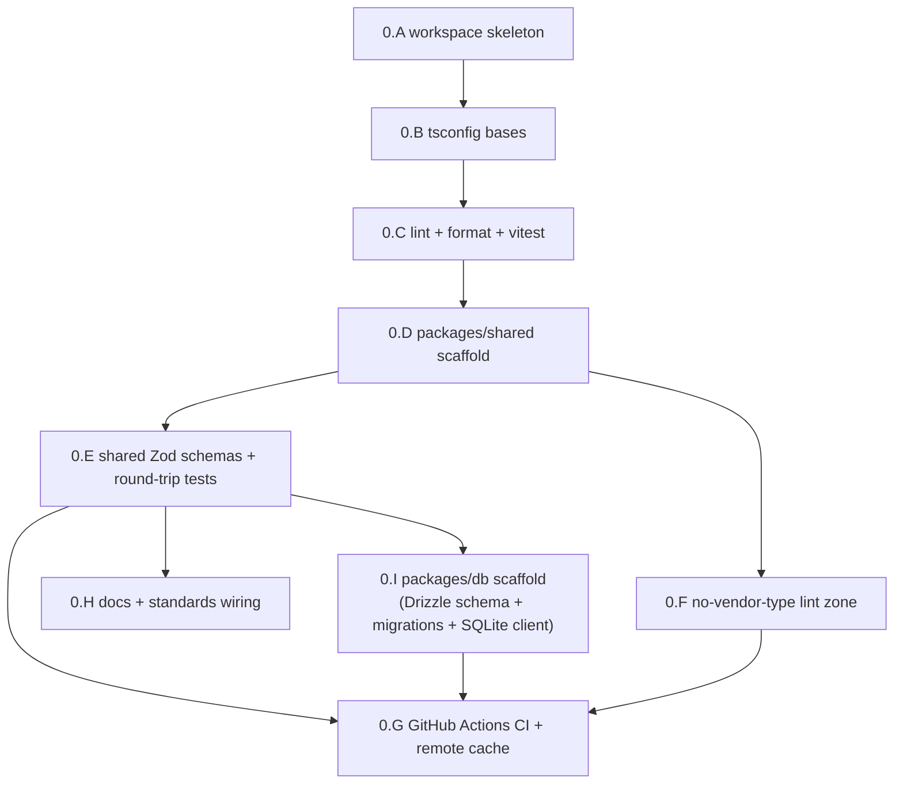

# Phase 0 — Foundations

> Status: Active — this is where the project stands now (Product Phase 1). Achieves global milestone **M0**.

- **Related**: [../README.md](../README.md), [../current.md](../current.md), [phase-1-engine-and-llm.md](phase-1-engine-and-llm.md), [../../project-structure.md](../../project-structure.md), [../../tech-stack.md](../../tech-stack.md), [../../reference/contracts/workflow-yaml-spec.md](../../reference/contracts/workflow-yaml-spec.md), [../../reference/contracts/agent-yaml-spec.md](../../reference/contracts/agent-yaml-spec.md), [../../reference/contracts/sse-event-schema.md](../../reference/contracts/sse-event-schema.md), [../../reference/contracts/config-spec.md](../../reference/contracts/config-spec.md), [../../reference/desktop/database-schema.md](../../reference/desktop/database-schema.md), [../../standards/code-style-typescript.md](../../standards/code-style-typescript.md), [../../standards/testing.md](../../standards/testing.md), [../../decisions/0005-sqlite-drizzle-local-postgres-cloud.md](../../decisions/0005-sqlite-drizzle-local-postgres-cloud.md), [../../decisions/0011-internal-llm-abstraction.md](../../decisions/0011-internal-llm-abstraction.md)

## Goal

Stand up the Turborepo + pnpm monorepo skeleton, land `packages/shared` — the Zod
schemas and inferred types that are the source of truth for every other package —
and wire the tooling/CI/docs spine the whole build order rests on
(**shared → llm → core → CLI → desktop → vscode → cloud**). Getting the shared
schemas right here, driven directly from the frozen reference contracts, is what
prevents breaking changes from rippling across the engine and all four surfaces
later. Phase 0 ships **types and tooling, not features**: when it is green, Phase 1
(the critical path) can start against a stable contract and a working CI gate.

## Outcomes (Definition of Done)

- A clean `pnpm install && pnpm turbo run lint typecheck test` passes from a fresh
  checkout, across every workspace, locally and in CI.
- `@relavium/shared` (`@relavium/shared`) exports the full Zod schema set
  (`WorkflowSchema`, `AgentSchema`, `RunSchema`, `NodeSchema`, `EdgeSchema`,
  the `RunEvent` union, `CostEvent`/`CostUpdatedEvent`, `HumanGateEvent`) plus
  inferred types, with **zero runtime deps except zod**, and round-trips the
  reference example YAML (parse → object → re-serialize) with no schema drift.
- Run-event names match the canonical **colon-namespaced** schema exactly
  (`node:started`, `agent:token`, `cost:updated`, …) with `sequenceNumber` — never
  the legacy dotted names, never `seqNo`.
- The shared `tsconfig` bases (strict mode + `noUncheckedIndexedAccess`,
  `exactOptionalPropertyTypes`, `noImplicitOverride`), one root ESLint/Prettier
  config, and Vitest are in place and govern every package.
- The **no-vendor-type-across-the-LLM-seam** ESLint boundary rule is scaffolded
  and enforced in CI (it has nothing to forbid yet, but the zone fence is wired so
  Phase 1's first adapter import is policed from line one).
- `@relavium/db` is scaffolded: the Drizzle schema for the
  [database-schema.md](../../reference/desktop/database-schema.md) table set, a
  `drizzle-kit` migration set, and a local SQLite client that opens a fresh DB and runs
  every migration in a smoke test — built but not yet wired into a running engine.
- GitHub Actions CI runs lint + typecheck + test on every push/PR with Turborepo
  remote cache; the binding TypeScript and testing standards are committed and
  linked from the standards index.

## Scope

### In scope

- **Monorepo skeleton** — root `package.json` (tooling only), `pnpm-workspace.yaml`,
  `turbo.json`, `.npmrc`, Node/pnpm version pins, and the `apps/` + `packages/`
  directory layout matching [../../project-structure.md](../../project-structure.md).
- **Shared tooling config** — `tsconfig.base.json` + per-target bases, a single root
  ESLint flat config, Prettier, and a root Vitest config, per
  [../../tech-stack.md](../../tech-stack.md) and
  [../../standards/code-style-typescript.md](../../standards/code-style-typescript.md).
- **`packages/shared` (`@relavium/shared`)** — the Zod schemas and inferred types
  implementing the canonical contracts in
  [../../reference/contracts/](../../reference/contracts/README.md): workflow/agent
  YAML, the run-event union, and config. No runtime deps except zod.
- **`packages/db` (`@relavium/db`) scaffold** — the Drizzle schema + migrations + the
  local SQLite client, encoding the [database-schema.md](../../reference/desktop/database-schema.md)
  table set so the **single Drizzle schema, two dialects** invariant has an owner
  before its consumers arrive: Phase 1's engine checkpoint/resume and Phase 2's CLI run
  history both depend on it, and Phase 3 desktop reuses the same package
  ([ADR-0005](../../decisions/0005-sqlite-drizzle-local-postgres-cloud.md)).
- **The no-vendor-type lint rule scaffold** — the import-zone fence from
  [../../standards/code-style-typescript.md](../../standards/code-style-typescript.md#module-boundaries--no-vendor-type-across-the-llm-seam),
  wired now so it is live before Phase 1.
- **CI pipeline** — GitHub Actions: lint, typecheck, and test every workspace, with
  Turborepo remote cache.
- **Docs/CI wiring** — the docs tree ships in-repo with resolving relative links;
  the binding TypeScript ([../../standards/code-style-typescript.md](../../standards/code-style-typescript.md))
  and testing ([../../standards/testing.md](../../standards/testing.md)) standards
  are committed and linked from [../../standards/README.md](../../standards/README.md).

### Explicitly out of scope

- Any engine logic (`packages/core`), provider adapters (`packages/llm`), or UI
  (`packages/ui`) — Phase 1 and later. (`packages/db` is **scaffolded** here — schema +
  migrations + the SQLite client — but is **not wired into a running engine**; that
  consumption is Phase 1/2.)
- Any surface code (`apps/*`).
- Runtime behavior beyond schema validation — Phase 0 ships types and tooling.
- The per-provider conformance suite, fixtures, and the nightly live-API CI lane —
  those land with the adapters in Phase 1; only the CI scaffolding they slot into is
  created here.
- Over-scaffolding later packages: only `packages/shared` and `packages/db` are built
  out now (both have Phase-1/2 consumers); other packages/apps are created as minimal
  placeholders (or not at all) until their phase.

## Work breakdown

Ordered workstreams. **0.A → 0.B → 0.C → 0.D** are sequential (each needs the prior);
**0.E** (schemas) depends on 0.C and 0.D; **0.F** (lint scaffold) and **0.G** (CI)
fold in after 0.D and gate on 0.E; **0.I** (`packages/db` scaffold) depends on 0.E
(its schema mirrors the shared types) and feeds CI like the rest. The critical-path
items for this phase are **0.C, 0.D, 0.E** (they feed M0 and unblock Phase 1); 0.I is
off the critical path but lands in Phase 0 so `@relavium/db` has an owner before its
Phase-1/2 consumers arrive.

### 0.A — Turborepo + pnpm workspace skeleton

> **✅ Done** — landed in PR #1 (merged 2026-06-04).

Create the empty-but-correct monorepo so every later package has a home and a
consistent toolchain. Tooling-only at the root; no app/package logic yet.

**Tasks:**

- Initialize the repo against `github.com/HodeTech/Relavium` with a root
  `package.json` marked `"private": true` and `"packageManager": "pnpm@<pinned>"`;
  pin Node via `.nvmrc`/`engines` and pnpm via `packageManager` + `.npmrc`
  (`auto-install-peers`, `strict-peer-dependencies`).
- Add `pnpm-workspace.yaml` declaring `packages/*` and `apps/*`.
- Add `turbo.json` with a `pipeline` for `build`, `lint`, `typecheck`, and `test`,
  declaring `dependsOn: ["^build"]` where needed and `outputs` for cacheable tasks.
- Create the directory skeleton from [../../project-structure.md](../../project-structure.md):
  `packages/{shared,llm,core,db,ui}` and `apps/{desktop,vscode-extension,cli}`.
  Build out **`packages/shared`** (0.D/0.E) and **`packages/db`** (0.I) now; leave the
  rest as minimal placeholders (a `package.json` + `README.md` stub) or omit until their
  phase, per the no-over-scaffolding rule.
- Add a root `.gitignore` (node_modules, `dist`, `.turbo`, coverage, `*.local`).

**Acceptance:** `pnpm install` succeeds from a clean checkout; `pnpm turbo run build`
runs (a no-op across placeholders is fine) with the workspace graph resolving and no
peer-dep errors.

### 0.B — Shared `tsconfig` bases

> **✅ Done** — landed in PR #1 (merged 2026-06-04). Base is **`NodeNext`** so ESM
> relative imports must carry explicit `.js` extensions (Vite surfaces override to
> `bundler` at their phase).

One strict TypeScript base every package extends, so strictness can never silently
drift per package ([../../standards/code-style-typescript.md](../../standards/code-style-typescript.md#strictness)).

**Tasks:**

- Add a root `tsconfig.base.json` with `strict: true`, `noUncheckedIndexedAccess`,
  `exactOptionalPropertyTypes`, `noImplicitOverride`, `verbatimModuleSyntax`,
  `isolatedModules`, `moduleResolution: "bundler"`, `target`/`lib` pinned, and
  `skipLibCheck` only where justified.
- Add thin target bases as needed (e.g. a library base for `packages/*`) that
  `extends` the root and set `composite`/project-reference fields for Turbo caching.
- Give `packages/shared` a `tsconfig.json` that extends the base and emits declaration
  files; expose a curated `index.ts` entry (no `export *` of internals).
- Forbid loosening: a package that relaxes a strict flag needs a justification comment
  and review — capture this expectation in the package README.

**Acceptance:** `pnpm turbo run typecheck` is green; deleting a strict flag in a
package produces a real type error somewhere (the strictness is load-bearing, not
cosmetic).

### 0.C — ESLint + Prettier + Vitest (root, shared)

> **✅ Done** — landed in PR #1 (merged 2026-06-04). `format:check` runs as a turbo
> root task; a `coverage` script wires V8 branch coverage; dev-tool versions are a
> single-source pnpm `catalog`.

Configure formatting, linting, and the test runner **once** at the root and share
them across every package — Prettier owns formatting, ESLint owns correctness.

**Tasks:**

- Add a single root **ESLint flat config** with `@typescript-eslint`, `no-explicit-any`
  as an **error**, `no-floating-promises`, and the import-boundary plugin used by 0.F;
  no per-package config without a justified override.
- Add a root Prettier config and `.prettierignore`; wire `format` / `format:check`
  scripts. Formatting is not argued in review — it is run.
- Add a root **Vitest** config (workspace-aware) plus a `test` script; enable V8/istanbul
  coverage with branch coverage reported (the ≥ 90% engine target is enforced from
  Phase 1, but the harness exists now per
  [../../standards/testing.md](../../standards/testing.md)).
- Wire `lint`, `typecheck`, `test`, `format:check` into `turbo.json` so they run per
  workspace and cache.

**Acceptance:** `pnpm turbo run lint typecheck test` is green on the scaffolded repo;
introducing an `any` or a floating promise fails lint locally and would fail CI.

### 0.D — `packages/shared` package scaffold

> **✅ Done** — `@relavium/shared` ships `zod` (catalog, the sole runtime dep) and a
> `src/` laid out by contract (`constants`, `common`, `node`, `edge`, `agent`,
> `workflow`, `run-event`, `run`, `config`, curated `index`).

Create the `@relavium/shared` package shell — the first real, fully built-out
package and the dependency root of the whole graph.

**Tasks:**

- Add `packages/shared/package.json` named `@relavium/shared`, `"type": "module"`,
  `zod` as the **only** runtime dependency, with `main`/`types`/`exports` pointing at
  the built entry and a curated `src/index.ts`.
- Lay out `src/` by contract: `workflow.ts`, `agent.ts`, `run-event.ts`, `config.ts`,
  `node.ts`, `edge.ts`, plus a `constants.ts` (canonical event-name literals,
  `SCHEMA_VERSION = '1.0'`) and a `index.ts` that re-exports the public surface only.
- Confirm the package builds and is importable by a throwaway workspace consumer
  (resolution + types), then remove the throwaway.

**Acceptance:** `@relavium/shared` builds, type-checks, and is importable from another
workspace package with full types; its only runtime dependency is `zod`.

### 0.E — Shared Zod schemas + round-trip tests

> **✅ Done** — `WorkflowSchema`, `AgentSchema`, `NodeSchema`, `EdgeSchema`, the 13-variant
> colon-namespaced `RunEvent` union (+ `CostUpdatedEvent`, gate events, `GateDecision`),
> `RunSchema`, and the config schemas, with inferred types. **114 tests** cover accept +
> reject per schema, the canonical reference workflow/agent round-trip with no drift, and
> a type-level + runtime pin of the event names and the `cost:updated` payload.
> The reference example is round-tripped as a parsed **object** (YAML→object parsing is
> `@relavium/core`'s job, Phase 1), so shared's only runtime dep stays `zod`.

The heart of the phase: encode the frozen reference contracts as Zod schemas and
prove they round-trip the canonical example YAML with zero drift. **Critical path.**

**Tasks:**

- **`WorkflowSchema`** per [../../reference/contracts/workflow-yaml-spec.md](../../reference/contracts/workflow-yaml-spec.md):
  top-level `schema_version: '1.0'`, `workflow.{id,version,name,description,tags}`,
  `trigger`, `inputs[]`, `context[]`, `agents[]`, `nodes[]`, `edges[]`. Model the
  node-type discriminated union (`input`, `agent`, `human_gate`, `condition`,
  `transform`, `parallel`, `merge`, `output`) and the `nodeId:handle` edge form.
- **`AgentSchema`** per [../../reference/contracts/agent-yaml-spec.md](../../reference/contracts/agent-yaml-spec.md):
  `id/name/description`, `model`, `provider`, `system_prompt`, `temperature?`,
  `max_tokens?`, `tools[]`, `mcp_servers[]`, `memory`, `retry`, and the ordered
  `fallback_chain[]`. **No `any`**; secrets are never schema-representable.
- **`NodeSchema` / `EdgeSchema`** as the composable building blocks `WorkflowSchema`
  references (kept exportable for the engine and UI).
- **`RunEvent` union + `RunSchema`** per
  [../../reference/contracts/sse-event-schema.md](../../reference/contracts/sse-event-schema.md):
  the `BaseEvent` envelope (`type`, `runId`, `timestamp`, `sequenceNumber`) and every
  variant by its **colon-namespaced** name. Include `CostUpdatedEvent`
  (`inputTokens`, `outputTokens`, `costMicrocents`, `cumulativeCostMicrocents`) and the
  human-gate paused/resumed events + `GateDecision`. Export the inferred TS types.
- **Config schemas** per [../../reference/contracts/config-spec.md](../../reference/contracts/config-spec.md)
  for the `config.toml` / `project.toml` / `workspace.toml` key sets (validation only;
  no file IO here).
- Tests (Vitest, beside the code): for each schema assert **both** accept and reject
  cases (a schema that never rejects is untested); a **round-trip** test parsing the
  complete reference workflow example and the example agent YAML (parse → object →
  re-serialize → re-parse) with deep-equality, asserting no drift; a **type-level +
  runtime** test pinning the `RunEvent` names and the `cost:updated` payload shape so
  any rename or legacy dotted name is a red test.

**Acceptance:** all schema tests pass; the canonical reference workflow/agent YAML
round-trip with no drift; a deliberately malformed fixture is rejected with a useful
error; the run-event names and `cost:updated` payload are pinned by test. This
achieves the schema half of **M0**.

### 0.F — No-vendor-type-across-the-seam lint zone (scaffold)

Wire the import-zone fence from the in-house LLM decision now, so Phase 1's first
adapter import is policed from line one. The rule has nothing to forbid yet — that is
the point: the fence exists before the wall.

**Tasks:**

- Add an ESLint boundary rule (`no-restricted-imports` zones or an import-zones plugin)
  that forbids importing any provider SDK (`@anthropic-ai/sdk`, `openai`,
  `@google/genai`) **outside** `packages/llm/src/adapters/*`, per
  [../../standards/code-style-typescript.md](../../standards/code-style-typescript.md#module-boundaries--no-vendor-type-across-the-llm-seam)
  and [../../decisions/0011-internal-llm-abstraction.md](../../decisions/0011-internal-llm-abstraction.md).
- Add the matching cross-package rule: `packages/core` and every surface may depend on
  `@relavium/shared` / seam types only, never on a vendor package.
- Add a tiny CI smoke fixture (a quarantined file that imports a vendor SDK from a
  forbidden zone) asserting the rule **fails** — proving the fence is live, not inert —
  and keep it excluded from the build.

**Acceptance:** lint passes on the real tree; the quarantined forbidden-import fixture
makes lint fail, demonstrating the zone is enforced. Documented as the guardrail
Phase 1 inherits.

### 0.G — GitHub Actions CI + Turborepo remote cache

The green gate every PR must pass. Lint, typecheck, and test every workspace, fast and
deterministically, with remote caching.

**Tasks:**

- Add a `ci.yml` workflow on push + PR: checkout, setup-node with the pinned version,
  pnpm install with a frozen lockfile (`--frozen-lockfile`), then
  `pnpm turbo run lint typecheck test` as the **required** check.
- Configure Turborepo remote cache (token + team via CI secrets) so unchanged
  workspaces are cache hits; verify a warm run is materially faster than a cold one.
- Reserve (not implement) the slots Phase 1 fills: a fixture-mode conformance job on
  PR and a **nightly** live-API lane (`schedule:`) using keys from CI secrets —
  documented as TODO anchors so the testing standard maps cleanly onto CI lanes.
- Add a branch-protection note: the lint/typecheck/test check is required to merge.

**Acceptance:** CI is green on push; a deliberately failing lint/type/test turns the
required check red and blocks merge; remote cache produces a cache hit on a no-change
re-run. This achieves the CI half of **M0**.

### 0.H — Docs and standards wiring

Make the docs tree ship in-repo with resolving links and the binding standards in
force, so Phase 1 inherits born-compliant docs and a governed CI.

**Tasks:**

- Ensure the `docs/` tree is committed in-repo and relative links resolve on GitHub
  (no absolute internal URLs), per
  [../../standards/documentation-style.md](../../standards/documentation-style.md).
- Confirm [../../standards/code-style-typescript.md](../../standards/code-style-typescript.md)
  and [../../standards/testing.md](../../standards/testing.md) are committed and linked
  from [../../standards/README.md](../../standards/README.md), and that CI enforces them.
- Update [../current.md](../current.md) when 0.A–0.G land so it reflects the
  scaffolded-repo state and points Phase 1 at the proven contract.

**Acceptance:** the docs tree builds/links cleanly in-repo; the TypeScript and testing
standards govern the CI gate; `current.md` reflects the post-Phase-0 state.

### 0.I — `packages/db` (`@relavium/db`) scaffold

Stand up the database package — the Drizzle schema, the migration set, and the local
SQLite client — so the **single Drizzle schema, two dialects** invariant
([ADR-0005](../../decisions/0005-sqlite-drizzle-local-postgres-cloud.md)) has an owner
before Phase 1's engine checkpoint/resume, Phase 2's CLI run history, and Phase 3's
desktop all consume it. No build phase otherwise owns this package, yet three do depend
on it — so it is scaffolded here. Schema only; no engine wiring (that is Phase 1/2).

**Tasks:**

- Add `packages/db/package.json` named `@relavium/db`, `"type": "module"`, depending on
  `@relavium/shared` (for the canonical types it persists), `drizzle-orm`, and
  `drizzle-kit`; expose a curated `src/index.ts` (schema, client factory, migration
  runner — no `export *` of internals).
- Author the **Drizzle schema** for the Phase-1 local table set from
  [../../reference/desktop/database-schema.md](../../reference/desktop/database-schema.md)
  (`llm_providers`, `model_catalog`, `agents`, `workflows`, `runs`, `step_executions`,
  `messages`, `run_events`, `run_costs`), honoring the SQLite conventions there
  (`TEXT` UUIDs, JSON `TEXT`, epoch-ms `INTEGER`, **integer micro-cents** for money,
  `CHECK`-string enums) and keeping the table/column names dialect-identical for the
  Phase-2 Postgres port.
- Generate the initial **`drizzle-kit` migration set** and provide a **SQLite client
  factory** (`PRAGMA journal_mode = WAL`, `PRAGMA foreign_keys = ON`) plus a migration
  runner the surfaces call on first use.
- Add a Vitest smoke test: open a fresh in-memory/temp SQLite DB, run every migration,
  and assert the expected tables/indexes exist and a round-trip insert/select on `runs`
  + `run_events` works — schema correctness only, no engine.

**Acceptance:** `@relavium/db` builds and type-checks, depending only on
`@relavium/shared` + Drizzle; `drizzle-kit` migrations apply cleanly to a fresh SQLite
file via the client factory; the smoke test creates every Phase-1 table and round-trips
a row; no engine or surface code is required to exercise it.

## Milestones

In-phase milestones map to the workstreams that complete them. **0.M3** is the global
spine milestone **M0** for this phase.

| In-phase milestone | Means | Completed by |
|--------------------|-------|--------------|
| **0.M1 — Toolchain green ✅** | `pnpm install` + `turbo run lint typecheck test` pass on the empty scaffold | 0.A, 0.B, 0.C *(done, PR #1)* |
| **0.M2 — Schemas round-trip ✅** | `@relavium/shared` exports the full schema set and round-trips the reference example with no drift; run-event names pinned | 0.D, 0.E *(done)* |
| 0.M3 — **M0: Foundations green** | CI green on push with remote cache; the seam lint fence and the standards are enforced; docs wired; `@relavium/db` scaffolded (schema + migrations + SQLite client) | 0.F, 0.G, 0.H, 0.I |

## Dependencies

- **Upstream phases:** none — this is build-order step 1.
- **Required input artifacts/contracts (already frozen):**
  - [../../project-structure.md](../../project-structure.md) — the workspace layout
    and package boundaries.
  - [../../tech-stack.md](../../tech-stack.md) — the pinned toolchain
    (Turborepo + pnpm, Vitest, Zod, strict TS).
  - The reference contracts that the schemas encode:
    [workflow-yaml-spec.md](../../reference/contracts/workflow-yaml-spec.md),
    [agent-yaml-spec.md](../../reference/contracts/agent-yaml-spec.md),
    [sse-event-schema.md](../../reference/contracts/sse-event-schema.md),
    [config-spec.md](../../reference/contracts/config-spec.md).
  - The binding standards: [code-style-typescript.md](../../standards/code-style-typescript.md)
    (strictness + the seam rule), [testing.md](../../standards/testing.md),
    [documentation-style.md](../../standards/documentation-style.md).
  - [../../decisions/0011-internal-llm-abstraction.md](../../decisions/0011-internal-llm-abstraction.md)
    — the source of the no-vendor-type-across-the-seam fence scaffolded in 0.F.
  - [../../reference/desktop/database-schema.md](../../reference/desktop/database-schema.md)
    and [../../decisions/0005-sqlite-drizzle-local-postgres-cloud.md](../../decisions/0005-sqlite-drizzle-local-postgres-cloud.md)
    — the table set and the single-schema/two-dialects decision the `packages/db`
    scaffold (0.I) encodes.

## Exit criteria (go / no-go)

All must be true to start [Phase 1 — engine and LLM](phase-1-engine-and-llm.md):

1. `pnpm install` succeeds from a clean checkout, and
   `pnpm turbo run lint typecheck test` is **green across all workspaces in CI**,
   with the Turborepo remote cache configured and demonstrably hitting on a no-change
   re-run.
2. `@relavium/shared` exports the full schema set and **round-trips the reference
   example YAML** (parse → object → re-serialize) in Vitest with no schema drift from
   [../../reference/contracts/](../../reference/contracts/README.md), and each schema
   has both accept and reject tests.
3. Run-event types match the canonical **colon-namespaced** schema exactly
   (`sequenceNumber`, `cost:updated` payload shape) — verified by a type-level **and**
   runtime test; no legacy dotted names, no `seqNo`.
4. The shared strict `tsconfig` base governs every package, no package loosens it
   without a justified comment, and `tsc` is error-clean with no `@ts-ignore`.
5. The no-vendor-type-across-the-seam lint zone is **live** — proven by a quarantined
   forbidden-import fixture that makes lint fail.
6. The binding TypeScript and testing standards are committed, linked from the
   standards index, and enforced by the CI gate.
7. `@relavium/db` is **scaffolded** — the Drizzle schema for the Phase-1 local table
   set, a `drizzle-kit` migration set, and a SQLite client factory — and a Vitest smoke
   test applies every migration to a fresh DB and round-trips a row; it depends only on
   `@relavium/shared` + Drizzle and is not yet wired into a running engine (0.I).

## Risks & mitigations

| Risk | Impact | Mitigation |
|------|--------|------------|
| **Schema churn later.** Under-specified `packages/shared` breaks every downstream package and users' committed YAML. | High — ripples across engine + 4 surfaces + git-native files | Drive schemas directly from the frozen reference contracts (0.E); treat any later change as a versioned, deliberate `schema_version` event with a migration path. |
| **Tooling drift across workspaces.** Divergent ESLint/tsconfig per package causes friction and silent strictness loss. | Medium | Single root config with shared bases (0.B, 0.C); no per-package override without a justified comment + review. |
| **Over-scaffolding.** Empty app/package shells with config that rots before they are built. | Low–Medium | Build out only `packages/shared` (0.D/0.E) and `packages/db` (0.I) now — both have Phase-1/2 consumers; other packages stay minimal placeholders until their phase (0.A). |
| **Seam fence inert.** A lint rule that silently matches nothing gives false confidence before Phase 1 adds adapters. | Medium | A quarantined forbidden-import fixture asserts the rule actively fails (0.F). |
| **CI cache misconfiguration.** Remote cache silently disabled makes CI slow and masks cache-key bugs. | Low | Verify a warm vs cold run timing delta and a cache-hit log line as part of 0.G acceptance. |
| **Legacy event-name regressions.** Dotted names (`node.started`, `seqNo`) creeping back in from older drafts. | Medium | A type-level + runtime test pins the colon-namespaced names and `sequenceNumber` (0.E); naming rule enforced by the code-style standard. |
