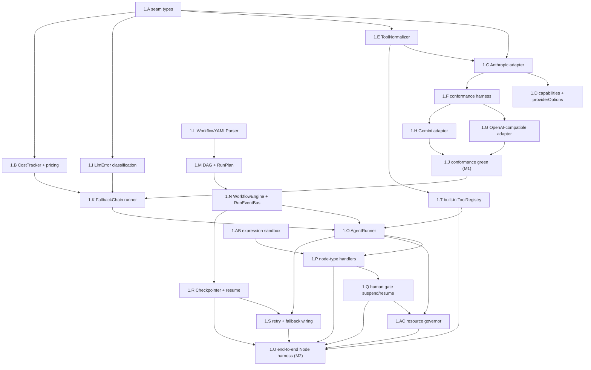
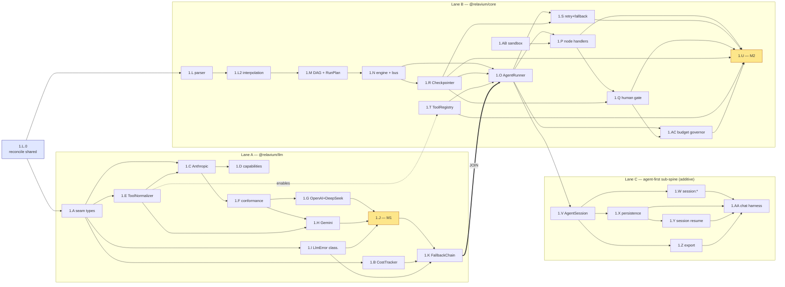
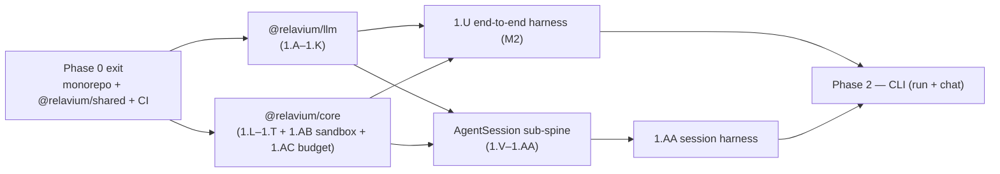

# Phase 1 — Engine and LLM

> Status: In progress — the critical path (Product Phase 1). Wave 0 (**1.L.0**) landed in
> **PR #6**; the Wave-1 seam trio — **1.A** (types), **1.B** (CostTracker), **1.E** (ToolNormalizer)
> — landed in **PR #7**; the first **adapter lane — 1.C** (`AnthropicAdapter`), **1.I** (`LlmError`),
> **1.F** (conformance harness), **1.D** (capabilities + `providerOptions`) — landed in **PR #8**
> (2026-06-06). The remaining adapters **1.G** (OpenAI/DeepSeek) ‖ **1.H** (Gemini), bundled with the
> **seam-shape amendment [ADR-0030](../../decisions/0030-llm-seam-shape-amendment-reasoning-response-format-provider-executed.md)**
> (reasoning channel + `responseFormat` + `providerExecuted`), and **1.J** (conformance green) landed
> in **PR #9** (2026-06-07) — **🎯 M1 (LLM seam proven) is reached.** All three adapters pass one shared
> conformance suite in fixture mode (live-nightly lane reserved/pending keys); no vendor type crosses the
> seam. **1.K (FallbackChain) is ✅ Done (PR #13, 2026-06-11)** — the seam's last policy layer, with the
> ADR-0030 strip-on-failover obligation honoured; **1.m2 (policy layers) is complete** (with the
> CostTracker, 1.B). **1.L ✅ Done (PR #14, 2026-06-12)** — `@relavium/core` is scaffolded with the
> `WorkflowYAMLParser` — and **1.L2 ✅ Done (PR #15, 2026-06-12)** — the `{{ … }}` interpolation engine
> (runtime resolver + pipe-filter registry) plus the parse-time transitive secret-taint gate
> (ADR-0029(c)). **1.M (DAG builder + `RunPlan`) and 1.AB (the QuickJS-wasm expression sandbox) are
> ✅ Done (PR #16, 2026-06-13)** — the plan layer and the deterministic `condition`/`transform`/`merge_fn`
> evaluator. **1.N (`WorkflowEngine` + `RunEventBus`) and 1.T (built-in `ToolRegistry`) are ✅ Done
> (PR #17, 2026-06-13)**, completing **1.m3** (parse → DAG → run loop emits the canonical event stream).
> With 1.K, 1.N, and 1.T all landed, the engine lane converges at the **1.O `AgentRunner` join** — now
> fully unblocked — toward **M2**. *(Session persistence, 1.X/1.Z, must exclude the reasoning signature
> — non-persisting.)*
>
> **Multimodal I/O decided (2026-06-08).** First-class image/audio/video I/O (input **and** output) is a
> second pre-freeze seam amendment in the ADR-0030 mould — [ADR-0031](../../decisions/0031-llm-seam-shape-amendment-multimodal-io.md)
> (seam) + [ADR-0032](../../decisions/0032-desktop-rust-media-de-inline-amends-0018.md) (desktop Rust
> de-inline), designed in [multimodal-io-design-2026-06-07.md](../../analysis/multimodal-io-design-2026-06-07.md).
> The new sub-spine **1.AD–1.AH** (1.m6) lands the **shape (1.AD) before the exhaustive consumers 1.K/1.O**
> so the `ContentPart`/`StreamChunk` media union members are non-breaking; the **behavior (1.AE–1.AH) is
> additive and does NOT gate M2** (it threads into the engine and Phases 2–6, like the agent-first sub-spine).
> **1.AD is ✅ Done (PR #11, 2026-06-10)** — the shape landed with all-false adapter matrices and the
> fail-fast media guard; it unblocked 1.K, now also ✅ Done (PR #13).

- **Related**: [../README.md](../README.md), [phase-0-foundations.md](phase-0-foundations.md), [phase-2-cli.md](phase-2-cli.md), [../../architecture/shared-core-engine.md](../../architecture/shared-core-engine.md), [../../architecture/execution-model.md](../../architecture/execution-model.md), [../../architecture/multi-llm-providers.md](../../architecture/multi-llm-providers.md), [../../reference/shared-core/llm-provider-seam.md](../../reference/shared-core/llm-provider-seam.md), [../../reference/shared-core/node-types.md](../../reference/shared-core/node-types.md), [../../reference/shared-core/built-in-tools.md](../../reference/shared-core/built-in-tools.md), [../../reference/contracts/sse-event-schema.md](../../reference/contracts/sse-event-schema.md), [../../standards/testing.md](../../standards/testing.md), [../../standards/error-handling.md](../../standards/error-handling.md), [../../decisions/0011-internal-llm-abstraction.md](../../decisions/0011-internal-llm-abstraction.md)

## Goal

Build the two packages every surface depends on: **`@relavium/llm`** (the
provider-agnostic `LLMProvider` seam, the per-provider adapters, the fallback
runner, and cost tracking) and **`@relavium/core`** (YAML→DAG parsing, the
execution runner with a `RunEventBus`, checkpoint/resume, and retry+fallback
wiring). This is the **critical path** — no surface code (`apps/*`) begins until
the engine is proven end-to-end from a Node test harness, with streaming,
checkpoint/resume, retry, and provider failover all demonstrated.

## Outcomes (Definition of Done)

- `@relavium/llm` exports the frozen `LLMProvider` seam (Relavium/Zod types only),
  three adapters (Anthropic, OpenAI-compatible serving OpenAI+DeepSeek, Gemini),
  a `FallbackChain` runner, and a `CostTracker` — all passing one shared
  conformance suite in fixture mode on PR.
- No vendor SDK type appears in any exported `@relavium/llm` or `@relavium/core`
  type, enforced by the import-zone lint rule (M1 invariant).
- `@relavium/core` parses a `.relavium.yaml` into a validated DAG, walks it
  (sequential, parallel fan-out/fan-in, condition, human gate), emits the
  canonical colon-namespaced run events with monotonic `sequenceNumber`,
  checkpoints each node boundary, and resumes from a checkpoint.
- A Node harness runs a 3-node workflow end-to-end with live streaming,
  checkpoint/resume, node retry, and provider failover, with cost recorded
  correctly per attempt (**M2**, the critical-path milestone).
- `condition` / `transform` / `merge_fn` evaluate in the **deterministic, resource-capped
  QuickJS-wasm sandbox** (no ambient globals, no wall-clock/RNG; [ADR-0027](../../decisions/0027-expression-sandbox.md)),
  and the **pre-egress budget governor** ([ADR-0028](../../decisions/0028-workflow-resource-governance.md))
  caps cost before each LLM call — both proven by their own unit tests plus dedicated harness scenarios (1.AB, 1.AC).
- The **agent-first sub-spine** is implemented and **proven by its own Node harness (1.AA)**: a
  multi-turn `AgentSession` with a tool round-trip, a `session:*` event stream, persistence + resume,
  and export-to-workflow ([ADR-0024](../../decisions/0024-agent-first-entry-point-agentsession.md),
  [ADR-0026](../../decisions/0026-session-export-to-workflow.md)). Additive and parallel — it does not
  gate **M2**, but it is a Phase-1 deliverable that the Phase-2 `relavium chat` surface builds on.
- Both packages have zero platform-specific imports and meet the engine coverage
  bar (≥ 90% line **and** branch) from [testing.md](../../standards/testing.md).

## Scope

### In scope

**`@relavium/llm`** — Relavium's own multi-LLM abstraction, per
[ADR-0011](../../decisions/0011-internal-llm-abstraction.md) and
[multi-llm-providers.md](../../architecture/multi-llm-providers.md):

- The single provider-agnostic **`LLMProvider` seam** (`id` + `generate(req, key)`
  + `stream(req, key)` + `supports`), expressed only in Relavium/Zod types.
  `LlmRequest` in; `LlmResult` or a discriminated-union `StreamChunk` stream out;
  a normalized `Usage` and classified `LlmError`. Canonical home:
  [llm-provider-seam.md](../../reference/shared-core/llm-provider-seam.md).
  **No vendor SDK type ever crosses this seam.**
- Three thin hand-rolled adapters over the official TS SDKs: `AnthropicAdapter`
  (`@anthropic-ai/sdk`), one OpenAI-compatible adapter (the `openai` SDK) serving
  OpenAI **and** DeepSeek (DeepSeek via custom `baseURL`), and `GeminiAdapter`
  (`@google/genai`). Adapters stay dumb: normalization of system-prompt placement,
  tool schemas, tool-call round-trips, streaming chunks, stop reasons, and usage
  happens in our adapter code.
- A **`FallbackChain` runner outside the adapters** (policy, not adapter logic)
  and a `CostTracker` recording usage as integer **micro-cents** consistent with
  [database-schema.md](../../reference/desktop/database-schema.md).
- A capability-gated common-path surface (text + tools + streaming + usage, plus the
  canonical reasoning and media shapes — ADR-0030/0031) and a typed `providerOptions`
  escape hatch for provider-specific features with no cross-provider shape (prompt-cache
  control, thinking budgets, safety settings, parallel-tool-call toggles).
- Cancellation via `AbortSignal`, working in both Node and the Tauri WebView fetch.
- A per-provider **conformance suite**: recorded fixtures on PR, live provider APIs
  nightly in CI ([testing.md](../../standards/testing.md)).

**`@relavium/core`** — the shared engine, per
[shared-core-engine.md](../../architecture/shared-core-engine.md) and
[execution-model.md](../../architecture/execution-model.md):

- `WorkflowYAMLParser` — parse and validate `.relavium.yaml` into a DAG (against
  `@relavium/shared` schemas), with cycle detection and field-named validation
  errors.
- `WorkflowEngine` + `AgentRunner` — DAG execution over the node types in
  [node-types.md](../../reference/shared-core/node-types.md), emitting the canonical
  colon-namespaced run events through a `RunEventBus`.
- Checkpoint/resume and node-level retry, with the fallback chain wired to
  `@relavium/llm`.
- A `ToolRegistry` (engine-side dispatch in `@relavium/core`) plus the `ToolNormalizer`
  (in `@relavium/llm`, behind the seam) for built-in tools
  ([built-in-tools.md](../../reference/shared-core/built-in-tools.md)) and a clean
  execution-mode interface so the same engine runs local (Phase 1) and cloud
  (Product Phase 2) unchanged.
- **Zero platform-specific imports** — runs identically in Node, the Tauri
  WebView, the VS Code extension host, and (later) the cloud worker.

### Explicitly out of scope

- Any surface (`apps/*`) — the engine is exercised only via a Node test harness
  this phase.
- The durable DB layer (`packages/db`) beyond the in-memory/SQLite-shaped
  `Checkpointer` interface the engine defines; real SQLite persistence is wired by
  the CLI/desktop phases.
- HTTP SSE transport (cloud) — Phase 1 emits events in-process via the
  `RunEventBus`; SSE is Product Phase 2.
- Ollama / local models — API-based providers only (Anthropic, OpenAI, Gemini,
  DeepSeek).
- The orchestrator-as-router node beyond the `invoke_agent` tool plumbing the
  built-in tool normalizer needs; the full LLM-router selection logic is a later
  enhancement and not gated by this phase.

## Work breakdown

The order is engine-correctness-first: build and freeze the seam, prove it with
one adapter and the conformance harness, fan out to the remaining adapters, add
the policy layers (fallback, cost), then build the engine bottom-up (parser → DAG
→ runner → checkpoint → retry/fallback wiring → tools) and finish with the
end-to-end Node harness. IDs are the stable workstream handles used by the global
spine and the critical path.

### 1.A — `LLMProvider` seam types (freeze the contract) — ✅ **Done (PR #7)**

Define the immovable seam in `packages/llm/src/types.ts` exactly as
[llm-provider-seam.md](../../reference/shared-core/llm-provider-seam.md) specifies.
Everything else in the package implements this; it is frozen first so adapters and
the runner build against a stable shape.

**Tasks:**
- Declare the Relavium/Zod types: `LlmRequest` (model, `system`, `messages`,
  `tools`, `toolChoice`, `temperature?`, `maxTokens?`, `stopSequences?`, `signal?`,
  `providerOptions?`), `LlmMessage`, `ContentPart` (`text` | `tool_call` |
  `tool_result`), `ToolDef` (`JSONSchema7`), `LlmResult`, `StopReason` (5-value
  enum), `Usage`, the `StreamChunk` discriminated union, `CapabilityFlags`, and the
  `LlmProvider` interface.
- Add `LlmError` as a typed, discriminated error (`kind`/`code`, `retryable`,
  structured context: provider id, attempt, status) per
  [error-handling.md](../../standards/error-handling.md). No vendor error shape may
  escape the adapter.
- Confirm the import-zone ESLint rule from
  [code-style-typescript.md](../../standards/code-style-typescript.md#module-boundaries--no-vendor-type-across-the-llm-seam)
  restricts provider SDK imports to `packages/llm/src/adapters/*`.
- Re-export the run-event-relevant types from `@relavium/shared` rather than
  redefining (single canonical home).

**Acceptance:** the seam compiles, has unit tests for the Zod accept/reject cases,
and a type-level test proves no exported type references a vendor SDK type; the
import-zone lint rule fails a deliberate violating import in CI.

### 1.B — `CostTracker` + the model-pricing table — ✅ **Done (PR #7)**

The cost computation Relavium owns, keyed on the canonical model id — never read
from a provider field.

**Tasks:**
- Build the canonical price table **and** the canonical-id ↔ provider-native-id mapping in
  **`packages/llm/src/pricing.ts`** — the in-code source the adapters (1.C/1.G/1.H) and this tracker
  share — keyed on canonical model id (input/output per-token, plus cache-read **and cache-write**
  where the provider exposes it), verified against each provider's pricing page and **seeded into** the
  `model_catalog` table ([database-schema.md](../../reference/desktop/database-schema.md)) for UI display.
  (`model_catalog` ships empty; `pricing.ts` is the source of truth.)
- Implement `CostTracker.cost(modelId, usage) -> costMicrocents` and the accumulator that
  produces `{ inputTokens, outputTokens, costMicrocents, cumulativeCostMicrocents }` for the
  `cost:updated` event ([sse-event-schema.md](../../reference/contracts/sse-event-schema.md)).
- Store/aggregate as integer **micro-cents** to avoid float drift; expose a single
  conversion point to `costMicrocents`.
- Surface **per-attempt** usage so cost stays accurate across a failover (consumed
  by 1.K).

**Acceptance:** unit tests price each supported model in `pricing.ts` from a fixed usage object to the
expected micro-cents; an unknown model id raises a typed, user-facing error rather
than silently pricing at zero.

### 1.C — `AnthropicAdapter` (the first adapter, proves the seam) — *critical path* · ✅ **Done (PR #8)**

The reference adapter over `@anthropic-ai/sdk`. It establishes the normalization
patterns the conformance harness then enforces across all adapters.

**Tasks:**
- Implement `generate` and `stream` against the seam, reading the key at call time
  and attaching it inside the adapter (never above the seam).
- Normalize per [llm-provider-seam.md](../../reference/shared-core/llm-provider-seam.md):
  route `system` to the top-level param; reshape `ToolDef` → `{ name, description,
  input_schema }`; round-trip `tool_use` / `tool_result` content blocks; fold the
  typed event stream (`message_start`, `content_block_start`/`delta`, `message_delta`,
  `message_stop`) into `StreamChunk`s; map stop reasons (`end_turn`/`max_tokens`/
  `tool_use`/`stop_sequence`) to the 5-value enum; extract `Usage` (incl.
  `cache_read_input_tokens` / `cache_creation_input_tokens`).
- Concatenate tool-arg `input_json_delta` across `tool_call_delta` chunks and parse
  once at `tool_call_end`. Emit a final `stop` chunk carrying `stopReason` + `usage`.
- Default `maxTokens` when absent (Anthropic requires it).
- Thread `AbortSignal`; classify SDK errors into `LlmError` (429/5xx/overload →
  retryable; 401/403/400/policy/cancel → fatal) per
  [error-handling.md](../../standards/error-handling.md).

**Acceptance:** the adapter passes the conformance suite (once 1.F exists) against
recorded Anthropic fixtures: streams text, calls a tool and returns a normalized
`tool_call`, returns usage, maps stop reasons, and surfaces a classified `LlmError`.

### 1.D — Capabilities + the typed `providerOptions` escape hatch — ✅ **Done (PR #8)**

Keep the common path narrow and stable; push provider-specific features off it.

**Tasks:**
- Populate `supports: CapabilityFlags` (`tools`, `streaming`, `parallelToolCalls`,
  `vision`, `promptCache`, `reasoning`) per adapter. *(ADR-0031 later adds the `media`
  matrix, with `vision` pinned as the derived alias of `media.input.image` — 1.AD.)*
- Define the typed `providerOptions` passthrough and the `raw` result passthrough;
  document that escape-hatch usage stays out of `packages/core`.
- Add a capability guard so a request using an unsupported feature fails fast with a
  typed, user-facing error rather than silently dropping it.

**Acceptance:** unit tests assert each adapter's `supports` flags and that an
unsupported-capability request raises a typed error; no escape-hatch field leaks a
vendor type across the seam.

### 1.E — `ToolNormalizer` (canonical tool ↔ wire shape) — ✅ **Done (PR #7)**

One canonical `ToolDef` in, three native shapes out, and the response folded back
into one shape. Lives on the Relavium side of the seam; built before adapters lean
on it.

**Tasks:**
- Implement `toWire(toolDef, providerId)` for the three native shapes (OpenAI/DeepSeek
  `function.parameters`; Anthropic `input_schema`; Gemini `functionDeclarations`).
- Implement the **Gemini OpenAPI-subset reshape**: validate and strip unsupported
  JSON-Schema keywords (`$ref`, unsupported formats) before sending; surface a typed
  error when a tool schema cannot be expressed.
- Implement the **Gemini missing-id** handling: synthesize and track tool-call ids by
  name + order and rehydrate them into the canonical `ContentPart.tool_call.id` /
  `tool_result.toolCallId` so callers always see ids.
- Normalize each provider's tool-call response back into canonical `tool_call`
  parts.

**Acceptance:** unit tests round-trip a representative tool schema to all three wire
shapes and back; the Gemini reshape rejects an unsupported schema with a typed error
and the id-synthesis test proves a stable id across a multi-tool streamed turn.

### 1.F — Conformance harness (shared spec + fixture recorder) — *critical path* · ✅ **Done (PR #8)**

The single spec every adapter must pass, plus the fixture-recording mechanism. This
is the biggest leverage point for the in-house abstraction.

**Tasks:**
- Write the shared conformance spec: streams text, calls a tool and returns a
  normalized `tool_call`, returns usage, maps every stop reason to the canonical
  enum, and surfaces errors as classified `LlmError`s.
- Build the fixture harness: a recorder that captures request/response pairs
  (including streamed SSE transcripts) and a replayer driving the same spec offline
  with no API keys or quota.
- Wire two modes: **fixtures on PR** (fast, deterministic, offline) and **live nightly**
  (real endpoints, keys from CI secrets, never committed or logged).
- Add the rule that fixtures are regenerated, not hand-edited, when a wire format
  changes, and review them like code.

**Acceptance:** the Anthropic adapter (1.C) passes the full spec in fixture mode in
CI; the nightly live job is wired (may be skipped until keys are provisioned) and
recording a fresh fixture reproduces a green fixture run.

### 1.G — OpenAI-compatible adapter (OpenAI + DeepSeek) — *critical path* · ✅ **Done (PR #9)**

One adapter over the `openai` SDK serving both OpenAI and DeepSeek (DeepSeek via
custom `baseURL = api.deepseek.com`) — no separate dependency.

**Tasks:**
- Implement `generate`/`stream`; prepend a `{ role: 'system' }` message for `system`;
  reshape tools to `{ type: 'function', function: { name, description, parameters } }`.
- Fold `chat.completion.chunk` `choices[].delta` (content + incremental `tool_calls`
  JSON fragments per index) into `StreamChunk`s; set `stream_options: { include_usage:
  true }` so a final usage chunk arrives.
- Map stop reasons (`stop`/`length`/`tool_calls`/`content_filter`); extract usage
  (`prompt_tokens`/`completion_tokens` + `prompt_tokens_details.cached_tokens`; for
  DeepSeek also `prompt_cache_hit_tokens`).
- Make the provider id resolve correctly (`openai` vs `deepseek`) for cost pricing
  and the `id` field, while sharing one adapter implementation.

**Acceptance:** the adapter passes the conformance suite in fixture mode as **both**
`openai` and `deepseek` (separate recorded fixtures), including the tool-call and
usage cases.

### 1.H — `GeminiAdapter` (`@google/genai`) — *critical path* · ✅ **Done (PR #9)**

The riskiest adapter (restricted tool schema, no native tool-call ids); it leans
hardest on 1.E.

**Tasks:**
- Implement `generate`/`stream`; route `system` to `systemInstruction`; pass tools
  as `functionDeclarations` using the 1.E OpenAPI-subset reshape.
- Fold `streamGenerateContent` candidate `parts` into `StreamChunk`s; map stop
  reasons (`STOP`/`MAX_TOKENS`/`SAFETY`/`RECITATION`); extract usage from
  `usageMetadata` (`promptTokenCount`/`candidatesTokenCount`).
- Use the 1.E id-synthesis path so `functionCall`/`functionResponse` parts round-trip
  with synthesized ids that callers see as normal `tool_call` ids.

**Acceptance:** the Gemini adapter passes the full conformance suite in fixture mode,
including a tool call whose id is synthesized and a `SAFETY` stop mapped to
`content_filter`.

### 1.I — `LlmError` classification (the fallback contract) — ✅ **Done (PR #8)**

The classification the `FallbackChain` depends on, normalized inside each adapter.

**Tasks:**
- Finalize the retryable/fatal mapping per
  [error-handling.md](../../standards/error-handling.md): retryable = 429, 5xx/overload,
  timeout, transport reset; fatal = 401/403, 400/bad-request, unsupported model/tool
  schema, content-policy refusal, `AbortSignal` cancellation.
- Ensure every adapter maps its SDK errors into `LlmError` before crossing the seam
  (no vendor error shape escapes).
- Cover the per-provider status/code → retryable/fatal mapping in the conformance
  suite.

**Acceptance:** conformance tests assert each adapter classifies a rate limit as
retryable and an auth failure as fatal; a cancelled request surfaces a fatal,
non-retryable `LlmError`.

### 1.J — Conformance green: 3 adapters pass the suite (**M1**) — ✅ **Done (PR #9) · M1 reached**

The milestone gate that proves the seam: all three adapters honor the contract with
no vendor type crossing the seam.

**Tasks:**
- Run the full conformance spec against Anthropic, OpenAI, DeepSeek, and Gemini in
  fixture mode in PR CI.
- Confirm the nightly live job is scheduled and green (or explicitly pending keys).
- Re-run the no-vendor-type-across-the-seam lint and a type-level export audit.

**Acceptance:** fixture-mode conformance is a required, green CI check for all
adapters; the import-zone lint and export audit pass — **M1 achieved**.

### 1.K — `FallbackChain` runner (policy outside the adapters) — *critical path* · ✅ **Done (PR #13, 2026-06-11)**

The small runner that walks an ordered list of models with per-model attempt
budgets. Adapters stay dumb; this owns the policy. **Landed as a `FallbackChain`
class + a `withFallback` façade in `@relavium/llm` (platform-free, host-injected
timer), 100% line/branch covered; the seam doc's "Fallback lives outside the
adapter" section is the canonical shape.**

**Tasks:**
- Implement `withFallback(providers, requestFn)` consuming the agent's
  `fallback_chain` (`{ model, provider, max_attempts }` per
  [multi-llm-providers.md](../../architecture/multi-llm-providers.md)).
- On a **classified-retryable** `LlmError`, exhaust the entry's `max_attempts` with
  backoff, then advance to the next entry; on a **fatal** `LlmError`, stop
  immediately (never mask a real bug by falling through).
- Three behavior nuances the chain must honor: an **auth-class error is never blindly
  retried** (a `provider_auth` failure repeats deterministically — at most one out-of-band
  credential-refresh path, never the attempt loop); a **rate-limited entry is parked in a
  short cooldown** so an immediately-following call on the same chain does not hammer the
  saturated provider again; and there is **no failover after the first content chunk** —
  once a stream has begun emitting, a mid-stream error surfaces to the node-retry layer
  (1.S) instead of silently re-issuing on the next provider (which would duplicate tokens
  and tool side effects).
- Record **per-attempt usage** and feed it to the `CostTracker` (1.B) so cost stays
  accurate across failover.
- Surface the final outcome plus the attempt trace (which providers were tried, why
  each failed) for the run event/log.
- **Strip the ephemeral reasoning signature on failover** ([ADR-0030](../../decisions/0030-llm-seam-shape-amendment-reasoning-response-format-provider-executed.md)
  guardrail): a provider-signed `reasoning` part is a same-provider, same-turn
  continuity token. When advancing to a *different* provider, drop every `reasoning`
  part (and any carried `signature`) from the request before re-issuing — a signature
  is never replayed across a provider boundary. (Within the *same* provider, only the
  originating adapter feeds it back.)

**Acceptance:** unit tests prove: a primary failing with a retryable error fails over
to the next provider and the run succeeds; a fatal error stops the chain; per-attempt
cost is summed across a failover; and **a cross-provider failover carries no `reasoning`
part or `signature` into the next provider's request**; and the **fail-over/stop decision is a pure
function of the classified `LlmError` discriminant** (`kind`/`retryable`, 1.I), **never** content /
string-sentinel inspection — a response body containing `'Error:'` or an empty/malformed body does not by
itself trigger failover, and the normalized `LlmError.message` is secret-free (security-review.md).
Additionally: a `provider_auth` failure is not re-attempted on the same entry; an error after the
first streamed content chunk does **not** advance the chain; and every failover is **visible** —
the attempt trace (which entry failed, why, where the chain advanced) reaches the run event/log,
never a silent provider switch.
*(Score/quality-threshold fallback is deliberately out of scope for Phase 1 — deferred-tasks.md.)*

### 1.L.0 — Reconcile `@relavium/shared` to the 2026-06-05 contract — ✅ **Done (PR #6)** · *critical path, do first*

`@relavium/shared` was frozen in Phase 0 (2026-06-04); the agent-first + hardening ADRs
([0026](../../decisions/0026-session-export-to-workflow.md)/[0027](../../decisions/0027-expression-sandbox.md)/[0028](../../decisions/0028-workflow-resource-governance.md)/[0029](../../decisions/0029-tool-policy-hardening.md))
landed the next day and **the shared Zod schemas have not caught up**. Every workstream below that parses
authored YAML, emits events, or reads config binds to these schemas, so this reconciliation **runs first** —
before 1.L/1.N/1.O/1.Q/1.W/1.AC/1.Z. (1.A only re-exports `@relavium/shared`, so the types must exist before
the seam consumes them.) The canonical shapes are owned by the contracts; this workstream makes the **code**
match them — it adds no new behavior.

**Tasks:**
- **Authored-YAML fields** the strict (`.strict()`, [ADR-0023](../../decisions/0023-strict-authored-yaml-validation.md))
  schemas reject today: `workflow.metadata` (free-form map, round-trip per [ADR-0026](../../decisions/0026-session-export-to-workflow.md)),
  workflow-level `budget` / `timeout_ms` / `max_parallel` ([ADR-0028](../../decisions/0028-workflow-resource-governance.md)),
  `AgentNode.system_prompt_append` + `output_schema` (also on transform/agent nodes),
  `ToolPolicy.allowedCommandGlobs` ([ADR-0029](../../decisions/0029-tool-policy-hardening.md)), and
  `WorkflowInput.validation` — per [workflow-yaml-spec.md](../../reference/contracts/workflow-yaml-spec.md).
- **Run-event + session-event union** ([sse-event-schema.md](../../reference/contracts/sse-event-schema.md)):
  add the 5 missing variants — `run:paused`, `run:timeout`, `budget:warning`, `budget:paused`,
  `agent:file_patch_proposed` — and the `SessionEvent` union (the 5 `session:*` variants). Switch the base
  event to the discriminated run/session envelope defined in the spec — **exactly one of `runId` /
  `sessionId` present**, `sequenceNumber` monotonic **per run or per session** — and **audit every
  `BaseEventSchema` / `baseFields` usage**
  that assumed a required `runId`. Add `attemptNumber?` to `agent:tool_call` / `agent:tool_result` /
  `node:completed` (matching `cost:updated`); add the closed **`ErrorCode`** enum and bind
  `node:failed` / `run:failed` / `RunSchema.code` to it; add `retryable` to `run:failed.error` + `RunSchema.error`.
- **Config** ([config-spec.md](../../reference/contracts/config-spec.md)): add `[defaults].max_tokens_estimate`
  and the full `[chat]` block to `ProjectConfigSchema`.
- Update `RUN_EVENT_TYPES` + the **count-pinned** test (`run-event.test.ts`) to the new total; drop the
  reserved enum members (`escalate` / `jmespath` / `jsonlogic`) or `superRefine`-reject them; fix the stale
  `decidedBy` `'timeout_escalation'` comment → `'timeout'`.

**Acceptance:** the reference example workflows **and a session fixture** round-trip through the updated strict
schemas; the run-event count-test is green at the new total; `tsc` + the seam fence stay green. (Enforcement
today is the count-pinned unit test, **not** the DB-migration drift gate — `run_events.event_type` is
unconstrained text — so the test total must be updated deliberately.)

### 1.L — `WorkflowYAMLParser` (parse + validate) — *critical path* · ✅ **Done (PR #14, 2026-06-12)**

The engine entry point: load a `.relavium.yaml` and validate it against the
`@relavium/shared` `WorkflowSchema` (post-1.L.0) before any LLM call.

**Tasks:**
- Parse the file and validate with the shared Zod schema; map the friendly authored
  YAML field names onto the engine config blocks per
  [node-types.md](../../reference/shared-core/node-types.md).
- Produce **typed, user-facing validation errors** that name the offending node and
  field (e.g. "node `summarize`: missing `model`") per
  [error-handling.md](../../standards/error-handling.md) — the same diagnostics the
  VS Code language server will later consume.
- Resolve `{{ node.output }}` interpolation references to a structured representation
  (not yet evaluated) for the DAG builder.

**Acceptance:** valid reference example workflows parse to a typed
`WorkflowDefinition`; a battery of malformed files each fail with a field-named,
secret-free error — including an authored **`on_error` edge field, which is a *reserved* edge kind
(not a v1.0 field; [workflow-yaml-spec.md §Edges](../../reference/contracts/workflow-yaml-spec.md#edges))
and must be rejected at parse with a field-named error like any unknown key**; round-trip
(parse → object) preserves all node config blocks; and **parsing is pure /
side-effect-free** — no file mutation, no `process.env` mutation, no import-time singleton init
(validation only). *(Note for a future maintainer: the `config.*` schemas are `.strict()` by a **deliberate
choice beyond** ADR-0023's lenient-config default — "parity with the authored YAML" — not a bug to "fix".)*

### 1.L2 — Interpolation / templating engine (the `{{ … }}` runtime resolver) — *critical path* · ✅ **Done (PR #15)**

1.L resolves interpolation references to a **structured, unevaluated** representation; this workstream owns
the **runtime resolver** every node's input flows through. (No other workstream owns it — it sits on the path
of every node, so it is sequenced before 1.M/1.O/1.P.) It is distinct from the JS **expression sandbox**
(1.AB): `{{ … }}` is string templating; `condition`/`transform`/`merge_fn` are JS evaluated in the sandbox.

**Tasks:**
- Evaluate `{{ … }}` against the run scope — the three authored namespaces `inputs`, `ctx`, and
  `run.outputs` (keyed by node id); a `secrets.*` reference is recognized by the lexer only so the
  resolver/taint gate can reject it — with the pipe-filter registry (`| read_file`, `| json`,
  `| length`, `| default("…")` — the argument-taking fallback applied when the value is missing, …)
  per [workflow-yaml-spec.md](../../reference/contracts/workflow-yaml-spec.md).
- **Eager-once, immutable cached context:** a node's inputs are resolved once into a frozen snapshot, so a
  re-run/replay is deterministic (aligned with the checkpoint + idempotency model, 1.R).
- Enforce the **transitive parse-time secret taint** [ADR-0029(c)](../../decisions/0029-tool-policy-hardening.md)
  mandates "by the parser": a `secret`-typed value (or anything derived from one) is rejected from
  `prompt_template` / tool text, allowed only in credential/header fields. Raise a typed,
  field-named parse error (`WorkflowSecretLeakError`) — names only, no absolute paths, no secret
  values — per [error-handling.md](../../standards/error-handling.md). (A *runtime* resolver failure
  is the separate `InterpolationError`.)

**Acceptance:** interpolation resolves refs + filters correctly; a secret routed into prompt/tool text is
rejected at parse with a field-named, secret-free error; re-resolving a node yields an identical frozen scope.

### 1.M — DAG builder + `RunPlan` (topological order) — *critical path* · ✅ **Done (PR #16, 2026-06-13)**

Turn the validated definition into an executable plan.

**Tasks:**
- Build the DAG from `dependsOn` / edges; compute topological order via **Kahn's
  algorithm**; treat a **cycle as a hard error** with a clear message naming the
  cycle.
- Expand the authored `parallel` construct into the two engine vertices `fan_out`
  (split) and `fan_in` (join) per [node-types.md](../../reference/shared-core/node-types.md).
- Build the `RunPlan`: per-node resolved inputs (from interpolation against upstream
  outputs), type, per-type config block, and retry/fallback config.
- Validate edge handles (`nodeId:handleName`) for `condition`/`fan_out` nodes.

**Acceptance:** unit tests build correct topological orders for sequential, parallel
fan-out/fan-in, and conditional graphs; a cyclic graph is rejected; a `parallel`
block expands to `fan_out` + `fan_in` with the right config halves.

### 1.N — `WorkflowEngine` + `RunEventBus` (the run loop) — *critical path* · ✅ **Done (PR #17, 2026-06-13)**

The loop that dispatches ready nodes and emits the canonical event stream.

**Tasks:**
- Implement `WorkflowEngine.start(workflowId, input)` / `resume` / `cancel`, walking
  the `RunPlan` and dispatching every node whose dependencies are satisfied
  (independent branches concurrently).
- Implement the `RunEventBus` (an in-house, platform-free typed event bus — **not** Node's
  `node:events`, which the engine-purity fence bans; [ADR-0036](../../decisions/0036-run-loop-substrate-event-bus-and-execution-host.md))
  and emit the canonical colon-namespaced events with a **monotonically increasing `sequenceNumber`** per
  run: `run:started`, `node:started`, `agent:token`, `agent:tool_call`,
  `agent:tool_result`, `cost:updated`, `node:completed`, `node:failed`,
  `human_gate:paused`/`:resumed`, `run:completed`, `run:failed`, `run:cancelled`
  ([sse-event-schema.md](../../reference/contracts/sse-event-schema.md)).
- Expose a `RunHandle` with an `events` async iterable (the same shape every surface
  consumes).
- Define the execution-mode interface seam (local now; cloud later) so the loop is
  identical across modes.
- Dispatch is a **completion-driven ready queue** (a node becomes ready when its last
  dependency settles) — never a sleep/poll loop; the JS event loop is the scheduler.
- Cancellation is **cooperative end-to-end**: the `AbortSignal` threads through the
  `AgentRunner` into the seam call and tool dispatch, so an in-flight provider stream or
  tool is actually aborted, not orphaned to finish in the background.
- Condition branches **skip-propagate**: when a branch is not selected, every node
  reachable *only* through it is marked skipped (recursively), and a downstream fan-in
  counts skipped branches against its join strategy instead of waiting forever.
- The bus has exactly **one** producer-side translation point (engine internals → the
  canonical `RunEvent` union); persistence, cost, and UI subscribe as **passive
  consumers** — observation never mutates run state, and intervention happens only through
  the engine API (`cancel` / `resume`), never through a listener.

**Acceptance:** running a multi-node plan emits events in a gap-free `sequenceNumber`
order asserted against the canonical schema by colon-namespaced name; cancellation
emits `run:cancelled` and stops dispatch **and aborts the in-flight provider call/tool
(cooperative, asserted mid-stream)**; an unselected condition branch's entire subtree is
skipped and a fan-in over it still joins; and **every run terminates in EXACTLY ONE terminal event**
(`run:completed` | `run:failed` | `run:cancelled`) — including on an **uncaught node-handler exception**
(inject a throw → assert a single `run:failed`) and on **crash-then-restart of a non-resumable run**
(reconciliation emits `run:failed`, never a stuck `run:started`) — so a zombie / never-terminating run is
structurally impossible.

### 1.O — `AgentRunner` (per-node LLM execution) — *critical path*

Executes a single agent node end-to-end against `@relavium/llm`.

**Tasks:**
- Assemble the prompt (system + messages + resolved inputs + normalized tools), call
  the provider via the seam, and re-emit streaming chunks as `agent:token` /
  `agent:tool_call` / `agent:tool_result` events on the bus.
- Apply the agent's `fallback_chain` via the 1.K runner and feed usage to the
  `CostTracker`, emitting `cost:updated` (`{ nodeId, model, inputTokens,
  outputTokens, costMicrocents, cumulativeCostMicrocents }`).
- Handle the tool-call loop: dispatch tool calls through the `ToolRegistry` (1.T),
  feed results back, and continue until a non-`tool_use` stop. **Same-provider signed
  reasoning** ([ADR-0030](../../decisions/0030-llm-seam-shape-amendment-reasoning-response-format-provider-executed.md)):
  within one tool-loop continuation that stays on the *originating* provider, the
  signed `reasoning` block must be **preserved and re-fed** to that adapter — Anthropic's
  interleaved-thinking continuation rejects a tool-use turn whose prior signed thinking
  block was dropped. (Cross-provider failover instead **strips** it — see the 1.K note.)
  The adapters currently drop reasoning on lowering; 1.O/1.K owns the same-provider
  feedback path.
- Thread `AbortSignal` for cancellation; map a final node failure to `node:failed`
  with a user-safe message + internal correlation id.
- Structure the turn loop as **small, separately-testable steps** (assemble → call →
  categorize chunk → dispatch tool → persist/emit), each a function with explicit
  inputs/outputs — never one monolithic loop body with shared mutable flags.
- A node sees only its **declared inputs** (the resolved `{{ … }}` references and its
  config block), never the whole run state or another node's transcript — context
  isolation is what keeps prompts small and node behavior reproducible.
- Tool results enter message assembly **as data through the typed untrusted boundary**
  ([security-review.md §Prompt-injection posture](../../standards/security-review.md#prompt-injection-posture),
  binding): never into `system`, never string-concatenated into an instruction template.
  **This also covers resolved-interpolation content**: 1.L2's `resolveTemplate` returns a flat
  string, dropping provenance, so a field that drew on `read_file` / `run.outputs` (untrusted) must
  be carried as untrusted into a `user`/`tool` position by this layer, never `system`.
- **Re-apply secret taint when populating `run.outputs`** (ADR-0029(c) follow-up): the 1.L2
  parse-time gate covers only the authored `{{ … }}` template graph. Any node output derived from a
  `secret` — e.g. a `secret`-typed input surfaced *verbatim* via an `input` node's output — **must be
  marked tainted when it is placed into `run.outputs`**, so a later `{{run.outputs["…"]}}` reference
  into agent/human text is rejected the same way an authored secret reference is. The parse-time gate
  remains responsible only for the authored template graph.

**Acceptance:** an agent node with a tool streams tokens, performs a tool round-trip,
emits a correct `cost:updated`, and completes with `node:completed`; a forced
provider error drives the fallback chain before the node is considered failed; a `secret`-typed
input cannot reach agent/human text through a node output (taint re-applied at `run.outputs`).
When the resolved agent/node carries `output_schema`, it lowers to `LlmRequest.responseFormat` **and**
the model output is validated **node-side** (a miss ⇒ `validation`) — the seam's `responseFormat` is a
request hint only.

> **Implementation notes (the boundary 1.O lands — canonical home [agent-runner.md](../../reference/shared-core/agent-runner.md)).**
> 1.O depends on the platform-free `FallbackChain` + a **host-injected `resolveProvider`**
> (provider-id → concrete adapter) and forwards the existing `keyFor`/`sleep`/`onAuthError` into the
> chain; the credential never crosses into core storage/logs ([ADR-0038](../../decisions/0038-agentrunner-llm-call-boundary.md),
> not "no key crosses the seam"). The **same-provider signed-reasoning re-feed** is an *adapter* +
> *chain* change ([ADR-0039](../../decisions/0039-same-provider-reasoning-replay.md) — the
> Anthropic adapter lowers a surviving signed reasoning part; the `FallbackChain`'s strip latch is
> chain-instance-scoped), not a pure-engine change — 1.O only carries the part through. 1.O bounds the
> tool-call loop with a **runner-default max-tool-turns cap** (an infinite `tool_use` loop is a DoS;
> the authored hard cap + the loud `turn_limit` surfacing is the 1.V session knob). 1.O leaves a pure
> **always-pass pre-egress hook** before each seam call (the [ADR-0028](../../decisions/0028-workflow-resource-governance.md)
> insertion point **1.AC** fills) and emits **no** `budget:*`/`run_timeout`. The secret-into-`run.outputs`
> runtime taint is **not** an agent-node concern (it cannot launder a secret into state) — it is a
> transform/sandbox-node follow-up ([deferred-tasks.md](../deferred-tasks.md)); 1.O's structural
> guarantee is `system` = authored text only, the resolved prompt in a `user` position.

### 1.P — Node-type handlers (condition / fan-out / fan-in / transform / input / output)

The dispatch table for the non-agent node types the DAG can contain.

**Tasks:**
- Implement handlers for `condition` (evaluate the expression, activate exactly one
  downstream branch, dim the rest), `fan_out` (spread input across N branches) and
  `fan_in` (join with `wait_all`/`wait_first`/`wait_n` + `merge_strategy`),
  `transform` (reshape state with the configured expression, no LLM), and `input` /
  `output` (bind workflow I/O).
- Enforce that a required node is never silently skipped and that fan-in blocks until
  its expected inputs arrive.
- Emit the standard `node:started` / `node:completed` events for each.

**Acceptance:** unit tests cover each handler — a condition selects the right branch;
a fan-out/fan-in runs N branches concurrently and merges per strategy; a transform
reshapes state deterministically; input/output bind correctly.

### 1.Q — Human-gate suspend/resume

The gate that suspends a run for an external decision and resumes idempotently.

**Tasks:**
- On reaching a `human_in_the_loop` node, persist full run state (1.R), emit
  `human_gate:paused` (`gateType`, `message`, `timeoutMs?`, `expiresAt?`), and
  suspend — the process may even exit.
- Implement `engine.resume(runId, gateId, decision)` applying a `GateDecision`
  (`approved` / `rejected` / `input_provided`, `decidedBy`, `payload?`), emitting
  `human_gate:resumed`, and continuing the run.
- Make re-delivering the same decision idempotent (do not advance twice) because the
  gate state is checkpointed.
- Implement `timeout_action` (`reject` / `approve`; `escalate` is **reserved** in v1.0 — see
  [workflow-yaml-spec.md](../../reference/contracts/workflow-yaml-spec.md#human_gate-node);
  the engine config block names it `on_timeout`) mapping a timeout to `decidedBy: 'timeout'`.
- Support **multiple concurrent gates** (independent parallel branches may each reach a gate):
  each carries its own timeout and resolves independently, with a `run:paused` aggregate while
  ≥1 gate is pending.

**Acceptance:** a run pauses at a gate, persists state, resumes on a decision and
completes; re-applying the same decision is a no-op; a timeout resolves per the
configured `on_timeout` policy.

### 1.R — `Checkpointer` + resume — *critical path*

Persist state at every node boundary and reconstruct a run from it.

**Tasks:**
- Define the `Checkpointer` interface — `load(runId) → CheckpointState` — with an in-memory
  reference implementation for tests; real persistence (the `step_executions` + `run_events` rows it
  reads, per [database-schema.md](../../reference/desktop/database-schema.md) and
  [execution-model.md](../../architecture/execution-model.md#5-checkpoint-each-node-boundary)) is wired
  in Phase 2 (CLI). There is **no separate checkpoint table/blob**.
- After every node completes, persist its `step_executions` row + the ordered `run_events`; the
  checkpoint state (`runStatus`, `nodeStates`, `completedNodeIds`, `pendingNodeIds`, and an
  orchestrator's message history) is **reconstructed** from those rows.
- Implement resume-from-checkpoint and crash reconciliation (on startup, restore
  in-flight runs from their last checkpoint rather than losing them).
- Use a stable idempotency key (`runId + nodeId + retryCount`) so a retry never
  double-applies side effects; align gap detection to `sequenceNumber`.
- **Checkpoint writes are crash-safe and loud.** A `Checkpointer` implementation persists
  atomically (a transaction for the DB-backed store; write-temp → fsync → rename for any
  file-backed one) so a crash mid-write can never leave a torn checkpoint; a checkpoint
  **write failure surfaces as a typed error/event** ([error-handling.md](../../standards/error-handling.md)
  no-silent-catches), never a warn-and-continue that quietly forfeits resumability.
- **Resume validates identity.** `resume` checks the run's frozen
  `workflow_definition_snapshot` against the plan being resumed and **refuses a mismatch**
  with a typed error (an edited workflow resumes via retry-from-node against the snapshot,
  not by replaying a stale plan over a new graph).
- The derived `CheckpointState` carries a **`schemaVersion`** so a later engine revision
  can detect, migrate, or refuse an older derivation instead of misreading it. Forward
  note for the Phase-2 persistence wiring: bound `run_events` row width — an
  over-threshold node output is stored once out-of-row and referenced, keeping event-log
  replay cheap (canonical DDL change goes to
  [database-schema.md](../../reference/desktop/database-schema.md) when wired).

**Acceptance:** a run interrupted after node 2 resumes from the checkpoint and
completes nodes 3..N without re-running 1..2; re-applying a checkpointed node is
idempotent; gap detection triggers a resync rather than trusting a partial view;
resume against a non-matching workflow snapshot is refused with a typed error; and a
forced checkpoint-write failure is visible as a typed error/event, not a silent skip.

### 1.S — Retry + fallback wiring (node budget above the chain) — *critical path*

Layer node-level retry above the provider fallback chain so reliability composes
correctly.

**Tasks:**
- Implement node-level retry from `retry_config` (`max_attempts`, `backoff_ms`,
  `backoff_strategy`, `retry_on[]`), with backoff and optional input adjustment, never
  silently skipping a required node.
- Wire the ordering: the engine considers a node failed only after the **whole
  fallback chain** (1.K) is exhausted within an attempt, then applies the node retry
  budget above that.
- Implement retry-from-node (re-run from any node) using the 1.R idempotency key.

**Acceptance:** a node whose provider chain is exhausted retries per its budget and
then fails with `node:failed`; a transient failure recovers within budget; cost is
recorded for every attempt across both layers.

### 1.T — Built-in `ToolRegistry` + dispatch · ✅ **Done (PR #17, 2026-06-13)**

The engine-side registry that dispatches built-in tools the `AgentRunner` invokes.

**Tasks:**
- Register the built-in tools from
  [built-in-tools.md](../../reference/shared-core/built-in-tools.md), exposing each as
  a canonical `ToolDef` for the `ToolNormalizer` (1.E) and a dispatcher for execution.
- Wire `input_mapping` / `output_mapping` between workflow state and the tool;
  sanitize tool inputs in `agent:tool_call` events (no secrets) and truncate
  `agent:tool_result.outputSummary`.
- Enforce the mandatory guardrails in the engine (not by convention): `run_command`
  only executes allowlisted commands; `git_commit` requires a `human_gate` approval
  in automated workflows.
- Plumb `invoke_agent` so an agent can dispatch another agent node by id (the
  orchestrator delegation mechanism), without building the full router selection
  logic this phase.
- **Bound tool results** (the model-facing result, not just the event summary): a
  byte/token ceiling per result with an explicit truncation marker; the over-threshold
  spill-to-file + bounded-preview behavior is the
  [deferred-tasks.md](../deferred-tasks.md) tool-output-gate entry, landed here or in the
  first pass that hits a real oversized output (behavior documented in
  [built-in-tools.md](../../reference/shared-core/built-in-tools.md) when implemented).
- Tool resolution is **exact-match by id**: an unknown or misspelled tool name is a typed
  error that lists the available tools — never fuzzy/nearest-name matching (the
  wrong-tool-executed failure mode), consistent with ADR-0029's exact-match posture.
- Tool parameter schemas distinguish **LLM-visible vs config-only** parameters:
  config-pinned values are merged at dispatch and never enter the LLM-facing JSON Schema
  (smaller prompts, and a config value can't be overridden by a model-supplied argument).
  The concrete field shape is documented in
  [built-in-tools.md](../../reference/shared-core/built-in-tools.md) when this lands.
- A tool that spawns a process passes an **explicitly constructed environment** (its
  declared vars + a minimal base) — never a blanket copy of the host environment, which
  would hand every subprocess the host's secrets and hijack vectors (`PATH`,
  `NODE_OPTIONS`, …).

**Acceptance:** an agent tool call dispatches through the registry, maps I/O
correctly, and emits sanitized tool events; an unlisted `run_command` is refused;
`git_commit` is blocked without a gate approval; and an **upstream agent/LLM output wired via
`input_mapping` into a tool / `http_request` arg is treated as UNTRUSTED data** — schema-validated against
the tool's declared arg and, **for an outbound-URL tool**, routed through the **same** exact-FQDN allow-list
+ SSRF range-block regardless of provenance (ADR-0029(d) enumerates `baseURL` / `http_request` / MCP), so a
derived URL cannot bypass the egress guard. *(A `web_search`-style query is untrusted-data schema-validated
per ADR-0029(c) but transits a query, not an `allowedDomains` FQDN allowlist.)*

### 1.U — End-to-end Node harness (**M2**, critical-path milestone) — *critical path*

The proof that the engine works before any surface exists.

**Tasks:**
- Write a Node test script that runs a 3-node sequential workflow (`input` → `agent`
  → `output`, with a tool call) against fixtures/a stub provider.
- Demonstrate, in one run: live token streaming over the `RunEventBus`,
  per-node-boundary checkpointing, **resume** from a checkpoint, **node retry** on a
  forced failure, and **provider failover** to a second provider in the chain.
- Assert the run completes with correct, per-attempt cost recorded and a gap-free
  `sequenceNumber` event stream matching the canonical schema.
- Keep the harness in the repo as the seed of the Phase-2 CLI regression harness.

**Acceptance:** the harness runs green in CI; forcing a provider error triggers retry
then fallback with the run still completing; resume from a mid-run checkpoint
reproduces the same final output — **M2 achieved**.

### Agent-first sub-spine (1.V–1.AA) — additive, parallel to the M2 critical path

These build the `AgentSession` entry point ([ADR-0024](../../decisions/0024-agent-first-entry-point-agentsession.md)). They run **parallel** to 1.L–1.U and do **not** feed the 1.U workflow harness — each is proven by its own harness (1.AA). The `WorkflowEngine` is unchanged; `AgentSession` is an additional entry point on the same substrate.

- **1.V — `AgentSession` entry point.** Wrap `AgentRunner` in a multi-turn session (session context, one bound agent + its fallback chain). This workstream also settles the session's **hard turn/round cap** knob — deliberately distinct from `[chat].max_messages`, which is a history-**trim** threshold ([config-spec.md](../../reference/contracts/config-spec.md)) that continues the session. A session that reaches the hard cap ends **loudly**: `session:turn_completed` carries `error.code: 'turn_limit'` ([sse-event-schema.md](../../reference/contracts/sse-event-schema.md#error-code-taxonomy)) — never a silent stop — and the behavior is pinned by a dedicated regression test (a refactor of the turn loop must not be able to silently drop the cap signal). Context compaction (when it lands, later phases) is **append-only by principle**: the persisted transcript is never rewritten or trimmed in place; `agent:context_compacted` is the reserved signal ([sse-event-schema.md](../../reference/contracts/sse-event-schema.md#workflow-governance-and-reserved-events)). *Acceptance:* a session runs a multi-turn conversation with a tool round-trip through the same `AgentRunner` path a workflow agent node uses; a session driven to its hard turn cap emits the `turn_limit`-coded event, regression-pinned.
- **1.W — `session:*` event namespace.** Emit session lifecycle events on the shared `RunEventBus` with the same `sequenceNumber` gap/resync logic ([sse-event-schema.md](../../reference/contracts/sse-event-schema.md)). *Acceptance:* session events are disjoint from `run:*` and gap-detected identically.
- **1.X — Session persistence.** `agent_sessions` + `session_messages` via `@relavium/db` into `history.db` ([database-schema.md](../../reference/desktop/database-schema.md)). *Acceptance:* a session round-trips to the DB and resumes. **Note:** adding these two tables requires a regenerated Drizzle migration snapshot (the schema-migration drift CI gate). **ADR-0030 ephemerality:** a `reasoning` part's `signature`/`redacted` continuity token must **not** be persisted to `session_messages` — strip it (keep reasoning *text* if a transcript needs it, drop the opaque signature). *Acceptance also asserts:* a round-tripped session row carries no reasoning `signature`.
- **1.Y — Session checkpoint/resume.** Reuse the idempotency-key logic so a session resumes after a restart.
- **1.Z — Export-to-workflow serializer.** Session → `.relavium.yaml` **linear-chain scaffold + transcript** ([ADR-0026](../../decisions/0026-session-export-to-workflow.md)). Includes a **`WorkflowDefinition` → YAML emitter** (deterministic key ordering, the `metadata` transcript block, secret exclusion) — 1.L is parse-only, so this workstream owns serialization. *Acceptance:* an exported session parses as a valid workflow whose agent nodes mirror the turns; **parse → serialize round-trips** (including `metadata`); no `secret` value is serialized; and **no reasoning `signature` is serialized** (ADR-0030 ephemerality — the signature is a transient same-provider token, never written to a committable artifact, same exclusion as `secret`).
- **1.AA — Node-harness chat regression.** The session counterpart of 1.U: a multi-turn chat with a tool call and an export, run green in CI.

### 1.AB — Expression sandbox (QuickJS-wasm) — *critical path*, folds into 1.P · ✅ **Done (PR #16, 2026-06-13)**

Per [ADR-0027](../../decisions/0027-expression-sandbox.md): a deterministic, resource-capped QuickJS-wasm sandbox for `condition` / `transform` / `merge_fn`, instantiated via the `WebAssembly` global from embedded bytes (no `node:fs`/`fetch`/DOM, no wall-clock/RNG, no `new Function()`). **On the M2 critical path** — the 1.P node handlers must not ship an unspecified evaluator, so this is sequenced into 1.P (it raises the 1.m4 cost). **First task — a perf spike:** select and benchmark the QuickJS-wasm package (candidate `quickjs-emscripten`) on the expression hot path and pin it in the `catalog:` ([tech-stack.md](../../tech-stack.md)); the rest of 1.AB builds on the confirmed package.

**Acceptance:** `condition`/`transform` evaluate in the sandbox; a non-deterministic or resource-exhausting expression is rejected/terminated with a typed, secret-free error; a dedicated `condition`/`transform` scenario in the harness suite — alongside 1.AB's own unit tests — asserts sandbox behavior (the 3-node 1.U happy-path does not itself exercise it).

### 1.AC — Resource governor (pre-egress budget) — folds into 1.O

Per [ADR-0028](../../decisions/0028-workflow-resource-governance.md): the **pre-egress** budget check, a run `timeout_ms`, and a parallel concurrency cap, with `pause_for_approval` reusing the human-gate seam and emitting `budget:warning` / `budget:paused` / `run:timeout`. The cost formula and `on_exceed` semantics are owned by ADR-0028; this workstream wires them into 1.O. The estimator itself is a **pure function** (model meta + declared estimate in → budget verdict out, no I/O, no ambient state) so it is unit-testable in isolation and reusable wherever a context/token budget is computed (e.g. session context assembly), and its accuracy is a recorded watch item ([deferred-tasks.md](../deferred-tasks.md)).

**Acceptance:** a run that would exceed its budget fails or pauses **before** the next LLM call; the concurrency cap bounds a wide fan-out.

### Multimodal I/O sub-spine (1.AD–1.AH) — seam amendment now, behavior additive

First-class multimodal I/O (image / audio / video, **input AND output**, incl. a workflow that by rule
**generates** a media file) per [ADR-0031](../../decisions/0031-llm-seam-shape-amendment-multimodal-io.md)
+ [ADR-0032](../../decisions/0032-desktop-rust-media-de-inline-amends-0018.md), designed in
[multimodal-io-design-2026-06-07.md](../../analysis/multimodal-io-design-2026-06-07.md). The **shape**
(1.AD) is a second pre-freeze seam amendment in the ADR-0030 mould — it landed **before the exhaustive
consumers** (1.K `FallbackChain`, 1.O `AgentRunner`) so adding the `ContentPart`/`StreamChunk` media
union members is non-breaking. The **behavior** (1.AE–1.AH) is **additive — it does NOT gate M2** (like
the agent-first sub-spine): media plumbing layers onto the proven engine and threads into the surface
phases (2–6). Each phase below maps to the design doc's Phase A–E.

- **1.AD — Multimodal seam amendment (Phase A) — landed before 1.K/1.O — ✅ Done (PR #11, 2026-06-10).** Add to `@relavium/shared`
  + the `@relavium/llm` seam types, *shape only, no behavior*: the MIME-discriminated `media`
  `ContentPart` arm **and** the distinct handle-only `DurableMediaPart`/`DurableContentPart` (the durable
  form also carrying optional `byteLength?` + audio/video `durationMs?` — Y3, ADR-0031 amended); the
  `media_start/delta/end` `StreamChunk` triad (handle-only terminal; `partialRef` **reserved**, A3);
  `CapabilityFlags.media` = `input{image,audio,video,document}` (the `document` flag is A2) +
  `outputCombinations: ModalitySet[]` + the derived `vision` alias; `Usage.mediaUnits`;
  `LlmRequest.outputModalities`; `tool_result.media: DurableMediaPart[]`; the optional
  `generateMedia?`/`pollMediaJob?` `LlmProvider` methods (**reserved**, A5); `MediaSource` +
  `DurableMediaSource` + `INLINE_MEDIA_CEILING` + the per-message count/aggregate caps; the
  `deInlineMedia` boundary signature + the backstop `persistableMediaRefine`. The `url` carrier ships
  **feature-flag-OFF**. Replace the ADR-0031 placeholder in
  [llm-provider-seam.md](../../reference/shared-core/llm-provider-seam.md) with the full
  "Seam-shape amendments (ADR-0031)" section (the ADR-0030 mould) — the seam doc is the shape's
  canonical home (ADR-0031 §Decision; one-canonical-home), so the doc update is part of 1.AD, not a
  follow-up. StopReason stays `'stop'` + content-inspection (tested). *Acceptance:* the new union
  members + optional fields/methods parse and round-trip; a base64 part in a durable/`tool_result.result`
  position is rejected by the backstop; no vendor type crosses the seam; the run-event count-test is
  green at the new total; **llm-provider-seam.md carries the ADR-0031 amendment section** (placeholder
  replaced). *(Freeze-criticality recorded in the design doc §9: the three union/capability shapes are
  truly breaking-to-defer; the optional fields/methods are landed-early-by-choice per A1.)*
- **1.AE — Media input adapters + the two latent-bug fixes (Phase B).** Fix the OpenAI `textOf` flatten
  (unflatten `user` content to `ChatCompletionContentPart[]` — the prerequisite for any OpenAI media);
  wire image/audio/video **input** in Anthropic/OpenAI/Gemini; set the capability matrix; add conformance
  scenarios (image-in, audio-in, `mediaUnits` mapping). **Wiring order (1.AD review note):** the shared
  `assertNoMediaRequested` fail-fast guard is the only **live** media gate at 1.AD (the
  `LlmMessageSchema` ceiling/caps/url-gate bind a *parsed* request) — remove it per adapter only once
  that adapter's entry actually validates the request through `LlmMessageSchema` (or the 1.AF
  `requiredCapabilities()` gating), otherwise a cap-less window opens. **Complete the one shared SSRF range-primitive**
  (security-review.md) and flip the `url` flag on for input **and** output, with the landing-gate CI test.
  *Acceptance:* a vision request actually reaches the provider as media (not flattened text); the
  conformance suite covers media-in + `mediaUnits`; the `url` carrier is rejected while the SSRF flag is
  off and accepted once it lands; the **one shared SSRF range-primitive is reused by all four egress
  callers** (provider-`baseURL`, `http_request`, MCP, the media `url` carrier — never re-implemented) and
  passes its **direct negative-case tests** (metadata IP, link-local, IPv4-mapped IPv6, post-DNS-resolution
  IP, per-hop redirect — testing.md §Security-critical primitive tests; a runtime-*derived* base URL is
  re-checked the same way).
- **1.AF — Engine media plumbing (Phase C).** `requiredCapabilities()` media-gating (input + the
  `outputCombinations` **membership** check) + `FallbackChain` provider-skip + the ephemeral-sidecar
  strip/re-materialize-**before-the-retried-request** on failover (B5); the `MediaStore` contract + host
  injections; the **one `emitRunEvent`/persist choke point** running `deInlineMedia` on every emit path
  incl. the checkpoint/`RunState` snapshot **and** the failover context transfer (B1); the `read_media`
  **scope-set authz** (A8); `output_modalities` / `save_to` node fields (strict-authored-YAML, ADR-0023);
  media budget caps **+ the per-modality pre-egress media cost estimate** (A6) into the governance
  events; the `media_objects` retention/GC table. *Acceptance:* an incapable provider is skipped (not
  silently flattened); a media-bearing event/checkpoint emits handles only (asserted by the backstop +
  an emit test); `save_to` writes bytes only at the surface boundary; `read_media` **rejects a
  negative/reversed/out-of-bounds `Range`** and resolves paths with `realpath`+`commonpath` fail-closed
  (single byte-delivery gate, symlinks off — security-review.md §Media byte delivery); the keychain bridge
  **never returns a raw key from an IPC command** (direct test); and a run reaching a **terminal event
  (`run:completed|failed|cancelled`) deterministically reclaims its media refs** so a FAILED/CANCELLED run
  leaves no orphaned partial media (a terminal-state sweep, not refcount-GC alone).
- **1.AG — Output generation (Phase D).** Inline media-out (Gemini `responseModalities`, OpenAI agentic
  image-gen via the `providerExecuted`+normalized-`media` arm, OpenAI inline audio); the
  `generateMedia`/`pollMediaJob` separate-endpoint generators (gpt-image-1, Imagen, TTS sync; Sora/Veo
  async). **The async poll / checkpoint / resume / cancel loop gets its OWN ADR here (A5)** — it is the
  highest-complexity piece (a minute-scale LRO that survives a restart, in the run loop + checkpointer,
  reusing `LlmError` classification). Add `model_catalog.media_surface`. *Acceptance:* a generate-image
  node produces a handle; an async video job checkpoints, survives a simulated restart, and resumes to
  completion; **a CANCEL aborts the in-flight `pollMediaJob` (via `AbortSignal`), emits `run:cancelled`,
  and triggers the terminal-state media sweep**; a content-policy job failure maps to `content_filter`.
- **1.AH — Surfaces & managed mode (Phase E, spans Phases 2–6).** Desktop:
  **[ADR-0032](../../decisions/0032-desktop-rust-media-de-inline-amends-0018.md)** Rust-side media
  de-inline on egress + session-scoped `read_media` command + the Rust CAS — **must land before any
  desktop media-output** (phase-3-desktop). CLI/VS Code media rendering (phase-2-cli / phase-4-vscode).
  Managed-mode gateway media materialization-to-user-store + `mediaUnits` metering, reconciled with
  [ADR-0015](../../decisions/0015-managed-mode-data-handling-and-compliance.md) counts-not-content
  (phase-5-managed-inference). *Acceptance:* on desktop, media bytes never transit the WebView↔Rust
  channel (only handles do); **`read_media` is the only byte path out — no second raw static mount,
  `follow_symlink` off, `realpath`+`commonpath` fail-closed**; each surface renders a produced media
  handle; managed mode meters counts and stores no artifact.

## Milestones

In-phase milestones map to the workstreams that complete them. The two global-spine
milestones for this phase are **M1** (LLM seam proven) and **M2** (engine end-to-end),
the latter being the critical-path milestone for the whole product.

| # | Milestone | Completed by |
| --- | --- | --- |
| 1.m1 | Seam frozen; first adapter + conformance harness green (Anthropic) | 1.A, 1.C, 1.E, 1.F |
| **M1 ✅** | **LLM seam proven: 3 adapters pass the conformance suite (fixtures on PR — live-nightly lane reserved/pending keys; no vendor type across the seam)** *(achieved 2026-06-07, PR #9)* | 1.G, 1.H, 1.I, **1.J** |
| 1.m2 ✅ | Policy layers complete: fallback runner + cost tracker (**1.B PR #7, 1.K PR #13**) | 1.B, 1.K |
| 1.m3 ✅ | Shared-schema reconciliation + interpolation engine, parse → DAG → run loop emits the canonical event stream (**all components landed — 1.N closed it, PR #17, 2026-06-13**) | **1.L.0**, 1.L, **1.L2**, 1.M, 1.N |
| 1.m4 | Agent + non-agent node handlers, gate, checkpoint/resume, retry, tools, **expression sandbox** + pre-egress budget | 1.O, 1.P, 1.Q, 1.R, 1.S, 1.T, **1.AB**, **1.AC** |
| **M2** | **Engine end-to-end from a Node harness (stream + checkpoint + retry + fallback) — CRITICAL-PATH MILESTONE** | **1.U** |
| 1.m5 | Agent-first sub-spine: `AgentSession` + session events + persistence + checkpoint/resume + export, proven by its own harness (**additive, parallel — does NOT gate M2**) | 1.V, 1.W, 1.X, 1.Y, 1.Z, 1.AA |
| 1.m6 | Multimodal I/O: seam amendment (**1.AD ✅ Done, PR #11 — landed before 1.K/1.O so the union members are non-breaking**), then media input/engine/output behavior (**additive — does NOT gate M2**) + surfaces threaded into Phases 2–6 ([ADR-0031](../../decisions/0031-llm-seam-shape-amendment-multimodal-io.md)/[0032](../../decisions/0032-desktop-rust-media-de-inline-amends-0018.md)) | **1.AD ✅**, 1.AE, 1.AF, 1.AG, 1.AH |

## Sequencing & parallelization

The [Work breakdown](#work-breakdown) above is the per-workstream *logical* DAG (the
rationale for each edge lives in each workstream's prose); this section is the
*scheduling* view — the order to build in, what blocks what, and what can run
concurrently. It is the single home for the execution plan; the work-breakdown DAG
and the [Milestones](#milestones) table are its inputs, not duplicates.

### Three lanes behind one gate

After the shared gate, work splits into three lanes that progress concurrently:

- **Gate — 1.L.0 (do first, alone).** Reconciles `@relavium/shared` to the 2026-06-05
  contracts. Every lane binds to these schemas (1.A re-exports the run-event types; the
  whole engine parses authored YAML and emits events against them), so **nothing else
  starts until 1.L.0 lands.** Small, mechanical, no new behavior — but a hard prerequisite.
- **Lane A — `@relavium/llm` (the seam).** 1.A → adapters → conformance → policy. This is
  the **binding critical path to M2**: the engine's `AgentRunner` (1.O) cannot make a real
  call until the `FallbackChain` (1.K) exists, and 1.K needs M1 (all adapters green).
- **Lane B — `@relavium/core` (the engine).** 1.L → … → 1.N → 1.R runs **fully concurrent
  with Lane A** (they share only the 1.L.0 gate). Lane B reaches the run loop and
  checkpointer early, then **blocks at the join (1.O)** waiting for Lane A's 1.K.
- **Lane C — agent-first sub-spine (additive).** Opens once 1.O exists; **never gates M2**,
  proven by its own harness (1.AA).

### The one scheduling insight: the join at 1.O

Lane B sprints ahead independently (parser → DAG → run loop → checkpointer) and then
**idles at `1.O AgentRunner` until Lane A delivers `1.K FallbackChain`** (which itself
waits on M1). So the wall-clock to M2 is dominated by **Lane A's** length, not Lane B's.
Front-load Lane A; let Lane B's slack absorb 1.AB (sandbox) and 1.T (tool registry), which
fold in later without extending the path.

### Ordered waves (each wave is internally parallel; waves are gated left-to-right)

| Wave | Goal (milestone) | Lane A — seam | Lane B — engine | Lane C — sub-spine |
| --- | --- | --- | --- | --- |
| **W0** | shared gate | — | — | — |
| | | 1.L.0 (alone — blocks W1) | | |
| **W1** | freeze + first proof (**1.m1**) | 1.A → {1.B ‖ 1.E ‖ 1.I} → 1.C → {1.D ‖ 1.F} | 1.L → 1.L2 → 1.M → 1.N → 1.R **‖ 1.AB** (perf spike first) | — |
| **W2** | seam proven + policy (**M1**, 1.m2) | {1.G ‖ 1.H} → **1.J (M1)** → 1.K | 1.T (needs only 1.E); lane idles at the 1.O join | — |
| **W3** | run-loop convergence (**1.m4**) | — | **1.O (join)** → 1.P (+1.AB) → {1.S ‖ 1.Q} → 1.AC | 1.V opens (needs 1.O) |
| **W4** | end-to-end (**M2**) | — | **1.U (M2)** | — |
| **L-C** | sub-spine (**1.m5**, parallel from W3) | — | — | 1.V → {1.W ‖ 1.X ‖ 1.Z} → 1.Y → 1.AA |

### Dependency matrix

`✅` = on the binding path to M2 (or gates a [go/no-go exit criterion](#exit-criteria-go--no-go));
`⬤` = parallel feeder (a hard predecessor, but short — slack absorbs it);
`◇` = additive (Lane C — never gates M2).

| WS | Lane | Depends on | Enables | M2 |
| --- | --- | --- | --- | --- |
| **1.L.0** | Gate | Phase 0 (frozen `@relavium/shared`) | 1.A, 1.L, 1.W (direct; **gates Lanes A/B/C transitively**) | ✅ first |
| 1.A | A | 1.L.0 | 1.B, 1.E, 1.I, 1.C | ✅ |
| 1.B | A | 1.A | 1.K | ⬤ |
| 1.E | A | 1.A | 1.C, 1.H, 1.T | ✅ |
| 1.I | A | 1.A | 1.J, 1.K | ⬤ |
| 1.C | A | 1.A, 1.E | 1.D, 1.F | ✅ |
| 1.D | A | 1.C | (capability completeness) | ⬤ |
| 1.F | A | 1.C | 1.G, 1.H | ✅ |
| 1.G | A | 1.F | 1.J | ✅ |
| 1.H | A | 1.E, 1.F | 1.J | ✅ |
| 1.J | A | 1.G, 1.H, 1.I | 1.K (**M1**) | ✅ |
| 1.K | A | 1.B, 1.I, 1.J, 1.AD (media shape) | 1.O | ✅ — **Done (PR #13)** |
| 1.L | B | 1.L.0 | 1.L2, 1.Z | ✅ — **Done (PR #14)** |
| 1.L2 | B | 1.L | 1.M | ✅ — **Done (PR #15)** |
| 1.M | B | 1.L2 | 1.N | ✅ — **Done (PR #16)** |
| 1.N | B | 1.M | 1.O, 1.R, 1.W | ✅ — **Done (PR #17)** |
| 1.R | B | 1.N | 1.S, 1.Q, 1.Y | ✅ |
| 1.T | B | 1.E | 1.O, 1.U | ⬤ — **Done (PR #17)** |
| 1.AB | B | package scaffold (perf spike first) | 1.P | ✅ folds into 1.P — **Done (PR #16)** |
| 1.O | B | **1.K, 1.N, 1.T** (the join), 1.AD (media shape) | 1.P, 1.S, 1.AC, 1.V | ✅ |
| 1.P | B | 1.O, 1.AB | 1.Q, 1.U | ✅ |
| 1.S | B | 1.O, 1.R | 1.U | ✅ |
| 1.Q | B | 1.P, 1.R | 1.AC, 1.U | ⬤ |
| 1.AC | B | 1.O, 1.Q | 1.U | ✅ folds into 1.O |
| 1.U | B | 1.P, 1.S, 1.Q, 1.R, 1.T, 1.AC | **M2** | ✅ |
| 1.V | C | 1.O | 1.W, 1.X, 1.Z | ◇ |
| 1.W | C | 1.V, 1.N, 1.L.0 | 1.AA | ◇ |
| 1.X | C | 1.V, `@relavium/db` (new migration) | 1.Y, 1.AA | ◇ |
| 1.Y | C | 1.X, 1.R | 1.AA | ◇ |
| 1.Z | C | 1.V, 1.L | 1.AA | ◇ |
| 1.AA | C | 1.V, 1.W, 1.X, 1.Y, 1.Z | **1.m5** | ◇ |
| 1.AD | D | 1.A (seam types) | **must precede 1.K, 1.O** (non-breaking union members); 1.AE | ⬤ shape-only — ✅ **Done (PR #11)** |
| 1.AE | D | 1.AD, 1.G/1.H (adapters) | 1.AF | ◇ |
| 1.AF | D | 1.AE, 1.K, 1.N, 1.R | 1.AG | ◇ |
| 1.AG | D | 1.AF | 1.AH | ◇ |
| 1.AH | D | 1.AG | Phases 2–6 surfaces | ◇ (spans phases) |

> The matrix `Depends on` column is **authoritative** for cross-lane feeder edges (e.g. `1.N → 1.W`
> and `1.L.0 → 1.W` into Lane C). The waves Mermaid above draws lane-internal edges plus the `1.O`
> join and the gate fan-out, omitting those Lane-C feeders to stay readable — so where the diagram
> and this table differ on a Lane-C predecessor, the table wins.
>
> **Lane D (multimodal, 1.AD–1.AH)** is omitted from the waves Mermaid to keep it readable. Its one
> scheduling constraint: **1.AD (shape only) must land before 1.K and 1.O** — the same cheap-window logic
> as the ADR-0030 amendment — so the media union members are added before any exhaustive `switch` exists.
> That constraint is **satisfied: 1.AD is ✅ Done (PR #11, 2026-06-10)**. Everything after 1.AD
> (1.AE–1.AH) is **additive and never gates M2**, mirroring Lane C.

### Solo vs. multi-track

- **One builder:** walk Lane A as the spine (1.L.0 → 1.A → 1.E → 1.C → 1.F → 1.G/1.H → 1.J →
  1.K → 1.O → 1.P → 1.U), and slot the `⬤` feeders (1.B, 1.I, 1.T, 1.D) and the parallel
  Lane-B prefix (1.L → 1.N → 1.R) and 1.AB into the gaps — most naturally **right before**
  the workstream that consumes them.
- **Two tracks:** Track 1 = Lane A, Track 2 = Lane B's prefix (1.L → 1.R) + 1.AB + 1.T. They
  meet at the **1.O join**; from there one track drives 1.O → 1.U while the other opens
  **Lane C** (the sub-spine) — which can run on a third track at any time after 1.O and is
  cut from the M2 schedule entirely if capacity is tight.

> **Reconciliation note.** The inline `*critical path*` tags on individual workstream
> headers above are the per-workstream callouts; the `✅` column here is the *consolidated*
> binding path to M2 plus the workstreams that gate a go/no-go exit criterion (so it also
> marks 1.A, 1.E, 1.J, and the hardening folds 1.AB/1.AC). Where the two differ, this
> section is the scheduling source of truth.

## Dependencies

- **Phase 0 complete** (M0): the Turborepo + pnpm monorepo, `@relavium/shared` Zod
  schemas (round-tripping the reference YAML), and green tooling/CI — see
  [phase-0-foundations.md](phase-0-foundations.md).
- **Frozen reference contracts** consumed by this phase: the
  [LLM-provider seam](../../reference/shared-core/llm-provider-seam.md), the
  [run-event schema](../../reference/contracts/sse-event-schema.md), the
  [node-types catalog](../../reference/shared-core/node-types.md), the
  [built-in tools catalog](../../reference/shared-core/built-in-tools.md), the
  workflow/agent YAML specs, and the `model_catalog` table in
  [database-schema.md](../../reference/desktop/database-schema.md) — the display projection seeded
  from the canonical `packages/llm/src/pricing.ts` (the source of truth for model ids, context
  windows, and pricing) — plus the
  [agent-session contract](../../reference/contracts/agent-session-spec.md) and the `[chat]` defaults in
  [config-spec.md](../../reference/contracts/config-spec.md).
- **The multi-LLM decision** ([ADR-0011](../../decisions/0011-internal-llm-abstraction.md))
  and the binding [testing](../../standards/testing.md) /
  [error-handling](../../standards/error-handling.md) /
  [code-style](../../standards/code-style-typescript.md) standards.
- The official provider SDKs at pinned versions (`@anthropic-ai/sdk`, `openai`,
  `@google/genai`) — imported only inside `packages/llm/src/adapters/*`.
- **The pivot + hardening decisions** implemented this phase:
  [ADR-0024](../../decisions/0024-agent-first-entry-point-agentsession.md) (AgentSession),
  [ADR-0026](../../decisions/0026-session-export-to-workflow.md) (session export),
  [ADR-0027](../../decisions/0027-expression-sandbox.md) (expression sandbox),
  [ADR-0028](../../decisions/0028-workflow-resource-governance.md) (resource governance), and
  [ADR-0029](../../decisions/0029-tool-policy-hardening.md) (tool-policy hardening).
- **QuickJS-wasm** — the expression-sandbox runtime ([ADR-0027](../../decisions/0027-expression-sandbox.md))
  and the engine's **first runtime dependency**, instantiated via the `WebAssembly` global from embedded
  bytes (candidate package `quickjs-emscripten`, pinned in the `catalog:` and confirmed by the 1.AB perf
  spike). See [tech-stack.md](../../tech-stack.md).

## Exit criteria (go / no-go)

All must be true to start Phase 2 (CLI):

1. A `relavium`-equivalent invocation from the Node harness (1.U) runs a 3-node
   sequential workflow end-to-end: live token streaming, in-process emission of the
   canonical run events with monotonic `sequenceNumber`, SQLite-shaped checkpointing,
   and resume from a checkpoint.
2. Forcing a provider error triggers node retry and then a fallback to the next
   provider in the chain, with the run completing and **per-attempt** cost recorded
   correctly.
3. All three adapters (Anthropic, OpenAI-compatible serving OpenAI+DeepSeek, Gemini)
   pass the conformance suite against recorded fixtures; the nightly live-API run is
   scheduled and green (M1).
4. **No vendor SDK type** appears in any exported `@relavium/llm` or `@relavium/core`
   type — verified by the no-vendor-type-across-the-seam import-zone lint rule from
   [code-style-typescript.md](../../standards/code-style-typescript.md#module-boundaries--no-vendor-type-across-the-llm-seam).
5. Engine packages have **zero platform-specific imports** and meet the ≥ 90% line
   **and** branch coverage bar from [testing.md](../../standards/testing.md).
6. The **expression sandbox (1.AB)** evaluates `condition`/`transform`/`merge_fn` in the
   deterministic, resource-capped QuickJS-wasm runtime; a non-deterministic or resource-exhausting
   expression is rejected/terminated with a typed, secret-free error
   ([ADR-0027](../../decisions/0027-expression-sandbox.md)).
7. The **pre-egress budget governor (1.AC)** stops or pauses a run *before* it exceeds its cap, and the
   parallel concurrency cap bounds a wide fan-out ([ADR-0028](../../decisions/0028-workflow-resource-governance.md)).
8. The **agent-first sub-spine (1.V–1.AA)** passes its Node harness (1.AA): a multi-turn `AgentSession`
   with a tool round-trip, `session:*` events, persistence + resume, and export-to-workflow — so the
   Phase-2 `relavium chat` surface has a proven foundation. *(Additive — does not gate M2.)*

## Risks & mitigations

| Risk | Mitigation |
| --- | --- |
| **Provider drift / normalization tax** — SDKs change streaming and tool-call shapes. | The conformance suite (fixtures on PR + live nightly) turns drift into a red CI run; the [ADR-0011](../../decisions/0011-internal-llm-abstraction.md) migration stance allows slotting a thin TS lib behind the *same* seam on a named trigger (never Vercel). |
| **Leaky abstraction** — a vendor type slips across the seam and couples the engine to a provider. | The import-zone lint rule, the type-level export audit (1.A/1.J), and the capability-gated common interface with a typed `providerOptions` escape hatch. |
| **Engine API ergonomics unproven without a consumer.** | The CLI (Phase 2) follows immediately as the first real consumer and regression harness; the 1.U harness seeds it. |
| **Checkpoint/resume correctness** — partial-run recovery is subtle. | Dedicated resume + crash-reconciliation tests, the `runId + nodeId + retryCount` idempotency key, and gap detection aligned to `sequenceNumber`. |
| **Gemini schema/id edge cases** — restricted OpenAPI subset and missing tool-call ids. | The `ToolNormalizer` (1.E) owns the reshape and id synthesis with dedicated tests; the Gemini conformance fixtures (1.H) exercise both. |
| **Fallback masking real bugs** — a fatal error silently falling through the chain. | The `LlmError` retryable/fatal classification (1.I) stops the chain on fatal errors; conformance tests assert auth/cancel are fatal. |
| **Expression-sandbox perf / determinism** — a WASM interpreter on the engine hot path; a non-deterministic expression would break checkpoint/resume reproducibility. | A start-of-1.AB **perf spike** on the chosen QuickJS-wasm package (candidate `quickjs-emscripten`); the determinism ban (no wall-clock/RNG, no `new Function()`) is enforced and asserted by the 1.U/1.AA harness ([ADR-0027](../../decisions/0027-expression-sandbox.md)). |
| **New session lifecycle + persistence** — `AgentSession` + the `agent_sessions`/`session_messages` tables add a second lifecycle. | The 1.AA harness proves multi-turn + persistence/resume + export; the schema-migration **drift gate** guards the new tables when 1.X lands; sessions reuse the same substrate + security envelope as runs ([ADR-0024](../../decisions/0024-agent-first-entry-point-agentsession.md)). |
