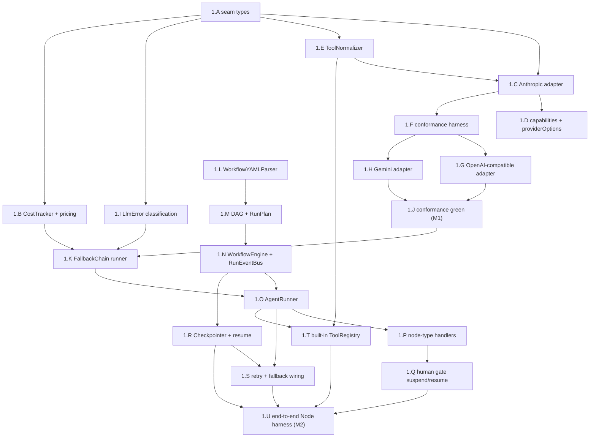
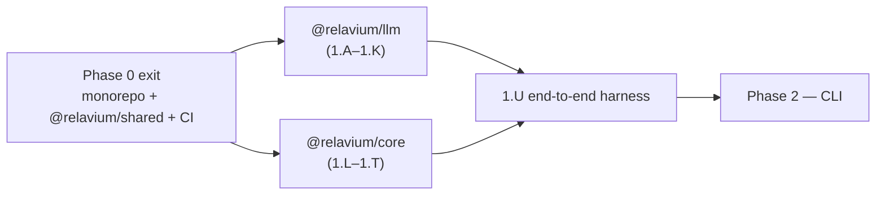

# Phase 1 — Engine and LLM

> Status: Not started — the critical path (Product Phase 1). Blocked on Phase 0 exit.

- **Related**: [../README.md](../README.md), [phase-0-foundations.md](phase-0-foundations.md), [phase-2-cli.md](phase-2-cli.md), [../../architecture/shared-core-engine.md](../../architecture/shared-core-engine.md), [../../architecture/execution-model.md](../../architecture/execution-model.md), [../../architecture/multi-llm-providers.md](../../architecture/multi-llm-providers.md), [../../reference/shared-core/llm-provider-seam.md](../../reference/shared-core/llm-provider-seam.md), [../../reference/shared-core/node-types.md](../../reference/shared-core/node-types.md), [../../reference/shared-core/built-in-tools.md](../../reference/shared-core/built-in-tools.md), [../../reference/contracts/sse-event-schema.md](../../reference/contracts/sse-event-schema.md), [../../standards/testing.md](../../standards/testing.md), [../../standards/error-handling.md](../../standards/error-handling.md), [../../decisions/0011-internal-llm-abstraction.md](../../decisions/0011-internal-llm-abstraction.md)

## Goal

Build the two packages every surface depends on: **`@relavium/llm`** (the
provider-agnostic `LLMProvider` seam, the per-provider adapters, the fallback
runner, and cost tracking) and **`@relavium/core`** (YAML→DAG parsing, the
execution runner with a `RunEventBus`, checkpoint/resume, and retry+fallback
wiring). This is the **critical path** — no surface code (`apps/*`) begins until
the engine is proven end-to-end from a Node test harness, with streaming,
checkpoint/resume, retry, and provider failover all demonstrated.

## Outcomes (Definition of Done)

- `@relavium/llm` exports the frozen `LLMProvider` seam (Relavium/Zod types only),
  three adapters (Anthropic, OpenAI-compatible serving OpenAI+DeepSeek, Gemini),
  a `FallbackChain` runner, and a `CostTracker` — all passing one shared
  conformance suite in fixture mode on PR.
- No vendor SDK type appears in any exported `@relavium/llm` or `@relavium/core`
  type, enforced by the import-zone lint rule (M1 invariant).
- `@relavium/core` parses a `.relavium.yaml` into a validated DAG, walks it
  (sequential, parallel fan-out/fan-in, condition, human gate), emits the
  canonical colon-namespaced run events with monotonic `sequenceNumber`,
  checkpoints each node boundary, and resumes from a checkpoint.
- A Node harness runs a 3-node workflow end-to-end with live streaming,
  checkpoint/resume, node retry, and provider failover, with cost recorded
  correctly per attempt (**M2**, the critical-path milestone).
- Both packages have zero platform-specific imports and meet the engine coverage
  bar (≥ 90% line **and** branch) from [testing.md](../../standards/testing.md).

## Scope

### In scope

**`@relavium/llm`** — Relavium's own multi-LLM abstraction, per
[ADR-0011](../../decisions/0011-internal-llm-abstraction.md) and
[multi-llm-providers.md](../../architecture/multi-llm-providers.md):

- The single provider-agnostic **`LLMProvider` seam** (`id` + `generate(req, key)`
  + `stream(req, key)` + `supports`), expressed only in Relavium/Zod types.
  `LlmRequest` in; `LlmResult` or a discriminated-union `StreamChunk` stream out;
  a normalized `Usage` and classified `LlmError`. Canonical home:
  [llm-provider-seam.md](../../reference/shared-core/llm-provider-seam.md).
  **No vendor SDK type ever crosses this seam.**
- Three thin hand-rolled adapters over the official TS SDKs: `AnthropicAdapter`
  (`@anthropic-ai/sdk`), one OpenAI-compatible adapter (the `openai` SDK) serving
  OpenAI **and** DeepSeek (DeepSeek via custom `baseURL`), and `GeminiAdapter`
  (`@google/genai`). Adapters stay dumb: normalization of system-prompt placement,
  tool schemas, tool-call round-trips, streaming chunks, stop reasons, and usage
  happens in our adapter code.
- A **`FallbackChain` runner outside the adapters** (policy, not adapter logic)
  and a `CostTracker` recording usage as integer **micro-cents** consistent with
  [database-schema.md](../../reference/desktop/database-schema.md).
- A capability-gated lowest-common-denominator surface (text + tools + streaming +
  usage) plus a typed `providerOptions` escape hatch for provider-specific
  features (vision, caching, reasoning, parallel tool calls).
- Cancellation via `AbortSignal`, working in both Node and the Tauri WebView fetch.
- A per-provider **conformance suite**: recorded fixtures on PR, live provider APIs
  nightly in CI ([testing.md](../../standards/testing.md)).

**`@relavium/core`** — the shared engine, per
[shared-core-engine.md](../../architecture/shared-core-engine.md) and
[execution-model.md](../../architecture/execution-model.md):

- `WorkflowYAMLParser` — parse and validate `.relavium.yaml` into a DAG (against
  `@relavium/shared` schemas), with cycle detection and field-named validation
  errors.
- `WorkflowEngine` + `AgentRunner` — DAG execution over the node types in
  [node-types.md](../../reference/shared-core/node-types.md), emitting the canonical
  colon-namespaced run events through a `RunEventBus`.
- Checkpoint/resume and node-level retry, with the fallback chain wired to
  `@relavium/llm`.
- A `ToolNormalizer` / `ToolRegistry` for built-in tools
  ([built-in-tools.md](../../reference/shared-core/built-in-tools.md)) and a clean
  execution-mode interface so the same engine runs local (Phase 1) and cloud
  (Product Phase 2) unchanged.
- **Zero platform-specific imports** — runs identically in Node, the Tauri
  WebView, the VS Code extension host, and (later) the cloud worker.

### Explicitly out of scope

- Any surface (`apps/*`) — the engine is exercised only via a Node test harness
  this phase.
- The durable DB layer (`packages/db`) beyond the in-memory/SQLite-shaped
  `Checkpointer` interface the engine defines; real SQLite persistence is wired by
  the CLI/desktop phases.
- HTTP SSE transport (cloud) — Phase 1 emits events in-process via the
  `RunEventBus`; SSE is Product Phase 2.
- Ollama / local models — API-based providers only (Anthropic, OpenAI, Gemini,
  DeepSeek).
- The orchestrator-as-router node beyond the `invoke_agent` tool plumbing the
  built-in tool normalizer needs; the full LLM-router selection logic is a later
  enhancement and not gated by this phase.

## Work breakdown

The order is engine-correctness-first: build and freeze the seam, prove it with
one adapter and the conformance harness, fan out to the remaining adapters, add
the policy layers (fallback, cost), then build the engine bottom-up (parser → DAG
→ runner → checkpoint → retry/fallback wiring → tools) and finish with the
end-to-end Node harness. IDs are the stable workstream handles used by the global
spine and the critical path.

### 1.A — `LLMProvider` seam types (freeze the contract)

Define the immovable seam in `packages/llm/src/types.ts` exactly as
[llm-provider-seam.md](../../reference/shared-core/llm-provider-seam.md) specifies.
Everything else in the package implements this; it is frozen first so adapters and
the runner build against a stable shape.

**Tasks:**
- Declare the Relavium/Zod types: `LlmRequest` (model, `system`, `messages`,
  `tools`, `toolChoice`, `temperature?`, `maxTokens?`, `stopSequences?`, `signal?`,
  `providerOptions?`), `LlmMessage`, `ContentPart` (`text` | `tool_call` |
  `tool_result`), `ToolDef` (`JSONSchema7`), `LlmResult`, `StopReason` (5-value
  enum), `Usage`, the `StreamChunk` discriminated union, `CapabilityFlags`, and the
  `LlmProvider` interface.
- Add `LlmError` as a typed, discriminated error (`kind`/`code`, `retryable`,
  structured context: provider id, attempt, status) per
  [error-handling.md](../../standards/error-handling.md). No vendor error shape may
  escape the adapter.
- Confirm the import-zone ESLint rule from
  [code-style-typescript.md](../../standards/code-style-typescript.md#module-boundaries--no-vendor-type-across-the-llm-seam)
  restricts provider SDK imports to `packages/llm/src/adapters/*`.
- Re-export the run-event-relevant types from `@relavium/shared` rather than
  redefining (single canonical home).

**Acceptance:** the seam compiles, has unit tests for the Zod accept/reject cases,
and a type-level test proves no exported type references a vendor SDK type; the
import-zone lint rule fails a deliberate violating import in CI.

### 1.B — `CostTracker` + the model-pricing table

The cost computation Relavium owns, keyed on the canonical model id — never read
from a provider field.

**Tasks:**
- Build the pricing table keyed on canonical model id (input/output per-token, plus
  cache-read/write where the provider exposes it), sourced from the model catalog in
  [database-schema.md](../../reference/desktop/database-schema.md).
- Implement `CostTracker.cost(modelId, usage) -> costMicrocents` and the accumulator that
  produces `{ inputTokens, outputTokens, costMicrocents, cumulativeCostMicrocents }` for the
  `cost:updated` event ([sse-event-schema.md](../../reference/contracts/sse-event-schema.md)).
- Store/aggregate as integer **micro-cents** to avoid float drift; expose a single
  conversion point to `costMicrocents`.
- Surface **per-attempt** usage so cost stays accurate across a failover (consumed
  by 1.K).

**Acceptance:** unit tests price each catalog model from a fixed usage object to the
expected micro-cents; an unknown model id raises a typed, user-facing error rather
than silently pricing at zero.

### 1.C — `AnthropicAdapter` (the first adapter, proves the seam) — *critical path*

The reference adapter over `@anthropic-ai/sdk`. It establishes the normalization
patterns the conformance harness then enforces across all adapters.

**Tasks:**
- Implement `generate` and `stream` against the seam, reading the key at call time
  and attaching it inside the adapter (never above the seam).
- Normalize per [llm-provider-seam.md](../../reference/shared-core/llm-provider-seam.md):
  route `system` to the top-level param; reshape `ToolDef` → `{ name, description,
  input_schema }`; round-trip `tool_use` / `tool_result` content blocks; fold the
  typed event stream (`message_start`, `content_block_start`/`delta`, `message_delta`,
  `message_stop`) into `StreamChunk`s; map stop reasons (`end_turn`/`max_tokens`/
  `tool_use`/`stop_sequence`) to the 5-value enum; extract `Usage` (incl.
  `cache_read_input_tokens` / `cache_creation_input_tokens`).
- Concatenate tool-arg `input_json_delta` across `tool_call_delta` chunks and parse
  once at `tool_call_end`. Emit a final `stop` chunk carrying `stopReason` + `usage`.
- Default `maxTokens` when absent (Anthropic requires it).
- Thread `AbortSignal`; classify SDK errors into `LlmError` (429/5xx/overload →
  retryable; 401/403/400/policy/cancel → fatal) per
  [error-handling.md](../../standards/error-handling.md).

**Acceptance:** the adapter passes the conformance suite (once 1.F exists) against
recorded Anthropic fixtures: streams text, calls a tool and returns a normalized
`tool_call`, returns usage, maps stop reasons, and surfaces a classified `LlmError`.

### 1.D — Capabilities + the typed `providerOptions` escape hatch

Keep the common path narrow and stable; push provider-specific features off it.

**Tasks:**
- Populate `supports: CapabilityFlags` (`tools`, `streaming`, `parallelToolCalls`,
  `vision`, `promptCache`, `reasoning`) per adapter.
- Define the typed `providerOptions` passthrough and the `raw` result passthrough;
  document that escape-hatch usage stays out of `packages/core`.
- Add a capability guard so a request using an unsupported feature fails fast with a
  typed, user-facing error rather than silently dropping it.

**Acceptance:** unit tests assert each adapter's `supports` flags and that an
unsupported-capability request raises a typed error; no escape-hatch field leaks a
vendor type across the seam.

### 1.E — `ToolNormalizer` (canonical tool ↔ wire shape)

One canonical `ToolDef` in, three native shapes out, and the response folded back
into one shape. Lives on the Relavium side of the seam; built before adapters lean
on it.

**Tasks:**
- Implement `toWire(toolDef, providerId)` for the three native shapes (OpenAI/DeepSeek
  `function.parameters`; Anthropic `input_schema`; Gemini `functionDeclarations`).
- Implement the **Gemini OpenAPI-subset reshape**: validate and strip unsupported
  JSON-Schema keywords (`$ref`, unsupported formats) before sending; surface a typed
  error when a tool schema cannot be expressed.
- Implement the **Gemini missing-id** handling: synthesize and track tool-call ids by
  name + order and rehydrate them into the canonical `ContentPart.tool_call.id` /
  `tool_result.toolCallId` so callers always see ids.
- Normalize each provider's tool-call response back into canonical `tool_call`
  parts.

**Acceptance:** unit tests round-trip a representative tool schema to all three wire
shapes and back; the Gemini reshape rejects an unsupported schema with a typed error
and the id-synthesis test proves a stable id across a multi-tool streamed turn.

### 1.F — Conformance harness (shared spec + fixture recorder) — *critical path*

The single spec every adapter must pass, plus the fixture-recording mechanism. This
is the biggest leverage point for the in-house abstraction.

**Tasks:**
- Write the shared conformance spec: streams text, calls a tool and returns a
  normalized `tool_call`, returns usage, maps every stop reason to the canonical
  enum, and surfaces errors as classified `LlmError`s.
- Build the fixture harness: a recorder that captures request/response pairs
  (including streamed SSE transcripts) and a replayer driving the same spec offline
  with no API keys or quota.
- Wire two modes: **fixtures on PR** (fast, deterministic, offline) and **live nightly**
  (real endpoints, keys from CI secrets, never committed or logged).
- Add the rule that fixtures are regenerated, not hand-edited, when a wire format
  changes, and review them like code.

**Acceptance:** the Anthropic adapter (1.C) passes the full spec in fixture mode in
CI; the nightly live job is wired (may be skipped until keys are provisioned) and
recording a fresh fixture reproduces a green fixture run.

### 1.G — OpenAI-compatible adapter (OpenAI + DeepSeek) — *critical path*

One adapter over the `openai` SDK serving both OpenAI and DeepSeek (DeepSeek via
custom `baseURL = api.deepseek.com`) — no separate dependency.

**Tasks:**
- Implement `generate`/`stream`; prepend a `{ role: 'system' }` message for `system`;
  reshape tools to `{ type: 'function', function: { name, description, parameters } }`.
- Fold `chat.completion.chunk` `choices[].delta` (content + incremental `tool_calls`
  JSON fragments per index) into `StreamChunk`s; set `stream_options: { include_usage:
  true }` so a final usage chunk arrives.
- Map stop reasons (`stop`/`length`/`tool_calls`/`content_filter`); extract usage
  (`prompt_tokens`/`completion_tokens` + `prompt_tokens_details.cached_tokens`; for
  DeepSeek also `prompt_cache_hit_tokens`).
- Make the provider id resolve correctly (`openai` vs `deepseek`) for cost pricing
  and the `id` field, while sharing one adapter implementation.

**Acceptance:** the adapter passes the conformance suite in fixture mode as **both**
`openai` and `deepseek` (separate recorded fixtures), including the tool-call and
usage cases.

### 1.H — `GeminiAdapter` (`@google/genai`) — *critical path*

The riskiest adapter (restricted tool schema, no native tool-call ids); it leans
hardest on 1.E.

**Tasks:**
- Implement `generate`/`stream`; route `system` to `systemInstruction`; pass tools
  as `functionDeclarations` using the 1.E OpenAPI-subset reshape.
- Fold `streamGenerateContent` candidate `parts` into `StreamChunk`s; map stop
  reasons (`STOP`/`MAX_TOKENS`/`SAFETY`/`RECITATION`); extract usage from
  `usageMetadata` (`promptTokenCount`/`candidatesTokenCount`).
- Use the 1.E id-synthesis path so `functionCall`/`functionResponse` parts round-trip
  with synthesized ids that callers see as normal `tool_call` ids.

**Acceptance:** the Gemini adapter passes the full conformance suite in fixture mode,
including a tool call whose id is synthesized and a `SAFETY` stop mapped to
`content_filter`.

### 1.I — `LlmError` classification (the fallback contract)

The classification the `FallbackChain` depends on, normalized inside each adapter.

**Tasks:**
- Finalize the retryable/fatal mapping per
  [error-handling.md](../../standards/error-handling.md): retryable = 429, 5xx/overload,
  timeout, transport reset; fatal = 401/403, 400/bad-request, unsupported model/tool
  schema, content-policy refusal, `AbortSignal` cancellation.
- Ensure every adapter maps its SDK errors into `LlmError` before crossing the seam
  (no vendor error shape escapes).
- Cover the per-provider status/code → retryable/fatal mapping in the conformance
  suite.

**Acceptance:** conformance tests assert each adapter classifies a rate limit as
retryable and an auth failure as fatal; a cancelled request surfaces a fatal,
non-retryable `LlmError`.

### 1.J — Conformance green: 3 adapters pass the suite (**M1**)

The milestone gate that proves the seam: all three adapters honor the contract with
no vendor type crossing the seam.

**Tasks:**
- Run the full conformance spec against Anthropic, OpenAI, DeepSeek, and Gemini in
  fixture mode in PR CI.
- Confirm the nightly live job is scheduled and green (or explicitly pending keys).
- Re-run the no-vendor-type-across-the-seam lint and a type-level export audit.

**Acceptance:** fixture-mode conformance is a required, green CI check for all
adapters; the import-zone lint and export audit pass — **M1 achieved**.

### 1.K — `FallbackChain` runner (policy outside the adapters) — *critical path*

The small runner that walks an ordered list of models with per-model attempt
budgets. Adapters stay dumb; this owns the policy.

**Tasks:**
- Implement `withFallback(providers, requestFn)` consuming the agent's
  `fallback_chain` (`{ model, provider, max_attempts }` per
  [multi-llm-providers.md](../../architecture/multi-llm-providers.md)).
- On a **classified-retryable** `LlmError`, exhaust the entry's `max_attempts` with
  backoff, then advance to the next entry; on a **fatal** `LlmError`, stop
  immediately (never mask a real bug by falling through).
- Record **per-attempt usage** and feed it to the `CostTracker` (1.B) so cost stays
  accurate across failover.
- Surface the final outcome plus the attempt trace (which providers were tried, why
  each failed) for the run event/log.

**Acceptance:** unit tests prove: a primary failing with a retryable error fails over
to the next provider and the run succeeds; a fatal error stops the chain; and
per-attempt cost is summed across a failover.

### 1.L — `WorkflowYAMLParser` (parse + validate) — *critical path*

The engine entry point: load a `.relavium.yaml` and validate it against the
`@relavium/shared` `WorkflowSchema` before any LLM call.

**Tasks:**
- Parse the file and validate with the shared Zod schema; map the friendly authored
  YAML field names onto the engine config blocks per
  [node-types.md](../../reference/shared-core/node-types.md).
- Produce **typed, user-facing validation errors** that name the offending node and
  field (e.g. "node `summarize`: missing `model`") per
  [error-handling.md](../../standards/error-handling.md) — the same diagnostics the
  VS Code language server will later consume.
- Resolve `{{ node.output }}` interpolation references to a structured representation
  (not yet evaluated) for the DAG builder.

**Acceptance:** valid reference example workflows parse to a typed
`WorkflowDefinition`; a battery of malformed files each fail with a field-named,
secret-free error; round-trip (parse → object) preserves all node config blocks.

### 1.M — DAG builder + `RunPlan` (topological order) — *critical path*

Turn the validated definition into an executable plan.

**Tasks:**
- Build the DAG from `dependsOn` / edges; compute topological order via **Kahn's
  algorithm**; treat a **cycle as a hard error** with a clear message naming the
  cycle.
- Expand the authored `parallel` construct into the two engine vertices `fan_out`
  (split) and `fan_in` (join) per [node-types.md](../../reference/shared-core/node-types.md).
- Build the `RunPlan`: per-node resolved inputs (from interpolation against upstream
  outputs), type, per-type config block, and retry/fallback config.
- Validate edge handles (`nodeId:handleName`) for `condition`/`fan_out` nodes.

**Acceptance:** unit tests build correct topological orders for sequential, parallel
fan-out/fan-in, and conditional graphs; a cyclic graph is rejected; a `parallel`
block expands to `fan_out` + `fan_in` with the right config halves.

### 1.N — `WorkflowEngine` + `RunEventBus` (the run loop) — *critical path*

The loop that dispatches ready nodes and emits the canonical event stream.

**Tasks:**
- Implement `WorkflowEngine.start(workflowId, input)` / `resume` / `cancel`, walking
  the `RunPlan` and dispatching every node whose dependencies are satisfied
  (independent branches concurrently).
- Implement the `RunEventBus` (`EventEmitter`) and emit the canonical
  colon-namespaced events with a **monotonically increasing `sequenceNumber`** per
  run: `run:started`, `node:started`, `agent:token`, `agent:tool_call`,
  `agent:tool_result`, `cost:updated`, `node:completed`, `node:failed`,
  `human_gate:paused`/`:resumed`, `run:completed`, `run:failed`, `run:cancelled`
  ([sse-event-schema.md](../../reference/contracts/sse-event-schema.md)).
- Expose a `RunHandle` with an `events` async iterable (the same shape every surface
  consumes).
- Define the execution-mode interface seam (local now; cloud later) so the loop is
  identical across modes.

**Acceptance:** running a multi-node plan emits events in a gap-free `sequenceNumber`
order asserted against the canonical schema by colon-namespaced name; cancellation
emits `run:cancelled` and stops dispatch.

### 1.O — `AgentRunner` (per-node LLM execution) — *critical path*

Executes a single agent node end-to-end against `@relavium/llm`.

**Tasks:**
- Assemble the prompt (system + messages + resolved inputs + normalized tools), call
  the provider via the seam, and re-emit streaming chunks as `agent:token` /
  `agent:tool_call` / `agent:tool_result` events on the bus.
- Apply the agent's `fallback_chain` via the 1.K runner and feed usage to the
  `CostTracker`, emitting `cost:updated` (`{ nodeId, model, inputTokens,
  outputTokens, costMicrocents, cumulativeCostMicrocents }`).
- Handle the tool-call loop: dispatch tool calls through the `ToolRegistry` (1.T),
  feed results back, and continue until a non-`tool_use` stop.
- Thread `AbortSignal` for cancellation; map a final node failure to `node:failed`
  with a user-safe message + internal correlation id.

**Acceptance:** an agent node with a tool streams tokens, performs a tool round-trip,
emits a correct `cost:updated`, and completes with `node:completed`; a forced
provider error drives the fallback chain before the node is considered failed.

### 1.P — Node-type handlers (condition / fan-out / fan-in / transform / input / output)

The dispatch table for the non-agent node types the DAG can contain.

**Tasks:**
- Implement handlers for `condition` (evaluate the expression, activate exactly one
  downstream branch, dim the rest), `fan_out` (spread input across N branches) and
  `fan_in` (join with `wait_all`/`wait_first`/`wait_n` + `merge_strategy`),
  `transform` (reshape state with the configured expression, no LLM), and `input` /
  `output` (bind workflow I/O).
- Enforce that a required node is never silently skipped and that fan-in blocks until
  its expected inputs arrive.
- Emit the standard `node:started` / `node:completed` events for each.

**Acceptance:** unit tests cover each handler — a condition selects the right branch;
a fan-out/fan-in runs N branches concurrently and merges per strategy; a transform
reshapes state deterministically; input/output bind correctly.

### 1.Q — Human-gate suspend/resume

The gate that suspends a run for an external decision and resumes idempotently.

**Tasks:**
- On reaching a `human_in_the_loop` node, persist full run state (1.R), emit
  `human_gate:paused` (`gateType`, `message`, `timeoutMs?`, `expiresAt?`), and
  suspend — the process may even exit.
- Implement `engine.resume(runId, gateId, decision)` applying a `GateDecision`
  (`approved` / `rejected` / `input_provided`, `decidedBy`, `payload?`), emitting
  `human_gate:resumed`, and continuing the run.
- Make re-delivering the same decision idempotent (do not advance twice) because the
  gate state is checkpointed.
- Implement `timeout_action` (`fail` / `continue_default` / `cancel`) mapping a
  timeout to `decidedBy: 'timeout_escalation'`.

**Acceptance:** a run pauses at a gate, persists state, resumes on a decision and
completes; re-applying the same decision is a no-op; a timeout resolves per the
configured `on_timeout` policy.

### 1.R — `Checkpointer` + resume — *critical path*

Persist state at every node boundary and reconstruct a run from it.

**Tasks:**
- Define the `Checkpointer` interface (SQLite-shaped per
  [database-schema.md](../../reference/desktop/database-schema.md)) with an in-memory
  reference implementation for tests; real SQLite is wired in Phase 2 (CLI).
- After every node completes, write a checkpoint: run status, per-node states,
  completed/pending node ids, and (for an orchestrator) message history.
- Implement resume-from-checkpoint and crash reconciliation (on startup, restore
  in-flight runs from their last checkpoint rather than losing them).
- Use a stable idempotency key (`runId + nodeId + retryCount`) so a retry never
  double-applies side effects; align gap detection to `sequenceNumber`.

**Acceptance:** a run interrupted after node 2 resumes from the checkpoint and
completes nodes 3..N without re-running 1..2; re-applying a checkpointed node is
idempotent; gap detection triggers a resync rather than trusting a partial view.

### 1.S — Retry + fallback wiring (node budget above the chain) — *critical path*

Layer node-level retry above the provider fallback chain so reliability composes
correctly.

**Tasks:**
- Implement node-level retry from `retry_config` (`max_attempts`, `backoff_seconds`,
  `retry_on[]`), with backoff and optional input adjustment, never silently skipping
  a required node.
- Wire the ordering: the engine considers a node failed only after the **whole
  fallback chain** (1.K) is exhausted within an attempt, then applies the node retry
  budget above that.
- Implement retry-from-node (re-run from any node) using the 1.R idempotency key.

**Acceptance:** a node whose provider chain is exhausted retries per its budget and
then fails with `node:failed`; a transient failure recovers within budget; cost is
recorded for every attempt across both layers.

### 1.T — Built-in `ToolRegistry` + dispatch

The engine-side registry that dispatches built-in tools the `AgentRunner` invokes.

**Tasks:**
- Register the built-in tools from
  [built-in-tools.md](../../reference/shared-core/built-in-tools.md), exposing each as
  a canonical `ToolDef` for the `ToolNormalizer` (1.E) and a dispatcher for execution.
- Wire `input_mapping` / `output_mapping` between workflow state and the tool;
  sanitize tool inputs in `agent:tool_call` events (no secrets) and truncate
  `agent:tool_result.outputSummary`.
- Enforce the mandatory guardrails in the engine (not by convention): `run_command`
  only executes allowlisted commands; `git_commit` requires a `human_gate` approval
  in automated workflows.
- Plumb `invoke_agent` so an agent can dispatch another agent node by id (the
  orchestrator delegation mechanism), without building the full router selection
  logic this phase.

**Acceptance:** an agent tool call dispatches through the registry, maps I/O
correctly, and emits sanitized tool events; an unlisted `run_command` is refused;
`git_commit` is blocked without a gate approval.

### 1.U — End-to-end Node harness (**M2**, critical-path milestone) — *critical path*

The proof that the engine works before any surface exists.

**Tasks:**
- Write a Node test script that runs a 3-node sequential workflow (`input` → `agent`
  → `output`, with a tool call) against fixtures/a stub provider.
- Demonstrate, in one run: live token streaming over the `RunEventBus`,
  per-node-boundary checkpointing, **resume** from a checkpoint, **node retry** on a
  forced failure, and **provider failover** to a second provider in the chain.
- Assert the run completes with correct, per-attempt cost recorded and a gap-free
  `sequenceNumber` event stream matching the canonical schema.
- Keep the harness in the repo as the seed of the Phase-2 CLI regression harness.

**Acceptance:** the harness runs green in CI; forcing a provider error triggers retry
then fallback with the run still completing; resume from a mid-run checkpoint
reproduces the same final output — **M2 achieved**.

## Milestones

In-phase milestones map to the workstreams that complete them. The two global-spine
milestones for this phase are **M1** (LLM seam proven) and **M2** (engine end-to-end),
the latter being the critical-path milestone for the whole product.

| # | Milestone | Completed by |
| --- | --- | --- |
| 1.m1 | Seam frozen; first adapter + conformance harness green (Anthropic) | 1.A, 1.C, 1.E, 1.F |
| **M1** | **LLM seam proven: 3 adapters pass the conformance suite (fixtures on PR, live nightly; no vendor type across the seam)** | 1.G, 1.H, 1.I, **1.J** |
| 1.m2 | Policy layers complete: fallback runner + cost tracker | 1.B, 1.K |
| 1.m3 | Parse → DAG → run loop emits the canonical event stream | 1.L, 1.M, 1.N |
| 1.m4 | Agent + non-agent node handlers, gate, checkpoint/resume, retry, tools | 1.O, 1.P, 1.Q, 1.R, 1.S, 1.T |
| **M2** | **Engine end-to-end from a Node harness (stream + checkpoint + retry + fallback) — CRITICAL-PATH MILESTONE** | **1.U** |

## Dependencies

- **Phase 0 complete** (M0): the Turborepo + pnpm monorepo, `@relavium/shared` Zod
  schemas (round-tripping the reference YAML), and green tooling/CI — see
  [phase-0-foundations.md](phase-0-foundations.md).
- **Frozen reference contracts** consumed by this phase: the
  [LLM-provider seam](../../reference/shared-core/llm-provider-seam.md), the
  [run-event schema](../../reference/contracts/sse-event-schema.md), the
  [node-types catalog](../../reference/shared-core/node-types.md), the
  [built-in tools catalog](../../reference/shared-core/built-in-tools.md), the
  workflow/agent YAML specs, and the model-pricing catalog in
  [database-schema.md](../../reference/desktop/database-schema.md).
- **The multi-LLM decision** ([ADR-0011](../../decisions/0011-internal-llm-abstraction.md))
  and the binding [testing](../../standards/testing.md) /
  [error-handling](../../standards/error-handling.md) /
  [code-style](../../standards/code-style-typescript.md) standards.
- The official provider SDKs at pinned versions (`@anthropic-ai/sdk`, `openai`,
  `@google/genai`) — imported only inside `packages/llm/src/adapters/*`.

## Exit criteria (go / no-go)

All must be true to start Phase 2 (CLI):

1. A `relavium`-equivalent invocation from the Node harness (1.U) runs a 3-node
   sequential workflow end-to-end: live token streaming, in-process emission of the
   canonical run events with monotonic `sequenceNumber`, SQLite-shaped checkpointing,
   and resume from a checkpoint.
2. Forcing a provider error triggers node retry and then a fallback to the next
   provider in the chain, with the run completing and **per-attempt** cost recorded
   correctly.
3. All three adapters (Anthropic, OpenAI-compatible serving OpenAI+DeepSeek, Gemini)
   pass the conformance suite against recorded fixtures; the nightly live-API run is
   scheduled and green (M1).
4. **No vendor SDK type** appears in any exported `@relavium/llm` or `@relavium/core`
   type — verified by the no-vendor-type-across-the-seam import-zone lint rule from
   [code-style-typescript.md](../../standards/code-style-typescript.md#module-boundaries--no-vendor-type-across-the-llm-seam).
5. Engine packages have **zero platform-specific imports** and meet the ≥ 90% line
   **and** branch coverage bar from [testing.md](../../standards/testing.md).

## Risks & mitigations

| Risk | Mitigation |
| --- | --- |
| **Provider drift / normalization tax** — SDKs change streaming and tool-call shapes. | The conformance suite (fixtures on PR + live nightly) turns drift into a red CI run; the [ADR-0011](../../decisions/0011-internal-llm-abstraction.md) migration stance allows slotting a thin TS lib behind the *same* seam on a named trigger (never Vercel). |
| **Leaky abstraction** — a vendor type slips across the seam and couples the engine to a provider. | The import-zone lint rule, the type-level export audit (1.A/1.J), and the capability-gated common interface with a typed `providerOptions` escape hatch. |
| **Engine API ergonomics unproven without a consumer.** | The CLI (Phase 2) follows immediately as the first real consumer and regression harness; the 1.U harness seeds it. |
| **Checkpoint/resume correctness** — partial-run recovery is subtle. | Dedicated resume + crash-reconciliation tests, the `runId + nodeId + retryCount` idempotency key, and gap detection aligned to `sequenceNumber`. |
| **Gemini schema/id edge cases** — restricted OpenAPI subset and missing tool-call ids. | The `ToolNormalizer` (1.E) owns the reshape and id synthesis with dedicated tests; the Gemini conformance fixtures (1.H) exercise both. |
| **Fallback masking real bugs** — a fatal error silently falling through the chain. | The `LlmError` retryable/fatal classification (1.I) stops the chain on fatal errors; conformance tests assert auth/cancel are fatal. |
