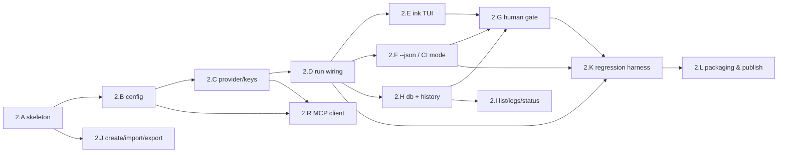
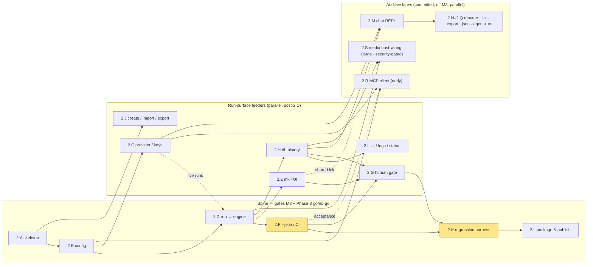

# Phase 2 — CLI

> Status: In progress (Product Phase 1, build phase 2). **2.A** (CLI skeleton + process contract) and **2.B** (config resolution) are ✅ **Done (PR #40, 2026-06-22)**, behind [ADR-0047](../../decisions/0047-cli-framework-commander-ink-clack.md) + [ADR-0048](../../decisions/0048-toml-config-parser.md); **2.D** (`run` → engine, the M3 keystone) is ✅ **Done (PR #41, 2026-06-22)**, and **2.F** (the `--json` CI machine-output contract) is ✅ **Done (PR #42, 2026-06-22)**, behind [ADR-0049](../../decisions/0049-cli-machine-output-contract.md). The global milestone in play is **M3** (reached at 2.F + 2.K); next on the spine is **2.K** (the engine regression harness), with the **2.E** (ink TUI) + **2.H** (durable run history) run-surface feeders open.

- **Related**: [../README.md](../README.md), [phase-1-engine-and-llm.md](phase-1-engine-and-llm.md), [phase-3-desktop.md](phase-3-desktop.md), [../../reference/cli/commands.md](../../reference/cli/commands.md), [../../reference/contracts/config-spec.md](../../reference/contracts/config-spec.md), [../../reference/desktop/keychain-and-secrets.md](../../reference/desktop/keychain-and-secrets.md), [../../reference/contracts/sse-event-schema.md](../../reference/contracts/sse-event-schema.md), [../../reference/desktop/database-schema.md](../../reference/desktop/database-schema.md), [../../architecture/execution-model.md](../../architecture/execution-model.md), [../../architecture/shared-core-engine.md](../../architecture/shared-core-engine.md)

## Goal

Ship the `relavium` CLI (`apps/cli`) as the **first real consumer** of the
engine, proving `@relavium/core` and `@relavium/llm` end-to-end with zero UI
complexity. The CLI is the fastest feedback loop, so it forces an ergonomic
engine API surface and then becomes the engine's **regression harness** for every
later phase — a small suite of example workflows that runs in CI on every engine
change. It is also the canonical reference implementation for how a surface
consumes the [`RunEvent` stream](../../reference/contracts/sse-event-schema.md),
the [config resolution order](../../reference/contracts/config-spec.md), and the
[keychain secret model](../../reference/desktop/keychain-and-secrets.md).

## Outcomes (Definition of Done)

- A published, installable `relavium` CLI (`npm i -g relavium`), bundled to a
  single ESM bundle with `tsup`.
- `run / list / logs / gate` (plus `create / import / export / status` and the
  `provider` key commands) all working against a real local workflow.
- An `ink` streaming TUI that renders every canonical run event live (per-node
  status rings, the active node's token stream, a running cost/duration summary).
- A `--json` non-interactive mode emitting one [`RunEvent`](../../reference/contracts/sse-event-schema.md)
  per line (NDJSON), with deterministic, documented exit codes for CI.
- Interactive human-gate approval, and the non-interactive `relavium gate` resume
  path, both driving the **same** engine `resume()` contract the other surfaces use.
- Durable local run history via `@relavium/db` so `list`, `logs`, and `status`
  read persisted state.
- The CLI wired into CI as the engine regression harness.

## Scope

### In scope

- A `commander.js` entry exposing the command surface in
  [../../reference/cli/commands.md](../../reference/cli/commands.md): the engine-
  proving core (`run`, `list`, `logs`, `gate`, `status`) plus `create / import /
  export` and the `provider` key subcommands.
- Two-level **config resolution** (`~/.relavium/` global → project `.relavium/`)
  with CLI flag / env override, exactly per
  [../../reference/contracts/config-spec.md](../../reference/contracts/config-spec.md).
- **Provider/key commands** that store API keys in the OS keychain via `@napi-rs/keyring`
  ([ADR-0019](../../decisions/0019-cli-node-keychain-library.md) — not the archived `keytar`)
  under the `service=relavium`, `account={providerId}:{keyId}` naming from
  [../../reference/desktop/keychain-and-secrets.md](../../reference/desktop/keychain-and-secrets.md),
  with the headless `secrets.enc` / env-var fallback for CI.
- An `ink` (React-for-terminals) TUI rendering the colon-namespaced run events
  live; `@clack/prompts` wizards for `create` and the human-gate prompt.
- A `--json` CI / non-interactive mode that is a **renderer over the same event
  bus**, not a separate code path.
- Local SQLite run history wired through `@relavium/db` (`runs`, `step_executions`,
  `run_events`, `run_costs`) so `list`/`logs`/`status` read durable state.
- A CLI-driven engine regression harness: a small set of example workflows run
  with `--json` and asserted on in CI on every engine change.
- The **MCP client** (inbound direction of
  [mcp-integration.md](../../reference/shared-core/mcp-integration.md)): connect/spawn the
  `[[mcp_servers]]` registrations resolved by 2.B and surface their tools through the engine's
  `ToolRegistry`, per [ADR-0034](../../decisions/0034-mcp-client-sdk-dependency.md) (2.R — off the
  M3 critical path).

### Explicitly out of scope

- Any graphical canvas or `packages/ui` work — that is the desktop phase
  ([phase-3-desktop.md](phase-3-desktop.md)).
- Accounts and OAuth (`relavium auth login`, device flow) — **Product Phase 2**,
  first introduced with managed inference
  ([phase-5-managed-inference.md](phase-5-managed-inference.md)). Cloud execution and
  remote run dispatch are **Product Phase 2** cloud
  ([phase-6-cloud-execution-portal.md](phase-6-cloud-execution-portal.md)).
- Scheduled / webhook triggers; only `manual` (and the engine's `file_change`)
  triggers exist in Phase 1, and `file_change` is exercised by later surfaces.
- SQLCipher-encrypted history and the Tauri keychain plugin — those are desktop
  concerns; the CLI uses `@napi-rs/keyring` and an in-process engine bus, not Tauri IPC.
- Any engine behavior change made as a CLI workaround. Gaps found here are folded
  back into Phase 1 packages and re-tested (see Risks).

## Work breakdown

The workstreams are ordered for execution. Critical-path workstreams (`2.A`,
`2.B`, `2.D`, `2.F`, `2.K`) gate the global milestone **M3**. Earlier workstreams
unblock later ones; build them in this order. (`2.R` is the one exception to the
documentation order: it appears after the chat workstreams below but is
**scheduled early** — implementation needs only 2.B + 2.C, while its end-to-end
acceptance fixture additionally needs 2.F's `relavium run` to exist.)

### 2.A — CLI skeleton (`commander.js`) and process contract — ✅ **Done (PR #40)**

Stand up `apps/cli` with the `commander.js` program, the binary entry point, and
the cross-cutting process contract (output-mode detection, exit codes, global
flags) every command inherits.

**Tasks:**

- Scaffold `apps/cli` in the Turborepo with `tsup` ESM bundling and the `bin`
  field that produces the `relavium` executable.
- Define the `commander` program with the full subcommand surface from
  [../../reference/cli/commands.md](../../reference/cli/commands.md):
  `run`, `list`, `create`, `import`, `export`, `logs`, `status`, `gate`,
  `provider` (and reserved `init`/`agent` stubs that error cleanly as planned).
- Add global flags resolved once at startup: `--json`, `--no-color`, `--cwd`,
  `--config`, `--verbose`/`--quiet`.
- Implement **output-mode auto-detection**: interactive TUI when a TTY is
  attached; non-interactive line-buffered output when no TTY, `--json`, or
  `CI=true` (per the Output modes table in the command reference).
- Implement the deterministic **exit-code map** as a single shared helper:
  `0` success, `1` workflow failed, `2` invalid invocation / not found / schema
  error, **exit `3`** for **gate-paused** (a non-interactive run suspended at a
  human gate), and **exit `4`** for a **chat session ended** by the user (`/exit` in an
  interactive `relavium chat` — implemented in 2.M). The canonical home for these values is
  [commands.md](../../reference/cli/commands.md); use them consistently here.
- Centralize error rendering: human-readable to a TTY, structured `RunEvent`-shaped
  error object to stdout under `--json`; never leak a stack trace as the primary
  output.
- Keep each command's **core framework-free**: the logic lives in a plain module
  (parsed args in, typed result out) that imports neither `commander` nor `ink`; the
  CLI layer is thin wiring around it. This is what makes commands unit-testable
  without a TTY and keeps the TUI and `--json` paths renderers over one core.

**Acceptance:** `relavium --help` and every subcommand's `--help` print the
documented surface; `relavium <bogus>` exits `2`; output mode is correctly
selected across a TTY, a piped stdout, and `CI=true`; the exit-code helper is unit
tested for codes 0–3 here (the chat `/exit` code 4 is exercised in 2.M).

### 2.B — Config resolution (`~/.relavium` + project `.relavium`) — ✅ **Done (PR #40)**

Implement the two-level configuration loader the rest of the CLI depends on, with
the exact precedence in [config-spec.md](../../reference/contracts/config-spec.md).

**Tasks:**

- Locate and lazily create `~/.relavium/` on first run (`config.toml`,
  `history.db`, `tmp/`); never write secrets into any config file.
- Discover the project root by walking up for a `.relavium/` directory from
  `--cwd` (default `process.cwd()`); load `project.toml`, optional
  `workspace.toml`, and the `workflows/` + `agents/` YAML catalog.
- Implement the merge with **last-writer-wins** precedence: global → workspace →
  project → per-invocation (CLI flag / env var), matching the resolution diagram.
- Validate each config layer against the `@relavium/shared` config Zod schema;
  surface a precise, file-attributed error (exit `2`) on a malformed layer.
- Expose a resolved-config object (default model, `fs_scope`, variables, MCP
  registrations) consumed by `run`, `provider`, and the wizards.
- Honor `.relaviumignore` semantics for reads only (the CLI never commits or
  ignores on the user's behalf).

**Acceptance:** a setting defined in `project.toml` overrides `config.toml`; a
`--input`/flag/env value overrides both; a malformed TOML layer fails with a
file-attributed error and exit `2`; a project with no `.relavium/` is reported
clearly; no secret is ever read from or written to a config file.

### 2.C — Provider and key commands (OS keychain via `@napi-rs/keyring`)

Add the `relavium provider` subcommands so a user can register providers and store
API keys in the OS keychain — the CLI's secret seam, equivalent to the desktop
keychain and VS Code `SecretStorage`.

**Tasks:**

- Implement `provider list`, `provider add`, `provider set-key`, `provider
  remove-key`, `provider test` (a minimal live ping through `@relavium/llm`).
- Store each key with `@napi-rs/keyring` under `service=relavium`,
  `account={providerId}:{keyId}` (one entry per key so keys rotate/revoke
  independently), per [keychain-and-secrets.md](../../reference/desktop/keychain-and-secrets.md).
- Persist only the **non-secret** provider row (`name`, `base_url`,
  `api_key_keychain_ref`, …) to `@relavium/db`'s `llm_providers` table — never the
  key value.
- Implement the headless fallback chain for CI / no-keychain hosts: env var
  (e.g. `RELAVIUM_<PROVIDER>_API_KEY`) → opt-in `~/.relavium/secrets.enc`
  (AES-256-GCM) → hard error. No silent plaintext fallback.
- On display, show only a **key hint** (last 4 chars); never echo a full key to
  stdout, logs, or `--json` output.
- Resolve keys **at LLM-call time** through the engine's provider seam so a key is
  never held longer than a request needs it.

**Acceptance:** `provider set-key` writes to the OS keychain (verified out-of-band)
and the DB row holds only a reference; `provider test` succeeds against a real key
and fails cleanly with a bad one; on a host with no keychain, an env var or
`secrets.enc` resolves the key and absence yields a clear error; no command path
ever prints a full key.

### 2.D — `run` command wired to `@relavium/core` — ✅ **Done (PR #41)**

Wire `relavium run` to the engine: resolve the workflow, validate inputs, call
`WorkflowEngine.start(...)`, and consume the `RunHandle.events` stream. This is
the central integration with Phase 1 and the heart of M3.

**Tasks:**

- Resolve the `<workflow>` argument as an explicit `.relavium.yaml` path or as a
  workflow id/slug discoverable under the project `.relavium/workflows/`.
- Parse repeatable `--input k=v` into typed inputs and validate them against the
  workflow's `inputs` schema before starting (fail fast with exit `2`).
- Construct the engine with the resolved config (default model, `fs_scope`,
  MCP servers, the keychain-backed provider seam) and call
  `WorkflowEngine.start(workflowId, input)`.
- Consume the in-process `RunEventBus` / `RunHandle.events` async iterator, routing
  every event by `nodeId` to whichever renderer (`2.E` TUI or `2.F` JSON) is active.
- Forward `AbortSignal` on SIGINT so Ctrl-C cancels the run cleanly and emits a
  `run:cancelled` event before exiting.
- Map the terminal event to the process exit code: `run:completed`→`0`,
  `run:failed`→`1`, `human_gate:paused` in non-interactive mode→`3` (the
  gate-paused code; canonical home [commands.md](../../reference/cli/commands.md)),
  validation failure→`2`.
- Treat any engine API friction as a **Phase 1 amendment**: file it back against
  `@relavium/core`/`@relavium/llm`, do not paper over it in the CLI.

**Acceptance:** a real 3-node sequential workflow runs end-to-end via
`relavium run`, streaming every canonical event in order; `--input` values reach
the workflow; Ctrl-C cancels with `run:cancelled` and a non-zero exit; the
terminal-event→exit-code mapping holds for success (`0`), failure (`1`), and
gate-paused (`3`).

### 2.E — `ink` streaming TUI (live node status + token stream + cost)

Render the live run in the terminal with `ink`, consuming the same event bus as
the JSON path so the two never diverge.

**Tasks:**

- Build an `ink` app that subscribes to the run event stream and maintains a
  per-`nodeId` status map (pending / running / completed / failed) shown as a list
  of status rings/spinners.
- Stream `agent:token` for the active node into a live-updating output region;
  render `agent:tool_call` / `agent:tool_result` as compact, secret-free lines
  (tool input is already sanitized by the engine).
- Maintain a running cost/duration footer fed by `cost:updated`
  (`cumulativeCostMicrocents`) and node `durationMs`, ending in a final summary panel.
- Throttle/batch high-frequency token events to keep the render smooth without
  dropping events; use `sequenceNumber` to detect a gap and resync from durable
  state if one occurs.
- Degrade gracefully under `--no-color` and narrow terminals; never render the TUI
  when no TTY is attached (defer to `2.F`).

**Acceptance:** running the 3-node workflow in a real terminal shows live per-node
status transitions, streaming tokens on the active node, and a running cost that
matches the final summary; `--no-color` produces plain output; no event is dropped
under a high token rate (verified against the JSON stream's event count).

### 2.F — CI / non-interactive `--json` mode + exit codes — ✅ **Done (PR #42)**

Implement the machine-readable path: one `RunEvent` per line (NDJSON), a stable
envelope, and deterministic exit codes — the contract CI jobs assert on.

**Tasks:**

- Implement a JSON renderer that serializes each `RunEvent` from the bus to a
  single line on stdout (NDJSON), preserving `type`, `runId`, `timestamp`, and
  `sequenceNumber` exactly per [sse-event-schema.md](../../reference/contracts/sse-event-schema.md).
- Engage NDJSON only under `--json` (the explicit machine opt-in, per
  [ADR-0049](../../decisions/0049-cli-machine-output-contract.md)); no-TTY / `CI=true`
  disable the interactive TUI but do **not** by themselves switch stdout to NDJSON (a
  non-interactive run without `--json` uses the plain line-per-event renderer). The JSON
  renderer shares the **same** event bus as the TUI (renderer, not a fork).
- Use the terminal `run:completed` event as the final structured result line — it already
  carries outputs + totals, so do **not** emit a separate summary line (it would break the
  every-line-is-a-RunEvent invariant; [ADR-0049](../../decisions/0049-cli-machine-output-contract.md)
  §2). Set the exit code from the terminal event; in non-interactive mode a `run:paused`
  (the aggregate suspension event — a human/approval/budget gate) exits with code `3` (the
  gate-paused code; canonical home [commands.md](../../reference/cli/commands.md)) rather
  than blocking.
- Keep stdout pure NDJSON (events/result only); send human-oriented diagnostics to
  stderr so a pipe consumer never has to filter noise.
- Document the stable envelope and exit-code table additions in
  [commands.md](../../reference/cli/commands.md) and the
  [run-a-workflow-in-ci tutorial](../../tutorials/cli/run-a-workflow-in-ci.md).

**Acceptance:** `relavium run … --json` with no TTY emits valid NDJSON where every
line is a schema-valid `RunEvent` in `sequenceNumber` order; stdout contains no
non-JSON bytes; a successful run exits `0`, a failed run `1`, a gate-paused run `3`;
the same run under the TUI produces the identical event set.

### 2.G — Human-gate interactive prompt and `gate` resume

Implement both gate surfaces over the engine's single suspend/resume contract: an
inline interactive prompt during `run`, and the out-of-band `relavium gate <runId>`
resume command.

**Tasks:**

- On `human_gate:paused` in interactive mode, render a `@clack/prompts` card from
  the event (`gateType` approval/input/review, `message`, `expiresAt?`) and collect
  approve / reject (+ comment) or the requested input.
- Build the `GateDecision` (`decision`, `decidedBy`, `payload?`, `comment?`) and
  call `engine.resume(runId, gateId, decision)`; continue rendering on
  `human_gate:resumed`.
- Implement `relavium gate <runId> --approve | --reject --comment … | --input '…'`
  for resuming a run that paused (e.g. in CI) by loading the persisted gate state
  from `@relavium/db` and calling the same `resume()` path.
- Make resume **idempotent**: re-delivering the same decision must not advance the
  run twice (rely on the checkpoint/gate-state idempotency from the engine).
- Surface the node's `timeout_action` outcome (a timed-out gate resolves with
  `decidedBy: 'timeout'`); render it consistently in both modes.

**Acceptance:** an interactive run pauses at a gate, prompts, and resumes on
approval to completion; a non-interactive run exits with the gate-paused code `3`
and is later resumed by `relavium gate <runId> --approve`; a doubled decision does not
double-advance; reject and `--input` paths both work end-to-end.

### 2.H — Local run history via `@relavium/db`

Wire durable SQLite history so runs persist their events, steps, and costs for
later inspection — the same tables the desktop replays.

**Tasks:**

- Depend on `@relavium/db` and open the CLI's local history database
  (`~/.relavium/history.db`), running migrations on first use.
- Persist a `runs` row at start (with `workflow_definition_snapshot` and
  `trigger_type='manual'`), `step_executions` per node attempt, the append-only
  `run_events` log (with monotonic `seq`), and `run_costs` per node.
- Update `runs.status`, token totals, and `total_cost_microcents` on terminal
  events; store cost as integer **micro-cents** (never floats).
- Ensure persistence is a passive consumer of the event bus so writing history can
  never alter run behavior or ordering; sanitize before write (no secrets in
  `messages`/`run_events`, consistent with the engine's guarantees).

**Acceptance:** after a run, `history.db` contains the run, its ordered
`run_events`, per-node `step_executions`, and `run_costs` whose totals equal the
run's reported cost; a gate-paused run persists enough state for `relavium gate`
to resume it in a fresh process.

### 2.I — `list`, `logs`, and `status` over durable history

Implement the read commands against persisted state so users can browse the
catalog and inspect past and active runs.

**Tasks:**

- `relavium list`: list workflows discovered under `.relavium/` grouped by tag with
  last-run status (using the `ROW_NUMBER() OVER (PARTITION BY workflow_id …)`
  pattern, since SQLite has no `DISTINCT ON`); add a flag to list agents.
- `relavium logs <runId>`: print the persisted `run_events` stream for a past run
  in `seq` order, with a flag to emit raw `RunEvent` JSON (the same data the
  desktop run-detail drawer replays).
- `relavium status`: show currently active/paused runs and their per-node status
  from `runs` + `step_executions`.
- Make all three honor `--json` for scriptable output and the documented exit
  codes (`2` for an unknown `runId`).

**Acceptance:** `list` shows discovered workflows with correct last-run status;
`logs <runId>` reproduces the run's event stream in order (and as raw JSON with the
flag); `status` reflects a paused run while it awaits a gate; an unknown `runId`
exits `2`.

### 2.J — `create` / `import` / `export` (YAML lifecycle)

Round out the authoring commands so workflows/agents can be scaffolded and moved
in and out of a project — the "workflow file is the invite" distribution path.

**Tasks:**

- `relavium create`: a `@clack/prompts` wizard that writes a new `.relavium.yaml`
  or `.agent.yaml` (name, model, system prompt, tools) as plain, git-ready YAML
  validated against the `@relavium/shared` schema before write.
- `relavium import <path>`: copy an external YAML into the project `.relavium/`,
  validating schema and slug uniqueness.
- `relavium export <id>`: write a portable copy with **all secret references
  stripped/placeholdered** per [keychain-and-secrets.md](../../reference/desktop/keychain-and-secrets.md)
  (safe to share via PR).
- Keep these surface-agnostic: they only read/write git-native YAML, never the
  keychain or run state.

**Acceptance:** `create` produces a schema-valid YAML file that subsequently
`run`s; `import` rejects a malformed or slug-colliding file with exit `2`; `export`
output contains no secret material and re-imports cleanly elsewhere.

### 2.K — Engine regression harness in CI

Adopt the CLI as the engine's canonical integration-test harness so every engine
change is exercised end-to-end. Completes M3 with `2.D` + `2.F`.

**Tasks:**

- Add a small fixture suite of example workflows under the repo (sequential,
  fan-out/aggregate, conditional, and a human-gate workflow) with recorded LLM
  fixtures so runs are deterministic and offline on PRs.
- Add a CI job that runs each fixture with `relavium run … --json` and asserts on
  the NDJSON stream (event types and order) and the exit code.
- Add a gate-resume scenario: run to a gate, assert the gate-paused exit (`3`), then
  `relavium gate … --approve` and assert completion.
- Wire the harness to run on every change to `@relavium/core` / `@relavium/llm` /
  `apps/cli`; keep a nightly variant that can run against live providers.
- Document the harness so later phases extend it rather than re-inventing one.

**Acceptance:** a green CI run executes every fixture workflow with no TTY,
asserting the NDJSON event stream and exit codes, including a gate-pause-then-resume
scenario; the job is triggered by engine-package changes and is the agreed
regression gate for Phases 3–6. _(See **First cut + deferred** below for what the first
cut realizes — the harness rides the required `test` task rather than a new job, and the
gate-**resume** half is deferred to 2.G.)_

**First cut + deferred (scope-split, maintainer-approved 2026-06-22).** The harness lands as an
in-process vitest e2e suite (`apps/cli/src/harness/`) that drives the real `relavium run … --json`
path over four committed **non-agent** fixtures (sequential, fan-out/aggregate, conditional,
human-gate) — fully deterministic + offline, run inside the required CI `test` gate on every PR;
its fixture + scenario format is documented in
[reference/cli/regression-harness.md](../../reference/cli/regression-harness.md). Two parts are
**deferred** because they depend on not-yet-built workstreams:

- _Gate-**resume** scenario_ (`relavium gate --approve` → completion) → lands with **2.G** (the
  `gate` command, itself blocked on **2.H** durable run history to reload a paused run cross-process).
  The run-to-gate → exit `3` half ships now (the engine's resume is already proven in `m2-e2e-harness`).
- _Agent fixtures via recorded-LLM replay + the nightly live-provider lane_ → the offline first cut is
  non-agent; an agent fixture drives a recorded `fetch` cassette (`@relavium/llm`
  `conformance/replay.ts`) through the injectable `ProviderResolver`, and the reserved `live-api`
  (`on: schedule`) job in `.github/workflows/ci.yml` is the nightly variant that re-records + diffs them.

### 2.L — Packaging, distribution, and install verification

Make the CLI installable and verify the published artifact behaves like local dev.

**Tasks:**

- Finalize the `tsup` ESM bundle and `package.json` (`bin`, `engines`, files
  allowlist) so `npm i -g relavium` yields a working `relavium` command.
- Smoke-test the global install on macOS / Linux / Windows: `relavium --help`,
  `provider` keychain round-trip, and a fixture `run --json`.
- Document install + CI usage in [commands.md](../../reference/cli/commands.md) and
  the [CI tutorial](../../tutorials/cli/run-a-workflow-in-ci.md); align the release
  flow with [../../runbooks/release-a-surface.md](../../runbooks/release-a-surface.md).

**Acceptance:** a clean `npm i -g relavium` on each OS produces a working binary
that runs a fixture workflow with `--json` and the correct exit code; install/CI
docs match the shipped flags.

### 2.M–2.Q — `relavium chat` and agent-session commands (agent-first CLI)

The interactive agent entry point on the CLI ([ADR-0024](../../decisions/0024-agent-first-entry-point-agentsession.md), [chat-session.md](../../reference/cli/chat-session.md)). **Non-critical to M3** — these ride behind the regression-harness spine.

- **2.M — `relavium chat` REPL.** An `ink` multi-turn terminal chat over `AgentSession`: streaming tokens, tool-call annotations, FS-scope tier + command allowlist honored. `/exit` ends the session with **exit code 4**.
- **2.N — `relavium chat-resume <sessionId>`.** Reload + continue a persisted session from `history.db`.
- **2.O — `relavium chat-list`.** List session history (id, agent, title, last activity).
- **2.P — `relavium chat-export <sessionId>`.** Export a session to a `.relavium.yaml` scaffold ([ADR-0026](../../decisions/0026-session-export-to-workflow.md)).
- **2.Q — `relavium chat --json` + `relavium agent run` + `relavium gate list`.** A deterministic `--json` `session:*` stream (CI-friendly); a one-shot `relavium agent run <agent> --input … [--json] [--fixture …]` on the same `AgentSession` infra; and `relavium gate list` / `gate <id>` to resolve one of possibly-several pending gates.

**Acceptance:** an interactive `relavium chat` streams a multi-turn conversation with a tool call, persists, and resumes; `chat --json` emits a deterministic `session:*` stream; `agent run` invokes a single agent headlessly; chat `/exit` returns exit code 4.

### 2.R — MCP client integration (inbound)

Implement the **inbound** half of [mcp-integration.md](../../reference/shared-core/mcp-integration.md)
— agents consuming MCP tools — on the official TypeScript SDK per
[ADR-0034](../../decisions/0034-mcp-client-sdk-dependency.md). Scheduled **early** (implementation
needs only 2.B config + 2.C keys; the end-to-end acceptance below additionally requires 2.F's
`relavium run`) but **off the M3 critical path**; the workflow-as-MCP-server (outbound) direction
is deliberately not in this slot.

**Tasks:**

- Add the SDK dependency (version pinned in the pnpm `catalog:`, recorded in tech-stack.md) per
  [ADR-0034](../../decisions/0034-mcp-client-sdk-dependency.md); SDK types stay confined to the MCP
  integration layer — discovered tools surface to the `ToolRegistry` only as Relavium/Zod tool
  definitions (the same confinement discipline as provider SDKs in `@relavium/llm`).
- Resolve `[[mcp_servers]]` registrations through the 2.B config loader (global → project merge per
  [config-spec.md](../../reference/contracts/config-spec.md)); spawn stdio servers / connect
  SSE/WebSocket servers, run `tools/list` discovery, and register tools under the
  `mcp_{server}_{tool}` namespace per [mcp-integration.md](../../reference/shared-core/mcp-integration.md).
- Inject server credentials from the keychain-backed secret seam (2.C) into the server `env` at
  spawn time; construct the child environment **explicitly** (declared `env` + a minimal base),
  never a blanket copy of the host environment; no secret in YAML, logs, or `--json` output.
- Validate every MCP `url` through the one shared SSRF primitive (same range-block as provider
  base URLs and `http_request`, [ADR-0029](../../decisions/0029-tool-policy-hardening.md)); honor
  the explicit local-endpoint opt-in.
- Enforce tool policy: MCP tools enter an agent's surface only under the narrow-only rules of
  [ADR-0029](../../decisions/0029-tool-policy-hardening.md); honor a per-server `tools_allowlist`;
  schema-validate every call against the server-reported JSON Schema before dispatch.

**Acceptance:** a fixture agent declaring a stdio MCP server completes a real tool round-trip via
`relavium run` (and `relavium chat`), with the tool visible under its namespaced id; credentials
reach the server only via its spawn-time `env`; a private-range MCP `url` is rejected without the
explicit opt-in; the import-zone check confirms no SDK type leaks past the integration layer.

### 2.S — Media host-wiring (1.AH / Phase-2)

The surface half of the multimodal sub-spine. The engine-pure media **policy** landed
in Phase 1 (1.AF/1.AG: the `MediaStore`/`deInlineMedia` choke point, `read_media` +
scope-set authz, the byte-delivery `Range` gate, the `output_modalities` load-check,
the per-modality cost governor, the `save_to` write port, the inline media-out path,
and the engine-owned async media-job LRO); 1.AH then landed the four generative
media-output adapters behind the `@relavium/llm` seam. None of it is reachable
end-to-end until a **host** wires it. The CLI is the first surface to do so, so this
is the canonical home for the host-wiring task list — desktop ([phase-3-desktop.md](phase-3-desktop.md))
and VS Code ([phase-4-vscode.md](phase-4-vscode.md)) point here for the shared
obligations and add only their surface-specific deltas (the desktop Rust de-inline +
Rust CAS per [ADR-0032](../../decisions/0032-desktop-rust-media-de-inline-amends-0018.md)).
Each task is the deferred **mechanism/wiring** half of a 1.AF/1.AG decision-point;
the canonical pointers are the media ADRs ([ADR-0042](../../decisions/0042-engine-media-storage-substrate-mediastore-deinline-retention.md)–[ADR-0046](../../decisions/0046-inline-media-out-via-generate-streaming-triad-deferred.md))
and the D-series entries in [../deferred-tasks.md](../deferred-tasks.md) (§1.AF P4 +
Multimodal forward-obligations).

**Off the M3 critical path** — built *with* the CLI but **designed to fit
desktop/VS Code**: each port lives behind an injectable seam (`AgentRunnerDeps`,
`MediaReadAccess`, the write port) so the desktop's Rust CAS and the VS Code host can
reuse it. The warning: do not let a CLI-shaped shortcut leak into a port the other
surfaces inherit (treat any such friction as a Phase-1 amendment, per Risks). Media
runs at **0 cost** until verified generative pricing rows land (never fabricate a
rate); multi-image `count > 1` and the OpenAI Responses-API image-gen surface stay
deferred (each needs a future seam amendment — see
[deferred-tasks.md](../deferred-tasks.md)).

**Tasks:**

- **`resolveMediaSurface` (`AgentRunnerDeps`) — the top routing gate.** Wire the host
  lookup that reads `model_catalog.media_surface` and supplies
  `resolveMediaSurface?(model) → MediaSurface`, the discriminator that routes a
  generative-surface model to `generateMedia` / `pollMediaJob` (default `'chat'`).
  Until wired, every model routes inline and no generative model is runtime-reachable.
  *([ADR-0045](../../decisions/0045-async-media-job-loop-poll-checkpoint-resume-cancel.md) §1; deferred-tasks.md 1.AG Section C → 1.AH.)*
- **The `read_media` host `MediaReadAccess` factory.** Build the host factory that
  bridges `MediaReferenceStore.describe()` + `MediaStore.readRange()` into the
  `MediaReadAccess` the tool needs; it must return a **handle-bearing** result (durable
  form, resolved on egress by the seam), not inline base64, so the next LLM call's
  `containsInlineMediaBytes` refine does not reject the turn — and **narrow**
  `readRange` to that chosen form (not the wide `MediaSource`) and **thread**
  `AbortSignalLike` into `describe`/`readRange`.
  *([ADR-0044](../../decisions/0044-media-access-governance-read-media-save-to-cost.md) §1; deferred-tasks.md D12.)*
- **Session-kind `media_references` population (D12 authz data).** Write
  `session` (and, when a shared-asset consumer lands, `workspace`) `media_references`
  rows at the node/session input-transfer boundary so `describe().allowedScopes` is
  non-empty; today the only writer emits `run` refs and every read denies.
  *([ADR-0044](../../decisions/0044-media-access-governance-read-media-save-to-cost.md) §1; deferred-tasks.md D12.)*
- **Thread `ctx.mediaRead` + `requestingScope` into `ToolDispatchContext`.** The
  AgentRunner + AgentSession build the dispatch context without these, so `read_media`
  currently throws `ToolUnavailableError` (fail-closed). Inject the `MediaReadAccess`
  impl and the requesting scope so the tool resolves in the engine path.
  *([ADR-0044](../../decisions/0044-media-access-governance-read-media-save-to-cost.md) §1; deferred-tasks.md D12.)*
- **`validateWorkflowWithCatalog` post-parse (the D15 load-check).** Call the exported,
  tested load-check from the CLI load path with the DB `model_catalog` so authored
  `output_modalities` are validated at parse time, not only by the runtime
  FallbackChain pre-skip.
  *([ADR-0045](../../decisions/0045-async-media-job-loop-poll-checkpoint-resume-cancel.md); deferred-tasks.md D15.)*
- **`[defaults].media_cost_estimate` → `mediaCostEstimate` (the D17 cost governor).**
  Read the config key and thread it into `createAgentNodeExecutor` so the pre-egress
  governor uses the configured per-modality estimate instead of the built-in
  `DEFAULT_MEDIA_UNIT_ESTIMATE`.
  *([ADR-0044](../../decisions/0044-media-access-governance-read-media-save-to-cost.md) §3; deferred-tasks.md D17.)*
- **`resolveForEgress` (the D8 FallbackChain resolve-before-egress).** Inject the
  re-materialization hook on the AgentRunner so a durable handle in a transcript
  message is resolved before egress; without it the D7/D8 failover re-materialization
  is inert (a handle is sent unchanged).
  *([ADR-0043](../../decisions/0043-media-egress-failover-rematerialization-ssrf.md); deferred-tasks.md D8.)*
- **`createFilesystemMediaWrite` — the `save_to` write port.** Implement the host
  filesystem write port with `realpath` + `commonpath` **fail-closed** containment
  (no symlink escape) so an output node's `save_to` lands bytes in the workspace.
  *([ADR-0044](../../decisions/0044-media-access-governance-read-media-save-to-cost.md) §2.)*
- **`save_to` `run.id` namespace.** Scope the written artifact path under the run id
  namespace (so concurrent/repeat runs do not collide), and surface the load-time
  `run.id`-only restriction so a non-`run.id` `save_to` ref errors at load, not runtime.
  *([ADR-0044](../../decisions/0044-media-access-governance-read-media-save-to-cost.md) §2; deferred-tasks.md §1.AF-P4 save_to.)*
- **The `EgressCapability.fetch` SSRF mechanism (DNS-resolve + connect-by-IP +
  redirect re-validate) — SECURITY-CRITICAL.** Implement the host-side runtime half of
  the SSRF defense: resolve the hostname, validate the IP against the shared range
  block, pin the connection to that validated IP, and re-validate on every redirect
  hop. The shared 1.AE primitive covers only construction-time **policy**; this is the
  mechanism that catches DNS rebinding / a public hostname resolving to a private IP.
  **Flag for explicit security review.**
  *([ADR-0043](../../decisions/0043-media-egress-failover-rematerialization-ssrf.md); deferred-tasks.md §Multimodal — host-side SSRF enforcement in `EgressCapability.fetch`.)*
- **Render a produced media handle on `node:completed` (CLI surface).** Render the
  produced media **handle** (never inline bytes) in the TUI and `--json` paths when a
  node emits media output — the CLI's leaf of the cross-surface
  "each surface renders a produced media handle" acceptance.
  *([ADR-0046](../../decisions/0046-inline-media-out-via-generate-streaming-triad-deferred.md); deferred-tasks.md 1.AG.)*
- **`[chat].max_turns` → `SessionDeps.maxTurns`.** Read the config turn cap and thread
  it into the `AgentSession` deps so a media (or any) chat turn budget is
  host-configurable. *(config-spec.md; 2.M–2.Q.)*
- **Host media GC + durable fail-cost.** Run the host media garbage collection — the
  CAS-orphan sweep (row-less `save_to` bytes from a crash window) + the
  clean-terminal reclaim retry keyed on terminal run events — and snapshot durable
  realized cost onto `node:failed` / `run:cancelled` for a billed-but-failed paid media
  job (the live `cost:updated` stream is the only carrier today).
  *([ADR-0042](../../decisions/0042-engine-media-storage-substrate-mediastore-deinline-retention.md) §4, [ADR-0045](../../decisions/0045-async-media-job-loop-poll-checkpoint-resume-cancel.md) §5; deferred-tasks.md §1.AF-P4 GC + review M1.)*

**Acceptance:** a fixture workflow with a generative media-output node runs end-to-end
via `relavium run`, routed by a host `resolveMediaSurface` to `generateMedia` /
`pollMediaJob`; `read_media` resolves a scoped handle (and denies an out-of-scope one)
with no inline bytes crossing into the next turn; `save_to` writes a containment-checked
artifact under the `run.id` namespace and rejects an escape attempt; the SSRF
mechanism rejects a hostname that resolves to a private IP (and re-validates on
redirect) — covered by a dedicated security review; the load-check rejects an
unsupported authored `output_modalities`; media cost folds at **0** until a verified
rate lands; and the CLI renders the produced media handle in both the TUI and `--json`
streams. Built behind injectable ports so desktop (§3.B) and VS Code (§4.N) reuse them.

## Milestones

| In-phase milestone | Completed by | Global milestone |
|---|---|---|
| CLI scaffold + config + keys resolve (engine can be constructed) | 2.A, 2.B, 2.C | — |
| `run` drives the engine end-to-end with the live TUI | 2.D, 2.E | (toward M3) |
| Stable `--json` CI mode + deterministic exit codes | 2.F | **M3** |
| Human-gate pause/resume across interactive and `gate` command | 2.G, 2.H | — |
| Durable history powers `list` / `logs` / `status` | 2.H, 2.I | — |
| Authoring lifecycle (`create`/`import`/`export`) | 2.J | — |
| CLI adopted as the engine regression harness | 2.D, 2.F, 2.K | **M3** |
| Published, installable binary verified on all OSes | 2.L | — |
| **Agent-first CLI** — `relavium chat` + session commands (resume / list / export / `agent run` / `gate list`): the **first user-facing `AgentSession` surface**, a committed build-phase-2 deliverable (off the M3 critical path and the Phase-3 go/no-go, completed in-phase — the agent-first headline is demonstrable here) | 2.M, 2.N, 2.O, 2.P, 2.Q | — |
| **MCP client live** — a fixture agent completes a real stdio MCP tool round-trip behind the `ToolRegistry`, per [ADR-0034](../../decisions/0034-mcp-client-sdk-dependency.md) (off the M3 critical path) | 2.R | — |
| **Media host-wiring** — a generative media-output fixture runs end-to-end on the CLI (host `resolveMediaSurface` routing, scoped `read_media`, containment-checked `save_to`, the `EgressCapability.fetch` SSRF mechanism), the shared ports designed to fit desktop/VS Code, per the media ADRs ([ADR-0042](../../decisions/0042-engine-media-storage-substrate-mediastore-deinline-retention.md)–[ADR-0046](../../decisions/0046-inline-media-out-via-generate-streaming-triad-deferred.md)) (off the M3 critical path) | 2.S | — |

## Sequencing & parallelization

The [Work breakdown](#work-breakdown) above is the per-workstream *logical* DAG (each
edge's rationale lives in its workstream prose); this section is the *scheduling* view —
the order to build in, what blocks what, and what runs concurrently. It is the single
home for the execution plan; the work-breakdown DAG and the [Milestones](#milestones)
table are its inputs, not duplicates. Unlike Phase 1 (three packages behind one shared
gate), Phase 2 is one app: a short linear **spine** that reaches the global milestone
**M3**, with run-surface feeders and three additive lanes running concurrently around it.

### One spine, parallel feeders, three additive lanes

- **Spine — `2.A → 2.B → 2.D → 2.F → 2.K → 2.L`** (gates **M3** and the Phase-3 go/no-go).
  The engine-proving path: scaffold → config → wire `run` to the engine → the
  deterministic `--json` CI contract → the regression harness (**M3**) → the published
  binary. Keep it short and linear; everything else hangs off it.
- **Run-surface feeders** (each opens the moment `2.D` lands, then runs in parallel).
  `2.E` (ink TUI) and `2.H` (durable history) both consume `2.D`'s event bus;
  `2.H → 2.I` (`list`/`logs`/`status`); `2.G` (human gate) needs `2.E` + `2.F` (both
  render the prompt) **and** `2.H` (the out-of-band `relavium gate <runId>` resume loads
  persisted gate state). `2.J` (`create`/`import`/`export`) needs only `2.A` — start it
  early as filler. `2.C` (provider/keys) feeds **live** runs and the nightly live lane; it
  is **not** on the fixture M3 path (see the insight below).
- **Additive lane — MCP (`2.R`).** Scheduled **early**: its implementation needs only
  `2.B` + `2.C`; only its end-to-end acceptance additionally needs `2.F`'s `relavium run`.
- **Additive lane — agent-first chat (`2.M → 2.N/2.O/2.P/2.Q`).** The first user-facing
  `AgentSession` surface. `2.M` (the REPL) needs `2.C` (keys) + `2.H` (session persistence
  in `history.db`) + the ink/output infra shared with `2.E`; the rest hang off `2.M`.
- **Additive lane — media host-wiring (`2.S`).** The largest, **security-gated** lane (the
  `EgressCapability.fetch` SSRF mechanism carries a dedicated security review). It needs
  `2.D` + `2.H` plus the Phase-1 media policy (already landed). **Open it as soon as `2.D`
  + `2.H` exist and run it in parallel** — do not save it for the end (see below).

> All three additive lanes are **committed Phase-2 deliverables** but sit **off the M3
> critical path and off the 7-item Phase-3 go/no-go** ([Exit criteria](#exit-criteria-go--no-go)):
> they complete within the phase, in parallel, and do not block starting Phase 3.

### The scheduling insight

- **The M3 spine is short and almost everything parallelizes around it.** Wall-clock to M3
  is `2.A → 2.B → 2.D → 2.F → 2.K`; the feeders and additive lanes overlap it, so the phase
  is feeder-throughput-bound, not spine-bound.
- **`2.D` is the keystone.** It is the first real consumer of the Phase-1 engine, so it is
  where any engine-API friction surfaces. Treat every gap as a **Phase-1 amendment**
  (re-tested in `@relavium/core` / `@relavium/llm`), never a CLI workaround
  ([Risks](#risks--mitigations)) — a workaround here becomes debt every later surface
  inherits.
- **M3 is fixture-based, so `2.C` is off it.** The regression harness (`2.K`) and `--json`
  mode (`2.F`) run recorded LLM fixtures — deterministic and offline — so the M3 path needs
  no real keys. `2.C` is a feeder that unlocks *live* `provider test` / runs and the nightly
  live lane, which is why the critical path is `{2.A, 2.B, 2.D, 2.F, 2.K}` and not `…2.C…`.
- **Front-load `2.S`, don't tail it.** Media host-wiring is the biggest lane and carries the
  one security-review gate; deferred to the end it becomes the long pole and risks a
  CLI-shaped shortcut leaking into a port that desktop (§3.B) and VS Code (§4.N) inherit.
  Open it right after `2.D` + `2.H` and let it run the whole phase.

### Ordered waves (each wave is internally parallel; waves gate left-to-right)

| Wave | Goal (milestone) | Spine | Feeders (parallel) | Additive lanes (parallel) |
| --- | --- | --- | --- | --- |
| **W1** | scaffold + config | 2.A → 2.B | 2.J opens (needs only 2.A) | — |
| **W2** | engine runs end-to-end | **2.D** (keystone) | 2.C (keys) | 2.R impl opens (needs 2.B + 2.C) |
| **W3** | **M3** — CI contract + harness | 2.F → **2.K (M3)** | 2.E ‖ 2.H → 2.I; 2.G (needs 2.E, 2.F, 2.H) → feeds 2.K | 2.R accept (at 2.F) · 2.M → 2.N–2.Q · **2.S** (opens at 2.D + 2.H) |
| **W4** | publish + phase exit | **2.L** | — | finish 2.R · chat · 2.S |

### Dependency matrix

`◆` = M3 spine (the linear critical path); `⬤` = run-surface feeder (parallel, overlaps the
spine — most are Phase-3 go/no-go items); `◇` = additive lane (committed in-phase, off M3 and
off the go/no-go). The **Phase-3 gate** column names the [go/no-go exit criterion](#exit-criteria-go--no-go)
each workstream satisfies (— = committed but not a go/no-go gate).

| WS | Lane | Depends on | Enables | Phase-3 gate |
| --- | --- | --- | --- | --- |
| **2.A** | ◆ spine | Phase 1 (engine @ M2) | 2.B, 2.J | #1/#4 |
| **2.B** | ◆ spine | 2.A | 2.C, 2.D, 2.R | #1/#4 |
| 2.C | ⬤ feeder | 2.B | 2.D (live), 2.R, 2.M | #5 (live keys; off the fixture M3 path) |
| **2.D** | ◆ spine | 2.B (2.C for live) | 2.E, 2.F, 2.H, 2.S | #1 — **keystone** |
| 2.E | ⬤ feeder | 2.D | 2.G, 2.M | #1 |
| **2.F** | ◆ spine | 2.D | 2.G, 2.K, 2.R (accept) | #4 |
| 2.G | ⬤ feeder | 2.E, 2.F, 2.H | 2.K | #3 |
| 2.H | ⬤ feeder | 2.D | 2.I, 2.G, 2.M, 2.S | #2 |
| 2.I | ⬤ feeder | 2.H | — | #2 |
| 2.J | ⬤ feeder | 2.A | — | — (committed) |
| **2.K** | ◆ spine | 2.D, 2.F, 2.G | 2.L | #4 (**M3**) |
| **2.L** | ◆ spine | 2.K | published binary | #7 |
| 2.M | ◇ chat | 2.C, 2.H, 2.E | 2.N–2.Q | — |
| 2.N–2.Q | ◇ chat | 2.M | — | — |
| 2.R | ◇ MCP | 2.B, 2.C (accept: 2.F) | — | — |
| 2.S | ◇ media | 2.D, 2.H (+ Phase-1 media policy) | desktop §3.B / VS Code §4.N reuse the ports | — |

## Dependencies

- **Phase 1** complete ([phase-1-engine-and-llm.md](phase-1-engine-and-llm.md)):
  `@relavium/core` and `@relavium/llm` proven from the Node harness, with
  checkpoint/resume, retry, and provider fallback working (global **M2**).
- **Engine API contracts** the CLI binds to: `WorkflowEngine.start(workflowId,
  input)`, the in-process `RunEventBus` / `RunHandle.events` iterator, and
  `engine.resume(runId, gateId, GateDecision)` (see
  [shared-core-engine.md](../../architecture/shared-core-engine.md) and
  [execution-model.md](../../architecture/execution-model.md)).
- **`@relavium/db`** providing the local SQLite schema (`runs`, `step_executions`,
  `run_events`, `run_costs`, `llm_providers`) per
  [database-schema.md](../../reference/desktop/database-schema.md).
- **Frozen reference contracts**: the
  [CLI command surface](../../reference/cli/commands.md), the
  [`RunEvent` schema](../../reference/contracts/sse-event-schema.md), the
  [config spec](../../reference/contracts/config-spec.md), and the
  [keychain/secret model](../../reference/desktop/keychain-and-secrets.md).
- **Media engine policy (1.AF/1.AG)** complete behind the `@relavium/llm` seam — the
  `MediaStore`/`deInlineMedia` choke point, `read_media` authz, the `save_to` write
  port, the load-check, the cost governor, and the async media-job LRO — per
  [ADR-0042](../../decisions/0042-engine-media-storage-substrate-mediastore-deinline-retention.md)–[ADR-0046](../../decisions/0046-inline-media-out-via-generate-streaming-triad-deferred.md);
  the host-wiring tasks (2.S) discharge the deferred mechanism half tracked in
  [deferred-tasks.md](../deferred-tasks.md) (§1.AF P4 + Multimodal forward-obligations).
- **`@relavium/shared`** Zod schemas for workflow/agent/config validation (Phase 0).

## Exit criteria (go / no-go)

All must be true to start Phase 3 (desktop):

1. A 3-node sequential workflow runs end-to-end via `relavium run`, with the live
   `ink` TUI reflecting every canonical run event in order (2.D, 2.E).
2. `list` and `logs` read durable local run history; `status` reflects active/paused
   runs; an unknown `runId` exits `2` (2.H, 2.I).
3. A human gate blocks the run, prompts interactively, and resumes on approval; the
   non-interactive path exits with the gate-paused code `3` and resumes via `relavium
   gate <runId> --approve`, idempotently (2.G).
4. `--json` mode emits a stable, documented NDJSON `RunEvent` stream that a green,
   no-TTY CI job asserts on, with deterministic exit codes; the regression harness
   runs on engine changes (2.F, 2.K).
5. Provider keys are stored only in the OS keychain (or the documented headless
   fallback); no full key ever appears in stdout, logs, `--json`, or a config file
   (2.C).
6. The engine API needed no breaking change to support the CLI ergonomically — or
   any change was folded back into Phase 1 packages and re-tested (cross-phase).
7. `npm i -g relavium` yields a working binary verified on macOS, Linux, and
   Windows (2.L).

## Risks & mitigations

| Risk | Impact | Mitigation |
|---|---|---|
| Engine API gaps surface here (first real consumer). | Could tempt CLI workarounds that mask engine debt. | Treat every gap as a Phase 1 amendment with full re-test (2.D); never paper over it in the CLI. |
| TTY (ink) vs CI (`--json`) paths drift. | Two behaviors for one run; CI asserts the wrong thing. | Both are renderers over the **same** `RunEventBus`; the harness (2.K) asserts the JSON event set equals the TUI's. |
| Human-gate suspend/resume in a terminal is fiddly. | Hung runs or double-applied decisions. | Model it as the same gate event + `resume()` contract the other surfaces use; rely on checkpoint idempotency (2.G). |
| Secret leakage via stdout/logs/`--json`. | API key exposure. | Key hints only; keys resolved at call time; sanitized persistence; export strips references (2.C, 2.H, 2.J). |
| No OS keychain in CI/headless hosts. | Cannot run in pipelines. | Documented env-var → `secrets.enc` fallback with a hard error on absence, no silent plaintext (2.C). |
| High token volume overwhelms the TUI. | Dropped events / janky render. | Throttle/batch with `sequenceNumber` gap-detection + resync; verify event count vs JSON stream (2.E). |
| Cross-OS install differences. | "Works on my machine" binary. | Multi-OS smoke tests of the published artifact before sign-off (2.L). |
