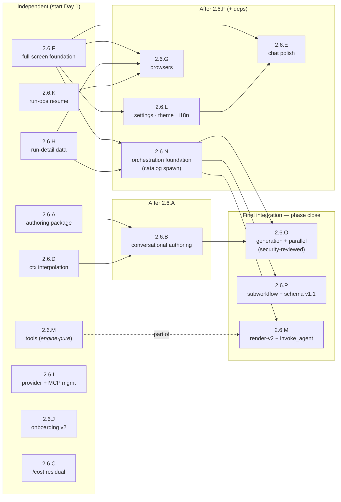

# Phase 2.6 — Conversational Authoring and the First-Class CLI

> Status: Planned — **next up**. Depends on the Phase 2.5 spine (the wired tool-environment and the
> per-tool approval / mode system), which is **complete** (M2.5-4, PR #69, 2026-07-08), so this phase is
> now unblocked.
>
> **Rewritten 2026-07-08**, last revised **2026-07-09** (child-session orchestration split into
> **2.6.N / 2.6.O / 2.6.P** along a safety gradient; the artifact-directory two-root model + the
> `schema_version` 1.1 additive-migration decision finalized; UX polish, syntax highlighting, expanded
> locales, Home mockup — after the Phase-2.5 close), expanding the original authoring-and-parity scope
> into the phase that makes the CLI a **first-class, Home-centric product**. The rewrite folds three
> inputs: the maintainer's CLI-experience findings, a competitor research pass (opencode, Claude Code,
> Codex CLI, Gemini CLI, Temporal/`gh run`-class run tooling, Aider/Goose/Amp/Cursor/Copilot), and a
> line-by-line triage of [../deferred-tasks.md](../deferred-tasks.md) (the now-doable items are pulled in
> below, each mapped to a workstream). Workstreams **2.6.A–E keep their original identities** (they are
> referenced by ADR-0058/0059/0060 and the deferred-tasks doc); **2.6.F–P were added**
> (child-session orchestration moved from Phase 3 by maintainer decision 2026-07-08, then split N/O/P
> on 2026-07-09).
>
> **Note (2026-07-07):** **2.6.C**'s mid-session `/models` model **reseat shipped early in 2.5.G** (ADR-0059,
> PR #66, merged 2026-07-07); 2.6.C is retained for the residual per-model cost-breakdown read and as the
> cross-reference home.

- **Related**: [../README.md](../README.md), [phase-2.5-cli-consolidation.md](phase-2.5-cli-consolidation.md), [phase-2-cli.md](phase-2-cli.md), [phase-3-desktop.md](phase-3-desktop.md), [phase-5-managed-inference.md](phase-5-managed-inference.md), [node-runtime-upgrade.md](node-runtime-upgrade.md), [../deferred-tasks.md](../deferred-tasks.md), [../../reference/cli/commands.md](../../reference/cli/commands.md), [../../reference/cli/home.md](../../reference/cli/home.md), [../../reference/cli/chat-session.md](../../reference/cli/chat-session.md), [../../reference/shared-core/built-in-tools.md](../../reference/shared-core/built-in-tools.md), [../../reference/contracts/config-spec.md](../../reference/contracts/config-spec.md), [../../reference/contracts/workflow-yaml-spec.md](../../reference/contracts/workflow-yaml-spec.md), [../../reference/contracts/agent-yaml-spec.md](../../reference/contracts/agent-yaml-spec.md), [../../decisions/README.md](../../decisions/README.md) (ADR-0058–0060 + the new ADRs below)

The second half of the consolidation work begun in
[phase-2.5-cli-consolidation.md](phase-2.5-cli-consolidation.md), now widened into the phase that finishes
the CLI as a product. It realizes the tagline — *"Start as an agent. Ship the workflow. Own every run."* —
**entirely inside the terminal**: a conversation authors a standards-valid workflow, agents spawn sub-agents
and invoke workflows for complex tasks, the Home starts and monitors runs, the run history is drillable to
per-node detail. Every management task (providers, models, MCP, settings, gates) is doable from the Home
without dropping to a shell subcommand. The chat renders syntax-highlighted code blocks; the CLI speaks
five languages. When this phase closes, `relavium` in a terminal is a first-class experience on par with the
best agentic CLIs — while keeping the postures they lack: OS-keychain-only secrets, a fail-closed approval
floor, and git-committable YAML artifacts.

## TL;DR

Phase 2.6 makes bare `relavium` a **full-screen, Home-centric** product. Key outcomes in 7 milestones:

- **Conversational authoring** — a free-text request produces a strict-valid `.relavium.yaml`,
  authored and run from the Home; `{{ctx.*}}` interpolation and `agent run --input` land.
- **Everything managed from the Home** — providers, MCP servers, agents, workflows, runs, and
  run-ops (budget/gate resume) with no shell subcommand required.
- **Drillable, attributed run history** — list → run → node drill-down with per-node model/agent/cost
  attribution, bounded tool traces, and cross-process live watch.
- **Competitor-toolbelt parity** — `edit_file`, `search_files`, `find_files`, `todo`, `ask_user`,
  working `web_search`, wired `invoke_agent`; syntax-highlighted code blocks in chat — each
  YAML-selectable and mode-gated.
- **Agent orchestration** — chat agents autonomously spawn sub-agents and invoke workflows for
  complex sub-tasks; workflows call workflows via `subworkflow` nodes; standardized I/O contracts;
  parent-child lineage tracking; auto-cleaned artifacts.
- **Settings, theming, localization** — `/settings` over the config-write contract; three built-in
  themes (default / high-contrast / colorblind-safe); `en`, `es`, `tr`, `fr`, `de` i18n with CI key-parity.
- **Onboarding v2** — two auth paths: BYOK (live) + Relavium-account stub (disabled, Phase 5).
- **16 workstreams** (2.6.A–P), substrate-first: 2.6.F (full-screen TUI + Node 22 floor) runs first;
  agent orchestration is split by safety gradient into 2.6.N (safe mechanism) → 2.6.O (model-generated
  execution, own security review) + 2.6.P (`subworkflow` node + schema v1.1).

## Goal

Make the bare `relavium` invocation a **full-screen, Home-centric** surface from which the entire product
is used and managed; close the **tool-breadth gap** against competitor CLIs (edit, search, find, todo,
ask-user, working web search) under the existing governance floor; land **conversational authoring** on the
shared `@relavium/authoring` core; give runs a **three-level drill-down** (list → run → node) over durable,
attributed history; enable **agent orchestration** — chat agents spawning sub-agents, workflows invoking
workflows, standardized I/O, and on-the-fly agent generation; and ship **settings, theming, localization,
and syntax-highlighted rendering** — all without breaking the `--json` / CI / non-TTY contract
([ADR-0049](../../decisions/0049-cli-machine-output-contract.md)) or any existing subcommand.

## Outcomes (Definition of Done)

- `relavium` on a TTY opens a **full-screen** (alternate-screen) Home with a scroll/auto-follow viewport;
  the inline renderer remains as an escape hatch; `--json` / `CI` / non-TTY behavior is byte-identical to
  today (regression-harness proven).
- **Everything is manageable from the Home**: provider + key CRUD, model picking, MCP server CRUD +
  status, settings (theme/language/preferences), workflow start/monitor/history with node-level
  drill-down, agent start (any catalog agent) + session resume, gate resolution (human **and** budget),
  and authoring (wizard + conversational). No routine task requires a shell subcommand; subcommands stay
  first-class for scripting/CI and are never removed.
- A `@relavium/authoring` package is the shared authoring core; a conversational request produces a
  strict-valid, catalog-validated `.relavium.yaml`, written only under approval, offered to run it in-place.
- The **toolbelt** reaches competitor breadth — `edit_file`, `search_files`, `find_files`, todo/plan,
  `ask_user`, an actually-working `web_search`, and `invoke_agent` (wired for chat) — each engine-pure,
  YAML-selectable, mode-gated, and rendered first-class (collapsible detail, diffs at the approval
  prompt, syntax-highlighted code blocks) behind a security-reviewed render contract.
- Session `{{ctx.*}}` interpolation lands (ADR-0060) and `agent run --input` is unblocked.
- Run history is **attributed and drillable**: per-node model/agent/cost durable, a bounded secret-free
  tool trace, gate-resolve TOCTOU closed at the store, crashed runs reconciled, cross-process runs
  watchable live at node granularity.
- The CLI speaks **`en`, `es`, `tr`, `fr`, `de`** over a string catalog with CI key-parity, and ships a real theme system
  (default + high-contrast + colorblind-safe) with the color-free path staying legible.
- An agent in a chat session can **autonomously spawn sub-agents and invoke workflows** for complex
  sub-tasks, with standardized I/O contracts, parent-child lineage tracking, hierarchical cost
  attribution, and auto-cleaned temporary artifacts in `~/.relavium/artifacts/` — closing the
  largest deliberate parity gap. Workflows can invoke other workflows via `subworkflow` nodes.
- The onboarding wizard offers **two auth paths** — BYOK (live) and *Sign in with a Relavium account*
  (visible, disabled, honestly labeled as coming with managed inference) — behind an Accepted
  forward-design ADR.

## Scope

### In scope

The workstreams below: the authoring spine (2.6.A/B/D), the platform + full-screen TUI foundation (2.6.F),
the Home management surfaces (2.6.G/H/I/J/K), the experience arms (2.6.C residual, 2.6.E, 2.6.L, 2.6.M),
the **child-session and nested execution spine** (2.6.N foundation / 2.6.O generation + parallel /
2.6.P `subworkflow` node + schema v1.1),
and the deferred-tasks items each workstream absorbs (mapped in the
[pull-in table](#deferred-tasks-pulled-into-this-phase)).

### Explicitly out of scope (→ Phase 3 / later)

- The **`read_media` D12 cluster** (host `MediaReadAccess`, scope population, the result-shape contract)
  and `@`-mention of media files — the dedicated, security-reviewed follow-up stands.
- **Full-fidelity reseat tool-context** (the 1.X/1.Z persister/schema extension) — the reseat keeps its
  text-only-transcript notice.
- **File-snapshot undo** (opencode-style revert of a message *and its file changes*) — 2.6.E ships
  conversation-level `/rewind`/`/fork` only.
- **retry-from-node** ([ADR-0040](../../decisions/0040-node-retry-budget-above-the-chain.md) Part B — needs the
  run-attempt model). The 2.6.G run-detail browser must be designed so a later "retry from this node"
  action slots in without rework, but the engine work is Phase 3.
- The **workflow-run `egress`/`os` arms** stay unwired (the recorded 2.5.E design boundary:
  `build-engine.ts` wires `fs`+`process` only). Revisiting that boundary requires its own ADR — it is not
  quietly reopened here.
- A multi-pane dashboard (desktop canvas territory), `output_schema` deep JSON-Schema conformance (new
  validator dependency), the `plugin` ToolSource loader, and cursor pagination for the read commands
  (scale-gated). Tracked in [../deferred-tasks.md](../deferred-tasks.md).

### In-window maintenance obligations (not workstreams)

Two items from [deferred-tasks.md](../deferred-tasks.md) fall inside the likely phase window and should be
actioned during it (maintainer calls, not workstreams): the **OpenAI Sora 2 shutdown (2026-09-24)** —
retarget or disable the 1.AH A3 Sora adapter arm before the date — and **enabling the live-nightly
conformance lane** (CI provider keys), which also unblocks the deferred media-in conformance fixtures.
Both stay tracked in their canonical [deferred-tasks.md](../deferred-tasks.md) entries.

## Work breakdown

### 2.6.A — `@relavium/authoring` package promotion + catalog-aware pre-flight

Unchanged from the original plan. The authoring core exists in-tree (`apps/cli/src/authoring/authoring.ts`,
landed with 2.J) and is promoted to a shared `@relavium/authoring` package so desktop
([phase-3-desktop.md](phase-3-desktop.md)) and VS Code ([phase-4-vscode.md](phase-4-vscode.md)) can consume
the same core.

**Tasks:**

- Scaffold `packages/authoring` — pure TS, platform-free — and **extract-and-decouple** the existing core
  (it is **not** a free move: `CliError`, `discoverCatalog`, and `findProjectConfigDir` are `apps/cli`
  imports a package may not take — a forbidden `packages → apps` back-edge). Replace `CliError` with a
  platform-free typed error the CLI maps to exit codes at the boundary; keep catalog **discovery** and
  `findProjectConfigDir` CLI-side and pass the catalog **in**. Add an import-zone lint fence banning
  `packages/authoring → apps/cli`. Follow
  [.claude/skills/add-package/SKILL.md](../../../.claude/skills/add-package/SKILL.md).
- Expose a single `validateAuthoredWorkflow(yaml, catalog)` = `parseWorkflow` **+**
  `validateWorkflowWithCatalog`, and **back-port** it into `create`/`import`/`export` (today those are
  parse-only; only the run path catalog-validates), so `create` can never accept a model/modality the run
  path rejects.
- Add direct unit tests for `detectAndParse` / `buildAuthored` / `validateAuthoredWorkflow` (today only the
  command wrappers are tested).

**Acceptance:** `@relavium/authoring` builds and imports **only** `@relavium/core` + `@relavium/shared`
(lint-fence enforced); the CLI consumes it with `create`/`import`/`export` round-tripping **unchanged**
(regression-tested); `create` runs the same catalog pre-flight the run path uses; the core is directly
unit-tested. **Required ADR:** [ADR-0058](../../decisions/0058-relavium-authoring-package-and-conversational-authoring.md)
(Proposed → Accepted when this workstream begins).

### 2.6.B — Conversational + wizard authoring in the Home

The original conversational-authoring workstream, plus the in-Home wizard surface and two absorbed
deferred items.

**Tasks:**

- **Conversational authoring** (unchanged): an authoring agent (an `--agent` profile or a `/author` mode)
  whose system prompt references a **product-side knowledge pack derived — never restated** — from
  [node-types.md](../../reference/shared-core/node-types.md),
  [workflow-yaml-spec.md](../../reference/contracts/workflow-yaml-spec.md),
  [agent-yaml-spec.md](../../reference/contracts/agent-yaml-spec.md) and the Zod schemas (one minimal
  example per node type; a no-duplication check gates acceptance; never under `.claude/` — the product
  agent does not read repo-development skills). Self-correct loop: model → YAML → `detectAndParse` /
  `validateAuthoredWorkflow` → field-named, secret-free error → model fixes. The artifact is written only
  under accept-edits/auto with the scope-tiered host, then the surface offers *"Run it now?"* — closing
  author → run on one screen.
- **In-Home authoring wizards**: bring `relavium create`'s wizard into the Home/chat palette (`/create` →
  an ink-native agent/workflow wizard over the same injectable prompter seam), so authoring starts from
  the Home, not only from a shell command.
- **`AgentParseError` reaches the chat surfaces** *(deferred pull-in)*: a malformed `.agent.yaml` on
  `chat --agent` / `agent run` currently collapses to a generic exit-1 internal error; resolve the design
  call (wrap into `CliError('invalid_invocation')` at `resolveChatAgent`, or teach the top-level renderer
  to render a typed `AgentParseError` as an exit-2 invocation fault), revise the pinned test deliberately,
  and relativize the echoed source path. The conversational self-correct loop depends on these diagnostics
  being visible.
- **Import consent gate** *(deferred pull-in, security)*: gate the first spawn of an MCP `stdio` server
  declared by an **untrusted-provenance** imported artifact behind explicit consent, and pin `npx` package
  versions for auto-install servers ([ADR-0052](../../decisions/0052-inbound-mcp-client-package-lifecycle-registration.md) §2)
  — the authoring/import path this phase matures is exactly the surface that makes this live.
- **Discoverability of the UVP** (unchanged): the proactive, dismissible, config-opt-out *"turn this
  session into a workflow with `/export`"* hint.

**Acceptance:** a free-text request yields a strict-valid `.relavium.yaml` passing the same pre-flight as
`relavium run`; an invalid draft is corrected via the secret-free loop; files are written only with
approval; `/create` works from the Home; a malformed agent YAML surfaces its field-named, positioned
diagnostic on every surface; the untrusted-import consent gate holds; a security review of the write
surface + the secret-taint gate + the import gate passes. **Required ADR:** shared with 2.6.A (ADR-0058).

### 2.6.C — Mid-session model reseat (shipped early) — residual

> **Shipped early in 2.5.G** (ADR-0059, PR #66, 2026-07-07): the `/models` mid-chat reseat, per-message
> `modelId` attribution, and the context-loss notice. Retained for the residual below and as the
> cross-reference home.

**Tasks:** the per-model **cost breakdown** read (`/cost` gains a per-model section over the shipped
attribution columns); verify the context-loss notice covers the whole `chat-resume` family.

**Acceptance:** `/cost` shows per-model spend for a reseated session; the notice is asserted on resume
surfaces. **Required ADR:** none (ADR-0059 is Accepted).

### 2.6.D — Session `{{ctx.*}}` prompt interpolation

Unchanged in intent; one absorbed deferred item makes the security mandate explicit.

**Tasks:** resolve `{{ctx.*}}` in the session system prompt per
[ADR-0060](../../decisions/0060-session-ctx-prompt-interpolation.md) — template substitution only, with the
**per-variable provenance/taint marker** on `SessionContext` (`--input`-derived values are untrusted by
provenance and never resolve in system position); unblock `agent run --input k=v`. *(Deferred pull-in:)*
land the **parse-time gate on system-bound fields** — when trusted `{{inputs}}`/`{{ctx}}` are admitted into
system positions, untrusted `run.outputs`/`read_file` references there are rejected at parse (the analyze/
collect gate), preserving the existing secret-taint protection.

**Acceptance:** `{{ctx.*}}` resolves in a session prompt with the taint rule enforced and tested;
`agent run --input` is accepted and reaches the prompt; the ADR-0060 mandatory security review passes.
**Required ADR:** ADR-0060 (Proposed → Accepted).

### 2.6.E — Chat & input parity polish

The competitor-parity chat ergonomics (the theme system moved to 2.6.L; tool-call rendering moved to
2.6.M). Everything here is TTY-interactive-only; the non-interactive contract is untouched.

**Tasks:**

- **Markdown + code-block rendering + syntax highlighting** in the transcript: a minimal in-house
  markdown renderer (code fences, inline code, bold/italic, headings, lists, blockquotes) with
  **`ink-syntax-highlight`** for first-class syntax highlighting in code blocks. `ink-syntax-highlight`
  is a thin ink-native wrapper around `highlight.js` + `cli-highlight` — it outputs native ink
  `<Text color>` elements (integrates with the 2.6.L theme system), supports 190+ languages with
  automatic detection, and tree-shakes to specific languages for bundle control. This requires a
  dedicated ADR (new dependency — `highlight.js` + `cli-highlight`; evaluated over the in-house
  alternative on breadth, maintenance burden, and bundle impact), a catalog entry in
  `pnpm-workspace.yaml`, and a tree-shaken language set (a curated default set for the built-in
  agent; additional languages load on demand). The
  markdown-to-ink component maps rendered nodes to ink's `<Text>` / `<Box>` primitives under the
  existing `stripTerminalControls` sanitization floor.
- **Advanced `@`-injection**: glob / directory expansion respecting ignore files (the ADR-0061 follow-up;
  the in-house matcher from the 2.5 close is the substrate).
- **`/rewind` + `/fork`** at conversation level: rewind truncates to a chosen prior message and continues
  (via the `/clear`-style host-swap + `reconstructSessionState` machinery); fork branches a session into a
  new `sessionId` preserving the original. File-change revert is explicitly out (see out-of-scope).
  **Analysis gate:** the interaction with child sessions must be decided during implementation —
  (a) `/rewind` past a point where sub-agents were spawned: are in-flight children cancelled? are
  completed children's results retained in the truncated transcript? (b) `/fork` of a session that
  spawned children: does the fork include the child lineage or start clean? The answer affects the
  `reconstructSessionState` machinery and the parent-child DB model; a dedicated design spike during
  2.6.E implementation will resolve both cases before the feature lands.
- **Type-ahead message queue**: messages typed while a turn runs are queued (navigate/edit the queue), sent
  on turn end — with a steer-now affordance considered (send-as-interrupt).
- **Input history search**: `Ctrl+R` reverse search over per-project prompt history.
- **`$EDITOR` compose** (`Ctrl+G`): edit the pending prompt in the external editor.
- **`/copy`**: copy the last assistant reply to the system clipboard. Additionally,
  **copy-on-select**: text selected with the mouse in the terminal copies to the clipboard
  automatically when the terminal supports it; no explicit command needed. The `/copy` command
  remains for keyboard-only workflows and terminals without clipboard support.
- **`/help` v2**: a full-screen, sectioned help screen (commands, keybindings, modes) replacing the flat
  text list, once 2.6.F's renderer lands. Supplemented by a **quick-reference cheat sheet** overlay
  (`Ctrl+O` or `?` — a half-screen modal summarizing current-context keybindings: the mode-aware
  approval keys, the browser nav keys, the chat input keys — dismissible with any key). The footer
  hint-bar remains the primary discoverability surface; the cheat sheet is the deliberate-lookup
  companion.
- **Transcript search** (`Ctrl+F` / `/find`): incremental text search within the visible chat
  transcript — type to jump to the first matching assistant turn, Enter for next match, Esc to
  dismiss. Scoped to the loaded transcript viewport (not a DB query); a full-history search is
  deferred (scale-gated, needs the transcript-index follow-up).

**Acceptance:** each affordance works in chat and the in-Home chat; `--json`/plain surfaces reject or
ignore them exactly as the ADR-0049 contract requires; the message queue and rewind have reducer-level
tests. **Required ADR:** `ink-syntax-highlight` dependency + markdown rendering architecture.

### 2.6.F — Platform floor + the full-screen TUI foundation

The substrate workstream — it runs **first** because the browsers (2.6.G), settings screens (2.6.L), and
render-v2 (2.6.M) all build on it.

**Tasks:**

- **Node dev/CI bump now**: `.nvmrc` 22 → 24 (Active LTS) — one line, non-breaking, no ADR.
- **Supported-floor decision** *(maintainer decision, recommended: take it early in-phase)*: raise the
  published floor 20.12 → `>=22` — a breaking release for `relavium` (pre-1.0 → a 0.x MINOR bump, e.g. `0.2.0`, per [ADR-0067](../../decisions/0067-node-supported-floor-22-reaffirm-better-sqlite3.md)) that restores `better-sqlite3` prebuild
  coverage (Node 20 is EOL) and unlocks ink 7 / `node:sqlite` / eslint 10 / vitest 5. Full analysis:
  [node-runtime-upgrade.md](node-runtime-upgrade.md). This **supersedes
  [ADR-0021](../../decisions/0021-node-sqlite-driver-better-sqlite3.md)** → its own governed PR behind a
  superseding ADR. Ink 7 is evaluated in the same governed PR but adopted only if the floor is raised to
  `>=22`; otherwise the renderer ships on the current ink major.
- **Full-screen renderer**: an alternate-screen (DECSET 1049) mode for the Home + chat with a real
  viewport — scrollback inside the app (PgUp/PgDn, wheel where supported), **auto-follow** that pauses when
  the user scrolls up and resumes at bottom, and the input pinned to the bottom row. This structurally
  fixes the current bug where long responses clip/truncate content beyond the terminal height — scrolling
  up must reveal the full response from the beginning without top-truncation. The inline (scrollback)
  renderer is **retained** and byte-identical for non-TTY/CI; an explicit escape hatch (`--no-alt-screen`
  or a config key) keeps the inline mode available on a TTY. If the full-screen renderer is deferred or
  the inline mode is active, a separate inline-viewport fix must backfill the scrollback-preservation
  behavior for long responses so that content above the visible area is never lost. Renderer choice is
  orthogonal to session state (switching relaunches the view in place, conversation intact). The run TUI's
  persistent plain-text exit summary is preserved on unmount.
- **Branded Home banner** — ✅ **shipped in 2.6.F Step 5g**. `show_banner` is spec'd in
  [config-spec.md](../../reference/contracts/config-spec.md) and its behaviour in
  [home.md](../../reference/cli/home.md); this entry does not restate them. Two deviations from the plan
  above, recorded in [ADR-0068](../../decisions/0068-full-screen-tui-renderer-ink7-harness.md)'s dated
  amendments: the **"first five Home opens"** counter became an **empty-Home** trigger (a durable counter
  would need a `history.db` migration or a `config.toml` auto-write per open — the wrong trade for a
  cosmetic element), and **themes** moved to **2.6.L**, so 5g ships colour + `NO_COLOR` only.
- **TUI component test harness** *(deferred pull-in)*: the first CLI component-render harness (a new
  devDependency — part of this workstream's ADR), so render-cadence bugs (the 2.5.H frozen-clock class)
  get regression tests; add performance regression thresholds (frame time / render count) for the
  full-screen frame loop.
- Resize/degrade behavior and the documented screen-reader constraint (raw-mode TUI) with the non-TTY
  fallback — carried from the original 2.6.E and owned here. The full-screen alternate-screen mode
  (DECSET 1049) is inherently inaccessible to screen readers; the **`--no-alt-screen`** escape hatch
  and the config key `[preferences].alt_screen` provide an explicit path back to the inline renderer
  where the terminal emulator's own accessibility support applies. A dedicated accessibility note in
  the user-facing docs will document this trade-off and the escape hatch.

**Acceptance:** bare `relavium` on a TTY opens the full-screen Home; scroll + auto-follow work; the
`--json` / CI / non-TTY paths are byte-identical to today (harness-proven); the floor-bump ADR is Accepted
and released as a breaking 0.x MINOR bump (e.g. `0.2.0`, per ADR-0067) with migration notes; the component harness runs in CI with at least the
frozen-clock regression pinned. **Required ADRs:** the ADR-0021-superseding floor ADR + a full-screen
renderer & TUI-harness ADR.

### 2.6.G — Home management browsers: workflows, runs, agents

The interactive browsers that make the Home the management center. The interaction model follows the
proven three-level drill-down (list → detail → step detail) with `gh run`-style progressive disclosure
(every screen hints the next action) and picker-on-omitted-id semantics. The maintainer's separate-command
sketch (`/active-workflows`, `/workflow-run-history`, …) is **deliberately simplified** into two tabbed
browsers with argument deep-links — same reach, fewer commands.

The post-2.6 full-screen Home renders with the branded banner, the management strip, and the chat prompt
in a single viewport:

```text
╔══════════════════════════════════════════════════════════════╗
║  relavium                                v0.2.0 · en · ask  ║  ← banner (dismissed after 5 opens)
╚══════════════════════════════════════════════════════════════╝

  /workflows  /agents  /providers  /mcp  /settings  /permissions   ← tab bar (^T / click)

  ═══ Defined ─── Active ─── History ────────────────────────────
  ▶ deploy · last run 3h ago · ✓ completed                [Run] [Export]
    code-review · last run 1d ago · ✗ failed — Node 3     [Run] [Detach]
    nightly-build · invalid — unknown model "claude-5"          [Fix]

  ⭐ Pinned ─────────────────────────────────────────────────────
  ★ deploy · completed 3h ago · $0.04

  —————————————————————————————————————————————————————————————
  Enter drill-down · p pin · q Home · /filter · ↑↓ navigate
```

The **tab bar** provides one-key access to every management surface — `/workflows`, `/agents`,
`/providers`, `/mcp`, `/settings`, `/permissions`. `Ctrl+T` cycles tabs; each tab remembers its
last drill-down position.

> **Design note:** the ASCII mockup above illustrates the `/workflows` browser as a representative
> example. Every management tab (`/workflows`, `/agents`, `/providers`, `/mcp`, `/settings`,
> `/permissions`) will be designed with the same interaction model (drill-down navigation, breadcrumb
> header, loading states, pinned items where applicable) but with surface-specific content and
> actions. The exact visual design — layout, column widths, color assignments, status glyphs,
> action-button placement — will be developed during implementation through a multi-alternative
> evaluation (ASCII-art vs Unicode box-drawing, compact vs spacious, light vs dark, etc.) across
> the three built-in themes, with the chosen design applied uniformly to all tabs. The mockup
> above is a design *direction*, not a pixel-accurate spec.

**Tasks:**

- **`/workflows` browser** (Home + chat): tabs **Defined | Active | History**, deep-linkable as
  `/workflows [defined|active|history]`.
  - *Defined*: the disk catalog (slug, name, node count, last-run status/age; invalid files flagged) with
    actions — **Run** (foreground: graduate into the live run view), **Run detached** (print the runId,
    stay in Home), **Export**, reveal path. Starting a run from the Home is new — `run` stays shell-first
    for scripting, but the Home can now launch.
  - *Active*: live runs (status, current node, attempt, elapsed, cost) — including runs owned by **other
    processes** via a poll-based `run_events` tail (seq + WAL make this feasible today), disclosed as
    node-boundary granularity; a gate-/budget-blocked run shows the resolve affordance inline. Esc detaches
    without killing; cancel is offered with its cooperative semantics.
  - *History*: finished runs (status glyph, short id, workflow, relative start, duration, **cost** — the
    differentiator no competitor CLI lists) with keystroke filters (status/workflow) — no query DSL. Enter
    → **run detail**: header (status, timing, totals, entry point) + node table (per-node status, duration,
    attempt, tokens, cost) + a "jump to first failed node" key. Enter on a node → **node detail**: the
    input / output / duration / tokens / error quintet plus the bounded tool-trace and event timeline
    (Scheduled/Started/Completed triplets collapsed into one expandable row).
  - **Navigation**: Enter drills down (list → run detail → node detail); **Backspace** or **Esc**
    returns to the previous level; `q` returns to the Home strip from any level. The current
    level and parent breadcrumb are shown in the header row of every screen. The browser
    **preserves drill-down position** — returning from the Home to the browser restores the
    last-viewed screen rather than resetting to the top-level list.
  - **Loading states**: drill-down reads from `history.db` may encounter cold-cache latency;
    each navigation shows a bounded `Loading…` spinner (with Esc to cancel). A read that exceeds
    2s shows the elapsed time; a failed read surfaces a one-line error notice rather than a
    white screen.
  - **Bookmarking**: any run or workflow can be **pinned** from its detail screen (`p` key —
    persisted to `history.db`). Pinned items appear in a **⭐ Pinned** section at the top of the
    History tab, above the chronological list. Un-pin with `p` again. Pins survive across
    sessions.
- **`/agents` browser** (Home + chat): tabs **Defined | Sessions**. *Defined*: the agent catalog with
  **"start a chat with this agent"** (closing the Home's built-in-agent-only gap). *Sessions*: recent +
  in-progress sessions — Enter resumes **in place** (the in-Home chat machinery), with a detail view
  (transcript summary, cost, model attribution). Child sessions spawned by a parent agent are shown
  **indented beneath their parent** with a `└─` tree-drawing prefix and the sub-agent's name; a
  collapsed parent hides its children (toggle with `Space`). A filter (`/sessions --roots`) shows
  only root (user-initiated) sessions, hiding children.
- **Actionable Home strip**: the Attention/Continue rows become focusable — a gate row opens an inline
  resolve card (approve / reject / input, via 2.6.K's shared resume core), a failed run opens its detail,
  a session row resumes, a run row opens detail. The strip refreshes on an idle tick while the Home is
  open (today it is snapshot-static).
- **Permission management** *(new — script execution + tool grants via slash commands)*: when an agent
  issues a `run_command` for a not-yet-allowlisted command (e.g. `python analyze.py`, `node build.js`,
  `curl -s https://...`), the interactive surface prompts the user with a typed, informative approval
  card — not a generic allow/deny, but one that names the exact command and offers three grant scopes:
  **(a) once** (this turn only), **(b) this session** (in-memory, gone on `/exit`), **(c) this project**
  (writes to `.relavium/project.toml` `[chat].allowed_commands` via the ADR-0063 config-write contract).
  A **global grant** (writes to `~/.relavium/config.toml`) is available via an explicit `/permissions`
  slash command in the Home and chat. The `/permissions` command opens a management screen listing all
  active grants (command allowlist, domain allowlist, MCP servers, egress endpoints) with add/remove
  actions — the single pane for the user to audit and revoke what an agent has been granted. A
  **`once`-granted** command is never persisted; a **session/project/global** grant writes the
  appropriate config layer atomically. An allowlist whose *only* entry is default-approved (like the
  curl/wget research item in 2.6.M) is surfaced here as a built-in grant that can be revoked.
- **Liveness**: wire `engine.reconcile()` (never invoked today) on Home open and the browser/status reads,
  so crashed runs settle `run:failed{internal}` instead of showing as zombie `running` rows; expired gates
  settle per their timeout policy via 2.6.K's re-arm.
- Non-interactive parity: extend the read *commands* minimally (`relavium list --runs`, `status <runId>`
  for finished runs, `logs --follow/--failed`) so scripting keeps pace with the TUI —
  [ADR-0049](../../decisions/0049-cli-machine-output-contract.md)-conformant.
- **Detached-run notification**: when a run is started as "Run detached" from the Home and completes
  (or fails), surface a notification on the Home's next idle tick — an `Attention required` row with
  the outcome, linked to the run detail. For a chat that remains open with a detached run in the
  background, surface a one-line `notice` in the transcript on completion. This hooks into the
  existing `notify` tool's desktop-notification path only when the OS-native notifier is configured;
  the Home-side notice is the reliable default.

**Acceptance:** every action above works from the Home without a shell command; the three-level drill-down
is complete over 2.6.H's data; a run started in another terminal is watchable live at node granularity;
zombie runs reconcile; the browsers degrade at <80×24; the machine-output contract is untouched
(harness-proven). **Required ADR:** management browsers + run drill-down contract (shared with 2.6.H).

### 2.6.H — Durable run detail: the history data layer

The store/engine half that 2.6.G's browsers read. Today the durable record is node-boundary-only and
unattributed (step rows never carry agent/model/input; `run_costs.modelId` is always NULL; the firehose is
never persisted; several consistency gaps are recorded in the deferred doc). This workstream makes the
durable record complete enough for a first-class drill-down — additively.

**Tasks:**

- **Step attribution**: populate `step_executions.agentId/agentSnapshot/modelId/inputJson` and
  `run_costs.modelId` from the events the engine already has; give `node:skipped` a step row (thread
  `nodeType` additively); widen the `StepRecord` projection (output/error/tokens) + a step-detail read.
- **Exact per-node cost**: an optional `nodeCostMicrocents` on `node:completed` — an additive run-event
  schema field amending [ADR-0036](../../decisions/0036-run-loop-substrate-event-bus-and-execution-host.md)
  append-only (optional for backward-compat with existing `--json` consumers; when present, the per-node
  cost is exact, not a cumulative-delta approximation) — so parallel fan-out attributes exactly instead of
  via cumulative deltas; carry final totals on `run:failed` / `run:cancelled` (closing the documented
  undercount).
- **Bounded durable tool trace** *(ADR decision)*: persist secret-free per-step tool **summaries** —
  toolId, the sanitized approval-preview target, outcome (ok/denied/failed), duration — never args or
  result bytes; the token/reasoning firehose stays unpersisted (the ADR-0036 posture holds). This is what
  the node-detail screen shows as "tool activity".
- **Store-level gate uniqueness** *(deferred pull-in)*: a uniqueness constraint on `human_gate:resumed`
  per `(runId, gateId)`, closing the cross-process gate-resolve TOCTOU window at the store.
- **Consistency fixes** *(deferred pull-ins)*: wrap the run-resume reconstruction reads
  (`loadRun` + `loadRunEvents` + `loadStepExecutions`) in one read transaction; make the chat persister's
  per-turn writes atomic (`BEGIN IMMEDIATE` per turn); the **content-level workflow-identity guard** on
  resume over the frozen `runs.workflow_definition_snapshot`.
- **Run-submission idempotency** *(deferred pull-in)*: a dedup guard for Home-launched runs (double-Enter
  must not start two runs).

**Acceptance:** a finished run's detail (attribution, exact per-node cost, tool summaries, skipped nodes)
is fully reconstructable from `history.db`; the TOCTOU constraint holds under a concurrent two-process
test; the schema/event changes are additive and `--json` consumers are unaffected; migration provided.
**Required ADR:** shared with 2.6.G (browsers + durable run-detail; amends ADR-0036 additively).

### 2.6.I — Provider & MCP management from the Home

Closing the two biggest "must drop to shell / must hand-edit TOML" gaps: provider/key CRUD outside the
onboarding wizard, and MCP servers, which today are managed **only** by hand-editing `[[mcp_servers]]`
config (there is no `relavium mcp` command at all; the only runtime visibility is `/doctor --deep`).

**Tasks:**

- **`/providers`** (Home + chat palette): list providers with key status + redacted live verify; add a
  provider (SSRF-validated base URL rules unchanged); set key (masked, keychain-only — the wizard's tested
  `set-key` path); remove key (confirmed destructive); test. All over the existing `runProviderCommand`
  cores — no new key-handling code paths.
- **`/mcp`** (Home + chat palette): list registered servers with a **read-only** status report (the
  `/doctor --deep` machinery — never connects/spawns on open); add / edit / remove server registrations
  (stdio + `http`/`sse`/`websocket` behind the existing SSRF floor); named secrets set via a masked prompt
  into the isolated `mcp-secret:*` keychain namespace — **never** into TOML (env placeholders only).
- **`relavium mcp list/add/remove/test`** shell family for scripting parity (`--json`-conformant).
- **Config-write extension** *(ADR)*: extend the
  [ADR-0063](../../decisions/0063-cli-config-write-contract.md) typed-setter contract to structured
  `[[mcp_servers]]` writes (which config file owns a tool-written registration, the comment-loss caveat,
  atomicity, secret-incapability by construction).
- **Deferred MCP cluster** *(pull-ins)*: the durable cross-invocation **tool-list cache** (~1h TTL,
  transport-covering key — startup latency); **network header auth**
  (`Authorization: Bearer {{secrets.<name>}}` via the SDK transport's headers, resolved from
  `mcp-secret:*`, never logged/serialized — [ADR-0052](../../decisions/0052-inbound-mcp-client-package-lifecycle-registration.md) §6);
  **mid-call abort propagation** (the engine's `AbortSignalLike` forwarded to the in-flight `tools/call`,
  so a mid-turn Esc cancels an MCP call instead of only tearing down); optionally the generalized
  `SecretResolver` seam alongside header auth.

**Acceptance:** providers and MCP servers are fully manageable from the Home and the shell; a network
server with header auth connects with its secret resolved from the keychain; discovery startup is
measurably faster with the cache; Esc aborts an in-flight MCP call; the mandatory security review of the
secret handling + config-write surface passes. **Required ADR:** MCP management surface + config-write
extension (extends ADR-0063; sits on ADR-0052/0053).

### 2.6.J — Onboarding v2: two auth paths + the Relavium-account stub

The first-run wizard gains the product's future shape without pulling Phase 5 forward.

**Tasks:**

- **Auth-path select** as the wizard's first step:
  - **(a) Connect a provider (bring your own API key)** — the existing, live flow (provider select →
    masked key → live validation with cause-aware retry → keychain → starter default model), unchanged.
  - **(b) Sign in with a Relavium account** — **visible but disabled** ("coming with managed inference"),
    rendered dimmed with an honest one-line note. Discoverable from day one, selectable never (this
    phase).
- **The account-auth forward-design ADR** (Accepted in this phase; **implemented in Phase 5**,
  [phase-5-managed-inference.md](phase-5-managed-inference.md), riding
  [ADR-0012](../../decisions/0012-managed-inference-dual-mode.md)–[ADR-0015](../../decisions/0015-managed-mode-data-handling-and-compliance.md)).
  It records the decided shape so the stub is honest:
  - The account API key **determines entitlement server-side** — an individual subscription or an
    organization membership activates automatically from what the key is provisioned for; the user never
    picks at login.
  - **No-subscription UX is a first-class state, never a dead end**: a typed, actionable message with the
    BYOK path offered on the same screen.
  - **BYOK always coexists**: a signed-in user with no (or an exhausted) subscription keeps full BYOK
    provider use; at-limit degrades gracefully (finish the turn → wait/upgrade → BYOK fallback).
  - Mechanics reserved for Phase 5: key-paste first (copy from the account portal), browser OAuth +
    device-code later; keychain storage; plan-gated features; org-forced login method.
- Optional wizard polish once 2.6.L lands: a theme step; the outro points at `/help` + `/models`.

**Acceptance:** a keyless first run shows both paths with (b) disabled and honestly labeled; path (a) is
regression-proven unchanged; the forward-design ADR is Accepted with Phase-5 ownership explicit.
**Required ADR:** onboarding auth paths + Relavium-account forward design.

### 2.6.K — Run-ops: the resume-path follow-up (budget resume, secret re-provide, gate lifecycle)

The focused follow-up the 2.5 close deliberately deferred — both headline items refactor the
security-sensitive `gate.ts` cross-process resume path, so they land together with fresh context.

**Tasks:**

- **Extract a shared cross-process resume core** from `gate.ts` (snapshot reload → checkpoint reconstruct →
  `resumeFromCheckpoint` → drive) that the gate command, the budget command, and 2.6.G's inline resolve
  card all consume.
- **`relavium budget resume <runId> [--approve|--abort]`** *(deferred pull-in)*: the documented command
  over the engine's existing budget-gate resume; plus the Home affordance on budget-paused rows.
- **Secret re-provide on resume** *(deferred pull-in, security)*: let the operator re-supply a
  `secret`-typed input on a cross-process resume (stdin-only, `provider set-key` discipline; or keychain
  re-resolution keyed by the input `ref` (its stable identifier in the workflow YAML)),
  relaxing today's fail-closed `MaskedSecret` exit-2 — behind a
  **mandatory security review** (this deliberately relaxes a fail-closed guarantee into
  allow-with-re-provisioning).
- **Gate timeout re-arm on rehydration** *(deferred pull-in)*: re-arm a still-pending gate's persisted
  `expiresAt`/`timeoutAction` against a real clock on reconcile/resume, so a crash-while-paused run's
  deadline is honored.
- **Exit-code fidelity** *(deferred pull-in)*: distinguish a gate park from a media-only park on
  `run:paused` (media parks are reachable since 2.S) in the human message and, if decided, the exit code —
  documented in [commands.md](../../reference/cli/commands.md).
- **Session budget pause/resume** *(deferred pull-in, engine)*: the chat cost-cap `pause_for_approval`
  rides the EA4 pause/resume machine (today it settles the turn loudly) — the ADR-0028 session arm.

**Acceptance:** a budget-paused run is resumable from the CLI and the Home; a secret-bearing run is
resumable via re-provide with the security review passed; timers re-arm; a chat hitting its cost cap can
pause-and-approve instead of failing the turn; the shared resume core is the only resume path (no
duplication). **Required ADR:** none new (rides ADR-0028/ADR-0006); the security review is the gate.

### 2.6.L — `/settings`, the theme system, and localization

The personalization arm: a settings surface over an extended config-write contract, a real theme system,
and the first localized agentic CLI (a genuine differentiator — competitor i18n is white space).

**Tasks:**

- **Theme system**: a palette abstraction replacing the hardcoded literal ink colors; named built-ins —
  `default`, `high-contrast`, `colorblind-safe` (the accessibility pair carried from the original 2.6.E),
  and a terminal-respecting `ansi` theme (`NO_COLOR`/`--no-color` overrides every theme identically: all
  color codes dropped, semantic markers degraded — the `ansi` theme is not a color-free bypass);
  `[preferences].theme` (schema-present, read by nothing today) finally read; **`/theme`** switcher with
  live preview. Semantic markers (`✓`/`✗`/`⏸`) survive `--no-color`/`NO_COLOR` and degrade to ASCII
  (`[v]`/`[x]`/`[||]`) without Unicode.
- **`/settings`** (Home + chat): a sectioned screen (appearance / language / chat defaults / update
  channel) over the **extended** [ADR-0063](../../decisions/0063-cli-config-write-contract.md) typed-setter
  (new keys: `theme`, `language`; still global-preferences-only, atomic, secret-incapable by construction —
  project files stay hand-authored).
- **i18n foundation**: an in-house string catalog (data ≠ code — zero conditional logic in translation
  data; no runtime dependency expected, else ADR); `[preferences].language`; locales **`en`, `es`, `tr`,
  `fr`, `de`** in-phase; a CI **key-parity test** (fails on missing/extra keys across all locales)
  + a dead-string lint — landing the deferred i18n standard as a `docs/standards/` entry. The five
  in-phase locales are all **Latin-script**, so in-phase rendering needs only accent-safe (valid Unicode,
  no special handling) and combining-character-safe layout; full **IME composition** and **wide-character /
  bidi** handling are **not** in-phase acceptance gates. The catalog architecture stays CJK/RTL-ready
  (data ≠ code, no hardcoded width assumptions) so a future CJK or RTL locale needs no re-architecture —
  a deliberate forward-compat posture, not an in-phase deliverable. Pluralization rules for German and
  French are handled by a minimal in-house pluralization helper (selecting key variants by count); Spanish
  and French accented characters are valid Unicode in the terminal and require no special handling.
- Diagnostics/`--json` output stays English-stable (machine contract); localization applies to the
  interactive surfaces.

**Acceptance:** `/settings` edits persist atomically and round-trip; themes switch live incl. the
accessibility pair; the color-free path stays legible; interactive surfaces run fully in all five
locales with CI-enforced key parity; diagnostics and `--json` remain English-stable per
[ADR-0049](../../decisions/0049-cli-machine-output-contract.md); the machine-output contract is
character-for-character unaffected. **Required ADR:** i18n +
theming architecture.

### 2.6.M — The first-class toolbelt: breadth + rendering

Closing the tool gap against competitor CLIs. Today the registry has 13 built-ins with **no** file
edit/patch, **no** content search, **no** find, **no** todo, **no** ask-user, and a dormant `web_search`
(needs an unwired credential resolver). Every addition is engine-pure (Zod args, `llmVisibleParams`,
policy class, bounded results), documented in
[built-in-tools.md](../../reference/shared-core/built-in-tools.md), selectable in agent/workflow YAML, and
sits under the existing governance floor (advertise-filter + fail-closed approval + protected-path/
sensitive-read floors).

**Tasks:**

- **`edit_file`** — exact old→new string replacement (+ `replace_all`, uniqueness guard, read-before-edit
  safety), `fs_write`-governed with a **diff preview** at the approval prompt. The single biggest gap.
- **`search_files`** — bounded in-house content search (workspace-jailed, sensitive-read floor,
  ignore-file-respecting; linear matcher — no regex-DoS surface), idempotent.
- **`find_files`** — glob file finding across the tree (mtime-sorted, bounded), idempotent — promoting the
  current read_file/list_directory glob options into a first-class discovery tool.
- **Todo/plan tool** — a structured, session-scoped task list the model maintains, rendered as a live TUI
  checklist (persists across compaction); ungoverned (no host arm).
- **`ask_user`** — a structured mid-turn question (options + free text) on interactive surfaces via a
  keyboard-owning overlay; typed `tool_unavailable` on non-interactive surfaces; workflows keep
  `human_gate`. When the agent emits `ask_user` mid-turn, the engine **pauses the turn** (stops
  streaming, holds the in-flight state), renders the overlay, waits for user input, then **resumes**
  the turn with the user's answer injected as the tool result — so there is no keyboard-ownership
  race between streaming tokens and the overlay. A turn paused on `ask_user` shows
  `Waiting for your input…` in the transcript; a timeout (configurable, default 5min) auto-dismisses
  the overlay with a `timed_out` error the agent can handle.
- **`web_search` activation** *(deferred pull-in)*: wire the `egressCredentialResolver` from the keychain
  (today a configured search 401s) and document the config-pinned provider contract; `http_request`
  unchanged.
  - **Architecture note:** `web_search` is a **Relavium-engine-side HTTPS GET** to a config-pinned search
    API endpoint (Brave Search / SearXNG / etc.). It does **not** use the LLM provider's built-in web
    search feature — no provider SDK call, no model-side quota consumption. Search API credentials are
    resolved from the OS keychain via the same `egressCredentialResolver` seam as `http_request`, never
    stored in config files or YAML. The credential resolver plumbing already exists in
    `apps/cli/src/engine/tool-host/egress.ts` but is **not wired** by any production caller (no
    `egressCredentialResolver` is passed in `session-host.ts` or `build-engine.ts`). The Phase 2.6 task
    is to: (a) add a per-provider search-API key store (keychain namespace `search:*`), (b) wire the
    resolver in the chat-session and workflow-run tool-environment factories, (c) surface search-provider
    configuration in `/providers` and the onboarding wizard, and (d) document the config-pinned provider
    contract in `built-in-tools.md`.
- **`extra_roots`** *(deferred pull-in)*: the `[chat].extra_roots` config key + factory wiring, unblocking
  the `project` fs tier's documented allowlist (narrow-only, never a jail hole).
- **Tool-call rendering v2** (with 2.6.F's renderer): keep the collapsed one-line annotation as the
  default, add a **details view** (a `/details` toggle or transcript overlay) revealing *sanitized,
  bounded* target/arg previews and result summaries, and **diff rendering** (width-adaptive stacked /
  side-by-side) for `edit_file`/`write_file` at the approval prompt and in details. This deliberately
  revises 2.5's never-render-args posture — it is sanctioned only via the ADR + a security review (every
  string through the shared sanitize floor; secrets structurally excluded; bounded).
- **Target-scoped approval cache** *(deferred pull-in)*: key `[a]lways` grants by `(toolId, target class)`
  (path prefix / host / MCP server) instead of tool id alone, and give `mcp_call`/`web_search` a structured
  `{server, tool}`/query preview so their blank-preview once-only downgrade becomes a real reviewable
  grant.
- **Dynamic `invoke_workflow` from within a workflow agent node** — **moved to 2.6.P** (workflow
  composition), where it sits with the `subworkflow` node and the nested-run event namespace. (`invoke_agent`
  is wired for chat in 2.6.N; the dynamic runtime `invoke_workflow` question is analyzed in 2.6.P's ADR.)
- **Default chat agent grant review**: widen the built-in agent's grant to the new idempotent read tools
  (search/find/todo); write/exec/egress stay opt-in via mode + approval.
- **Curl/wget as web-search substrate** *(research item)*: evaluate whether `curl` / `wget` / `httpie` /
  `xh` should be **default-allowed** in the built-in chat agent's `allowed_commands` as an alternative
  web-search path — the model can already use `web_search` (once credential-resolved), but a
  `run_command`-backed `curl` gives the model raw HTTP access under the existing `shell: false`,
  allowlist-exact-match, and mode-gated approval floor. The research must weigh: (a) the UX benefit of a
  no-config web path vs (b) the security implications of a default-allowlisted network command (even
  with `shell: false`, arg injection through the model is a concern), and (c) whether the answer differs
  for the built-in agent vs explicitly-authored agents. Record the decision as an amendment to 2.6.M's
  acceptance criteria or as a deferred Phase 2.6 follow-up.

**Acceptance:** the toolbelt covers read / edit / search / find / exec / web / todo / ask-user /
`invoke_agent` (now wired for chat — 2.6.N); each tool
is YAML-selectable and correctly mode-gated on every surface; render v2 ships with diffs and the details
toggle behind a passed security review; the approval cache is target-scoped; the tool-gap table in the
research record is closed or explicitly deferred per item. **Required ADR:** toolbelt additions +
tool-render/approval-preview contract (extends ADR-0029/ADR-0057 posture).

### 2.6.N — Child-session foundation: catalog spawn, standardized I/O, lineage

Close the largest deliberate parity gap — in three workstreams (**2.6.N / 2.6.O / 2.6.P**, split from a
single over-large 2.6.N on 2026-07-09 along a safety gradient: **N is the safe mechanism**, **O the
high-risk model-generated-and-executed half** with its own security review, **P the schema-versioned
workflow-composition half**). 2.6.N is the foundation: let a chat session spawn a **catalog-resolved**
sub-agent — user-initiated or model-driven — with a standardized I/O contract, parent-child lineage, cost
roll-up, abort propagation, and the host artifact-store substrate. **On-the-fly generation is deliberately
NOT here** (2.6.O); **the authored `subworkflow` node is NOT here** (2.6.P). Requires a dedicated ADR
before implementation.

**Tasks:**

- **Child-session ADR (foundation)**: record the architecture for parent-child execution relationships —
  the child spawn lifecycle (start → run → collect → cleanup), the `parentSessionId` / `parentRunId`
  schema additions to `agent_sessions` and `runs`, the cost-attribution model (child costs roll up to the
  parent), the abort/cancel propagation contract (parent cancel cascades to children; child failure
  surfaces in parent without killing the parent), and the context-sharing model (a child agent receives the
  parent's task description as a system prompt, never the full transcript). Extends ADR-0024 (AgentSession)
  and ADR-0036 (event bus); amends the database schema additively.
  **Analysis gate:** the child's intermediate steps (tool calls, reasoning, partial outputs) must be
  visible to the parent in some form — the ADR must decide whether the parent sees a real-time stream of
  child events (inline in the parent transcript), a terminal summary only, or a collapsible detail panel.
  The trade-off is UX richness vs transcript noise.
- **Standardized agent/workflow I/O contract**: define a canonical I/O contract that every agent and
  workflow honors — a structured input (task description + optional context and file references) and a
  structured output (result text + optional artifact references + optional error). The exact schema is
  authored once in `@relavium/shared`, consumed by the engine's `invokeAgent` delegate, and documented in
  its **one canonical reference spec** under `docs/reference/` (the phase doc never restates it). Existing
  workflow `inputs`/`outputs` map to this contract: a workflow's declared `inputs` schema is the validation
  gate; its `output_mapping` shapes the result. Agents without declared schemas get a free-form text
  contract. Standardized I/O means any agent can invoke any other without ad-hoc prompt engineering — the
  contract is the interop surface, and it is the seam 2.6.O's generation and 2.6.P's `subworkflow` node both
  target.
- **Engine: `invokeAgent` delegate wired for chat — catalog-resolved only**: inject `ctx.invokeAgent` into
  the `AgentSession`'s tool dispatch context. When an agent calls `invoke_agent` (or the model emits it
  autonomously for a complex sub-task) naming an agent slug/path in the catalog (`.relavium/agents/` or the
  built-in set), the engine: (1) resolves the catalog agent; (2) creates a child `AgentSession` (or child
  `WorkflowEngine` run) with `parentSessionId`/`parentRunId` set; (3) injects the standardized input as the
  child's first message; (4) runs the child to completion, collecting its output; (5) returns the
  standardized result to the parent turn as a tool result; (6) records the child in `history.db` with full
  lineage. The parent sees structured output and continues. **Generation of a NEW one-off agent when no
  catalog agent matches is 2.6.O** — in 2.6.N a no-match is a clean typed error, never a silent generation.
  Spawn in 2.6.N is **sequential** (one child at a time); parallel fan-out is 2.6.O.
- **Ephemeral artifact management — the two-root model + the host artifact-store port** *(resolved
  2026-07-09 by the artifact-directory analysis; foundational infra 2.6.O/2.6.P build on)*: Relavium keeps
  **two distinct artifact roots**, split by ownership, not convenience:
  - **Project `.relavium/`** (walk-up-discovered) — the **user-facing, committable** artifacts (authored
    workflows/agents the user reviews and commits). Unchanged.
  - **A central device-level ephemeral root** under `~/.relavium/` — the **machine-scoped agent-harness**
    artifacts (per-session memory, tool/agent intermediate outputs, harness scratch; and, in 2.6.O,
    model-generated one-off YAML). Per-session isolation (`<parentSessionId>/`), `0700`, cleaned up on
    parent session end (`/exit` / `/cancel` / process exit); a crashed session's dir is aged out by a GC
    pass on the `engine.reconcile()` path (2.6.F). **Never** in the project directory.
  - **Core-purity (rule #5):** `packages/core` cannot know `~/.relavium/` or do filesystem I/O. The engine
    defines an **artifact-store port** (write/read/list/cleanup keyed by `parentSessionId`); the **CLI
    host** implements it against the central root, injected like the `MediaStore` / `Checkpointer` ports.
    "Relavium-core's central dir" is therefore a host-provided port, not an engine path.
  - **fs-floor prerequisite (closes L605):** the `write_file`/read floors refuse a `.relavium` path
    **segment anywhere** (`PROTECTED_DIR_SEGMENTS` / `SENSITIVE_READ_DIR_SEGMENTS`), so today a tool write
    into `~/.relavium/…` is refused — and the `tmpDir` sanctioned-root machinery
    ([`FsHostConfig.tmpDir`](../../../apps/cli/src/engine/tool-host/fs.ts), `~/.relavium/tmp/` created but
    inert) collides with it. Before a child agent can read/write its scratch **via tools**, resolve the
    floor to **home-anchored** matching: keep refusing the secrets-bearing `~/.relavium/` root
    (`config.toml`, `history.db`) and every project `.relavium/`, but **exclude the explicitly-wired
    sanctioned scratch subroot**. Lands as a shared prerequisite with 2.6.M's `extra_roots` / `tmpDir`
    wiring (a small, security-reviewed fs-floor change). Engine host-side writes (like `history.db`) bypass
    the tool floor and are unaffected; only tool-dispatched writes need the fix.
- **Chat UX for sub-agent spawn (foundation)**:
  - **Model-driven spawn**: the agent autonomously calls `invoke_agent` — the transcript shows an inline
    status indicator: `→ delegated to "code-reviewer" · running… (12s)` then
    `✓ code-reviewer · completed (23s, $0.04)` or `✗ code-reviewer · failed — type mismatch in output`.
  - **User-driven spawn**: `/spawn <agent> <task>` — manually start a catalog sub-agent from the chat
    prompt; its result returns as a notice in the transcript.
  - **Child result panel**: the child's full output is available in a collapsible detail panel (the
    `/details` toggle from 2.6.M's render v2); the parent transcript carries a one-line summary.
  - **Permission model + hard guardrails (bind everything, incl. 2.6.O)**: an auto-spawned sub-agent
    inherits the parent's mode and approval cache — a child never escalates beyond the parent's grant (a
    child whose parent denied `run_command` cannot run commands; a child cannot switch to `auto` if the
    parent is in `ask`). A user `/spawn` runs under the current chat mode. Two engine-enforced limits, one fixed and one
    tunable: maximum nesting depth is **3** (parent → child → grandchild; a grandchild cannot spawn further)
    and is **not configurable**; maximum concurrent children per turn is a **configurable ceiling**
    (default **5**). Fixing the depth bound — and giving the concurrency ceiling a known default — lets
    downstream UX (error messages, history tree views, cost indentation) design against stable limits from day one.
    **Analysis gate:** stress-test the inheritance model — (a) a child switching modes via its own `/mode`
    (denied — mode is inherited, not child-ownable); (b) a child requesting escalation, surfaced to the
    parent's approval prompt **with the child's identity** so the user knows who is asking. The ADR records
    the resolved policy per case. *(The generated-agent self-grant case is 2.6.O.)*
- **Cost attribution**: child run costs (tokens, tool usage) roll up to the parent's `cost:updated` event
  with a `childRunId` discriminator. `/cost` shows a hierarchical breakdown (parent total, then per-child
  contributions indented); the 2.6.H run-history drill-down includes child runs as expandable rows.
- **Child abort / partial output**: when a child is cancelled (parent `/cancel`, `Esc`, or timeout), the
  engine captures the child's **partial output** (tool results + intermediate text before the abort) and
  returns it to the parent as `{ result: "<partial>", error: { code: "cancelled", message: "child was
  aborted" } }`. The parent can inspect the partial work and retry, continue differently, or report.
  Partial output is bounded (the standard tool-result ceiling) and sanitized.

**Acceptance:** a chat agent resolves a complex request by spawning a **catalog** sub-agent and
incorporates its result; `/spawn code-reviewer "review the last change"` works inline; child session/run
records carry full parent lineage in `history.db`; a parent cancel propagates to children; child cost
rolls up to the parent; the artifact-store port + central ephemeral root are wired (host-side) with the
fs-floor home-anchoring fix landed; the depth-3 / concurrency-ceiling guardrails hold. On-the-fly
generation and parallel fan-out are explicitly out (2.6.O). **Required ADR:** child-session foundation
(new — extends ADR-0024/ADR-0036; the artifact-store port + standardized I/O + lineage schema).

### 2.6.O — On-the-fly generation + parallel orchestration (highest-risk)

The two highest-value, highest-risk orchestration capabilities, split out of the foundation because each
carries a security surface the safe mechanism does not: the model **generating and immediately executing**
a one-off agent/workflow, and **parallel** sub-agent fan-out. Gated behind 2.6.N (the spawn mechanism) and
2.6.B (the authoring loop generation reuses), and behind a **dedicated security review** before the
generation capability ships.

**Tasks:**

- **On-the-fly agent/workflow generation**: extend 2.6.N's `invokeAgent`/`invokeWorkflow` so that when the
  model describes a task with **no matching catalog agent** (e.g. "analyze this CSV and find outliers"),
  the engine uses the 2.6.B conversational-authoring infrastructure to generate a valid `.agent.yaml` (or
  one-off `.relavium.yaml`) on the fly — written to the central ephemeral root (2.6.N's artifact-store
  port, `<parentSessionId>/agents/<uuid>.agent.yaml`), **validated against the schema
  (`validateAuthoredWorkflow`) before it can execute**, then spawned. The model is not limited to
  pre-existing catalog agents — it **composes tooling on demand**.
- **Generation security review (mandatory, dedicated — the plan's highest-risk surface):** generating and
  running model-authored agents is a **prompt-injection → code-execution** path. Untrusted content in the
  parent's context (a tool result, a fetched web page, a read file) can steer the model to generate an
  agent whose **system prompt itself** — model-controlled persistent instruction text — becomes a new
  injection surface, beyond "is the YAML schema-valid." The review must cover: (a) schema validity is
  necessary but not sufficient; (b) a generated agent's `tools:` list is **clamped to the parent's granted
  set** (narrow-only, never escalated — validator-enforced); (c) generated agents **never** carry secrets;
  (d) the generated system-prompt-as-injection-vector explicitly, with the untrusted-content provenance
  boundary (ADR-0060's taint model is the relevant precedent). This is the gate the capability ships behind.
  **Analysis gate:** measure (a) generation success rate on a representative task corpus, (b) that
  malformed generated YAML never reaches execution (the pre-flight is the gate), (c) generation latency
  acceptable for an interactive turn.
- **Parallel sub-agent spawn**: when the parent issues multiple `invoke_agent` calls in one turn (e.g.
  "review frontend" + "review backend" + "audit db schema"), the engine runs them **concurrently** — each
  child starts independently, streams status into the parent transcript as parallel inline indicators
  (`⏳ 3 agents running · code-reviewer (12s) · security-audit (8s) · db-check (15s)`), and the turn
  completes when the last finishes (or per the error policy). The concurrency ceiling (2.6.N's guardrail,
  default 5) bounds fan-out. This is the primary orchestration differentiator over sequential spawn.
  **Analysis gate:** the exact `fail_fast` semantics (cancel in-flight siblings? wait-but-discard? expose
  partial sibling results?) and the `error_policy` surface (`fail_fast` vs `collect_all` vs
  `timeout_per_child`) are decided during implementation.

**Acceptance:** a chat agent with no suitable catalog agent **generates** a valid one-off agent, which
passes the pre-flight and runs, its result folded into the parent turn — with the generation security
review passed; a generated agent never escalates tools or carries a secret; a parent fans out to multiple
children concurrently under an explicit error policy and collects their results in one turn. **Required
ADR:** on-the-fly generation + parallel orchestration security (new — the generation-as-codegen threat
model, tool-grant clamping, the parallel error-policy contract; sits on ADR-0060's taint precedent).

### 2.6.P — Workflow composition: the `subworkflow` node + `schema_version` 1.1

Authored **workflow-in-workflow** composition — a workflow invokes another as a sub-graph via the
`subworkflow` node — plus the additive schema-version bump that makes it authorable. Separable from the
chat-side orchestration (N/O) because it is a **YAML-surface, schema-versioned** change with its own
migration story; depends on 2.6.N for the parent-child lineage substrate.

**Tasks:**

- **Wire the `subworkflow` node + `schema_version` 1.1** *(mechanics + decision finalized 2026-07-09 by
  the schema-version analysis)*: the `subworkflow` engine node type is **already reserved**
  ([node-types.md](../../reference/shared-core/node-types.md) — `subworkflow_config` =
  `{workflow_id, input_mapping, output_mapping}` is spec'd; it is in `ENGINE_NODE_TYPES` but not the
  authored `WORKFLOW_NODE_TYPES`). Promote it to the authored surface behind **`schema_version` 1.1** — a
  **first-of-its-kind, additive, opt-in** bump. **Finalized decisions:**
  - **Additive / opt-in, never force-migrated.** `WorkflowSchema.schema_version` (`z.literal('1.0')` today)
    becomes version-aware (accepts `'1.0'` **or** `'1.1'`); `subworkflow` authoring gates on `>= 1.1`. **1.1
    is a strict superset of 1.0** (adds an authorable type, changes nothing existing) — so **existing 1.0
    files stay valid as 1.0 and are NOT force-migrated**; a file declares 1.1 only when it uses a 1.1
    feature. This is the only design consistent with "workflows are versioned, git-committable public-API
    objects" — old files must keep working (the `workflow.ts` comment already anticipates "evolution across
    `schema_version`s … via the version literal and a migration path"). A 1.0 file using `subworkflow` is
    **rejected** (must declare 1.1) — the strict-validation contract (ADR-0023) holds.
  - **1.1 promotes `subworkflow` ONLY — NOT `loop`.** The invariant is **authored surface == executable
    surface**: a reserved engine slot graduates to authorable only in the version that **also ships its
    handler**. `subworkflow` ships an executable handler here, so it graduates; `loop` has no handler in
    Phase 2.6, so promoting it would create a "parses under 1.1 but fails at runtime" trap — exactly the
    anti-pattern reserved-rejected-at-parse avoids. `loop` stays a reserved engine slot, promoted to
    authorable only in the future version that ships its handler (a later 1.2). This keeps `schema_version`
    an honest capability marker.
  - Establishes the **first version-migration path** in the codebase (there is none today): the parser
    accepts both versions, the [workflow-yaml-spec](../../reference/contracts/workflow-yaml-spec.md) grows a
    v1.1 section, and a migration note documents "1.0 files need no change."
- **The `subworkflow` handler + nested-run events**: a `subworkflow` node references another `.relavium.yaml`
  by path or catalog id, passes mapped inputs, and collects mapped outputs — like a `tool` node routes
  data, but executing a full nested workflow DAG. The child run is recorded with `parentRunId` (2.6.N's
  lineage); its `run:*` events nest under a `run:child_*` namespace (or the bus carries a `parentRunId`
  discriminator — decided in the ADR). This enables **arbitrary workflow composition** — pipelines built
  from smaller, independently testable units without the engine knowing any workflow's domain.
- **Dynamic `invoke_workflow` from a workflow agent node** *(analysis gate, moved here from 2.6.M)*: an open
  question — can a running workflow's agent node **dynamically** call `invoke_workflow` as a tool (as a chat
  agent does), selecting a target at runtime by model judgment, enabling orchestrator workflows that branch
  to sub-workflows? The ADR evaluates: (a) a separate tool vs an `invoke_agent` overload with a
  `target: 'workflow'` discriminator; (b) the nested-run event namespace; (c) the cost/resource governance
  boundary. Decided in this workstream's analysis step.

**Acceptance:** a workflow invokes another via an authored `subworkflow` node under `schema_version: '1.1'`;
existing `schema_version: '1.0'` files parse **unchanged** (no forced migration); a 1.0 file using
`subworkflow` is rejected with a version-hint error; the child run carries `parentRunId` lineage and its
events attribute to the parent; the parser/spec/migration-note establish the reusable version-migration
path. **Required ADR:** `subworkflow` node + `schema_version` 1.1 additive migration (new — the
first versioned-schema bump; the nested-run event namespace; the dynamic-`invoke_workflow` decision).

## Deferred-tasks pulled into this phase

The [deferred-tasks.md](../deferred-tasks.md) triage (2026-07-08) mapped these confirmed-open items into
workstreams — each stays checked off **only** in the PR that lands it:

| Deferred item (deferred-tasks.md) | Lands in |
|---|---|
| Node floor: dev/CI bump + supported-floor decision (EOL Node 20) | 2.6.F |
| CLI render-layer (ink component) test harness | 2.6.F |
| `AgentParseError` invisible on `chat --agent` / `agent run` | 2.6.B |
| MCP `stdio` import-trust/consent gate + `npx` pinning (ADR-0052 §2) | 2.6.B |
| Parse-time gate on system-bound fields (trusted `{{ctx}}`) | 2.6.D |
| `@`-glob / directory expansion (ADR-0061) | 2.6.E |
| Cross-process gate-resolve TOCTOU (store uniqueness) | 2.6.H |
| Run-resume torn-read wrap · chat-persister turn atomicity | 2.6.H |
| Content-level workflow-identity guard on resume | 2.6.H |
| Run-submission idempotency / double-submit dedup | 2.6.H |
| MCP tool-list cache · network header auth (§6) · mid-call abort | 2.6.I |
| `relavium budget resume` command (documented, unimplemented) | 2.6.K |
| Re-provide `secret`-typed inputs on cross-process resume | 2.6.K |
| Re-arm a still-pending gate's timeout on rehydration | 2.6.K |
| `run:paused` gate-park vs media-park exit distinction | 2.6.K |
| Session budget pause/resume (EA4 ride; 1.V follow-up) | 2.6.K |
| i18n CI key-parity + data/code separation standard | 2.6.L |
| Live `web_search`/`http_request` egress credential resolver | 2.6.M |
| `project`-tier `extraRoots` allowlist (config source now exists) | 2.6.M |
| fs-floor home-anchoring (`.relavium` segment vs. sanctioned scratch root — L605, now a **prerequisite**) | 2.6.M / 2.6.N |
| Target-scoped approval cache + structured MCP preview | 2.6.M |
| Approval-consent-line zero-width hardening · shared `[c]` reducer | 2.6.M (with render v2) |

Items evaluated and **kept deferred** (Phase-3/1.AH homes, SDK-blocked, accepted residuals, or
scale-gated) remain in [deferred-tasks.md](../deferred-tasks.md) with their reasons — notably the
`read_media` D12 cluster, retry-from-node, the desktop tool host, and the media/seam 1.AH cluster.

## Milestones

| In-phase | Completed by | Outcome |
|----------|--------------|---------|
| M2.6-1 Foundation | 2.6.F | Node floor decided/shipped; full-screen renderer + TUI harness — the substrate for every arm |
| M2.6-2 Authoring core shared | 2.6.A | `@relavium/authoring` + catalog-aware pre-flight |
| M2.6-3 Conversational authoring | 2.6.B + 2.6.D | "define a workflow…" → valid YAML in the Home; `{{ctx.*}}` lands |
| M2.6-4 The Home-managed CLI | 2.6.G + 2.6.H + 2.6.I + 2.6.J + 2.6.K | Every management task doable from Home; drillable, attributed run history; onboarding v2 |
| M2.6-5 First-class experience | 2.6.C + 2.6.E + 2.6.L + 2.6.M | Toolbelt parity + settings/theme/i18n + chat polish |
| M2.6-6 Orchestration foundation | 2.6.N | Catalog child-session spawn + standardized I/O + lineage + the artifact-store substrate |
| M2.6-7 Nested execution & generation | 2.6.O + 2.6.P | On-the-fly generation (security-reviewed) + parallel fan-out + the authored `subworkflow` node (schema v1.1) — **phase close** |

## Sequencing & parallelization

### Dependency matrix

→ = "must land before"; empty = independent (can start immediately).

| Workstream | Depends on | Blocks |
|------------|-----------|--------|
| **2.6.A** | — | 2.6.B |
| **2.6.B** | 2.6.A, 2.6.D | 2.6.O (generation path) |
| **2.6.C** | — | — (residual, any time) |
| **2.6.D** | — | 2.6.B |
| **2.6.E** | 2.6.F, 2.6.L (theme) | — |
| **2.6.F** | — | 2.6.E, 2.6.G, 2.6.L, 2.6.M (render-v2), 2.6.N (chat UX) |
| **2.6.G** | 2.6.F, 2.6.H, 2.6.K | — |
| **2.6.H** | — | 2.6.G, 2.6.N (lineage), 2.6.P (lineage) |
| **2.6.I** | — | — |
| **2.6.J** | — | — |
| **2.6.K** | — | 2.6.G (shared resume core) |
| **2.6.L** | 2.6.F | 2.6.E (theme integration) |
| **2.6.M** | 2.6.F (render-v2), 2.6.N (invoke_agent wiring) | — |
| **2.6.N** | 2.6.H (lineage), 2.6.F (chat UX) | 2.6.O, 2.6.P, 2.6.M (invoke_agent acceptance) |
| **2.6.O** | 2.6.N (spawn mechanism), 2.6.B (generation) | — (phase close) |
| **2.6.P** | 2.6.N (lineage) | — (phase close) |

### Critical path

```text
2.6.F ──────────────────────────────→ 2.6.M (render-v2) ──────────────→ phase close
   │                                                                       ↑
   ├─→ 2.6.L → 2.6.E                                                       │
   ├─→ 2.6.G (via H + K)                                                   │
   └─→ 2.6.N (chat UX) ┐                                                   │
                       ├─→ 2.6.N (foundation) ─→ 2.6.O (generation+parallel) ┤
2.6.H (lineage) ───────┘                     └─→ 2.6.P (subworkflow + v1.1) ─┘
2.6.A → 2.6.D → 2.6.B ─────────────────────────→ 2.6.O (generation path) ───┘
```

**2.6.F is the bottleneck** — the full-screen renderer gates 5 workstreams (E, G, L, M render-v2, N chat UX). Ship it first, unblock the rest. The **orchestration spine is now three-stage along a safety gradient**: 2.6.N (foundation — needs only F + H) → 2.6.O (generation + parallel — needs N + B) **and** 2.6.P (`subworkflow` + schema v1.1 — needs N), the two closing the phase (M2.6-7). The **authoring spine** (A → D+B) feeds 2.6.O's generation, and the **data spine** (H → G) runs in parallel with F. **2.6.M (render-v2)** depends only on F (the details view / diff rendering need the viewport, not the browser data); **2.6.M (invoke_agent acceptance)** gates on 2.6.N (catalog invoke_agent), not on O/P.

### Parallelization tracks

Seven independent streams after 2.6.F lands:

| Track | Workstreams | Starts when | Produces |
|-------|------------|-------------|----------|
| **Substrate** | 2.6.F | Day 1 | Full-screen Home, Node 22 floor, TUI harness |
| **Data** | 2.6.H | Day 1 | Attributed run history, tool traces, gate uniqueness |
| **Authoring core** | 2.6.A | Day 1 | `@relavium/authoring` package |
| **Run-ops** | 2.6.K | Day 1 | Shared resume core, budget resume, secret re-provide |
| **Ctx** | 2.6.D | Day 1 | `{{ctx.*}}` interpolation, `agent run --input` |
| **Toolbelt engine** | 2.6.M (tools only) | Day 1 | `edit_file`, `search_files`, `find_files`, `todo`, `ask_user`, `web_search` |
| **Management** | 2.6.I, 2.6.J | Any time | Provider/MCP mgmt, onboarding v2 |

Once their deps land:

| Track | Workstream | Starts when | Produces |
|-------|------------|-------------|----------|
| **Authoring** | 2.6.B | A + D landed | Conversational YAML authoring, /create wizard |
| **Browsers** | 2.6.G | F + H + K landed | /workflows, /agents, actionable strip, permissions |
| **Orchestration foundation** | 2.6.N | F + H landed | Catalog child-session spawn, standardized I/O, artifact-store port + central root, lineage, cost roll-up, guardrails |
| **Chat UX** | 2.6.E | F + L landed | Syntax highlighting, rewind/fork, message queue, /copy, cheat sheet |
| **Theme/i18n** | 2.6.L | F landed | Theme system, /settings, 5-locale catalog |
| **M render-v2** | 2.6.M (render half) | F landed | Tool-call details view, diff rendering |

Final integration (last to land — **phase close**):

| Track | Workstream | Depends on | Produces |
|-------|------------|-----------|----------|
| **Generation + parallel** | 2.6.O | N + B landed | Model-generated agents/workflows (**security-reviewed**), parallel fan-out + error policy |
| **Workflow composition** | 2.6.P | N landed | Authored `subworkflow` node, `schema_version` 1.1 (additive), nested-run events |
| **Toolbelt final** | 2.6.M (invoke_agent) | N landed | invoke_agent acceptance |
| **Residual** | 2.6.C | Any time | /cost per-model breakdown |



## Dependencies

- **Phase 2.5** complete — specifically 2.5.A (the wired tool-environment), 2.5.E (per-tool approval /
  modes), 2.5.B/C (the Home + the two-registry command model), and ADR-0063 (config-write) — all met.
- **2.J** (the in-tree authoring core 2.6.A promotes) — landed.
- **2.6.N** (orchestration foundation) needs only **2.6.F** (chat UX) + **2.6.H** (lineage) — catalog-only
  spawn does **not** depend on the authoring package. **2.6.O** (on-the-fly generation) additionally
  requires **2.6.B**'s authoring loop; **2.6.P** (`subworkflow` node) requires **2.6.N**'s lineage
  substrate. So the orchestration spine is F+H → N → {O (with B), P}.
- **2.6.H** (durable run detail) — required by 2.6.N/2.6.P for parent-child lineage in `history.db`.
- The Node supported-floor decision (2.6.F) gates the ink-7 evaluation but **not** the rest of the phase
  (every workstream must land on the current floor if the maintainer defers the bump).

## Exit criteria (go / no-go → Phase 3)

1. `relavium` on a TTY opens the **full-screen Home**; `--json` / CI / non-TTY behavior is byte-identical
   (regression-harness proven); the inline renderer remains available.
2. **The Home manages everything**: providers/keys, models, MCP servers, settings, workflow
   start/monitor/history with node-level drill-down, agent start/resume, gate + budget resolution, and
   authoring — no routine task requires a shell subcommand. (Subcommands and the ADR-0049 machine surface
   are untouched and permanent; whether to de-emphasize interactive duplicates in `--help` is a phase-end
   review decision, never a removal.)
3. A conversational request produces a strict-valid, catalog-validated `.relavium.yaml`
   (pre-flight-proven, security-reviewed); the knowledge pack is derived, not restated; `{{ctx.*}}` lands
   and `agent run --input` is unblocked.
4. The **toolbelt** ships (`edit_file`, `search_files`, `find_files`, todo, `ask_user`, working
   `web_search`, `invoke_agent` wired for chat) — YAML-selectable, mode-gated, rendered with diffs,
   details, and syntax-highlighted code blocks behind a passed security review.
5. Run history is attributed and drillable (list → run → node with the quintet + tool summaries); the
   gate TOCTOU is store-closed; crashed runs reconcile; cross-process live watch works.
6. `/settings`, the theme system (incl. the accessibility pair), and **`en`, `es`, `tr`, `fr`, `de`** localization ship with
   CI key-parity.
7. **Orchestration ships across the safety gradient**: (2.6.N) a chat agent spawns a **catalog** sub-agent
   — `/spawn <agent> <task>` and model-driven — with standardized I/O, full parent lineage in `history.db`,
   cost roll-up, and parent-cancel propagation, over the host artifact-store port + central ephemeral root
   (the fs-floor home-anchoring fix landed); (2.6.O) the model **generates and runs** a one-off agent when
   no catalog agent matches — **behind a passed dedicated generation security review** (tool-grants clamped
   to the parent, secrets excluded) — and fans out to parallel children under an explicit error policy;
   (2.6.P) a workflow calls another via an authored `subworkflow` node under `schema_version: '1.1'` while
   existing `1.0` files parse unchanged. Auto-generated artifacts live in the central ephemeral root under
   `~/.relavium/`, **never** in the project directory.
8. The required ADRs are Accepted, and every touched spec's canonical home
   ([commands.md](../../reference/cli/commands.md), [home.md](../../reference/cli/home.md),
   [chat-session.md](../../reference/cli/chat-session.md),
   [built-in-tools.md](../../reference/shared-core/built-in-tools.md),
   [config-spec.md](../../reference/contracts/config-spec.md),
   [database-schema.md](../../reference/desktop/database-schema.md)) is updated — no docs-debt carried
   out of the phase.

## Required ADRs

> **This table is the canonical tracker for ADR status, owning workstream, and disposition across
> the phase.** Workstream sections reference it rather than restating ADR details.

| # | ADR | Topic | Status | Workstream |
|---|-----|-------|--------|------------|
| 1 | [ADR-0058][] | `@relavium/authoring` + conversational authoring | Proposed | 2.6.A / 2.6.B |
| 2 | [ADR-0059][] | Mid-session model reseat | **Accepted** (shipped 2.5.G) | 2.6.C (residual) |
| 3 | [ADR-0060][] | Session `{{ctx.*}}` interpolation | Proposed | 2.6.D |
| 4 | *(new)* | Node supported-floor bump (`>=22`; supersedes ADR-0021) | Drafted when 2.6.F starts | 2.6.F |
| 5 | *(new)* | Full-screen TUI renderer + component test harness | Drafted when 2.6.F starts | 2.6.F |
| 6 | *(new)* | Management browsers + durable run detail (amends ADR-0036) | Drafted when 2.6.G starts | 2.6.G / 2.6.H |
| 7 | *(new)* | MCP management surface + config-write extension (extends ADR-0063) | Drafted when 2.6.I starts | 2.6.I |
| 8 | *(new)* | Onboarding auth paths + Relavium-account forward design (rides ADR-0012–0015) | Drafted when 2.6.J starts | 2.6.J |
| 9 | *(new)* | Toolbelt additions + tool-render/approval-preview contract + the `ask_user` mid-turn pause/resume **engine** interaction (rides the EA4 pause machine; a turn-level pause distinct from the approval pause) (extends ADR-0029/ADR-0057) | Drafted when 2.6.M starts | 2.6.M |
| 10 | *(new)* | i18n + theming architecture | Drafted when 2.6.L starts | 2.6.L |
| 11 | *(new)* | Syntax highlighting dependency (`highlight.js` + `cli-highlight` via `ink-syntax-highlight`) + markdown rendering architecture | Drafted when 2.6.E starts | 2.6.E |
| 12 | *(new)* | Child-session **foundation** (extends ADR-0024/ADR-0036; parent-child lineage schema, standardized I/O contract, the **host artifact-store port** + central ephemeral root + fs-floor home-anchoring, catalog spawn, cost roll-up, abort propagation, depth/concurrency guardrails) | Drafted when 2.6.N starts | 2.6.N |
| 13 | *(new)* | On-the-fly **generation + parallel orchestration security** (the generation-as-codegen threat model, schema-valid≠safe, tool-grant clamping, the parallel error-policy contract; sits on ADR-0060's taint precedent) — **mandatory security review is the ship-gate** | Drafted when 2.6.O starts | 2.6.O |
| 14 | *(new)* | `subworkflow` node + **`schema_version` 1.1** additive migration (the first versioned-schema bump — additive/opt-in, subworkflow-only not `loop`; the nested-run event namespace; the dynamic-`invoke_workflow` decision) | Drafted when 2.6.P starts | 2.6.P |

[ADR-0058]: ../../decisions/0058-relavium-authoring-package-and-conversational-authoring.md
[ADR-0059]: ../../decisions/0059-cli-mid-session-model-reseat.md
[ADR-0060]: ../../decisions/0060-session-ctx-prompt-interpolation.md

> **Deferred:** A future validator-dependency ADR will be needed for `output_schema` deep JSON-Schema
> conformance (currently out of scope for this phase; tracked in
> [deferred-tasks.md](../deferred-tasks.md)).

## Risks & mitigations

| Risk | Mitigation |
|------|------------|
| **Scope breadth** — sixteen workstreams invite drift | Milestone gating (M2.6-1..7); the additive arms (E/L parts, M render-v2) can defer individual items without breaking the spine; the pull-in table keeps deferred-tasks as the single overflow home |
| **Generation-as-codegen** — the model authors and runs agents (2.6.O) | Split out of the safe foundation (2.6.N) with its **own dedicated security review** as a ship-gate; schema-valid ≠ safe (the generated system-prompt is an injection surface); tool grants clamped to the parent's set, never escalated; secrets structurally excluded; sits on ADR-0060's taint precedent |
| Full-screen renderer performance/fragility on ink | The floor bump unlocks ink 7; the component harness carries performance regression thresholds; the inline renderer is retained as a first-class fallback, and non-TTY paths never change |
| Child-session cascade failure — a sub-agent failure kills the parent turn | Child failure surfaces as a structured error in the parent's tool result, never a crash; the parent agent can recover (retry with a different agent, rephrase the task, report to user); the `tool_failed` recovery path (2.5.H) handles the child-error class explicitly |
| Rendering args/diffs leaks sensitive data (reverses a 2.5 posture) | Sanctioned only by the toolbelt-additions ADR + a mandatory security review; every string passes the shared sanitize floor; bounded previews; secrets structurally excluded (keychain-only, never in tool args by construction) |
| Secret re-provide relaxes a fail-closed guarantee | stdin-only discipline, keychain re-resolution preferred, mandatory security review, and the shared resume core keeps one audited path |
| Authoring knowledge drifts from the specs (restate) | Derived from the Zod schemas / reference docs; a no-duplication check is an acceptance gate |
| Authored YAML smuggles secrets | The `parseWorkflow` secret-taint gate + the write-surface security review |
| Browser complexity balloons | Hard cap at the three-level drill-down; keystroke filters, no query DSL; tabs + deep-links instead of six commands; the desktop canvas stays the rich escape hatch |
| i18n churn destabilizes strings | Data ≠ code catalog; CI key-parity + dead-string lint land **with** the first locale, not after |
| Syntax highlighting bundle size (highlight.js is large untrimmed) | Tree-shake to the built-in agent's curated default set; lazy-load the rest on first use; the `ink-syntax-highlight` ADR gates the cost decision |
| ADR load stalls the phase | ADRs are drafted per-workstream as Proposed when the workstream starts (the 2.5 pattern), not all up front |
| Competitor-copy erodes Relavium's posture | Patterns are stolen, postures are not: keychain-only secrets, fail-closed approval, YAML-first artifacts, and the ADR-0049 machine contract are non-negotiable filters on every borrowed idea |

Part of [roadmap/](../README.md). Carry-over hardening lives in [../deferred-tasks.md](../deferred-tasks.md).
