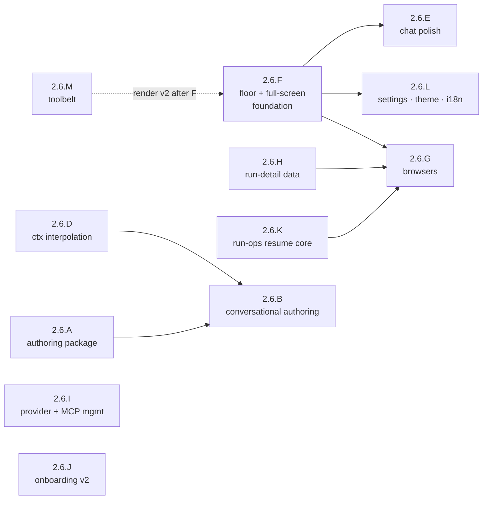

# Phase 2.6 — Conversational Authoring and the First-Class CLI

> Status: Planned — **next up**. Depends on the Phase 2.5 spine (the wired tool-environment and the
> per-tool approval / mode system), which is **complete** (M2.5-4, PR #69, 2026-07-08), so this phase is
> now unblocked.
>
> **Rewritten 2026-07-08** (after the Phase-2.5 close), expanding the original authoring-and-parity scope
> into the phase that makes the CLI a **first-class, Home-centric product**. The rewrite folds three
> inputs: the maintainer's CLI-experience findings, a competitor research pass (opencode, Claude Code,
> Codex CLI, Gemini CLI, Temporal/`gh run`-class run tooling, Aider/Goose/Amp/Cursor/Copilot), and a
> line-by-line triage of [../deferred-tasks.md](../deferred-tasks.md) (the now-doable items are pulled in
> below, each mapped to a workstream). Workstreams **2.6.A–E keep their original identities** (they are
> referenced by ADR-0058/0059/0060 and the deferred-tasks doc); **2.6.F–M are new**.
>
> **Note (2026-07-07):** **2.6.C**'s mid-session `/models` model **reseat shipped early in 2.5.G** (ADR-0059,
> PR #66, merged 2026-07-07); 2.6.C is retained for the residual per-model cost-breakdown read and as the
> cross-reference home.

- **Related**: [../README.md](../README.md), [phase-2.5-cli-consolidation.md](phase-2.5-cli-consolidation.md), [phase-2-cli.md](phase-2-cli.md), [phase-3-desktop.md](phase-3-desktop.md), [phase-5-managed-inference.md](phase-5-managed-inference.md), [node-runtime-upgrade.md](node-runtime-upgrade.md), [../deferred-tasks.md](../deferred-tasks.md), [../../reference/cli/commands.md](../../reference/cli/commands.md), [../../reference/cli/home.md](../../reference/cli/home.md), [../../reference/cli/chat-session.md](../../reference/cli/chat-session.md), [../../reference/shared-core/built-in-tools.md](../../reference/shared-core/built-in-tools.md), [../../reference/contracts/config-spec.md](../../reference/contracts/config-spec.md), [../../reference/contracts/workflow-yaml-spec.md](../../reference/contracts/workflow-yaml-spec.md), [../../reference/contracts/agent-yaml-spec.md](../../reference/contracts/agent-yaml-spec.md), [../../decisions/README.md](../../decisions/README.md) (ADR-0058–0060 + the new ADRs below)

The second half of the consolidation work begun in
[phase-2.5-cli-consolidation.md](phase-2.5-cli-consolidation.md), now widened into the phase that finishes
the CLI as a product. It realizes the tagline — *"Start as an agent. Ship the workflow. Own every run."* —
**entirely inside the terminal**: a conversation authors a standards-valid workflow, the Home starts and
monitors it, the run history is drillable to per-node detail, and every management task (providers, models,
MCP, settings, gates) is doable from the Home without dropping to a shell subcommand. When this phase
closes, `relavium` in a terminal is a first-class experience on par with the best agentic CLIs — while
keeping the postures they lack: OS-keychain-only secrets, a fail-closed approval floor, and git-committable
YAML artifacts.

## Goal

Make the bare `relavium` invocation a **full-screen, Home-centric** surface from which the entire product
is used and managed; close the **tool-breadth gap** against competitor CLIs (edit, search, find, todo,
ask-user, working web search) under the existing governance floor; land **conversational authoring** on the
shared `@relavium/authoring` core; give runs a **three-level drill-down** (list → run → node) over durable,
attributed history; and ship **settings, theming, and localization** — all without breaking the `--json` /
CI / non-TTY contract ([ADR-0049](../../decisions/0049-cli-machine-output-contract.md)) or any existing
subcommand.

## Outcomes (Definition of Done)

- `relavium` on a TTY opens a **full-screen** (alternate-screen) Home with a scroll/auto-follow viewport;
  the inline renderer remains as an escape hatch; `--json` / `CI` / non-TTY behavior is byte-identical to
  today (regression-harness proven).
- **Everything is manageable from the Home**: provider + key CRUD, model picking, MCP server CRUD +
  status, settings (theme/language/preferences), workflow start/monitor/history with node-level
  drill-down, agent start (any catalog agent) + session resume, gate resolution (human **and** budget),
  and authoring (wizard + conversational). No routine task requires a shell subcommand; subcommands stay
  first-class for scripting/CI and are never removed.
- A `@relavium/authoring` package is the shared authoring core; a conversational request produces a
  strict-valid, catalog-validated `.relavium.yaml`, written only under approval, offered to run it in-place.
- The **toolbelt** reaches competitor breadth — `edit_file`, `search_files`, `find_files`, todo/plan,
  `ask_user`, an actually-working `web_search` — each engine-pure, YAML-selectable, mode-gated, and
  rendered first-class (collapsible detail, diffs at the approval prompt) behind a security-reviewed
  render contract.
- Session `{{ctx.*}}` interpolation lands (ADR-0060) and `agent run --input` is unblocked.
- Run history is **attributed and drillable**: per-node model/agent/cost durable, a bounded secret-free
  tool trace, gate-resolve TOCTOU closed at the store, crashed runs reconciled, cross-process runs
  watchable live at node granularity.
- The CLI speaks **`en` and `tr`** over a string catalog with CI key-parity, and ships a real theme system
  (default + high-contrast + colorblind-safe) with the color-free path staying legible.
- The onboarding wizard offers **two auth paths** — BYOK (live) and *Sign in with a Relavium account*
  (visible, disabled, honestly labeled as coming with managed inference) — behind an Accepted
  forward-design ADR.

## Scope

### In scope

The workstreams below: the authoring spine (2.6.A/B/D), the platform + full-screen TUI foundation (2.6.F),
the Home management surfaces (2.6.G/H/I/J/K), the experience arms (2.6.C residual, 2.6.E, 2.6.L, 2.6.M),
and the deferred-tasks items each workstream absorbs (mapped in the
[pull-in table](#deferred-tasks-pulled-into-this-phase)).

### Explicitly out of scope (→ Phase 3 / later)

- **Chat sub-agent spawn** (a child-session engine model — the largest deliberate parity gap left; it
  belongs with the Phase-3 desktop multi-agent center and needs its own ADR; `invoke_agent` stays
  workflow-only).
- The **`read_media` D12 cluster** (host `MediaReadAccess`, scope population, the result-shape contract)
  and `@`-mention of media files — the dedicated, security-reviewed follow-up stands.
- **Full-fidelity reseat tool-context** (the 1.X/1.Z persister/schema extension) — the reseat keeps its
  text-only-transcript notice.
- **File-snapshot undo** (opencode-style revert of a message *and its file changes*) — 2.6.E ships
  conversation-level `/rewind`/`/fork` only.
- **retry-from-node** ([ADR-0040](../../decisions/0040-node-retry-budget-above-the-chain.md) Part B — needs the
  run-attempt model). The 2.6.G run-detail browser must be designed so a later "retry from this node"
  action slots in without rework, but the engine work is Phase 3.
- The **workflow-run `egress`/`os` arms** stay unwired (the recorded 2.5.E design boundary:
  `build-engine.ts` wires `fs`+`process` only). Revisiting that boundary requires its own ADR — it is not
  quietly reopened here.
- A multi-pane dashboard (desktop canvas territory), `output_schema` deep JSON-Schema conformance (new
  validator dependency), the `plugin` ToolSource loader, and cursor pagination for the read commands
  (scale-gated). Tracked in [../deferred-tasks.md](../deferred-tasks.md).

### In-window maintenance obligations (not workstreams)

Two items from [deferred-tasks.md](../deferred-tasks.md) fall inside the likely phase window and should be
actioned during it (maintainer calls, not workstreams): the **OpenAI Sora 2 shutdown (2026-09-24)** —
retarget or disable the 1.AH A3 Sora adapter arm before the date — and **enabling the live-nightly
conformance lane** (CI provider keys), which also unblocks the deferred media-in conformance fixtures.
Both stay tracked in their canonical [deferred-tasks.md](../deferred-tasks.md) entries.

## Work breakdown

### 2.6.A — `@relavium/authoring` package promotion + catalog-aware pre-flight

Unchanged from the original plan. The authoring core exists in-tree (`apps/cli/src/authoring/authoring.ts`,
landed with 2.J) and is promoted to a shared `@relavium/authoring` package so desktop
([phase-3-desktop.md](phase-3-desktop.md)) and VS Code ([phase-4-vscode.md](phase-4-vscode.md)) can consume
the same core.

**Tasks:**

- Scaffold `packages/authoring` — pure TS, platform-free — and **extract-and-decouple** the existing core
  (it is **not** a free move: `CliError`, `discoverCatalog`, and `findProjectConfigDir` are `apps/cli`
  imports a package may not take — a forbidden `packages → apps` back-edge). Replace `CliError` with a
  platform-free typed error the CLI maps to exit codes at the boundary; keep catalog **discovery** and
  `findProjectConfigDir` CLI-side and pass the catalog **in**. Add an import-zone lint fence banning
  `packages/authoring → apps/cli`. Follow
  [.claude/skills/add-package/SKILL.md](../../../.claude/skills/add-package/SKILL.md).
- Expose a single `validateAuthoredWorkflow(yaml, catalog)` = `parseWorkflow` **+**
  `validateWorkflowWithCatalog`, and **back-port** it into `create`/`import`/`export` (today those are
  parse-only; only the run path catalog-validates), so `create` can never accept a model/modality the run
  path rejects.
- Add direct unit tests for `detectAndParse` / `buildAuthored` / `validateAuthoredWorkflow` (today only the
  command wrappers are tested).

**Acceptance:** `@relavium/authoring` builds and imports **only** `@relavium/core` + `@relavium/shared`
(lint-fence enforced); the CLI consumes it with `create`/`import`/`export` round-tripping **unchanged**
(regression-tested); `create` runs the same catalog pre-flight the run path uses; the core is directly
unit-tested. **Required ADR:** [ADR-0058](../../decisions/0058-relavium-authoring-package-and-conversational-authoring.md)
(Proposed → Accepted when this workstream begins).

### 2.6.B — Conversational + wizard authoring in the Home

The original conversational-authoring workstream, plus the in-Home wizard surface and two absorbed
deferred items.

**Tasks:**

- **Conversational authoring** (unchanged): an authoring agent (an `--agent` profile or a `/author` mode)
  whose system prompt references a **product-side knowledge pack derived — never restated** — from
  [node-types.md](../../reference/shared-core/node-types.md),
  [workflow-yaml-spec.md](../../reference/contracts/workflow-yaml-spec.md),
  [agent-yaml-spec.md](../../reference/contracts/agent-yaml-spec.md) and the Zod schemas (one minimal
  example per node type; a no-duplication check gates acceptance; never under `.claude/` — the product
  agent does not read repo-development skills). Self-correct loop: model → YAML → `detectAndParse` /
  `validateAuthoredWorkflow` → field-named, secret-free error → model fixes. The artifact is written only
  under accept-edits/auto with the scope-tiered host, then the surface offers *"Run it now?"* — closing
  author → run on one screen.
- **In-Home authoring wizards**: bring `relavium create`'s wizard into the Home/chat palette (`/create` →
  an ink-native agent/workflow wizard over the same injectable prompter seam), so authoring starts from
  the Home, not only from a shell command.
- **`AgentParseError` reaches the chat surfaces** *(deferred pull-in)*: a malformed `.agent.yaml` on
  `chat --agent` / `agent run` currently collapses to a generic exit-1 internal error; resolve the design
  call (wrap into `CliError('invalid_invocation')` at `resolveChatAgent`, or teach the top-level renderer
  to render a typed `AgentParseError` as an exit-2 invocation fault), revise the pinned test deliberately,
  and relativize the echoed source path. The conversational self-correct loop depends on these diagnostics
  being visible.
- **Import consent gate** *(deferred pull-in, security)*: gate the first spawn of an MCP `stdio` server
  declared by an **untrusted-provenance** imported artifact behind explicit consent, and pin `npx` package
  versions for auto-install servers ([ADR-0052](../../decisions/0052-inbound-mcp-client-package-lifecycle-registration.md) §2)
  — the authoring/import path this phase matures is exactly the surface that makes this live.
- **Discoverability of the UVP** (unchanged): the proactive, dismissible, config-opt-out *"turn this
  session into a workflow with `/export`"* hint.

**Acceptance:** a free-text request yields a strict-valid `.relavium.yaml` passing the same pre-flight as
`relavium run`; an invalid draft is corrected via the secret-free loop; files are written only with
approval; `/create` works from the Home; a malformed agent YAML surfaces its field-named, positioned
diagnostic on every surface; the untrusted-import consent gate holds; a security review of the write
surface + the secret-taint gate + the import gate passes. **Required ADR:** shared with 2.6.A (ADR-0058).

### 2.6.C — Mid-session model reseat (shipped early) — residual

> **Shipped early in 2.5.G** (ADR-0059, PR #66, 2026-07-07): the `/models` mid-chat reseat, per-message
> `modelId` attribution, and the context-loss notice. Retained for the residual below and as the
> cross-reference home.

**Tasks:** the per-model **cost breakdown** read (`/cost` gains a per-model section over the shipped
attribution columns); verify the context-loss notice covers the whole `chat-resume` family.

**Acceptance:** `/cost` shows per-model spend for a reseated session; the notice is asserted on resume
surfaces. **Required ADR:** none (ADR-0059 is Accepted).

### 2.6.D — Session `{{ctx.*}}` prompt interpolation

Unchanged in intent; one absorbed deferred item makes the security mandate explicit.

**Tasks:** resolve `{{ctx.*}}` in the session system prompt per
[ADR-0060](../../decisions/0060-session-ctx-prompt-interpolation.md) — template substitution only, with the
**per-variable provenance/taint marker** on `SessionContext` (`--input`-derived values are untrusted by
provenance and never resolve in system position); unblock `agent run --input k=v`. *(Deferred pull-in:)*
land the **parse-time gate on system-bound fields** — when trusted `{{inputs}}`/`{{ctx}}` are admitted into
system positions, untrusted `run.outputs`/`read_file` references there are rejected at parse (the analyze/
collect gate), preserving the existing secret-taint protection.

**Acceptance:** `{{ctx.*}}` resolves in a session prompt with the taint rule enforced and tested;
`agent run --input` is accepted and reaches the prompt; the ADR-0060 mandatory security review passes.
**Required ADR:** ADR-0060 (Proposed → Accepted).

### 2.6.E — Chat & input parity polish

The competitor-parity chat ergonomics (the theme system moved to 2.6.L; tool-call rendering moved to
2.6.M). Everything here is TTY-interactive-only; the non-interactive contract is untouched.

**Tasks:**

- **Markdown + code-block rendering** in the transcript (minimal in-house renderer preferred; a markdown
  dependency, if chosen, needs an ADR); syntax highlighting stays Phase 3.
- **Advanced `@`-injection**: glob / directory expansion respecting ignore files (the ADR-0061 follow-up;
  the in-house matcher from the 2.5 close is the substrate).
- **`/rewind` + `/fork`** at conversation level: rewind truncates to a chosen prior message and continues
  (via the `/clear`-style host-swap + `reconstructSessionState` machinery); fork branches a session into a
  new `sessionId` preserving the original. File-change revert is explicitly out (see out-of-scope).
- **Type-ahead message queue**: messages typed while a turn runs are queued (navigate/edit the queue), sent
  on turn end — with a steer-now affordance considered (send-as-interrupt).
- **Input history search**: `Ctrl+R` reverse search over per-project prompt history.
- **`$EDITOR` compose** (`Ctrl+G`): edit the pending prompt in the external editor.
- **`/copy`**: copy the last assistant reply (OSC-52 with a plain fallback).
- **`/help` v2**: a full-screen, sectioned help screen (commands, keybindings, modes) replacing the flat
  text list, once 2.6.F's renderer lands.

**Acceptance:** each affordance works in chat and the in-Home chat; `--json`/plain surfaces reject or
ignore them exactly as the ADR-0049 contract requires; the message queue and rewind have reducer-level
tests. **Required ADR:** none, unless a markdown dependency is chosen (then a small dedicated ADR).

### 2.6.F — Platform floor + the full-screen TUI foundation

The substrate workstream — it runs **first** because the browsers (2.6.G), settings screens (2.6.L), and
render-v2 (2.6.M) all build on it.

**Tasks:**

- **Node dev/CI bump now**: `.nvmrc` 22 → 24 (Active LTS) — one line, non-breaking, no ADR.
- **Supported-floor decision** *(maintainer decision, recommended: take it early in-phase)*: raise the
  published floor 20.12 → `>=22` — a SemVer-major for `relavium` that restores `better-sqlite3` prebuild
  coverage (Node 20 is EOL) and unlocks ink 7 / `node:sqlite` / eslint 10 / vitest 5. Full analysis:
  [node-runtime-upgrade.md](node-runtime-upgrade.md). This **supersedes
  [ADR-0021](../../decisions/0021-node-sqlite-driver-better-sqlite3.md)** → its own governed PR behind a
  superseding ADR. Ink 7 is evaluated in the same governed PR but adopted only if the floor is raised to
  `>=22`; otherwise the renderer ships on the current ink major.
- **Full-screen renderer**: an alternate-screen (DECSET 1049) mode for the Home + chat with a real
  viewport — scrollback inside the app (PgUp/PgDn, wheel where supported), **auto-follow** that pauses when
  the user scrolls up and resumes at bottom, and the input pinned to the bottom row. This structurally
  fixes the current bug where long responses clip/truncate content beyond the terminal height — scrolling
  up must reveal the full response from the beginning without top-truncation. The inline (scrollback)
  renderer is **retained** and byte-identical for non-TTY/CI; an explicit escape hatch (`--no-alt-screen`
  or a config key) keeps the inline mode available on a TTY. If the full-screen renderer is deferred or
  the inline mode is active, a separate inline-viewport fix must backfill the scrollback-preservation
  behavior for long responses so that content above the visible area is never lost. Renderer choice is
  orthogonal to session state (switching relaunches the view in place, conversation intact). The run TUI's
  persistent plain-text exit summary is preserved on unmount.
- **TUI component test harness** *(deferred pull-in)*: the first CLI component-render harness (a new
  devDependency — part of this workstream's ADR), so render-cadence bugs (the 2.5.H frozen-clock class)
  get regression tests; add performance regression thresholds (frame time / render count) for the
  full-screen frame loop.
- Resize/degrade behavior and the documented screen-reader constraint (raw-mode TUI) with the non-TTY
  fallback — carried from the original 2.6.E and owned here.

**Acceptance:** bare `relavium` on a TTY opens the full-screen Home; scroll + auto-follow work; the
`--json` / CI / non-TTY paths are byte-identical to today (harness-proven); the floor-bump ADR is Accepted
and released as a SemVer-major with migration notes; the component harness runs in CI with at least the
frozen-clock regression pinned. **Required ADRs:** the ADR-0021-superseding floor ADR + a full-screen
renderer & TUI-harness ADR.

### 2.6.G — Home management browsers: workflows, runs, agents

The interactive browsers that make the Home the management center. The interaction model follows the
proven three-level drill-down (list → detail → step detail) with `gh run`-style progressive disclosure
(every screen hints the next action) and picker-on-omitted-id semantics. The maintainer's separate-command
sketch (`/active-workflows`, `/workflow-run-history`, …) is **deliberately simplified** into two tabbed
browsers with argument deep-links — same reach, fewer commands.

**Tasks:**

- **`/workflows` browser** (Home + chat): tabs **Defined | Active | History**, deep-linkable as
  `/workflows [defined|active|history]`.
  - *Defined*: the disk catalog (slug, name, node count, last-run status/age; invalid files flagged) with
    actions — **Run** (foreground: graduate into the live run view), **Run detached** (print the runId,
    stay in Home), **Export**, reveal path. Starting a run from the Home is new — `run` stays shell-first
    for scripting, but the Home can now launch.
  - *Active*: live runs (status, current node, attempt, elapsed, cost) — including runs owned by **other
    processes** via a poll-based `run_events` tail (seq + WAL make this feasible today), disclosed as
    node-boundary granularity; a gate-/budget-blocked run shows the resolve affordance inline. Esc detaches
    without killing; cancel is offered with its cooperative semantics.
  - *History*: finished runs (status glyph, short id, workflow, relative start, duration, **cost** — the
    differentiator no competitor CLI lists) with keystroke filters (status/workflow) — no query DSL. Enter
    → **run detail**: header (status, timing, totals, entry point) + node table (per-node status, duration,
    attempt, tokens, cost) + a "jump to first failed node" key. Enter on a node → **node detail**: the
    input / output / duration / tokens / error quintet plus the bounded tool-trace and event timeline
    (Scheduled/Started/Completed triplets collapsed into one expandable row).
- **`/agents` browser** (Home + chat): tabs **Defined | Sessions**. *Defined*: the agent catalog with
  **"start a chat with this agent"** (closing the Home's built-in-agent-only gap). *Sessions*: recent +
  in-progress sessions — Enter resumes **in place** (the in-Home chat machinery), with a detail view
  (transcript summary, cost, model attribution).
- **Actionable Home strip**: the Attention/Continue rows become focusable — a gate row opens an inline
  resolve card (approve / reject / input, via 2.6.K's shared resume core), a failed run opens its detail,
  a session row resumes, a run row opens detail. The strip refreshes on an idle tick while the Home is
  open (today it is snapshot-static).
- **Liveness**: wire `engine.reconcile()` (never invoked today) on Home open and the browser/status reads,
  so crashed runs settle `run:failed{internal}` instead of showing as zombie `running` rows; expired gates
  settle per their timeout policy via 2.6.K's re-arm.
- Non-interactive parity: extend the read *commands* minimally (`relavium list --runs`, `status <runId>`
  for finished runs, `logs --follow/--failed`) so scripting keeps pace with the TUI —
  [ADR-0049](../../decisions/0049-cli-machine-output-contract.md)-conformant.

**Acceptance:** every action above works from the Home without a shell command; the three-level drill-down
is complete over 2.6.H's data; a run started in another terminal is watchable live at node granularity;
zombie runs reconcile; the browsers degrade at <80×24; the machine-output contract is untouched
(harness-proven). **Required ADR:** management browsers + run drill-down contract (shared with 2.6.H).

### 2.6.H — Durable run detail: the history data layer

The store/engine half that 2.6.G's browsers read. Today the durable record is node-boundary-only and
unattributed (step rows never carry agent/model/input; `run_costs.modelId` is always NULL; the firehose is
never persisted; several consistency gaps are recorded in the deferred doc). This workstream makes the
durable record complete enough for a first-class drill-down — additively.

**Tasks:**

- **Step attribution**: populate `step_executions.agentId/agentSnapshot/modelId/inputJson` and
  `run_costs.modelId` from the events the engine already has; give `node:skipped` a step row (thread
  `nodeType` additively); widen the `StepRecord` projection (output/error/tokens) + a step-detail read.
- **Exact per-node cost**: an optional `nodeCostMicrocents` on `node:completed` — an additive run-event
  schema field amending [ADR-0036](../../decisions/0036-run-loop-substrate-event-bus-and-execution-host.md)
  append-only (optional for backward-compat with existing `--json` consumers; when present, the per-node
  cost is exact, not a cumulative-delta approximation) — so parallel fan-out attributes exactly instead of
  via cumulative deltas; carry final totals on `run:failed` / `run:cancelled` (closing the documented
  undercount).
- **Bounded durable tool trace** *(ADR decision)*: persist secret-free per-step tool **summaries** —
  toolId, the sanitized approval-preview target, outcome (ok/denied/failed), duration — never args or
  result bytes; the token/reasoning firehose stays unpersisted (the ADR-0036 posture holds). This is what
  the node-detail screen shows as "tool activity".
- **Store-level gate uniqueness** *(deferred pull-in)*: a uniqueness constraint on `human_gate:resumed`
  per `(runId, gateId)`, closing the cross-process gate-resolve TOCTOU window at the store.
- **Consistency fixes** *(deferred pull-ins)*: wrap the run-resume reconstruction reads
  (`loadRun` + `loadRunEvents` + `loadStepExecutions`) in one read transaction; make the chat persister's
  per-turn writes atomic (`BEGIN IMMEDIATE` per turn); the **content-level workflow-identity guard** on
  resume over the frozen `runs.workflow_definition_snapshot`.
- **Run-submission idempotency** *(deferred pull-in)*: a dedup guard for Home-launched runs (double-Enter
  must not start two runs).

**Acceptance:** a finished run's detail (attribution, exact per-node cost, tool summaries, skipped nodes)
is fully reconstructable from `history.db`; the TOCTOU constraint holds under a concurrent two-process
test; the schema/event changes are additive and `--json` consumers are unaffected; migration provided.
**Required ADR:** shared with 2.6.G (browsers + durable run-detail; amends ADR-0036 additively).

### 2.6.I — Provider & MCP management from the Home

Closing the two biggest "must drop to shell / must hand-edit TOML" gaps: provider/key CRUD outside the
onboarding wizard, and MCP servers, which today are managed **only** by hand-editing `[[mcp_servers]]`
config (there is no `relavium mcp` command at all; the only runtime visibility is `/doctor --deep`).

**Tasks:**

- **`/providers`** (Home + chat palette): list providers with key status + redacted live verify; add a
  provider (SSRF-validated base URL rules unchanged); set key (masked, keychain-only — the wizard's tested
  `set-key` path); remove key (confirmed destructive); test. All over the existing `runProviderCommand`
  cores — no new key-handling code paths.
- **`/mcp`** (Home + chat palette): list registered servers with a **read-only** status report (the
  `/doctor --deep` machinery — never connects/spawns on open); add / edit / remove server registrations
  (stdio + `http`/`sse`/`websocket` behind the existing SSRF floor); named secrets set via a masked prompt
  into the isolated `mcp-secret:*` keychain namespace — **never** into TOML (env placeholders only).
- **`relavium mcp list/add/remove/test`** shell family for scripting parity (`--json`-conformant).
- **Config-write extension** *(ADR)*: extend the
  [ADR-0063](../../decisions/0063-cli-config-write-contract.md) typed-setter contract to structured
  `[[mcp_servers]]` writes (which config file owns a tool-written registration, the comment-loss caveat,
  atomicity, secret-incapability by construction).
- **Deferred MCP cluster** *(pull-ins)*: the durable cross-invocation **tool-list cache** (~1h TTL,
  transport-covering key — startup latency); **network header auth**
  (`Authorization: Bearer {{secrets.<name>}}` via the SDK transport's headers, resolved from
  `mcp-secret:*`, never logged/serialized — [ADR-0052](../../decisions/0052-inbound-mcp-client-package-lifecycle-registration.md) §6);
  **mid-call abort propagation** (the engine's `AbortSignalLike` forwarded to the in-flight `tools/call`,
  so a mid-turn Esc cancels an MCP call instead of only tearing down); optionally the generalized
  `SecretResolver` seam alongside header auth.

**Acceptance:** providers and MCP servers are fully manageable from the Home and the shell; a network
server with header auth connects with its secret resolved from the keychain; discovery startup is
measurably faster with the cache; Esc aborts an in-flight MCP call; the mandatory security review of the
secret handling + config-write surface passes. **Required ADR:** MCP management surface + config-write
extension (extends ADR-0063; sits on ADR-0052/0053).

### 2.6.J — Onboarding v2: two auth paths + the Relavium-account stub

The first-run wizard gains the product's future shape without pulling Phase 5 forward.

**Tasks:**

- **Auth-path select** as the wizard's first step:
  - **(a) Connect a provider (bring your own API key)** — the existing, live flow (provider select →
    masked key → live validation with cause-aware retry → keychain → starter default model), unchanged.
  - **(b) Sign in with a Relavium account** — **visible but disabled** ("coming with managed inference"),
    rendered dimmed with an honest one-line note. Discoverable from day one, selectable never (this
    phase).
- **The account-auth forward-design ADR** (Accepted in this phase; **implemented in Phase 5**,
  [phase-5-managed-inference.md](phase-5-managed-inference.md), riding
  [ADR-0012](../../decisions/0012-managed-inference-dual-mode.md)–[ADR-0015](../../decisions/0015-managed-mode-data-handling-and-compliance.md)).
  It records the decided shape so the stub is honest:
  - The account API key **determines entitlement server-side** — an individual subscription or an
    organization membership activates automatically from what the key is provisioned for; the user never
    picks at login.
  - **No-subscription UX is a first-class state, never a dead end**: a typed, actionable message with the
    BYOK path offered on the same screen.
  - **BYOK always coexists**: a signed-in user with no (or an exhausted) subscription keeps full BYOK
    provider use; at-limit degrades gracefully (finish the turn → wait/upgrade → BYOK fallback).
  - Mechanics reserved for Phase 5: key-paste first (copy from the account portal), browser OAuth +
    device-code later; keychain storage; plan-gated features; org-forced login method.
- Optional wizard polish once 2.6.L lands: a theme step; the outro points at `/help` + `/models`.

**Acceptance:** a keyless first run shows both paths with (b) disabled and honestly labeled; path (a) is
regression-proven unchanged; the forward-design ADR is Accepted with Phase-5 ownership explicit.
**Required ADR:** onboarding auth paths + Relavium-account forward design.

### 2.6.K — Run-ops: the resume-path follow-up (budget resume, secret re-provide, gate lifecycle)

The focused follow-up the 2.5 close deliberately deferred — both headline items refactor the
security-sensitive `gate.ts` cross-process resume path, so they land together with fresh context.

**Tasks:**

- **Extract a shared cross-process resume core** from `gate.ts` (snapshot reload → checkpoint reconstruct →
  `resumeFromCheckpoint` → drive) that the gate command, the budget command, and 2.6.G's inline resolve
  card all consume.
- **`relavium budget resume <runId> [--approve|--abort]`** *(deferred pull-in)*: the documented command
  over the engine's existing budget-gate resume; plus the Home affordance on budget-paused rows.
- **Secret re-provide on resume** *(deferred pull-in, security)*: let the operator re-supply a
  `secret`-typed input on a cross-process resume (stdin-only, `provider set-key` discipline; or keychain
  re-resolution keyed by the input `ref` (its stable identifier in the workflow YAML)),
  relaxing today's fail-closed `MaskedSecret` exit-2 — behind a
  **mandatory security review** (this deliberately relaxes a fail-closed guarantee into
  allow-with-re-provisioning).
- **Gate timeout re-arm on rehydration** *(deferred pull-in)*: re-arm a still-pending gate's persisted
  `expiresAt`/`timeoutAction` against a real clock on reconcile/resume, so a crash-while-paused run's
  deadline is honored.
- **Exit-code fidelity** *(deferred pull-in)*: distinguish a gate park from a media-only park on
  `run:paused` (media parks are reachable since 2.S) in the human message and, if decided, the exit code —
  documented in [commands.md](../../reference/cli/commands.md).
- **Session budget pause/resume** *(deferred pull-in, engine)*: the chat cost-cap `pause_for_approval`
  rides the EA4 pause/resume machine (today it settles the turn loudly) — the ADR-0028 session arm.

**Acceptance:** a budget-paused run is resumable from the CLI and the Home; a secret-bearing run is
resumable via re-provide with the security review passed; timers re-arm; a chat hitting its cost cap can
pause-and-approve instead of failing the turn; the shared resume core is the only resume path (no
duplication). **Required ADR:** none new (rides ADR-0028/ADR-0006); the security review is the gate.

### 2.6.L — `/settings`, the theme system, and localization

The personalization arm: a settings surface over an extended config-write contract, a real theme system,
and the first localized agentic CLI (a genuine differentiator — competitor i18n is white space).

**Tasks:**

- **Theme system**: a palette abstraction replacing the hardcoded literal ink colors; named built-ins —
  `default`, `high-contrast`, `colorblind-safe` (the accessibility pair carried from the original 2.6.E),
  and a terminal-respecting `ansi` theme (`NO_COLOR`/`--no-color` overrides every theme identically: all
  color codes dropped, semantic markers degraded — the `ansi` theme is not a color-free bypass);
  `[preferences].theme` (schema-present, read by nothing today) finally read; **`/theme`** switcher with
  live preview. Semantic markers (`✓`/`✗`/`⏸`) survive `--no-color`/`NO_COLOR` and degrade to ASCII
  (`[v]`/`[x]`/`[||]`) without Unicode.
- **`/settings`** (Home + chat): a sectioned screen (appearance / language / chat defaults / update
  channel) over the **extended** [ADR-0063](../../decisions/0063-cli-config-write-contract.md) typed-setter
  (new keys: `theme`, `language`; still global-preferences-only, atomic, secret-incapable by construction —
  project files stay hand-authored).
- **i18n foundation**: an in-house string catalog (data ≠ code — zero conditional logic in translation
  data; no runtime dependency expected, else ADR); `[preferences].language`; locales **`en` + `tr`**
  in-phase; a CI **key-parity test** (fails on missing/extra keys) + a dead-string lint — landing the
  deferred i18n standard as a `docs/standards/` entry. Acceptance includes IME-safe input and
  wide-character-aware layout, laying the groundwork for future CJK locales.
- Diagnostics/`--json` output stays English-stable (machine contract); localization applies to the
  interactive surfaces.

**Acceptance:** `/settings` edits persist atomically and round-trip; themes switch live incl. the
accessibility pair; the color-free path stays legible; interactive surfaces run fully in `tr` with
CI-enforced key parity; diagnostics and `--json` remain English-stable per
[ADR-0049](../../decisions/0049-cli-machine-output-contract.md); the machine-output contract is
character-for-character unaffected. **Required ADR:** i18n +
theming architecture.

### 2.6.M — The first-class toolbelt: breadth + rendering

Closing the tool gap against competitor CLIs. Today the registry has 13 built-ins with **no** file
edit/patch, **no** content search, **no** find, **no** todo, **no** ask-user, and a dormant `web_search`
(needs an unwired credential resolver). Every addition is engine-pure (Zod args, `llmVisibleParams`,
policy class, bounded results), documented in
[built-in-tools.md](../../reference/shared-core/built-in-tools.md), selectable in agent/workflow YAML, and
sits under the existing governance floor (advertise-filter + fail-closed approval + protected-path/
sensitive-read floors).

**Tasks:**

- **`edit_file`** — exact old→new string replacement (+ `replace_all`, uniqueness guard, read-before-edit
  safety), `fs_write`-governed with a **diff preview** at the approval prompt. The single biggest gap.
- **`search_files`** — bounded in-house content search (workspace-jailed, sensitive-read floor,
  ignore-file-respecting; linear matcher — no regex-DoS surface), idempotent.
- **`find_files`** — glob file finding across the tree (mtime-sorted, bounded), idempotent — promoting the
  current read_file/list_directory glob options into a first-class discovery tool.
- **Todo/plan tool** — a structured, session-scoped task list the model maintains, rendered as a live TUI
  checklist (persists across compaction); ungoverned (no host arm).
- **`ask_user`** — a structured mid-turn question (options + free text) on interactive surfaces via a
  keyboard-owning overlay; typed `tool_unavailable` on non-interactive surfaces; workflows keep
  `human_gate`.
- **`web_search` activation** *(deferred pull-in)*: wire the `egressCredentialResolver` from the keychain
  (today a configured search 401s) and document the config-pinned provider contract; `http_request`
  unchanged.
- **`extra_roots`** *(deferred pull-in)*: the `[chat].extra_roots` config key + factory wiring, unblocking
  the `project` fs tier's documented allowlist (narrow-only, never a jail hole).
- **Tool-call rendering v2** (with 2.6.F's renderer): keep the collapsed one-line annotation as the
  default, add a **details view** (a `/details` toggle or transcript overlay) revealing *sanitized,
  bounded* target/arg previews and result summaries, and **diff rendering** (width-adaptive stacked /
  side-by-side) for `edit_file`/`write_file` at the approval prompt and in details. This deliberately
  revises 2.5's never-render-args posture — it is sanctioned only via the ADR + a security review (every
  string through the shared sanitize floor; secrets structurally excluded; bounded).
- **Target-scoped approval cache** *(deferred pull-in)*: key `[a]lways` grants by `(toolId, target class)`
  (path prefix / host / MCP server) instead of tool id alone, and give `mcp_call`/`web_search` a structured
  `{server, tool}`/query preview so their blank-preview once-only downgrade becomes a real reviewable
  grant.
- **Default chat agent grant review**: widen the built-in agent's grant to the new idempotent read tools
  (search/find/todo); write/exec/egress stay opt-in via mode + approval.

**Acceptance:** the toolbelt covers read / edit / search / find / exec / web / todo / ask-user; each tool
is YAML-selectable and correctly mode-gated on every surface; render v2 ships with diffs and the details
toggle behind a passed security review; the approval cache is target-scoped; the tool-gap table in the
research record is closed or explicitly deferred per item. **Required ADR:** toolbelt additions +
tool-render/approval-preview contract (extends ADR-0029/ADR-0057 posture).

## Deferred-tasks pulled into this phase

The [deferred-tasks.md](../deferred-tasks.md) triage (2026-07-08) mapped these confirmed-open items into
workstreams — each stays checked off **only** in the PR that lands it:

| Deferred item (deferred-tasks.md) | Lands in |
|---|---|
| Node floor: dev/CI bump + supported-floor decision (EOL Node 20) | 2.6.F |
| CLI render-layer (ink component) test harness | 2.6.F |
| `AgentParseError` invisible on `chat --agent` / `agent run` | 2.6.B |
| MCP `stdio` import-trust/consent gate + `npx` pinning (ADR-0052 §2) | 2.6.B |
| Parse-time gate on system-bound fields (trusted `{{ctx}}`) | 2.6.D |
| `@`-glob / directory expansion (ADR-0061) | 2.6.E |
| Cross-process gate-resolve TOCTOU (store uniqueness) | 2.6.H |
| Run-resume torn-read wrap · chat-persister turn atomicity | 2.6.H |
| Content-level workflow-identity guard on resume | 2.6.H |
| Run-submission idempotency / double-submit dedup | 2.6.H |
| MCP tool-list cache · network header auth (§6) · mid-call abort | 2.6.I |
| `relavium budget resume` command (documented, unimplemented) | 2.6.K |
| Re-provide `secret`-typed inputs on cross-process resume | 2.6.K |
| Re-arm a still-pending gate's timeout on rehydration | 2.6.K |
| `run:paused` gate-park vs media-park exit distinction | 2.6.K |
| Session budget pause/resume (EA4 ride; 1.V follow-up) | 2.6.K |
| i18n CI key-parity + data/code separation standard | 2.6.L |
| Live `web_search`/`http_request` egress credential resolver | 2.6.M |
| `project`-tier `extraRoots` allowlist (config source now exists) | 2.6.M |
| Target-scoped approval cache + structured MCP preview | 2.6.M |
| Approval-consent-line zero-width hardening · shared `[c]` reducer | 2.6.M (with render v2) |

Items evaluated and **kept deferred** (Phase-3/1.AH homes, SDK-blocked, accepted residuals, or
scale-gated) remain in [deferred-tasks.md](../deferred-tasks.md) with their reasons — notably the
`read_media` D12 cluster, chat sub-agents, retry-from-node, the desktop tool host, and the media/seam
1.AH cluster.

## Milestones

| In-phase | Completed by | Outcome |
|----------|--------------|---------|
| M2.6-1 Foundation | 2.6.F | Node floor decided/shipped; full-screen renderer + TUI harness — the substrate for every arm |
| M2.6-2 Authoring core shared | 2.6.A | `@relavium/authoring` + catalog-aware pre-flight |
| M2.6-3 Conversational authoring | 2.6.B + 2.6.D | "define a workflow…" → valid YAML in the Home; `{{ctx.*}}` lands |
| M2.6-4 The Home-managed CLI | 2.6.G + 2.6.H + 2.6.I + 2.6.J + 2.6.K | Every management task doable from Home; drillable, attributed run history; onboarding v2 |
| M2.6-5 First-class experience | 2.6.C + 2.6.E + 2.6.L + 2.6.M | Toolbelt parity + settings/theme/i18n + chat polish — **phase close** |

## Sequencing & parallelization

**2.6.F runs first** (the floor decision + renderer + harness gate every TUI-heavy arm). Then two parallel
spines: **(i) authoring** — 2.6.A → 2.6.B, with 2.6.D alongside; **(ii) experience** — 2.6.H and 2.6.K
early (data + resume core), then 2.6.G on top; 2.6.I and 2.6.J are independent and can land any time;
2.6.M's engine-pure tools can start immediately (only its render-v2 half waits on F); 2.6.E and 2.6.L
follow F. 2.6.C's residual is a small read, any time.

## Dependencies

- **Phase 2.5** complete — specifically 2.5.A (the wired tool-environment), 2.5.E (per-tool approval /
  modes), 2.5.B/C (the Home + the two-registry command model), and ADR-0063 (config-write) — all met.
- **2.J** (the in-tree authoring core 2.6.A promotes) — landed.
- The Node supported-floor decision (2.6.F) gates the ink-7 evaluation but **not** the rest of the phase
  (every workstream must land on the current floor if the maintainer defers the bump).

## Exit criteria (go / no-go → Phase 3)

1. `relavium` on a TTY opens the **full-screen Home**; `--json` / CI / non-TTY behavior is byte-identical
   (regression-harness proven); the inline renderer remains available.
2. **The Home manages everything**: providers/keys, models, MCP servers, settings, workflow
   start/monitor/history with node-level drill-down, agent start/resume, gate + budget resolution, and
   authoring — no routine task requires a shell subcommand. (Subcommands and the ADR-0049 machine surface
   are untouched and permanent; whether to de-emphasize interactive duplicates in `--help` is a phase-end
   review decision, never a removal.)
3. A conversational request produces a strict-valid, catalog-validated `.relavium.yaml`
   (pre-flight-proven, security-reviewed); the knowledge pack is derived, not restated; `{{ctx.*}}` lands
   and `agent run --input` is unblocked.
4. The **toolbelt** ships (`edit_file`, `search_files`, `find_files`, todo, `ask_user`, working
   `web_search`) — YAML-selectable, mode-gated, rendered with diffs/details behind a passed security
   review.
5. Run history is attributed and drillable (list → run → node with the quintet + tool summaries); the
   gate TOCTOU is store-closed; crashed runs reconcile; cross-process live watch works.
6. `/settings`, the theme system (incl. the accessibility pair), and **`en`+`tr`** localization ship with
   CI key-parity.
7. The required ADRs are Accepted, and every touched spec's canonical home
   ([commands.md](../../reference/cli/commands.md), [home.md](../../reference/cli/home.md),
   [chat-session.md](../../reference/cli/chat-session.md),
   [built-in-tools.md](../../reference/shared-core/built-in-tools.md),
   [config-spec.md](../../reference/contracts/config-spec.md),
   [database-schema.md](../../reference/desktop/database-schema.md)) is updated — no docs-debt carried
   out of the phase.

## Required ADRs

Existing (drafted alongside the original plan; finalized → Accepted when their workstream begins):

1. [ADR-0058](../../decisions/0058-relavium-authoring-package-and-conversational-authoring.md) —
   `@relavium/authoring` + conversational authoring (2.6.A/2.6.B). *Proposed.*
2. [ADR-0059](../../decisions/0059-cli-mid-session-model-reseat.md) — mid-session model reseat (2.6.C).
   **Accepted** (shipped 2.5.G).
3. [ADR-0060](../../decisions/0060-session-ctx-prompt-interpolation.md) — session `{{ctx.*}}`
   interpolation (2.6.D). *Proposed; mandatory security review before Accept.*

New (numbers assigned when drafted; each is drafted as Proposed when its workstream starts, per the
established phase pattern):

4. **Node supported-floor bump** (`>=22`) — SemVer-major; **supersedes**
   [ADR-0021](../../decisions/0021-node-sqlite-driver-better-sqlite3.md) (2.6.F).
5. **Full-screen TUI renderer + component test harness** (alternate screen, viewport/auto-follow, the
   inline fallback contract, the harness devDependency) (2.6.F).
6. **Management browsers + durable run detail** (the drill-down contract; additive run-event fields
   amending ADR-0036; step attribution; the bounded tool-trace posture) (2.6.G/2.6.H).
7. **MCP management surface + config-write extension** (structured `[[mcp_servers]]` writes extending
   ADR-0063; the `/mcp` + `relavium mcp` surface; header auth) (2.6.I).
8. **Onboarding auth paths + Relavium-account forward design** (the disabled stub's contract; Phase-5
   ownership; rides ADR-0012–0015) (2.6.J).
9. **Toolbelt additions + tool-render/approval-preview contract** (the new built-ins; the sanctioned
   details/diff rendering revising the never-render-args posture; target-scoped approval cache — extends
   ADR-0029/ADR-0057) (2.6.M).
10. **i18n + theming architecture** (string catalog, locale resolution, palette abstraction) (2.6.L).

> **Conditional:** 2.6.E requires a small dedicated ADR **only if** a markdown rendering dependency is
> chosen (the in-house renderer is preferred); if the in-house path is taken, no 2.6.E ADR is needed.

## Risks & mitigations

| Risk | Mitigation |
|------|------------|
| **Scope breadth** — thirteen workstreams invite drift | Milestone gating (M2.6-1..5); the additive arms (E/L parts, M render-v2) can defer individual items without breaking the spine; the pull-in table keeps deferred-tasks as the single overflow home |
| Full-screen renderer performance/fragility on ink | The floor bump unlocks ink 7; the component harness carries performance regression thresholds; the inline renderer is retained as a first-class fallback, and non-TTY paths never change |
| Rendering args/diffs leaks sensitive data (reverses a 2.5 posture) | Sanctioned only by ADR #9 + a mandatory security review; every string passes the shared sanitize floor; bounded previews; secrets structurally excluded (keychain-only, never in tool args by construction) |
| Secret re-provide relaxes a fail-closed guarantee | stdin-only discipline, keychain re-resolution preferred, mandatory security review, and the shared resume core keeps one audited path |
| Authoring knowledge drifts from the specs (restate) | Derived from the Zod schemas / reference docs; a no-duplication check is an acceptance gate |
| Authored YAML smuggles secrets | The `parseWorkflow` secret-taint gate + the write-surface security review |
| Browser complexity balloons | Hard cap at the three-level drill-down; keystroke filters, no query DSL; tabs + deep-links instead of six commands; the desktop canvas stays the rich escape hatch |
| i18n churn destabilizes strings | Data ≠ code catalog; CI key-parity + dead-string lint land **with** the first locale, not after |
| ADR load stalls the phase | ADRs are drafted per-workstream as Proposed when the workstream starts (the 2.5 pattern), not all up front |
| Competitor-copy erodes Relavium's posture | Patterns are stolen, postures are not: keychain-only secrets, fail-closed approval, YAML-first artifacts, and the ADR-0049 machine contract are non-negotiable filters on every borrowed idea |

Part of [roadmap/](../README.md). Carry-over hardening lives in [../deferred-tasks.md](../deferred-tasks.md).
