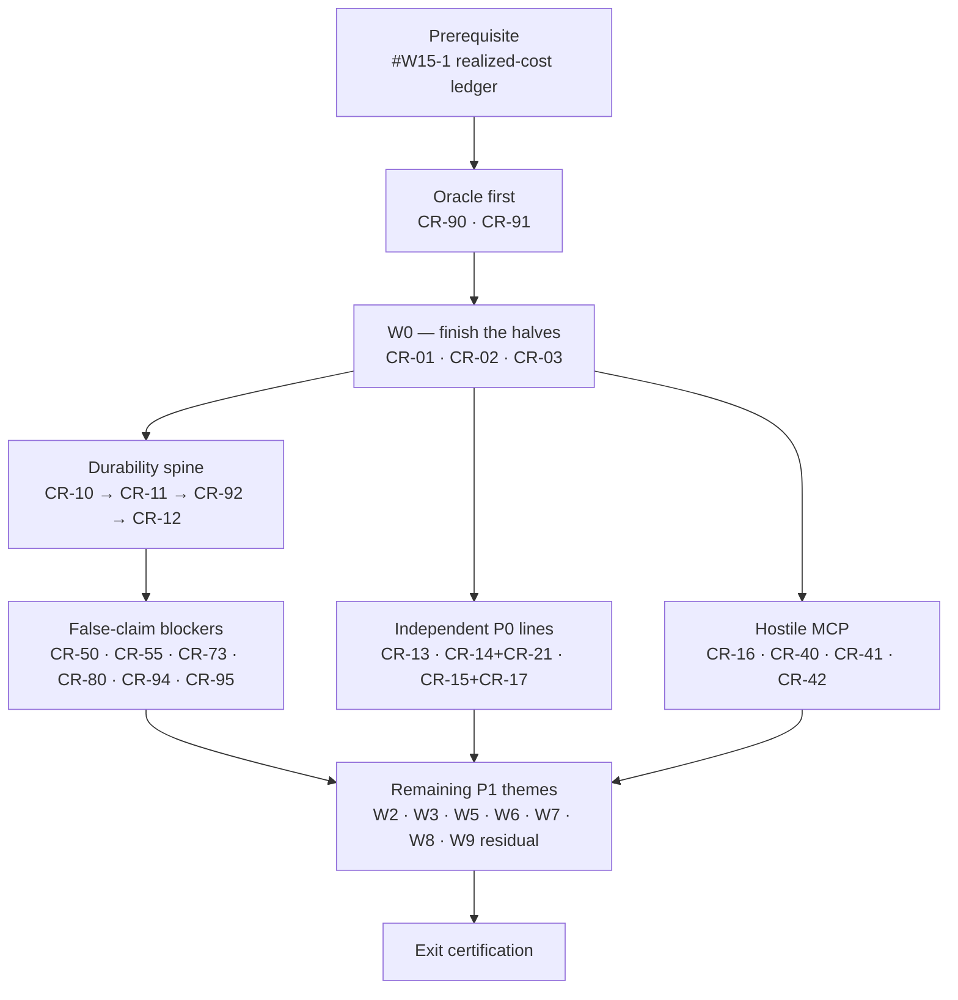

# Phase 2.6.5 — Core reliability remediation (interlude)

- **Status**: in progress — **`W0`–`W2` merged clean; `W3` merged 2026-08-30 (PR #86) with a live blocker; `W4` merged 2026-09-01 (PR #87) after a systematic review found five merge blockers in it — all reproduced and fixed before the merge.** `W5` (media correctness) is COMPLETE on `development` behind ADR-0089 + ADR-0090; **`W6` (authoring correctness) is next** (38 of 48 items — `CR-21` closed with `CR-14`, `CR-21c` added 2026-08-25, `CR-95`'s non-deferrable short-term half closed with the spine on 2026-08-18 and found still marked open on 2026-08-28)
- **Opened**: 2026-08-09 · **Plan corrected**: 2026-08-10 · **First batch merged**: 2026-08-11 (PR #82) ·
  **`W1` merged**: 2026-08-24 (PR #83)
- **Predecessor**: Wave 1 of the 2.5.5 remediation (complete — PR #81), then the `#W15-1` realized-cost
  ledger implementation (**complete 2026-08-10**, ADR-0076 + ADR-0077 — see [Prerequisite](#prerequisite))
- **Successor**: Wave 2 of the 2.5.5 remediation, **reduced** — this phase absorbs Wave 2's hostile-MCP
  threat class (see [Phase boundary](#phase-boundary)); Wave 2 keeps the filesystem jail, the secrets
  layer, persistence-security and the 2.5.5 certification
- **Kind**: interlude, like [phase 2.5.5](phase-2.5.5-hardening-and-remediation.md) — no new product surface,
  only the invariants an existing surface already claims

## Why this phase exists

Three independent core reviews of the engine were run against the tree as it stood immediately after Wave 1.
They converged — independently, without seeing each other — on the **same seven blocking gaps**. That
convergence is the reason this phase exists: three separate reviews landing on the same seven points is not a
matter of opinion.

The verdict all three reached is worth stating, because it shapes every item below:

> The architecture is right. Nothing here calls for a rewrite. The gaps are in the **last ten percent of
> reliable execution** — durable ownership, effect identity, trust provenance, stream grammar, admission and
> ordering — and the existing seams are good enough to carry the fixes.

The second reason is sharper. Several of our own canonical documents currently promise behaviour the code does
not deliver: *crash-safe resumable workflow*, *duplicate-free side effect*, *bounded stream*, *first completed
branch wins*, *schema-validated input/output*, *full session-to-workflow graduation*. A claim the code does not
keep is worse than a missing feature, because it is the claim a user plans around.

### Provenance of the findings

Recorded so the severities below can be audited rather than trusted:

| Source | Ran against | What it was |
|--------|-------------|-------------|
| Review A | post-Wave-1 tree, 2026-08-08/09 | Full-engine reliability read, findings with file/line evidence |
| Review B | post-Wave-1 tree, 2026-08-09 | Independent full-engine read, no sight of A |
| Review C | post-Wave-1 tree, 2026-08-09 | Independent read scoped to durability, MCP and cost |
| Plan review | this document + tree, 2026-08-10 | Adversarial read of the plan itself; produced `CR-17`, `CR-63`, the phase-boundary correction and the non-deferrable exit rule |

"Consensus" severity below means at least two of A/B/C rated it independently. Every evidence line was
re-verified against the working tree before it was written here; where a review's claim did not survive that
check it was dropped rather than restated.

## What must NOT change

Recorded so a remediation pass does not quietly undo a decision that is correct:

- The pure-TypeScript engine with zero platform imports.
- The `LLMProvider` seam and the rule that no vendor SDK type crosses it.
- Deny-by-default tool policy, the approval chain, and the QuickJS sandbox.
- Strict authored YAML with Zod at every boundary.
- Event-sourced checkpoint/resume as the recovery model.
- Keys in the OS keychain only.

## Phase boundary

This phase runs **between Wave 1 and Wave 2**, and it closes before Wave 2 opens. That is only true if the
work Wave 2 would otherwise have blocked on lives here, so:

- **The hostile-MCP threat class moves into this phase.** `CR-16` (consent before a stdio spawn) plus `W4`
  (`CR-40`–`CR-42`) are the same code area and the same security-review sitting as Wave 2's MCP queue. Wave 2's
  queue item 2 is **executed as this phase's `W4`**; its 2.5.5 finding ids keep their home in
  [phase-2.5.5](phase-2.5.5-hardening-and-remediation.md) and are certified from there.
- **Wave 2 keeps** the project-layer MCP name collision and tool-definition poisoning (a trust/config concern,
  not the transport boundary), the unified filesystem jail, the secrets layer, persistence-security, and the
  certification of 2.5.5 exit criteria 1–3.
- **`current.md` is canonical for execution order** and carries the corrected graph. This section states the
  scope line; the ordering statement lives there.

The alternative — leaving `CR-16`/`W4` in Wave 2 and declaring this phase closed *during* Wave 2 — was
rejected: a phase whose exit criteria cannot be evaluated until a later phase is half-done is not a gate.

## Prerequisite

**`#W15-1` — the durable per-attempt realized-cost ledger — lands before `W1` starts. ✅ SATISFIED
(2026-08-10).** All five steps landed with an Opus and a Sonnet round folded each, and **merged to `main` via
PR #82 on 2026-08-11**. The decision acquired a correction on the way:
[ADR-0077](../../decisions/0077-realized-cost-ledger-uses-the-conservative-commitment-barrier.md) amends
ADR-0076 §1, whose stated mechanism (an inline `await` at the attempt boundary) is unimplementable — the
seam's attempt observer is synchronous. The ledger uses ADR-0074 §2's chain-and-join shape instead, with a
third barrier before tool dispatch that `CR-12`'s effect journal is expected to extend rather than re-thread.

Two things `W1` inherits from it. **`CR-10` gains a concrete adversary:** the ledger's derived `run_costs` row
had to be written as a telescoping delta rather than the event's raw charge, precisely because
`#emitDurable` starts every persist immediately and serializes only delivery — out-of-order commit is real
today, not a cloud-store hypothetical. And **`CR-11`/`CR-92` gain a known-open seam:** the ledger's observe
half reads the run's `#failure` because `#emitDurable` discards the store error, which under-triggers during
a cancel and on an already-failing run. A per-event durable outcome would close it, and that is a change to
the same choke point `CR-10` restructures.

The original reasoning for the ordering, kept because it is what made it right:

[ADR-0076](../../decisions/0076-durable-per-attempt-realized-cost-ledger.md) is Accepted and its implementation
was staged in five steps in [current.md](../current.md). Those five steps touch
`packages/shared/src/run-event.ts`, `packages/core/src/engine/engine.ts`,
`packages/core/src/engine/checkpoint.ts` and `packages/db/src/run-history-store.ts` — the same four files
`CR-10` and `CR-12` restructure. Landing it after the durability spine means writing its barrier against a
persistence path that is about to change, then rebasing it onto the moved floor. Landing it first means its
awaited emit inherits `CR-10`'s ordered tail for free.

There is a second reason, and it is the one this project keeps re-learning: an accepted ADR with no
implementation is a decision that reads as shipped. Wave 1's completion claim was wrong twice for exactly that
shape.

## Progress

> **Batch 1 — merged to `main` 2026-08-11 (PR #82).** Six items, each with an Opus and a Sonnet review round
> folded before the next one started, plus two review rounds over the PR as a whole.
>
> | Item | Closed | What it closed |
> |------|--------|----------------|
> | `#W15-1` | 2026-08-10 | The realized-cost ledger — ADR-0076 as amended by ADR-0077 |
> | `CR-90` | 2026-08-10 | Root runs no longer collect (or count) a repo-local second checkout |
> | `CR-91` | 2026-08-10 | The durable-truth oracle the spine below is proven with |
> | `CR-01` | 2026-08-11 | `session:cancelled` now goes through the session durability latch |
> | `CR-02` | 2026-08-11 | A failed turn flush no longer leaves the turn counter incremented, and the unclassified terminal reports real usage |
> | `CR-03` | 2026-08-11 | The `--json` machine-output floor — five serializer paths, fenced by an ESLint selector |
>
> `CR-64` was **added** in the same batch (from the YAML/git-native review triage); it is open.
>
> **Next after Batch 1 was the durability spine**, `CR-10` → `CR-11` → `CR-92` → `CR-12` — a dependency
> chain, recorded here as the history of why that order was chosen. Batch 2 below is the whole of `W1`: those
> four plus the independent `CR-13`, `CR-14`, `CR-15`, `CR-16` and `CR-17` lines, and its table is ordered by
> ADR rather than by the chain.
>
> **Batch 2 — `W1`, merged to `main` 2026-08-24 (PR #83).** All eight P0 blockers plus `CR-92` — nine items
> behind **seven** ADRs, since `CR-92` shares `CR-10`'s and `CR-15`/`CR-17` share one. Each item had an Opus
> and a Sonnet review round folded before the next one started.
>
> **A tenth item shipped in this PR and was only recognised on 2026-08-25:** `CR-21` (the per-attempt
> provider deadline) is decided by ADR-0082 alongside `CR-14` and its code merged here. It is listed in the
> `W1` closing register and added to the table below, so the batch history and the register agree on what
> this PR contained.
>
> | Item | Closed | ADR |
> |------|--------|-----|
> | `CR-10` | 2026-08-11 | [ADR-0078](../../decisions/0078-ordered-durable-append-and-the-terminal-outbox.md) |
> | `CR-92` | 2026-08-11 | with `CR-10`'s |
> | `CR-11` | 2026-08-17 | [ADR-0079](../../decisions/0079-cross-process-run-ownership-lease-and-fencing-token.md) |
> | `CR-12` | 2026-08-18 | [ADR-0080](../../decisions/0080-durable-effect-journal-and-the-tiered-effect-contract.md) |
> | `CR-13` | 2026-08-18 | [ADR-0081](../../decisions/0081-the-compaction-summary-is-untrusted-and-the-system-prompt-is-branded.md) |
> | `CR-14` | 2026-08-19 | [ADR-0082](../../decisions/0082-the-stream-grammar-is-a-seam-obligation-and-every-attempt-has-a-deadline.md) |
> | `CR-21` | 2026-08-19 | with `CR-14`'s — recognised 2026-08-25, see above |
> | `CR-15` · `CR-17` | 2026-08-19 | [ADR-0083](../../decisions/0083-input-admission-and-a-resume-that-verifies-its-own-identity.md) |
> | `CR-16` | 2026-08-20 | [ADR-0084](../../decisions/0084-consent-before-a-local-mcp-spawn.md) |
>
> **A comprehensive review of the assembled PR found seven further defects, all fixed before merge** — and
> they are recorded here rather than quietly folded in, because six of the seven were defects in the W1 code
> *itself*: this batch's own mechanisms failing the guarantees they were written to establish. Three were
> reproduced with executable counterexamples before any fix was written.
>
> | Id | Severity | What was wrong |
> |----|----------|----------------|
> | `PR83-01` | High | The compare-and-append guard checked only that the log's max EQUALLED the caller's belief, never that the incoming event was AHEAD of it. Sequence gaps are legitimate, so a stale terminal's number is both unique and lower: one appended behind durable work, `applyDerived` marked the run finished, and the outbox drain deleted its recovery entry on that false success. |
> | `PR83-02` | High | `JSON.stringify` deletes a property whose value is `undefined`, so a legitimately-`undefined` tool result replayed as the envelope's own metadata object. The in-memory journal held results BY REFERENCE, which is why no core test saw it. |
> | `PR83-03` | High | A caller cancellation landing before `openDeadline` was forwarded to the provider controller but never latched, so `race()` had nothing to observe and waited out the 120 s deadline against a provider that ignores its signal. |
> | `PR83-04` | Medium | A proven non-dispatch (missing host capability) left its row `prepared` forever — unresolved, resume-blocking, never swept. The existing test asserted that state directly under a comment saying the point was to avoid it. |
> | `PR83-05` | Medium | SQLite `settle` discarded the `changes` count, so a missing or already-terminal row reported durable success for an effect that may have landed. |
> | `PR83-06` | Medium | Exit 5 told users recovery happens "on the next `relavium` start"; only `run` and `gate` drain the outbox, so `status` could never resolve it. |
> | `PR83-07` | Low | `database-schema.md` said effect retention was unimplemented while this PR ships both sweeps, and drew the run→lease edge as exactly-one for a row that is created on acquire and deleted on release. |
>
> The **six code defects** are mutation-verified — each test was confirmed to FAIL with its fix reverted.
> `PR83-07` is a documentation correction with nothing executable to mutate; it was verified against the
> shipped `effect-retention.ts` and the lease row's actual lifecycle. Two additional
> coverage gaps surfaced that way and are now pinned: the fold-failure path's `contentCommitted` stamp, and
> the guard that omits the `mapped` projection when a node configured no `output_mapping`.
>
> **Carried forward, named rather than implied.** ADR-0077's required regression (a ledger write refused while
> a sibling's `#failure` already suppressed the abort) is unbuilt, and `#runAttempt`'s money-durability arm is
> unreached without it. `CR-10`'s actual property is **not expressible from the durable log alone** — a
> streamed event's absence looks identical to a lost one — so its acceptance needs the store harness named in
> its own section, not the oracle. The oracle still owes `CR-92` three things: a `live` view that is not a
> `RunEvent`, resume-leg payload comparison, and a "durability uncertain" mode.

## Working discipline for this phase

This phase inherits the discipline Wave 1 arrived at the hard way. It is not optional ceremony; every clause
below exists because its absence produced a real defect during Wave 1.

1. **A decision gets an ADR before it gets code.** All eight `W1` items change what a contract *means* — what
   "exactly once" means, what `system` authority means, what "the stream ended" means, what a resume is allowed
   to assume. Wave 1 proved that treating a decision as a task item produces false completion claims. Write the
   ADR, get it accepted, then implement.
2. **Break-verify every regression test, and verify the mutation actually applied.** Wave 1 produced three
   tests that passed with the production code mutated. Each was found only by checking that the mutation had
   landed (e.g. `grep -c` the mutated symbol → 0) before trusting a red.
3. **Never ship a hollow test.** If the honest test cannot be built, leave the gap open, name it, and name the
   mutation that would close it. A test that implies coverage it does not have is worse than none.
4. **Record rather than assert.** Any claim that cannot be demonstrated goes in as a limitation, not as a
   property.
5. **Fix the canonical doc in the same change.** One canonical home per artifact; a fix that leaves the spec
   describing the old behaviour has not landed. Where a *standard* states a guarantee the code does not keep,
   the correction lands with the ADR, not with the last line of implementation.
6. **Never assert on model behaviour.** A prompt-security test proves a *structural* property — which role a
   byte can reach, which type the builder accepts — never "the model did not comply". A test that depends on a
   model's judgement is a hollow test under clause 3.
7. **Security review is booked by threat class, not per PR.** Four sittings cover this phase:
   **prompt/trust provenance** (`CR-13`), **hostile MCP** (`CR-16`, `CR-40`–`CR-42`), **media bytes**
   (`CR-50`, `CR-53`, `CR-54`), **provider/config trust** (`CR-80`). Each sitting produces a recorded
   [security-review](../../standards/security-review.md) checklist entry with a direct adversarial test — not a
   reviewer's assurance.
8. **The gate is `pnpm run ci` AND `pnpm coverage`, both exit 0, checked by exit code.** `pnpm run ci` does not
   include coverage; `coverage` is a separate required check. CI's coverage job enforces the floor for
   `@relavium/llm` and `@relavium/mcp` only — `packages/core` is measured but not blocking, a dated carve-out
   whose promotion trigger is Wave 3. This phase edits `core` heavily, so the local `pnpm coverage` (which
   enforces all three) is the honest gate here.

## How the work is grouped

`CR-##` ids below are this phase's own; they are **stable** and never renumbered. The thematic groups `W0`…`W9`
are the reference layout. The **execution order is separate from the grouping** and is stated once, below.

Severity is the consensus of the three reviews, except where an item is marked *(plan review)*.

### Execution order

The groups are not the schedule. Test honesty comes first because it is the oracle everything after it is
proven with, and the durability spine is a chain.

`CR-92` sits inside the spine, not in `W9`: an API that returns `completed` while durable history says `failed`
is a runtime correctness defect, not a harness concern. `CR-90`/`CR-91` come before the spine because a crash
and durable-truth oracle is what proves `CR-92` landed, and half of `CR-10` — building it last would mean
asserting the spine with the harness the reviews already found insufficient. It does **not** instrument
`CR-11` or `CR-12`; that was an early overclaim, corrected once the oracle was built and measured (see
`CR-91`). Budget those two their own predicates.

- **W0 — finish the halves.** Cheap, already half-done. Leaving them half-done is the exact failure this phase
  is correcting.
- **W1 — the P0 blockers.** ADR-first. Seven are the convergent set; `CR-17` was added by the plan review.
- **W2…W9 — P1 themes.** Grouped so each theme is one reviewable PR, not sixty scattered tickets.

### Decision, ADR and gate register

Every row states whether the decision is already made. **An item whose decision column says "open" does not
start until the maintainer settles it** — deciding during implementation is the failure mode this phase exists
to correct.

| Item | Decision | ADR | Non-deferrable | Security sitting |
|------|----------|-----|----------------|------------------|
| `CR-01` | made (route through the latch) | — | yes | — |
| `CR-02` | made (counter stays; rule = *engaged*) | — | yes | — |
| `CR-03` | made (route through `stringifyJsonLine`) | — | yes | — |
| `CR-10` | made (one ordered append tail per run) | new | yes | — |
| `CR-11` | made (lease + fencing token) | new | yes | — |
| `CR-12` | made (three-tier effect contract) | new, amends [ADR-0041](../../decisions/0041-external-action-governance-seam.md) + [ADR-0037](../../decisions/0037-engine-tool-execution-boundary.md) | yes | — |
| `CR-13` | made (summary is untrusted, never `system`) | new, supersedes [ADR-0062](../../decisions/0062-context-compaction-and-cli-history-commands.md) §1 | yes | prompt/trust |
| `CR-14` | made (exactly one terminal, grammar pinned) | new | yes | — |
| `CR-15` | made (engine-side admission) | [ADR-0083](../../decisions/0083-input-admission-and-a-resume-that-verifies-its-own-identity.md) | yes | — |
| `CR-16` | made (consent before spawn; **lazy connect split out**, see [deferred-tasks.md](../deferred-tasks.md)) | [ADR-0084](../../decisions/0084-consent-before-a-local-mcp-spawn.md) | yes | hostile MCP |
| `CR-17` | made (persist and verify resume identity) | [ADR-0083](../../decisions/0083-input-admission-and-a-resume-that-verifies-its-own-identity.md) | yes | — |
| `CR-20` | made (honour `timeout_ms`; ABSOLUTE per node, `run_timeout`/`retryable: false`) · ✅ closed 2026-08-27 | [ADR-0085](../../decisions/0085-the-node-executor-owes-liveness-and-the-engine-enforces-it.md) | no | — |
| `CR-21` | made (per-attempt deadline) | [ADR-0082](../../decisions/0082-the-stream-grammar-is-a-seam-obligation-and-every-attempt-has-a-deadline.md) (with `CR-14`'s) | no | — |
| `CR-21b` | made (apply ADR-0082 §5's hard race to the submission; bound `MEDIA_GEN_SUBMIT_TIMEOUT_MS`) · ✅ closed 2026-08-27 | — · ADR-0082 §10 **names** it and explicitly declines to decide it; §5 supplies the mechanism | no | — |
| `CR-21c` | made 2026-08-27 (bound each poll CALL, not only the loop; a new `pollCallTimeoutMs` = 30 000, clamped to the remaining `deadlineAt`) · ✅ closed 2026-08-27 | with `CR-21b`'s | no | — |
| `CR-22` | made (absolute deadlines) · ✅ closed 2026-08-27 | — | no | — |
| `CR-23` | made · ✅ closed 2026-08-27 (10 s grace off the abort signal; per-vertex generation fence; **no quarantine**, risk accepted with a named trigger) | [ADR-0085](../../decisions/0085-the-node-executor-owes-liveness-and-the-engine-enforces-it.md) | no | — |
| `CR-30` | made — implement [ADR-0036](../../decisions/0036-run-loop-substrate-event-bus-and-execution-host.md)'s accepted no-drop producer-await; **placement settled 2026-08-28: the await goes in the turn's chunk loop**, `NodeExecContext.emit` stays synchronous | none (already decided) | no | — |
| `CR-31` | made 2026-08-28 — default concurrency **8** (omitted `max_parallel`), and absolute ceilings: **500** nodes · **2000** edges · fan-out **50** · fallback-chain **5** entries · `retry.max` **10** · per-entry `max_attempts` **10** · `max_parallel` **64** · **16** tool calls in one model response · **500** node dispatches per run. Over-ceiling is a REJECTION, never a clamp | [ADR-0086](../../decisions/0086-absolute-admission-ceilings-on-authored-values.md) | no | — |
| `CR-32` | made 2026-08-28 — **256 KiB** node output, **4 MiB** total workflow state, **1 MiB** per durable event; typed `validation` REJECTION, never a truncation (half an output flowing into the next template is a wrong answer that looks right). **A terminal event is measured and never refused** — exactly-one-terminal ([ADR-0036](../../decisions/0036-run-loop-substrate-event-bus-and-execution-host.md)) outranks every size rule, and [ADR-0078](../../decisions/0078-ordered-durable-append-and-the-terminal-outbox.md) §6 draws the same line for a store fault. The three are separate bounds because one shared number is either useless at the state limit or absurd per node | — | no | — |
| `CR-33` | made 2026-08-28 — **count-based, N = 100** settled runs, FIFO eviction (no clock, so engine purity is untouched); the `#executor` quarantine half stays a `W2` residual and is NOT claimed by this bound | — | no | — |
| `CR-40` | made (forward signal + deadline) · ✅ closed 2026-09-01 | [ADR-0088](../../decisions/0088-the-mcp-boundary-is-hostile.md) §1 | no | hostile MCP |
| `CR-41` | made 2026-08-31 (full pinning on `http`/`sse`; a **remote `websocket` is refused at admission**; a redirect is refused, not followed; the local opt-in is ONE bound policy) | [ADR-0088](../../decisions/0088-the-mcp-boundary-is-hostile.md) §2–§4 | no | hostile MCP |
| `CR-42` | made 2026-08-31 — **256** tools/server · **8 KiB** description · **1 MiB** discovery/server · **4 KiB** schema string · **256 B** property name · **1 MiB** result text · **4 MiB** per `http`/`sse` message. Transport-level (pre-parse, memory) and application-level (post-parse, admission) are separate guarantees; a local transport has only the second, and its bound is the consent gate | [ADR-0088](../../decisions/0088-the-mcp-boundary-is-hostile.md) §5–§6 | no | hostile MCP |
| `CR-50` | made 2026-09-02 (complete it; handle-only tool + bytes on a marked synthesized `user` message over the media-input rail) · ✅ DELIVERY closed 2026-09-02; the host delegate + session-scope producer are recorded residuals | [ADR-0089](../../decisions/0089-media-correctness-four-boundaries.md) §1 | yes | media bytes |
| `CR-51` | made · ✅ closed 2026-09-02 (gate on model-level capability — `toolCall`/`attachment` join `requestSupportReason`, so the chain pre-skips for free and the adapter refuses; `temperature`/`structuredOutput` stay withheld knobs) · ✅ closed 2026-09-02 | — | no | — |
| `CR-52` | made 2026-09-02 · ✅ closed 2026-09-02 (pull [ADR-0039](../../decisions/0039-same-provider-reasoning-replay.md)'s deferral forward — an optional `signature` on the canonical `tool_call` part + `tool_call_end`, with a signature-less durable arm; the ADR-0089 §3 sidecar proved unbuildable) | [ADR-0090](../../decisions/0090-a-continuation-token-rides-the-part-it-belongs-to.md), superseding [ADR-0089](../../decisions/0089-media-correctness-four-boundaries.md) §3 | no | — |
| `CR-53` | made · ✅ INGEST closed 2026-09-02 (`MediaUrlStream` + `MediaStore.putStream?` + an idle-deadlined, cancellable body; a url with no streaming hook REFUSED). The adapter-side base64 and the `resolveForEgress` delivery half are recorded residuals | [ADR-0089](../../decisions/0089-media-correctness-four-boundaries.md) §2 | no | media bytes |
| `CR-54` | made · ✅ closed 2026-09-02 for the two paths that produce one — the node OUTPUT and the human-gate resume PAYLOAD are pinned at first resolution, bounded, and classified on failure. ADR-0043 §3's INGEST half (an `AgentSession` message, an MCP tool result) is a recorded residual | [ADR-0043](../../decisions/0043-media-egress-failover-rematerialization-ssrf.md) §3 | no | media bytes |
| `CR-55` | made · ✅ closed 2026-09-02 (missing rate ⇒ unpriced, on both cost paths; strict refuses; the rate path + CLI fields land with it) | [ADR-0089](../../decisions/0089-media-correctness-four-boundaries.md) §4 | yes | — |
| `CR-60` | **open** — race semantics, or rename + correct the table | — | no | — |
| `CR-61` | **open** — needs a JSON-Schema validator dependency | new (dependency ADR) | no | — |
| `CR-62` | **open** — extract dependencies, or fail loudly | — | no | — |
| `CR-63` | made (verify the docs; no runtime change) | — | no | — |
| `CR-64` | made (enforce at parse / `$ref` resolution) | — | no | — |
| `CR-70` | **open** — persist bounded tool pairs, or narrow the spec | — | no | — |
| `CR-71` | with `CR-70` | with `CR-70`'s | no | — |
| `CR-72` | **open** — implement, or reject at parse | — | no | — |
| `CR-73` | made (wire it, or stop advertising it) | — | yes | — |
| `CR-80` | made (fail closed) | — | yes | provider/config |
| `CR-81` | made (match the canonical request) | — | no | — |
| `CR-82` | made (missing usage is unknown) | — | no | — |
| `CR-90` | made (exclude repo-local checkouts) | — | no | — |
| `CR-91` | made (build the durable-truth oracle) | — | no | — |
| `CR-92` | made (durable outbox, distinct typed result) | with `CR-10`'s | yes | — |
| `CR-93` | made (scope per run/session/tenant; may defer the work, not the decision) | — | no | — |
| `CR-94` | made (numeric approval lease) | — | no | — |
| `CR-95` | made (short term: fail closed) | — | yes (short term) | — |

---

## W0 — Finish what is already half-done

These are partially closed. Each has a verified open half.

### CR-01 — `session:cancelled` bypasses the session durability latch · High · ✅ CLOSED 2026-08-11

**Evidence.** The CLI chat persister wraps its cost and turn writes in the `persistDurably` failure latch, and
since Wave 1 the `session:compacted` and `session:trimmed` arms go through it too. The `session:cancelled` arm
still calls `deps.store.writeTurn(...)` directly (`apps/cli/src/chat/persister.ts`).

**Why it matters.** The event bus isolates listener errors from the producer, so a failing DB write lets the
cancel path report success. The durability latch never sets, so nothing gates the next provider egress.

**Fix.** Route the `session:cancelled` write through `persistDurably`, exactly as its two siblings now are.

**Acceptance.** A failing `writeTurn` on cancel sets `durabilityFailure`, and the next egress is refused.
Break-verify by removing the wrapper.

**Closed — but the acceptance above is half unsatisfiable, and the real defect was the other half.**

- The arm writes through `updateSession`, not `writeTurn`: the terminal marks the session `ended` rather than
  appending a turn.
- **"the next egress is refused" cannot hold for a terminal event.** `session:cancelled` is emitted only by
  `AgentSession.cancel()`, which sets `#status = 'cancelled'`, and every later egress entry point is already
  refused by `#assertSendable()` with `not_active`. Nothing reads `durabilityFailure` again, and each
  construction site builds a fresh persister with a fresh latch. The latch half is wrapped for SYMMETRY —
  one arm reaching the store bare is how the next reader concludes the wrapper is optional.
- **The load-bearing half is the `finally`.** A throwing write jumped straight over the two unsubscribe lines
  and left the persister attached to the bus, so every later event re-entered one that could not write. (The
  user was told either way — the throw always escaped into `deliver`'s listener-error sink, so "let the cancel
  path report success" was also not quite right.) Pinned by wrapping the handle's unsubscribe and asserting it
  ran; the first two attempts at that assertion were vacuous — `close()` calls the same idempotent
  unsubscribe, and a second `cancel()` emits no event — and both passed with the `finally` deleted.

### CR-02 — A failed turn flush leaves the turn counter incremented · Medium · ✅ CLOSED 2026-08-11

**Evidence.** `packages/core/src/engine/agent-session.ts` increments `#turnCount` on the success path *before*
it awaits `flushBudgetCommitments()`. Wave 1 fixed the transcript half of this (the flush now precedes the
assistant append, so the rollback's one-message `pop()` is correct again). The counter half was not examined.

**The decision, made.** The counter **stays where it is.** The rule the code already applies on both catch
paths is *count a turn against the hard cap only when a provider actually engaged* — and by the time the
success path reaches the increment, `#runTurn` has resolved, so a provider did engage. A flush rejection after
that point is a durability failure, not evidence the turn never happened. Moving the increment after the flush
would make a billed turn free.

**Fix.** Keep the increment; state the rule in a comment at the success-path site the way the two catch paths
already state it, so the next reader does not re-derive it. Pin it with a test.

**Acceptance.** A rejecting `flushBudgetCommitments` on an otherwise-successful turn still consumes a turn
against the cap. `#turnCount` is a JS private field and **must not** be given a production accessor to test —
assert through the observable turn-cap behaviour (`maxTurns: 1`, one flushing-failing turn, the next
`sendMessage` refused by the cap). Break-verify by moving the increment below the flush.

**Closed — the counter stays, and the code now says why.** The decision was made from the code rather than
chosen: both catch paths already apply *count a turn only when a provider ENGAGED*, and by the increment
`#runTurn` has resolved. A flush rejection past that point is a durability failure, not evidence the turn
never happened — moving the increment below the flush hands back a turn the provider billed. One detail worth
recording for the test: the rejection SURFACES out of `sendMessage` (ADR-0074 §2 fails the active owner
loudly), so the regression awaits a rejection and then drives the cap.

**And the decision had a mirror-image hole one line further on.** A flush rejection settles through the
unclassified branch, which emitted its terminal with a hardcoded `{0,0}` — so the turn the decision insists
the provider billed consumed its cap slot AND silently dropped its real tokens from every total. That is the
opposite of the error the counter decision refuses to make, and it contradicts EA2/ADR-0055's rule to report
real usage whenever a provider engaged. The success path now captures the usage just before the flush and the
unclassified terminal reports it, falling back to zero when nothing engaged.

### CR-03 — Three `--json` paths still bypass the safe serializer · High · ✅ CLOSED 2026-08-11

**Evidence.** Wave 1 introduced `stringifyJsonLine` (`apps/cli/src/render/sanitize.ts`), which losslessly
escapes C1 controls and Trojan-Source bidi characters, and routed the workflow renderer and the record writer
through it. Three sibling paths still use bare `JSON.stringify`:
`apps/cli/src/commands/agent-run.ts:161`, `apps/cli/src/commands/chat-export.ts:90`,
`apps/cli/src/commands/chat.ts:2392`.

**Why it matters.** Same class as the gap Wave 1 closed: `JSON.stringify` escapes `ESC` but leaves `U+009B`
(8-bit CSI) and the bidi family raw, and these streams carry model-, tool- and persisted content. This is a
propagation gap — the fix landed, the siblings did not get it.

**Fix.** Route all **five** through `stringifyJsonLine` — the three above plus `commands/import.ts` and
`commands/export.ts`, which write the same record shape and were not in the finding (see the closing note).
The escape is lossless, so no machine contract changes.

**Acceptance.** One shared adversarial test drives a C1 + bidi payload through the serializer and asserts the
raw code points do not survive while `JSON.parse` round-trips to the identical string; the CALL-SITE half —
that all five surfaces, and any sixth written later, actually go through it — is an ESLint
`no-restricted-syntax` selector, because a list only ever proves the places someone remembered.

**Closed — and it was FIVE paths, not three.** The finding named three; `import.ts` and `export.ts` write the
same record shape and were not in it. `docs/reference/cli/commands.md` pairs the last two by that shape in one
sentence, which is how the miss was findable at all.

Two corrections to my own reasoning while closing it, both recorded because they were stated as fact first:

- **`import --json` is the LEAST attacker-reachable of the set, not the most.** I justified adding it by
  saying `parsed.slug` "comes straight out of an imported artifact". It does — and `kebabIdSchema` rejects the
  document before that value exists, so it cannot carry a C1 or bidi code point at all. The genuinely
  reachable ones are the session-event streams the original finding already named, plus `export --json`, whose
  `path` derives from the user-typed `--out`. Fixing `import` is cheap hygiene; the ranking was wrong.
- **A source-scanning test is the wrong mechanism, and it proved so immediately.** The first regression
  matched `writeOut(\`${JSON.stringify(` and missed `export.ts` purely because prettier had wrapped the
  argument onto its own line. A guard that only checks the places someone remembered catches nothing new by
  construction — which is how this propagation gap reopened twice already. The call-site half is now an
  ESLint `no-restricted-syntax` selector (`eslint.config.mjs`) that fires on the SHAPE anywhere in
  `apps/cli/src`, so a sixth surface is caught the first time it is written rather than at review.
  `json-line-surfaces.test.ts` keeps only the behavioural assertion, with its hostile payload built from code
  points at runtime — a raw C1/bidi byte in source is a Trojan-Source hazard in its own right.

`process/render-error.ts` is the one deliberate exception and is allowlisted: it pre-sanitizes with the
STRIPPING sanitizer, so the `--json` error envelope is lossy on purpose where the NDJSON stream is lossless.

---

## W1 — The P0 blockers

`CR-10 → CR-11 → CR-92 → CR-12` is a chain: an effect journal is meaningless while two processes can own the
same run, run ownership rests on the log being an ordered prefix, and a terminal that can diverge from durable
truth undermines both. `CR-13`, `CR-14` and `CR-15`+`CR-17` are independent lines that can run in parallel.
`CR-16` opens the hostile-MCP line.

Seven of the eight are the set all three reviews converged on. `CR-17` was added by the plan review of this
document and verified against the engine's own interface contract.

### CR-10 — The durable event log is not a gap-free ordered prefix · Blocker · ✅ CLOSED 2026-08-11

**Evidence.** The engine assigns sequence numbers centrally but starts each event's persistence independently
for concurrency; the code comment states the split explicitly ("persistence concurrent, delivery serialized").
The SQLite store writes each event in its own transaction, so a higher sequence can commit while a lower one is
still in flight (`packages/core/src/engine/engine.ts`, `packages/db/src/run-history-store.ts`).

**Failure.** Event `N`'s write is slow; `N+1` commits; the process dies before `N`. The disk holds a pseudo-
prefix with a hole in its sequence, and the causal predecessor the checkpoint fold depends on is missing.

> **Corrections, verified against the tree 2026-08-11.** Three, and the ADR must carry all of them or it is
> wrong on the first pass.
>
> 1. **The quoted code comment does not exist.** The tree says *"Persists stay concurrent; only delivery is
>    serialized."* (`engine.ts:2259`), not "persistence concurrent, delivery serialized". Quote the real one.
> 2. **Out-of-order COMMIT is not reachable on the CLI's own store on the happy path.** `better-sqlite3`'s
>    `db.transaction(...)` is fully synchronous and `withBusyRetryAsync` calls it before its first real await,
>    so the commit lands inside the same synchronous block that assigned the seq — measured, commit order was
>    `1,2` every time. It becomes reachable through (a) a `SQLITE_BUSY` backoff that yields mid-retry — which
>    `run-history-store.ts:873-878` and `database-schema.md:748` both already describe, and which cross-process
>    contention makes expected — or (b) a genuinely async store (the port is `Promise`-typed; the Phase-2 cloud
>    store; the engine's own test double). An ADR claiming "out-of-order commit happens routinely today" is
>    false. What IS unconditionally true is that the engine *starts* the writes unordered, so nothing but
>    timing prevents it.
> 3. **The damage is the MISSING row, not a mis-ordered read.** `reconstructCheckpointState` deliberately does
>    not re-sort (`checkpoint.ts:356`) because the reader already returns `ORDER BY seq`. A vanished
>    `node:completed` leaves its vertex absent from `nodeStates`, so a resumed engine seeds it `pending` and
>    re-runs it — which is how `CR-10` opens `CR-12`'s duplicate-effect door.
>
> **And what this item does NOT fix, stated so a later reader does not "simplify" it away.** ADR-0074's
> sum-vs-last-wins rule and `checkpoint.ts:140-151`'s `Math.max` fold are driven by seq-ASSIGNMENT order among
> concurrent emitters, not by commit order. An ordered append tail cannot give two concurrent `fan_out`
> branches a canonical order — nothing can — so those fold rules survive this item completely unchanged.

**Why it is first.** This is the root cause behind the sum-vs-max decision already recorded for conservative
commitments: concurrent events under a `fan_out` have no canonical `seq` order. Every durability property below
assumes the log is an ordered prefix.

**Fix.** One ordered append tail per run. `N+1` must not reach the store until `N` is durable. Store-side
compare-and-append against the expected last sequence.

**Acceptance.** A store harness that delays event `N` and commits `N+1` must be rejected, not accepted. A crash
injected between the two must leave a prefix with no hole. Existing gap-free assertions must still pass.
Break-verify by restoring the concurrent start.

**Closed — the code that closes it, per exit criterion 7.** [ADR-0078](../../decisions/0078-ordered-durable-append-and-the-terminal-outbox.md)
§1–§3, implemented across `engine.ts` (`await prior` moved above the persist, so one tail serializes ask →
write → deliver; `#lastAskedSequenceNumber` seeded from the checkpoint on resume; `reconcile()` carrying the
same guard), `execution-host.ts` + `packages/shared/src/run.ts` (`DurableWriteContext`, `AppendConflictError`,
and the reference store enforcing the identical predicate), and `run-history-store.ts` (`max(seq)` inside the
existing `IMMEDIATE` transaction through `tx`). The canonical policy edit landed in
[database-schema.md](../../reference/shared-core/database-schema.md) §"Concurrency & transaction behavior".

The acceptance was discharged by **flipping a test rather than adding one**: the fan-out case in
`m2-e2e-harness.e2e.test.ts` was written one commit earlier asserting `overlapViolations.length > 0` — the
measured pre-`CR-10` baseline — and inverted here. Break-verified in the phase's own words: putting
`await prior` back below the persist reddens it again.

**Two things this item does NOT close, named rather than implied.** The run TERMINAL is exempt from the guard,
because exactly-one-terminal (ADR-0036) outranks it — so a terminal can still land past a hole left by a lost
non-terminal write, and `CR-10`'s prefix property holds for the non-terminal segment only. `CR-92` **decided**
that exemption rather than removing it: once §4's outbox exists a guarded terminal *could* be refused, but
doing so would turn the common "a non-terminal write was lost" case into a run that never durably ends, which
is the wrong trade on the failure path. The reasoning is recorded at the guard itself. And the guard is proven
against the reference store and the SQLite store's own unit tests; the end-to-end certification through the
real `history.db` in `apps/cli` rides with `CR-92`.

### CR-11 — No cross-process run ownership or fencing · Blocker · ✅ CLOSED 2026-08-17 ([ADR-0079](../../decisions/0079-cross-process-run-ownership-lease-and-fencing-token.md))

**Evidence.** The engine states that its cross-process guarantee rests on store uniqueness, but the only DB
uniqueness is `(run_id, seq)`. `resumeFromCheckpoint` performs an in-memory check, then loads the checkpoint and
builds an independent `RunExecution`. There is no run lease, fencing token, or checkpoint-cursor CAS.

**Failure.** Two CLI or desktop processes read the same paused run at the same time and become two independent
side-effect producers for one run.

**The decision, made.** A **run lease with a monotonic fencing token**, checked on every durable write — not a
bare `last_seq` CAS. A CAS on `last_seq` stops two processes writing the same row; it does **not** stop two
processes performing the same external effect before either of them writes anything. The fence is what makes a
stale owner harmless after it loses the lease.

**Fix.** `acquireRunLease(runId, ownerId, expectedGeneration, ttl)` returning a fencing token; every durable
write carries the token and is rejected if it is stale. The process that loses becomes a read-only observer.

**Acceptance.** Two concurrent resumes of one paused run: exactly one proceeds, the other degrades to observer
with a typed, actionable error. A lease that expires mid-run is fenced out of further durable writes — proven
by driving a write with a stale token and asserting the rejection, not by asserting the lease table's contents.

> **Scoped by [ADR-0079](../../decisions/0079-cross-process-run-ownership-lease-and-fencing-token.md) §4 —
> "degrades to observer" is TWO deliverables, and only one is in this item.** The typed, actionable refusal is
> in scope: the loser is rejected before it reads the checkpoint, so it never becomes a second producer even
> briefly. An actual OBSERVER handle — tailing another process's durable log and synthesising a `RunHandle`
> stream — is a new engine capability, deferred with its trigger named (the first surface that must *watch*
> another process's run rather than merely be refused by it). Read as written, this paragraph could be taken
> to require the full observer now; it does not.

### CR-12 — No durable effect/idempotency journal on the hot path · Blocker · ✅ CLOSED 2026-08-18 ([ADR-0080](../../decisions/0080-durable-effect-journal-and-the-tiered-effect-contract.md))

**Evidence.** `NodeExecContext` carries an attempt number but no run/effect idempotency key.
`ToolDispatchContext` carries a node id but no run correlation or semantic key. The registry calls
`def.dispatch` directly with no durable prepare step.

**Failure.** `node:started` persists → an `http_request` POST or MCP mutation completes at the target → the
process dies before the tool result or `node:completed` persists → resume re-runs the node → the target sees
the same effect twice.

**Impact.** Duplicate ticket, deploy, payment, message or commit. The *duplicate-free* product claim is false
until this closes, and audit/compensation cannot be built on top of it.

**The contract, stated precisely — three tiers, not one.** A general HTTP POST, MCP mutation or shell command
cannot be made exactly-once by the engine alone. The interval *"the target completed the effect → the process
died → no receipt reached the store"* is irreducibly ambiguous when the target offers no idempotency key and no
way to ask. Promising exactly-once across that gap would be a claim of exactly the kind this phase exists to
remove. The contract is therefore tiered:

1. **Target accepts an idempotency key** → safe retry under the same key. Effectively exactly-once, and the
   only tier that may say so.
2. **Target's outcome is queryable** → reconcile from a receipt lookup before deciding. Exactly-once after
   reconciliation.
3. **Opaque, non-idempotent effect** → `dispatched → ambiguous → needs_attention`. **Never auto-retried.** This
   is *at-most-once dispatch attempt*, and the docs must say that, not "exactly once".

**Fix.** Add `EffectAttemptId = runId + nodeId + nodeAttempt + toolCallId + effectiveArgsHash` to
`ToolDispatchContext`. Side-effectful host ports take it as a required argument. A durable state machine in the
run store: `prepared → dispatched → committed | ambiguous → needs_attention`, with the tier recorded per effect.

> **Corrections, verified against the tree 2026-08-11. The key as written cannot work, and two scope claims
> are wrong.**
>
> 1. **The single key conflates two identities and makes tier 1 unreachable.** With `nodeAttempt` and
>    `toolCallId` in it, every retry and every resume produces a NEW key — so the journal can never dedup, and
>    "safe retry under the same key" is unimplementable. It also contradicts two already-canonical sentences:
>    `action-guard-seam.md:109` ("the node-retry attempt — part of replay correlation, **NOT** the idempotency
>    key") and `:240`. The ADR needs **two**: a replay-stable `EffectIdentity` (attempt-free, `toolCallId`-free)
>    carrying the UNIQUE constraint, and an `EffectAttemptId` for the audit row.
> 2. **Three of the five components are not obtainable today.** `runId` is unreachable — `NodeExecContext`
>    carries none, and the `AgentSession` path has none by design (ADR-0024; `action-guard-seam.md:100-113`
>    makes `ActionCorrelation` a discriminated union precisely so a session never fabricates one). And the
>    `attemptNumber` that reaches `dispatchToolCalls` is `nonSkippedAttempts` — the WITHIN-CHAIN provider
>    counter, explicitly *not* the node-retry counter (the "Two attemptNumber families" split in
>    `sse-event-schema.md`). The node-retry attempt is never threaded into the turn at all.
> 3. **The `tool` NODE TYPE is not implemented** (`dispatcher.ts:58-76` fails loud), so the surface is three
>    `.dispatch(` call sites in shipping source — `agent-session.ts:904`, `agent-turn.ts:584`, `registry.ts:128`
>    — not four. Smaller than the finding implies; stated so a reviewer does not hunt for a fourth.
> 4. **An MCP tool cannot be assigned a tier.** `DiscoveredTool` carries no MCP annotations
>    (`readOnlyHint`/`destructiveHint`/`idempotentHint` — `annotation` appears zero times in `packages/mcp/src`),
>    and every discovered tool gets one shared `MCP_TOOL_POLICY`. Even if the annotations were parsed they are
>    attacker-controlled bytes from the very server the hostile-MCP class (`CR-16`, `W4`) defends against, so
>    they may never *raise* trust. **Tier 3 is the only safe default for every MCP tool** — and its
>    consequence (every MCP call becomes `needs_attention` after a crash) is a product decision, not an
>    implementation detail.

**Canonical docs this must correct, in the ADR's own PR:**

- [architectural-principles.md](../../standards/architectural-principles.md) §11 currently states that a stable
  key derived from `runId + nodeId + retryCount` means *"a retry never double-applies a side effect"*. That is
  false today and remains false for tier 3 after this lands. It must be rewritten to the tiered contract.
- [ADR-0041](../../decisions/0041-external-action-governance-seam.md) places transactional/idempotent wrapping
  in the optional enterprise `ActionGuard`. This ADR moves a baseline effect-identity floor below that seam, so
  it **amends** ADR-0041 rather than sitting beside it.
- [ADR-0037](../../decisions/0037-engine-tool-execution-boundary.md) owns the `ToolHost` boundary this changes.

**Acceptance.** Kill the process after the effect completes at the target — resume produces no duplicate for
tier 1 and tier 2, and produces `needs_attention` with no retry for tier 3. The same effect key arriving from
two processes commits once. A tier-3 effect is never auto-retried, proven by a test that would go red if the
retry path were reachable.

**Relationship to the realized-cost ledger.** [ADR-0076](../../decisions/0076-durable-per-attempt-realized-cost-ledger.md)
explicitly scopes effect duplication out and names this as the decision that owns it. That ADR's implementation
is this phase's [prerequisite](#prerequisite); this item is the larger of the two.

### CR-13 — Compaction summary is elevated to `system` authority · Blocker (untrusted content) · ✅ CLOSED 2026-08-18 ([ADR-0081](../../decisions/0081-the-compaction-summary-is-untrusted-and-the-system-prompt-is-branded.md))

**Evidence.** The prior conversation is handed to the summarizer as user-role data; the summarizer's model
output is taken as a plain string, becomes the context preamble, and is concatenated directly into the authored
`agent.system_prompt` on the next turn. Resume and model reseat restore the persisted summary into the same
preamble (`packages/core/src/engine/agent-session.ts`).

**Attack.** A user message or a read document contains a closing tag for the summary fence plus "ignore previous
instructions". The summarizer preserves it as a task. On the next tool-capable turn those bytes sit in the
`system` role — and survive a restart, because the summary is persisted. An XML fence is not a trust boundary.

**Conflict.** Our binding security standard treats model output and tool results as untrusted and forbids
concatenating untrusted content into `system`. [ADR-0062](../../decisions/0062-context-compaction-and-cli-history-commands.md)
§1 fixed exactly that concatenation as its decision, so this needs an append-only superseding ADR, not a patch.

**What the superseding ADR must answer.** ADR-0062 §1 did not choose the preamble by accident — it explicitly
rejected injecting the summary as a transcript message because *"a summary message either forces an
`assistant`-first array Anthropic rejects"*. The new ADR has to answer that, not ignore it. The likely shape is
a separate **untrusted content part inside the first user-role turn**, which is neither a standalone message nor
a `system` concatenation; whatever is chosen, the rejected alternative is engaged on its own terms.

> **Correction, verified against the tree 2026-08-11 — half of ADR-0062 §1's rejection ground was ALREADY
> false when it was written.** The "two consecutive user messages" hazard is closed at the seam:
> `anthropic.ts:427-443`'s `mergeAdjacentSameRole` folds consecutive same-role messages into one with
> concatenated content blocks, and its own docblock says it exists so "adjacent user messages the API would
> 400" are fixed there. `git log -S` dates it to `1abd68c5`, **2026-06-14 — three weeks before ADR-0062**. So
> the superseding ADR does not merely offer a better alternative; it shows the rejection rested on a hazard
> that no longer existed. (The `assistant`-first half of the rejection is still genuine, and the chosen shape
> must not reintroduce it.)
>
> **And one guarantee that must NOT be overclaimed:** the OpenAI adapter joins content parts on the wire
> (`parts.map(...).join('')`), so "the bytes arrive as a separate part" is false there. The guarantee to
> claim is the **role boundary** plus an explicit in-band separator — never a wire-level part boundary.
>
> Two things the finding's reading list gets wrong: **ADR-0024 and ADR-0011 are cited, not amended.** Neither
> says anything about system-prompt authority (zero `system` hits in either), and the seam SHAPE is unchanged
> — `LlmRequest.system` stays `z.string().optional()`.

**Fix.** Carry the summary as untrusted. Dynamic summary bytes must never reach the `system` builder. Make
`AgentTurnParams.system` accept only a branded type the authored builder can produce, so the compiler — not a
convention — enforces it.

**Acceptance.** Structural and type-level only, per working-discipline clause 6:

- A type-level test proves a dynamic `string` cannot be passed as `system`; the branded type is constructible
  only by the authored-prompt builder.
- Given a summary containing a fence-closing sequence plus instructions, the assembled request has those bytes
  in a user-role content part and **zero** occurrences in the `system` field — asserted on the built request,
  before any provider call, and again after a restore from persistence and after a model reseat.
- Tool authorization for the following turn is computed from policy alone; a test mutates the summary text
  arbitrarily and asserts the resolved tool set is byte-identical.
- **No assertion of the form "the model did not obey the injected instruction."**

### CR-14 — A stream that ends without a terminal `stop` counts as success · Blocker · ✅ CLOSED 2026-08-19 ([ADR-0082](../../decisions/0082-the-stream-grammar-is-a-seam-obligation-and-every-attempt-has-a-deadline.md))

**Evidence.** The fallback chain emits a success attempt when the provider iterator ends cleanly with no usage
(`packages/llm/src/fallback-chain.ts`). The agent turn starts with a default `stopReason` of `stop` and returns
a normal result without ever seeing a terminal chunk. The canonical `StreamChunkSchema`
(`packages/llm/src/types.ts`) carries both `stop` and `error` as terminal arms. **An existing test pins the
no-terminal case as success** — so the fix changes that test, deliberately, rather than deleting it.

**Failure.** A transport, proxy or provider closes after `text_delta: "partial"` with no terminal chunk.
Relavium treats the partial text as a completed assistant answer and passes it downstream as a successful node
output.

> **Correction, verified against the tree 2026-08-11 — the Failure paragraph above is FALSE as written, and
> it inverts where the defect is.** All three shipped adapters ALREADY detect a no-terminal EOF and yield an
> `error` chunk rather than a `stop`: `anthropic.ts:843` (`sawStop` tracked at `:801`) emits
> `kind: 'transport', 'stream ended before message_delta (truncated response)'`; `openai.ts:1301`
> (`state.sawTerminal` at `:1261`) and `gemini.ts:935` (`:910`) emit their equivalents. A real transport cut
> against a first-party provider is therefore already classified today.
>
> The gap is real but sits one layer up, in two places the finding does not name:
>
> 1. **The chain has no trust boundary for a FOREIGN provider.** `FallbackChain` accepts any `LLMProvider`;
>    `cassetteProvider`, `scriptedProvider` and Phase-2's `ManagedGatewayProvider` are not the three audited
>    adapters. The grammar must be enforced where the seam is crossed, not only inside implementations we
>    happen to own.
> 2. **The chain's own `usage === undefined ⇒ succeeded` semantics** — the success path does not require that
>    a terminal was ever seen.
>
> This changes the item's fix, not its severity: the enforcement point is `FallbackChain`, and the adapters'
> existing detection becomes defence in depth rather than the mechanism. Rules 1–6 must be stated as a seam
> obligation the chain verifies, so a provider that does not keep them fails classified rather than silently.

**Fix — the grammar, stated in full.** The ADR pins all of it, and names which layer enforces it (adapter vs.
`FallbackChain`) so the rule has one owner:

1. Exactly one terminal per stream: `stop` **xor** `error`.
2. The terminal is the last chunk.
3. No `*_delta` or content chunk after the terminal.
4. Two `stop`, `stop` + `error`, or two `error` are protocol violations.
5. A clean EOF with no terminal is a `transport`/`protocol` error, never a success.
6. An empty stream that reaches EOF with no chunks at all is an error.
7. A pre-content failure may fail over; a **content-committed** failure must not fail over or retry — it is
   surfaced.

**Acceptance.** One test per numbered rule above, driven through a fake provider. A stream ending without a
terminal produces a classified error, not a node success. A content-committed truncation does not trigger
failover. The superseded test is rewritten to assert the new rule **and keeps a note recording the reasoning for
the behaviour it replaces**, the same way `checkpointer.test.ts` was handled in Wave 1.

### CR-15 — The engine does not enforce the authored input contract · Blocker · ✅ CLOSED 2026-08-19 ([ADR-0083](../../decisions/0083-input-admission-and-a-resume-that-verifies-its-own-identity.md))

**Evidence.** The shared contract states the engine validates inputs before a run starts. `WorkflowEngine.start()`
passes the caller's `inputs` object straight to the run execution, which stores it without cloning, applying
defaults, or validating against the schema. The input node reads values straight out of that map. The CLI's own
validator does unknown/required checks and coarse coercion only, and explicitly leaves deep validation and
default resolution to the engine.

**Failure.** An input with a declared default that the caller omitted arrives as `undefined`. A wrong type or a
value outside an enum reaches deep execution. CLI, desktop, extension and the future API behave differently —
which breaks the "one engine, every surface" guarantee directly.

**Fix.** A pure `resolveAndValidateWorkflowInputs` in core, running before id generation and before the first
event.

**Acceptance — the whole authored contract, not a sample.** `InputValidationSchema`
(`packages/shared/src/workflow.ts`) carries `format`, `pattern`, `enum`, `min`, `max`, `min_length`,
`max_length`, alongside `required`, `default` and `type`. Each gets a case:

- A missing `required` input fails admission.
- An unknown input key fails admission.
- Every validation field above rejects a violating value and accepts a conforming one.
- A declared `default` is itself validated — an authored default that violates its own rules fails at parse,
  not at run.
- The coercion/strictness split between surface and engine is stated in the ADR and pinned: the CLI's coarse
  coercion happens *before* the engine, and the engine is strict about what it receives.
- The engine **clones** the caller's `inputs`; mutating the caller's object after `start()` does not change the
  run.
- `start` and `resume` apply the same admission.
- An admission failure produces a typed error and **no `runId`, no `run:started`, no row** — asserted by
  checking the store is untouched.

### CR-16 — Stdio MCP spawns a local process before consent · Blocker · ✅ CLOSED 2026-08-20 ([ADR-0084](../../decisions/0084-consent-before-a-local-mcp-spawn.md))

**Evidence.** The MCP connection is opened while the chat session is being built, before a mode or turn starts;
the agent-run path prepares MCP first and applies mode policy afterwards. An agent or workflow declaration
produces the `command`, `args` and `cwd` spawn spec directly, and the SDK adapter spawns it.

**Failure.** No tool call is required. `ask` mode does not protect the spawn. `shell: false` does not stop the
declaration from naming `sh`, `bash` or `node`. An imported community artifact executes arbitrary local code at
load time.

**Fix.** Consent before the first spawn, showing executable, args, cwd, artifact source and hash. Unknown
fingerprint fails closed. In non-interactive mode, fail closed unless an explicit `--allow-mcp-stdio <digest>`
is supplied. Replace auto-start with lazy connect on first actual MCP tool need.

> **Corrections, verified against the tree 2026-08-11.**
>
> 1. **Lazy connect is structurally blocked and is SPLIT OUT of this item.** MCP `ToolDef`s exist only because
>    `listTools()` ran at connect (`manager.ts:80`), and `createToolRegistry` returns exactly `{has, list,
>    dispatch}` with the tools Map captured at construction — no `register()`/`add()`, a deliberate ADR-0052 §3
>    invariant. Deferring the spawn therefore DELETES the agent's MCP tool grant, and there is no "first actual
>    MCP tool need" to trigger the connect because the model is never told the tools exist. The unblocker (a
>    persisted tool-list cache) is itself deferred by ADR-0052 §3. **Consent-before-spawn alone satisfies this
>    item's entire Acceptance paragraph** and is the security-relevant half; lazy connect becomes a separate
>    item with its blocker named. Adding a registry mutation API would REVERSE ADR-0052 §3 and needs a
>    supersession — it must not happen inside an implementation PR.
> 2. **`cwd` is HOST-supplied, not authored.** `McpServerRefSchema` has no `cwd` field and is `.strict()`; the
>    cwd comes from `deps.global.cwd` / `context.workingDir`. So a fingerprint that includes it changes when
>    the user changes directory — decide deliberately whether it is *in* the identity or merely *displayed*.
> 3. **`relavium import` spawns nothing** — it is synchronous YAML I/O and never connects. The arbitrary
>    execution happens at the next `chat --agent` / `agent run` / `run`, which is what the Acceptance already
>    says ("importing **and opening**"). Also: `import` re-serializes through `serializeAuthored`, so the
>    on-disk bytes differ from the downloaded bytes — a hash over the imported file does not identify the
>    artifact the user reviewed.
> 4. **`CR-41` is not implementable for the websocket transport at the pinned SDK version.**
>    `WebSocketClientTransport`'s constructor is `constructor(url)` — no fetch, no agent, no dialer hook — while
>    `http` and `sse` both accept an injectable `fetch`. ADR-0053 §2 asserts otherwise and is wrong. The
>    websocket transport needs an explicit stated posture, not an implied one.

**Acceptance.** Importing and opening an artifact with a stdio MCP server spawns nothing until consent — proven
with a **real spawn counter** injected at the process boundary, asserted at zero, not by inspecting a state
flag. A non-interactive run without the digest flag fails closed with an actionable message. A changed
fingerprint re-prompts.

> **Closed 2026-08-20 by [ADR-0084](../../decisions/0084-consent-before-a-local-mcp-spawn.md).** The ADR's §10
> is a 19-item acceptance list that supersedes the paragraph above; the implementation PR states which test
> satisfies each item. Four things the item as written did not anticipate, each settled in the ADR:
>
> 1. **Provenance is the wrong axis.** "Untrusted-provenance import" cannot be the trigger — a `git pull`
>    changes a committed artifact with no import step. The gate covers **every** stdio server, on every path.
> 2. **`cwd` is IN the identity** (correction 2 above asked for a deliberate decision). A `command` may be
>    relative, so `node server.js` in two directories is two programs; a grant that ignored `cwd` would
>    approve both.
> 3. **The environment is in it too, with its values type-tagged.** `NODE_OPTIONS` is a *name*: a digest over
>    names alone let one grant match every value of it. A sole `{{secrets.NAME}}` reference contributes only
>    the name, so no credential enters the digest — and the tag is what stops a literal `secret:acme` from
>    colliding with a real reference.
> 4. **The command is resolved BEFORE the decision and that path spawned after it**, so a `PATH` change in
>    between cannot substitute a binary under an approved fingerprint. The declared-environment denylist that
>    `run_command` already had is now shared with this host — it was a gap, not a decision.
>
> Correction 1's split is honoured: lazy connect is its own [deferred item](../deferred-tasks.md) with
> ADR-0052 §3 named as its blocker and the tool-list cache as its unblocker, and ADR-0084 §8 explicitly
> declines to decide it. The desktop's Rust spawner is outside this gate and owes the same contract
> ([mcp-integration.md](../../reference/shared-core/mcp-integration.md#consent-before-a-local-stdio-spawn-cross-surface-contract)).

### CR-17 — A resume trusts caller-supplied identity it never verifies · Blocker *(plan review)* · ✅ CLOSED 2026-08-19 ([ADR-0083](../../decisions/0083-input-admission-and-a-resume-that-verifies-its-own-identity.md))

**Evidence.** `ResumeFromCheckpointInput` (`packages/core/src/engine/engine.ts`) documents its own gap: the
checkpoint verifies workflow identity, but `inputs`, `executionMode` and `planOptions` are **not** checkpoint-
derived, and the docblock states that passing different ones "would silently diverge the rehydrated execution
from its `run:started` state". The remedy is written there as "a future revision".

**Failure.** A host resumes with different inputs — a different file path, a different flag, a different
execution mode — and the run continues under a different contract than the one its durable log records. Nothing
errors. This falsifies the *crash-safe resumable workflow* claim independently of `CR-10`/`CR-11`: even with a
perfect log and a single owner, the resumed run can be a different run.

**Fix.**

- Persist a canonical, resolved input **snapshot or digest** at admission (after `CR-15` resolves defaults, so
  the digest covers what the run actually used).
- Persist `executionMode` and the execution-plan identity; verify or restore them on resume rather than trusting
  the caller.
- Verify the workflow by content/plan digest, not only slug/id.
- **Do not persist secret-typed values.** A `secret` input is carried as a key reference plus version, with a
  defined re-supply contract on resume; a mismatch is a typed error, never a silent substitution.
- A divergence produces a typed error, never a silent continue.

> **Corrections, verified against the tree 2026-08-11.**
>
> 1. **"Key reference plus version" is not implementable against any contract in this repo.** `maskInputs`
>    emits `{ secret: true, ref: \`inputs.${key}\` }` — a SELF-reference to the input name, not a keychain or
>    env reference. ADR-0006 defines no version concept, and there is no secret-store resolution for workflow
>    inputs at all. `sse-event-schema.md:247` already states the false version of this ("the keychain/env
>    reference"); that sentence is a doc correction this item owes. The versioned re-supply contract belongs
>    with the already-deferred secrets workstream, not invented here — **scope it out and name the blocker.**
>    What this item CAN do, and must: exclude `secret`-typed values from the digest and prove no secret value
>    reaches any persisted row.
> 2. **The engine's own docblock is wrong in the other direction.** `engine.ts:196` says the checkpoint "does
>    not yet persist inputs / executionMode" — `run-history-store.ts:558-562` writes all three columns. The
>    engine simply has no READER: `RunStore` exposes only `resolveWorkflowId` / `persistEvent` /
>    `listInterruptedRuns`. The gap is a read port, not a write.
> 3. **A workflow content digest would refuse every MCP-bearing gate resume today.** `run.ts:252` starts the
>    AUGMENTED workflow while `history/open.ts:41` persists the UN-augmented definition. Resolve which one the
>    digest covers, or this ships a regression on the first gate resume.

**Acceptance.** Resuming with a changed input, a changed `executionMode`, or a changed plan each fails with a
distinct typed error. Resuming with a `secret` input re-supplied at the same version succeeds; at a different
version it fails. The digest of a run started with defaults omitted equals the digest of the same run started
with those defaults written out explicitly. No secret value appears in any persisted row — asserted by scanning
the written rows.

> **What shipped, against the three corrections above and this acceptance.**
>
> 1. **Correction 3 was resolved by fixing the SNAPSHOT, not by narrowing the check.** `relavium run` now opens
>    the history store *after* `connectWorkflowMcp`, with the augmented workflow, so
>    `runs.workflow_definition_snapshot` freezes the graph the engine is actually started on. MCP-discovered
>    tool grants are part of workflow identity ([ADR-0083](../../decisions/0083-input-admission-and-a-resume-that-verifies-its-own-identity.md) §5),
>    so verifying against the un-augmented definition would have been verifying the wrong thing rather than
>    avoiding a regression.
> 2. **There is no digest.** A hash needs a primitive a platform-free engine does not have, and a hash over raw
>    YAML reports a mismatch for reindented text that parses identically. The comparison is deep structural
>    equality over normalized parse output, which is what
>    [ADR-0083](../../decisions/0083-input-admission-and-a-resume-that-verifies-its-own-identity.md) §5
>    promises: "formatting and key order cannot cause a false mismatch".
>
>    **The acceptance's defaults-omitted-vs-written-out case is NOT met, and is withdrawn** the way items 3
>    and 4 are. A first version of this note claimed it was answered "by construction". A review measured
>    otherwise: `WorkflowSchema` contains no `.default()`, `.transform()`, `.preprocess()` or `.catch()`
>    anywhere in its chain, so an omitted optional field is simply ABSENT from the parse output while an
>    explicitly-written one is PRESENT, and the comparison counts keys — two workflows differing only by
>    `required: false` written out versus omitted compare unequal. Unreachable on the CLI gate path, where
>    both sides come from one snapshot; real for a host that re-serialises its workflow with optionals
>    materialised. Closing it needs a canonicalisation step that drops fields equal to their absent meaning,
>    which is a normalization decision this item did not make and should not make in passing.
> 3. **The "same version / different version" secret acceptance is WITHDRAWN**, as correction 1 predicted. There
>    is no key-versioning concept in the tree. §6 verifies the SLOT — that the same named `secret` input was
>    re-supplied — and states plainly that it cannot prove the value is the same credential. `relavium gate
>    --secret-stdin` is the re-supply contract; the value travels on stdin, never argv.
> 4. **`plan_mismatch` was not implemented.** Every case it could name is already covered by `buildRunPlan`'s
>    dangling-`agent_ref` refusal plus the workflow-content check; a code no refusal can reach is dead taxonomy.
>    Recorded as a dated amendment on ADR-0083 §5 rather than silently skipped.

---

## W1 closing register

Exit criterion 7: **per item, the code that closes it — verified by reading the code, not by trusting the
mark.** Wave 1's completion claim was wrong twice before this discipline was adopted, and writing this register
caught it a third time: `CR-14` and `CR-92` were both implemented and both still carried an OPEN heading here
(*"needs an ADR"*, *"in the durability spine"*), which is precisely the failure the criterion exists to catch.

**And a fourth time, from the outside.** A comprehensive review of the assembled PR found six defects in the
code this register vouches for — the mechanisms of `CR-10`, `CR-12` and `CR-14` failing the guarantees they
were written to establish (see `PR83-01`…`PR83-06` in [Progress](#progress)). Every one is fixed and
mutation-verified, and the register rows below name the tests that now hold them. The lesson is the one the
criterion already encodes, sharpened: reading the code you wrote is necessary and not sufficient, because the
reader shares the author's assumptions. Three of the six were only settled by an executable counterexample.

| Item | ADR | The code that closes it | The test that would fail if it were reverted |
|------|-----|--------------------------|-----------------------------------------------|
| `CR-10` | — | `packages/core/src/engine/append-audit.ts` — a `RunStore` decorator recording asks, commits and outcomes per run | `append-audit.test.ts` + the certification against a real `history.db`. The property is **not** a log assertion: streamed events take sequence numbers and are never persisted, so a healthy run's log reads `[0,1,2,3,5,10,…]` and a lost event is byte-identical to a skipped one. The audit supplies the witness the log cannot. |
| `CR-11` | [ADR-0079](../../decisions/0079-cross-process-run-ownership-lease-and-fencing-token.md) | the run lease + fencing token in `packages/db` (`run_leases`) and `packages/core/src/engine/run-lease.ts` | `run-lease.test.ts` and the real two-process `run-lease.e2e.test.ts` — a bare compare-and-swap cannot produce the token, so a test that cannot produce it cannot test the mechanism |
| `CR-92` | with `CR-10`'s | `packages/core/src/engine/durable-truth.ts` (the terminal is held until its persist is confirmed; media reclaim moved after it) + `apps/cli/src/engine/terminal-outbox.ts` (the durable outbox, append-only with leading-newline framing) | `durable-truth.test.ts`, `terminal-outbox.test.ts`, and the certification that live / history / resume / reconcile agree |
| `CR-12` | [ADR-0080](../../decisions/0080-durable-effect-journal-and-the-tiered-effect-contract.md) | `packages/db/src/effect-journal-store.ts` + the tiered effect contract wired through `packages/core/src/engine/effect-*` | `effect-journal-store.test.ts`, `effect-resume-gate.test.ts`, `effect-turn-wiring.test.ts` |
| `CR-13` | [ADR-0081](../../decisions/0081-the-compaction-summary-is-untrusted-and-the-system-prompt-is-branded.md) | `packages/core/src/engine/turn-messages.ts` — the summary rides as DATA in the first user-role message, wrapped `Untrusted`, never as `system` | `agent-session.test.ts`'s compaction cases + the `Untrusted` type-predicate tests. The delimiter alternative was rejected in the ADR because a formatting convention is one the untrusted text can close. |
| `CR-14` | [ADR-0082](../../decisions/0082-the-stream-grammar-is-a-seam-obligation-and-every-attempt-has-a-deadline.md) | `packages/llm/src/stream-grammar.ts` — the terminal is held until EOF confirms it, and commitment is a TURN fact a provider cannot forge | `stream-grammar.test.ts` + the fallback-chain and agent-turn cases that previously counted a truncated stream as success |
| `CR-21` | with `CR-14`'s | `packages/shared/src/deadline.ts` (`openDeadline` — the merged signal, the hard race, the caller-abort latch; it shipped in `packages/llm/src/attempt-deadline.ts` and moved here on 2026-08-27 under [ADR-0085](../../decisions/0085-the-node-executor-owes-liveness-and-the-engine-enforces-it.md) §9, which now keeps only the LLM-specific `DEFAULT_ATTEMPT_TIMEOUT_MS`) + `fallback-chain.ts`'s `#openDeadline` / `#raceStep` / `#classifyDeadline`, forwarded through `agent-turn.ts` → `agent-runner.ts` / `agent-session.ts` and wired by both CLI hosts | `attempt-deadline.test.ts`; `fallback-chain.test.ts`'s deadline block **including the content-committed deadline case**; and the two forwarding tests — `agent-session.test.ts` and `agent-runner.e2e.test.ts` — without which deleting the engine-side `setTimer` key at both forwarding sites leaves the whole core suite green except these two, and both host grep guards green as well |
| `CR-15` | [ADR-0083](../../decisions/0083-input-admission-and-a-resume-that-verifies-its-own-identity.md) | `packages/core/src/engine/input-admission.ts` — pure, synchronous, `'admit'` \| `'verify'`, typed refusal codes | `input-admission.test.ts` |
| `CR-16` | [ADR-0084](../../decisions/0084-consent-before-a-local-mcp-spawn.md) | `apps/cli/src/engine/mcp-consent.ts` (resolve + fingerprint + the append-only grant log), `mcp-consent-gate.ts` (the chokepoint), `apps/cli/src/mcp/consent-prompt.ts`, and `packages/shared/src/{canonical,declared-env}.ts` | `mcp-consent.test.ts`, `mcp-consent-gate.test.ts`, `consent-prompt.test.ts`, and the spawn-counter cases in `mcp-servers.test.ts` — "nothing spawned" is counted at the process boundary, never read off a flag |
| `CR-17` | [ADR-0083](../../decisions/0083-input-admission-and-a-resume-that-verifies-its-own-identity.md) | `packages/core/src/engine/resume-identity.ts` | `resume-identity.test.ts` + `session-resume.test.ts` |

Two things this register deliberately does not claim. It does not certify the **whole phase** — `W2`–`W9`
remain, and exit criteria 1–6 are scored against the full register above, not against this table. And it
records that `CR-16`'s **lazy-connect half was split out** rather than closed: it is a separate
[deferred item](../deferred-tasks.md) with ADR-0052 §3 named as its blocker, because deferring the spawn with
today's immutable registry would delete the agent's MCP tool grant outright.

## W2 — Liveness and deadlines · ✅ MERGED 2026-08-28 (PR #85; work complete 2026-08-27)

All six items closed. Two things this wave established that outlived their own items, recorded here because
the next wave inherits them:

- **A third `TimerKind`, `'deadline'`.** A backstop over work already in flight is neither `work` (the run is
  not parked on it) nor `liveness` (firing it does advance the run). Arming the media bounds as `work` broke
  six tests at once, because a drive-to-quiescence loop fires every armed `work` timer — so a deadline swept
  into that set trips the instant it is armed. `fireTimers()` no longer sweeps it.
- **A deadline primitive with one home.** `openDeadline` moved to `@relavium/shared` under
  [ADR-0085](../../decisions/0085-the-node-executor-owes-liveness-and-the-engine-enforces-it.md) §9; four
  bounds now share it — the provider attempt, the media submission, the media poll, and the node deadline.

### CR-20 — Agent-node `timeout_ms` is completely inert · High · ✅ CLOSED 2026-08-27 · **decided** ([ADR-0085](../../decisions/0085-the-node-executor-owes-liveness-and-the-engine-enforces-it.md))
The node schema accepts the field, but the runner passes only the run-level signal to the agent turn; no timer,
controller or deadline consumes `node.timeout_ms`. An authored liveness bound is silently ignored.
**Fix + acceptance.** Honour it as a real deadline; a node exceeding it fails with a classified timeout, proven
with a fake clock.

> **"A classified timeout" was the undecided half, and
> [ADR-0085](../../decisions/0085-the-node-executor-owes-liveness-and-the-engine-enforces-it.md) §2 settles
> it — the register row's "made (honour `timeout_ms`)" skipped past a real question.** There is no
> `node_timeout` in the closed `ErrorCode` taxonomy, so "classified" had no referent. §2 gives the agent node
> exactly what `#failGateOnTimeout` already gives the human gate's authored `timeout_ms`:
> `{ code: 'run_timeout', retryable: false }`. Two further corrections the paragraph above does not carry:
> the bound is **ABSOLUTE per node** (all attempts, backoffs, `save_to` and the money barrier share one
> budget — a per-attempt reading multiplies by `retry.max`), and the enforcement is a **hard race** on the
> dispatch, not an abort passed inward, because `NodeExecutor.execute` returns an arbitrary promise.
> §8 supersedes the one-line acceptance above with a seven-case list.

### CR-21 — No Relavium-owned deadline for a normal provider attempt · Medium-High · ✅ CLOSED 2026-08-19 ([ADR-0082](../../decisions/0082-the-stream-grammar-is-a-seam-obligation-and-every-attempt-has-a-deadline.md))

**The problem statement below is the pre-W1 one and is now FALSE against the tree.** It is kept because the
acceptance it states is what the implementation was scored against, and struck through in prose rather than
deleted so the history reads honestly.

> ~~The chain awaits generate/stream with the caller's signal only; unlike list-models and key validation, it
> sets no per-attempt timeout. Without a node or run timeout, the vendor SDK default becomes the product's
> liveness semantics — which our security standard forbids for outbound requests.~~
>
> **Fix + acceptance.** An injected controller/timer factory; merge caller-abort with deadline-abort. A
> timeout is `kind: 'timeout'`, a user cancel stays `cancelled`. A pre-content timeout may fail over; a
> content-committed one must not. Prove timer cleanup with a fake clock. This is a different timer from
> `CR-20` — both are needed, and the pre/post-content split must agree with `CR-14`'s rule 7, so it lands on
> that ADR.

**Closed with `CR-14`, not after it.** [ADR-0082](../../decisions/0082-the-stream-grammar-is-a-seam-obligation-and-every-attempt-has-a-deadline.md)
says *"**Decides** `CR-14` and `CR-21`"* in its own front matter, the execution-order graph above schedules
them together as `CR-14+CR-21`, and the decision register already recorded `CR-21`'s decision as made. Both
shipped in PR #83. Only the heading here was never updated — another instance of exactly the drift exit
criterion 7 exists to catch, and the reason this item is being closed by reading the code rather than by
trusting the mark. (An earlier draft of this note called it "a fifth instance". There is no register behind
that ordinal and it was not counted; the review that caught it found a further one in this very commit, which
is the point rather than the tally.)

**What was genuinely missing, and is now closed with it.** Two coverage gaps, both mutation-verified:

- **The content-committed DEADLINE case had no test.** Every deadline test timed out PRE-content, and the
  nearest committed test drove a provider that *throws* after a delta — which lands in the stream loop's
  `catch`, not in the `step.kind === 'timeout'` branch. Two different lines; only one was pinned. Rule 7's
  deadline half is now `fallback-chain.test.ts`'s *"a deadline that trips AFTER content is surfaced, never
  failed over"*.
- **Nothing executed the engine-side forwarding of the ports.** The deadline is host-wired and pinned by a
  source-grep over the host files, but `#chainCapabilities` (session) and `chainCapabilities()` (runner) are
  conditional spreads that no test ever ran. **Measured on this commit: with the `setTimer` key deleted from
  BOTH forwarding sites the core suite reports four reds — the two new tests, each in both of its branch variants —
  while both CLI grep guards stay green**, so before them every surface silently reverted to unbounded — a
  strictly larger hole than the one the grep was written to close, and the same "wired and still dead" shape
  the phase has hit before. Both paths now have a behavioural test, separately, because the two express
  "both or neither" differently.
- **The THIRD port had the same hole, inside the very tests written to close the first two.** A first version
  asserted the armed duration equalled `120_000` and called it "forwarded intact" — but that is
  `DEFAULT_ATTEMPT_TIMEOUT_MS`, exactly what the chain falls back to when `attemptTimeoutMs` is ABSENT, so
  the assertion passed whether or not the port was forwarded. Measured: deleting both `attemptTimeoutMs`
  forwarding lines left the whole core suite green. Both tests now supply a non-default value and assert it
  arrives, which break-verifies the third port.
- **[ADR-0082](../../decisions/0082-the-stream-grammar-is-a-seam-obligation-and-every-attempt-has-a-deadline.md)
  §12 is EIGHTEEN items, not sixteen, and item 18 had no implementation** — the ADR asks for the per-chunk
  verifier cost to be *"**measured** on a representative token stream, not asserted"*, and its own
  Consequences add *"the claim should be evidence"*. `packages/llm/src/stream-grammar.perf.test.ts` supplies
  it (0.543 µs/chunk over a 2 001-chunk turn, logged), shaped after the repo's existing `sandbox.perf.test.ts`
  precedent. An Accepted ADR carrying an unimplemented acceptance item is the "reads as shipped" failure this
  phase exists to remove.

### CR-21b — `generateMedia()` submission has no deadline either · Medium · ✅ CLOSED 2026-08-27

Named by [ADR-0082](../../decisions/0082-the-stream-grammar-is-a-seam-obligation-and-every-attempt-has-a-deadline.md)
§10 rather than folded into `CR-21`, because it is a different call path and folding it in would have made
that ADR's title claim more than its mechanism delivers.

`CR-21` bounds every `generate`/`stream` attempt made through `FallbackChain`. The **first**
`generateMedia()` submission is neither: it is not a poll, so
[ADR-0045](../../decisions/0045-async-media-job-loop-poll-checkpoint-resume-cancel.md)'s poll deadline does
not cover it, and it is not a chain attempt, so `CR-21`'s does not either. It is awaited directly and
unbounded in `agent-runner.ts`, which is the same "the vendor SDK default becomes our liveness semantics"
that `CR-21` exists to remove.

**Fix + acceptance.** The same hard-race treatment `CR-21` lands, applied to the submission call: a
deadline abort classifies `timeout`, a caller abort stays `cancelled`, cleanup proven with a fake clock. A
submission that never settles and ignores its signal fails within the deadline rather than hanging the node.

> **Correction, verified 2026-08-25 — the fix is smaller than this item implies, and one premise is wrong.**
> `MediaGenRequest.signal` already exists (`packages/llm/src/types.ts`) and `executeGenerativeMedia` already
> passes `ctx.signal`; both wired adapters already thread it into their vendor SDK. **No seam amendment and
> no ADR-0011 amendment is required** — the gap is purely that the `await` is not raced. What is genuinely
> new is packaging: `openDeadline` is not exported from `@relavium/llm`'s `index.ts` and that package
> exposes only `.` and `./adapters`, so [ADR-0085](../../decisions/0085-the-node-executor-owes-liveness-and-the-engine-enforces-it.md) §9
> moves the primitive to `@relavium/shared`.

### CR-21c — a single `pollMediaJob` CALL is unbounded, so the job deadline can be outlived · Medium *(found 2026-08-25)* · ✅ CLOSED 2026-08-27

**Not in the original finding set** — surfaced by the `CR-21b` document review and verified against the tree.
[ADR-0045](../../decisions/0045-async-media-job-loop-poll-checkpoint-resume-cancel.md) §7 gives a media job an
absolute `deadlineAt` (30 min default), and ADR-0082 §11 explicitly leaves the poll LOOP out of scope. Both
are about the loop. The individual `await this.#executor.pollMediaJob(...)` inside it is raced by nothing,
and `deadlineAt` is only consulted at the TOP of each poll tick — so a provider whose poll never settles
strands the run past its own 30-minute deadline indefinitely.

**The two sites, named — because "the same seam" is not the same layer, and an implementer who guesses will
bound the wrong one.** The awaited call is `packages/core/src/engine/engine.ts` (`#pollMediaJob`'s
`await this.#executor.pollMediaJob(submission, this.#abort.signal)`), and the executor arm beneath it is
`packages/core/src/engine/agent-runner.ts` (`return provider.pollMediaJob(job.jobId, key, signal)`), which
passes the signal cooperatively and races nothing. **Bounding either layer bounds the caller's wait, so this
is ONE liveness hole, not two** — but the race must land at a stated layer rather than wherever the reader
happened to look first.

**Why it belongs with `CR-21b` rather than as a separate wave.** Same class of defect on the same seam,
closed by the same primitive — though a different file from `CR-21b`'s `agent-runner.ts` submission site.
Splitting them would mean bounding a media job's first call and leaving its next hundred unbounded.

**Fix + acceptance.** Race each poll call against a per-call deadline. A poll that never settles fails the
job within that bound rather than parking the run forever; the loop's own `deadlineAt` is unchanged, and a
per-call timeout still classifies as ADR-0045 §3's retryable `provider_unavailable`.

> **The bound value — settled 2026-08-27, and the measurement inverted the reasoning that produced the first
> proposal.** A new `pollCallTimeoutMs: 30_000` joins `MEDIA_JOB_POLL_DEFAULTS`
> (`packages/shared/src/constants.ts`), and every call is additionally clamped to
> `min(pollCallTimeoutMs, deadlineAt − now)`.
>
> **Why generous rather than tight, which is the opposite of the instinct.** A single failed poll settles the
> whole job: `#pollMediaJob`'s catch calls `#settleMediaJobFailed` with a retryable `provider_unavailable`,
> and a parked media node does **not** re-enter the node-retry wrapper — the automatic re-submit is a
> [deferred item](../deferred-tasks.md), not shipped. So a bound that is too tight converts one slow status
> check into a dead, already-paid thirty-minute job with no resubmit, while a bound that is too loose only
> makes the run wait longer before failing. The defect is *unboundedness*; tightness is lost money. The two
> directions are not symmetric, so the value leans long.
>
> **Why a new constant rather than reusing `media_job_poll_max_ms`**, which this document proposed first and
> which measurement did not support: `pollMaxMs` is the maximum *interval between* polls, not the duration
> *of* one. The number it yields happens to be right, but the derivation locks together two quantities that
> may legitimately diverge, and a later change to the polling cadence would silently move a liveness bound.
> Naming the quantity costs one constant — and not a user-facing knob, since the three `[defaults].*`
> overrides that already validate are **not read by the engine at all** yet (1.AH host-wiring).
>
> **Why not 15 000, matching `LIST_MODELS_TIMEOUT_MS`** — the closest precedent by *shape* (a bounded
> provider GET on the same seam) and the wrong one by *stake*: a failed `listModels` degrades to the static
> catalog, a failed poll destroys paid work.
>
> **The clamp is what makes this item's title true.** Bounding the call alone still lets a job outlive its
> own `deadlineAt` by up to one call, because `deadlineAt` is only consulted at the top of the tick. Taking
> the remaining time as the ceiling closes that tail; the `remaining <= 0` case is already handled by the
> existing top-of-tick check, so the clamp adds no new branch of its own.

> **Both closed together, and the work turned up a THIRD timer role nobody had named.**
>
> Neither needed a seam amendment. `MediaGenRequest.signal` already existed and `ctx.signal` was already
> passed; `pollMediaJob` already took a signal. In both cases the only gap was that nothing raced the await
> — and a signal is a request rather than a guarantee (ADR-0082 §5).
>
> **`CR-21b` got its OWN bound rather than the chain's.** Borrowing `DEFAULT_ATTEMPT_TIMEOUT_MS` was the
> first attempt and the packaging refused it: ADR-0085 §9 keeps that constant inside `@relavium/llm`
> deliberately, so reaching for it would have widened that package's public surface to let the ENGINE bound
> a media call, and would have coupled two budgets answering different questions. `MEDIA_GEN_SUBMIT_TIMEOUT_MS`
> is equal today (120 s) and independent by construction.
>
> **`CR-21c` lands at the ENGINE layer**, not the executor arm beneath it, because the clamp needs
> `deadlineAt` — which only the engine holds. The item named both sites precisely so this would be a choice
> rather than a guess.
>
> **The third timer role.** Arming these as `work` broke six existing media tests at once, and the reason is
> worth keeping: a drive-to-quiescence loop fires every armed `work` timer to advance the run, so a deadline
> swept into that set trips the instant it is armed and every media test becomes a timeout test. The run is
> not waiting ON a deadline — it is waiting on the CALL, and the timer matters only if the call does not come
> back. `TimerKind` gains `'deadline'`, `fireTimers()` no longer sweeps it, and `fireDeadlines()` trips one
> deliberately. ADR-0085's node deadline and grace window are the same role and inherit it.
>
> **And the `CR-21c` test was hollow on its first pass**, caught by its own break-verify: the harness binds
> the agent timer port to the same `'deadline'` kind, so the first backstop to arm is `CR-21b`'s on the
> SUBMISSION. The test observed that one, fired it, and passed with the poll bound removed entirely. It now
> waits for `media_job:submitted` first, which is what makes the observed backstop the poll's.
>
> **One propagation gap closed on the way:** the `m2` harness wired neither deadline port into its agent
> deps, while `build-engine.ts` wires both — so `CR-21b`'s bound armed nothing there. The same "the port is
> forwarded and the test takes the branch that does not use it" shape `CR-21`'s close-out had to fix twice.

### CR-22 — Gate and run deadlines are not preserved across resume · High · ✅ CLOSED 2026-08-27
The checkpoint's pending gate carries gate/node/budget data but not an absolute deadline, and the whole-run
timeout is re-armed for its full duration on every resume — so a crash extends the cap.
**Fix + acceptance.** Persist absolute deadlines; resume computes the remaining time. A run crashed and resumed
repeatedly still times out at its original absolute deadline.

> **Closed — and "persist absolute deadlines" turned out to be half already done.** Both halves needed a fix,
> but neither needed a new durable field.
>
> **The gate half.** `human_gate:paused` has carried `expiresAt` and `timeoutAction` since PR #22, and its
> schema says in as many words that they ride there "so a Phase-2 crash-resume can re-arm the timer from the
> persisted log". What was missing sat one layer up: `reconstructCheckpointState`'s fold dropped both fields,
> so `CheckpointPendingGate` could not carry them and `#seedFromCheckpoint` had nothing to re-arm from. The
> fold now keeps them (a `budget:paused` companion sharing a gateId must not erase what its sibling
> recorded), and rehydration re-arms at `expiresAt − now`.
>
> **The run half.** `#armRunTimeout` armed the full `timeout_ms` on every call, including both resume paths.
> The data to fix it was already in hand: `#seedFromCheckpoint` restores `#startEpochMs` from the
> checkpoint's `startedAtMs` — it always did, so a resumed run's terminal could report total wall-clock — and
> both resume sites arm AFTER that seeding. The absolute deadline is DERIVED from state the engine already
> had; nothing new is persisted for it.
>
> **A past deadline arms at zero rather than resolving inline**, on both halves. The timer then fires on the
> next tick and travels the one `#onGateTimeout` / `#onRunTimeout` path, so a past-deadline resume and a
> live expiry produce identical events in identical order. Refusing or resolving inline would be a second,
> differently-shaped exit for one condition.
>
> **What the tests found, recorded because it changes what "closed" means here.** The gate half had a test
> pinning the OPPOSITE — *"arms no gate timer on rehydration (re-arm is a Phase-2 reconciliation concern)"* —
> which is rewritten rather than deleted, keeping the reasoning it replaces, the way `CR-14`'s superseded
> test was handled. The run half had **no test at all**: reverting it left all 1338 core tests green. Both
> are now pinned on the ARMED DURATION (15 000 of a 60 000 cap; 250 of a 1 000 gate), because a test that
> only asserted "a timer was armed" would pass for the full-duration bug it exists to catch.
>
> This also closes the long-standing [deferred item](../deferred-tasks.md) *"Re-arm a still-pending gate's
> timeout on cross-process rehydration"*, whose deferral note correctly predicted no backfill would be
> needed.
>
> **And the fix shipped a regression its own tests could not see — found by the review round, fixed here.**
> Rehydration armed a timer for EVERY pending gate, the targeted one included, and a past-deadline gate arms
> at zero. `beginResume` then awaits context resolution and the effect-resume gate BEFORE `resume()` claims
> the gate, while `#onGateTimeout` still sees it pending. Measured with a macrotask in that window and
> `timeout_action: approve`: a caller's explicit `rejected` was recorded as
> `human_gate:resumed{decision:'approved', decidedBy:'timeout'}` — a human's refusal rewritten as an
> approval attributed to a timer, contradicting [execution-model.md](../../architecture/execution-model.md)'s
> own *"a decision that arrives first disarms the timer"*. The targeted gate's timer is now disarmed
> synchronously, before any await; every other gate keeps its deadline, which is the point of the item.
>
> Unreachable on today's synchronous better-sqlite3 CLI (both awaits settle in microtasks), and live the
> moment any of those `Promise`-typed seams does real I/O — which is what Phase-2's Postgres
> `EffectResumePort` is. The regression test injects exactly that boundary rather than a contrived one.
>
> **A second, bounded exposure closed with it:** `expiresAt` is an instant compared against a different
> machine's clock, so a resuming process running BEHIND the one that parked the gate computed MORE remaining
> time than the author granted — measured, an hour of skew re-armed a 1 000 ms gate at 3 601 000 ms.
> `Math.max(0, …)` only ever guarded the other direction. The authored `timeout_ms` now clamps it from
> above; it was already on `human_gate:paused` and the fold simply dropped it, exactly like its two
> siblings.

### CR-23 — Exactly-one-terminal is a safety property, not a liveness one · High · ✅ CLOSED 2026-08-27 · **decision settled 2026-08-25** ([ADR-0085](../../decisions/0085-the-node-executor-owes-liveness-and-the-engine-enforces-it.md))
Cancel only fires the abort signal, and the terminal waits for the running-node count to reach zero. The node
executor seam accepts an arbitrary promise; honouring the signal is not guaranteed at the type level. An
executor that ignores abort and never settles leaves the run without a terminal forever.
**Fix + acceptance.** A bounded grace period after cancel/timeout, then a generation token that fences the run
state from late outcomes, plus executor quarantine. Tests: a never-settling executor and a late-success executor
both produce exactly one terminal in bounded time, and the late output is not applied.

> **The two open questions are settled, and one of them is settled the other way.**
> [ADR-0085](../../decisions/0085-the-node-executor-owes-liveness-and-the-engine-enforces-it.md) §3 fixes the
> grace period at **10 000 ms**, armed off the abort signal itself rather than per cancel site, and §7
> **declines executor quarantine** — so the "plus executor quarantine" clause above is NOT delivered, by
> decision rather than by omission.
>
> Three corrections the ADR makes to the paragraph above, recorded here because a later reader will otherwise
> implement the wrong thing from it:
>
> 1. **The window does not bound the terminal, it bounds the wait for the EXECUTOR.** A single
>    `persistEvent` has a documented ~25 s worst case
>    ([database-schema.md](../../reference/shared-core/database-schema.md#concurrency--transaction-behavior)),
>    so "exactly one terminal in bounded time" is not a promise this item can keep on its own; terminal
>    durability is [ADR-0078](../../decisions/0078-ordered-durable-append-and-the-terminal-outbox.md)'s.
> 2. **"A generation token" is under-specified and not implementable as stated.** Under `max_parallel` a
>    run-wide counter makes one sibling's dispatch stale another's live work. §5 specifies a per-vertex
>    active-dispatch map instead.
> 3. **Late-outcome fencing is PARTLY already present** — `#onOutcome` returns early on `#settled`. The
>    unguarded points are the `cost:updated` fold, `save_to`, the effect journal and the money port, and §5
>    gives the effect journal a per-method rule so refusing a late `settle` does not strand a row the way
>    `PR83-04` did.

---

### W2 closing register

Exit criterion 7, for this wave: **per item, the code that closes it — verified by reading the code, not by
trusting the mark.** `W1`'s register caught two items marked open that had shipped, and a later review still
found six defects in the code it vouched for. So this table names the test that would fail if each mechanism
were reverted, and every one of them was confirmed to fail line-precisely.

| Item | The code that closes it | The test that would fail if it were reverted |
|------|--------------------------|-----------------------------------------------|
| `CR-20` | `engine.ts`'s `#armNodeDeadline` / `#onNodeDeadline` / `#disarmNodeDeadline` — the authored `agent.timeout_ms`, ABSOLUTE across every attempt AND re-dispatch, wrapping the whole dispatch — the money barrier and the retry backoff included. (Not `save_to`: `timeout_ms` is declared only on the agent and gate nodes and `save_to` only on the output node, so no vertex can carry both — ADR-0085 §2 said otherwise and now carries a dated amendment saying so) | `engine.test.ts` — *"honours an agent node's authored `timeout_ms`"*, which asserts the **authored 4000**, not that some timer armed; plus its negative control, *"a node with no `timeout_ms` arms no node deadline"* |
| `CR-21` | `packages/shared/src/deadline.ts` (`openDeadline` — the merged signal, the hard race, the caller-abort latch) + `fallback-chain.ts`'s `#openDeadline` / `#raceStep`, forwarded through `agent-turn.ts` and wired by both CLI hosts | `deadline.test.ts` (11 cases) + `attempt-deadline.test.ts` (the two `process.on('unhandledRejection')` cases that cannot live in a `types: []` package) + the two forwarding tests, which run over BOTH `chainCapabilities` branches because production takes the one they originally missed |
| `CR-21b` | `agent-runner.ts`'s `openGenerativeDeadline` + the race around `provider.generateMedia`, bounded by `MEDIA_GEN_SUBMIT_TIMEOUT_MS` | `m2-e2e-harness.e2e.test.ts` — *"a generateMedia submission that never settles is bounded too"* — and `agent-runner.test.ts`'s *"a cancel during a HUNG generateMedia is `cancelled`"*, which is the one that catches the caller signal going missing |
| `CR-21c` | `engine.ts`'s `#openPollDeadline` + `#racePoll`, bounded by `MEDIA_JOB_POLL_DEFAULTS.pollCallTimeoutMs` and clamped to the job's remaining `deadlineAt` | `m2-e2e-harness.e2e.test.ts` — *"a poll call that never settles is bounded"* **and** *"the poll bound is CLAMPED to the job's remaining deadline"*. The clamp needed its own test: every other case ran with 1 799 997 ms remaining, so the constant always won the `min` |
| `CR-22` | `#armRunTimeout`'s remaining-time arithmetic, `#seedFromCheckpoint`'s gate re-arm, and `reconstructCheckpointState` carrying `expiresAt`/`timeoutAction`/`timeoutMs` | `engine.test.ts`'s **seven** resume cases: the remaining-time arithmetic on the gate half and on the run half; the past-deadline clamp on each; the SURVIVING gate — the case the item exists for, and the one the first three tests all missed by resuming a run's only gate; the skew clamp, which stops a resuming clock running BEHIND from granting more patience than the author wrote; and the decision-beats-the-timer race, a regression this item shipped. Plus `checkpoint.test.ts`'s both-pair-orders fold |
| `CR-23` | `#armGraceWindow` / `#onGraceElapsed` (armed off the abort signal in the constructor, unconditionally), the abandoned-node terminals, `#isLive` + `#fenceEffects`, `#onRunTimeout`'s inverted ordering, and the `.catch` on `#step`'s `void this.#dispatch(...)` | `engine.test.ts` — *"a never-settling executor still produces exactly one terminal"*, and *"the effect fence refuses `prepare` but never `settle` or `discard`"* |

**Two things this register does not claim.** (The heading stood alone for several commits — its first
paragraph was rewritten into the correction below and its second drifted to the end of the section. Both are
restored here, because a heading with nothing under it reads as a claim that was made and then quietly
dropped.)

**It does not claim ADR-0085's acceptance list is fully discharged.** §8.9 and §8 item 8 are **withdrawn**
against §6 for the reason recorded below; §8 item 5's `save_to` half names a node combination the authored
schema forbids, so no test can exist for it. Three more of §8's claims were corrected in place on 2026-08-28
rather than satisfied — §5 item 1 (the token does not subsume `#onOutcome`'s boolean) and items 15/18 (a
stale dispatch's cost IS folded; only its delivery is fenced). An acceptance list that reads as satisfied
when three of its clauses were wrong is worse than one that is visibly short.

And `CR-23`'s guarantee is bounded exactly as
[ADR-0085](../../decisions/0085-the-node-executor-owes-liveness-and-the-engine-enforces-it.md) §6 states: run
liveness with respect to the EXECUTOR. A `RunStore.persistEvent` that never settles still hangs the run, and
no timer in this wave changes that. It is [tracked](../deferred-tasks.md), not fixed, because bounding a
durable write raises a question that ADR must not answer in passing.

**One thing this register got WRONG and now states correctly.** An earlier version said the `cost:updated`
fence was defensive — *"removing the guard leaves the straggler test green, because by then the run has
settled and the bus is closed, so `#settled` is what carries it"*. The bus is **not** closed to subscribers.
A live `handle.subscribe()` observer receives a stale `cost:updated` of 999 999 after the terminal with the
guard removed; the old test only looked green because its `for await` capture had already stopped. The fence
is load-bearing, the test now uses a subscriber, and it is break-verified. Recording a gap that was not real
is the same failure as missing one that is — it told the next reader to trust something that was doing
nothing, and to distrust something that was doing the work.

**Five gaps the Step 5 review closed, and one it could only correct.** ADR-0085's §1 obligation had never
been written at the seam it names; §2's "absolute per node" was absolute per DISPATCH, so an approved budget
gate handed a node a second full helping of its authored bound; §2's claim that the deadline covers
`save_to` describes a combination the schema forbids (`timeout_ms` is on the agent and gate nodes, `save_to`
on the output node); §5's first fence point was unimplemented, and keying it on the dispatch token refused
every media-job completion — the honest predicate is the vertex's own terminal status; and an abandoned
node's `node:failed` was hand-rolled, silently dropping the `correlationId` ADR-0036 calls the single
producer-side translation point, the cost snapshot the schema says is always populated, and the real attempt
number. **The one that could not be fixed is §8.9**, which asked for a terminal even when the `run:timeout`
persist never settles: ADR-0078 serialises every emit behind one tail, so the writes queue behind the hung
one. The acceptance item was asking for more than the ADR claims — it is withdrawn against §6 rather than
worked around.

**The PR #85 Request-Changes round (2026-08-28), and the one pattern under all five blockers.** A review of
the branch returned a BLOCK with fourteen findings. Every one was verified against the code before it was
acted on; none was taken on assertion. The five blockers were not five bugs — they were **one mistake made
five times: an ownership decision taken at a point in time, guarding work that spans an await.** The node
deadline was owned by a dispatch that could return while the node was still alive; three fences checked
liveness on entry to an async call and not on its exit; a slot was released the moment a promise resolved.
The repairs are correspondingly uniform: move ownership to the run and end it only at the node's terminal,
invalidate synchronously at the decision instant, and re-check immediately before the irreversible step.

Two of the remaining findings were worth more than their severity labels:

- **The `cost:updated` fence lost real money (High).** Fencing the FOLD as well as the delivery left
  `#cumulativeCostMicrocents` behind the ledger row that stamps from it, so a genuinely billed attempt
  produced `cumulative 0 < cost N` — rejected by `refineCostAttemptSettled` at a producer gate that runs
  OUTSIDE `#emitDurable`'s try. It threw where the design assumes it cannot and the durable row was lost.
  The rule is now explicit in ADR-0085 §8 items 15/18: **the fold is unconditional, the delivery is fenced.**
- **A synchronous host fault produced a run with NO terminal (Medium).** `#armNodeDeadline` runs outside
  `#dispatch`'s `try`, so a host whose `setTimer` throws rejected the promise at `void this.#dispatch(...)`
  — an `unhandledRejection` and a run that never settles, in the same wave whose subject is
  exactly-one-terminal. Fixed at the call site by routing any dispatch fault through `#settleFailed`.
  Measured while fixing it: the in-memory flag alone still hung, because it emits no `node:failed`.

Both regression tests were break-verified line-precisely; the second hangs to a vitest timeout against the
pre-fix code, which is the only red a liveness defect can produce.

## W3 — Resource governance and bounds · ⚠️ MERGED 2026-08-30 (PR #86) WITH A LIVE BLOCKER

**Merged, not closed, and the distinction is deliberate.** The wave's four items all landed, but the review
round that ran alongside the merge left one reproduced blocker and nine verified findings open on `main`. The
item marks below say CLOSED because their mechanisms shipped; this heading says otherwise because the wave as
a whole does not yet keep what it claims. Marking it complete would repeat the exact failure this phase's
exit criterion 7 exists to catch — the register recording a state the code does not hold.

> **The live blocker: an un-pulled stream drops the terminal event.** Reproduced on `main` today —
> `BoundedEventStream` at capacity 2, three pushes, `close()`: the consumer receives a clean EOF and never
> sees the terminal, with no `sequenceNumber` gap to signal the loss. That is a direct breach of
> [ADR-0036](../../decisions/0036-run-loop-substrate-event-bus-and-execution-host.md)'s gap-free contract.
> It is the third defect in one chain, each the cure for the last: the producer-await deadlocked every CLI
> session; letting an un-pulled stream through cured that and reopened the unbounded buffer; bounding the
> buffer cured that and started dropping. [ADR-0087](../../decisions/0087-consumed-streams-size-bounds-and-run-retention.md)
> §1 records the real fix — a handle declares whether its stream is consumed — and is **Proposed, not
> Accepted**: it merged unapproved and §1 and §3 are unimplemented.

All four items closed. Three things this wave established that outlived their own items:

- **A ceiling is only as good as the forms it counts.** `CR-31`'s fan-out and edge limits had to learn three
  separate routing forms before they bounded anything: `edges[]`, a `parallel` node's `parallel_of` members,
  and a `{{ run.outputs["<id>"] }}` template reference. Each materialises a real graph edge and only the
  first is written where a reader would look. Two of the three were found by measuring a bypass, not by
  reading the schema.
- **A bound needs a durable counter or it is a per-process bound.** `CR-31`'s run-level dispatch cap and
  `CR-32`'s workflow-state total both had to be folded from — or seeded by — the checkpoint, because the
  in-memory counters this engine already had all reset on a resume. Every cap that is not seeded silently
  becomes "per process", which for a crash-looping run is no cap at all.
- **Refusing is not free.** `CR-30`'s producer-await deadlocked every CLI session on its first attempt, and
  `CR-33`'s eviction trades a specific error code for a bound. A refusal has to be checked against what it
  refuses AND against what still has to happen afterwards — a run must still reach exactly one terminal.

### CR-30 — The accepted no-drop bounded stream is not implemented · High · ✅ CLOSED 2026-08-29
`push()` appends without a capacity check; `whenDrained` is advisory and only awaited at node boundaries, while
token deltas are emitted synchronously. A single provider stream can grow memory without a hard bound.

**Widened 2026-08-28, before implementation: this is true of the RUN path and worse on the SESSION path.**
"Only awaited at node boundaries" describes `engine.ts`'s single `whenConsumersReady()` call. `SessionHandle`
wires the same knob (`session-handle.ts` — `whenConsumersReady: () => primary.whenDrained()`) and **no producer
ever awaits it**: `AgentSession` has zero backpressure, not advisory backpressure. `AgentSession` is a
co-equal first-class entry point ([ADR-0024](../../decisions/0024-agent-first-entry-point-agentsession.md)),
so a fix that covers only the workflow path leaves half the product unbounded. Both paths share
`AgentTurnParams`, so one await point in the turn's chunk loop covers both — which is why the placement
decision above is the cheap one.

**One existing test asserts the opposite of this item and must be replaced, not left beside the fix.**
`run-handle.test.ts` — *"applies producer-await backpressure once the buffer exceeds capacity, then drains"* —
builds a handle at capacity 2, pushes four events (its own comment reads `buffer = 4 > capacity 2`) and
asserts only that `whenDrained()` resolves after two pulls. It demonstrates the ceiling being **violated** and
names that backpressure, so a green suite currently reads as though `CR-30` were already closed.

**This is not an open choice.** [ADR-0036](../../decisions/0036-run-loop-substrate-event-bus-and-execution-host.md)
already decided it: *"buffering is bounded per consumer with a producer-await (no-drop) policy"*, because the
stream must stay gap-free — a drop would force a `sequenceNumber` resync, and reconnect/resync plus event-sourced
resume are both built on that. Implement the accepted decision. A drop policy would need an ADR that supersedes
ADR-0036, and nothing found here argues for one.
**Fix + acceptance.** Real producer-await backpressure with a hard per-consumer ceiling. A test drives a fast
producer against a slow consumer and asserts the buffer never exceeds the ceiling **and** that no sequence
number is skipped.

### CR-31 — No safe default concurrency and no absolute graph/retry caps · High · ✅ CLOSED 2026-08-29 ([ADR-0086](../../decisions/0086-absolute-admission-ceilings-on-authored-values.md))
An omitted `max_parallel` means `Infinity` (`engine.ts` — `this.#plan.maxParallel ?? Number.POSITIVE_INFINITY`).
There is no absolute cap on authored nodes, edges, fan-out width, fallback-chain length, retry counts, parallel
tools or total attempts; the parser's text-size limit does not stop many small ones. *(The field was written
here as `max_parallel_nodes`, which exists nowhere in the repo — corrected 2026-08-28, because a
grep-based reader looking for the thing to fix would have found nothing. The authored field is `max_parallel`
on the workflow spec; the compiled field is `maxParallel` on the run plan.)*
**Fix + acceptance.** A small capacity-derived default concurrency that an authored value may only narrow, plus
explicit absolute caps enforced at parse/compile admission with typed errors. The numbers are a maintainer call.

**Settled 2026-08-28 by [ADR-0086](../../decisions/0086-absolute-admission-ceilings-on-authored-values.md),
which corrects this paragraph on two points.** "Capacity-derived" is refused: `workflow-yaml-spec.md`
guarantees a file "parses and runs **identically** on every surface", and a CPU-derived default breaks that —
so the default is a fixed **8** on every machine. "An authored value may only narrow" describes a silent
clamp, which contradicts [ADR-0023](../../decisions/0023-strict-authored-yaml-validation.md); an over-ceiling
value is **rejected** at admission instead, naming the field, the value and the ceiling. The item also needed
an ADR, which this register's ADR column said it did not: capping `retry.max` reverses ADR-0040's explicit
"intentionally unbounded" decision, and a reversal cannot be an in-place amendment.

### CR-32 — Workflow output, state and durable event size are unbounded · High · ✅ CLOSED 2026-08-29
**Fix + acceptance.** Bound them at the durable boundary with a typed rejection, the same way tool output is
already bounded. The numbers are a maintainer call.

### CR-33 — Finished runs are retained forever in memory · Medium-High · ✅ CLOSED 2026-08-29
`WorkflowEngine` keeps completed runs indefinitely.
**Fix + acceptance.** A retention policy with an explicit bound; a long-lived process running many workflows
does not grow without limit. Whether retention is count-, age- or memory-based is a maintainer call.

### W3 closing register

Exit criterion 7, for this wave: **per item, the code that closes it — verified by reading the code, not by
trusting the mark.** Every test named below was confirmed to FAIL with its production change reverted, and
the mutation was confirmed to have landed before the red was trusted.

| Item | The code that closes it | The test that would fail if it were reverted |
|------|--------------------------|-----------------------------------------------|
| `CR-30` | `event-stream.ts`'s strictly-below `whenDrained` predicate, its `#everPulled` distinction and its un-pulled overflow guard; the per-chunk `await params.whenReady?.()` in `agent-turn.ts`'s stream loop, wired from `NodeExecContext` (workflow) and `SessionDeps` (session) | `run-handle.test.ts` — *"a fast producer that awaits never exceeds the ceiling, and skips no sequence number"*; `session-handle.test.ts` — *"does NOT park a producer when nobody iterates"* and *"an un-pulled stream is BOUNDED, not merely un-parked"*; `agent-turn.test.ts` — *"awaits `whenReady` once per chunk, BEFORE the chunk is folded"*, which is the only one that touches the production wiring at all |
| `CR-31` | `limits.ts`'s `ADMISSION_CEILINGS` + `collectAgentCeilingIssues` / `collectWorkflowCeilingIssues` (called by the compiler AND by `AgentSession`'s constructor), `DEFAULT_MAX_PARALLEL` in `#claimReady`, the headroom clamp, and the two dispatch-cap check sites | `limits.test.ts`'s fourteen cases; `agent-session.test.ts` — *"rejects an over-ceiling agent before any turn runs"* and *"a RESUME is not re-admitted"*; `engine.test.ts` — *"an OMITTED max_parallel caps at the default"*, *"a WIDE ready batch cannot straddle the dispatch cap"*, *"the retry loop is capped on its own"*, *"a resume SEEDS the dispatch count"* |
| `CR-32` | `size-bounds.ts` + its three wiring points: the pre-retain check in `#settleCompleted`, the running `#workflowStateBytes` total (seeded on resume), and the non-terminal guard at the top of `#emitDurable` | `size-bounds.test.ts` (9 cases, including *"never refuses a TERMINAL event, however large"*); `engine.test.ts` — *"fails the node whose output exceeds the bound, and never retains it"*, its negative control, the accumulated-state case, and *"a resume SEEDS the workflow-state total"* |
| `CR-33` | `engine.ts`'s `#retainSettled` + `#settledOrder`, wired to both `onSettled` sites | `engine.test.ts` — *"keeps the last N settled runs addressable and evicts older ones"* (asserting the error CODE, because both cases throw the same class) and *"does not evict a run that is merely PARKED"* |

**What the closing register does NOT cover, added 2026-08-30 with the merge.** The table above was written
before the PR review round finished, and it vouches for four items whose mechanisms shipped — which is true,
and is not the same as the wave being sound. Ten findings went in open, one of them a reproduced blocker
against ADR-0036's gap-free contract, and they are enumerated with severity, trigger and narrowed claim in
[deferred-tasks.md](../deferred-tasks.md)'s `W3` residuals. A register that reads clean over an open blocker
is the failure mode exit criterion 7 exists to prevent, and this note is what keeps it from being one.

**Six defects this wave found by measurement rather than by reading**, recorded because the ratio is the
point — three came from review rounds and three from self-review, and every one was reproduced before it was
believed:

1. The session producer-await **deadlocked**: no CLI surface iterates `SessionHandle.events` (they attach with
   `subscribe()`, a separate bus subscription), so `whenDrained` stopped resolving after `capacity` and
   `relavium chat` would have frozen mid-reply. 10 events buffered against a ceiling of 4.
2. `whenDrained`'s `<=` predicate let a perfectly-behaved producer exceed the ceiling by one every cycle.
3. `retry.max` was checked on the resolved AGENT only, while `#retryConfig` spends `node.retry ?? agent.retry`
   — so the ceiling was avoidable with one line of YAML, and `condition`/`transform`/`merge` had no
   enforcement path at all.
4. `parallel_of` members bypassed the fan-out ceiling entirely: a 200-member split read as a width of zero.
5. The dispatch cap was per-TICK while `#claimReady` claims a whole batch, so a wide batch straddling the
   boundary drained in full — 512 dispatches against a cap of 500.
6. `#workflowStateBytes` restarted on resume, handing a resumed run the whole budget again on top of the
   state it had just rehydrated.

**And one the fix itself caused, which is the lesson worth keeping.** Making `whenDrained` resolve for an
un-pulled stream cured the deadlock and reopened the unbounded buffer `CR-30` exists to close.
Never-drops-for-a-consumer-that-exists and bounded-for-one-that-does-not are different promises; the first fix
held one and broke the other, the second held that one and lost the first. They have one assertion each now.

---

## W4 — MCP hostile boundary · ✅ MERGED 2026-09-01 (PR #87, [ADR-0088](../../decisions/0088-the-mcp-boundary-is-hostile.md))

Executes Wave 2's MCP queue (see [Phase boundary](#phase-boundary)). One security sitting covers this group
plus `CR-16`.

**Scope, settled 2026-08-31.** The maintainer took the whole 2.5.5 MCP queue that
[current.md](../current.md) binds to this wave (`#35`, `G32`, `#205`, `G33`, `#201`, `#209`, `#288`, `#203`,
`#204`, `#206`, `#207`, `#297`, `#208`) **plus** `#202` (tool-definition poisoning), `#21` (`agent run`
orphaning MCP children on a signal) and `G19` (a project config hijacking a global registration name) — all
the same threat class and the same security sitting, so splitting them would book the reviewer twice.

**The decisions this wave needed are in [ADR-0088](../../decisions/0088-the-mcp-boundary-is-hostile.md)**, on
one invariant: *a transport that reaches a REMOTE server is pinned and byte-bounded; a transport that can be
neither must be local and explicitly opted into.* That is what forced the two hardest calls — a **remote
`websocket` server is now refused at admission** (the SDK's transport takes a URL and nothing else, and parses
each frame before any Relavium code sees a byte), and the `allow_local_endpoint` opt-in became **one bound
policy** rather than two independent relaxations that would have let a remote host connect over plaintext.

### Step 1 — deadlines and cancellation · ✅ (`CR-40`, `#35`, `G32`, `#205`, `#21`)

Three measurements opened it, each reproduced before it was believed: a transport whose `start()` never
resolves hung the connect **forever** (the SDK's own timeout reaches only the `initialize` request that
follows `start()`); an aborted `tools/call` was still pending 500 ms later; and a signalled host left its
child alive with **`ppid 1`**, because Node's default signal handling never unwinds the `finally` both
commands tear down in.

Four review rounds over the result found three blockers, all in the fix rather than the original code — the
guard raced `driveRun`'s documented cancel contract and won; the new typed errors were flattened one frame
above the code that preserved them; and the guard was armed *after* the connect, leaving the 120 s cold-`npx`
window it existed for uncovered. A fifth round proved **four of the wave's own tests could not fail**: a clean
revert of the whole guard from both commands left all 2534 CLI tests green. The wave now owns
[ADR-0088](../../decisions/0088-the-mcp-boundary-is-hostile.md) §11's hardest bullet — a real spawned child
that traps `SIGTERM`, reaped and asserted against the **process table**, never against a promise.

### CR-40 — Cancellation and deadlines never reach the MCP transport · High · ✅ CLOSED 2026-09-01 ([ADR-0088](../../decisions/0088-the-mcp-boundary-is-hostile.md) §1)
The dispatch context can carry a signal, but the manager's `callTool` chain does not forward it, and neither the
connection nor the stdio SDK call accepts an abort or deadline. After a user cancels, the remote or child effect
continues and child processes can survive.

### Step 2 — the validated dialer · ✅ (`CR-41`, `#287`)

The codebase's ONE tracked exception to its own SSRF discipline: every other egress path connects by
validated pinned IP, while the MCP network transports checked the authored hostname once and handed the
socket to the vendor SDK. ADR-0053 §2 named the gap in June and scoped the fix out because it depended on an
SDK hook. The hook exists on two of the three transports, and the third turned out to have no safe remote
form at all.

Three decisions came out of building it, each recorded in
[ADR-0088](../../decisions/0088-the-mcp-boundary-is-hostile.md) rather than discovered in the diff: a
redirect is **refused** rather than re-validated per hop (an MCP server is the exact url its author declared,
and no range-block expresses "and it is still that server"); the local opt-in became **one bound policy**
instead of two independent flags that would have inverted ADR-0053 §3's own "a remote endpoint is always
https" rule; and a remote **`websocket` is refused at admission**, because its transport takes a `URL` and
nothing else and parses each frame before Relavium sees a byte.

### CR-41 — The MCP SSRF floor does not cover DNS or redirects · High · ✅ CLOSED 2026-09-01 ([ADR-0088](../../decisions/0088-the-mcp-boundary-is-hostile.md) §2–§4)
The network config checks the authored hostname and scheme, then hands the raw opener to the SDK. The code
itself documents the DNS-to-private and redirect-to-private holes. A public-looking domain can resolve to
loopback, RFC1918 or a metadata IP.
**Fix (as written when the item was opened).** Apply the built-in egress mechanism — resolve-all, range-block,
pinned IP — to the MCP HTTP, SSE and WebSocket transports.
**What actually landed**, and why the third differs: `http`/`sse` accept an injectable `fetch` and got exactly
that mechanism. `WebSocketClientTransport` takes a `URL` and nothing else, so there is no seam to pin it
through — a remote `websocket` is **refused at admission** instead ([ADR-0088](../../decisions/0088-the-mcp-boundary-is-hostile.md)
§2.3). Refusal is the stronger answer, not a weaker one; the transport is still reachable for a local endpoint
opted into via `allow_local_endpoint`.

### Step 3 — the ingress bounds · ✅ (`CR-42`, `G33`, `#201`, `#209`, `#288`)

The measurement, taken before anything was written: a server returning 100 pages of 500 tools with 1 MiB
descriptions was admitted **whole** — 50 000 tools, 52 GB of description text, zero skipped, all of it re-sent
to the provider on every subsequent turn. The schema compiler had been adversarially hardened since 2.R; the
pipeline around it had no budget at all.

Two levels, kept apart deliberately ([ADR-0088](../../decisions/0088-the-mcp-boundary-is-hostile.md) §5.1):
the application-level bounds say what is ADMITTED, the transport-level one bounds peak MEMORY and exists only
where raw bytes are ours — the injected `fetch` of `http`/`sse`. Claiming the first prevents an OOM would be
false, and §6 records where the guarantee stops instead.

Three defects of the wave's own making surfaced here, two by mutation and one by a test being slow: the
budget's wiring into the pipeline was untested; the message counter compared bytes AFTER a whole chunk, so a
chunk carrying an over-bound message followed by a delimiter passed; and the DIAGNOSTIC was unbounded, so the
measured catalogue produced 50 000 stderr lines. Bounding the admission while leaving the report unbounded
just moves the flood.

### CR-42 — MCP discovery and result ingress are unbounded · High · ✅ CLOSED 2026-09-01 ([ADR-0088](../../decisions/0088-the-mcp-boundary-is-hostile.md) §5–§6)
Page count is capped for `tools/list`, but total tool count, byte size, description and schema size are not, and
a result is fully materialized before core bounding applies. A hostile server can exhaust startup memory, inflate
prompt token cost, or bloat a workflow output.

**Acceptance for W4.** A hostile-server harness, with adversarial cases rather than a smoke test: a server that
never answers is cancelled within its deadline and leaves **no orphan process** (asserted on the child-process
table, not on the promise); a DNS record resolving to loopback, to an RFC1918 range and to the cloud metadata
address are each refused; a redirect to any of those is refused; oversized discovery and results are rejected
with typed errors **before** they reach the prompt.

### Step 4 — untrusted tool definitions and config trust · ✅ (`#202`, `G19`)

`Untrusted<T>` covers tool RESULTS; a `description` and an `inputSchema` reach the model in the tool spec
itself and never pass that boundary. They are deliberately not given the brand — §7.2 records why — and get
the split §7.1 decides instead: presentation text sanitized at discovery, a semantic field never rewritten but
fail-closed dropped. `G19`'s last-writer-wins merge became a loud refusal, because a registration names a
program and a secret rather than a preference.

### Step 5 — the error taxonomy and the queue's remainder · ✅ (`#203`, `#204`, `#206`, `#207`, `#208`)

Every connect failure had collapsed into one sentence, and every identifier was interpolated rather than
carried — the package's own tests had to regex human prose to find a server id. Fields and a `reason` now,
derived from the caught error's SHAPE, never from its text.

### W4 closing register

**The register, per exit criterion 7 — the code that closes each item, so a reader can check the claim.**

| Item | Closed by | The test that fails if it is reverted |
|------|-----------|----------------------------------------|
| `CR-40` | the connect window opens before any I/O and races the whole `client.connect()`; the signal reaches `RequestOptions.signal` | `deadlines.test.ts` — a transport whose `start()` never settles; `network-adapters.test.ts` — a real `McpServer` observing its own cancellation |
| `CR-41` | `http`/`sse` REQUIRE a host-injected validated `fetch` (it was optional); a redirect is refused; a remote `websocket` is refused at admission; the local opt-in is one bound policy and may not name a provider metadata endpoint | `mcp-fetch.test.ts` (rebind, redirect, sibling port, the JSON-body bound); `mcp-servers.test.ts` (the dialer is handed over, one window across preflight + connect); `content.test.ts` (AWS IMDS v6, Alibaba) |
| `CR-42` | seven bounds at two levels; the aggregate is order-stable; **paging stops** at it; the diagnostic is bounded without bounding the traversal | `ingress-bounds.test.ts` — the measured 50 000-tool catalogue, refused; the paging-stops group; the allowlist-behind-decoys case |
| `#21` | a cooperative signal teardown plus a **process-scoped** synchronous reap over a spawn-time child registry | `mcp-orphan.e2e.test.ts` (mechanism) **and `tools/cli-smoke/check.mjs`** — a real signalled `agent run` subprocess, asserted against the process table. The e2e alone could not catch this: every in-process test injects `exit` |
| `#202` | presentation sanitized at discovery (including INSIDE the schema), semantic fields fail-closed on any C0/C1 or bidi byte; provenance stated to the model (§7.2) | `tool-mapping.test.ts`; `agent-session.test.ts` for the provenance, asserted on the request a provider receives |
| `G19` | a cross-layer (and same-layer) name collision refuses | `resolve.test.ts` |
| `#35`, `G32`, `#205` | four named deadlines; authored `connect_timeout_ms` with an admission ceiling | `deadlines.test.ts`, `agent.test.ts`, `config.test.ts` |
| `G33`, `#201`, `#209`, `#288` | the transport message bound, the discovery budget, the schema string bounds, the result text bound | `mcp-fetch.test.ts`, `ingress-bounds.test.ts`, `schema-compiler.test.ts` |
| `#203`, `#204`, `#206`, `#207` | structured fields, a `reason` from the error's shape (every egress code, not four-of-six wrong), fail-loud args, a teardown a real adapter can actually report | `errors.test.ts`, `mcp-egress-taxonomy.test.ts` (cross-package exhaustiveness), `manager.test.ts` (a rejecting close reaches `onCloseError`) |
| `#208` | the host-supplied client version | `network-adapters.test.ts` — read back from a real server's handshake. **This row named `errors.test.ts` and that file has no version test**; nothing covered it until the PR #87 review said so |
| `#287` | is `CR-41` | as above |

**What this wave cost that a reader should know.** Two previously-working configurations are now refused, and
both remedies are in the reference specs:

- A **remote `websocket` server**. The remedy is not a one-word YAML edit — changing `transport:` does not
  convert a `wss://` endpoint into a Streamable HTTP one. Point the entry at an `https://` endpoint the same
  server exposes for `http`/`sse` (most MCP servers offer one), or, if it is genuinely local, keep `websocket`
  and opt in with `allow_local_endpoint`.
- A **project config redefining a global MCP registration**. Rename the project entry, or remove the duplicate.

**What it did NOT close**, recorded in [deferred-tasks.md](../deferred-tasks.md) rather than implied: the
admission and the dialer canonicalize a url differently (fails closed, so it costs usability not safety); the
MCP hop does not go through `withEgressTimeout`; and `allow_local_endpoint` may still name a host whose
resolution a LAN-adjacent attacker steers, narrowed but not eliminated by the dialer's refusal of a public or
metadata answer. `#297` (per-file adapter coverage) is satisfied incidentally by the tests above rather than
by a coverage threshold, and is left as a coverage-gate question rather than claimed.

**The PR #87 systematic review (2026-09-01) found five MERGE BLOCKERS, and the honest reading is that `W4`
claimed more than it had.** Not one of them is a subtle interaction: a signalled `agent run` orphaned its MCP
child at `ppid 1` (reproduced against a real subprocess, twice, for two independent reasons); the validated
`fetch` that carries all three §2 guarantees was OPTIONAL on a public opener; a JSON body defeated the 4 MiB
transport bound entirely by padding with blank lines; discovery paged a hostile catalogue to exhaustion before
the budget was consulted, which §5.2 explicitly forbids and which one of this wave's own tests had contracted
as required behaviour; and the local opt-in could name two real cloud metadata endpoints (AWS IMDS over IPv6,
Alibaba's `100.100.100.200`) because both sit inside the private ranges the opt-in lifts.

Four more mechanisms were live in the type system and dead in practice: `onCloseError` (unreachable — every
real adapter closed through a swallowing helper), the connect-error taxonomy (four of six egress codes
reported "the endpoint redirected", including the byte bound firing), the §7.2 provenance (decided in the ADR,
dropped by the lowering, so a server's text reached the model unmarked), and the §7.1 classification, which
was inverted in BOTH directions — a newline in a tool name was admitted while a poisoned nested `description`
dropped the whole tool.

The pattern is the wave's own, one level up: **the mechanisms were built and the bindings between them were
assumed.** Every blocker sat at a seam where two correct pieces met.

**The earlier PR #87 round (2026-09-01)** found nine more, and their distribution repeats the wave's own
lesson rather than departing from it. Two were live gaps in the boundaries the ADR claims: a `required`-only
property name escaped `schemaPropertyNameBytes` entirely (refused at 257 bytes through the `properties` door,
admitted at 200 KiB through the other), and `relavium run` released the signal guard BEFORE awaiting the MCP
teardown — leaving the ~4 s ladder against a trapping child with no reaper, which is the exact orphan the
guard exists to prevent, inside the guard's own teardown path. Four were tests that could not fail: one built
an `AbortSignal` and never passed it, one carried a name its assertion did not support, one hand-rolled the
loop it claimed to test `listTools` through, and one asserted a request body under a comment about connection
pinning. Adding the missing test for the plaintext credential path found that removing the check it covers left
**every other test in the repository green**.

**Eight review rounds ran over this wave** — four Opus and four Sonnet, across five steps. They found three
blockers and nine highs, and the pattern was consistent enough to be worth stating: **every blocker was in a
fix rather than in the original code**, and the recurring shape was a guarantee asserted in a comment, an ADR
or a commit message with nothing between it and the code. The wave's own tests were the other half of that —
four could not fail at all, each stopping at a seam one layer above the thing it claimed to prove.

---

## W5 — Media correctness

> **Status: all six items closed, 2026-09-02.** Two of the six closed one half of a two-part obligation and
> say so in their own heading — `CR-50` (delivery; the host delegate awaits a producer that does not exist
> yet) and `CR-53` (ingest; the adapter and delivery halves are recorded residuals). Nothing here is marked
> closed on a claim wider than the code: every residual is written out in
> [deferred-tasks.md](../deferred-tasks.md) rather than left inside a checked box.
>
> The wave's security sitting — media bytes, covering `CR-50`, `CR-53` and `CR-54` (phase clause 7) — is
> recorded in [security-review.md](../../standards/security-review.md#sitting-media-bytes--cr-50-cr-53-cr-54-2026-09-02)
> with nine controls, each naming the adversarial test that exercises it. It produced two findings of its
> own, both fixed in the wave: the streaming egress had no redirect-bypass test, and the security standard
> claimed a feature flag was off that had been on since 1.AE.
>
> **What the review rounds cost and bought.** Every item took an Opus round and a Sonnet round. They found
> four defects that would have shipped: the media pin ran in a place that fetched a `save_to` url twice and
> corrupted a timed-out node's terminal; `read_media`'s message was appended per tool call, which every
> provider rejects for a parallel response; the tool accepted handles the delivery rail cannot carry; and
> the registry-level split was defended by no test at all. Two of my own tests passed under their own
> mutation and had to be rewritten to measure the property they named.

### CR-50 — `read_media` does not work end to end · High · ✅ DELIVERY closed 2026-09-02 (host wiring recorded)
The builtin returns a base64 media part, the registry places generic output into the tool result, and the LLM
message schema explicitly forbids raw media bytes there. The canonical alternative looked like the handle-only
`tool_result.media` attachment — but review found nothing can deliver it: the chain's egress re-materialization
walks only top-level `media` parts and never descends into `tool_result.media`, OpenAI's `role:'tool'` lowering
filters the message to `tool_result` parts (so anything else there is dropped), and ADR-0043 §1 forbids the
adapter resolving a handle itself. Production chat also does not wire the media-read scope.
**Decision (maintainer, 2026-09-02).** **Complete** the path, delivering the bytes over the *media-input* rail
that already works on all three providers: `read_media` takes a **handle only** (no `start`/`end`), its tool
result is a short text descriptor, and the media rides as a top-level `media` part on a **marked,
engine-synthesized `user` message**. `tool_result.media` is left to the provider-executed case ADR-0031 #7 built
it for. No seam shape changes.
**Fix + acceptance.** An end-to-end test per provider proves a `read_media` call reaches the model as media.
The synthesized message asserts its engine-authored preamble (it must never present as the user's own words),
and a test pins that the tool exposes no range parameters.

**What landed (2026-09-02).** All three acceptance clauses, plus the piece the ADR implies but does not
name — the refusal. `read_media` takes a handle only (`.strict()`, so a range is REJECTED, not ignored),
answers with a text descriptor, and hands the engine a handle-only attachment over a private-symbol envelope
split at the dispatch boundary, so `output_mapping`, bounding, the spill and the durable event never see it.
The turn loop appends a marked `user` message after the tool result. Per-provider proof lives in
`packages/llm/src/read-media-delivery.test.ts` (Anthropic, OpenAI, Gemini — all three redden when the fixture
is reverted to `tool_result.media`, which is the defect ADR-0089 §1 describes); the producing half is pinned
in `agent-turn.test.ts` and break-verified against three separate mutations. Because the bytes ride the
ordinary media-INPUT rail, a model with no image input **refuses the turn** rather than reading a descriptor
for something it never got — `CR-51`'s gate doing the work, at no extra cost.

**What the review round added (2026-09-02).** A systematic read found one blocker and two highs, all real
and all fixed here. The synthesized message was appended INSIDE the dispatch loop, so a response with two
tool calls produced `tool, user, tool, user` — which OpenAI 400s (tool messages must follow their
`tool_calls` turn contiguously), Gemini rejects (function-response count must match function-call count),
and Anthropic merges into one block array with an image between two `tool_result` blocks. It is now one
message for the whole response. `read_media` also accepted handles the rail cannot carry — video and PDF are
never inline and an image over 256 KiB is refused by the seam's schema — so the tool authorized and
described a handle whose delivery then killed the turn; it now refuses correctably, naming the limit. And a
journaled tool returning an attachment is refused outright, because the journal round-trips JSON and a
replay would restore the descriptor while delivering no media, silently.

**What did NOT land, and why it is a producer problem rather than an omission.** The defect text also names
"production chat does not wire the media-read scope". It still does not, and wiring it now would be worse
than leaving it: **nothing anywhere creates a `session`- or `workspace`-scope `media_references` row**, and
`describe` deliberately excludes the `run`-scope rows (ADR-0044 §1 — a run-lifetime reference never grants
read). A wired delegate would therefore answer every call `unknown media handle`. The CLI has no producer
either: `read_file` fail-closes on a binary file, and `@`-mention injects text. So the honest state is
**fail-closed by absence of the delegate**, and the missing piece is a producer plus a session-scope
reference — recorded in [deferred-tasks.md](../deferred-tasks.md), not implied by a checked box.

### CR-51 — Model-level tool/attachment capability is not enforced · High · ✅ closed 2026-09-02
The catalog carries `toolCall` and `attachment` metadata, but runtime gates on the provider-wide flags and the
adapters attach tools unconditionally. A model the catalog marks as tool-incapable can still be sent tools, and
the chain can treat it as capable instead of pre-skipping it — turning a free skip into a paid 400.

### CR-52 — Gemini reasoning/tool continuation metadata is lost · Medium-High · ✅ closed 2026-09-02
Part-level thought signatures on function calls are not captured, and replay drops reasoning after a tool
result. Multi-turn thinking-plus-function-calling continuations can 400 or break semantically.
**Governance note.** This is **not** newly discovered drift. [ADR-0039](../../decisions/0039-same-provider-reasoning-replay.md)
deliberately deferred it and recorded it in [deferred-tasks.md](../deferred-tasks.md). This phase pulls that
deferral forward; the item closes by landing the work **and** checking off the deferred-tasks entry, so the two
records do not disagree.

### CR-53 — Large media travels fully buffered and base64-encoded · High · ✅ INGEST closed 2026-09-02 (delivery + adapter halves recorded)
Audio and video responses are read into a full buffer and converted to base64; raw buffer, typed view, base64
string and the store's decoded copy can all exist at once.
**Fix + acceptance** (reconciled 2026-09-02 with what shipped). The INGEST half landed: a streamed,
size-bounded, idle-deadlined fetch (`MediaUrlStream`) writing straight into the store (`MediaStore.putStream?`),
with `put` reserved for sub-ceiling bodies and a url refused outright where no streaming hook exists.
**Three clauses of the original acceptance did NOT land and are residuals, not silent omissions:**
(a) *"from the adapter"* — `packages/llm` is untouched, so a generated image/audio still returns
`{ kind: 'base64' }` and only the `url` carrier streams; (b) no `Content-Length` is read — the ceiling is
enforced against the stream instead, which is strictly safer against a lying header but is not what the text
says; (c) no test measures peak MEMORY — the shipped test counts what the source produced and stops at the
bound, which proves the transfer is cut off, not the resident set. The DELIVERY half is likewise open:
`resolveForEgress`/`readRange` still materialize a whole object and base64-encode it. Recorded in
[deferred-tasks.md](../deferred-tasks.md); the mutation that would close (c) is a harness that samples RSS
inside the body generator across two processes.

### CR-54 — URL media can produce different bytes on resume · High · ✅ node-output + gate-payload halves closed 2026-09-02
Remote URL media is resolved again on resume, and the same URL can return different content, a different
redirect or a different DNS answer. The run appears to have the same inputs while the model sees different bytes.
**Fix + acceptance.** Convert to a content-hashed handle at first resolution; resume must not re-fetch.

**Correction to the pairing note (2026-09-02).** This section used to say *"Pairs with `CR-17`: the input
digest is only meaningful if a URL input's bytes are pinned."* That is false, and implementation is what
established it: an authored workflow input is `string | number | boolean | file_path | code_diff | secret`,
so **a url media part cannot arrive as an input at all**. The real pairing is with the NODE OUTPUT — the
digest over `run.outputs[...]` is what the pin makes meaningful. Kept as a correction rather than a silent
edit, because the wrong version is what sent the first implementation attempt at the wrong half.

**What landed (2026-09-02).** The pin runs at the **dispatch boundary**, immediately after the executor
returns and before anything reads the outcome, so one fetch serves `save_to`, the run scope, the durable
event, every later reader and a resume. Two systematic reviews found the first placement (inside
`#settleCompleted`) broke two invariants, both reproduced and both fixed here: a `save_to` output fetched a
drifting url **twice** — the file on the user's disk and the handle in the run history were different
objects, over a `run:completed` — and the pin's `await` sat between the size checks and the status write, so
a node deadline firing mid-pin stamped the vertex `completed` after it had already failed, putting a
timed-out node's output into `run:failed.partialOutputs`. The **human-gate resume payload** is pinned too:
it is a first resolution like any node output and took the one route into `#states` that
`#settleCompleted` does not cover. The re-host is **bounded** (`ADMISSION_CEILINGS.mediaPartsPerNodeOutput`)
and refused before the first fetch — a legal node output can carry thousands of url parts inside the size
bound, since that bound measures the pointer — and a pin failure is now a classified `node:failed` naming
which of refused / transient / cancelled happened, instead of an anonymous `internal` with no node terminal.

**Not closed by this, and recorded rather than implied:** ADR-0043 §3's *other* clause, "an input URL
re-hosted at ingest", covers surfaces this does not reach (an `AgentSession` message, an MCP tool result).
See [deferred-tasks.md](../deferred-tasks.md).

### CR-55 — Missing media rates can bypass a strict cost cap · Blocker for the strict-cap claim · ✅ closed 2026-09-02
Where a media rate is absent the estimator can fall to zero, the generated catalog projection produces no media
rate, and the DB's media-rate columns are not carried into the listing/overlay path. The governor can then treat
a missing rate as *priced at zero* rather than *unpriced*, admitting paid image/audio/video generation under a
strict cap and reporting `cost:updated = 0`.
**Fix + acceptance** (refined 2026-09-02 by [ADR-0089](../../decisions/0089-media-correctness-four-boundaries.md) §4).
Missing media rate ⇒ unpriced, never zero — on **both** producing paths, including the `generateMedia` path,
which emits `cost:updated` directly and is not a `FallbackChain` attempt. Under the authored opt-in
`strict_cost_cap` an unpriced media generation is refused, reusing the existing `BudgetExceededError` on the
existing pre-egress path (ADR-0044 §3's "no new event or error class" holds; its "degrades to allow" remains the
**non-strict default**). The rate path lands with it — DB media-rate columns projected into
`ModelPricing.mediaOutputRates`, user > snapshot precedence (the live tier prices nothing — ADR-0064 §6), missing distinguished from a stated `0`, and
`relavium models pricing` gaining the three media fields — because a refusal whose remedy nobody can perform is
an outage, not a cap. Break-verify by restoring the zero fallback.

---

## W6 — Authoring correctness

### CR-60 — `merge_strategy: first` is not implemented as specified · High · **decision open**
The canonical table says the first resolved branch wins and the others are ignored. The engine waits for every
branch to settle and the handler takes the first surviving output in declaration order. A slow loser adds
latency and cost; a failing loser can fail the run even when the winner is ready.
**Open decision.** Implement race semantics, or rename the strategy and correct the canonical table. The name
and the behaviour must agree; which one moves is a maintainer call.
**Fix + acceptance.** Whichever is chosen, a test pins latency and cost behaviour — a slow loser must not extend
the run's wall clock if race semantics are chosen, and must be documented as doing so if they are not.

### CR-61 — Agent and transform `output_schema` do not deep-validate · Medium · **needs a dependency ADR**
An agent's `output_schema` becomes a response-format hint and is then only `JSON.parse`d; the transform node's
`output_schema` explicitly does not deep-validate.

**The governance drift, stated precisely.** [ADR-0038](../../decisions/0038-agentrunner-llm-call-boundary.md)
required node-side `output_schema` validation to land **with 1.O in the same PR or behind a hard acceptance
gate**, "never silently deferred". What shipped is
[error-handling.md](../../standards/error-handling.md)'s narrower rule: Phase-1 scope is parse-as-JSON only, and
deep JSON-Schema conformance is a deferred follow-up **because it needs a JSON-Schema validator dependency
behind an ADR** — Zod cannot consume an arbitrary JSON Schema. So the two documents disagree about what was
required, and the narrowing was never recorded as a decision.
**Fix + acceptance.** Either land deep validation (which requires a new-dependency ADR under CLAUDE.md rule 2,
and that ADR is the gate), or record the narrowed contract as a decision that supersedes ADR-0038's clause.
Silence is not an option. A typed `validation` failure on a schema-violating but valid-JSON output is the test
either way — passing if validation lands, documented-as-absent if the narrowing is chosen.

### CR-62 — Expression dependencies are invisible, so silent mis-routing is possible · High · **decision open**
The DAG derives edges from template references only and deliberately does not order JS-expression reads of run
outputs. A condition that runs before its producer compares `undefined` and silently takes the false branch — a
test currently pins that silence.
**Open decision.** Extract dependencies from expressions, or fail loudly when an expression reads an unresolved
output. Not a silent false, either way.
**Fix + acceptance.** The pinning test is rewritten to the chosen rule and keeps a note recording the reasoning
for the behaviour it replaces.

### CR-63 — Agent `input_schema` runtime enforcement: verify the docs, do not implement · Low *(plan review)*
Split out of `CR-61` because it is a different contract with a different answer.
[agent-yaml-spec.md](../../reference/contracts/agent-yaml-spec.md) states that `input_schema` is *"purely
additive metadata — it drives type-safe node chaining and editor (VS Code) completion; it does not change
run-time execution"*. Under that spec, the absence of runtime enforcement is **correct**, not a defect.
**Fix + acceptance.** No runtime change. Grep every canonical document and the product surface for a claim that
an agent's `input_schema` is validated at run time; if one exists, correct it to match the spec. If none exists,
close the item with that finding recorded — do not implement enforcement to satisfy a claim nobody made.

### CR-64 — Node-`tools` narrowing is enforced at RUN time, and two ADRs say "parser-enforced" · Medium

**Evidence.** `resolveGrant` in `packages/core/src/engine/agent-runner.ts` is where a node's `tools:` is
checked against the agent's grant — the node executor, reached only after the run has started.
[ADR-0038](../../decisions/0038-agentrunner-llm-call-boundary.md) states the opposite in parentheses:
*"`tools:` **narrows** the agent's grant and never widens ([ADR-0029], parser-enforced — a node listing a tool
the agent lacks fails validation)"*. Nothing in `parser.ts`, `dag.ts` or `run-plan.ts` touches `tools` at all.

**Why it matters.** The security boundary itself HOLDS — a widening node is refused at dispatch, so no
ungranted tool ever runs; ADR-0029(b) is not violated. What is wrong is WHERE and WHEN. A workflow that widens
passes `relavium validate`, looks correct in review, and fails partway through a run — after upstream nodes
have already spent real money. And a canonical ADR tells the next reader the parser caught it, which is how
someone later "simplifies" the runtime check as redundant.

**Fix.** Enforce it at parse for an INLINE agent, where both sides are present in one document, and at `$ref`
resolution for an external one — the point at which the agent registry has been read. The runtime check stays
as the last line of defence (a host can construct a node executor directly), but it stops being the first.

**Acceptance.** A workflow whose node lists a tool its inline agent lacks fails `relavium validate` with a
typed error naming the node, the tool and the agent — before any run id exists. The same for a `$ref`'d agent
once resolved. ADR-0038's parenthetical is corrected in the same change, or the enforcement moves to match it;
the two must agree.

---

## W7 — Agent product correctness

### CR-70 — Cross-turn tool-call memory does not exist · High (product) · **decision open**
Only the final assistant text enters the cross-turn transcript; within-turn tool call/result pairs are dropped. A
coding agent cannot remember a file it read in the previous turn and calls the tool again.
**Open decision.** Persist the tool pairs (bounded), or narrow the canonical session spec. The bound is part of
the decision.

### CR-71 — Session transcript and export lose tool history · High
The persister stores the same text-only model, so the exporter — written to derive tool names from assistant
tool-call parts — has nothing to read. The canonical session spec promises a full transcript with a tool union.
**Fix + acceptance for CR-70/71.** One decision, one PR. A graduated workflow must represent the flow that
actually happened, or the spec must stop promising it.

### CR-72 — Authored agent `memory` policy is inert · Medium · **decision open**
`none | window | summary` is accepted by the schema and consumed by nothing.
**Fix + acceptance.** Implement it or reject it at parse time with a typed error. A schema that accepts a field
nothing reads is a claim the code does not keep.

### CR-73 — `invoke_agent` has no production delegate · High (2.6 go/no-go)
The builtin exists in the catalog and errors with tool-unavailable when no delegate is wired; nothing wires one
in production, and the availability filter keeps the delegate-backed tool in the catalog.
**Fix + acceptance.** Wire the delegate, or stop advertising the tool to the model when no delegate exists. The
cheap option is always available, which is why this is non-deferrable.

---

## W8 — Provider and conformance

### CR-80 — An invalid custom base URL fails OPEN to the official endpoint · High (security/compliance)
When the custom provider factory rejects a private, malformed or credential-bearing URL, the error is caught and
the default adapter is left standing — and a test pins that fail-open as correct. A user expecting an internal
gateway silently sends prompts and keys to the official API after a config drift.
**Fix + acceptance.** Fail closed with an explicit message. The error must name the rejected URL's *shape*
without echoing an embedded credential — asserted directly. Rewrite the test that pins the old behaviour,
keeping a note with the reasoning it replaces.

### CR-81 — Conformance cassettes do not verify the request wire contract · High
A recorded response carries status, content type and body only; replay checks that the request body is parseable
JSON and matches nothing else — not method, path, headers, or a canonical body. A dropped `response_format`, a
lost tool result on continuation, or a broken system-instruction mapper leaves the suite green.
**Fix + acceptance.** Match the canonical request. Mutating the request lowering must redden the suite — proven
by actually applying at least three distinct mutations, not by assertion count.

### CR-82 — Missing or partial usage can be read as zero · High
Carried from our own backlog and re-confirmed by the reviews.
**Fix + acceptance.** Missing usage is *unknown*, never zero, on every path that reaches a cost total.

---

## W9 — Harness honesty and isolation

`CR-90` and `CR-91` execute **first** (see [Execution order](#execution-order)); `CR-92` executes inside the
durability spine. They are grouped here by theme only.

### CR-90 — Root coverage collects in-repo worktrees · Medium · ✅ CLOSED 2026-08-10
The root Vitest include patterns have no exclude for repo-local checkout directories, so a stale worktree adds
test files and 0%-covered sources to the run. In one working tree this produced 471 discovered test files and 23
suite failures; excluding the worktree path produced 237 files and a clean run.
**Fix + acceptance.** Exclude repo-local checkout areas from both `test.exclude` and `coverage.exclude`. The
self-test uses a **synthetic repo-local checkout fixture** — a directory tree containing a test file and a
source file — not a real `git worktree`; a real worktree makes the test depend on git state and the working
directory, which is exactly the non-determinism this item is about.

**Closed by `5f69ddc` + its review fold.** `REPO_LOCAL_CHECKOUTS` in `vitest.config.ts` (spread into both
excludes), the guard at `tools/test-isolation/check.mjs`, wired into `pnpm run ci` and `.github/workflows/ci.yml`,
plus the tracked `.gitignore` entries the local `.git/info/exclude` was standing in for.

Three corrections to the record above, all measured rather than recalled:

- **Re-measured 2026-08-10: 472 → 238**, not 471 → 237; the tree grew one test file. The foreign 234 were a
  full agent-tooling checkout under `.claude/worktrees/<id>/`.
- **It did NOT threaten the coverage floor**, which the original evidence implied and an earlier version of
  this fix asserted. Vitest matches threshold globs ROOT-RELATIVE with no implicit leading `**`, so the foreign
  sources match none of the three per-package globs and land in the unset `global` group. The counterfactual
  exits 0 at 48.85% lines. What the leak destroys is the reported number and the lcov/html artifact — and it
  becomes floor-load-bearing the moment a global threshold is added.
- **CI never saw any of it.** `.claude/worktrees/` was hidden by a LOCAL `.git/info/exclude` entry and CI checks
  out clean, so both excludes are no-ops there. The exclusions defend a developer's tree; the guard is the part
  that defends CI, by failing if they are ever weakened.

The acceptance criterion above names a fixture, and a fixture alone is not sufficient — recorded because the
first attempt shipped exactly that gap. Deriving fixtures from the exclusion list proves every LISTED location
is excluded, and cannot prove the list is COMPLETE: removing the one entry that mattered also removes its
probe, and the guard reports green while re-collecting all 234 foreign suites. The guard's primary assertion is
therefore structural and consults no list — any collected file whose ancestor carries its own
`pnpm-workspace.yaml` is in a second checkout.

**One recorded limitation, not a property.** "A second checkout always carries its own `pnpm-workspace.yaml`"
holds for `git worktree add`, `git clone` and a full copy — every case seen here — but not for a sparse
checkout, a `--no-checkout` worktree, or a partial rsync of `packages/**`. Such a tree would be collected with
nothing in its ancestry to detect, and the primary assertion would pass in silence, leaving only the
list-based checks. Nothing in this repo produces one today; if that changes, the predicate needs a second
marker. Stated here and in the guard's own docblock because the first version asserted it as an absolute.

### CR-91 — The workflow E2E harness is not a crash or durability oracle · Medium · ✅ CLOSED 2026-08-10
It pins that the live stream reported success; it does not prove durable truth after a restart.
**Fix + acceptance.** An oracle that asserts live result, DB history, resume and reconcile agree on the same
terminal type and payload. It lands before the spine because a spine asserted with the harness the reviews
already found insufficient is not asserted. *(The original wording here called it "the instrument `CR-10`,
`CR-11`, `CR-12` and `CR-92` are proven with". That was written before the oracle existed and it is not true
of `CR-11` or `CR-12` — see the table below.)*

**Closed by `packages/core/src/engine/durable-truth.ts`** (exported from the package index — the surfaces that
most need it, notably `apps/cli`'s harness against the real `history.db`, are outside this package).
`checkDurableTruth` compares the live terminal, the durable history, the history a FRESH engine leaves after
`reconcile()`, the checkpoint status, and the log's own order, returning a structured verdict rather than
throwing so callers can assert on the specific disagreement and the oracle can have its own tests.

**What it instruments, corrected — the first version of this note claimed all four spine items and that was
false:**

| item | expressible | why |
|---|---|---|
| `CR-92` | yes | terminal agreement across live / history / restart is exactly what it compares |
| `CR-10` | **partly** | see the limitation below |
| `CR-11` | **no** | it has no concept of run ownership or a fencing token |
| `CR-12` | **no** | external effects need an effect-journal view and a side-effect counter it does not model |

`CR-11` and `CR-12` need their own predicates. Budget for that rather than assuming this covers them.

**`CR-10`'s property is only half-checkable from the log, and finding that out cost a wrong assertion.** The
durable log's sequence numbers are a strictly increasing SUBSEQUENCE of the run's, never `0..n-1` — streamed
events (`agent:token`, `cost:updated`, …) take numbers and are deliberately never persisted. A real completed
run reads `[0,1,2,3,5,10,11,12,13,14]`, and asserting `0..n-1` failed a perfectly healthy engine. So "no
persisted event is missing from the middle" is **not** expressible from the log alone: a streamed event's
absence is indistinguishable from a lost one. **`CR-10`'s acceptance needs a store harness that records which
events it was ASKED to persist.** What the log proves unaided is that it starts at seq 0 and only moves
forward — which does catch out-of-order commit, the thing `#emitDurable` currently permits.

Three design points worth carrying into the spine work:

- **Envelope fields are excluded from the comparison on purpose.** `timestamp` and `sequenceNumber` move on
  every restart; comparing them would make every run look like a disagreement while catching nothing.
- **`expect: 'repaired'` exists because a CORRECT crash repair was a false failure.** A run that died without
  a terminal and was reconciled on restart verdicted `a restart CHANGED the terminal: before=none
  after=run:failed` — so no crash test could use the oracle at all, which is most of what it is for.
- **The resume view the acceptance criterion names is still not the checkpoint fold.** A real resume goes
  through the host's `Checkpointer`, and the CLI's uses ADR-0075's STRICT read that REFUSES a log with an
  uninterpretable row; a local fold reads it happily. `loadCheckpoint` takes the real port, and the verdict
  reports `checkpointSource` so a reader can tell which was used. Supplying it is `CR-92`'s job.

Twenty-seven unit tests cover the detection logic (the headline live-`completed`/history-`failed` case, a
same-type terminal whose payload differs, each compared field pinned independently, a cross-run log,
out-of-order and headless logs, a correct repair, key-order / circular / shared-reference payloads), and three
e2e tests apply the oracle to real engine runs on all three terminals. Break-verified: stopping the engine
from persisting terminals reddens all three e2e tests.

**Three things `CR-92` must still add before it can certify itself with this** — measured, not guessed:

1. `DurableTruthInput.live` is `RunEvent | undefined`, so it structurally cannot carry "a distinct typed
   result that is not a `RunEvent`" — which is exactly what `CR-92`'s acceptance says the API must return when
   durability is uncertain. That input has to widen before the test can express its own scenario.
2. Even with the real `loadCheckpoint` wired, the resume leg can only compare `RunStatus` — a four-value enum.
   `CheckpointState` carries no outputs, error code, `correlationId` or tokens, so `CR-92`'s "agree on the same
   terminal type **and payload**" is only checkable for the type half on that leg.
3. `expect` has `'settled' | 'repaired'` and no mode for "durability uncertain, outbox retry pending", which
   is `CR-92`'s own state and fits neither.

### CR-92 — Terminal persistence failure lets live and durable truth diverge · High · ✅ CLOSED 2026-08-12
The engine can complete the delivery chain for a terminal event even when its persistence failed, and
reconciliation may later produce a different terminal than the original. Media reclaim can run before the
terminal is durable. A caller can receive a success result and outputs while history shows the run failed.
**Fix + acceptance.** Hold the intended terminal payload in a durable outbox and retry it under the same
identity. If durability is uncertain the API must not say `completed` — it returns a distinct typed result.
Terminal asset cleanup and handle resolution happen only after the terminal is durable. The test proves live,
history, resume and reconcile agree.

> **Corrections, verified against the tree 2026-08-11.**
>
> 1. **"Handle resolution" does not locate on the terminal path.** `#recordProducedMedia` (`engine.ts:2483`)
>    only RECORDS handles; re-materialization is a media-EGRESS concern (ADR-0043), not a settle step. Only
>    the cleanup half is real — `#reclaimRunMedia` (`engine.ts:2300`), which must move after a successful
>    terminal persist so a terminal whose write failed has not already released the run's media references.
>    Note this is a DIFFERENT call from the media de-inline twenty lines earlier, which must stay OUTSIDE the
>    new serialized region or an unbounded host stall blocks every later durable write.
> 2. **`#emitDurable`'s totality must be preserved for NON-terminal events.** ADR-0077's B1/B2/B3 correctness
>    rests explicitly on it (`money-durability.ts:152-154`, `engine.ts:2188-2190` both say the catch is
>    "deliberately unreachable" for this reason), and both money events are non-terminal. Scope every
>    disposition change to the TERMINAL arm, and re-derive both of those comments in the same change — a
>    reviewer reading only `#emitDurable` will not find them.
> 3. **`reconcile()` is a SECOND write path and bypasses `#emitDurable` entirely** (`engine.ts:2775` calls the
>    store directly). Its repair must become conditional on no terminal being present, or the outbox retry and
>    the repair can both append one — breaking ADR-0036's exactly-one-terminal. Fixing it is nearly free today
>    (no shipping caller) and becomes a data-loss bug the moment any surface wires it.

### CR-93 — Process-global catalog and parameter-learning state is not tenant-safe · Medium now, High for cloud
Process-global mutable state is fine for a single local user and wrong for the multi-tenant cloud surface.
**Fix + acceptance.** Scope it per run/session/tenant before any multi-tenant surface ships. **The decision is
recorded in this phase even if the work is deferred** — a deferral here moves to
[deferred-tasks.md](../deferred-tasks.md) with its trigger (the first multi-tenant surface) named.

### CR-94 — One budget approval opens every redispatch without a numeric limit · High
An approved vertex skips pre-egress admission on redispatch, and one agent turn can make many tool rounds plus a
final generation. The user approves a projection they saw, but the approval means "this vertex is exempt", not
"up to this amount".
**Fix + acceptance.** Make the approval an immutable numeric lease bound to money/token/attempt scope, model and
expiry, consumed atomically by each egress. An approved node that exceeds its lease pauses again.

### CR-95 — A mid-tool-loop budget pause replays the whole loop · High · ⚠️ SHORT-TERM HALF CLOSED 2026-08-18 ([ADR-0080](../../decisions/0080-durable-effect-journal-and-the-tiered-effect-contract.md) §10)
A budget pause becomes a paused outcome; on approval the node is reset to pending and dispatched from the start.
The code already acknowledges that this repeats earlier provider and tool calls.
**Fix + acceptance.** **Short term (non-deferrable): forbid a mid-loop budget pause — fail closed.** Long term:
checkpoint the continuation — provider messages, tool call/result pairs, round index — and resume from that
point. A mid-loop pause plus approval must not repeat a mutation. The short-term fix closes the claim; the long
term may be deferred with its trigger named.

**Closed — the code that closes it, per exit criterion 7.** The short-term fail-closed half shipped with the
durability spine in commit `de4e19c3` (2026-08-18) and has carried an OPEN heading here ever since — the third
time this register has recorded a shipped item as open, after `CR-14` and `CR-92` (see the `W1` closing
register). The code is `agent-turn.ts`'s `turnCommitted = toolTurn > 0` guard, which refuses a
`BudgetPauseError` once the turn has dispatched tools; the tests that would fail if it were reverted are
`agent-turn.test.ts` — *"CR-95: a budget pause AFTER a tool round fails closed instead of pausing"* and its
negative control, *"a budget pause BEFORE any tool round still pauses"*.
[ADR-0080](../../decisions/0080-durable-effect-journal-and-the-tiered-effect-contract.md)'s **Decides** line
already named `CR-95`'s short-term fix, which is what makes the stale heading detectable at all.

**The LONG-TERM half stays open** and keeps this item on the board: checkpointing the continuation so an
approved mid-loop pause resumes rather than replays. Its trigger is any surface that pauses a tool-using turn
on budget and expects it to continue — today the fail-closed refusal is the honest answer, and it is
disruptive by design.

---

## Exit criteria

This phase is done when **all** of the following hold:

1. **Every non-deferrable item is closed with a break-verified test.** Non-deferrable means the register above
   says so: `CR-01`–`CR-03`, `CR-10`–`CR-17`, `CR-50`, `CR-55`, `CR-73`, `CR-80`, `CR-92`, and `CR-95`'s
   short-term fail-closed fix. **None of these may be deferred**, for one reason: each is either a security or
   correctness boundary, or a shipped claim the code does not keep — and every one of them has a cheap
   fail-closed option (refuse, remove, narrow the claim) available when the full fix is too large. "Too big to
   fix now" is an argument for the cheap option, never for deferral.
2. **Every other item is closed, or deferred with a full record.** A deferral is written in
   [deferred-tasks.md](../deferred-tasks.md) with its severity, its trigger, and — this is the part that is
   usually skipped — **the product claim it narrows**. A deferred item's behaviour must not remain in any
   canonical document as a shipped guarantee.
3. **Each `W1` item has an accepted ADR, and the ADRs land in dependency order.** Eight ADRs (or fewer, where
   the register above pairs two items onto one), all before their implementation.
4. **Every canonical document that promised behaviour listed here says what the code now does** — in particular
   the claims about crash-safe resume, duplicate-free effects, bounded streams, first-branch-wins,
   schema-validated input/output, and session-to-workflow graduation. This explicitly includes
   [architectural-principles.md](../../standards/architectural-principles.md) §11's idempotency sentence.
5. **Four security-review sittings are recorded**, each with a checklist entry and its adversarial test:
   prompt/trust provenance, hostile MCP, media bytes, provider/config trust.
6. **`pnpm run ci` exits 0 and `pnpm coverage` exits 0**, both checked by exit code. `pnpm run ci` alone is not
   the merge gate — `coverage` is a separate required check, and this phase edits `packages/core` heavily.
7. **A closing register in this file states, per item, the code that closes it** — verified by reading the code,
   not by trusting the mark. Wave 1's completion claim was wrong twice before this discipline was adopted.

## What a later architecture review contributed — and what it did not

Two design reviews of the YAML definition layer and of the git-native posture were read against the tree on
2026-08-11. **Exactly one item from them belongs in this phase** (`CR-64`), and that outcome is worth recording
rather than quietly discarding the rest, because the same documents will be read again.

**Two of the reviews' own high-priority findings are NOT REAL, verified against the schema:**

- **"Circular `$ref` has no guard."** It cannot happen. `AgentSchema` is `.strict()` and declares neither
  `agents:` nor `$ref`, so an `.agent.yaml` cannot reference another agent — the resolution depth is exactly
  one hop, workflow → agent. A `$ref` inside an agent file is rejected by its own parse.
- **"A workflow at `schema_version: '1.0'` could `$ref` an agent at `'0.9'`."** It cannot. The field is
  `z.literal(SCHEMA_VERSION)`, not a free string, so any file carrying another version fails its own parse
  before cross-file skew is reachable.

**The rest is real but belongs elsewhere**, and putting it here would dilute a phase whose whole scope line is
"no new product surface, only the invariants an existing surface already claims":

| finding | where it belongs |
|---|---|
| Zod → JSON Schema emit for IDE autocomplete/validation | tooling, Phase 2.6 or later — the reviews' own strongest UX point |
| `expression_type: 'js'` mandatory with no alternative | authoring ergonomics |
| Edge `condition` vs `condition` node — two mechanisms | authoring; the DANGEROUS half is already `CR-62` |
| `parallel_of` duplicating edges | authoring ergonomics; adjacent to `CR-60` |
| "did you mean" on Zod errors, property-based schema tests | DX / test tooling |
| `merge_strategy` widening (`zip`/`union`/`intersect`) | a feature, not a repair |
| Session export: linear-only, one node per turn | ADR-0026 scoped this deliberately; Phase 2.6 |
| `reasoning_effort` unvalidated against provider | no false claim — ADR-0066 has adapters withhold it; a nicety |
| Auto-commit on save, `.relavium/` discoverability, merge-conflict culture | product/desktop, Phase 3 |

Also confirmed by those reviews and left alone: the QuickJS sandbox as a single point of failure is already
under "What must NOT change", and MCP command injection is already `CR-16`.

## Scope note

One item already in flight is NOT part of this phase and keeps its own tracking: the transaction-handle cleanup
across the remaining database stores. It is listed here only so nobody schedules it twice.

The realized-cost ledger is **no longer scoped out** — it is this phase's [prerequisite](#prerequisite), for the
file-overlap reason recorded there.
