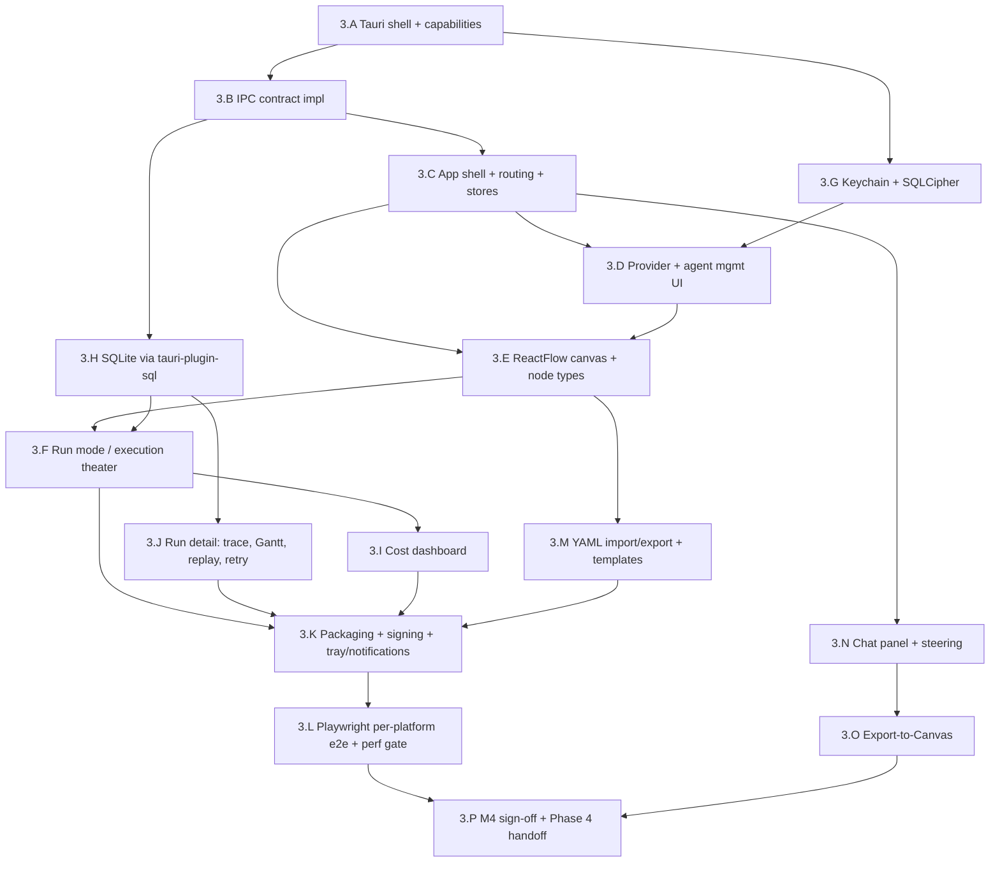

# Phase 3 — Desktop

> Status: Not started (Product Phase 1). Blocked on Phase 2.

- **Related**: [../README.md](../README.md), [phase-2-cli.md](phase-2-cli.md), [phase-4-vscode.md](phase-4-vscode.md), [../../architecture/desktop-architecture.md](../../architecture/desktop-architecture.md), [../../architecture/state-management.md](../../architecture/state-management.md), [../../reference/desktop/routes-and-screens.md](../../reference/desktop/routes-and-screens.md), [../../reference/desktop/tauri-plugins.md](../../reference/desktop/tauri-plugins.md), [../../reference/desktop/database-schema.md](../../reference/desktop/database-schema.md), [../../reference/desktop/keychain-and-secrets.md](../../reference/desktop/keychain-and-secrets.md), [../../reference/contracts/ipc-contract.md](../../reference/contracts/ipc-contract.md), [../../reference/contracts/sse-event-schema.md](../../reference/contracts/sse-event-schema.md), [../../reference/shared-core/store-shapes.md](../../reference/shared-core/store-shapes.md), [../../reference/shared-core/node-types.md](../../reference/shared-core/node-types.md), [../../decisions/0001-tauri-v2-over-electron.md](../../decisions/0001-tauri-v2-over-electron.md), [../../decisions/0007-desktop-is-not-an-ide.md](../../decisions/0007-desktop-is-not-an-ide.md), [../../decisions/0010-zustand-direct-subscriptions-for-reactflow.md](../../decisions/0010-zustand-direct-subscriptions-for-reactflow.md), [../../decisions/0018-desktop-execution-and-rust-egress.md](../../decisions/0018-desktop-execution-and-rust-egress.md)

## Goal

Ship the Tauri v2 desktop app (`apps/desktop`) as Product Phase 1's flagship
surface: a pure **agent-management center** with a ReactFlow workflow canvas,
live run monitoring, local SQLite history, and OS-keychain key storage — fully
usable offline, with no account. Because the engine was proven by the Node
harness (Phase 1) and hardened by the CLI (Phase 2), the new work here is the
canvas, the management UI, and a deliberately **thin Rust layer** that owns only
the privileged, system-level operations the WebView cannot. This phase delivers
global milestone **M4** (the desktop agent-management center).

## Outcomes (Definition of Done)

- A signed, installable build for macOS (`.dmg`), Windows (NSIS/WiX with WebView2
  bootstrap), and Linux (AppImage/deb), launching to a working agent-management
  center with **no account and no network requirement** beyond direct LLM calls.
- A working ReactFlow canvas with all nine custom node components and custom edges,
  backed by `packages/ui`, with Zustand direct subscriptions keeping the canvas at
  60fps during streaming ([ADR-0010](../../decisions/0010-zustand-direct-subscriptions-for-reactflow.md)).
  Only the v1.0-authorable set is functional; `LoopNode` (and any Subworkflow node)
  ships as a reserved (forward-compat; not executable/authorable in v1.0) disabled
  placeholder (see [node-types.md](../../reference/shared-core/node-types.md)).
- The full IPC contract implemented across the Rust/WebView boundary: commands, the
  Rust-delegated `llm_stream` egress with its per-call `Channel<StreamChunk>`, and
  broadcast events ([ipc-contract.md](../../reference/contracts/ipc-contract.md),
  [ADR-0018](../../decisions/0018-desktop-execution-and-rust-egress.md)). Run events do
  **not** cross IPC — the engine's `RunEventBus` runs WebView-side.
- OS-keychain-backed key storage on macOS Keychain / Windows Credential Manager /
  libsecret, with the SQLCipher passphrase derived before plugin init
  ([keychain-and-secrets.md](../../reference/desktop/keychain-and-secrets.md)).
- Live "execution theater": token streaming rendered inside node faces, plus a
  per-run cost dashboard fed by `cost:updated` events.
- Local SQLite run history (`@relavium/db` over `tauri-plugin-sql`) supporting the
  run-detail trace, Gantt timeline, replay, and retry-from-node.
- Workflow YAML import/export that round-trips a git-committed `.relavium.yaml`
  unchanged, plus 3–5 curated starter templates bundled at install.
- A Playwright per-platform e2e suite covering the M4 happy path.

## Scope

### In scope

- **Tauri v2 shell + IPC implementation**: a thin Rust `src-tauri/` owning OS
  integration only — keychain, SQLite, scoped FS, shell, dialog, tray,
  notification, global-shortcut, HTTP, clipboard — with the full IPC contract
  (commands, channels, events) wired and the Tauri v2 capability manifest declared
  per plugin ([tauri-plugins.md](../../reference/desktop/tauri-plugins.md),
  [ipc-contract.md](../../reference/contracts/ipc-contract.md)).
- **App shell** in `apps/desktop/src/` on Vite + React 19 + TanStack Router: the
  typed file-based route tree, persistent shell (top bar, left nav, root-level
  human-gate overlay), and the five Zustand stores
  ([routes-and-screens.md](../../reference/desktop/routes-and-screens.md),
  [store-shapes.md](../../reference/shared-core/store-shapes.md)).
- **OS keychain integration**: per-provider keys stored as discrete keychain
  entries; only a last-4 hint and a status ever cross into the WebView.
- **Provider & agent management UI**: settings/providers screens, the agent
  library, and inline streamed test chat.
- **ReactFlow canvas**: nine custom node components and custom edges from
  `packages/ui` (the v1.0-authorable set is functional; `LoopNode`/Subworkflow are
  reserved (forward-compat; not executable/authorable in v1.0) disabled placeholders
  — see [node-types.md](../../reference/shared-core/node-types.md)), right-hand
  config panel (never modals), graph-locked-during-run behavior, and YAML
  serialize-on-save.
- **Run mode (execution theater)**: live token streaming on node faces driven by the
  WebView-resident engine's `RunEventBus` (LLM tokens reach the engine over the
  Rust-delegated `llm_stream` `Channel<StreamChunk>`; not HTTP SSE in Phase 1), per-node
  status rings, and a live cost accumulator.
- **Local SQLite history**: `@relavium/db` schema applied via `tauri-plugin-sql`;
  run-detail trace, Gantt timeline, event-log replay, retry-from-node, and the
  90-day prune job.
- **Cost dashboard**: per-run and per-node cost waterfall, dashboard cost snapshot,
  always-visible cost on run screens.
- Workflow YAML import/export (git-committable) and the bundled starter templates.
- The `file_change` trigger (the only Phase 1 trigger besides manual).
- `@relavium/core` invoked in the WebView, with the engine's `RunEventBus` running
  WebView-side (run events are produced and consumed in one JS runtime and do **not**
  cross IPC); the only Rust→WebView channel on the LLM hot path is the
  `Channel<StreamChunk>` from the delegated `llm_stream` egress
  ([ADR-0018](../../decisions/0018-desktop-execution-and-rust-egress.md)).
- Packaging, code-signing, notarization, and a Playwright per-platform e2e suite.

### Explicitly out of scope

- **No code editor, file browser, or terminal** — the desktop app is NOT an IDE
  ([ADR-0007](../../decisions/0007-desktop-is-not-an-ide.md)). There is no `/editor`
  route; inline diff review of agent-proposed changes is the VS Code extension's
  job (Phase 4).
- Cloud execution / sync, accounts, the web portal, BullMQ/Redis — Product Phase 2.
- Scheduled / webhook triggers and human-gate email/Slack notifications — Product
  Phase 2.
- The loopback HTTP server's **VS Code-facing** behaviors (open-in-designer, live
  status sync, key hand-off) — the server scaffold lands here, but the extension
  side and its protocol hardening are Phase 4.

## Work breakdown

The workstreams below are ordered to respect the dependency chain: shell and IPC
first, then keychain and persistence, then management UI, then the canvas, then
run mode and cost, then packaging and e2e. The critical-path workstreams are
**3.C → 3.E → 3.F → 3.K → 3.L** (canvas → run mode → SQLite → packaging → e2e
toward M4).

### 3.A — Tauri v2 shell scaffold + capability manifest

Stand up `apps/desktop` with the Tauri v2 Rust core, the Vite/React WebView, and
the per-plugin capability declarations — a thin shell that boots to an empty app.

**Tasks:**
- Scaffold `apps/desktop` in the Turborepo: `src-tauri/` (Rust) + Vite + React 19 +
  TypeScript WebView, wired into pnpm workspaces and Turbo pipelines.
- Add the Tauri v2 plugins from [tauri-plugins.md](../../reference/desktop/tauri-plugins.md):
  `sql`, `keychain`, `fs`, `shell`, `dialog`, `notification`, `tray`,
  `global-shortcut`, `http`, `clipboard`.
- Write `src-tauri/capabilities/` manifests declaring **every** plugin API the
  WebView may call; treat an undeclared call as a known silent-failure mode and add
  capabilities incrementally per workstream.
- Configure the Rust `setup()` hook ordering so privileged init (keychain → derive
  SQLCipher passphrase → SQL plugin) runs before the WebView loads.
- Establish the WebView/Rust trust boundary per
  [desktop-architecture.md](../../architecture/desktop-architecture.md): no secret,
  FS write, or process spawn in the WebView; all privileged work behind a command.

**Acceptance:** `pnpm tauri dev` launches an empty signed-dev window on all three
platforms; a smoke command (`list_workflows` on an empty workspace) returns `[]`
through a declared capability, and an *undeclared* call is shown to fail as
expected in a test.

### 3.B — IPC contract implementation (commands · channel · events)

Implement the canonical Rust↔WebView surface so the WebView can drive the engine
and receive its event stream.

**Tasks:**
- Implement every `#[tauri::command]` in
  [ipc-contract.md](../../reference/contracts/ipc-contract.md): `list_workflows`,
  `load_workflow`, `save_workflow`, `list_agents`, `save_agent`, `start_run`,
  `cancel_run`, `resume_run`, `list_runs`, `get_run_state`, `pick_file`,
  `set_provider_key`, `get_key_status`, `list_mcp_servers`, `llm_stream` — each
  returning a typed `Result` with a typed error.
- Implement the Rust-delegated `llm_stream` egress with its per-call
  `tauri::ipc::Channel<StreamChunk>`: Rust reads the provider key from the keychain by
  reference, attaches the `Authorization` header, performs the streaming HTTPS request,
  and streams provider chunks back over the channel; the channel closes when the call
  ends ([ADR-0018](../../decisions/0018-desktop-execution-and-rust-egress.md)). This is
  the **only** Rust→WebView channel on the LLM hot path. `start_run` kicks off the
  WebView-resident engine run (plus Rust-side bookkeeping: active-run count, checkpoint
  persistence) and returns `{ runId }`; it does **not** push a `Channel<RunEvent>` — run
  events stay WebView-side (below).
- Honor backpressure on the egress channel: when the WebView consumer lags, the
  `Channel<StreamChunk>` buffer fills and the Rust sender awaits (no dropped chunks),
  per the channel semantics in the IPC contract.
- Implement broadcast events: `active-runs-changed`, `mcp-health-changed`,
  `update-available`.
- Build a typed TS client wrapper in the WebView (`invoke(...)` + `Channel`
  subscription) so the rest of the app never touches raw IPC strings; only
  Relavium/Zod seam types cross the boundary.
- Enforce the secrets rule: secrets cross **only inbound** (`set_provider_key`);
  `get_key_status` returns status only, never the key.

**Tasks (engine bridge):**
- Run `@relavium/core` + `@relavium/llm` in the WebView JS runtime with the engine's
  `RunEventBus` WebView-side; the stores subscribe to the in-process bus directly (run
  events never cross IPC). Route operations that need privileged services (DB writes, key
  reads, LLM egress) through commands — LLM tokens arrive over the `llm_stream`
  `Channel<StreamChunk>`, which the WebView adapter folds and the engine re-emits as
  `agent:token` events on its in-WebView bus
  ([ADR-0018](../../decisions/0018-desktop-execution-and-rust-egress.md)).

**Acceptance:** a Node-level integration test (or a headless WebView harness) calls
`start_run` against a 1-node workflow; the WebView-resident engine produces an ordered
`RunEvent` stream on its in-process `RunEventBus` ending in `run:completed`; `cancel_run`
interrupts mid-stream and emits `run:cancelled`; round-tripping a `WorkflowDefinition`
through `save_workflow`/`load_workflow` is byte-stable.

### 3.C — App shell: Vite + React 19 + TanStack Router + stores

Build the typed route tree, the persistent app shell, and the five Zustand stores
the rest of the UI binds to. **Critical path.**

**Tasks:**
- Stand up TanStack Router (typed, file-based) with the route map from
  [routes-and-screens.md](../../reference/desktop/routes-and-screens.md): `/`,
  `/onboarding`, `/workflows`, `/workflows/:id`, `/workflows/:id/runs/:runId`,
  `/agents`, `/settings`, `/settings/providers/:id`.
- Build the persistent shell: top bar (workspace switcher, global Run / command-
  palette trigger), left nav (Dashboard / Workflows / Agents / Settings), and the
  root-level human-gate overlay mount point.
- Implement the five Zustand v5 stores with `immer` per
  [store-shapes.md](../../reference/shared-core/store-shapes.md): `providerStore`,
  `agentStore`, `workflowStore`, `uiStore`, `runStore` — with `runStore` exposing a
  synchronous `handleRunEvent(event)` reducer (a plain call, not `setState`).
- Wire the IPC channel subscription to `runStore.handleRunEvent`, routing by
  `nodeId` into `nodeStatuses` — deliberately **not** into any canvas store.
- Build the Dashboard (recent/active runs, cost snapshot, starter-template gallery)
  and the first-run Onboarding flow (dim canvas-adjacent UI until a provider key
  exists; single "Connect your first API key" CTA).
- Initialize `packages/ui` (shadcn/ui) as the shared component library used by both
  the shell and the canvas.

**Acceptance:** the app boots into the shell, navigates every route with typed
params, shows the onboarding CTA on a fresh profile, and a synthetic `RunEvent` fed
to `runStore.handleRunEvent` updates `nodeStatuses` without touching canvas state.

### 3.D — Provider & agent management UI

The management surfaces: provider/key configuration and the agent library with
inline test chat.

**Tasks:**
- Build `/settings` and `/settings/providers/:id`: providers list, per-provider key
  add/rotate (via `set_provider_key`), key status + last-4 hint (via
  `get_key_status`), and the model catalog with context windows and per-token
  pricing read from `model_catalog`.
- Build `/agents` (agent library): browse/manage `.agent.yaml` agents (model,
  system prompt, tools, temperature/limits, fallback chain), backed by `agentStore`
  with the `agents` table as the cache and the YAML as source of truth.
- Implement inline streamed **test chat** so a user can exercise an agent before
  wiring it into a workflow, consuming the same `agent:token` stream over IPC.
- Wire MCP server registration UI in settings (read via `list_mcp_servers`; health
  via the `mcp-health-changed` event).
- Seed `llm_providers` / `model_catalog` on first launch from a bundled catalog.

**Acceptance:** a user adds an Anthropic key through the OS keychain, sees it as
`valid` with a last-4 hint (never the raw key in the WebView), creates an agent,
and runs a streamed test-chat turn against it end-to-end.

### 3.E — ReactFlow canvas + custom node types + edges

The app's centerpiece: the visual workflow editor with all node types from
`packages/ui` and the ADR-0010 subscription discipline. **Critical path.**

**Tasks:**
- Build the canvas at `/workflows/:id` with ReactFlow v12; hold node/edge/viewport
  state in canvas-local state (`useNodesState`/`useEdgesState` in `CanvasContext`),
  **not** in a global store ([ADR-0010](../../decisions/0010-zustand-direct-subscriptions-for-reactflow.md)).
- Implement the nine custom node components in `packages/ui` per
  [node-types.md](../../reference/shared-core/node-types.md): `AgentNode`,
  `ConditionNode`, `FanOutNode`, `AggregatorNode`, `LoopNode`, `HumanGateNode`,
  `InputNode`, `OutputNode`, `ToolNode` — each memoized and reading only its own
  slice via a `useRunNodeStatus(nodeId)` selector with shallow equality. Only the
  **v1.0-authorable** set is functional; `LoopNode` (and any Subworkflow node) is
  **reserved (forward-compat; not executable/authorable in v1.0)** — rendered as a
  disabled palette placeholder that is **not** draggable onto the graph and **not**
  serialized to YAML, since v1.0 exposes no `loop`/`subworkflow` YAML `type` and the
  Phase-1 engine has no handler for them (see
  [node-types.md](../../reference/shared-core/node-types.md)).
- Implement custom edges (label, optional condition, branch handles referenced as
  `nodeId:handleName`, optional `data_mapping`).
- Build the right-hand **side panel** for node configuration (never modal dialogs),
  driven by the per-type engine config blocks in
  [node-types.md](../../reference/shared-core/node-types.md).
- Serialize canvas state to a `WorkflowDefinition` on save and write it back through
  `workflowStore`; lazy-load full workflow JSON when the canvas opens.
- Lock the graph during an active run (no accidental mutations); Run/Stop controls
  live in the canvas toolbar.
- File-typed input nodes open the native picker (`pick_file` →
  `tauri-plugin-dialog`); support drag-and-drop of files onto the canvas via Tauri
  window drag-drop events + scoped `fs`.

**Acceptance:** a user drags out a 3-node graph (Input → Agent → Output), wires
edges, configures the agent in the side panel, and saves — and a synthetic burst of
`agent:token` events into `runStore` re-renders only the streaming node (verified by
a render-count assertion), never the whole canvas.

### 3.F — Run mode: live execution theater

Turn the canvas into a live view: streaming tokens on node faces, status rings, and
a live cost accumulator, all from the WebView-resident engine's `RunEventBus`. **Critical
path.**

**Tasks:**
- On Run, call `start_run`, then subscribe to the engine's in-WebView `RunEventBus` for
  that `runId` and feed every event into `runStore.handleRunEvent` (run events do not
  cross IPC — [ADR-0018](../../decisions/0018-desktop-execution-and-rust-egress.md); LLM
  tokens reach the engine over the `llm_stream` `Channel<StreamChunk>` and are re-emitted
  as `agent:token` events on the bus); render the **token double-buffer** so high-
  frequency `agent:token` events do not thrash React.
- Render per-node status rings (idle / queued / running / done / error) from
  `node:started` / `node:completed` / `node:failed`, and streaming text inside the
  `AgentNode` face (scrollable, ~10 lines, expandable).
- Animate `FanOutNode` parallel branches, highlight the taken `ConditionNode`
  branch, and show `AggregatorNode` progress — all from the canonical event stream.
  (`LoopNode` has no live iteration animation in Phase 1: it is reserved/non-runnable
  and no Phase-1 engine event drives loop iterations — see
  [node-types.md](../../reference/shared-core/node-types.md).)
- Implement the **human-gate overlay** at the root layout: render on
  `human_gate:paused`, block the canvas, collect the decision, and call `resume_run`
  with the `GateDecision`; reflect `human_gate:resumed`.
- Maintain a live `costAccumulator` in `runStore` from `cost:updated` events
  (`costMicrocents` / `cumulativeCostMicrocents`), surfaced in the canvas toolbar.
- Implement gap detection: on a `sequenceNumber` jump, call `get_run_state` and
  resync rather than trusting a partial view.
- Wire the `file_change` trigger so saving a watched file can start a run.

**Acceptance:** a 3-node workflow runs from the canvas with visible per-token
streaming inside the agent node face, a status ring transitioning to done, a live
cost figure incrementing, and a human gate that pauses, prompts at the root overlay,
and resumes correctly — delivering the run-mode half of **M4**.

### 3.G — OS keychain integration + SQLCipher passphrase

The secrets layer: per-provider keys in the OS keychain and a database passphrase
derived before SQL init.

**Tasks:**
- Implement `set_provider_key` / `get_key_status` in Rust over `tauri-plugin-keychain`,
  storing each secret as a discrete entry (`service = relavium`,
  `account = {providerId}:{keyId}`) so keys rotate/revoke independently
  ([keychain-and-secrets.md](../../reference/desktop/keychain-and-secrets.md)).
- Store only `api_key_keychain_ref` in `llm_providers`; never the key value; surface
  only a last-4 hint to the WebView.
- Read keys **at LLM-call time** in the privileged path to set the `Authorization`
  header; never round-trip a key to the WebView.
- Derive the SQLCipher passphrase from a stable machine secret (IOPlatformUUID /
  MachineGuid / `/etc/machine-id`) combined with a keychain entry, and set it in
  `setup()` **before** `plugin-sql` initializes.
- Implement the opt-in AES-256-GCM `~/.relavium/secrets.enc` fallback for
  keychain-less environments; on Linux fall back when no Secret Service provider is
  running; **never** silently write a key in plaintext — surface an error instead.
- Add the macOS entitlement / keychain access groups needed for hardware-backed
  storage.

**Acceptance:** a key added on one launch is read back (status `valid`) after a full
app restart with no prompt; the encrypted `history.db` opens automatically on
restart; an inspection confirms no plaintext key exists on disk and no key value
ever appears in an IPC payload or log.

### 3.H — Local SQLite persistence via tauri-plugin-sql + @relavium/db

Wire durable storage so runs, events, and costs persist and can be queried.

**Tasks:**
- Apply the `@relavium/db` Drizzle schema to `history.db` over `tauri-plugin-sql`,
  with `PRAGMA journal_mode = WAL` and `PRAGMA foreign_keys = ON` per connection
  ([database-schema.md](../../reference/desktop/database-schema.md)).
- Persist the run lifecycle to the run-history tables as events arrive: `runs`,
  `step_executions`, `messages`, `run_events` (append-only, monotonic `seq`),
  `run_costs`.
- Maintain the catalog tables (`llm_providers`, `model_catalog`, `agents`,
  `workflows`) as caches/snapshots of the authoritative YAML, freezing
  `workflow_definition_snapshot` / `agent_snapshot` per run for reproducibility.
- Implement the per-project `runs.db` (metadata only, unencrypted, git-committable)
  mirror so teammates see run summaries after a `git pull`.
- Implement `list_runs` / `get_run_state` queries, including the "latest run per
  workflow" `ROW_NUMBER() OVER (PARTITION BY workflow_id ...)` query (no SQLite
  `DISTINCT ON`).
- Implement the 90-day `run_events` prune job that runs on app launch.

**Acceptance:** a completed run persists across all run-history tables; `list_runs`
returns it with correct cost in micro-cents; `get_run_state` reconstructs a durable
snapshot; the latest-run-per-workflow query returns one row per workflow; the prune
job deletes only stale `run_events`, retaining `runs`/`step_executions` metadata.

### 3.I — Cost dashboard

Make cost a first-class, always-visible signal across the run surfaces.

**Tasks:**
- Render the per-node cost waterfall on the run-detail screen from `run_costs`
  (integer micro-cents → USD in app code; no IEEE-754 rounding).
- Surface the live per-run cost in the canvas toolbar during a run (from
  `runStore.costAccumulator`).
- Build the Dashboard cost snapshot and cost analytics grouped by workflow/model
  (relying on `idx_runs_cost` / `idx_step_exec_cost`).
- Keep cost visible on every run-related screen rather than a separate billing page.

**Acceptance:** a run's total cost matches the sum of its per-node `run_costs` rows
to the micro-cent; the dashboard snapshot and the per-node waterfall agree.

### 3.J — Run detail: trace, Gantt timeline, replay, retry-from-node

The read-only inspection view over durable history. (Closes the history half of
M4 alongside 3.H.)

**Tasks:**
- Build `/workflows/:id/runs/:runId`: a node-by-node trace from `step_executions`
  and a **Gantt timeline** from per-node `started_at`/`completed_at`/`duration_ms`.
- Replay the persisted `run_events` stream **in `seq` order** through the same
  rendering path the live run uses (one renderer, not a separate code path).
- Render the streamed event-log drawer and the per-node cost waterfall (with 3.I).
- Implement **retry-from-node**: replay from the node's checkpoint, reusing
  completed upstream outputs (seeded from `messages`/`step_executions`), via a new
  run that reuses the engine's checkpoint/resume.
- Implement full replay of a historical run.

**Acceptance:** opening a completed run shows its node-by-node trace and Gantt
timeline; replaying its event log reproduces the same node states; retry-from-node
re-executes only the chosen node and its descendants, reusing upstream outputs.

### 3.K — Packaging, signing, notarization + tray/notifications

Produce installable, signed builds and the OS-integration polish. **Critical path
toward M4.**

**Tasks:**
- Build and sign per platform: macOS `.dmg` (codesign + notarize + staple),
  Windows NSIS/WiX (Authenticode) with the **WebView2 runtime bootstrap**, Linux
  AppImage/deb.
- Implement the system tray (`tauri-plugin-tray`): idle / active / attention states,
  active-run badge (from `active-runs-changed`), awaiting-gate attention state, and
  a "New Run" quick menu.
- Implement native notifications (`tauri-plugin-notification`) for run complete /
  failed / human-gate-waiting, with action buttons.
- Implement the global-shortcut command palette (`Cmd/Ctrl+Shift+A`) in a frameless
  always-on-top window, and "run on selection" (`Cmd/Ctrl+Shift+R`).
- Scaffold the loopback HTTP server (axum, `127.0.0.1` only, dynamic port,
  `~/.relavium/ipc.json` at `0600`, 256-bit bearer token) so Phase 4 can connect;
  declare the macOS `com.apple.security.network.server` entitlement.
- Set `reqwest` request timeout (~120s) and TCP keepalive (~30s) for streaming LLM
  calls; configure the update channel and `update-available` prompt.

**Acceptance:** a clean install on macOS, on a clean Windows 10 VM (WebView2
auto-bootstrapped), and on Linux all launch and pass the M4 happy path; the tray
badge reflects active runs and a gate raises an attention state + notification;
`ipc.json` is written `0600` and the server binds loopback only.

### 3.L — Playwright per-platform e2e + canvas performance gate

Lock the M4 happy path and the streaming-render budget against regressions.
**Critical path toward M4.**

**Tasks:**
- Build a Playwright (WebView-driven) e2e suite covering the full M4 path: install →
  add key → build 3-node workflow → run with live streaming → cost breakdown →
  history + replay — run **per platform** (the cross-platform WebView rendering risk
  from [overview.md](../../architecture/overview.md)).
- Add a streaming **performance gate**: assert per-node render isolation (a token
  event for node A does not re-render node B) and a large-canvas (≥50 node) drag/
  stream frame-budget check, guarding [ADR-0010](../../decisions/0010-zustand-direct-subscriptions-for-reactflow.md).
- Add a YAML round-trip e2e: import a git-committed `.relavium.yaml`, edit nothing,
  export, and assert byte-identical output.
- Add a scope-regression check asserting **no** `/editor` route, file tree, or
  terminal exists ([ADR-0007](../../decisions/0007-desktop-is-not-an-ide.md)).
- Wire the suite into CI (per-platform runners) on every desktop change.

**Acceptance:** the per-platform suite is green in CI; the performance gate fails a
PR that reintroduces canvas-store run routing; the round-trip and scope-regression
checks pass.

### 3.M — Workflow YAML import/export + starter templates

Git-native interoperability and a fast first-run experience.

**Tasks:**
- Implement import (`load_workflow` over a native picker) and export
  (`save_workflow`) that round-trip a `.relavium.yaml` unchanged, stripping/
  placeholdering any secret reference on export
  ([keychain-and-secrets.md](../../reference/desktop/keychain-and-secrets.md)).
- Implement the Workflows-list screen (`/workflows`): enumerate the workspace's
  `.relavium/` files grouped by tag with last-run status; New / Import / Duplicate /
  Delete.
- Bundle 3–5 curated starter templates at install, surfaced in the Dashboard
  gallery and the onboarding flow.

**Acceptance:** importing a hand-authored, git-committed workflow, editing it on the
canvas, and exporting produces a diff limited to the intended edit; a starter
template opens and runs from a fresh install.

### 3.N — Chat panel (`/chat` + `/chat/:sessionId`)

The agent-first conversational surface on the desktop — a **co-equal top-level tab** beside Canvas (the default landing stays the neutral/operational home; the canvas remains the signature surface — see [ADR-0025](../../decisions/0025-agent-surface-refines-desktop-scope.md)). Consumes the WebView-resident `AgentSession` entry point ([agent-sessions.md](../../architecture/agent-sessions.md)).

**Tasks:**
- Build the `/chat` and `/chat/:sessionId` routes: agent picker, context input (auto-detected workspace / active file / git, overridable), a streaming transcript with tool-call annotations, multi-turn input.
- Wire to `AgentSession` via the session IPC commands ([ipc-contract.md](../../reference/contracts/ipc-contract.md)); session events are consumed WebView-side like run events.
- Persist + resume sessions from `history.db` (`agent_sessions` / `session_messages`); a session list with resume.
- Implement the steering affordance — inject a directive into a running/paused agent (`agent:directive_injected`, non-blocking or blocking); a completed turn is immutable.

**Acceptance:** a multi-turn chat streams tokens and tool calls, persists, and resumes after an app restart; the panel honors the FS-scope tier and command allowlist; no editor / file-tree / terminal is present (the agent-capability-vs-IDE-shell line of [ADR-0007](../../decisions/0007-desktop-is-not-an-ide.md) / [ADR-0025](../../decisions/0025-agent-surface-refines-desktop-scope.md)).

### 3.O — Export-to-Canvas (chat → workflow)

The one-click "graduate this conversation to a workflow" affordance ([ADR-0026](../../decisions/0026-session-export-to-workflow.md)).

**Tasks:**
- Add an "Export to Canvas" action on the chat panel / session-history screen that calls `export_session` and opens the resulting `.relavium.yaml` scaffold on the canvas for review before save.
- Surface the linear-chain-plus-transcript result honestly as a *scaffold* (not a finished graph).

**Acceptance:** exporting a session opens a valid, reviewable workflow on the canvas whose agent nodes mirror the session's turns; no secret value is serialized into the export.

### 3.P — M4 sign-off + Phase 4 handoff

Verify the exit criteria and hand the IPC/loopback contract to the VS Code phase.

**Tasks:**
- Run the full exit-criteria checklist (below) on all three platforms and capture
  the signed artifacts.
- Confirm the loopback HTTP server scaffold and `ipc.json` discovery contract are
  documented for Phase 4 (the extension side is built there).
- File any engine ergonomics gaps discovered as **Phase 1 amendments** (re-test in
  the CLI harness), never as desktop-only workarounds.

**Acceptance:** every exit criterion below passes on macOS, Windows, and Linux; M4
is declared achieved; the Phase 4 handoff note (loopback contract + standalone-vs-
hybrid framing) is recorded.

## Milestones

In-phase milestones map to the global spine's **M4** (desktop agent-management
center) and gate Phase 4.

| In-phase milestone | Meaning | Completed by |
|--------------------|---------|--------------|
| P3.M1 (shell) | Shell + IPC + stores live; routes navigate; WebView-resident engine running with its `RunEventBus` wired to the stores and the `llm_stream` egress reachable over its `Channel<StreamChunk>` | 3.A, 3.B, 3.C |
| P3.M2 (manage) | Keychain-backed keys + agent management + test chat working offline | 3.G, 3.D |
| P3.M3 (canvas) | Canvas with the v1.0-authorable node set functional (LoopNode/Subworkflow reserved, disabled), ADR-0010 subscriptions, YAML save | 3.E, 3.M |
| P3.M4 (theater) | Live execution theater: streaming node faces, gate overlay, live cost | 3.F, 3.I |
| P3.M5 (history) | Durable SQLite history with replay, Gantt, retry-from-node | 3.H, 3.J |
| P3.M6 (chat) | Agent chat panel (co-equal tab) + steering + Export-to-Canvas, on the WebView-resident `AgentSession` | 3.N, 3.O |
| **M4** | Signed build; execution theater; replay/Gantt; per-platform e2e green | **3.K, 3.L, 3.P** |

## Dependencies

- **Phase 2 (CLI)** complete: the engine API is proven end-to-end against real
  workflows with durable history and a `--json` CI mode (global milestone **M3**),
  so the canvas builds on a stable consumer contract.
- **Phase 1** artifacts: `@relavium/core` + `@relavium/llm` with checkpoint/resume,
  retry, and provider fallback (M1/M2); the canonical `RunEvent` union.
- `@relavium/db` (local SQLite Drizzle schema) and `packages/ui` (shadcn/ui +
  custom node components), the latter built within this phase.
- Frozen contracts: the [IPC contract](../../reference/contracts/ipc-contract.md),
  [run-event schema](../../reference/contracts/sse-event-schema.md),
  [store shapes](../../reference/shared-core/store-shapes.md),
  [node types](../../reference/shared-core/node-types.md), the
  [database schema](../../reference/desktop/database-schema.md), the
  [keychain reference](../../reference/desktop/keychain-and-secrets.md), and the
  [Tauri plugin inventory](../../reference/desktop/tauri-plugins.md).

## Exit criteria (go / no-go)

All must be true to start Phase 4 (VS Code):

1. Install the signed build, add an API key via the OS keychain, build a 3-node
   workflow on the canvas, run it with live token streaming inside node faces, and
   see the per-node cost breakdown — **all offline, no account** — on macOS,
   Windows (clean Windows 10 + auto-bootstrapped WebView2), and Linux.
2. Run history persists in local SQLite and supports the node-by-node trace, the
   Gantt timeline, event-log replay (in `seq` order), and retry-from-node.
3. A human gate pauses the run at the root overlay and resumes correctly via
   `resume_run`; the tray reflects active runs and the awaiting-gate attention
   state.
4. Workflow YAML import/export round-trips a git-committed file byte-unchanged
   (secret references placeholdered on export).
5. The streaming performance gate passes: a token event for one node does not
   re-render others ([ADR-0010](../../decisions/0010-zustand-direct-subscriptions-for-reactflow.md)),
   and a ≥50-node canvas stays within the frame budget.
6. No secret ever crosses into the WebView (only status + last-4 hint) or appears
   in any IPC payload, run record, or log; the encrypted DB opens without a prompt
   on restart.
7. The app stays within agent-management scope — no code editor, file browser, or
   terminal regressions ([ADR-0007](../../decisions/0007-desktop-is-not-an-ide.md)).
8. The Playwright per-platform e2e suite is green in CI.

## Risks & mitigations

| Risk | Impact | Mitigation |
|------|--------|------------|
| ReactFlow O(n) re-renders at scale | Canvas janks exactly while the user watches a run | Zustand direct subscriptions + separate `runStore`, per-node `useRunNodeStatus` selectors with shallow equality ([ADR-0010](../../decisions/0010-zustand-direct-subscriptions-for-reactflow.md)); a CI performance gate (3.L) |
| Tauri IPC streaming throughput | High-frequency LLM chunks on the `llm_stream` `Channel<StreamChunk>` overwhelm the WebView, which re-emits them as `agent:token` events to the renderer | `Channel<StreamChunk>` backpressure (the Rust sender awaits when the WebView lags — [ADR-0018](../../decisions/0018-desktop-execution-and-rust-egress.md)) + a WebView token double-buffer; measure early, coalesce token events without changing the engine contract. (Run events themselves never cross IPC — the `RunEventBus` is WebView-side.) |
| Scope creep toward an IDE | Erodes the agent-management product boundary | Hard constraint in [ADR-0007](../../decisions/0007-desktop-is-not-an-ide.md); a scope-regression e2e asserting no editor/file-tree/terminal (3.L) |
| Cross-platform keychain differences | Keys fail to store/read on one OS | The keychain abstraction in [keychain-and-secrets.md](../../reference/desktop/keychain-and-secrets.md); never hand-roll crypto, wrap vetted OS primitives; opt-in AES-256-GCM file fallback with no silent plaintext path |
| Cross-platform WebView rendering | The canvas renders subtly differently on WKWebView / WebView2 / WebKitGTK | Per-platform Playwright e2e (3.L); validate the installer on a clean Windows 10 VM for the WebView2 bootstrap |
| SQLCipher passphrase ordering | DB open fails or prompts the user on every launch | Derive from a stable machine secret + keychain entry and set it in `setup()` **before** `plugin-sql` init (3.G) |
| Secret leakage across the boundary | A key reaches the WebView, a log, or a YAML export | Secrets cross only inbound (`set_provider_key`); status-only `get_key_status`; export placeholdering; verified by the no-secret exit criterion (3.P) |
| Engine ergonomics gaps surface in the UI | Tempting to patch in the desktop layer | Treat as Phase 1 amendments re-tested in the CLI harness, never desktop-only workarounds (3.P) |
